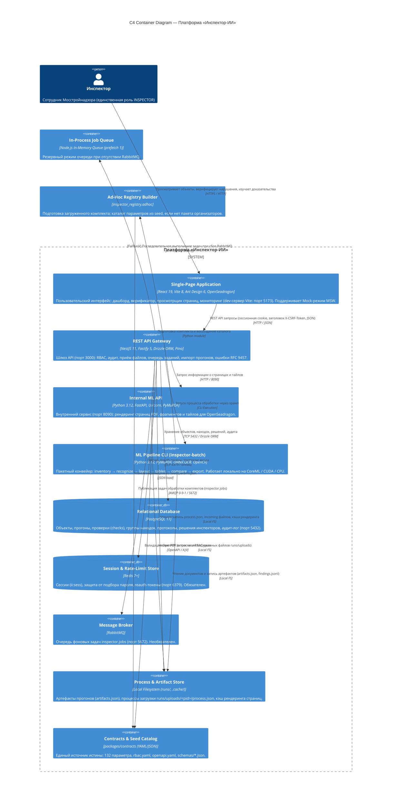
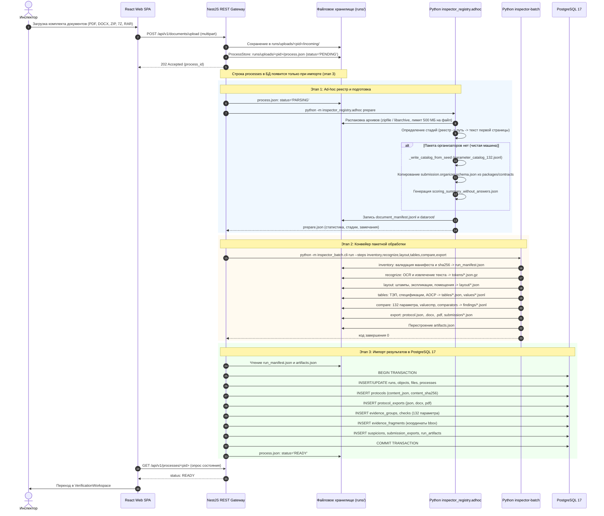
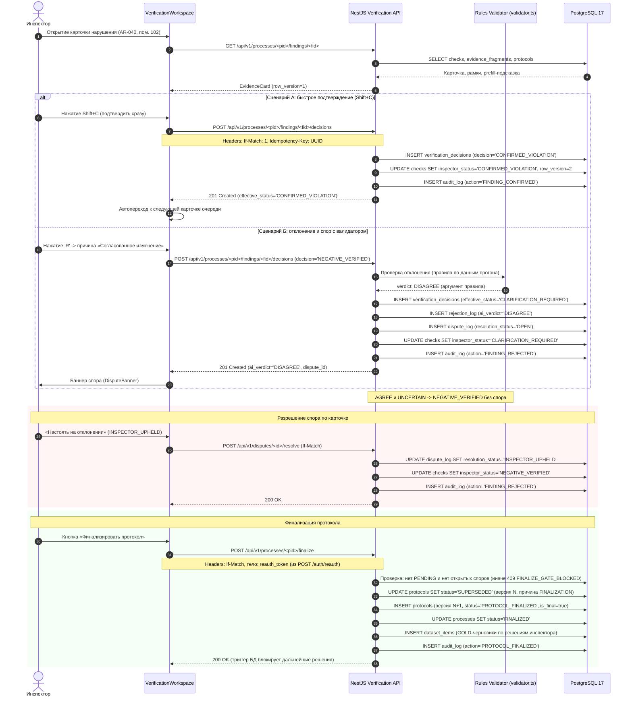

# Архитектура платформы «Инспектор-ИИ» и нормативный реестр 132 параметров сопоставления проектной, рабочей и исполнительной документации

---

## Аннотация

Настоящий документ описывает архитектуру и устройство программного комплекса **«Инспектор-ИИ»** — платформы автоматизированного междокументного сопоставления комплектов проектной (ПД), рабочей (РД) и исполнительной (ИД) документации в строительной отрасли по нормативной матрице из 132 параметров (задача №10 хакатона Мосстройнадзора).

Документ описывает состояние ветки `main` на 29.09.2026 (текущий код репозитория), а не отдельный коммит. Все имена файлов, эндпоинтов, кодов и версий приведены по коду и контрактам (`packages/contracts`); при расхождении с ранее написанными аналитическими отчётами (`docs/analysis`) первичен код.

---

# Оглавление

1. [Часть 1. Архитектура системы «Инспектор-ИИ»](#часть-1-архитектура-системы-инспектор-ии)
   - [1.1. Общий архитектурный стек и концепция Local-First](#11-общий-архитектурный-стек-и-концепция-local-first)
   - [1.2. REST API Gateway (NestJS 11 + Fastify 5)](#12-rest-api-gateway-nestjs-11--fastify-5)
   - [1.3. Локальный конвейер обработки и нейросетевых моделей (Python 3.12 ML Pipeline)](#13-локальный-конвейер-обработки-и-нейросетевых-моделей-python-312-ml-pipeline)
   - [1.4. Клиентское веб-приложение SPA (React 19 + Vite + Ant Design)](#14-клиентское-веб-приложение-spa-react-19--vite--ant-design)
   - [1.5. Брокеры сообщений и хранилища данных](#15-брокеры-сообщений-и-хранилища-данных)
   - [1.6. Автономные Fallback-механизмы (Offline / Jury Box Mode)](#16-автономные-fallback-механизмы-offline--jury-box-mode)
   - [1.7. Работа без пакета организаторов (чистая машина)](#17-работа-без-пакета-организаторов-чистая-машина)
   - [1.8. C4 Container Diagram (Mermaid)](#18-c4-container-diagram-mermaid)
2. [Часть 2. Сквозной жизненный цикл обработки и верификация](#часть-2-сквозной-жизненный-цикл-обработки-и-верификация)
   - [2.1. Подготовка комплекта и Ad-hoc реестр (adhoc.py)](#21-подготовка-комплекта-и-ad-hoc-реестр-adhocpy)
   - [2.2. Пакетный конвейер inspector-batch (6 базовых этапов)](#22-пакетный-конвейер-inspector-batch-6-базовых-этапов)
   - [2.3. Транзакционный импорт прогона в PostgreSQL 17 (RunImportService)](#23-транзакционный-импорт-прогона-в-postgresql-17-runimportservice)
   - [2.4. Рабочее место инспектора-верификатора (VerificationWorkspace)](#24-рабочее-место-инспектора-верификатора-verificationworkspace)
   - [2.5. Протоколы экспорта и интеграционные схемы (PDF, JSON, DOCX, Submission)](#25-протоколы-экспорта-и-интеграционные-схемы-pdf-json-docx-submission)
   - [2.6. Диаграммы последовательностей (Mermaid Sequence Diagrams)](#26-диаграммы-последовательностей-mermaid-sequence-diagrams)
3. [Часть 3. Модель хранения данных](#часть-3-модель-хранения-данных)
   - [3.1. Реляционная схема PostgreSQL 17 (сущности ТЗ §10 и 27 таблиц)](#31-реляционная-схема-postgresql-17-сущности-тз-10-и-27-таблиц)
   - [3.2. Реестр миграций базы данных (0000–0008)](#32-реестр-миграций-базы-данных-00000008)
   - [3.3. Иерархия каталога файловых артефактов runs/](#33-иерархия-каталога-файловых-артефактов-runs)
   - [3.4. Кэширование, хэширование и версионирование нормативной матрицы](#34-кэширование-хэширование-и-версионирование-нормативной-матрицы)
4. [Часть 4. Реестр 132 параметров и механизм пересборки каталога](#часть-4-реестр-132-параметров-и-механизм-пересборки-каталога)
   - [4.1. Аналитическая статистика и верифицированные распределения параметров](#41-аналитическая-статистика-и-верифицированные-распределения-параметров)
   - [4.2. Механизм автономной пересборки каталога (_write_catalog_from_seed)](#42-механизм-автономной-пересборки-каталога-_write_catalog_from_seed)
   - [4.3. Полная сводная матрица 132 параметров платформы (Таблица 1..132)](#43-полная-сводная-матрица-132-параметров-платформы-таблица-1132)
5. [Часть 5. Алгоритмические методы сравнения в движке inspector_compare](#часть-5-алгоритмические-методы-сравнения-в-движке-inspector_compare)
   - [5.1. Скалярные и числовые сопоставления: valuecmp](#51-скалярные-и-числовые-сопоставления-valuecmp)
   - [5.2. Поэлементное сравнение по помещениям: comparators](#52-поэлементное-сравнение-по-помещениям-comparators)
   - [5.3. Спецификации оборудования ГОСТ 21.110 и материалы: specitems, specparams, materials](#53-спецификации-оборудования-гост-21110-и-материалы-specitems-specparams-materials)
   - [5.4. Верификация исполнительных геодезических схем: tolerance](#54-верификация-исполнительных-геодезических-схем-tolerance)
   - [5.5. Каскадный резолвер итогового статуса параметров (132-Row Precedence Resolver)](#55-каскадный-резолвер-итогового-статуса-параметров-132-row-precedence-resolver)
   - [5.6. Таксономия методов сопоставления и фактическое покрытие](#56-таксономия-методов-сопоставления-и-фактическое-покрытие)
6. [Заключение](#заключение)

---

# Часть 1. Архитектура системы «Инспектор-ИИ»

## 1.1. Общий архитектурный стек и концепция Local-First

Платформа «Инспектор-ИИ» построена как локальная система: код продукта не обращается к внешним облачным API (LLM, OCR и т. п.), а документы организаторов не покидают машину, на которой запущен продукт. Модели распознавания берутся из каталога `.models/` и зафиксированы манифестом `tools/models/manifest.json`. Вся обработка графической, табличной и текстовой документации выполняется локально на CoreML (macOS), CUDA (NVIDIA) или CPU.

Система состоит из четырёх уровней:
1. **Клиентский уровень (Web SPA)**: одностраничное приложение на **React 19**, **Vite 8** и **Ant Design 6**. Включает рабочее место инспектора-верификатора (`VerificationWorkspace`) и просмотрщик страниц чертежей на базе **OpenSeadragon 6.1**.
2. **Сервисный уровень (REST API Gateway)**: шлюз на **NestJS 11** и **Fastify 5**, реализующий контракт **OpenAPI 3.0**, ролевую модель доступа (RBAC), неизменяемый аудит-лог мутаций, управление процессами загрузки и транзакционный импорт результатов анализа в базу данных.
3. **Вычислительный конвейер (Python 3.12)**: монорепозиторий `services/ml` под управлением `uv`: консольный оркестратор `inspector_batch`, сервис рендеринга страниц `inspector_ml_api` и библиотеки распознавания, анализа планировок, извлечения таблиц и сопоставления фактов.
4. **Уровень хранения и сообщений**: **PostgreSQL 17**, **Redis** (сессии и одноразовые токены), **RabbitMQ** (необязательная очередь заданий) и файловое хранилище артефактов `runs/`.

---

## 1.2. REST API Gateway (NestJS 11 + Fastify 5)

Шлюз API расположен в каталоге `apps/api` и построен как монолит с разбиением по функциональным каталогам.

### 1.2.1. Стек и конфигурация
- **Ядро:** `@nestjs/core: ^11.2.6`, `@nestjs/common: ^11.2.6`.
- **HTTP-драйвер:** `@nestjs/platform-fastify: ^11.2.6`, `fastify: 5.11.3`.
- **ORM и доступ к базе данных:** `drizzle-orm: ^0.45.3`, `pg: ^8.23.0`, генерация миграций через `drizzle-kit: ^0.31.11`.
- **Логирование:** структурированный JSON-лог через `pino: ^10.3.1` и `nestjs-pino: ^5.2.1`.
- **Конфигурация:** валидация переменных окружения с префиксом `INSPECTOR_*` на базе схемы `zod: ^4.6.5` (`apps/api/src/config/config.ts`).

### 1.2.2. Организация кода
Классов `XxxModule` в API нет. Точка сборки — единый динамический модуль `AppModule.forRoot()` (`apps/api/src/app.module.ts`): он подключает контроллеры и провайдеры из функциональных каталогов `apps/api/src/modules/` (17 каталогов) и каталога `apps/api/src/objects`, а также глобальные guard, interceptor и фильтр ошибок. Каталоги и их назначение:
- `auth`: локальный вход по логину и паролю, сессии в Redis, хэширование паролей Argon2id (`m=19456 KiB, t=2, p=1`), сессионная cookie (`__Host-ii_sid` при включённом `cookieSecure`, иначе `ii_sid`), CSRF-токен (возвращается в теле ответа на вход и передаётся обратно в заголовке `X-CSRF-Token`, в cookie он не хранится), одноразовые токены повторного подтверждения (`reauth`), RBAC из `packages/contracts/rbac.yaml`, пользователи. Ролевая модель состоит из одной суперроли «Инспектор» (`INSPECTOR`: все разрешения, область `ALL`; демо-логин `inspector`, `apps/api/src/modules/auth/seed.ts`).
- `audit`: неизменяемый журнал аудита (`audit_log`) всех мутирующих запросов.
- `objects` (`apps/api/src/objects`): объекты строительства и их файлы.
- `upload`: приём загрузок (multipart), проверка лимитов, очередь заданий `JobQueue`, файловое хранилище процессов `ProcessStore`, воркер `UploadJob` (подготовка комплекта → пакетный прогон → импорт).
- `processes`: состояние процессов загрузки, журнал и прогресс по этапам.
- `import` (и `apps/api/src/batch-import`): транзакционная загрузка результатов прогона `inspector-batch` (`artifacts.json`, протокол, находки) в реляционные таблицы.
- `verification`: рабочее место верификатора: карточки находок, решения (подтверждение, отклонение, уточнение), правила-валидатор отклонений и журнал споров (`dispute_log`), финализация протокола, эталонные записи `dataset_items`.
- `protocols`: выдача версий протокола и файлов экспорта (JSON, DOCX, PDF).
- `render`: постраничные изображения PDF и тайлы для просмотрщика; запросы проксируются во внутренний сервис `ml-api`, результаты кэшируются на диске.
- `annotations`: облака изменений и подписи помещений страницы из артефакта `layout/<file_id>.json`.
- `dashboard`: сводка по объектам, индикатор («светофор») по последнему протоколу и итоги по разделам.
- `monitoring`: проверка доступности узлов (`probes.ts`), системные метрики и метрики Prometheus (`/metrics`).
- `selftest`: самопроверка негативных сценариев (порядка двадцати проверок работающего API).
- `normative`: каталог 132 параметров, нормативные ссылки и переопределение порогов с версионированием матрицы.
- `rin`: заглушка интеграции с ИАИС «РиН» (отправка подтверждённых нарушений финализированного протокола, журнал попыток, mock-приёмник внутри API).
- `ml-report`: еженедельный отчёт по решениям инспекторов для дообучения моделей.
- `archive`: «архивирование» объектов, импортированных прогонов и процессов загрузки (скрытие из списков; данные остаются в БД).
- `shared`: общие утилиты (поиск, валидация, путь к артефактам).

### 1.2.3. Конвейер безопасности и перехватчиков (Guards & Interceptors)
В `apps/api/src/app.module.ts` зарегистрирован глобальный конвейер обработки запросов:
1. `AuthGuard`: проверяет сессию и права доступа по атрибуту `x-permission` операции OpenAPI (коды разрешений — в `rbac.yaml`). Действия с признаком `reauth: true` (например, финализация и отмена финализации протокола, управление пользователями, утверждение и откат модели) дополнительно требуют одноразовый токен повторной аутентификации (`POST /api/v1/auth/reauth`, срок 5 минут).
2. `OpenApiRequestGuard`: валидирует параметры пути, строки запроса и тело против `packages/contracts/openapi/openapi.yaml` (AJV).
3. `RequestContextInterceptor`: создаёт контекст запроса на базе `AsyncLocalStorage` (`requestId`, `principal`, действие аудита) и записывает мутации в аудит-лог.
4. `OpenApiResponseInterceptor`: проверяет исходящие ответы на соответствие контракту; включён, когда `validateResponses` истинно (по умолчанию — вне `prod`).
5. `ProblemFilter`: преобразует ошибки в формат `application/problem+json` (RFC 7807/9457) с кодами из `packages/contracts/errors.yaml`.

---

## 1.3. Локальный конвейер обработки и нейросетевых моделей (Python 3.12 ML Pipeline)

Алгоритмическая обработка сосредоточена в `services/ml`. Монорепозиторий управляется `uv` и разделён на приложения и библиотеки:

```
services/ml/
├── apps/
│   ├── inspector_batch/      # CLI-оркестратор пакетного конвейера обработки комплектов
│   └── ml_api/               # Внутренний FastAPI-сервис рендеринга страниц PDF (страница, фрагмент, тайл)
└── packages/
    ├── inspector_common/      # Общие контракты, пути, хэширование, реестр параметров
    ├── inspector_registry/    # Распаковка архивов, ad-hoc манифест, каталог 132 параметров
    ├── inspector_docproc/     # Извлечение текста, OCR (ONNX: CoreML/CUDA/CPU)
    ├── inspector_layout/      # Разметка чертежей, экспликации, QR, облака изменений
    ├── inspector_tables/      # Таблицы: ТЭП, спецификации ГОСТ 21.110, АОСР, скаляры
    ├── inspector_compare/     # Сопоставление 132 параметров, резолвер статусов, экспорт, протокол
    ├── inspector_hypothesis/  # Гипотезы и свободные находки (FREE-*), противоречия значений
    └── inspector_eval/        # Локальный расчёт метрик качества
```

### 1.3.1. Архитектура распознавания (OCR) и извлечения текста
- **Первичный контур:** токены и координаты слов из векторного текстового слоя PDF через PyMuPDF (`fitz`).
- **Вторичный контур (ONNX OCR):**
  - детекция текстовых линий: модель **PP-OCRv6** (ONNX);
  - распознавание символов: модель **PP-OCRv5** (кириллица, ONNX);
  - исполнитель выбирается автоматически (`--providers auto`, функция `resolve_provider_mode` в `services/ml/packages/inspector_docproc/src/inspector_docproc/models.py`): **CoreML** на macOS → **CUDA**, только если сессия CUDA реально создаётся и работает → **CPU**. Явно можно указать `cpu`, `coreml` или `cuda`; замороженный (`strict`) прогон требует явного исполнителя и при его недоступности завершается ошибкой `CONFIG_INVALID`, не подменяя его. Выбранный исполнитель и причину печатает `make gpu-check` (`tools/models/gpu_check.py`);
  - зависимость на Linux x86_64 и Windows — `onnxruntime-gpu` с CUDA 12 (pip-колёса `cuda`/`cudnn`); при отсутствии видеокарты работа продолжается на CPU. На macOS и Linux не x86_64 используется обычный `onnxruntime`;
  - число рабочих процессов на GPU ограничено значением `INSPECTOR_CUDA_MAX_WORKERS` (по умолчанию 4).

### 1.3.2. Внутренний сервис рендеринга (`inspector_ml_api`)
FastAPI-приложение (`services/ml/apps/ml_api/src/inspector_ml_api/app.py`). По умолчанию слушает `127.0.0.1:8090`; адрес вне loopback допускается только при `INSPECTOR_ML_API_ALLOW_REMOTE=1` (так он запускается в Docker внутри сети compose). Маршруты (ответ — PNG):
- `POST /v1/render/page` — страница целиком;
- `POST /v1/render/crop` — фрагмент страницы (по нормализованному bbox);
- `POST /v1/render/tile` — тайл пирамиды в соглашении Deep Zoom;
- `POST /v1/render/page-info` и `GET /health`.

Параметры рендеринга (`render.py`): разрешение по умолчанию `DEFAULT_MAX_DPI = 288` (полноразмерное изображение — страница в 288 dpi), допустимый диапазон `9…600` dpi (`MAX_DPI = 600`), размер тайла `DEFAULT_TILE_SIZE = 512` пикселей. Просмотрщик использует собственный источник тайлов OpenSeadragon (`apps/web/src/features/evidence/pageSource.ts`). Сервис также разрешает файлы загруженных комплектов по идентификаторам вида `U<8hex>-<n>` в `runs/uploads/*/dataroot`. Дисковый кэш результатов рендеринга ведёт API (модуль `render`): `<INSPECTOR_CACHE_ROOT>/render/v1/<sha256 файла>/p<страница>/…`.

---

## 1.4. Клиентское веб-приложение SPA (React 19 + Vite + Ant Design)

Клиентская часть расположена в `apps/web`:
- **Базовый стек:** React 19 (`react: 19.3.0`), сборщик Vite 8 (`vite: ^8.3.1`), TypeScript.
- **Интерфейсная библиотека:** Ant Design (`antd: ^6.6.5`) с русской локализацией и шрифтом `Golos Text` (с системным запасным).
- **Маршрутизация:** `react-router: ^8.4.0`.
- **Серверный кэш:** `@tanstack/react-query: ^5.104.0`.

### Ключевые экраны системы:
1. **Сводный дашборд (`DashboardPage`):** сводка по объектам, индикатор по последнему протоколу, итоги по разделам.
2. **Объекты и паспорт объекта (`ObjectsPage`, `ObjectPage`):** файлы объекта по стадиям ПД/РД/ИД, мастер загрузки комплекта (`UploadWizard`).
3. **Монитор процесса (`ProcessPage`):** прогресс по этапам обработки. Взвешенный процент (`weightedPercent`) вычисляется в API (`apps/api/src/modules/upload/process-store.ts`, `STEP_WEIGHTS`: распознавание — 75, разметка — 8, таблицы — 4, инвентаризация, сравнение и импорт — по 3, подготовка и экспорт — по 2); страница показывает его, скорость распознавания (страниц в минуту) и журнал.
4. **Рабочее место верификатора (`VerificationWorkspace`):** очередь карточек, просмотрщик доказательств, панель решений, горячие клавиши, диалоги финализации.
5. **Просмотрщик доказательств (`EvidenceViewer`, `EvidencePane`; `apps/web/src/features/evidence/`):** панели страниц ПД (синяя рамка) и РД/ИД (красная рамка) на OpenSeadragon; цвет рамки определяется ролью источника: `EXPECTED`/`SUPPORTING_EXPECTED` — синий, `ACTUAL`/`SUPPORTING_ACTUAL` — красный; для прочих ролей цвет берётся по стадии (ПД — синий, РД/ИД — красный). Дополнительно отображаются облака изменений (фиолетовый пунктир) и контуры помещений (серый). Страницы каждого файла переключаются вкладками с значением параметра на этой стадии (`stage_values`); полоса вкладок прокручивается горизонтально внутри своей панели, выбранная вкладка удерживается в поле зрения. На странице подсвечиваются рамки извлечённого значения: значение находится по токенам слов страницы (`services/ml/packages/inspector_compare/src/inspector_compare/valuebox.py`); для значения с печатным написанием учитывается «печатная форма» (`printed`, например «i=0,01»), а для односимвольных значений положение значения в контексте, которое сообщает экстрактор (`ctx_at`), выбирает нужное вхождение.
6. **Протокол (`ProtocolPage`):** форма Приложения № 2 к ТЗ, версии протокола, скачивание JSON, PDF, DOCX.
7. **Мониторинг (`MonitoringPage`):** состояние сервисов (PostgreSQL, Redis, RabbitMQ), системные метрики.

---

## 1.5. Брокеры сообщений и хранилища данных

Штатный состав хранилищ:
- **PostgreSQL 17**: сущности ТЗ §10, версии протоколов, решения инспекторов, неизменяемый аудит-лог.
- **RabbitMQ**: очередь фоновых заданий `inspector.jobs` с `prefetch = 1`; необязателен (см. 1.6.1). В `docker-compose.infra.yml` используется `rabbitmq:3.13-management`, в полном `docker-compose.yml` — `rabbitmq:3-management`.
- **Redis** (нужен Redis 7 и новее: API использует `EXPIRE … NX`): активные сессии (`ii:sess:<sha256 токена>`), одноразовые токены повторного подтверждения (`ii:reauth:<sha256>`), счётчики неудачных попыток входа (`ii:fail:ip:<ip>`) и временные блокировки IP (`ii:block:ip:<ip>`). В `docker-compose.infra.yml` — `redis:8`, в `docker-compose.yml` — `redis:7`.
- **Файловая система (`runs/`)**: артефакты прогонов (токены страниц, разметка, таблицы, находки, протоколы и экспорт), а также `runs/uploads/<process_id>/` — состояние процессов загрузки и распакованные комплекты.

---

## 1.6. Автономные Fallback-механизмы (Offline / Jury Box Mode)

Требование к платформе — запуск и демонстрация на отдельной машине без внешних сетевых сервисов и без пакета данных организаторов. Часть внешних зависимостей необязательна (RabbitMQ, пакет организаторов), часть обязательна (PostgreSQL, Redis).

### 1.6.1. Очередь задач: RabbitMQ и резервный режим в процессе (`JobQueue`)
Реализовано в `apps/api/src/modules/upload/job-queue.ts`:
- **Быстрый таймаут подключения:** `connect()` ограничен **2 секундами** (`Promise.race`); если RabbitMQ не отвечает, API продолжает работу.
- **Сбои в рантайме:** на соединении и канале AMQP перехватываются события `'error'` и `'close'`; сбой вызывает `fallback()`, переводящий очередь в режим `mode = 'in-process'`:
  ```typescript
  const fallback = (why: string) => {
    if (this.channel !== ch) return;
    this.channel = null;
    this.mode = 'in-process';
    this.log.warn(`RabbitMQ недоступен (${why}); задачи выполняются в процессе API.`);
    this.scheduleRetry();
  };
  ```
- **Локальный воркер:** в режиме `in-process` `enqueue(processId)` помещает идентификатор в массив `this.local` и запускает последовательную вычитку `drain()`; сохраняется правило **prefetch = 1** (один ресурсоёмкий прогон за раз).
- **Автоповтор:** каждые 15 секунд таймер `scheduleRetry()` (`unref()`) пытается восстановить связь с брокером.
- **Восстановление после рестарта:** `UploadService.onApplicationBootstrap` сканирует `runs/uploads/` и возвращает в очередь процессы со статусами `PENDING` и `PARSING`.

### 1.6.2. Сессии: Redis обязателен (`SessionStore`)
Реализовано в `apps/api/src/modules/auth/session-store.ts` и `apps/api/src/modules/auth/index.ts`:
- Аутентификация использует `RedisSessionStore` (класс `InMemorySessionStore` — тестовый двойник для автотестов).
- Клиент Redis (`ioredis`) создаётся с `lazyConnect: true`, `maxRetriesPerRequest: 1`, `connectTimeout: 2000` и `commandTimeout: 2000` мс.
- Если Redis недоступен, хранилище выбрасывает `SessionStoreUnavailableError`, вход и проверка сессий завершаются ошибкой (код `SESSION_STORE_UNAVAILABLE` в контракте).
- Итог: Redis — обязательная зависимость для работы с авторизацией; RabbitMQ — необязательная (см. 1.6.1).

### 1.6.3. Файловое хранилище процессов (`ProcessStore`)
`ProcessStore` (`apps/api/src/modules/upload/process-store.ts`) хранит жизненный цикл загрузки в `runs/uploads/<process_id>/process.json` (статусы `PENDING`, `PARSING`, `READY`, `FAILED`):
- запись атомарна: данные пишутся во временный файл `.tmp`, затем `renameSync`;
- хранилище не зависит от PostgreSQL: состояние загрузок, журнал и прогресс этапов доступны, пока не выполнен импорт в БД. Строка процесса в таблице `processes` появляется только при импорте прогона (см. 2.3).

### 1.6.4. Зондирование инфраструктуры (`probes.ts`)
В `apps/api/src/modules/monitoring/probes.ts` реализованы TCP-пробы:
- `probeRedis`: подключение к порту 6379, отправка `PING\r\n`, ожидание `PONG`;
- `probeRabbit`: подключение к порту 5672, отправка заголовка AMQP `AMQP\x00\x00\x09\x01`, проверка ответа брокера.
- В `MonitoringService.services()` RabbitMQ помечен `optional: true`; если он недоступен, формируется предупреждение `RABBITMQ_DOWN` («RabbitMQ недоступен: задания выполняются внутри процесса (резервный режим)»), общий статус готовности не ухудшается.

### 1.6.5. Standalone Mock-режим веб-интерфейса (MSW)
Для демонстрации интерфейса без СУБД и бэкенда в клиентском приложении подключён **Mock Service Worker** (`msw: ^2.15.0`). Режим включается командой `pnpm run dev:mock` (`VITE_API_MOCK=1 vite`): запросы к API перехватываются сервис-воркером в браузере и обслуживаются тестовыми данными.

### 1.6.6. Запуск в Docker
Продукт целиком запускается одной командой `docker compose up -d --build`; веб-интерфейс доступен на `http://localhost:8080` (nginx отдаёт SPA и проксирует `/api` и `/metrics` на `api:3000`). Сервисы `docker-compose.yml`:
- `postgres` (`postgres:17`), `redis` (`redis:7`), `rabbitmq` (`rabbitmq:3-management`);
- `migrate` — одноразовый контейнер: миграции БД и демо-аккаунт;
- `api` — NestJS вместе с Python-конвейером в одном образе `inspector-ai/app`; API запускает `inspector-batch` как дочерний процесс;
- `ml-api` — тот же образ, команда `inspector-ml-api serve`;
- `web` — nginx (образ `inspector-ai/web`), единственный порт, опубликованный на хост;
- именованные тома `runs`, `cache`, `pgdata`, `redisdata`, `rabbitdata`.

Дополнительные файлы-надстройки: `docker-compose.gpu.yml` (устройства NVIDIA для `api`; исполнитель CUDA выбирается автоматически; в самом файле отмечено, что на реальном оборудовании он не проверялся) и `docker-compose.data.yml` (пакет данных организаторов монтируется только для чтения). Размеры образов по данным `docs/runbook/DOCKER.md`: приложение 4,9 ГБ, веб — 60 МБ. Проверка в CI (`.github/workflows/docker.yml`): сборка, `docker compose up`, ожидание готовности всех сервисов, вход, загрузка тестового пакета до статуса `READY`, получение протокола и изображения страницы.

Нативный запуск (`make dev`) не изменился; инструкции: `docs/runbook/LINUX.md` (Linux) и `docs/runbook/DOCKER.md` (Docker).

---

## 1.7. Работа без пакета организаторов (чистая машина)

### 1.7.1. Суть проблемы
Модуль подготовки комплекта (`services/ml/packages/inspector_registry/src/inspector_registry/adhoc.py`) строит для загруженных файлов собственный каталог данных (`dataroot`). Часть служебных файлов конвейер берёт из пакета организаторов; на машине без этого пакета (стенд жюри, чистая установка) они должны создаваться из репозитория:
1. `parameter_catalog_132.jsonl` — каталог 132 параметров;
2. `submission_schema.json` — схема ответа;
3. `scoring_summary_without_answers.json` — веса критериев оценки.

Если файл найден в пакете организаторов, он копируется; недостающие файлы воссоздаются.

### 1.7.2. Реализация
1. **Каталог параметров (`_write_catalog_from_seed`):** функция читает `packages/contracts/seed/params.json` через `load_params()` и для каждой `ParamSpec` записывает строку каталога:
   ```python
   def _write_catalog_from_seed(target: Path) -> None:
       """parameter_catalog_132.jsonl rebuilt from params seed (ParamSpec.to_catalog_row)."""
       from inspector_common.params import load_params
       with target.open("w", encoding="utf-8") as fh:
           for spec in load_params():
               fh.write(json.dumps(spec.to_catalog_row().model_dump(mode="json"), ensure_ascii=False) + "\n")
   ```
2. **Схема ответа:** `submission_schema.json` копируется из контрактов репозитория: `packages/contracts/schemas/submission.organizer.schema.json`.
3. **Веса критериев:** `scoring_summary_without_answers.json` формируется из константы в коде:
   ```python
   _SCORING_SUMMARY = {
       "weights_points": {
           "finding_detection_f1": 60,
           "source_localization_exact_file_page": 15,
           "normalized_value_and_status_accuracy": 15,
           "document_integrity_and_split_handling": 10,
       },
       "critical_miss_gate": "При пропуске любой утверждённой критической контрольной точки итоговый балл ограничивается 59 из 100.",
       "submission_schema": "submission_schema.json",
   }
   ```
4. **Пустые обучающие реестры:** создаются пустые файлы `public_train_checks.jsonl` и `public_train_finding_groups.jsonl`.
5. **Манифест и сплит:** создаётся `split_policy.json`, где загруженный объект зарегистрирован как `TRAIN_PUBLIC`.

Таким образом, конвейер обработки пользовательских загрузок работает без пакета организаторов.

### 1.7.3. Лимиты загрузки
Максимальный размер одного файла — **500 МБ**, суммарный размер пакета — **5 ГБ**. Элементы архива крупнее 500 МБ пропускаются с замечанием в журнале процесса. Отдельные замечания формируются для пустой папки стадии в архиве и для отсутствующей стадии (см. 2.1.2).

---

## 1.8. C4 Container Diagram (Mermaid)

На диаграмме C4 Container показаны контейнеры системы, протоколы взаимодействия, порты и резервный режим очереди. (Запуск в Docker — с nginx перед API и SPA — описан в 1.6.6.)



---

# Часть 2. Сквозной жизненный цикл обработки и верификация

## 2.1. Подготовка комплекта и Ad-hoc реестр (`adhoc.py`)

Обработка начинается с загрузки пакета документов инспектором через веб-интерфейс (`POST /api/v1/documents/upload`).

### 2.1.1. Идентификация и именование
- API сохраняет полученные файлы в `runs/uploads/<process_id>/incoming/`.
- Функция `object_id_for(process_id)` формирует код объекта вида `OBJ-UPLOAD-<8hex>`.
- Загруженным файлам присваиваются идентификаторы вида `U<8hex>-0001`, `U<8hex>-0002`, …, не пересекающиеся между загрузками (первичный ключ `files.id` в PostgreSQL).

### 2.1.2. Распаковка архивов и защита от атак
- Поддерживаемые типы файлов: `.pdf`, `.docx`, `.xml`.
- Поддерживаемые архивы: `.zip`, `.7z`, `.rar`.
- Распаковка (`inspector_registry.archives`) не запускает внешних утилит: `.zip` читается модулем Python `zipfile` с декодированием имён без флага UTF-8 (cp437 → байты → cp866), `libarchive` служит запасным вариантом; `.7z`, `.rar` (RAR4 и RAR5) и прочие форматы читаются через `libarchive-c`. Внешний `unrar` не используется.
- **Политики безопасности:**
  * максимальный размер отдельного файла: **500 МБ** (`MAX_FILE_BYTES`); элементы архива крупнее пропускаются с замечанием;
  * суммарный объём пакета: **5 ГБ** (`MAX_PACKAGE_BYTES`);
  * защита от выхода за пределы каталога: элементы с небезопасными путями (`..`, абсолютные) пропускаются;
  * зашифрованные и неподдерживаемые элементы пропускаются с замечанием.
- **Замечания о стадиях:** если в архиве есть папка стадии без файлов (например, «Исполнительная документация»), в журнал процесса записывается: *«Папка «{папка}» архива «{архив}» пуста: документов стадии {стадия} в ней нет.»*; если после подготовки в комплекте нет документов одной из стадий ПД/РД/ИД, добавляется замечание: *«В комплекте нет документов стадии {стадия}: сравнения, которым она нужна, получат статус «документ отсутствует» или «сравнение невозможно».»*

### 2.1.3. Определение стадии документа (`stage`)
Стадия (`PD`, `RD`, `ID`) определяется каскадом с приоритетами:
1. **Пользовательский реестр (`REGISTRY`):** приложенный файл реестра (CSV, XLSX, XLSM, JSON) с сопоставлением заголовков без учёта регистра (`file`, `имя файла`, `stage`, `стадия`).
2. **Путь и имя файла (`PATH`):** токены путей (`проект/пд/п` → `PD`, `рабоч/рд/р` → `RD`, `исполнит/аоср/ид` → `ID`).
3. **Текст первой страницы (`TITLE_TEXT`):** первые 4000 символов текстового слоя (PyMuPDF), разбор титульного листа.
4. **Резервное значение (`UNKNOWN`):** уточняется на шаге `inventory` по штампу (ГОСТ 21.101).

---

## 2.2. Пакетный конвейер `inspector-batch` (6 базовых этапов)

Воркер `UploadJob` (`apps/api/src/modules/upload/upload-job.ts`) сначала вызывает подготовку комплекта:
```bash
python -m inspector_registry.adhoc prepare --upload-dir <runs>/uploads/<pid> --object-name <имя> --object-id <OBJ-UPLOAD-…> [--registry <файл реестра>]
```
затем запускает пакетный прогон (переменная окружения `INSPECTOR_WORKERS` принимает то же значение, что и `--workers`; число воркеров — `INSPECTOR_UPLOAD_WORKERS`, по умолчанию 8, в Docker-примере — 2):
```bash
python -m inspector_batch.cli --data-root <upload-dir>/dataroot --runs-root <runs> --run-id upload-<pid[:8]> --log-format console run --object <object_id> --steps inventory,recognize,layout,tables,compare,export --workers <N>
```

| Этап | Пакет / Модуль | Назначение | Выходные артефакты в `runs/<run_id>/` |
|---|---|---|---|
| **1. inventory** | `inspector_registry.batch` | Инвентаризация файлов, сверка с `document_manifest.jsonl`, контрольные суммы SHA-256, число страниц, уточнение стадий. | `run_manifest.json`, `inventory/index.json`, `inventory/{object_id}.json` |
| **2. recognize** | `inspector_docproc.batch` | Извлечение векторного текста PDF, ONNX OCR (детекция PP-OCRv6 + распознавание PP-OCRv5), слова и строки с координатами. | `tokens/{file_id}/p{page05}.json.gz`, `tokens/index.json`, `recognize_summary.json` |
| **3. layout** | `inspector_layout.batch` | Анализ чертежей: основные надписи (штампы), QR-коды, номера и экспликации помещений, облака изменений. | `layout/{file_id}.json` |
| **4. tables** | `inspector_tables.batch` | Реконструкция таблиц: ТЭП, спецификации ГОСТ 21.110, ведомости, АОСР; нормализация физических величин. | `tables/{file_id}.json`, `values/{object_id}.jsonl` |
| **5. compare** | `inspector_compare.batch` | Междокументное сопоставление по 132 параметрам (ПД↔РД, ПД↔ИД, РД↔ИД): `valuecmp`, `comparators`, `specitems`, `materials`, `tolerance`, `precedence`; свободные находки `inspector_hypothesis`. Здесь же формируются подозрения на противоречия значений: противоречащие значения одного параметра в файлах ОДНОЙ стадии (правило `HR-LOG-101`, метод `LOGICAL_ANALYSIS`, `services/ml/packages/inspector_hypothesis/src/inspector_hypothesis/valueconflict.py`). Они попадают в Раздел 6 протокола и в очередь верификации и никогда не учитываются как нарушения. | `findings/{object_id}.groups.jsonl`, `findings/{object_id}.jsonl` |
| **6. export** | `inspector_compare.batch` | JSON-протокол (`protocol.schema.json`), протоколы DOCX и PDF, файл посылки `submission.json` и сайдкар. | `protocol/{object_id}.json`, `.docx`, `.pdf`, `submission/{object_id}.json` |

После каждого шага перестраивается манифест `artifacts.json` (пути, хэши и размеры файлов).

---

## 2.3. Транзакционный импорт прогона в PostgreSQL 17 (`RunImportService`)

Импорт выполняет `RunImportService` (`apps/api/src/modules/import/run-import.service.ts`):
1. **Валидация манифеста и целостности:** загрузка `run_manifest.json` и `artifacts.json`, проверка по JSON Schema, сверка `run_id` и контрольных сумм.
2. **Изоляция тестовой выборки (`TEST_HIDDEN`):** артефакты закрытых объектов из `split_policy.json` не читаются с диска и не попадают в БД; в результат импорта добавляется предупреждение `HIDDEN_TEST_ARTIFACTS_DROPPED` (элемент списка `warnings`, не статус аудита). Событие аудита создания версии протокола — `PROTOCOL_VERSION_CREATED`.
3. **Транзакционный план (`import-plan.ts`):**
   - создание/обновление записей `runs`, `objects`, `files`, `processes`;
   - сохранение протокола в `protocols` с каноническим хэшем `content_sha256`;
   - регистрация файлов экспорта в `protocol_exports` (форматы `json`, `docx`, `pdf`);
   - группы находок — в `evidence_groups`;
   - проверки по параметрам — в `checks`. Ручная работа защищена: если по проверке решение принято инспектором (`decided_by = 'INSPECTOR'`), оно сохраняется, а при изменении хэша содержимого находки выставляется `review_required_reason = 'VALUE_CHANGED'`. Колонки инспектора (`inspector_status` … `decision_comment`) записываются только при первой вставке;
   - координаты полигонов и рамок — в `evidence_fragments`;
   - гипотезы и подозрения — в `suspicions`;
   - ссылки на тяжёлые артефакты — в `run_artifacts`; файлы посылки — в `submission_exports`.
4. **Атомарная фиксация:** все записи вставляются в одной транзакции. Процесс получает статус `READY`, если для него есть протокол, иначе остаётся в `PARSING`.

---

## 2.4. Рабочее место инспектора-верификатора (`VerificationWorkspace`)

Интерфейс (`apps/web/src/features/verification/Workspace.tsx`) реализует требования ТЗ §9.3.

### 2.4.1. Трёхпанельная компоновка
1. **Левая панель (очередь карточек, внутренняя функция `QueueList` в `Workspace.tsx`):**
   - фильтры (вкладки с русскими подписями; ключи `ALL`, `PENDING`, `CLARIFICATION`, `CONFIRMED`, `NEGATIVE`, `DISPUTES`): «Все», «Ожидают», «Уточнение», «Подтверждено», «Отклонено», «Споры»;
   - метка критичности в строке карточки: «крит.» (`CRITICAL_SUSPEND`, оранжево-красная) или «сущ.» (прочие);
   - код параметра (например, `AR-040`), значок статуса и локализация (помещение или «объект в целом»).
2. **Центральная панель (просмотр доказательств, `EvidenceViewer`/`EvidencePane` в `apps/web/src/features/evidence/`):**
   - панели страниц ПД и РД/ИД на OpenSeadragon, автоматическое приближение к фрагменту находки;
   - вкладки страниц по файлам и значения по стадиям (`stage_values`), подсветка рамок значения (см. 1.4).
3. **Правая панель (`CardPanel`, `DecisionPanel`):**
   - описание параметра, нормативное обоснование, эталонное и фактическое значения, дельта;
   - подсказка основания (prefill) от сервера;
   - панель решения (`DecisionPanel.tsx`) и баннер спора с правилами-валидатором (`DisputeBanner` в `CardPanel.tsx`).
   Индикатор `Meter` (внутренняя функция `Workspace.tsx`) считает время, нажатия клавиш и клики на карточку; при числе кликов больше 3 он окрашивается в красный (критерий ТЗ «не более 3 кликов»).

### 2.4.2. Рабочий процесс инспектора
Клавиши (`apps/web/src/features/verification/hotkeys.ts`; физические коды клавиш, поэтому одинаково работают в русской раскладке):
- **Подтвердить нарушение (`CONFIRMED_VIOLATION`):** **C** открывает решение с подсказанным основанием; **Shift+C** подтверждает сразу (основание и комментарий по умолчанию).
- **Отклонить (`NEGATIVE_VERIFIED`):** **R**, затем выбор причины цифрой 1–9 (или мышью) и необязательный комментарий. Причины (`DecisionRejectReason` в `packages/contracts/enums.yaml`): `WRONG_REVISION` — «Актуальная редакция выбрана неверно»; `APPROVED_CHANGE` — «Согласованное изменение»; `OCR_ERROR` — «Ошибка распознавания (OCR)»; `EXTRACTION_ERROR` — «Ошибка извлечения значения»; `CV_ERROR` — «Ошибка распознавания графики»; `LINKING_ERROR` — «Ошибка привязки»; `WITHIN_TOLERANCE` — «Расхождение в пределах допуска / нормы»; `EQUIVALENT_SOLUTION` — «Равнозначное решение»; `METHODOLOGY_DIFFERENCE` — «Различие методики подсчёта»; `NOT_APPLICABLE_PARAM` — «Параметр неприменим к объекту / виду работ»; `DUPLICATE` — «Дубликат другого finding»; `OTHER` — «Иное».
- **Требует уточнения (`CLARIFICATION_REQUIRED`):** **U**, основание цифрой 1–8 (`DecisionClarifyBasis`): `REVISION_CONFLICT`, `APPROVAL_UNKNOWN`, `AMBIGUOUS_CHAIN`, `NO_REGISTRY`, `AWAITING_DOCUMENT`, `AWAITING_APPROVAL_CHECK`, `SOURCE_UNREADABLE`, `EXPERT_CONSULTATION`.
- **Прочее:** Enter сохраняет решение (в поле комментария — Ctrl+Enter), Esc закрывает форму, J/↓ и K/↑ — следующая и предыдущая карточка, N — следующая необработанная, T — секундомер, `?`/F1 — справка. Кнопки «Взять в работу» в интерфейсе нет (эндпоинт claim в API сохранён).
- **Отмена решения (Undo):** Ctrl/Cmd+Z в течение окна `undo_window_ms` (по умолчанию 10 000 мс, `UNDO_WINDOW_MS`); решение возвращается в `PENDING` (`REVERT_TO_PENDING`).
- **Оптимистическая блокировка:** запросы решений передают `If-Match: <row_version>`; при конфликте возвращается HTTP 409 `VERSION_CONFLICT`.

**Валидатор отклонений и журнал споров (`dispute_log`).** При каждом отклонении выполняется валидатор — детерминированный набор правил (`apps/api/src/modules/verification/domain/validator.ts`), а не языковая модель. Он использует только данные прогона (запись находки, ссылки на доказательства, реестр файлов) и выдаёт вердикт `AGREE`, `UNCERTAIN` или `DISAGREE` с аргументом и идентификаторами сработавших правил.
  * `AGREE` и `UNCERTAIN` → карточка получает статус `NEGATIVE_VERIFIED`;
  * `DISAGREE` → отклонение удерживается в статусе `CLARIFICATION_REQUIRED`, создаётся запись `dispute_log` со статусом `OPEN`, в интерфейсе показывается баннер спора с аргументом валидатора.
  Инспектор разрешает спор (`POST /api/v1/disputes/{dispute_id}/resolve`, `If-Match`): `INSPECTOR_UPHELD` (настоять на отклонении, нужен собственный комментарий) → `NEGATIVE_VERIFIED`; `AI_UPHELD` (согласиться) → `CONFIRMED_VIOLATION`; `KEPT_CLARIFICATION` → `CLARIFICATION_REQUIRED`. В перечислении `DisputeResolutionStatus` есть также `ESCALATED` и `WITHDRAWN`.

**Финализация протокола.** `POST /api/v1/processes/{id}/finalize` требует одноразовый токен `reauth_token` (простая ЭП решения инспектора) и заголовок `If-Match`. Условие допуска: нет карточек в статусе `PENDING` и нет открытых споров, иначе ответ 409 `FINALIZE_GATE_BLOCKED` с перечнем блокирующих карточек. При финализации создаётся НОВАЯ версия протокола N+1 со статусом `PROTOCOL_FINALIZED` и признаком `is_final = true`; предыдущая версия получает статус `SUPERSEDED` (причина `FINALIZATION`), процесс переходит в `FINALIZED`. Триггер БД `verification_block_when_finalized` запрещает дальнейшие записи решений. Для финального протокола создаются эталонные записи `dataset_items` (GOLD-черновики по решениям инспектора). Отмена финализации — отдельная операция (`protocol.unfinalize`, `reauth: true`, с причиной), она создаёт новую версию протокола.

---

## 2.5. Протоколы экспорта и интеграционные схемы (PDF, JSON, DOCX, Submission)

### 2.5.1. Канонический JSON-протокол
Формируется модулем `inspector_compare.protocol.builder` по схеме `packages/contracts/schemas/protocol.schema.json`. Основное тело — семь разделов Приложения № 2 к ТЗ (`appendix2`):
1. статус загрузки документов;
2. сводная статистика (с процентами);
3. параметры, не проверенные из-за отсутствия ИД;
4. критические нарушения;
5. существенные нарушения;
6. подозрения ИИ (гипотезы и противоречия значений; не нарушения);
7. резолютивная часть (7.1 по критическим, 7.2 по существенным нарушениям).

Кроме этого в протокол входят: приложение А — пять сводных таблиц ТЗ §9.2 п. 4 (`tz92_tables`), карточки доказательств (`evidence_cards`: файлы, страницы, координаты фрагментов, обоснования), реестр входных файлов с хэшами (`input_registry`), подпись и версии конвейера.

### 2.5.2. Протокол DOCX
Формируется `docx_render.py` (библиотека `python-docx`) в оформлении образца «Приложение 2» из ТЗ: страница A4, поля 20/20/30/15 мм (сверху/снизу/слева/справа), шрифт «Segoe UI». Миниатюры фрагментов чертежей делает `thumbs.py` (`card_thumbnails`): синяя рамка вокруг фрагмента эталона (ПД) и красная — вокруг фактического (РД/ИД).

### 2.5.3. Протокол PDF
`pdf.py` работает в два этапа:
1. `html_render.py` строит самодостаточный HTML по форме Приложения № 2;
2. PDF создаёт системный Chrome/Chromium/Edge/Brave (путь можно задать переменной `INSPECTOR_CHROMIUM`) командой с `--headless=new --print-to-pdf`. При отсутствии браузера применяется запасной вариант — PyMuPDF Story (без миниатюр; DOCX миниатюры сохраняет).

### 2.5.4. Схемы посылки (Submission) и интеграция с РиН
- `submission.organizer.schema.json`: официальный формат ответа участника, поставляется организаторами без изменений.
- `submission.strict.schema.json`: наш ужесточённый вариант организаторской схемы: те же поля, все обязательные, более строгие типы и правила согласованности метки и статуса. Любой ответ, валидный по strict, валиден и по organizer.
- `submission.extended.schema.json`: полная посылка `submission/<object_id>.json` — организаторская схема плюс необязательные дополнительные поля (`comparison_result`, `location_type`, `finding_id`, `confidence` и др.).
- `submission_sidecar.schema.json`: сайдкар `submission/<object_id>.sidecar.json` — контрольные суммы, версии, состояние файлов, тайминги и `freeze_tag` для замороженного прогона; в ответ участника не входит.
- **РиН:** модуль `rin` — заглушка интеграции с ИАИС «РиН». Эндпоинты: `POST /api/v1/processes/{process_id}/rin/send` (отправить результаты; только для `PROTOCOL_FINALIZED`), `GET /api/v1/processes/{process_id}/rin` (статус синхронизации и журнал попыток), `GET /api/v1/processes/{process_id}/rin-payload/preview` (что будет передано: только подтверждённые инспектором нарушения). Получатель — mock-эндпоинт внутри самого API; повторы 1/5/15 минут вне `prod`/`demo` сжимаются до секунд. XML-протокола в продукте нет.

---

## 2.6. Диаграммы последовательностей (Mermaid Sequence Diagrams)

### 2.6.1. Сквозной жизненный цикл обработки комплекта



---

### 2.6.2. Рабочий процесс инспектора, валидация отклонений и разрешение споров



---

### 2.6.3. Переопределение матрицы параметров и версионирование

```mermaid
sequenceDiagram
    autonumber
    actor Insp as Инспектор
    participant UI as Нормативная база (веб)
    participant API as NestJS Normative API
    participant Repo as NormativeRepository
    participant DB as PostgreSQL 17
    participant ML as Python Engine (inspector_common)

    Insp->>UI: Изменение допуска параметра AR-040 (min_value: 1.2 -> 1.4)
    UI->>API: PUT /api/v1/normative/params/AR-040 (разрешение params.manage)
    API->>Repo: save(code, patch, reason, user)
    Repo->>DB: BEGIN TRANSACTION
    Repo->>DB: INSERT INTO matrix_versions (base_version, reason, changes) RETURNING version
    Note over DB: Новая версия, например: version=2
    Repo->>DB: INSERT INTO params_overrides (param_code, min_value, max_value, is_active, matrix_version) ON CONFLICT DO UPDATE
    Repo->>DB: COMMIT TRANSACTION
    Repo-->>API: версия матрицы (version=2)
    API->>API: Версия «<matrixVersion>+ovr.<version>», например «1.1.1+ovr.2»
    API->>API: Запись .cache/matrix_overrides.json (matrix_version, overrides)

    note over ML: Следующий запуск сравнения или загрузка параметров
    ML->>ML: load_params()
    ML->>ML: Ключ файла (путь, mtime_ns, размер) .cache/matrix_overrides.json (_file_key)
    alt Файл изменился
        ML->>ML: Сброс кэшированного реестра
        ML->>ML: Применение переопределений к params.json
        ML->>ML: matrix_version: версия из файла, если она начинается с базовой (1.1.1); иначе «1.1.1+ovr.<первые 8 символов sha256 файла>»
        ML->>ML: Пересчёт content_sha256 по изменённым параметрам
    else Файл не менялся
        ML->>ML: Возврат кэшированного объекта ParamRegistry
    end
```

---

# Часть 3. Модель хранения данных

## 3.1. Реляционная схема PostgreSQL 17 (сущности ТЗ §10 и 27 таблиц)

ТЗ §10 описывает 16 сущностей (таблицы 1–16). Не все из них хранятся отдельной таблицей PostgreSQL: часть живёт в файлах контрактов, часть покрыта другим механизмом. Колонка «Реализация» показывает, как обстоит дело с каждой сущностью. Всего в базе 27 таблиц: 23 описаны через Drizzle `pgTable` и ещё 4 созданы «сырым» SQL в миграции `0006_tz_modules_a.sql`.

| № | Сущность ТЗ §10 | Реализация в СУБД / Репозитории | Таблица в PostgreSQL / Схема | Ключевые поля (ТЗ и расширения) |
|---|---|---|---|---|
| **1** | **Params** | `packages/contracts/seed/params.json` (справочник, 132 записи) + таблица переопределений | `params_overrides` (raw SQL, миграция 0006) | В таблице: `param_code`, `min_value`, `max_value`, `is_active`, `matrix_version`, `updated_by`, `updated_at`. Остальные поля Params (`code`, `parameter_name`, `source_pd`, `source_rd`, `source_id`, `sp_reference`, `gost_reference`, `fz_reference` и др.) находятся только в `params.json` |
| **2** | **Checks** | `apps/api/src/modules/import/import.schema.ts` | `checks` | `id`, `param_id`, `object_id`, `expected_value`, `actual_value`, `completeness_status`, `finding_status`, `review_priority`, `evidence_group_id`, `finding_id`, `inspector_status`, `decided_by` |
| **3** | **Objects** | `apps/api/src/db/schema.ts` | `objects` | `id`, `name`, `address`, `customer`, `contractor`, `permit_number`, `split`, `indicator_color`, `archived_at` |
| **4** | **Files** | `apps/api/src/db/schema.ts` | `files` | `id`, `object_id`, `doc_stage`, `discipline`, `document_code`, `revision`, `approval_status`, `approval_date`, `predecessor_id`, `file_hash`, `file_path`, `uploaded_at` |
| **5** | **Protocols** | `apps/api/src/modules/import/import.schema.ts` | `protocols` | `id`, `object_id`, `version`, `matrix_version`, `dataset_version`, `model_version`, `input_manifest_hash`, `status`, `created_at`, `finalized_at`, `content_json`, `content_sha256` |
| **6** | **Rejection_Log** | `apps/api/src/modules/verification/verification.schema.ts` | `rejection_log` | `id`, `violation_id` (FK `checks.id`), `decision_id`, `rejection_reason`, `ai_verdict`, `suggested_fix`, `retraining_status` |
| **7** | **Dispute_Log** | `apps/api/src/modules/verification/verification.schema.ts` | `dispute_log` | `id`, `violation_id` (FK `checks.id`), `decision_id`, `inspector_comment`, `ai_comment`, `resolution_status`, `resolved_by` |
| **8** | **Suspicions** | `apps/api/src/modules/import/import.schema.ts` | `suspicions` | `id`, `object_id`, `discovery_method`, `confidence`, `description`, `inspector_status`, `suspicion_key`, `process_id` |
| **9** | **Logical_Rules** | `services/ml/packages/inspector_hypothesis/src/inspector_hypothesis/data/logical_rules.json` + `rules.py` (модель `LogicalRule`, `RuleSet`, `RuleEngine`) | Таблицы в БД нет: правила читаются из файла | В файле 12 правил (`HR-LOG-001`…`HR-LOG-012`, версия набора `hr-log-1.1.0`). Поля правила: `id`, `rule_code`, `version`, `rule_name`, `description`, `scope`, `let`, `condition`, `expected`, `normative_base`, `normative_refs`, `severity`, `base_confidence`, шаблоны сообщений, `norm_check`. `is_active` есть в модели `LogicalRule` (по умолчанию `true`); в JSON явно не записан |
| **10** | **Normative_Base** | Нормативные ссылки и пороги — в `params.json` (`references`, `sp_reference`, `gost_reference`, `fz_reference`, `norm_verification`); журнал правок порогов — таблица версий матрицы (`apps/api/src/modules/normative`) | `matrix_versions` (raw SQL, миграция 0006) + `params_overrides` | В `matrix_versions`: `version`, `base_version`, `reason`, `changes` (jsonb), `created_by`, `created_by_login`, `created_at`. Полей `document_name`, `section`, `effective_from`, `effective_to` в схеме нет |
| **11** | **ML_Retraining_Log** | Не отдельная таблица. Отчёт по дообучению строится модулем `apps/api/src/modules/ml-report` из решений инспектора (страница веб-клиента «Отчёт по дообучению», `/admin/ml-report`); исходные данные — `verification_decisions`, `rejection_log.retraining_status`, `dataset_items` | Таблицы `ml_retraining_log` нет | Поля вида `precision`, `recall`, `f1`, `approval_status`, `approved_by` в схеме БД не хранятся. Проект цикла дообучения описан в `docs/analysis/06_feedback_retraining_weekly_report.md` |
| **12** | **Audit_Log** | `apps/api/src/modules/audit/audit.schema.ts` | `audit_log` (Append-Only) | `id`, `user_id`, `action`, `object_id`, `details`, `timestamp`, `ip_address`, `user_agent`, `actor_type`, `category`, `result` |
| **13** | **Monitoring_Metrics** | Не отдельная таблица. Модуль `apps/api/src/modules/monitoring`: реестр метрик `metrics.registry.ts` (формат Prometheus), пробы `probes.ts`, эндпоинт `GET /metrics`, страница `/admin/monitoring` | Таблицы `monitoring_metrics` нет | Метрики хранятся в памяти процесса API и отдаются по запросу |
| **14** | **Evidence_Fragments** | `apps/api/src/modules/import/import.schema.ts` | `evidence_fragments` | `id`, `evidence_group_id`, `file_id`, `stage`, `sheet_page`, `bbox_polygon_norm`, `extracted_value`, `role_expected_actual`, `check_id` |
| **15** | **Dataset_Items** | `apps/api/src/modules/verification/verification.schema.ts` | `dataset_items` | `id`, `evidence_group_id`, `gold_label`, `expert_id`, `reason_code`, `dataset_version`, `split`, `object_group_id`, `gold_record` |
| **16** | **Model_Versions** | Не отдельная таблица. Версии фиксируются в колонках `versions` (jsonb) таблиц `runs`, `protocols`, `dataset_items`; модели закреплены в `tools/models/manifest.json` (sha256 каждого файла) | Таблицы `model_versions` нет | Поля вида `artifact_hash`, `approval_status`, `deployed_at`, `rollback_to` в схеме БД отсутствуют |

### Полный состав 27 таблиц
Таблицы 1–23 описаны через Drizzle `pgTable`:
1. `runs` — метаданные запусков пакетов, параметры окружения, хэши манифестов;
2. `objects` — реестр строительных объектов, адрес, заказчик, подрядчик, индикатор риска;
3. `files` — реестр документов, стадии (PD/RD/ID), шифры, хэши SHA-256;
4. `users` — учетные записи пользователей с хэшами Argon2id;
5. `user_roles` — роли пользователей (миграция 0008 консолидировала роль `INSPECTOR`);
6. `object_assignments` — назначения инспекторов на объекты;
7. `audit_log` — журнал действий, защищенный триггером от UPDATE и DELETE (append-only);
8. `processes` — жизненный цикл фоновых процессов обработки;
9. `process_files` — связь процессов и файлов;
10. `protocols` — протоколы проверок с иммутабельным JSON и хэшем;
11. `protocol_exports` — зарегистрированные экспорты (PDF, DOCX, JSON, XML);
12. `evidence_groups` — группы находок, объединяющие атомарные проверки по параметру и локации;
13. `checks` — атомарные проверки по 132 нормативным параметрам;
14. `evidence_fragments` — пространственные полигоны и bounding box на чертежах;
15. `suspicions` — находки свободного поиска (FREE-topics) и подозрения ИИ;
16. `submission_exports` — зафиксированные файлы посылок;
17. `run_artifacts` — claim-check реестр файлов прогона на диске;
18. `verification_decisions` — append-only журнал решений эксперта;
19. `rejection_log` — протокол отклонений нарушений с оценкой ИИ-валидатора;
20. `dispute_log` — журнал разногласий инспектора и валидатора;
21. `dataset_items` — размеченные эталонные черновики для циклов переобучения ML;
22. `verification_idempotency` — реестр ключей идемпотентности для предотвращения дублирования решений;
23. `ui_events` — телеметрия пользовательского опыта (клики, тайминги, клавиши).

Таблицы 24–27 созданы «сырым» SQL в `apps/api/drizzle/0006_tz_modules_a.sql`, описания Drizzle для них нет:
24. `matrix_versions` — журнал версий матрицы параметров (`version`, `base_version`, `reason`, `changes`, `created_by`, `created_by_login`, `created_at`);
25. `params_overrides` — переопределения `min_value`, `max_value`, `is_active` по коду параметра;
26. `rin_deliveries` — очередь и состояние отправки протоколов в интеграцию «РиН» (статус, число попыток, `next_attempt_at`, `payload_sha256`);
27. `rin_attempts` — журнал попыток отправки в «РиН» (номер попытки, исход, HTTP-статус, длительность).

---

## 3.2. Реестр миграций базы данных (0000–0008)

Миграции СУБД расположены в `apps/api/drizzle/`:
- `0000_init.sql` — базовые таблицы `runs`, `objects`, `files`.
- `0001_owner_comments_and_file_identity.sql` — контроль целостности файлов и комментарии владельцев.
- `0002_platform_auth_audit_import.sql` — развертывание подсистем безопасности, аудита, процессов, протоколов и проверок.
- `0003_platform_audit_append_only_and_protocol_immutability.sql` — установка жестких триггеров PostgreSQL: запрет любых модификаций `audit_log` и блокировка изменений финализированных протоколов.
- `0004_verification.sql` — таблицы рабочего места верификатора (`verification_decisions`, `rejection_log`, `dispute_log`, `dataset_items`, `verification_idempotency`, `ui_events`).
- `0005_widen_document_status.sql` — расширение длины поля статуса документа до 64 символов.
- `0006_tz_modules_a.sql` — «сырые» SQL-таблицы `matrix_versions` и `params_overrides` (версионирование матрицы параметров), `rin_deliveries` и `rin_attempts` (очередь и журнал попыток отправки в «РиН»).
- `0007_archive.sql` — поля `archived_at` в `objects` и `runs` для мягкого архивирования данных.
- `0008_single_inspector_role.sql` — перевод пользователей системы на единую роль `INSPECTOR`.

---

## 3.3. Иерархия каталога файловых артефактов `runs/`

Файловая структура каталога прогона регламентирована контрактом `packages/contracts/run_layout.yaml`:

```
runs/<run_id>/
├── run_manifest.json                       # [RUN_MANIFEST] Манифест прогона (AG-01)
├── run_context.<command>.json              # [RUN_CONTEXT] Контекст запуска команды (AG-00)
├── artifacts.json                          # [RUN_ARTIFACTS] Индексный реестр всех файлов прогона
├── pipeline_summary.json                   # [PIPELINE_SUMMARY] Итоги выполнения шагов конвейера
├── recognize_summary.json                  # [RECOGNIZE_SUMMARY] Итоги шага распознавания (AG-02A)
├── inventory/
│   ├── index.json                          # [INVENTORY_INDEX] Сводка инвентаризации
│   └── <object_id>.json                    # [INVENTORY] Детализация по объекту
├── tokens/
│   ├── index.json                          # [TOKENS_INDEX] Сводка распознанных токенов
│   └── <file_id>/
│       ├── p00001.json.gz                  # [PAGE_TOKENS] Токены и bboxes страницы
│       └── p00002.json.gz
├── layout/
│   └── <file_id>.json                      # [LAYOUT] Штампы, помещения, слои, экспликации
├── tables/
│   └── <file_id>.json                      # [TABLES] Таблицы ТЭП, экспликаций, спецификаций
├── values/
│   └── <object_id>.jsonl                   # [EXTRACTED_VALUES] Нормализованные факты
├── findings/
│   ├── <object_id>.groups.jsonl            # [FINDING_GROUPS] Группы нарушений (FindingGroup)
│   └── <object_id>.jsonl                   # [FINDINGS] Атомарные проверки по 132 параметрам
├── protocol/
│   ├── <object_id>.json                    # [PROTOCOL_JSON] Канонический протокол Приложения 2
│   ├── <object_id>.docx                    # [PROTOCOL_DOCX] Документ Word с миниатюрами
│   └── <object_id>.pdf                     # [PROTOCOL_PDF] Итоговый отчет в формате PDF
├── submission/
│   ├── <object_id>.json                    # [SUBMISSION] Официальный ответ (extended)
│   └── <object_id>.sidecar.json            # [SUBMISSION_SIDECAR] Метаданные проверки
├── submission-strict/
│   └── <object_id>.json                    # [SUBMISSION_STRICT] Строгий ответ без служебных полей
└── score/
    └── score.json                          # [SCORE] Метрики оценки (для обучающих прогонов)
```

---

## 3.4. Кэширование, хэширование и версионирование нормативной матрицы

- **Базовая версия:** Эталонная матрица лежит в `packages/contracts/seed/params.json`, `matrix_version` = `1.1.1` (версия `1.1.0` была начальным seed этапа M0, см. `packages/contracts/seed/README.md`). Поле `content_sha256` — sha256 канонического JSON параметров и словарей (по описанию в README seed); стандарт RFC 8785 (JCS) не заявляется.
- **Механизм переопределений (Overrides):** администратор через API меняет `min_value`, `max_value` или `is_active` параметра. Изменения записываются в `params_overrides`, каждая правка добавляет строку в `matrix_versions`, а набор переопределений выгружается в файл `.cache/matrix_overrides.json` (или файл из `INSPECTOR_MATRIX_OVERRIDES`; значение `off` отключает переопределения).
- **Версия матрицы с переопределениями.** API формирует её как `<matrixVersion>+ovr.<matrix_versions.version>` (`apps/api/src/modules/normative/normative.service.ts`). Python-часть (`inspector_common/params.py`) берёт версию из файла переопределений, если она начинается с базовой версии; иначе использует `<base>+ovr.<первые 8 символов sha256 сырого файла>`.
- **Хэш содержимого.** Если хотя бы один параметр действительно изменился, `content_sha256` пересчитывается:
  $$\text{content\_sha256} = \text{sha256}\big(\text{base\_content\_sha256} + \text{"\textbackslash n"} + \text{json.dumps}(\{\text{код} \to \text{патч}\},\ \text{sort\_keys=True},\ \text{ensure\_ascii=False})\big)$$
  В словарь входят только коды реально изменённых параметров. Если переопределения не меняют значений, хэш остаётся базовым.
- **Кэш в памяти.** Функция `_load_params_cached` в `inspector_common/params.py` декорирована `@cache`. Её аргумент — ключ файла переопределений `(путь, st_mtime_ns, st_size)`. При изменении файла на диске ключ меняется, и матрица загружается заново без перезапуска процесса.

---

# Часть 4. Реестр 132 параметров и механизм пересборки каталога

## 4.1. Аналитическая статистика и верифицированные распределения параметров

Ниже приведены распределения, посчитанные по `packages/contracts/seed/params.json`:

1. **Общее число параметров:** **132**.
2. **Уровни реализуемости (Feasibility Tiers).** Tier — оценка сложности извлечения значения из документов, заданная в матрице (`feasibility_tier`), а не признак того, что сравнение реализовано (фактическое покрытие — в разделе 5.6):
   - **Tier A** (наиболее простое извлечение: числа и перечисления из таблиц и текста): **38** параметров.
   - **Tier B** (составные правила, спецификации, контекстная фильтрация): **63** параметра.
   - **Tier C** (данные на чертежах и семантика текста; трудно извлекаемые): **27** параметров.
   - **Tier D** (внешние системы и реестры): **4** параметра (`OOS-098`, `OOS-099`, `OOS-100`, `OOS-101`).
   - *Контрольная сумма:* 38 + 63 + 27 + 4 = **132**.
3. **Приоритеты демонстрации (Demo Priorities):**
   - **T1** (первый приоритет демонстрации, поле `demo_priority` = 1): **16** параметров.
   - **T2** (второй приоритет демонстрации): **30** параметров.
   - **T3** (остальные параметры): **86** параметров.
   - *Контрольная сумма:* 16 + 30 + 86 = **132**.
4. **Методы извлечения данных (Extraction Methods):**
   - **TABLE_TEXT** (таблицы ТЭП, балансы, ведомости): **40** параметров (Tier A: 23, Tier B: 15, Tier C: 2).
   - **FREE_TEXT_REGEX** (регулярные выражения по тексту с контекстными гейтами): **34** параметра (Tier A: 14, Tier B: 20).
   - **SPEC_TABLE** (таблицы заказных спецификаций ГОСТ 21.110): **24** параметра (Tier A: 1, Tier B: 23).
   - **DRAWING_GEOMETRY** (данные, снимаемые с чертежей: размеры, расстояния, уклоны): **22** параметра (все Tier C).
   - **SEMANTIC** (контекстный семантический анализ текстовых разделов): **8** параметров (Tier B: 5, Tier C: 3).
   - **EXTERNAL_SYSTEM** (запросы к внешним системам): **4** параметра (все Tier D).
   - *Контрольная сумма:* 40 + 34 + 24 + 22 + 8 + 4 = **132**.
5. **Типы данных (Data Types):**
   - **number** (скалярные числа, площади, объемы, высоты, нагрузки, диаметры, сечения): **84** параметра.
   - **enum** (перечисления, классы, категории, порядковые шкалы): **24** параметра.
   - **string** (строковые наименования, марки, текстовые характеристики): **13** параметров.
   - **boolean** (бинарное наличие / отсутствие систем или проектных решений): **10** параметров.
   - **coordinate** (координатные привязки и геодезические отметки): **1** параметр (`SPZU-034`).
   - *Контрольная сумма:* 84 + 24 + 13 + 10 + 1 = **132**.
6. **Распределение по 16 разделам проектной документации:**
   - **ПЗ** (Пояснительная записка): **23** параметра.
   - **СПЗУ** (Схема планировочной организации земельного участка): **16** параметров.
   - **АР** (Архитектурные решения): **14** параметров.
   - **КР** (Конструктивные и объемно-планировочные решения): **14** параметров.
   - **ППМ** (Мероприятия по обеспечению пожарной безопасности): **13** параметров.
   - **ПОС** (Проект организации строительства): **9** параметров.
   - **ОДИ** (Мероприятия по обеспечению доступа инвалидов): **9** параметров.
   - **ПОД** (Проект организации работ по сносу или демонтажу): **8** параметров.
   - **ЗУ** (Требования к обеспечению безопасной эксплуатации / энергоэффективность): **8** параметров.
   - **ИОС4** (Отопление, вентиляция и кондиционирование воздуха): **4** параметра.
   - **ООС** (Мероприятия по охране окружающей среды): **4** параметра.
   - **ИОС1** (Система электроснабжения): **3** параметра.
   - **ИОС2** (Система водоснабжения): **3** параметра.
   - **ИОС3** (Система водоотведения): **2** параметра.
   - **ИОС5** (Сети связи и пожарная сигнализация): **1** параметр.
   - **СМ** (Сметная документация): **1** параметр.
   - *Контрольная сумма:* 23 + 16 + 14 + 14 + 13 + 9 + 9 + 8 + 8 + 4 + 4 + 3 + 3 + 2 + 1 + 1 = **132**.

---

## 4.2. Механизм автономной пересборки каталога (`_write_catalog_from_seed`)

В модуле `services/ml/packages/inspector_registry/src/inspector_registry/adhoc.py` функция `_write_catalog_from_seed` собирает `parameter_catalog_132.jsonl` из `params.json`:
- загружает спецификации через `inspector_common.params.load_params()`;
- для каждого параметра вызывает `ParamSpec.to_catalog_row()` (`params.py`), который возвращает `CatalogRow` ровно с полями: `parameter_id`, `parameter_code`, `pd_section`, `parameter_name`, `unit`, `source_pd`, `source_rd`, `source_id`, `trigger`, `criticality`, `matrix_row`, `mapping_status`;
- записывает строки в JSONL в кодировке UTF-8 с `ensure_ascii=False`.

Файл создаётся только при отсутствии: если каталог организаторов есть в исходном пакете, он копируется, и пересборка не выполняется (`adhoc.py`: `if not (data_dir / "parameter_catalog_132.jsonl").is_file()`). Результат лежит в `<upload-dir>/dataroot/ПАКЕТ_УЧАСТНИКАМ_БЕЗ_ОТВЕТОВ_v2.0/data/parameter_catalog_132.jsonl`. Так конвейер `inspector-batch` работает и на машине без пакета организаторов; на ту же ситуацию рассчитаны копия схемы ответа из `packages/contracts/schemas/` и встроенная сводка весов скоринга.

---

## 4.3. Полная сводная матрица 132 параметров платформы (Таблица 1..132)

Ниже приведены все 132 параметра. Наименования взяты из `parameter_name` в `params.json`; колонки «Раздел», «Тип данных», «Tier», «Демо», «Метод извлечения» и «Тип правила матрицы» — оттуда же. Колонка «Сравнивается по содержанию» показывает фактическое покрытие: для 75 параметров (72 из 106 критических) реализованы извлечение и сравнение значений, список взят из `README.md` (раздел 14) и пересчитан скриптом. Колонка «Модуль сравнения» назначена по модулям `inspector_compare`, которые обращаются к соответствующим кодам (`materials`, `tolerance`, `specitems`, `specparams`, `config` для вентиляции по помещениям); для остальных сравниваемых строк это `valuecmp` по правилу матрицы. Строки без содержательного сравнения (`—`) всё равно есть в ответе; статус им присваивает каскад раздела 5.5 (`MISSING_DOCUMENT` или `COMPARISON_IMPOSSIBLE`).

| № | Код | Наименование параметра (RU) | Раздел | Тип данных | Tier | Демо | Метод извлечения | Тип правила матрицы | Сравнивается по содержанию | Модуль сравнения | Целевые документы и листы |
|---|---|---|---|---|---|---|---|---|---|---|---|
| 1 | PZ-001 | Площадь застройки | ПЗ | number | A | T1 | TABLE_TEXT | PAIRWISE_DELTA | да | valuecmp | ПД: Раздел ПЗУ: Таблица ТЭП; РД: Раздел ПП (ГП): Лист "Общие данные"; ИД: Технический план БТИ; Акт выноса осей |
| 2 | PZ-002 | Общая площадь здания | ПЗ | number | A | T1 | TABLE_TEXT | COMPOSITE | да | valuecmp | ПД: Раздел ПЗ: Таблица ТЭП (текстовая часть); РД: Раздел АР: Лист "Общие данные", Сводная экспликация; ИД: Технический план БТИ; ЗОС |
| 3 | PZ-003 | Полезная / Расчетная площадь | ПЗ | number | B | T1 | TABLE_TEXT | COMPOSITE | да | valuecmp | ПД: Раздел ПЗ: Таблица ТЭП; РД: Раздел АР: Сводная экспликация помещений; ИД: Технический план БТИ |
| 4 | PZ-004 | Строительный объем (Общий) | ПЗ | number | A | T2 | TABLE_TEXT | PAIRWISE_DELTA | да | valuecmp | ПД: Раздел ПЗ: Таблица ТЭП; РД: Раздел АР/КР: Лист "Общие данные", Спецификации; ИД: Технический план БТИ; ЗОС |
| 5 | PZ-005 | Строительный объем (Подземный) | ПЗ | number | A | T3 | TABLE_TEXT | COMPOSITE | да | valuecmp | ПД: Раздел ПЗ: Таблица ТЭП; РД: Раздел КЖ/АР: ТЭП подземной части; ИД: Технический план БТИ |
| 6 | PZ-006 | Строительный объем (Надземный) | ПЗ | number | A | T3 | TABLE_TEXT | COMPOSITE | да | valuecmp | ПД: Раздел ПЗ: Таблица ТЭП; РД: Раздел АР/КР: Чертежи фасадов и разрезов; ИД: Разрешение на ввод; ЗОС |
| 7 | PZ-007 | Этажность (надземная) | ПЗ | number | A | T1 | TABLE_TEXT | PAIRWISE_DELTA | да | valuecmp | ПД: Раздел ПЗ: Таблица ТЭП; РД: Раздел АР: Заглавные листы, чертежи фасадов; ИД: Разрешение на ввод; Технический план |
| 8 | PZ-008 | Высота здания | ПЗ | number | A | T2 | TABLE_TEXT | COMPOSITE | да | valuecmp | ПД: Раздел ПЗ: Таблица ТЭП (высотная отметка парапета); РД: Раздел АР: Чертежи фасадов, разрезы; ИД: Исполнительная геодезическая съемка фасадов |
| 9 | PZ-009 | Абсолютная отметка 0.000 | ПЗ | number | A | T1 | FREE_TEXT_REGEX | PAIRWISE_DELTA | да | valuecmp | ПД: Раздел ПЗ: Текст (геоподоснова); РД: Раздел АР/КР: Чертежи (отметка на разрезах); ИД: Исполнительная геодезическая схема разбивки осей |
| 10 | PZ-010 | Количество квартир | ПЗ | number | A | T2 | TABLE_TEXT | COMPOSITE | да | valuecmp | ПД: Раздел ПЗ: Таблица ТЭП; Текст "Жилищный фонд"; РД: Раздел АР: Сводная экспликация квартир; ИД: Технический план БТИ (план помещений) |
| 11 | PZ-011 | Квартирография | ПЗ | enum | B | T1 | TABLE_TEXT | COMPOSITE | да | valuecmp | ПД: Раздел ПЗ: Текст (состав квартир по типам); РД: Раздел АР: Сводная экспликация квартир; ИД: Технический план БТИ |
| 12 | PZ-012 | Количество машино-мест (подземных) | ПЗ | number | A | T2 | TABLE_TEXT | PAIRWISE_DELTA | да | valuecmp | ПД: Раздел ПЗ: Таблица ТЭП (паркинг); РД: Раздел АР: План расстановки авто в подземной части; ИД: Исполнительная схема разметки паркинга |
| 13 | PZ-013 | Технологическая мощность / Вместимость | ПЗ | number | A | T2 | FREE_TEXT_REGEX | PAIRWISE_DELTA | да | valuecmp | ПД: Раздел ПЗ: Текст (технологический раздел ТХ); РД: Раздел ТХ: Лист "Общие данные", Спецификации; ИД: Акт приемки оборудования; Акт ПНР |
| 14 | PZ-014 | Расчетная электрическая мощность | ПЗ | number | A | T2 | FREE_TEXT_REGEX | COMPOSITE | да | valuecmp | ПД: Раздел ПЗ: Текст (ТУ); Таблица нагрузок; РД: Раздел ЭОМ: Лист "Общие данные", Расчетные щиты; ИД: Акт техприсоединения; Акт допуска Ростехнадзора |
| 15 | PZ-015 | Категория надежности электроснабжения | ПЗ | enum | B | T3 | FREE_TEXT_REGEX | ORDINAL_COMPARE | да | valuecmp | ПД: Раздел ПЗ: Текст (Требования к надежности сетей); РД: Раздел ЭОМ: Принципиальная схема ВРУ/ГРЩ; ИД: Акт допуска Ростехнадзора |
| 16 | PZ-016 | Суточный расход водопотребления | ПЗ | number | A | T3 | TABLE_TEXT | PAIRWISE_DELTA | да | valuecmp | ПД: Раздел ПЗ: Баланс водопотребления и водоотведения; РД: Раздел ВК: Лист "Общие данные", Таблица нагрузок; ИД: Договор ХВС/ГВС (утвержденные лимиты) |
| 17 | PZ-017 | Суммарная тепловая нагрузка | ПЗ | number | A | T3 | TABLE_TEXT | PAIRWISE_DELTA | да | valuecmp | ПД: Раздел ПЗ: Текст (ТУ теплосети, баланс тепла); РД: Раздел ОВ: Лист "Общие данные", Таблица теплопотребления; ИД: Акт готовности систем; Договор теплоснабжения |
| 18 | PZ-018 | Максимальный часовой расход газа | ПЗ | number | A | T3 | FREE_TEXT_REGEX | PAIRWISE_DELTA | да | valuecmp | ПД: Раздел ПЗ: Текст (ТУ газоснабжения); РД: Раздел ГСВ: Лист "Общие данные"; Схема газопровода; ИД: Акт приемки газопровода; Договор поставки газа |
| 19 | PZ-019 | Коэффициент застройки (КЗ) | ПЗ | number | A | T2 | TABLE_TEXT | COMPOSITE | да | valuecmp | ПД: Раздел ПЗ: Таблица ТЭП земельного участка; РД: Раздел ПП (ГП): Лист "Общие данные"; ИД: Справка о ТЭП для ввода в эксплуатацию |
| 20 | PZ-020 | Коэффициент использования территории (КИТ) | ПЗ | number | A | T3 | TABLE_TEXT | COMPOSITE | да | valuecmp | ПД: Раздел ПЗ: Таблица ТЭП земельного участка; РД: Раздел ПП (ГП): Лист "Общие данные"; ИД: Справка о ТЭП для ввода в эксплуатацию |
| 21 | PZ-021 | Класс энергетической эффективности | ПЗ | enum | A | T2 | FREE_TEXT_REGEX | ORDINAL_COMPARE | да | valuecmp | ПД: Раздел ПЗ: Текст "Энергоэффективность"; Энергопаспорт; РД: Раздел АР/ОВ: Требования в "Общих данных"; ИД: Энергетический паспорт (фактический по результатам испытаний) |
| 22 | PZ-022 | Степень огнестойкости здания | ПЗ | enum | A | T1 | FREE_TEXT_REGEX | ORDINAL_COMPARE | да | valuecmp | ПД: Раздел ПЗ: Противопожарные характеристики здания; РД: Раздел АР/КР: Лист "Общие данные" (заглавный штамп); ИД: Заключение ГПН (МЧС) |
| 23 | PZ-023 | Класс конструктивной пожарной опасности | ПЗ | enum | A | T1 | FREE_TEXT_REGEX | ORDINAL_COMPARE | да | valuecmp | ПД: Раздел ПЗ: Противопожарные характеристики здания; РД: Раздел АР/КР: Лист "Общие данные" (заглавный штамп); ИД: Заключение ГПН (МЧС) |
| 24 | SPZU-024 | Объем грунта (выемка/насыпь) | СПЗУ | number | B | T3 | TABLE_TEXT | PAIRWISE_DELTA | нет | — | ПД: Ведомость объемов работ (СПЗУ); РД: Раздел ПП: План земляных масс; Ведомость выемки/насыпи; ИД: Журнал учета транспорта; Накладные перемещения грунта |
| 25 | SPZU-025 | Площадь асфальтобетонного покрытия | СПЗУ | number | A | T3 | TABLE_TEXT | PAIRWISE_DELTA | да | valuecmp | ПД: Ведомость проездов, тротуаров и площадок (СПЗУ); РД: План благоустройства; Ведомость покрытий; ИД: Исполнительная схема покрытий; Акты АОСР на слои асфальта |
| 26 | SPZU-026 | Площадь тротуарного плиточного покрытия | СПЗУ | number | A | T3 | TABLE_TEXT | PAIRWISE_DELTA | да | valuecmp | ПД: Ведомость проездов, тротуаров и площадок (СПЗУ); РД: План благоустройства; Ведомость покрытий (плитка); ИД: Исполнительная схема покрытий; Акты АОСР |
| 27 | SPZU-027 | Площадь озеленения и газонов | СПЗУ | number | A | T3 | TABLE_TEXT | COMPOSITE | да | valuecmp | ПД: Ведомость проездов, тротуаров и площадок; РД: План благоустройства; Ведомость озеленения; ИД: Исполнительная схема благоустройства территории |
| 28 | SPZU-028 | Площадь детских и спортивных площадок | СПЗУ | number | B | T3 | TABLE_TEXT | COMPOSITE | да | valuecmp | ПД: Текст СПЗУ; Схема благоустройства; РД: План благоустройства; Спецификация малых форм; ИД: Исполнительная схема благоустройства территории |
| 29 | SPZU-029 | Спецификация МАФ | СПЗУ | string | B | T3 | SPEC_TABLE | COMPOSITE | нет | — | ПД: Ведомость МАФ (СПЗУ); РД: Спецификация оборудования благоустройства; ИД: Паспорта качества; Сертификаты на установленные МАФ |
| 30 | SPZU-030 | Ширина внутриплощадочных дорог и проездов | СПЗУ | number | C | T2 | DRAWING_GEOMETRY | COMPOSITE | да | valuecmp | ПД: План проездов; Линейные размеры (СПЗУ); РД: План благоустройства; Полосы проезжей части; ИД: Исполнительная схема покрытий (фактические замеры) |
| 31 | SPZU-031 | Радиусы поворота дорог и пожарных проездов | СПЗУ | number | C | T3 | DRAWING_GEOMETRY | COMPOSITE | да | valuecmp | ПД: План проездов; Радиусы закруглений (СПЗУ); РД: Разбивочный план проездов (ПП); ИД: Исполнительная геодезическая схема дорог |
| 32 | SPZU-032 | Конструкция дорожной одежды | СПЗУ | string | B | T3 | FREE_TEXT_REGEX | LAYER_STACK | нет | — | ПД: Текст СПЗУ; Типовые поперечные разрезы дорог; РД: Детальные разрезы и узлы; Спецификации слоев; ИД: Акты АОСР на устройство слоев (песок, щебень, асфальт) |
| 33 | SPZU-033 | Уклоны дорог и проездов | СПЗУ | number | C | T3 | DRAWING_GEOMETRY | COMPOSITE | нет | — | ПД: План организации рельефа (СПЗУ); РД: План организации рельефа; Проектные отметки; ИД: Исполнительная геодезическая схема проездов (высотная) |
| 34 | SPZU-034 | Точки и координаты подключения внешних сетей | СПЗУ | coordinate | B | T3 | TABLE_TEXT | GEOMETRY_OFFSET | нет | — | ПД: Сводный план инженерных сетей (СПЗУ); РД: Наружные сети (НВК/НТС); Разбивочные чертежи колодцев; ИД: Исполнительная геодезическая схема наружных сетей |
| 35 | SPZU-035 | Охранные зоны существующих коммуникаций | СПЗУ | boolean | C | T3 | DRAWING_GEOMETRY | COMPOSITE | нет | — | ПД: Ситуационный план; Сводный план с границами зон; РД: Планы прокладки трасс; Посадка здания; ИД: Исполнительная разбивка осей зданий и сетей |
| 36 | SPZU-036 | Тип и высотные параметры ограждения территории | СПЗУ | string | B | T3 | FREE_TEXT_REGEX | COMPOSITE | нет | — | ПД: Текст СПЗУ; Чертежи элементов ограждения; РД: Рабочие чертежи заборов/ворот; Спецификация; ИД: Акты АОСР на монтаж; Паспорта конструкций ограждения |
| 37 | SPZU-037 | Количество и разметка парковочных мест на участке | СПЗУ | number | A | T2 | TABLE_TEXT | PAIRWISE_DELTA | да | valuecmp | ПД: Схема планировочной организации (СПЗУ); РД: План благоустройства; Разметка автостоянок; ИД: Исполнительная схема дорожной разметки парковок |
| 38 | SPZU-038 | Количество парковочных мест для МГН на участке | СПЗУ | number | A | T2 | TABLE_TEXT | COMPOSITE | да | valuecmp | ПД: Схема парковочных зон (СПЗУ/ОДИ); РД: План благоустройства; Знаки и разметка для инвалидов; ИД: Исполнительная схема разметки; Акты приемки |
| 39 | SPZU-039 | Мероприятия по инженерной подготовке (дренажи) | СПЗУ | boolean | B | T3 | SEMANTIC | PRESENCE | нет | — | ПД: Схема инженерной подготовки (СПЗУ); РД: Схемы дождевой канализации; Дренажные колодцы; ИД: Акты АОСР на устройство дренажа; Исполнительные чертежи |
| 40 | AR-040 | Ширина магистральных эвакуационных коридоров | АР | number | C | T2 | DRAWING_GEOMETRY | COMPOSITE | нет | — | ПД: Планы этажей; Схемы путей эвакуации; РД: Кладочные планы; Линейные размеры в чистоте; ИД: Исполнительная схема поэтажных планов БТИ |
| 41 | AR-041 | Ширина эвакуационных выходов (дверей) | АР | number | B | T1 | SPEC_TABLE | COMPOSITE | нет | — | ПД: Ведомость заполнения проемов (АР); РД: Спецификация дверей (ГОСТ 21.101); Листы кладки; ИД: Паспорта на двери; Акты АОСР (фактические промеры) |
| 42 | AR-042 | Высота путей эвакуации и проемов | АР | number | C | T3 | DRAWING_GEOMETRY | COMPOSITE | нет | — | ПД: Разрезы здания; Высотные отметки (АР); РД: Рабочие размеры; Чертежи лестничных клеток; ИД: Исполнительная геодезическая схема высот этажей |
| 43 | AR-043 | Направление открывания эвакуационных дверей | АР | enum | C | T3 | DRAWING_GEOMETRY | COMPOSITE | нет | — | ПД: Планы этажей; Схемы эвакуации (АР); РД: Рабочие планы; Графические схемы открывания; ИД: Акты проверки систем ПЗ; Фотофиксация дверей |
| 44 | AR-044 | Послойный состав пирога кровли | АР | string | B | T1 | FREE_TEXT_REGEX | LAYER_STACK | нет | — | ПД: Узлы кровли; Разрезы; Спецификация материалов; РД: План кровли; Детальные чертежи узлов; Спецификация; ИД: Акты АОСР на устройство кровли по слоям |
| 45 | AR-045 | Уклоны кровли и система водостока | АР | number | B | T3 | FREE_TEXT_REGEX | COMPOSITE | да | valuecmp | ПД: План кровли; Стрелки уклонов (АР); РД: Рабочий план кровли; Спецификация воронок; ИД: Исполнительная схема кровли (нивелировка уклонов) |
| 46 | AR-046 | Общее количество и габариты оконных блоков | АР | number | B | T3 | SPEC_TABLE | COMPOSITE | нет | — | ПД: Ведомость заполнения проемов (АР); РД: Спецификация окон; Рабочие фасады (размеры); ИД: Сертификаты на окна; Акты приемки оконных блоков |
| 47 | AR-047 | Габариты и глубина тамбуров входных групп | АР | number | C | T3 | DRAWING_GEOMETRY | COMPOSITE | нет | — | ПД: Планы 1 этажа; Входные группы (АР); РД: Детальные чертежи крылец; Спецификация тамбуров; ИД: Исполнительная схема входных групп (БТИ) |
| 48 | AR-048 | Количество и параметры лестничных маршей и ступеней | АР | number | B | T3 | FREE_TEXT_REGEX | COMPOSITE | нет | — | ПД: Разрезы лестничных клеток; Планы этажей; РД: Детальные чертежи лестниц; Спецификация ступеней; ИД: Исполнительная схема лестниц (фактические промеры) |
| 49 | AR-049 | Высота и тип ограждений лестниц, балкона, кровли | АР | number | B | T3 | FREE_TEXT_REGEX | COMPOSITE | да | valuecmp | ПД: Фасады; Разрезы; Узлы ограждений (АР); РД: Детальные рабочие чертежи; Спецификация перил; ИД: Акты АОСР на монтаж; Замеры высоты ограждений |
| 50 | AR-050 | Спецификация и типы внутренней отделки помещений | АР | enum | B | T2 | TABLE_TEXT | COMPOSITE | да | valuecmp | ПД: Ведомость отделки (ГОСТ 21.501) (АР); РД: Ведомость отделки; Спецификация ЛКМ/плитки; ИД: Сертификаты; Пожарные декларации на материалы отделки |
| 51 | AR-051 | Параметры естественного освещения (КЕО) | АР | number | C | T3 | DRAWING_GEOMETRY | COMPOSITE | нет | — | ПД: Расчет КЕО (АР); РД: Спецификация окон; Планы этажей (АР); ИД: Заключение экспертизы; Лабораторные замеры КЕО |
| 52 | AR-052 | Цветовое решение и материалы облицовки фасадов | АР | string | A | T2 | FREE_TEXT_REGEX | SET_DIFF | нет | — | ПД: Чертежи фасадов в цвете (Паспорт фасада); РД: Рабочие чертежи фасадов; Раскладка панелей; ИД: Паспорта качества на фасадные панели и краску |
| 53 | AR-053 | Конструктивные мероприятия по защите от шума | АР | boolean | B | T3 | SEMANTIC | PRESENCE | нет | — | ПД: Текст АР: Звукоизоляция перегородок и полов; РД: Чертежи деформационных швов; Прокладки в узлах; ИД: Акты АОСР на устройство прокладок виброизоляции |
| 54 | KR-054 | Шаг и привязка координационных осей несущего каркаса | КР | number | B | T1 | TABLE_TEXT | COMPOSITE | да | tolerance | ПД: Схема расположения осей (КР); РД: Разбивочные планы фундаментов; Стен; Колонн; ИД: Исполнительная геодезическая схема планового положения |
| 55 | KR-055 | Класс прочности бетона монолитных конструкций | КР | enum | A | T1 | FREE_TEXT_REGEX | ORDINAL_COMPARE | да | materials | ПД: Общие данные; Спецификация материалов (КР); РД: Общие указания; Спецификация элементов (КЖ); ИД: Журнал бетонных работ; Паспорта на бетонную смесь |
| 56 | KR-056 | Марка стали и класс прочности металлопроката | КР | enum | A | T2 | FREE_TEXT_REGEX | ORDINAL_COMPARE | да | materials | ПД: Текст КР; Спецификация металлопроката; РД: Ведомости материалов; Спецификация балок/колонн; ИД: Журнал сварочных работ; Сертификаты на сталь |
| 57 | KR-057 | Марка и класс прочности рабочей арматуры | КР | enum | A | T1 | FREE_TEXT_REGEX | ORDINAL_COMPARE | да | materials | ПД: Общие указания; Спецификация (КР); РД: Общие указания; Ведомость расхода стали (КЖ); ИД: Акты АОСР на армирование; Сертификаты на прокат |
| 58 | KR-058 | Толщина монолитной фундаментной плиты / ростверка | КР | number | B | T2 | FREE_TEXT_REGEX | COMPOSITE | да | materials, tolerance | ПД: Опалубочный чертеж фундамента (КР); РД: Опалубочные чертежи плиты; Разрезы (КЖ); ИД: Исполнительная геодезическая схема верха/низа плиты |
| 59 | KR-059 | Толщина монолитных плит перекрытий и покрытия | КР | number | B | T3 | FREE_TEXT_REGEX | COMPOSITE | да | materials, tolerance | ПД: Опалубочные схемы перекрытий (КР); РД: Опалубочные чертежи; Разрезы (КЖ); ИД: Исполнительная геодезическая схема перекрытий |
| 60 | KR-060 | Геометрические сечения несущих колонн и пилонов | КР | number | B | T3 | FREE_TEXT_REGEX | COMPOSITE | да | materials | ПД: Схемы расположения; Сечения (КР); РД: Опалубочные чертежи колонн; Ведомости (КЖ); ИД: Исполнительная схема колонн (промеры сечений) |
| 61 | KR-061 | Толщина несущих монолитных стен (ядра жесткости) | КР | number | B | T3 | FREE_TEXT_REGEX | COMPOSITE | да | materials, tolerance | ПД: Схемы расположения стен; Разрезы (КР); РД: Опалубочные чертежи стен; Шахт (КЖ); ИД: Исполнительная геодезическая схема монолитных стен |
| 62 | KR-062 | Диаметр продольной (рабочей) арматуры в колоннах/пилонах | КР | number | B | T2 | SPEC_TABLE | PAIRWISE_DELTA | да | valuecmp | ПД: Схемы армирования (КР); РД: Спецификации армирования (КЖ); ИД: Акты АОСР на армирование (вертикальные/горизонтальные) |
| 63 | KR-063 | Наличие и конструктивное исполнение деформационных швов | КР | boolean | C | T3 | SEMANTIC | COMPOSITE | нет | — | ПД: Схема расположения швов (КР); РД: Чертежи узлов температурных швов (КЖ); ИД: Акты АОСР на устройство швов и гидрошпонок |
| 64 | KR-064 | Привязки и габариты лифтовых шахт | КР | number | B | T3 | FREE_TEXT_REGEX | COMPOSITE | нет | — | ПД: Планы перекрытий; Отверстия (КР); РД: Чертежи лифтовых шахт; Закладные (КЖ); ИД: Исполнительная геодезическая схема лифтовых шахт |
| 65 | KR-065 | Схемы расположения и площади технологических проемов | КР | number | C | T3 | DRAWING_GEOMETRY | COMPOSITE | нет | — | ПД: Планы перекрытий; Отверстия (КР); РД: Чертежи планов перекрытий; Закладные (КЖ); ИД: Исполнительная схема отверстий и шахт |
| 66 | KR-066 | Антикоррозионная и огнезащитная обработка конструкций | КР | string | B | T3 | FREE_TEXT_REGEX | COMPOSITE | да | valuecmp | ПД: Требования к защите (КР); РД: Спецификация; Указания по защите (КМД); ИД: Акты АОСР на нанесение составов; Паспорта на ЛКМ |
| 67 | KR-067 | Ведомости расхода материалов (бетон, сталь) | КР | number | B | T3 | TABLE_TEXT | PAIRWISE_DELTA | нет | — | ПД: Сводные таблицы расхода (КР); РД: Ведомости расхода стали (ВРС) (КЖ/КМ); ИД: Общий журнал работ; Реестр накладных на материалы |
| 68 | IOS1-068 | Номинальная аппаратная защита ВРУ/ГРЩ | ИОС1 | number | B | T3 | SPEC_TABLE | PAIRWISE_DELTA | да | specparams | ПД: Принципиальные схемы сетей (ИОС1); РД: Схемы ВРУ/ГРЩ; Номиналы автоматов (ЭОМ); ИД: Технические паспорта щитов; Акты ПНР защиты |
| 69 | IOS1-069 | Сечение жил и маркировка распределительных кабелей | ИОС1 | string | A | T1 | TABLE_TEXT | COMPOSITE | да | specitems | ПД: Схемы распределительных сетей; Спецификации; РД: Кабельные журналы; Поэтажные планы сетей; ИД: Акты АОСР на прокладку; Протоколы испытаний кабелей |
| 70 | IOS1-070 | Параметры и контуры заземления и молниезащиты | ИОС1 | number | B | T3 | FREE_TEXT_REGEX | COMPOSITE | нет | — | ПД: Схемы контуров заземления (ИОС1); РД: Расходные схемы; Схемы заземления (ЭОМ); ИД: Акты АОСР на заземление; Протоколы замеров сопротивления |
| 71 | IOS2-071 | Диаметры стояков и разводящих трубопроводов В1/Т3 | ИОС2 | number | B | T2 | SPEC_TABLE | PAIRWISE_DELTA | да | specitems | ПД: Принципиальные схемы ХВС/ГВС (ИОС2); РД: Планы разводки; Аксонометрия; Спецификация (ВК); ИД: Исполнительные схемы В1/Т3 (с диаметрами) |
| 72 | IOS2-072 | Материал и класс давления напорных труб В1/Т3 | ИОС2 | enum | B | T3 | SPEC_TABLE | COMPOSITE | нет | — | ПД: Спецификация материалов (ИОС2); РД: Спецификация оборудования (ВК); ИД: Паспорта и сертификаты на смонтированные трубы |
| 73 | IOS2-073 | Характеристики насосных станций хоз-питьевого водоснабжения | ИОС2 | number | B | T3 | SPEC_TABLE | PAIRWISE_DELTA | да | specparams | ПД: Схемы насосных станций; Параметры (Q, H, N); РД: Чертежи насосных станций; Спецификация (ВК); ИД: Технические паспорта; Акты индивидуальных испытаний |
| 74 | IOS3-074 | Диаметры выпусков и магистралей К1/К2 | ИОС3 | number | B | T3 | SPEC_TABLE | PAIRWISE_DELTA | да | specitems | ПД: Принципиальные схемы канализации (ИОС3); РД: Планы подвала; Аксонометрия К1/К2 (ВК); ИД: Исполнительные схемы выпусков К1/К2 (диаметры, уклоны) |
| 75 | IOS3-075 | Материал и тип канализационных труб и фасонных частей | ИОС3 | enum | B | T3 | SPEC_TABLE | ENUM_CHANGE | нет | — | ПД: Спецификация материалов (ИОС3); РД: Спецификация оборудования (ВК/НВК); ИД: Сертификаты; Накладные на трубы |
| 76 | IOS4-076 | Диаметры магистралей и стояков отопления (Т1, Т2) | ИОС4 | number | B | T3 | SPEC_TABLE | PAIRWISE_DELTA | да | specparams | ПД: Принципиальные схемы отопления (ИОС4); РД: Поэтажные планы; Аксонометрия; Спецификация (ОВ); ИД: Исполнительные схемы отопления (диаметры труб) |
| 77 | IOS4-077 | Технические параметры отопительных приборов (радиаторов) | ИОС4 | number | B | T2 | SPEC_TABLE | COMPOSITE | да | specparams | ПД: Спецификация оборудования; Типы радиаторов; РД: Спецификация оборудования (ОВ); ИД: Паспорта на радиаторы; Акты тепловыделения при ПНР |
| 78 | IOS4-078 | Сечения и геометрия воздуховодов общеобменной вентиляции | ИОС4 | number | C | T2 | DRAWING_GEOMETRY | COMPOSITE | да | comparators | ПД: Принципиальные схемы вентиляции (ИОС4); РД: Поэтажные планы; Разрезы; Спецификация (ОВ); ИД: Исполнительные схемы вентиляции (геометрия) |
| 79 | IOS4-079 | Характеристики вентиляторов общеобменной вентиляции | ИОС4 | number | B | T2 | TABLE_TEXT | COMPOSITE | да | comparators | ПД: Спецификация; Мощность вентиляторов (ИОС4); РД: Таблицы систем; Спецификация (ОВ); ИД: Технические паспорта; Паспорта вентсистем |
| 80 | IOS5-080 | Состав и емкость систем пожарной сигнализации (АПС) | ИОС5 | number | B | T3 | SPEC_TABLE | COMPOSITE | да | specparams | ПД: Структурная схема АПС (ИОС5/ППМ); РД: Поэтажные планы; Схемы расстановки датчиков (СС); ИД: Паспорта на датчики; Исполнительные схемы АПС |
| 81 | POS-081 | Границы опасных зон работы грузоподъемных кранов | ПОС | number | C | T3 | DRAWING_GEOMETRY | COMPOSITE | нет | — | ПД: Строительный генплан; Радиусы зон (ПОС); РД: Строительный план; Расчетные зоны (ППР); ИД: Общий журнал работ; Разбивка ограждений стройплощадки |
| 82 | POS-082 | Продолжительность этапов строительства (Календарный график) | ПОС | number | B | T3 | TABLE_TEXT | PAIRWISE_DELTA | нет | — | ПД: Текст ПОС; Нормативный срок; Календарный план; РД: Укрупненный график СМР (ППР); ИД: Общий журнал работ (даты начала/окончания этапов) |
| 83 | POS-083 | Посадка и габариты временных зданий и сооружений | ПОС | string | C | T3 | DRAWING_GEOMETRY | COMPOSITE | нет | — | ПД: Экспликация временных зданий (ПОС); РД: Строительный план (ППР); ИД: Исполнительная геодезическая съемка стройплощадки |
| 84 | POS-084 | Схемы движения и ширина временных автодорог | ПОС | number | C | T3 | DRAWING_GEOMETRY | COMPOSITE | нет | — | ПД: Строительный генплан; Ширина проездов (ПОС); РД: Схемы движения транспорта (ППР); ИД: Исполнительная съемка дорог (фактическая ширина) |
| 85 | POS-085 | Места размещения площадок складирования материалов | ПОС | string | C | T3 | DRAWING_GEOMETRY | COMPOSITE | нет | — | ПД: Строительный генплан; Зоны складирования (ПОС); РД: Зоны складирования (ППР); ИД: Общий журнал работ; Фотофиксация (ОЖР) |
| 86 | POS-086 | Потребность в кадрах (Максимальная численность) | ПОС | number | B | T3 | TABLE_TEXT | COMPOSITE | нет | — | ПД: Расчет движения рабочей силы (ПОС); РД: График движения рабочих (ППР); ИД: Журнал инструктажей; Данные СКУД на стройплощадке |
| 87 | POS-087 | Технологическая последовательность возведения | ПОС | string | C | T3 | SEMANTIC | SEMANTIC_DIFF | да | valuecmp | ПД: Текст ПОС: Методы производства работ; РД: Технологические карты (ППР); ИД: Общий журнал работ (записи о ходе возведения) |
| 88 | POS-088 | Точки подключения и мощности временных ресурсов | ПОС | number | B | T3 | FREE_TEXT_REGEX | PAIRWISE_DELTA | нет | — | ПД: Текст и графика ПОС: Потребители ресурсов; РД: Рабочие схемы временных сетей (ППР); ИД: Договоры на техприсоединение; Акты учета ресурсов |
| 89 | POS-089 | Расположение пунктов мойки колес и выездов | ПОС | boolean | B | T3 | SEMANTIC | COMPOSITE | нет | — | ПД: Строительный генплан; Посты очистки (ПОС); РД: Схемы организации выездов (ППР); ИД: Акты АОСР на устройство выезда; Мойка колес |
| 90 | POD-090 | Границы опасных зон развала и обрушения конструкций | ПОД | number | C | T3 | DRAWING_GEOMETRY | COMPOSITE | нет | — | ПД: План сноса; Расчетные зоны (ПОД); РД: Строительный план демонтажа (ППР); ИД: Общий журнал работ; Разбивка ограждений зон сноса |
| 91 | POD-091 | Методы и технологическая последовательность демонтажа | ПОД | enum | C | T3 | SEMANTIC | ENUM_CHANGE | нет | — | ПД: Текст ПОД: Описание методов демонтажа; РД: Технологические карты на разборку (ППР); ИД: Общий журнал работ (фактические технологии) |
| 92 | POD-092 | Мероприятия по защите действующих коммуникаций | ПОД | boolean | B | T3 | SEMANTIC | PRESENCE | нет | — | ПД: Схемы защитных коробок (ПОД); РД: Чертежи защитных сооружений (ППР); ИД: Акты АОСР на устройство защитных ограждений |
| 93 | POD-093 | Общие объемы демонтируемых конструкций (по типам) | ПОД | number | B | T3 | TABLE_TEXT | PAIRWISE_DELTA | нет | — | ПД: Сводная ведомость объемов демонтажа (ПОД); РД: Спецификации и ведомости (ППР); ИД: Акт обследования площадки; Реестр факта сноса |
| 94 | POD-094 | Масса и класс опасности образующихся отходов | ПОД | string | B | T3 | TABLE_TEXT | COMPOSITE | нет | — | ПД: Расчет объемов и классов опасности отходов; РД: Регламенты по отходам (ППР); ИД: Справки об утилизации; Талоны с полигонов |
| 95 | POD-095 | Мероприятия по пылеподавлению и снижению шума | ПОД | boolean | B | T3 | SEMANTIC | PRESENCE | нет | — | ПД: Текст ПОД: Требования к орошению/экранам; РД: Технологические карты; Места водяных пушек; ИД: Журнал производственного экоконтроля |
| 96 | POD-096 | Узлы временного расчленения сохраняемых конструкций | ПОД | string | C | T3 | DRAWING_GEOMETRY | COMPOSITE | нет | — | ПД: Чертежи временных подпорок (ПОД); РД: Детальные узлы крепежей; Спецификация (ППР); ИД: Акты АОСР на устройство креплений; Протоколы |
| 97 | POD-097 | Места и габариты площадок временного складирования лома | ПОД | number | C | T3 | DRAWING_GEOMETRY | COMPOSITE | нет | — | ПД: Строительный генплан демонтажа (ПОД); РД: Зоны накопления бункеров (ППР); ИД: Исполнительная схема площадки; Записи в ОЖР |
| 98 | OOS-098 | Регистрация лимитов в АИС "ОСИГ" | ООС | enum | D | T2 | EXTERNAL_SYSTEM | EXTERNAL_STATUS | нет | — | ПД: Проектные ТЭП отходов (ООС); РД: Технологический регламент (ТРПО); ИД: Электронный паспорт в АИС "ОСИГ" (номер, статус) |
| 99 | OOS-099 | Верфикация транспортных средств (ГЛОНАСС) | ООС | enum | D | T3 | EXTERNAL_SYSTEM | EXTERNAL_STATUS | нет | — | ПД: Мероприятия по эко-транспортировке (ООС); РД: Перечень спецтехники (ТРПО); ИД: Логи РНИС; Телеметрия трекеров в АИС "ОСИГ" |
| 100 | OOS-100 | Фиксация рейсов через мобильный КПТС | ООС | enum | D | T3 | EXTERNAL_SYSTEM | EXTERNAL_STATUS | нет | — | ПД: Требования к весовому контролю (ООС); РД: Места размещения постов КПП (ППР); ИД: Лог-данные комплекса "Мобильный КПТС" |
| 101 | OOS-101 | Сверка легитимности полной утилизации | ООС | enum | D | T3 | EXTERNAL_SYSTEM | COMPOSITE | нет | — | ПД: Перечень конечных объектов (КПО/полигоны); РД: Договоры с полигонами (ТРПО); ИД: Электронные отметки полигона; Реестр ГРОРО |
| 102 | PPM-102 | Деление здания на пожарные отсеки | ППМ | string | C | T3 | TABLE_TEXT | COMPOSITE | да | valuecmp | ПД: Схемы деления на отсеки; Площади (ППМ); РД: Кладочные планы; Маркировка отсеков (АР); ИД: Исполнительные схемы противопожарных конструкций |
| 103 | PPM-103 | Пределы огнестойкости противопожарных дверей и ворот (EI) | ППМ | enum | A | T1 | FREE_TEXT_REGEX | COMPOSITE | да | valuecmp | ПД: Ведомость проемов в преградах (ППМ); РД: Спецификация дверей; Маркировка EI (АР); ИД: Сертификаты на противопожарные двери; Акты монтажа |
| 104 | PPM-104 | Ширина и высота эвакуационных проходов | ППМ | number | C | T3 | DRAWING_GEOMETRY | COMPOSITE | да | valuecmp | ПД: Расчет путей эвакуации (ППМ); РД: Кладочные планы; Линейные размеры (АР); ИД: Исполнительная схема поэтажных планов |
| 105 | PPM-105 | Ширина эвакуационных дверей наружных выходов | ППМ | number | B | T3 | SPEC_TABLE | COMPOSITE | да | valuecmp | ПД: Планы эвакуации (ППМ); РД: Спецификация дверей; Детальные чертежи (АР); ИД: Паспорта на двери; Акты АОСР; Фактические замеры |
| 106 | PPM-106 | Направление открывания дверей на путях эвакуации | ППМ | enum | C | T3 | DRAWING_GEOMETRY | COMPOSITE | нет | — | ПД: Схемы направления движения (ППМ); РД: Рабочие планы этажей (АР); ИД: Акты проверки систем ПЗ; Фотофиксация дверей |
| 107 | PPM-107 | Класс пожарной опасности отделочных материалов | ППМ | enum | B | T3 | TABLE_TEXT | COMPOSITE | да | valuecmp | ПД: Требования к отделке стен/полов (ППМ); РД: Ведомости отделки (АР); ИД: Сертификаты; Пожарные декларации на материалы |
| 108 | PPM-108 | Количество и расстановка извещателей АПС | ППМ | number | B | T3 | SPEC_TABLE | COMPOSITE | нет | — | ПД: Структурная схема АПС; Зоны контроля; РД: Поэтажные планы; Расстановка датчиков (СС); ИД: Паспорта на датчики; Исполнительные схемы АПС |
| 109 | PPM-109 | Пожарная маркировка кабелей систем ПЗ (СПЗ) | ППМ | enum | A | T1 | FREE_TEXT_REGEX | COMPOSITE | да | valuecmp | ПД: Требования к живучести кабелей (ППМ); РД: Кабельные журналы; Спецификации (ЭОМ/СС); ИД: Сертификаты на кабели; Акты АОСР на прокладку |
| 110 | PPM-110 | Количество и расстановка оповещателей СОУЭ | ППМ | number | B | T3 | SPEC_TABLE | COMPOSITE | нет | — | ПД: Требования к типу СОУЭ (ППМ); РД: Поэтажные планы; Расстановка (СС/СОУЭ); ИД: Исполнительные схемы СОУЭ; Акт комплексного теста |
| 111 | PPM-111 | Расположение и пределы огнестойкости клапанов (ОЗК) | ППМ | enum | B | T2 | SPEC_TABLE | COMPOSITE | да | valuecmp | ПД: Схемы вентиляции с ОЗК (ППМ/ИОС); РД: Планы разводки; Маркировка клапанов (ОВ); ИД: Паспорта на клапаны; Акты монтажа ОЗК |
| 112 | PPM-112 | Производительность вентиляторов ДУ и подпора воздуха | ППМ | number | A | T2 | TABLE_TEXT | PAIRWISE_DELTA | да | valuecmp | ПД: Расчетные расходы ДУ (ППМ/ИОС); РД: Таблицы систем; Спецификация (ОВ); ИД: Технические паспорта; Акты аэродинамических испытаний |
| 113 | PPM-113 | Расход воды и количество струй внутреннего пожаротушения (ВПВ) | ППМ | number | B | T2 | TABLE_TEXT | COMPOSITE | да | valuecmp | ПД: Расчет расхода на ВПВ (ППМ); РД: Планы сети ВПВ; Аксонометрия (ВК); ИД: Исполнительные схемы ВПВ; Акты испытаний на водоотдачу |
| 114 | PPM-114 | Расход воды на наружное пожаротушение (НПВ) | ППМ | number | C | T3 | TABLE_TEXT | COMPOSITE | да | valuecmp | ПД: Расчетный расход НПВ (ППМ); РД: Схемы расстановки ПГ (НВК); ИД: Акты проверки пожарных гидрантов на водоотдачу |
| 115 | ODI-115 | Технические параметры и наличие инвалидных подъемников | ОДИ | boolean | B | T3 | SPEC_TABLE | COMPOSITE | нет | — | ПД: Структурные схемы ОДИ; Спецификация; РД: Чертежи установки подъемников (АР/ТХ); ИД: Технические паспорта; Декларации; Акты ПНР |
| 116 | ODI-116 | Ширина коридоров на путях движения МГН | ОДИ | number | C | T3 | DRAWING_GEOMETRY | COMPOSITE | да | valuecmp | ПД: Планы этажей; Пути движения (ОДИ); РД: Кладочные планы; Линейные размеры (АР); ИД: Исполнительная схема поэтажных планов |
| 117 | ODI-117 | Ширина дверных проемов на путях движения МГН | ОДИ | number | B | T3 | SPEC_TABLE | COMPOSITE | да | valuecmp | ПД: Ведомость заполнения проемов (ОДИ/АР); РД: Спецификация дверей; Маркировка МГН; ИД: Паспорта на двери; Фактические обмеры проемов |
| 118 | ODI-118 | Высота порогов в дверных проемах на путях МГН | ОДИ | number | B | T2 | FREE_TEXT_REGEX | NORMATIVE_BOUND | нет | — | ПД: Текст ОДИ; Детали проемов; РД: Детальные узлы сопряжения полов (АР); ИД: Акты АОСР на устройство полов (фактические замеры) |
| 119 | ODI-119 | Габариты и планировка санузлов для инвалидов (универсальные кабины) | ОДИ | number | C | T3 | DRAWING_GEOMETRY | COMPOSITE | да | valuecmp | ПД: Чертежи планировки санузлов (ОДИ); РД: Детальные чертежи санузлов (АР/ВК); ИД: Исполнительная схема санузлов (обмеры БТИ) |
| 120 | ODI-120 | Спецификация опорных стационарных и откидных поручней | ОДИ | number | B | T3 | SPEC_TABLE | COMPOSITE | нет | — | ПД: Схемы оснащения поручнями (ОДИ); РД: Детальные чертежи санузлов; Спецификация; ИД: Паспорта на поручни; Акты АОСР на монтаж |
| 121 | ODI-121 | Количество и габариты парковочных мест для инвалидов | ОДИ | number | A | T3 | TABLE_TEXT | COMPOSITE | да | valuecmp | ПД: Схема парковочных зон (ОДИ/СПЗУ); РД: План благоустройства; Разметка (ПП); ИД: Исполнительная схема разметки парковок |
| 122 | ODI-122 | Наличие и расстановка тактильно-контрастных указателей | ОДИ | boolean | B | T3 | SPEC_TABLE | PRESENCE | нет | — | ПД: Планы этажей и территории (ОДИ); РД: Планы покрытий; Планы полов (ГП/АР); ИД: Акты АОСР на устройство полов; Исполнительные схемы |
| 123 | ODI-123 | Состав систем двухсторонней связи и вызова помощника | ОДИ | boolean | B | T3 | SPEC_TABLE | PRESENCE | нет | — | ПД: Структурные схемы СС/ОДИ; РД: Планы кабельных сетей; Спецификация (СС); ИД: Паспорта на оборудование; Акты ПНР систем вызова |
| 124 | ZU-124 | Класс энергетической эффективности здания | ЗУ | enum | A | T3 | FREE_TEXT_REGEX | ORDINAL_COMPARE | да | valuecmp | ПД: Энергетический паспорт (ЗУ); РД: Лист "Общие данные"; Маркировка класса; ИД: Фактический энергопаспорт (по замерам БТИ) |
| 125 | ZU-125 | Толщина теплоизоляционного слоя наружных стен | ЗУ | number | B | T2 | FREE_TEXT_REGEX | LAYER_STACK | да | valuecmp | ПД: Теплоизоляционный расчет; Разрезы стен; РД: Спецификация фасадных систем; Разрезы (АР); ИД: Акты АОСР на утепление; Паспорта на минплиту |
| 126 | ZU-126 | Коэффициент теплопроводности (λ) утеплителя стен | ЗУ | number | B | T2 | FREE_TEXT_REGEX | PAIRWISE_DELTA | да | valuecmp | ПД: Теплоизоляционный расчет; Марка материала; РД: Спецификация материалов стен; Фасады; ИД: Паспорта качества; Сертификаты на утеплитель |
| 127 | ZU-127 | Коэффициент сопротивления теплопередаче окон (Ro) | ЗУ | number | B | T3 | FREE_TEXT_REGEX | COMPOSITE | да | valuecmp | ПД: Требования к светопрозрачным конструкциям; РД: Спецификация окон; Профили/стеклопакеты; ИД: Сертификаты; Паспорта на оконные блоки |
| 128 | ZU-128 | Толщина утеплителя чердачных перекрытий / кровли | ЗУ | number | B | T3 | FREE_TEXT_REGEX | LAYER_STACK | да | valuecmp | ПД: Теплоизоляционный расчет; Разрезы кровли; РД: План кровли; Детальные узлы (АР); ИД: Акты АОСР на устройство кровли; Паспорта утеплителя |
| 129 | ZU-129 | Наличие приборов учета расхода энергоресурсов | ЗУ | number | B | T2 | SPEC_TABLE | SET_DIFF | нет | — | ПД: Описание систем учета (ЗУ); РД: Схемы узлов учета (ИОС1/ИОС2/ОВ); ИД: Акты допуска приборов в эксплуатацию; Паспорта счетчиков |
| 130 | ZU-130 | Установка энергосберегающего осветительного оборудования | ЗУ | enum | A | T3 | SPEC_TABLE | ENUM_CHANGE | нет | — | ПД: Спецификации светильников (ЗУ/ИОС1); РД: Спецификация оборудования (ЭОМ); ИД: Сертификаты; Накладные; Фотофиксация светильников |
| 131 | ZU-131 | Удельный годовой расход тепловой энергии на отопление | ЗУ | number | A | T3 | TABLE_TEXT | PAIRWISE_DELTA | да | valuecmp | ПД: Итоговая таблица Паспорта ЗУ; РД: Лист "Общие данные"; Таблица нагрузок (ОВ); ИД: Фактический энергопаспорт |
| 132 | SM-132 | Итоговая стоимость по Сводному сметному расчету (ССР) | СМ | number | A | T2 | TABLE_TEXT | PAIRWISE_DELTA | нет | — | ПД: Сводный сметный расчет (Главы 1-12); РД: Сводная объектная смета; ИД: Справка о стоимости выполненных работ (КС-2/КС-3) |

---

# Часть 5. Алгоритмические методы сравнения в движке inspector_compare

Подсистема `inspector_compare` реализует многоуровневое сопоставление нормативных фактов. Процесс координируется в `engine.py`, который вызывает шесть модулей сравнения (`valuecmp`, `comparators`, `materials`, `specitems`, `specparams`, `tolerance`) и затем модуль итогового статуса `precedence`.

## 5.1. Скалярные и числовые сопоставления: `valuecmp`

Модуль `valuecmp.py` обрабатывает числовые показатели и порядковые характеристики:

### 5.1.1. Типы правил
- `PAIRWISE_DELTA`: скалярное сопоставление двух этапов ($\Delta = V_{actual} - V_{expected}$).
- `ORDINAL_COMPARE`: сопоставление порядковых рангов (например, степени огнестойкости I > II > III > IV > V или классов энергоэффективности A++ > A+ > A > B > C).
- `ENUM_CHANGE`: сверка качественных перечислений с генерацией события `VALUE_CHANGED`.
- `LAYER_STACK`: сопоставление суммарной толщины слоя утеплителя одной группы материалов (`ZU-125`, `ZU-128`, см. комментарий в `valuecmp.py`). В матрице этот тип правила стоит и у `SPZU-032`, `AR-044`, но обработка для них в `valuecmp.py` не описана.

### 5.1.2. Адаптивный допуск SOURCE_PRECISION
Для исключения ложных тревог из-за погрешностей округления исходных данных допуск $\epsilon$ вычисляется с учетом числа значащих знаков, напечатанных на чертежах:
$$\epsilon = \max\left(\text{tol.abs},\; \text{tol.rel} \cdot |V_{expected}|,\; 0.5 \cdot 10^{-\text{shown}}\right)$$
где $\text{shown} = \min(\text{decimals}(raw_{expected}), \text{decimals}(raw_{actual}))$.

### 5.1.3. Направленные триггеры и концепция IMPROVEMENT
Если изменение идёт в направлении, обратном триггеру правила (например, толщина слоя выросла при триггере на уменьшение), результат классифицируется как **`IMPROVEMENT`**. Это контекстное событие: карточка нарушения по нему не создаётся.
Триггеры нарушений:
- `DECREASE`: срабатывает только если $V_{actual} - V_{expected} < -\epsilon$;
- `INCREASE`: срабатывает только если $V_{actual} - V_{expected} > \epsilon$;
- `DOWNGRADE`: срабатывает только если $\text{Rank}_{actual} < \text{Rank}_{expected}$.

### 5.1.4. Оценка множества кандидатов (Candidate Sets)
Параметр может упоминаться на разных листах неоднократно (до 8 кандидатов `MAX_CANDIDATES = 8`):
- Если хотя бы одна пара кандидатов эталона и факта совпадает с учетом допуска (`EQUAL`), фиксируется **отсутствие нарушения**.
- Нарушение фиксируется только в том случае, если ни одна пара не сошлась, причем в карточку выносится пара с минимальным расхождением $|\Delta|$.
- Записи ТЭП, содержащие ссылки на ограничения ГПЗУ (`basis == "ГПЗУ"`), отфильтровываются как градостроительные лимиты, а не проектные величины.

---

## 5.2. Поэлементное сравнение по помещениям: `comparators`

Модуль `comparators.py` в связке с `inspector_layout` сравнивает элементы, размеченные на планах по помещениям. Сейчас это семейства вентиляции (`IOS4-078`, `IOS4-079`) и теплые полы; правила заданы в `config.py`.

### 5.2.1. Режимы семейств элементов
- `LABEL_MULTISET`: сравнение мультимножеств меток оборудования по помещениям (например, венткамеры `IOS4-079`). Если метка исчезла из данного помещения, но найдена в другой венткамере объекта, статус классифицируется как `RELOCATED` (перенос оборудования — контекст, не нарушение).
- `SYSTEM_COUNT`: подсчет числа веток по префиксу системы (вытяжная вентиляция `IOS4-078`). Поскольку в рабочей документации штатно выполняется перенумерация веток (В1.1, В1.2), совпадение суммарного количества веток расценивается как `RENUMBERED` (перенумерация — контекст, не нарушение). Нарушение `CONFIGURATION_CHANGED` фиксируется только при расхождении общего числа веток.
- `PRESENCE`: наличие элемента по якорям семейства; в `config.py` этот режим используется только для семейства `WARM_FLOOR` (теплые полы: «тёплый пол», Multibox).

### 5.2.2. Сопоставление листов и помещений
Сопоставление устроено на пересечении множеств помещений (`services/ml/packages/inspector_layout/src/inspector_layout/rooms/index.py`):
1. **Листы ПД и РД** считаются соответствующими, если на них подписаны одни и те же помещения. Мера — коэффициент пересечения множеств $|A \cap B| / \min(|A|, |B|) \ge$ `min_overlap` (по умолчанию 0.3) при не менее `min_shared` общих помещений (по умолчанию 3). Расчёт разбит по этажам: этаж помещения определяется по его номеру, поэтому принципиальная схема нескольких этажей сопоставляется с планом каждого этажа.
2. **Помещения** идентифицируются по токену номера помещения (например, «012», «142»). Внутри помещения `comparators.compare_room` сравнивает счётчики (`Counter`) меток или систем ожидаемой и фактической стадий; поиска соответствия между разными номерами нет.
3. **Пересечение по площади (IoU)** используется только для удаления дубликатов облаков ревизий (`inspector_layout/cad/clouds.py`), а не для сопоставления помещений.

### 5.2.3. Разрешение неоднозначной привязки (Ambiguous Attribution)
Если выноска оборудования находится на границе комнат и привязана к двум помещениям, нарушение перепроверяется на подмножестве однозначно привязанных меток (`combined_firm()`). Если без спорной метки нарушение исчезает, результат — воздержание (`AMBIGUOUS_ATTRIBUTION`, причина `AMBIGUOUS_VALUE`).

### 5.2.4. Правила фильтрации артефактов (Evidence Rules)
- *Title-Authoritative Coverage:* Лист доказывает отсутствие элемента только в том случае, если наименование листа покрывает данную тему (лист отопления не доказывает отсутствие вентиляции).
- *Stable Mark Axes (RD→ID):* На оси РД→ИД исполнительные чертежи дублируют РД. Если марка не найдена в конкретной комнате, но есть на том же листе ИД, фиксируется `MARK_ELSEWHERE_ON_SHEET` (локальная ошибка выноски, а не факт демонтажа).
- *Bridged Axis (PD→RD→ID):* При наличии РД сопоставление ПД→ИД блокируется во избежание двойного штрафа.
- *Anchor Present:* При обнаружении якорного сокращения (например, «М.О.» — местный отсос) факт отсутствия элемента аннулируется.

---

## 5.3. Спецификации оборудования ГОСТ 21.110 и материалы: `specitems`, `specparams`, `materials`

### 5.3.1. Спецификации ГОСТ 21.110 (`specitems.py`, `specparams.py`)
- Строгое попарное связывание по позиции спецификации («Поз.») и корню марки (stem: наименование кабеля и число жил).
- Уменьшение сечения кабеля признается нарушением только если исходное большее сечение полностью исчезло из спецификации РД.
- Охват: силовые кабели (`IOS1-069`), трубы водопровода (`IOS2-071`), канализации (`IOS3-074`), номиналы автоматов (`IOS1-068`), параметры насосов (`IOS2-073`), вентиляционное оборудование (`IOS4-076`), радиаторы (`IOS4-077`), приборы АПС (`IOS5-080`).

### 5.3.2. Конструктивные материалы (`materials.py`)
- Обработка классов бетона (`KR-055`), арматуры (`KR-057`), стального проката (`KR-056`) и геометрических толщин (`KR-058`, `KR-059`, `KR-061`).
- **Консервативное правило множеств (Set-vs-Set):**
  * **ПД → РД:** Нарушение фиксируется только если **все** значения РД строго ниже **всех** проектных значений ПД: $\max(RD) < \min(PD)$. Если $\min(RD) > \max(PD)$, фиксируется улучшение `IMPROVEMENT`.
  * **РД → ИД:** В ИД фиксируется конкретная поставленная партия смеси. Нарушением является факт поставки прочности ниже проекта: $\min(ID) < \min(RD)$.
  * **Фильтрация монтажной арматуры:** В актах АОСР рядом с рабочей арматурой всегда указываются хомуты класса А240. Для ключей из константы-множества `BEST_ID_KEYS` (`kr.rebar_class`, `kr.steel_grade`, `kr.column_rebar_diameter`) из акта берётся максимальное значение, что исключает ложные срабатывания по хомутам.
  * **Свойства морозостойкости (F) и водонепроницаемости (W):** Понижение марок бетона по F и W автоматически маршрутизируется в категорию `FREE-STRUCTURE`.

---

## 5.4. Верификация исполнительных геодезических схем: `tolerance`

Модуль `tolerance.py` выполняет проверку исполнительных схем (ИГС) по оси `NORM_ID` (внутренняя проверка соответствия факта нормативным допускам СНиП/СП):
1. **Якорный анализ:** Значение замеренного отклонения и нормативный допуск извлекаются с одного и того же листа ИГС (`IGS_ANNOTATION`).
2. **Критерий устойчивости к шуму OCR:**
   Срабатывание триггера нарушений (`fires()`) требует строгого выполнения фильтра:
   - Распознано не менее 2 числовых отклонений (`MIN_DEVIATIONS = 2`);
   - Зафиксировано **не менее 2 превышений нормативного допуска** ИЛИ **одно грубое превышение, превышающее допуск в 2 и более раз** (`STRONG_RATIO = 2.0`);
   - За нормативный допуск принимается максимальный заявленный допуск на данном листе.
3. **Маршрутизация:**
   - Отклонения толщин монолитных стен → `KR-061.b`;
   - Отклонения отметок фундаментных плит → `KR-058.b`;
   - Отклонения отметок перекрытий → `KR-059.b`;
   - Отклонения планового положения колонн и осей → `KR-054.b`.

---

## 5.5. Каскадный резолвер итогового статуса параметров (132-Row Precedence Resolver)

Для каждого из 132 параметров итоговый статус вычисляется модулем `precedence.py` по каскаду из 7 правил (Правила 0–6):

```
Правило 0: Параметр деактивирован в текущей версии матрицы
           → NO_VIOLATION (статус: OK, полнота: NOT_APPLICABLE, основание: PARAM_DEACTIVATED)

Правило 1: Комплект не содержит минимально необходимого набора стадий для сопоставления
           → COMPARISON_IMPOSSIBLE (статус: MISSING_EVIDENCE, причина: MANDATORY_SOURCE_MISSING)

Правило 2: По любой сопоставленной паре стадий зафиксировано расхождение компаратора
           → VIOLATION_PRESENT (статус: COMPLETE, факт нарушения побеждает отсутствие 3-й стадии)

Правило 3: Отсутствует обязательная стадия из достаточного множества источников
           → MISSING_DOCUMENT (прецедентность: RD_MISSING > PD_MISSING > ID_MISSING)

Правило 4: Стадия заявлена в манифесте, но файл отсутствует на диске или поврежден
           → COMPARISON_IMPOSSIBLE (статус: NOT_COMPARABLE, причина: FILE_NOT_PROCESSED)

Правило 5: Компаратор успешно сопоставил факты и подтвердил полное совпадение параметров
           → NO_VIOLATION (статус: OK, причина: CHECKED_OK)

Правило 6: Стадии представлены, но значение параметра не извлечено
           → COMPARISON_IMPOSSIBLE (полнота: NOT_COMPARABLE, основание полноты: VALUE_ABSTAINED;
             значение по умолчанию `unverified_status`, настраивается в `CompareConfig`)
```

### 5.5.1. Подозрения ИИ: противоречия внутри одной стадии

Кроме сравнения стадий между собой, есть проверка противоречий внутри стадии. Правило `HR-LOG-101` (метод обнаружения `LOGICAL_ANALYSIS`) реализовано в `services/ml/packages/inspector_hypothesis/src/inspector_hypothesis/valueconflict.py`. Если разные файлы одной стадии печатают разные значения одного параметра матрицы, компаратор значений отбрасывает их как неоднозначные, а здесь они превращаются в одно подозрение на пару (параметр, локация).
- Подозрение попадает в Раздел 6 протокола и в очередь верификации. Нарушением оно не считается: метки, проверки посылки и оценка не меняются.
- Учитываются только значения, которым доверяет извлечение; противоречием считается расхождение минимум двух разных файлов стадии. Значения из графы лимитов ГПЗУ и списки значений на одной странице игнорируются.
- Карточка доказательств показывает каждый файл и страницу с найденным значением и рамку-подсветку значения на странице.
- Подозрение снимается, если по той же паре (параметр, локация) уже создано нарушение.

---

## 5.6. Таксономия методов сопоставления и фактическое покрытие

### Таксономия по типу правила матрицы
В `params.json` поле `comparison_rule.rule_type` принимает значения (число параметров): `COMPOSITE` — 76, `PAIRWISE_DELTA` — 27, `ORDINAL_COMPARE` — 8, `PRESENCE` — 6, `LAYER_STACK` — 4, `ENUM_CHANGE` — 3, `EXTERNAL_STATUS` — 3, `SET_DIFF` — 2, `GEOMETRY_OFFSET`, `SEMANTIC_DIFF`, `NORMATIVE_BOUND` — по 1. Тип правила описывает замысел матрицы; реализованные обработчики перечислены в разделах 5.1–5.4.

### Tier и метод извлечения
Tier — оценка сложности извлечения, а не признак готового сравнения:
- **Tier A** (38): числа и перечисления из таблиц и текста. Примеры: `PZ-001`, `PZ-007`.
- **Tier B** (63): составные правила, спецификации, контекстная фильтрация. Примеры: `KR-055`, `IOS1-069`, `IOS4-079`.
- **Tier C** (27): 22 параметра с методом `DRAWING_GEOMETRY` (данные на чертежах), 3 `SEMANTIC` (`POS-087`, `POD-091`, `KR-063`) и 2 `TABLE_TEXT` (`PPM-102`, `PPM-114`). Пример: `IOS4-078`.
- **Tier D** (4): `OOS-098`…`OOS-101` (метод `EXTERNAL_SYSTEM`, запросы к внешним системам).

### Фактическое покрытие
- Извлечение и сравнение по содержанию реализованы для **75 из 132** параметров (**72 из 106** критических). Список — в колонке «Сравнивается по содержанию» таблицы 4.3.
- Не сравниваются по содержанию: размеры и расстановка по чертежам (двери, лестницы, тамбуры, извещатели), ПОС и ПОД (кроме `POS-087`), ООС, смета (`SM-132`).
- Компаратора для внешних систем (`OOS-098`…`OOS-101`) нет; эти строки получают статус по каскаду 5.5. Геометрических компараторов (уклоны, радиусы, эвакуационные пути) и семантических на основе эмбеддингов среди модулей `inspector_compare` нет.
- Все 132 строки присутствуют в ответе всегда; для несравниваемых параметров статус — `MISSING_DOCUMENT` или `COMPARISON_IMPOSSIBLE`.
- Любая находка, включая найденную автоматически, попадает в верификацию инспектором (рабочее место верификации): полностью автоматического решения без человека в продукте нет.

---

# Заключение

Что реализовано и как это проверяется:

1. **Резервные режимы.** RabbitMQ необязателен: без него задачи выполняются внутри процесса API (режим `in-process`). Redis обязателен (хранение сессий); резервного режима «в памяти» для сессий нет.
2. **Работа без пакета организаторов.** Каталог `parameter_catalog_132.jsonl`, схема ответа и сводка весов скоринга воспроизводятся из репозитория, если файлов организаторов нет (`adhoc.py`).
3. **Покрытие.** Все 132 строки всегда присутствуют в ответе; содержательное сравнение реализовано для 75 из 132 параметров (72 из 106 критических), остальные получают статус `MISSING_DOCUMENT` или `COMPARISON_IMPOSSIBLE` (раздел 5.6).
4. **Распознавание.** Исполнитель (CoreML, CUDA или CPU) выбирается автоматически (`--providers auto`).
5. **Развёртывание.** Docker-пакет: `docker compose up` поднимает продукт целиком; сборка и запуск проверяются в CI (`.github/workflows/docker.yml`).
6. **Верификация.** Трёхпанельное рабочее место инспектора, горячие клавиши (C — подтвердить, R — отклонить, U — запросить уточнение; физические клавиши, работают и в русской раскладке), валидатор отклонений на детерминированных правилах (не ИИ и не LLM). Противоречия внутри стадии выдаются как подозрения ИИ, а значения на страницах доказательств выделяются рамками.
7. **Ограничения.** Что не сравнивается по содержанию, перечислено в разделе 5.6 и в `README.md` (раздел 14).
