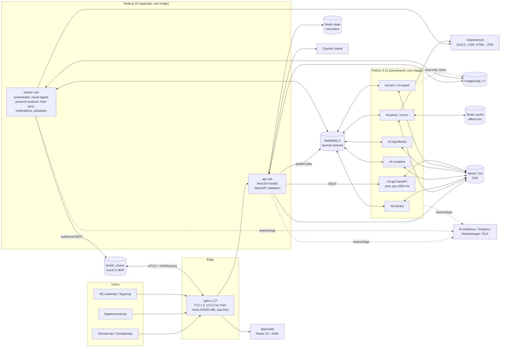
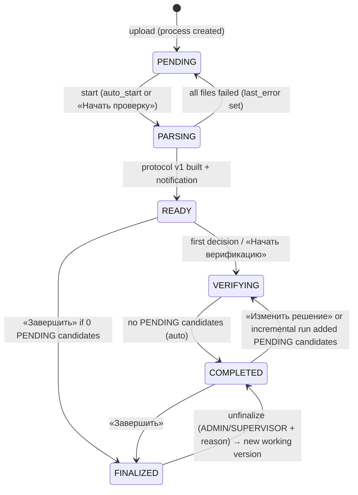
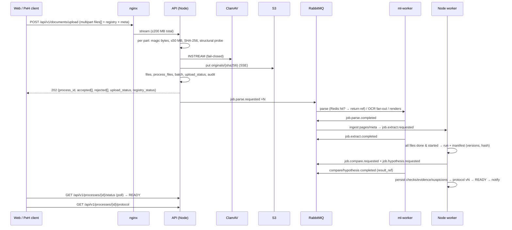

# B00 — System Architecture & Delivery Organization («Инспектор ИИ»)

Status: PLANNING / ANALYSIS (no application code). Requirement prefix: `ARC-NN`.
Scope owner: architecture / platform (cross-cutting, not a numbered §7 module).
Sources: `docs/spec/01_TZ_text.txt` (full ТЗ), `02_matrix_all_sheets.txt` (МАТРИЦА, СХЕМА GOLD, МЕТРИКИ, ПРИМЕРЫ РАЗМЕТКИ), `03_perechen_ID_registry_rules.txt`, pilot markup PDFs (geometry and annotations inspected with PyMuPDF), the Приложение 19 scans.

---

## 0. Executive summary (decisions in one screen)

| # | Decision | Choice | Why (short) |
|---|---|---|---|
| 1 | Topology | **nginx edge → NestJS API (modular monolith, 2 roles: `api` + `worker`) → RabbitMQ → Python ML workers (stateless) + internal FastAPI `ml-api`**; PostgreSQL = system of record, S3/MinIO = artifacts, Redis = cache + state | Matches ТЗ §1.5 exactly (React / Node.js / Python ≥3.11 / REST + RabbitMQ). Gives one owner per state machine and scales each worker type on its own. |
| 2 | Comparison engine placement | **Python** library `inspector_compare`, run by an `ml.compare` worker. **Node assembles, versions, verifies and finalizes the protocol.** | Comparison needs unit normalization, fuzzy and semantic matching, geometry/IoU and CV diffs (Python-native). The §14 evaluation harness must run the *same* code offline, so there is no train/serve skew. Node owns human workflow and legal state. |
| 3 | Who writes the DB | **Only Node writes domain tables.** Python returns results via a claim-check (JSON artifact in S3 plus a small RabbitMQ message). The trainer gets **read-only SQL views**. | Status transitions and audit stay in one transactional place. Python artifacts are immutable and hash-addressed, which gives reproducibility (§9.4, §14.2). |
| 4 | Contracts | **Contract-first.** `packages/contracts`: `enums.yaml` (single enum source) → OpenAPI **3.0.3** (REST), AsyncAPI (RabbitMQ), JSON Schemas (protocol, run manifest, GOLD item), XSD (protocol XML). Codegen goes to TS and Pydantic. CI fails on drift. | ТЗ §1.3 requires OpenAPI 3.0 validation. Contract-first also lets ~10 build agents work in parallel from day 1. |
| 5 | Backend framework | **NestJS 11 on the Fastify 5 adapter.** Request **and** response validation against the bundled OpenAPI (ajv via `openapi-backend`). A boot-time conformance check makes every `operationId` map to exactly one handler. | DI, modules, guards and interceptors give a uniform structure for many agents and put RBAC and audit in one place. Fastify gives throughput for p95 ≤ 200 ms. |
| 6 | ORM / migrations | **Drizzle ORM + drizzle-kit** (committed SQL migrations, custom SQL for triggers and views), `pg` driver | TS-first, no binary engine (ARM and Docker friendly), full Postgres feature access (jsonb, CHECK, partial unique, triggers). |
| 7 | Web | **React 19 + Vite + TypeScript + Ant Design 5 (ru_RU)**, TanStack Query (polling = pull model), React Router 7, `openapi-fetch` typed client, **pdf.js** viewer with a normalized-bbox overlay layer, OpenSeadragon tiles for A0 sheets, ECharts | AntD suits dense Russian-locale government UIs (tables, filters, DatePicker ru, forms) and needs the least custom UI work. |
| 8 | Python runtime | Python **3.12**, `uv` workspace, **FastStream** (aio-pika) workers with process pools for CPU work, FastAPI for internal sync REST, Pydantic v2 | Typed messages generated from AsyncAPI, easy testing, health and metrics endpoints. |
| 9 | Storage | S3 API everywhere (AWS SDK v3 / boto3). **MinIO pinned release** in Docker, a `fs` driver for no-Docker local runs. SSE auto-encryption. | Swapping to SeaweedFS or Garage is config-only (MinIO community distribution changed in 2025). |
| 10 | Conversions | **Gotenberg 8** container (LibreOffice DOCX→PDF for page geometry; Chromium HTML→PDF for protocol PDF). Local fallback: `soffice` CLI + Playwright. | One tested service, multi-arch, keeps our images lean. |
| 11 | Run modes | (a) **Hybrid dev**: infra in Docker, apps native with hot reload. (b) **Full compose** with profiles `infra`, `core`, `mocks`, `monitoring`, `logging`, `llm`, `tools`. (c) **No-Docker fallback** via Homebrew + `Procfile.dev`. | The user wants a local run now and an easy Docker move later. Docker is not installed yet, so its installation is a user decision (D2). |
| 12 | LLM | `LlmProvider` abstraction, **deterministic core works with LLM=none**. Recommended: local model via Ollama on the host (Metal). A Russian cloud adapter is optional. | 152-ФЗ and data localization are open (decision D1). |
| 13 | Build org | 10 implementation agents. **AG-00 Platform & Contracts goes first** (contract freeze CP0). High-priority blocks (1, 2, 3, 4, 5, 12) each get a dedicated agent. Four integration checkpoints. | Critical path: contracts/DB → parse → extract → compare → protocol → verification UI. |

---

## 1. Scope — ТЗ clauses covered by this block

Cross-cutting clauses that no single §7 module owns, plus the frame every module must fit:

- **§1.1** «Инспектор ИИ (краткое наименование для интерфейса)».
- **§1.2**: four core functions (violations across ПД/РД/ИД by 132 params; inspector verification; «программный API для обмена данными с внешними информационными системами» (ИАИС «РиН»); «автоматический контроль наличия документов и инкрементальная дозагрузка файлов до момента финализации протокола»).
- **§1.3** «REST over HTTPS (JSON). Все запросы и ответы передаются в формате JSON с обязательной валидацией схемы OpenAPI 3.0.»
- **§1.4** «Асинхронный (Pull-модель…) … возвращает идентификатор процесса (process_id) … Статус обработки отслеживается через эндпоинт мониторинга.»
- **§1.5** «клиентской частью на React и серверной частью на Node.js. ML-модули реализуются на Python (версии 3.11 и выше). Взаимодействие между модулями осуществляется через REST API и асинхронную очередь сообщений (RabbitMQ).»
- **§7**: the 12 modules and their priorities (1–5 and 12 High; 7–11 Medium; 6 Low). They are mapped to components in §3.2.
- **§8.1** Params table structure. **§10**: all 16 DB tables (the unified data model is owned here; semantics are owned by the blocks).
- **§9.1** cross-cutting mechanics: Redis cache by file hash (п.5), SHA-256 + normalized bbox contract (п.4), upload limits and the retry policy («Таймаут … Повторная попытка обработки (до 2 раз). При неудаче – уведомление администратора»), process statuses, upload statuses.
- **§9.2 п.1** «Версии Матрицы, набора данных и модели фиксируются в каждом запуске и в протоколе»; п.5 protocol versioning; incremental update.
- **§9.3** finalization lock / unfinalize permissions (enforcement mechanics). **§9.4** model publication gate, rollback, lineage (registry mechanics). **§9.6** retry/backoff and PENDING_SYNC mechanics.
- **§11** all 15 performance NFRs. **§12** all 11 security requirements. **§13** all 8 monitoring/logging requirements. **§14.2** «Каждый результат содержит dataset_version, matrix_version, model_version и input_manifest_hash»; §14.3 metric tooling.
- **Registry rules** (`03_…`): «каждый загружаемый комплект сопровождается отдельным реестром CSV/XLSX/JSON; без него пакет принимается со статусом CLARIFICATION_REQUIRED»; «Перезапись файла под тем же file_id запрещена. Повторная загрузка создаёт новую запись и новую версию протокола.»
- **User constraints**: separate backend server and separate web frontend; local run now; drops into Docker (compose) later; must be a winning, spec-exact MVP.

Related statuses/enums owned canonically here (content semantics owned by blocks): process status, process stage, upload status per stage, load scenario, file processing status, completeness status, finding status, inspector (verification) status, protocol status, sync status, prescription status, dataset/model/matrix version status, job status, roles.

---

## 2. Requirements checklist (ARC)

Legend: priority for winning **MUST / SHOULD / NICE**; MVP decision **FULL / SIMPLIFIED / MOCKED / OUT_OF_SCOPE**.

| ID | ТЗ ref | Requirement (atomic) | Prio | MVP | Justification |
|---|---|---|---|---|---|
| ARC-01 | §1.1 | UI and protocol use the name «Инспектор ИИ» | SHOULD | FULL | Trivial and visible to the jury |
| ARC-02 | §1.2 | Architecture hosts all functions: ПД/РД/ИД × 132-param cross-check, verification, external API, completeness and incremental upload | MUST | FULL | Component map in §3.2 |
| ARC-03 | §1.3 | Public API is REST over HTTPS with JSON bodies (binary upload via multipart; JSON responses) | MUST | FULL | nginx TLS edge, JSON everywhere except binary streams |
| ARC-04 | §1.3 | Single OpenAPI 3.0.3 source of truth; **every request** validated against it | MUST | FULL | `openapi-backend`/ajv interceptor + boot conformance check |
| ARC-05 | §1.3 | **Responses** validated against OpenAPI (always in dev/test/CI; switchable in prod, on for demo) | MUST | FULL | Literal "все … ответы … с валидацией" |
| ARC-06 | §1.4 | `POST /api/v1/documents/upload` returns `process_id` (202) before processing | MUST | FULL | Async pipeline |
| ARC-07 | §1.4 | Results are fetched on request (pull); status via the monitoring endpoint `GET /api/v1/processes/{id}/status` | MUST | FULL | UI polls; notifications are additive |
| ARC-08 | §1.5 | React web client | MUST | FULL | apps/web |
| ARC-09 | §1.5 | Node.js server | MUST | FULL | apps/api (Node 22 LTS) |
| ARC-10 | §1.5 | ML modules in Python ≥ 3.11 | MUST | FULL | Python 3.12 |
| ARC-11 | §1.5 | Inter-module interaction via REST **and** RabbitMQ (both used) | MUST | FULL | Jobs/events over AMQP; sync ops via internal REST `ml-api` |
| ARC-12 | §7 | Each of the 12 modules maps to identifiable components and owners | MUST | FULL | §3.2 table |
| ARC-13 | §8.1 | `params` table with every §8.1 field and type (VARCHAR lengths, FLOAT, BOOLEAN, TIMESTAMP) | MUST | FULL | Extras are additive only |
| ARC-14 | §10 | All 16 tables exist with ТЗ names (snake_case) and ТЗ key fields | MUST | FULL | §3.6 |
| ARC-15 | §9.1–9.6 | Canonical enums verbatim from ТЗ in one `enums.yaml` generated to SQL CHECKs, TS, Python, OpenAPI | MUST | FULL | Prevents drift across agents |
| ARC-16 | §9.1 п.5 | Parse results cached in Redis by file hash (+ parser version) | MUST | FULL | `parse:{sha256}:{parser_ver}` → zstd JSON, S3 as durable backing |
| ARC-17 | §9.1 п.4; registry | SHA-256 for every file; file records immutable; re-upload = new file record + new protocol version | MUST | FULL | DB triggers + content-addressed storage |
| ARC-18 | §9.1 п.4 | Normalized [0;1] coordinate contract (visible area after CropBox/MediaBox/Rotate, top-left origin) shared by Python and TS, with golden fixtures | MUST | FULL | `packages/contracts/vectors/geometry/*` |
| ARC-19 | §9.1 | Limits 50 MB/file and 200 MB/package enforced at nginx and API (streaming), with the limit stated in the error | MUST | FULL | Error catalog `FILE_TOO_LARGE`, `BATCH_TOO_LARGE` |
| ARC-20 | §9.1 | Unsupported format and corrupted file are rejected with supported formats named / a re-upload request | MUST | FULL | Magic-byte check + structural probe + deep parse failure path |
| ARC-21 | §9.1 | Processing timeout → up to 2 retries → admin notification | MUST | FULL | TTL/DLX retry queues, `max_attempts=3` |
| ARC-22 | §9.1 | Process status machine PENDING/PARSING/READY/VERIFYING/COMPLETED/FINALIZED with the upload/verification permission matrix enforced server-side | MUST | FULL | §3.7.1 |
| ARC-23 | §9.1 | Upload statuses PD_/RD_/ID_{UPLOADED, PARTIAL, MISSING} computed per upload | MUST | FULL | Registry-based completeness |
| ARC-24 | §9.1, §1.2 | Incremental upload without re-uploading existing files, allowed until finalization | MUST | FULL | `process_files` join, object-level archive |
| ARC-25 | §9.2 п.1, §14.2 | `matrix_version`, `dataset_version`, `model_version`, `input_manifest_hash` fixed in every run, protocol and exported result | MUST | FULL | `runs` + `protocols` columns; JCS hash |
| ARC-26 | §9.2 п.5 | Protocol stored in `protocols` with a version; previous versions kept | MUST | FULL | Copy-on-version, immutable finalized versions |
| ARC-27 | §9.2 | Incremental update recomputes only parameters affected by new data | MUST | FULL | Param↔discipline/doc-kind impact map |
| ARC-28 | §9.2 п.5 | Inspector notified when the protocol is READY | MUST | FULL | In-app + email (+Telegram) |
| ARC-29 | §9.2 п.4, §7#7 | Canonical protocol JSON; PDF/DOCX/XML renditions | MUST | FULL | Renderer in Node worker role |
| ARC-30 | §9.3 п.5 | After finalization no uploads and no status changes, enforced in API **and** DB triggers | MUST | FULL | Defense in depth |
| ARC-31 | §9.3 | Unfinalize only by ADMIN or SUPERVISOR, reason mandatory, audited, returns to VERIFICATION_COMPLETED | MUST | FULL | New working version; finalized one stays frozen |
| ARC-32 | §9.3 | Decision records: user_id, timestamp, comment; reject requires reason_code + comment | MUST | FULL | Append-only `verification_decisions` |
| ARC-33 | §9.3, §11#15 | Usability telemetry: time per protocol, clicks per violation | SHOULD | SIMPLIFIED | Real test with 5 inspectors impossible; 5 proxy testers + telemetry |
| ARC-34 | §9.4 | Model registry with approval-gated publication, one DEPLOYED pointer, rollback, lineage | MUST | FULL | Workers load the bundle by version |
| ARC-35 | §9.4, §14.2 | Object-level split, split hashes, hidden-test isolation guard | MUST | FULL | `hidden_test_manifests` lock; trainer refuses locked objects |
| ARC-36 | §9.5 | SUSPICION never counted as a violation and never a GOLD label (DB constraints) | MUST | FULL | Separate table + CHECKs |
| ARC-37 | §9.3 п.4, §9.6 | Transfer to РиН only when PROTOCOL_FINALIZED; confirmed-only payload + protocol/matrix/model versions + input file registry | MUST | FULL | 409 otherwise |
| ARC-38 | §9.6 | Client-certificate authentication with РиН | SHOULD | SIMPLIFIED | Real mTLS with a local test CA |
| ARC-39 | §9.6, §12.10 | УКЭП signing of all requests to РиН | SHOULD | MOCKED | Pluggable `Signer` (dev CMS signer; CryptoPro stub) |
| ARC-40 | §9.6 | 5xx/timeout → 3 retries (1, 5, 15 min); PENDING_SYNC; the signed decision is never changed by sync failure | MUST | FULL | Delay queues + outbox |
| ARC-41 | §9.6 | Automatic file pull from РиН; if finalized → notify only and propose a new check | SHOULD | SIMPLIFIED | Mock РиН feed polled by the scheduler |
| ARC-42 | §9.6 | Prescription statuses ISSUED/IN_PROGRESS/COMPLETED/CANCELLED/EXTENDED mirrored | NICE | SIMPLIFIED | Read-only mirror from the mock |
| ARC-43 | §11#1 | Upload of 10×50 MB ≤ 2 min | MUST | FULL | Streaming hash + AV, parallel parts |
| ARC-44 | §11#2–3 | OCR 100 pages ≤ 3 min, 500 pages ≤ 10 min (CPU-only) | MUST | FULL | Text layer first, page-level fan-out; risk flagged §5 |
| ARC-45 | §11#4 | Compare 132 params ≤ 2 min | MUST | FULL | In-memory engine |
| ARC-46 | §11#5 | Protocol generation (JSON/PDF) ≤ 30 s | MUST | FULL | Pre-rendered evidence crops |
| ARC-47 | §11#6 | Send to РиН ≤ 30 s | MUST | FULL | Against the mock |
| ARC-48 | §11#7 | NLP per parameter ≤ 500 ms | MUST | FULL | Small multilingual encoder on ONNX Runtime |
| ARC-49 | §11#8 | CV per drawing ≤ 30 s | MUST | FULL | For the implemented CV scope |
| ARC-50 | §11#9 | Incremental protocol update ≤ 1 min | MUST | FULL | Impact-limited recompute |
| ARC-51 | §11#10 | API p95 ≤ 200 ms (non-streaming endpoints) | MUST | FULL | k6 proof |
| ARC-52 | §11#11 | ≥ 100 concurrent inspectors | SHOULD | FULL | k6 100 VUs |
| ARC-53 | §11#12–14 | SLA 99.9%, RTO ≤ 1 h, RPO ≤ 15 min | SHOULD | SIMPLIFIED | Documented HA topology, backup/restore drill, WAL archiving option |
| ARC-54 | §12.1 | Login/password for all user categories | MUST | FULL | argon2id, lockout |
| ARC-55 | §12.2 | RBAC: inspector, admin, ML engineer (+ supervisor right, data curator, integration client) | MUST | FULL | Permission-based guards |
| ARC-56 | §12.3 | Data at rest encrypted (DB, file storage) | MUST | SIMPLIFIED | MinIO SSE + pgcrypto for PII + host disk encryption |
| ARC-57 | §12.3 | TLS 1.3 in transit | MUST | SIMPLIFIED | Edge TLS 1.3-only is FULL; internal TLS behind the `TLS_INTERNAL` flag |
| ARC-58 | §12.4 | Every user action audited: time, IP, action type, object id | MUST | FULL | Global interceptor + domain events |
| ARC-59 | §12.5, §13.3 | Retention: ≥ 90 days ordinary, ≥ 1 year security events (logs and audit) | MUST | FULL | ES ILM + DB retention job; business records permanent |
| ARC-60 | §12.6 | Personal data per 152-ФЗ | MUST | SIMPLIFIED | Minimization, PII encryption, access audit, no foreign data transfer |
| ARC-61 | §12.7 | 187-ФЗ integrity: hash-chained audit, immutable finalized records, integrity verification | MUST | FULL | Triggers + daily check |
| ARC-62 | §12.8 | Daily backups of DB and file storage, 30-day retention | MUST | FULL | `backup` service |
| ARC-63 | §12.9 | DDoS mitigation | SHOULD | SIMPLIFIED | nginx limit_req/conn, body limits, API rate limit |
| ARC-64 | §12.9 | IDS | NICE | OUT_OF_SCOPE | Documented integration point (e.g., Suricata on host); not built |
| ARC-65 | §12.11 | Antivirus scan **before** storing; fail-closed if AV is unavailable | MUST | FULL | ClamAV `clamd` INSTREAM |
| ARC-66 | §13.1 | JSON logs with timestamp, level, service, message, request_id, user_id | MUST | FULL | pino / structlog with a shared schema |
| ARC-67 | §13.2 | Levels INFO/WARNING/ERROR/DEBUG; DEBUG only in the test contour | MUST | FULL | Config guard clamps DEBUG outside `APP_ENV∈{local,test}` |
| ARC-68 | §13.4 | Metrics: CPU/RAM per service, disk, RPS, avg response time, HTTP 5xx, RabbitMQ queue size, active sessions | MUST | FULL | prom-client / prometheus_client + exporters |
| ARC-69 | §13.5 | Prometheus + Grafana | MUST | FULL | `monitoring` profile, provisioned dashboards |
| ARC-70 | §13.6 | ELK (Elasticsearch, Logstash, Kibana) | MUST | FULL | `logging` profile (optional at runtime because of RAM) |
| ARC-71 | §13.7 | Alerts (CPU > 80%, response > 500 ms) → admin by email and Telegram | MUST | FULL | Alertmanager → Mailpit/SMTP + Telegram (real bot if token, else mock) |
| ARC-72 | §13.8 | Daily file-hash integrity check | MUST | FULL | Scheduler job + alert |
| ARC-73 | §14.3 | Evaluation harness: all §14.3 metrics, per section/type, coverage/abstention, 95% CI | MUST | FULL | Python `inspector_training.eval`, same engine |
| ARC-74 | §14, СХЕМА GOLD | Results export in GOLD-schema JSONL + batch evaluation mode for the organizers' hidden test | MUST | FULL | Lets the organizers score us easily |
| ARC-75 | user | Separate backend and web; local run; docker-compose from day one | MUST | FULL | §3.10 |
| ARC-76 | win | One-command demo (`make demo`) with seed and reset | MUST | FULL | Demo data from pilot + synthetic |
| ARC-77 | win | Multi-arch images (amd64/arm64); no runtime internet dependency (models, fonts vendored) | SHOULD | FULL | Jury hardware unknown; closed-contour friendly |
| ARC-78 | §7#12 | Error catalog, RFC 7807 `application/problem+json`, Russian messages, stable `error_code` | MUST | FULL | Shared by all blocks |
| ARC-79 | registry | Machine-readable registry (CSV/XLSX/JSON) accepted; missing → package accepted with CLARIFICATION_REQUIRED | MUST | FULL | Owned by B01, frame here |
| ARC-80 | §7#8 | Threshold/normative changes without recoding: versioned matrix snapshots consumed by workers | MUST | FULL | Publish → immutable snapshot → next runs |
| ARC-81 | §9.1, §9.2, §13.7 | Notification channels: in-app, email, Telegram | MUST | FULL | `notifications` + dispatcher |
| ARC-82 | win | ТЗ traceability matrix generated from tests tagged with requirement IDs | SHOULD | FULL | Compliance page for the jury |
| ARC-83 | §7#12, §12 | Parser hardening: XXE off, zip-bomb limits (DOCX), encrypted-PDF detection, PDF JS ignored, filename/path sanitization | MUST | FULL | Negative scenarios |
| ARC-84 | D1 | LLM provider abstraction; full pipeline works with LLM disabled | SHOULD | FULL | 152-ФЗ uncertainty |

**Totals: 84 requirements: FULL 73, SIMPLIFIED 9, MOCKED 1, OUT_OF_SCOPE 1.**

---

## 3. Proposed design

### 3.1 System context and containers



There is **no separate API gateway service**. nginx does the gateway work (TLS 1.3, mTLS, body limits, rate limiting, static web, routing). The NestJS app is the only backend API. This means fewer moving parts, and it satisfies "серверной частью на Node.js".

### 3.2 Module → component → owner map (§7)

| §7 # | Module (prio) | Node (apps/api modules) | Python (services/ml) | Web (apps/web features) | Build agent |
|---|---|---|---|---|---|
| 1 | Загрузка и парсинг (High) | `documents`, `objects`, `processes`, `orchestrator` | `inspector_docproc` (parse, OCR, title block, tables, CV, NLP extraction), `ml-api /v1/files/probe`, `/v1/nlp/extract-param` | `upload`, `process` (status), `objects` | AG-01 |
| 2 | Сравнение и протокол (High) | `protocols` (assembler, versions, diff), `renderer` (PDF/DOCX/XML) | `inspector_compare` (linkage/revision selection, completeness, comparison, evidence groups, evidence crops, incremental) | `protocol` | AG-02 |
| 3 | Верификация (High) | `verification` (decisions, split, revision selection, applicability, finalize/unfinalize) | `ml-api /v1/decisions/review` (AI verdict for disputes) | `verification` workspace | AG-03 |
| 4 | Обратная связь и дообучение (High) | `ml-registry` (rejection/dispute logs, dataset items, dataset versions, model versions, approvals) | `inspector_training` (dataset freeze, object split, train, evaluate, gate) | `ml` | AG-04 |
| 5 | Свободный поиск гипотез (High) | `suspicions` (list, promote, dismiss) | `inspector_hypothesis` (4 approaches, dedup) | `suspicions` | AG-05 |
| 6 | Интеграция с ИС (Low) | `integration-rin` (outbox, sync, inbound, prescriptions) | – | `integration` | AG-06 (+ `apps/rin-mock`) |
| 7 | Дашборд (Medium) | `dashboard` (aggregates, exports) | – | `dashboard` | AG-07 |
| 8 | Нормативная база (Medium) | `admin-normative` (params, matrix versions, normative base, logical rules, reason codes) | consumes snapshots | `admin` | AG-07 |
| 9 | Журнал аудита (Medium) | `audit` (interceptor, hash chain, viewer, export), protocol versioning hooks | – | `audit` | AG-08 (with AG-03) |
| 10 | Еженедельный отчёт (Medium) | `reports` (schedule, storage, delivery) | `inspector_training.report` | `ml/reports` | AG-04 |
| 11 | Мониторинг и логирование (Medium) | `monitoring` (health, Monitoring_Metrics snapshots) + instrumentation | instrumentation | `monitoring` | AG-08 |
| 12 | Ошибки и отрицательные сценарии (High) | error catalog (AG-00), per-module handling (each agent) | same | error UX | AG-09 (suite owner) |

### 3.3 Comparison engine placement: Python (decision and rationale)

**Decision.** Findings are computed only in Python (`inspector_compare`). Node never computes a finding. Python never changes a status set by a human.

Why Python:
1. **Nature of comparisons.** The pilot shows that most real findings are configuration and area changes between ПД and РД sheets (room functions and areas, a removed 6 mm armored sheet, a moved door, ventilation branches, missing warm-floor contours). Handling them needs unit normalization (`pint`), numeric parsing of Russian formats ("6234,1 м²", "±12 мм"), fuzzy room and label matching (`rapidfuzz`), sentence embeddings ("Техническое" vs "Склад ГСМ"), polygon IoU (`shapely`) and raster/vector drawing diffs (OpenCV). All of these are Python-native, and the same stack is already in the parse workers.
2. **One code path for production and acceptance.** §14.3 metrics (P/R/F1 by evidence_group, FPR on NEGATIVE_VERIFIED and outdated revisions, localization IoU ≥ 0.5, linkage exactness) and the §9.4 release gate ("Recall … не более чем на 2 п.п.", FPR +2 п.п.) must be computed by running the engine over validation and hidden sets. If comparison lived in Node, the evaluator would reimplement it or call it through HTTP for thousands of groups. In Python the evaluator imports the library directly, with no skew.
3. **Model coupling.** Candidate scoring and false-positive filtering (the "model" that retraining updates) sit in the comparison loop, and the model bundle is Python.

What stays in Node: scenario detection input (stage upload statuses and the registry are DB facts), run creation, protocol assembly from DB state (sections (1)–(5)), versioning, carry-over of decisions, verification, finalization, exports, РиН. This keeps legal state transitions transactional in one service.

Trade-off accepted: one more async hop per run (well within "Сравнение 132 параметров ≤ 2 мин").

### 3.4 Monorepo layout

```
inspector-ai/
├─ apps/
│  ├─ api/                    # Node 22, NestJS 11 + Fastify 5; APP_ROLE=api|worker (same image)
│  │  └─ src/modules/{auth,users,objects,documents,processes,orchestrator,protocols,renderer,
│  │                  verification,suspicions,integration-rin,dashboard,admin-normative,audit,
│  │                  ml-registry,reports,notifications,monitoring,evaluation}
│  ├─ web/                    # React 19 + Vite + AntD 5 (ru_RU)
│  │  └─ src/{app,shared,features/{auth,dashboard,objects,upload,process,protocol,verification,
│  │                               suspicions,admin,audit,ml,monitoring,integration}}
│  └─ rin-mock/               # Mock ИАИС «РиН» (Fastify) + its own OpenAPI; fault injection (5xx/timeout)
├─ services/ml/               # uv workspace (Python 3.12)
│  ├─ packages/
│  │  ├─ inspector_common/    # settings, JSON logging, FastStream base, S3, Redis, geometry, generated contracts
│  │  ├─ inspector_docproc/   # B01
│  │  ├─ inspector_compare/   # B02 engine
│  │  ├─ inspector_hypothesis/# B05
│  │  └─ inspector_training/  # B04 + B10 (+ eval: §14.3 metrics)
│  ├─ apps/ml_api/            # FastAPI internal REST
│  ├─ apps/ml_worker/         # `ml-worker --queues parse,ocr,...`
│  └─ tools/eval_cli/         # batch evaluation / GOLD JSONL export over a manifest
├─ packages/
│  ├─ contracts/
│  │  ├─ enums.yaml                        # SINGLE source of all enums
│  │  ├─ openapi/{openapi.yaml,paths/*,schemas/*}  → dist/openapi.bundled.yaml (OAS 3.0.3)
│  │  ├─ openapi/ml-internal.yaml          # ml-api contract
│  │  ├─ asyncapi/asyncapi.yaml + messages/*.json
│  │  ├─ schemas/{protocol,run-manifest,run-result,gold-item,registry}.schema.json
│  │  ├─ xsd/protocol-v1.xsd
│  │  ├─ errors.yaml                       # error catalog (code, http, message_ru, retryable)
│  │  ├─ vectors/{geometry,manifest-hash}/ # golden test vectors used by TS and Python tests
│  │  └─ gen/{ts,py}/                      # generated, committed, CI drift-checked
│  ├─ db/                    # Drizzle schema, SQL migrations (incl. triggers/views), seed runner
│  └─ shared/                # TS: state machines, geometry (denormalize), JCS hashing, error helpers
├─ data/{seed,pilot,synthetic,demo}/
├─ infra/{docker,compose,nginx,rabbitmq,postgres,minio,prometheus,grafana,alertmanager,elk,backup,certs}/
├─ tools/{k6,pilot-convert,synthetic-gen,traceability,scripts}/
├─ docs/{spec,analysis,adr,compliance,runbook}/
├─ Makefile  Procfile.dev  .env.example  pnpm-workspace.yaml  turbo.json  pyproject.toml(uv root)
```

Workspace tooling: pnpm workspaces + Turborepo (cached `build/lint/test/gen`), `uv` workspace for Python. Generated code is committed so that Python agents need no Node toolchain and vice versa.

### 3.5 Framework and library choices

| Concern | Choice | Alternatives considered | Rationale |
|---|---|---|---|
| Backend | **NestJS 11 + @nestjs/platform-fastify (Fastify 5)** | Plain Fastify + fastify-openapi-glue; Express | Fastify+glue is purely contract-first but gives little structure for 10 agents. Nest gives modules, DI, guards (RBAC), interceptors (audit, request_id, validation) and consistent patterns that agents know well. Contract-first is kept through a validation interceptor and a boot conformance check. |
| OpenAPI validation | `openapi-backend` (ajv 8, OAS 3.0) over `dist/openapi.bundled.yaml`; `@redocly/cli` lint/bundle; Redoc UI at `/api/docs` | express-openapi-validator (Express only), code-first @nestjs/swagger | Request always validated; response validated in dev/test/CI and demo; mismatch → 500 `RESPONSE_SCHEMA_VIOLATION` and an ERROR log. |
| ORM | **Drizzle ORM + drizzle-kit**, `pg` 8 | Prisma 6/7, TypeORM, Kysely | TS schema, readable SQL migrations, custom SQL for triggers/views/partial indexes, no engine binary. Prisma's JSONB and trigger handling are weaker; TypeORM is buggy; Kysely has no schema DSL. |
| AMQP (Node) | `amqplib` + `amqp-connection-manager` (reconnect, confirm channels) | rabbitmq-client, @golevelup/nestjs-rabbitmq | Minimal, well understood; our own thin topology and retry layer. |
| Redis (Node) | `ioredis` 5 | node-redis | Sessions, rate limit, locks, idempotency. |
| Logging | `pino` + `nestjs-pino` (Node), `structlog` JSON (Python) | winston | Fast JSON with a shared field schema (§13.1). |
| Metrics | `prom-client` (Node), `prometheus_client` (Python) | OTel metrics | Direct Prometheus scrape; OTel tracing is NICE later. |
| Auth | Redis-backed sessions (httpOnly Secure SameSite=Strict cookie), `argon2`, PAT bearer tokens for API/scripts, mTLS headers for РиН | JWT only | Sessions make "количество активных сессий" (§13.4) exact and support revocation. |
| Web | **React 19, Vite, TS, Ant Design 5 (ConfigProvider ru_RU, dayjs ru)**, TanStack Query 5, React Router 7, `openapi-fetch`, zustand, react-hotkeys-hook | Mantine, shadcn/ui, MUI | AntD's Table (virtual, fixed columns, filters), Form, Descriptions, Tree, Upload and DatePicker (ru) cover the dense inspector/admin UI with the least custom code and look "official". |
| PDF viewing | **pdfjs-dist** (canvas + custom SVG overlay using normalized bboxes); **OpenSeadragon** DZI tiles for sheets > A2 pre-rendered by the parser | react-pdf only, PSPDFKit | The pilot has A0 pages (3370×2384 pt) that pdf.js renders slowly, so tiles are needed as a fallback. pdf.js viewport already applies CropBox and Rotate, so a normalized bbox maps with `x*W, y*H`. |
| Charts | ECharts 5 (`echarts-for-react`) | AntD Charts, Recharts | Rich, fast, Russian locale. |
| Python workers | **FastStream** (aio-pika) + `concurrent.futures.ProcessPoolExecutor` for CPU work; FastAPI + uvicorn for `ml-api` | Celery (forces Celery wire protocol onto Node producers), raw pika | Pydantic-typed messages from AsyncAPI; ASGI health/metrics; test client. |
| Doc processing | PyMuPDF (text layer, geometry, render, annotations), python-docx, lxml + defusedxml, Tesseract 5 (rus+eng, tessdata_best) as baseline OCR behind an `OcrEngine` interface, OpenCV headless, scikit-image, shapely 2, rapidfuzz 3, pint, ONNX Runtime + sentence-transformers export | PaddleOCR/Surya/EasyOCR (evaluated by B01) | B01 decides the engines. Architecture fixes only the interfaces, CPU-only execution and model vendoring. |
| Embeddings | "Compatible analog" of all-MiniLM-L6-v2 with Russian support (candidates: `paraphrase-multilingual-MiniLM-L12-v2`, `cointegrated/rubert-tiny2`, `multilingual-e5-small`), selected by B01 benchmark | all-MiniLM-L6-v2 (English-only) | Kept as a baseline in the benchmark to justify the choice to the jury. |
| Conversions | **Gotenberg 8** (LibreOffice + Chromium) | LibreOffice in the ML image, Playwright in Node | One service for DOCX→PDF (page geometry for DOCX evidence) and HTML→PDF (protocol). Local fallback drivers exist. |
| DOCX export | `docx` (npm) | docxtemplater | Programmatic tables. |
| XML export | `xmlbuilder2` + XSD validation (`libxmljs2` or xmllint in CI) | – | Published XSD in contracts. |
| Storage | S3 API; **MinIO pinned release** (docker), `fs` driver (no-Docker) | SeaweedFS, Garage | SSE auto-encryption with a KMS static key in dev. |
| Proxy | **nginx 1.27+** | Caddy, Traefik | TLS 1.3-only, `ssl_verify_client` for РиН, `client_max_body_size 200m`, `proxy_request_buffering off`, `limit_req`. Familiar to government ops. |
| AV | ClamAV 1.4 `clamd` (TCP INSTREAM) | – | Mock mode (EICAR-only) for no-Docker dev; fail-closed. |
| Tests | Vitest 3, Playwright, **Schemathesis** (OpenAPI property tests), pytest, k6 | Jest, Dredd | Schemathesis proves "обязательная валидация схемы". |
| Lint/format | ESLint 9 flat + typescript-eslint, Prettier; ruff + mypy (Python); lefthook pre-commit | – | – |

Baseline runtime versions (exact patch versions pinned in lockfiles and image digests at scaffold time): Node 22 LTS, TypeScript 5.x, Python 3.12, PostgreSQL 17, Redis 7.4/8, RabbitMQ 4.x (management + prometheus plugins), ClamAV 1.4, Gotenberg 8, nginx 1.27+, Prometheus 3, Grafana 11+, Alertmanager 0.28+, Elasticsearch/Logstash/Kibana/Filebeat 8.x, Mailpit.

### 3.6 Unified data model

Conventions: PostgreSQL 17; snake_case table names equal to ТЗ names lowercased (`Params`→`params`, `Rejection_Log`→`rejection_log`, …); `timestamptz` in UTC (UI shows Europe/Moscow); UUIDv7 for entity PKs (except `params.id INT` per §8.1 and `suspicions.id BIGINT` per the §9.5 example `2001`); human-readable stable codes alongside (e.g., `object_code=ALT79B`, `file_code=ALT79B-000015`, `finding_id=ALT79B-M041-01`), mirroring the pilot IDs; enums as `VARCHAR` + `CHECK` generated from `enums.yaml` (the ТЗ itself uses VARCHAR). Fields marked `*` are ТЗ-mandated.

#### 3.6.1 The 16 ТЗ tables (§10) with extensions

1. **`params`** (§8.1, exact): `id INT PK*`, `code VARCHAR(20) UNIQUE*` (`M-001`…`M-132`), `section VARCHAR(50)*` (short code: ПЗ, СПЗУ, АР, КР, ИОС1…ИОС5, ППМ, ОДИ, ЗУ, ПОС, ПОД, ООС, СМ), `parameter_name VARCHAR(255)*`, `unit VARCHAR(20)*`, `source_pd TEXT*`, `source_rd TEXT*`, `source_id TEXT*`, `trigger_logic TEXT*`, `review_priority VARCHAR(20)*` (HIGH/MEDIUM/LOW), `sp_reference*`, `gost_reference*`, `fz_reference*`, `other_normative TEXT*`, `data_type VARCHAR(20)*` (number/string/boolean/coordinate/enum), `min_value FLOAT*`, `max_value FLOAT*`, `regex_pattern VARCHAR(255)*`, `is_active BOOLEAN*`, `created_at*`, `updated_at*`. Extensions: `alt_code VARCHAR(20)` (`PZ-01`, `KR-55`, `AR-41`; section prefix + global number), `section_no SMALLINT`, `section_title`, `comparison_rule VARCHAR(40)` (EQUAL, NO_DECREASE, NO_INCREASE, DELTA_ABS, DELTA_REL, MIN_THRESHOLD, MAX_THRESHOLD, SET_EQUAL, PRESENCE, GEOMETRY), `tolerance_abs FLOAT`, `tolerance_rel FLOAT`, `required_stages VARCHAR(20)` (e.g. `PD+RD`, `PD+RD+ID`, `RD+ID`), `disciplines TEXT[]`, `id_doc_kinds TEXT[]`, `anchors JSONB` (semantic anchor phrases), `enum_values JSONB`, `extraction_hints JSONB` (long regexes, table headers, sheet types), `revision INT`.
2. **`checks`**: `id*`, `param_id*` (nullable only for promoted hypothesis rules → `rule_code`), `object_id*`, `expected_value*` (JSONB: value/unit/geometry/text), `actual_value*`, `completeness_status*`, `finding_status*`, `review_priority*`, `evidence_group_id*`. Extensions: `process_id`, `protocol_id`, `run_id`, `finding_id VARCHAR(64)` (stable across versions), `finding_key CHAR(64)` (sha256 of object+rule+atomic key), `rule_code`, `atomic_rule_key`, `delta JSONB`, `unit`, `risk_level`, `confidence REAL`, `rationale TEXT`, `approved_change_ref TEXT DEFAULT 'NONE'`, `decided_by` (SYSTEM/INSPECTOR), `inspector_status`, `inspector_reason_code`, `inspector_comment`, `decided_user_id`, `decided_at`, `inspector_reviewed BOOL` (spot-check of machine negatives), `parent_check_id`, `is_split_parent BOOL`, `carried_from_check_id`, `stale BOOL` (locked while an incremental run recomputes it), `row_version INT` (optimistic locking, ETag), timestamps. Constraints: `finding_status` is NULL unless `completeness_status='COMPLETE'`; `finding_status='CONFIRMED_VIOLATION' ⇒ decided_by='INSPECTOR'`; `finding_status ∈ {CANDIDATE, NEGATIVE_VERIFIED, CONFIRMED_VIOLATION}` (SUSPICION lives in `suspicions`).
3. **`objects`**: `id*`, `name*`, `address*`, `customer*`, `contractor*`, `permit_number*`. Extensions: `object_code`, `supervision_case_no` (e.g. «дело №56235»), `rin_object_id`, `object_kind`, `customer_contacts_enc BYTEA` (PII, pgcrypto), timestamps.
4. **`files`**: `id*`, `object_id*`, `doc_stage*` (PD/RD/ID), `discipline*`, `document_code*`, `revision*`, `approval_status*` (DRAFT/APPROVED/FOR_CONSTRUCTION/SUPERSEDED/CANCELLED), `approval_date*`, `predecessor_id*`, `file_hash*` (SHA-256 hex), `file_path*` (storage key), `uploaded_at*`. Extensions: `file_code`, `file_name`, `mime_type`, `size_bytes`, `page_count`, `successor_id`, `sheet_page_range JSONB` (sheet↔PDF page map), `signature_status`, `id_doc_kind` (АОСР, исполнительная геодезическая схема, …), `registry_entry_id`, `batch_id`, `uploaded_by`, `source` (UI/API/RIN), `rin_document_id`, `av_status`, `av_signature`, `processing_status`, `error_code`, `parser_version`, `parse_ref`, `rendition_ref`, `detected_meta JSONB` (title-block detections), `meta_conflicts JSONB`, `quality_summary JSONB` (coverage, LOW_QUALITY/ABSTAIN share). Triggers: no UPDATE of `file_hash`, `file_path`, `object_id`; no DELETE.
5. **`protocols`**: `id*`, `object_id*`, `version*`, `matrix_version*`, `dataset_version*`, `model_version*`, `input_manifest_hash*`, `status*`, `created_at*`, `finalized_at*`. Extensions: `process_id`, `run_id`, `previous_version_id`, `parser_version`, `rules_version`, `scenario`, `upload_status JSONB`, `content_json JSONB` (canonical protocol), `content_sha256`, `summary JSONB`, `finalized_by`, `revoked_at/by/reason` (unfinalize), `superseded_by`, `sync_status`. `UNIQUE(process_id, version)`.
6. **`rejection_log`**: `id*`, `violation_id*` (→ `checks.id`), `rejection_reason*` (reason code), `ai_verdict*` (AGREE/DISAGREE/UNSURE), `suggested_fix*`, `retraining_status*`. Extensions: `inspector_comment`, `user_id`, `protocol_id`, `param_code`, `error_category` (OCR/LINKING/EXTRACTION/RULE/DATA/REVISION), `dataset_item_id`, `created_at`.
7. **`dispute_log`**: `id*`, `violation_id*`, `inspector_comment*`, `ai_comment*`, `resolution_status*`, `resolved_by*`. Extensions: `protocol_id`, `opened_at`, `resolved_at`, `resolution`.
8. **`suspicions`**: `id BIGINT*`, `object_id*`, `discovery_method*` (LOGICAL_ANALYSIS/SEMANTIC_DISSONANCE/NORMATIVE_ANALYSIS/ML_PATTERN), `confidence*`, `description*`, `inspector_status*`. Extensions (from the §9.5 JSON): `process_id`, `protocol_id`, `run_id`, `rule_id`, `rule_version`, `pd_reference`, `rd_reference`, `id_reference`, `review_priority`, `normative_base TEXT`, `normative_base_id`, `finding_status` (always `SUSPICION`, CHECK), `dedup_key`, `evidence_hints JSONB`, `promoted_check_id`, `decided_by`, `decided_at`, `comment`.
9. **`logical_rules`**: `id*`, `rule_name*`, `condition*` (JSON DSL), `expected*` (JSON DSL), `normative_base*`, `is_active*`. Extensions: `code`, `version`, `description`, `section`, `review_priority`, `applies_to_stages`, `created_by`, timestamps.
10. **`normative_base`**: `id*`, `document_name*`, `document_number*`, `section*`, `parameter_name*`, `min_value*`, `max_value*`, `effective_from*`, `effective_to*`. Extensions: `doc_type` (СП/ГОСТ/ФЗ/СанПиН/ПП), `clause`, `unit`, `param_id`, `text_excerpt`, `is_active`, timestamps.
11. **`ml_retraining_log`** (one row per training iteration): `id*`, `model_version*`, `dataset_version*`, `split_hashes*`, `precision*`, `recall*`, `f1*`, `false_positive_rate*`, `per_category_metrics*`, `approval_status*`, `approved_by*`. Extensions: `matrix_version`, `previous_model_version`, `code_ref` (git sha), `hyperparams JSONB`, `ci95 JSONB`, `coverage`, `abstention_rate`, `localization_rate`, `linkage_accuracy`, `ocr_char_accuracy`, `key_field_em`, `gate_result JSONB` (per-rule pass/fail and deltas vs previous), `started_at`, `finished_at`, `approved_at`, `approval_comment`, `approval_signature` (mock).
12. **`audit_log`**: `id BIGINT*`, `user_id*`, `action*`, `object_id*` (entity reference), `details* JSONB`, `timestamp*`, `ip_address*`, `user_agent*`. Extensions: `entity_type`, `construction_object_id`, `request_id`, `category` (BUSINESS/SECURITY/SYSTEM), `result` (SUCCESS/FAILURE), `prev_hash`, `row_hash`, `retention_class`. Append-only trigger; the hash chain is computed in the trigger.
13. **`monitoring_metrics`**: `id*`, `metric_name*`, `value*`, `timestamp*`, `service_name*`, `tags* JSONB`. Filled every 60 s by the scheduler (business and infra snapshots); Prometheus remains the primary TSDB.
14. **`evidence_fragments`**: `id*`, `evidence_group_id*`, `file_id*`, `stage*`, `sheet_page*`, `bbox_polygon_norm* JSONB` (`{"type":"bbox","coords":[x0,y0,x1,y1]}` or `{"type":"polygon","coords":[[x,y],…]}`), `extracted_value*`, `role_expected_actual*` (EXPECTED/ACTUAL/CONTEXT). Extensions: `file_sha256`, `document_code`, `revision`, `approval_status` (snapshot), `page_index`, `sheet_no`, `text_snippet`, `extraction_method` (TEXT_LAYER/OCR/TABLE/CV/XML/MANUAL), `confidence`, `quality_flag`, `snapshot_ref` (crop PNG), `created_by`.
15. **`dataset_items`**: `id*`, `evidence_group_id*`, `gold_label*` (CHECK ∈ {CONFIRMED_VIOLATION, NEGATIVE_VERIFIED}), `expert_id*`, `reason_code*`, `dataset_version*` (NULL while draft), `split*` (TRAIN/VALIDATION/HIDDEN_TEST), `object_group_id*`. Extensions: `item_status` (DRAFT/CURATED/RELEASED/EXCLUDED), `curator_id`, `curated_at`, `source_check_id`, `protocol_id`, `payload_ref` (frozen GOLD JSON per СХЕМА GOLD), `payload_sha256`, `category`, `created_at`. Insert guard: the source check is inspector-decided and belongs to a finalized protocol version.
16. **`model_versions`**: `model_version PK*`, `artifact_hash*`, `dataset_version*`, `metrics_json*`, `approval_status*`, `approved_by*`, `deployed_at*`, `rollback_to*`. Extensions: `artifact_ref`, `bundle_manifest JSONB` (OCR engine and version, embedding model and hash, thresholds, classifier), `matrix_version`, `training_iteration_id`, `created_by`, `created_at`, `retired_at`. Partial unique index: at most one row with `approval_status='DEPLOYED'`.

#### 3.6.2 Additional tables

| Table | Purpose | Key columns |
|---|---|---|
| `users`, `roles`, `permissions`, `role_permissions`, `user_roles`, `api_tokens` | §12.1–12.2 | login, password_hash (argon2id), full_name_enc, email_enc, telegram_chat_id, failed_attempts, locked_until, is_active |
| `processes` | process_id lifecycle | object_id, status, stage, progress, scenario, upload_status JSONB, registry_status (OK/MISSING/INVALID), current_protocol_id, active_run_id, pending_delta JSONB, auto_start, source, assigned_inspector_id, last_error, row_version |
| `process_files` | files included in a process | process_id, file_id, batch_id, added_at, included |
| `upload_batches` | package accounting (200 MB) | process_id, total_bytes, file_count, accepted, rejected JSONB, registry_id, idempotency_key |
| `file_registries`, `registry_entries` | mandatory machine-readable registry | format, sha256, status, errors; per row: file_name, sha256, doc_stage, discipline, document_code, revision, approval_status, approval_date, sheet_page_range, predecessor/successor refs, signature_status, matched_file_id, match_status |
| `document_pages` | page geometry and quality | file_id, page_index, sheet_no, width_pt, height_pt, rotation, mediabox, cropbox, has_text_layer, ocr_applied, ocr_confidence, quality_flag (OK/LOW_QUALITY/ABSTAIN), handwritten_share, image_ref, tiles_ref, title_block JSONB |
| `extracted_values` | per-file per-param extraction (the §9.1 "Checks" input) | file_id, file_sha256, param_id, matrix_version, model_version, value_raw, value_norm JSONB, unit, page_index, bbox_polygon_norm, method, confidence |
| `evidence_groups` | unit of result (§9.2, §14.1) | group_key (stable), object_id, param_id/rule_code, atomic_rule_key, protocol_id, run_id, approved_change_ref, parent_group_id |
| `runs` | each computation run | process_id, mode (FULL/INCREMENTAL/RECHECK), trigger, scenario, matrix/model/dataset/parser/rules versions, input_manifest_hash, manifest_ref, affected_params INT[], status, timings |
| `jobs` | every queued unit of work | run_id, file_id, type, status, attempt, max_attempts, idempotency_key UNIQUE, queue, payload_ref, result_ref, error_code, worker_id, heartbeat_at |
| `verification_decisions` | append-only decision history | check_id, finding_id, protocol_id, decision, reason_code, comment, user_id, decided_at, ip_address, previous_decision_id, ai_verdict, dispute_id |
| `reason_codes` | coded reasons | code, title_ru, applies_to, error_category, is_active |
| `completeness_items` | protocol section (1), document level | protocol_id, stage, doc_kind/discipline, basis (REGISTRY/PERECHEN/MATRIX), status, file_ids, comment |
| `revision_overrides`, `applicability_overrides` | inspector choices feeding re-runs | process_id, document_code/discipline, chosen_file_id / param_id, basis, user_id |
| `approved_changes` | «согласованное изменение» references | object_id, ref_number, title, file_id, affects_params, approved_at |
| `matrix_versions` | versioned matrix snapshots | version, status (DRAFT/PUBLISHED/ARCHIVED), snapshot_ref, snapshot_sha256, change_log, published_by/at, is_current |
| `rules_versions` | logical-rules snapshots | same pattern |
| `dataset_versions` | released GOLD sets | version, status, manifest_ref, manifest_sha256, split_hashes JSONB, counts, coverage, released_by/at |
| `hidden_test_manifests` | leakage guard | manifest_sha256, object_ids, locked_at, locked_by |
| `protocol_exports` | renditions | protocol_id, format, storage_key, sha256, generated_at |
| `notifications` | in-app/email/Telegram | user_id, type, payload, channels, delivery JSONB, read_at |
| `rin_sync_jobs` | outbox to РиН | process_id, protocol_id, status, attempts, next_attempt_at, last_http_status, request_sha256, signature_ref, response |
| `rin_inbound_documents` | auto-pull from РиН | rin_document_id, object_id, sha256, status (NEW/IMPORTED/NOTIFIED_FINALIZED/REJECTED), file_id, process_id |
| `prescriptions` | mirror of предписания | rin_prescription_id, object_id, number, status, issued_at, due_date, extended_to, linked_check_ids |
| `weekly_reports` | §7#10 | period_from/to, stats JSONB, recommendations JSONB, report_ref, sent_to |
| `integrity_checks` | §13.8 | files_checked, mismatches JSONB, audit_chain_ok, status |
| `usability_events` | §9.3 metrics | user_id, protocol_id, finding_id, event, ts |
| `disciplines`, `id_document_kinds`, `expected_documents`, `param_discipline_map` | reference: marks, ИД kinds (§5 + Приложение 19), impact map for incremental runs | – |

Read-only SQL views (contract for `ml.train`/`ml.report` under role `inspector_ro`): `v_gold_items`, `v_rejections_weekly`, `v_disputes_weekly`, `v_dataset_items_full`.

Integrity triggers: `files` immutable; `audit_log` append-only with a hash chain; `verification_decisions` append-only; rows of `protocols`, `checks`, `evidence_fragments` and `completeness_items` bound to a `PROTOCOL_FINALIZED` version are immutable (only the `unfinalize()` SQL function may set `revoked_*`); `dataset_items` insert guard; one active run per process (partial unique); one deployed model.

#### 3.6.3 Storage layout (S3 buckets) and Redis keys

- `inspector-originals/{sha256}`: content-addressed originals (immutable; `files.file_path` points here).
- `inspector-artifacts/`: `parse/{sha256}/{parser_ver}/document.json.zst`, `renders/{sha256}/p{n}/{thumb|view}.webp` and `tiles/`, `renditions/{sha256}.pdf` (DOCX/XML → PDF), `extract/{sha256}/{matrix_ver}/{model_ver}.json`, `runs/{run_id}/{manifest|compare|hypothesis}.json`, `evidence/{fragment_id}.png`.
- `inspector-protocols/{protocol_id}/v{n}/protocol.{json,pdf,docx,xml}`.
- `inspector-ml/`: `datasets/{ver}/manifest.jsonl`, `models/{ver}/bundle.tar.zst`, `reports/weekly/{yyyy-Www}.{pdf,json}`.
- `inspector-reference/`: `matrix/{ver}.json`, `rules/{ver}.json` (immutable snapshots).
- `inspector-backups/` (separate volume in compose).
- Redis **cache** instance (allkeys-lru): `parse:{sha256}:{parser_ver}`, `matrix:{ver}`, `dash:*`. Redis **state** instance (noeviction, AOF): `sess:{id}`, `sessions:active` (ZSET), `idem:{key}`, `rl:*`, `lock:*`. In dev both URLs may point to the same instance.

### 3.7 Canonical enums and state machines

`packages/contracts/enums.yaml` is generated into SQL CHECKs, TS unions, Python `StrEnum`s and OpenAPI components.

| Enum | Values | Source |
|---|---|---|
| ProcessStatus | PENDING, PARSING, READY, VERIFYING, COMPLETED, FINALIZED | §9.1 |
| ProcessStage (informational) | QUEUED, SCANNING, PARSING, OCR, EXTRACTING, COMPARING, HYPOTHESIS, PROTOCOL_BUILDING, INCREMENTAL, DONE, FAILED | ours |
| StageUploadStatus | PD_UPLOADED, PD_PARTIAL, PD_MISSING, RD_UPLOADED, RD_PARTIAL, RD_MISSING, ID_UPLOADED, ID_PARTIAL, ID_MISSING | §9.1 |
| LoadScenario | FULL, PD_RD_ONLY, PD_ID_ONLY, RD_ID_ONLY, SINGLE_ONLY, PARTIALLY_LOADED | §9.2 |
| DocStage | PD, RD, ID | registry |
| ApprovalStatus | DRAFT, APPROVED, FOR_CONSTRUCTION, SUPERSEDED, CANCELLED | registry |
| SignatureStatus | SIGNED_UKEP, SIGNED_UNEP, PAPER_SCAN, MISSING, NOT_REQUIRED, UNKNOWN | registry + §5 notes |
| FileProcessingStatus | RECEIVED, SCANNING, REJECTED, STORED, PARSING, PARSED, EXTRACTED, PARSE_FAILED | ours |
| QualityFlag | OK, LOW_QUALITY, ABSTAIN | §9.1 |
| CompletenessStatus | COMPLETE, MISSING_EVIDENCE, NOT_APPLICABLE, NOT_COMPARABLE, CLARIFICATION_REQUIRED | СХЕМА GOLD, §9.2 |
| FindingStatus | CANDIDATE, NEGATIVE_VERIFIED, CONFIRMED_VIOLATION, SUSPICION | СХЕМА GOLD |
| InspectorStatus (per finding) | PENDING, CONFIRMED_VIOLATION, NEGATIVE_VERIFIED, CLARIFICATION_REQUIRED | §9.3 |
| ProtocolStatus (per version) | DRAFT, IN_VERIFICATION, VERIFICATION_COMPLETED, PROTOCOL_FINALIZED, SUPERSEDED | §9.3 + ours |
| DecidedBy | SYSTEM, INSPECTOR | ours (resolves the NEGATIVE_VERIFIED ambiguity) |
| ReviewPriority / RiskLevel | HIGH, MEDIUM, LOW | §8.1, §9.2 |
| EvidenceRole | EXPECTED, ACTUAL, CONTEXT | §10 #14 |
| DiscoveryMethod | LOGICAL_ANALYSIS, SEMANTIC_DISSONANCE, NORMATIVE_ANALYSIS, ML_PATTERN | §9.5 |
| SuspicionInspectorStatus | PENDING, PROMOTED, DISMISSED, CLARIFICATION_REQUIRED | §9.5 + ours |
| SyncStatus | NOT_SENT, PENDING_SYNC, SYNCING, SYNCED, SYNC_FAILED | §9.6 + ours |
| PrescriptionStatus | ISSUED, IN_PROGRESS, COMPLETED, CANCELLED, EXTENDED | §9.6 |
| GoldLabel | CONFIRMED_VIOLATION, NEGATIVE_VERIFIED | §14.1 |
| DatasetItemStatus | DRAFT, CURATED, RELEASED, EXCLUDED | §9.4 |
| Split | TRAIN, VALIDATION, HIDDEN_TEST | СХЕМА GOLD |
| DatasetVersionStatus | DRAFT, RELEASED, DEPRECATED | ours |
| ModelApprovalStatus | TRAINING, EVALUATED, PENDING_APPROVAL, APPROVED, REJECTED, DEPLOYED, ROLLED_BACK, RETIRED | §9.4 + ours |
| RetrainingStatus | NEW, IN_DRAFT, CURATED, INCLUDED, USED_IN_TRAINING, EXCLUDED | ours |
| DisputeResolutionStatus | OPEN, RESOLVED, ESCALATED | ours |
| MatrixVersionStatus | DRAFT, PUBLISHED, ARCHIVED | ours |
| DataType | number, string, boolean, coordinate, enum | §8.1 (lowercase kept) |
| JobStatus | QUEUED, RUNNING, SUCCEEDED, RETRY_SCHEDULED, FAILED, DEAD_LETTERED, CANCELLED | ours |
| Role | INSPECTOR, SUPERVISOR, ADMIN, ML_ENGINEER, DATA_CURATOR, MODEL_APPROVER, INTEGRATION_CLIENT, AUDITOR | §12.2 + ours |
| ReasonCode (seed; B03 finalizes) | WRONG_REVISION, APPROVED_CHANGE, OCR_ERROR, LINKING_ERROR, PARAM_NOT_APPLICABLE, EXTRACTION_ERROR, UNIT_MISMATCH, WITHIN_TOLERANCE, DUPLICATE, OTHER | §9.3 examples |

#### 3.7.1 Process state machine (owned by `processes`/`orchestrator`; enforced in a shared transition table in `packages/shared`)



| Status | Upload (дозагрузка) | Verification | Finalize | Notes |
|---|---|---|---|---|
| PENDING | yes | no | no | Files are pre-parsed as they arrive (cache by hash); the check itself has not started |
| PARSING | **no** → 409 `PROCESS_BUSY` | no | no | Initial run in progress |
| READY | yes → incremental run | yes | yes if 0 PENDING | |
| VERIFYING | yes (until finalization) | yes | yes if 0 PENDING | |
| COMPLETED | yes | no direct edits (the "reopen" action moves to VERIFYING) | yes | Mirrors protocol VERIFICATION_COMPLETED |
| FINALIZED | **no** (a РиН auto-pull only notifies and proposes a new check) | no | – | Unfinalize: ADMIN/SUPERVISOR only |

While an incremental run is active (READY/VERIFYING/COMPLETED + `active_run_id`), the status does not change: uploads are accepted into `pending_delta` (coalesced into the next run), affected findings are `stale` (decisions blocked), and finalization is blocked. Decisions on unaffected findings continue. This keeps "без сброса верификации".

Mapping to protocol statuses: READY/VERIFYING ↔ `IN_VERIFICATION`; COMPLETED ↔ `VERIFICATION_COMPLETED`; FINALIZED ↔ `PROTOCOL_FINALIZED`. Older versions are `SUPERSEDED`. A revoked finalized version stays `PROTOCOL_FINALIZED` with `revoked_at` set, and a new version N+1 opens in `VERIFICATION_COMPLETED`.

#### 3.7.2 Other state machines (summarized)

- **File**: RECEIVED → SCANNING → (REJECTED[error_code] | STORED) → PARSING → (PARSED → EXTRACTED | PARSE_FAILED[CORRUPTED_FILE, ENCRYPTED_PDF, TIMEOUT…]).
- **Job**: QUEUED → RUNNING → SUCCEEDED | RETRY_SCHEDULED → QUEUED (≤ 2 retries for retryable errors) | FAILED (final) → DEAD_LETTERED + admin notification.
- **Finding (check)**: machine output `completeness_status`. If COMPLETE → `finding_status ∈ {CANDIDATE, NEGATIVE_VERIFIED(SYSTEM)}`. For CANDIDATE: `inspector_status` PENDING → {CONFIRMED_VIOLATION | NEGATIVE_VERIFIED | CLARIFICATION_REQUIRED}; decided → re-decided until finalization (each change appended); CANDIDATE → split (parent `is_split_parent`, excluded from counts; children PENDING). A machine NEGATIVE_VERIFIED can be spot-checked (`inspector_reviewed`) or disputed back to CANDIDATE.
- **Suspicion**: PENDING → PROMOTED (creates a CANDIDATE check with bound evidence) | DISMISSED (reason) | CLARIFICATION_REQUIRED.
- **Sync (per finalized version)**: NOT_SENT → PENDING_SYNC → SYNCING → SYNCED; on 5xx/timeout back to PENDING_SYNC with `next_attempt_at` (1, 5, 15 min, then periodic re-attempt with logging); non-retryable 4xx → SYNC_FAILED (admin action).
- **Dataset item**: DRAFT → CURATED → RELEASED (frozen in a `dataset_version`) | EXCLUDED. **Dataset version**: DRAFT → RELEASED (manifest + split hashes) → DEPRECATED.
- **Model**: TRAINING → EVALUATED → PENDING_APPROVAL → APPROVED → DEPLOYED → ROLLED_BACK/RETIRED; gate failure or refusal → REJECTED. Rollback sets `rollback_to` and moves the DEPLOYED pointer (no redeploy: workers load the bundle version passed in each job).
- **Matrix version**: DRAFT → PUBLISHED (immutable snapshot, `is_current`) → ARCHIVED.

### 3.8 Async orchestration

#### 3.8.1 RabbitMQ topology (vhost `/inspector`, quorum queues, persistent messages, publisher confirms)

| Exchange (type) | Routing key → queue | Consumer | prefetch | Timeout / attempts |
|---|---|---|---|---|
| `inspector.jobs` (topic) | `job.parse.requested` → `ml.parse` | ml-worker | 1 | scales with pages (default 180 s per 100 pages); 3 attempts |
| | `job.ocr.requested` → `ml.ocr` (page-range sub-jobs) | ml-worker ×N | 1 | 120 s per batch; 3 |
| | `job.extract.requested` → `ml.extract` | ml-worker | 2 | 120 s; 3 |
| | `job.compare.requested` → `ml.compare` | ml-worker | 1 | 120 s; 3 |
| | `job.hypothesis.requested` → `ml.hypothesis` | ml-worker | 1 | 120 s; 3 |
| | `job.train.requested`, `job.evaluate.requested` → `ml.train` | ml-worker (train image) | 1 | 60 min; 1 |
| | `job.report.weekly.requested` → `ml.report` | ml-worker | 1 | 10 min; 3 |
| | `job.protocol.render.requested` → `api.render` | api worker | 2 | 60 s; 3 |
| | `job.rin.sync.requested` → `api.rin.sync` | api worker | 4 | 30 s; retries per §9.6 |
| `inspector.events` (topic) | `job.*.completed`, `job.*.failed` → `api.results` | api worker (orchestrator) | 10 | – |
| | `process.*`, `protocol.*` → `api.events.fanout` | api worker (notifications, cache bust) | 10 | – |
| | `notification.requested` → `api.notify` | api worker (email/Telegram dispatcher) | 10 | 3 |
| `inspector.retry` (direct) | `retry.<queue>.<delay>` (x-message-ttl, DLX back to `inspector.jobs`) | – | – | parse/ocr/extract/compare: 10 s, 60 s; РиН: 60 s, 300 s, 900 s |
| `inspector.dlx` (topic) | `dlq.<queue>` | api worker (marks job DEAD_LETTERED, alerts admin) | – | – |

Topology is declared idempotently by both Node (`orchestrator` bootstrap) and Python (common lib) from the same `infra/rabbitmq/definitions.json`, generated from AsyncAPI. `DEMO_TIME_SCALE` (default 1) divides retry delays for the live demo; the UI shows it when it is not 1.

#### 3.8.2 Message envelope (AsyncAPI, all messages)

```json
{
  "message_id": "018f…", "type": "job.compare.requested", "schema_version": "1.0",
  "job_id": "018f…", "process_id": "018f…", "run_id": "018f…", "object_id": "018f…",
  "attempt": 0, "max_attempts": 3, "timeout_s": 120,
  "idempotency_key": "compare:{run_id}",
  "request_id": "req-…", "user_id": "…|system", "created_at": "2026-09-27T12:00:00Z",
  "payload": { "...small inline fields..." },
  "payload_ref": "s3://inspector-artifacts/runs/{run_id}/manifest.json",
  "payload_sha256": "…"
}
```

Large data never travels over AMQP. The claim-check (`payload_ref` + sha256) is used for manifests and results.

Core payloads (full schemas are written in AG-00 task T04):
- `job.parse.requested {file_id, sha256, storage_key, mime, file_name, options{ocr: auto|force|off, langs}}` → `job.parse.completed {file_id, sha256, parse_ref, cache_hit, page_count, pages[{page, has_text_layer, ocr, quality_flag}], detected{doc_stage, discipline, document_code, revision, sheets[]}, rendition_ref, timings}`.
- `job.extract.requested {file_id, sha256, parse_ref, matrix_version, matrix_ref, model_version, model_ref, param_codes?[]}` → `…completed {extraction_ref, per_param[{code, n_values, best_confidence}]}`.
- `job.compare.requested {run_id, mode, manifest_ref, previous_run_ref?, affected_params?[]}` → `…completed {run_id, result_ref, counts{…}, timings, warnings[]}`.
- `job.hypothesis.requested {run_id, manifest_ref, rules_ref}` → `…completed {suspicions_ref, counts}`.
- `job.protocol.render.requested {protocol_id, version, formats[]}` → `…completed {exports[{format, key, sha256}]}`.
- `job.train.requested {iteration_id, dataset_version, dataset_ref, base_model_version, hyperparams}` → `…completed {model_version, artifact_ref, artifact_hash, metrics}`.
- `job.*.failed {job_id, error_code, error_message, retryable, attempt, final}`.

**Run manifest** (Node → compare/hypothesis, JSON Schema `run-manifest.schema.json`): object; process; scenario; stage upload statuses; files[] (registry metadata + detected metadata + parse/extract refs + sha256 + quality); revision chains; `revision_overrides`; `applicability_overrides`; `approved_changes`; matrix/rules/model/dataset versions and refs; previous run ref; delta file ids; `input_manifest_hash`.
**Run result** (Python → Node, `run-result.schema.json`): linkage decisions (reference revision per document_code, with reason); completeness rows; checks with evidence groups, fragments and crop refs; suspicions; coverage/abstention stats; timings.

#### 3.8.3 Idempotency, retries, ordering, incremental

- **HTTP**: `Idempotency-Key` header on `POST` upload, decision, finalize and inspection. The response is cached in Redis state for 24 h and replayed on a duplicate.
- **Jobs**: `jobs.idempotency_key UNIQUE` (e.g. `parse:{sha256}:{parser_ver}`, `extract:{sha256}:{matrix_ver}:{model_ver}`, `compare:{run_id}`). Results go to deterministic S3 keys, so re-execution is harmless. The Node result consumer transitions `jobs` with guarded `UPDATE … WHERE status IN (…)` and ignores duplicates.
- **Retries**: the worker enforces a hard timeout per job (subprocess kill). Retryable errors (TIMEOUT, TRANSIENT_IO) go to `retry.*` with `attempt+1`, at most 2 retries (§9.1). Deterministic errors (CORRUPTED_FILE, ENCRYPTED_PDF, UNSUPPORTED_CONTENT) fail at once. On the final failure: file/job FAILED, `notification.requested` to ADMIN (email + Telegram + in-app), DLQ copy. A watchdog (scheduler, every 30 s) re-queues RUNNING jobs whose `heartbeat_at` is older than 2×timeout (worker crash). RabbitMQ also redelivers unacked messages on connection loss.
- **Fan-out/fan-in**: the orchestrator counts outstanding parse/extract jobs per process in PostgreSQL. When the last one finishes and the process is PARSING (or an incremental run is pending), it creates a `runs` row (transaction + `pg_advisory_xact_lock(process)`), writes the manifest, and publishes `compare` and `hypothesis` in parallel. It assembles the protocol when both complete (a hypothesis failure → section (5) marked «модуль гипотез недоступен», never blocks the protocol).
- **Serialization**: one active run per process (partial unique index). New files during a run are accumulated in `pending_delta` and coalesced into the next incremental run.
- **Incremental**: affected params = params whose `disciplines`/`id_doc_kinds`/`required_stages` intersect the delta files (via `param_discipline_map`), plus params currently MISSING_EVIDENCE/NOT_COMPARABLE that the delta could satisfy, plus params touched by new revision/applicability overrides. Unaffected check rows are copied into the new version with their decisions (`carried_from_check_id`). An affected finding with an existing decision keeps it only if its evidence group is unchanged (same `finding_key` and source file hashes). Otherwise the decision moves to history, the new row is PENDING and is flagged «Источник обновлён дозагрузкой». Target ≤ 1 min.
- **Protocol assembly**: `ProtocolAssembler` (Node, pure function of DB state) builds `content_json` per `protocol.schema.json`: header (object, versions, input_manifest_hash, scenario, «Статус загрузки документов», «Тип проверки»), sections (1) completeness and comparability, (2) candidates, (3) confirmed, (4) verified negatives, (5) hypotheses, evidence cards (all fields required by §9.2 п.4), summary counts (violations = CONFIRMED_VIOLATION only). Drafts are rebuilt on each decision (cheap). Finalization freezes `content_json` + `content_sha256` + exports.
- **input_manifest_hash** = SHA-256 of RFC 8785 (JCS) canonical JSON of the sorted list `{file_id, sha256, doc_stage, discipline, document_code, revision, approval_status}` plus the registry sha256. Golden vectors in `contracts/vectors/manifest-hash` are tested in TS and Python.

#### 3.8.4 Sequence: upload → protocol (happy path)



### 3.9 REST API catalogue (public `/api/v1`, JSON, snake_case, RFC 7807 errors)

Conventions: `Idempotency-Key` on unsafe POSTs; `ETag`/`If-Match` on decisions (optimistic concurrency between inspectors); pagination `page`/`page_size` (max 200) plus `sort`; filters as query params; every response carries `X-Request-Id`; security schemes `cookieSession`, `bearerPAT`, `mutualTLS` (РиН). Endpoints and schemas are finalized in the block reports and consolidated by AG-00.

| Area (owner) | Endpoints |
|---|---|
| Auth (AG-00/08) | `POST /auth/login`, `POST /auth/logout`, `GET /auth/me`, `POST /auth/tokens`, `DELETE /auth/tokens/{id}` |
| Objects (AG-01/07) | `GET/POST /objects`, `GET/PATCH /objects/{object_id}`, `GET /objects/{id}/files`, `GET /objects/{id}/revision-chains`, `GET /objects/{id}/processes`, `GET /objects/{id}/prescriptions` |
| Upload & files (AG-01) | **`POST /documents/upload`** (multipart: `files[]`, `registry` (CSV/XLSX/JSON) or `registry_json`, `meta` JSON `{object_id | object{…}, process_id?, auto_start}`) → 202 `{process_id, batch_id, accepted[{file_id, file_code, sha256}], rejected[{file_name, error_code, message}], upload_status{pd,rd,id}, registry_status}`; `POST /documents/registry/validate`; `GET /files/{id}`; `GET /files/{id}/content` (Range); `GET /files/{id}/rendition` (PDF, Range); `GET /files/{id}/pages/{n}/image`; `GET /files/{id}/pages/{n}/tiles/{z}/{x}_{y}` |
| Processes (AG-00/01) | `POST /processes`, `GET /processes`, `POST /processes/{id}/start`, **`GET /processes/{id}/status`** → `{process_id, status, stage, progress, files[{file_id, status, error_code}], upload_status, scenario, current_protocol_version, incremental_in_progress, sync_status, updated_at}` |
| Protocols (AG-02) | `GET /processes/{id}/protocol`, `GET /processes/{id}/protocols`, `GET /protocols/{protocol_id}`, `GET /protocols/{id}/diff?base_version=`, `POST /protocols/{id}/exports {format: pdf|docx|xml|json}` → 202/200, `GET /exports/{export_id}`, `GET /processes/{id}/results?format=gold-jsonl` |
| Verification (AG-03) | `GET /protocols/{id}/findings?section&status&priority&param`, `GET /findings/{finding_id}`, `POST /findings/{id}/decision {decision, reason_code?, comment}` (If-Match), `POST /findings/{id}/split {children[]}`, `POST /processes/{id}/revision-selection`, `POST /processes/{id}/applicability`, `POST /processes/{id}/reopen`, `POST /processes/{id}/finalize`, `POST /processes/{id}/unfinalize {reason}` |
| Suspicions (AG-05) | `GET /processes/{id}/suspicions`, `POST /suspicions/{id}/promote {fragments[{file_id, page, bbox_polygon_norm, role}], param_code?, expected_value, actual_value, rationale}`, `POST /suspicions/{id}/dismiss {reason_code, comment}` |
| РиН (AG-06) | **`POST /inspection/{process_id}`** → 202 `{sync_status}` (409 `PROTOCOL_NOT_FINALIZED`), `GET /inspection/{process_id}` (confirmed-only payload for pull), `GET /integration/rin/sync-jobs`, `POST /integration/rin/sync-jobs/{id}/retry`, `POST /integration/rin/inbound` |
| Dashboard (AG-07) | `GET /dashboard/summary`, `GET /dashboard/objects?section&status&date_from&date_to&color`, `POST /dashboard/exports` |
| Admin normative (AG-07) | `GET/POST/PATCH /admin/params`, `POST /admin/params/{id}/deactivate`, `GET/POST /admin/matrix-versions`, `POST /admin/matrix-versions/{v}/publish`, CRUD `/admin/normative-base`, `/admin/logical-rules`, `/admin/reason-codes`, `/admin/users` |
| Audit (AG-08) | `GET /audit`, `POST /audit/exports`, `GET /audit/chain-verification` |
| ML (AG-04) | `GET /ml/rejections`, `GET /ml/disputes`, `POST /ml/disputes/{id}/resolve`, `GET /ml/dataset-items`, `POST /ml/dataset-items/{id}/curate`, `POST /ml/dataset-versions`, `GET /ml/dataset-versions/{v}`, `POST /ml/training-runs`, `GET /ml/training-runs/{id}`, `GET /ml/models`, `POST /ml/models/{v}/approve|reject|rollback`, `GET /ml/reports/weekly`, `POST /ml/reports/weekly/generate` |
| Evaluation (AG-04/09) | `POST /evaluation/batch-runs {manifest}` → 202, `GET /evaluation/batch-runs/{id}` (GOLD JSONL + metrics if labels provided) |
| Monitoring & notifications (AG-08) | `GET /monitoring/health`, `GET /monitoring/metrics/summary`, `GET /notifications`, `POST /notifications/{id}/read`; `/metrics` (Prometheus text, internal network only) |

Internal `ml-api` (`/v1`, service token, not routed by nginx; contract `ml-internal.yaml`): `POST /v1/files/probe`, `POST /v1/nlp/extract-param` (≤ 500 ms), `POST /v1/decisions/review` (AI verdict/comment), `POST /v1/evidence/snapshot`, `POST /v1/cv/measure`, `GET /health`, `GET /metrics`.

### 3.10 Deployment, configuration and run modes

#### 3.10.1 docker-compose profiles (one file `infra/compose/docker-compose.yml`)

| Profile | Services | Approx. RAM |
|---|---|---|
| `infra` | postgres, redis-state, redis-cache, rabbitmq (mgmt + prometheus plugins, definitions), minio (+ `minio-init` buckets/SSE), clamav, gotenberg, mailpit | ~3 GB |
| `core` | `migrate` (one-shot), `seed` (one-shot), api, api-worker, web (nginx static), ml-api, ml-worker-parse, ml-worker-ocr (scale N), ml-worker-extract, ml-worker-compare, ml-worker-hypothesis, proxy (nginx TLS 1.3) | ~6–8 GB |
| `mocks` | rin-mock (with fault injection), telegram-mock | <0.3 GB |
| `train` | ml-worker-train, ml-worker-report | ~2–4 GB on demand |
| `monitoring` | prometheus, grafana (provisioned dashboards), alertmanager, postgres-exporter, redis-exporter, cadvisor (best effort on macOS), node-exporter | ~1 GB |
| `logging` | elasticsearch (single node, 1.5–2 GB heap), logstash, kibana, filebeat | ~3–4 GB |
| `llm` | ollama (CPU; on macOS prefer host Ollama at `host.docker.internal:11434`) | varies |
| `tools` | backup (cron: pg_dump + bucket mirror, 30-day retention), k6, schemathesis | small |

Every service has a healthcheck. `depends_on: condition: service_healthy` / `service_completed_successfully` for migrate/seed. There are two images per language: `inspector-api` (Node; roles by `APP_ROLE`), `inspector-web`, `inspector-ml` (inference; torch-free if ONNX suffices), `inspector-ml-train`, `inspector-rin-mock`. They are multi-stage and multi-arch (`docker buildx --platform linux/amd64,linux/arm64`). Models, tessdata and fonts are baked in (offline runtime). Docker Desktop/OrbStack VM sizing: ≥ 8 CPU, ≥ 16 GB RAM.

#### 3.10.2 Run modes

1. **Hybrid dev (recommended daily)**: `make infra-up` (compose `infra`), then `make dev` runs `pnpm dev` (api, api-worker, web with Vite proxy) and `uv run` workers through `Procfile.dev` (`uvx honcho start`).
2. **Full compose**: `make up PROFILES="core mocks monitoring"`; `make demo` = up + seed demo + open URL.
3. **No-Docker fallback (now, until Docker is installed)**: `scripts/bootstrap-macos.sh` → `brew install rabbitmq clamav mailpit mkcert tesseract-lang` (PostgreSQL 17, Redis, nginx and Tesseract are already present), optional `minio` and `--cask libreoffice`. Env switches: `STORAGE_DRIVER=fs`, `AV_MODE=clamd|mock-eicar`, `CONVERTER=local`, `REDIS_CACHE_URL=redis://localhost:6380` (second instance started from Procfile). ELK and Grafana stay Docker-only.

#### 3.10.3 Config and env

- 12-factor; root `.env.example`; per-app schema validation at start (Node: zod; Python: pydantic-settings). Fail fast on missing or invalid values; secrets via env or `*_FILE` (Docker secrets).
- Key variables: `APP_ENV=local|test|docker|demo|prod`, `APP_ROLE`, `LOG_LEVEL` (DEBUG refused unless `APP_ENV∈{local,test}`), `DATABASE_URL`, `DATABASE_RO_URL`, `REDIS_STATE_URL`, `REDIS_CACHE_URL`, `AMQP_URL`, `S3_ENDPOINT/S3_*`, `STORAGE_DRIVER`, `AV_MODE`, `CLAMD_HOST`, `CONVERTER`, `GOTENBERG_URL`, `ML_API_URL`, `ML_API_TOKEN`, `RIN_BASE_URL`, `RIN_MODE=mock|real`, `SIGNER=dev|cryptopro`, `LLM_PROVIDER=none|ollama|gigachat|yandexgpt`, `OCR_ENGINE`, `EMBEDDING_MODEL`, `MAX_FILE_MB=50`, `MAX_BATCH_MB=200`, `DEMO_TIME_SCALE=1`, `SMTP_*`, `TELEGRAM_BOT_TOKEN`, `TLS_INTERNAL=false|true`, `KEK_FILE` (PII encryption key).
- Ports: web 5173 (dev), api 3000, ml-api 8000, rin-mock 4010, proxy 8443/8080 (brew nginx already occupies default ports), postgres 5432, redis 6379/6380, rabbitmq 5672/15672/15692, minio 9000/9001, clamd 3310, gotenberg 3002, mailpit 1025/8025, prometheus 9090, grafana 3001, alertmanager 9093, elasticsearch 9200, kibana 5601, logstash 5044.

### 3.11 Security architecture (frame for §12; details with AG-08)

- **AuthN**: login/password (argon2id), lockout after 5 failures for 15 min (audited as SECURITY), Redis sessions (idle 30 min, absolute 12 h), PATs for API/scripts, mTLS for РиН (nginx `ssl_verify_client` → `X-Client-Cert-*` headers → `INTEGRATION_CLIENT` account).
- **AuthZ**: permission guards. INSPECTOR (upload, start, view, decide, split, promote/dismiss suspicions, finalize, request РиН send, export); SUPERVISOR (+ unfinalize, see all); ADMIN (users, params/matrix/normative base/rules, reason codes, unfinalize, audit, monitoring); ML_ENGINEER (logs in Kibana, rejection/dispute logs, datasets read, training runs, reports); DATA_CURATOR (curate items, release dataset versions); MODEL_APPROVER (approve/reject/rollback models, the «ответственное лицо»); AUDITOR (read-only audit); INTEGRATION_CLIENT.
- **Transport**: TLS 1.3-only at the edge (`ssl_protocols TLSv1.3`), HSTS, local CA via mkcert. The internal TLS profile (`TLS_INTERNAL=true`) enables TLS for Postgres, AMQPS, Redis TLS and MinIO HTTPS using certs generated by `infra/certs` (on for the demo if stable).
- **At rest**: MinIO SSE (KMS static key in dev), pgcrypto/app-level AES-GCM for PII columns (`*_enc`), encrypted backups (`age`), host disk encryption documented.
- **Web**: CSP (no inline scripts, no CDNs), SameSite=Strict + CSRF header check, X-Frame-Options DENY, `Content-Disposition` with sanitized RFC 5987 Cyrillic filenames.
- **Parsers**: defusedxml / XXE disabled, DOCX zip-bomb limits (uncompressed size, entry count), encrypted PDF rejected (`ENCRYPTED_PDF`), PDF JavaScript never executed (server-side rendering only), path traversal prevention.
- **Integrity**: SHA-256 everywhere, hash-chained audit, immutable finalized records, daily integrity job (files + audit chain) → alert.
- **Rate limiting**: nginx `limit_req` (per IP) + API rate limit (Redis) + body limits. IDS is out of scope (integration point documented).

### 3.12 Observability frame (details with AG-08)

- Log schema (all services): `timestamp, level, service, message, request_id, user_id` + `process_id, job_id, event, error_code, duration_ms`. `request_id` is taken from nginx (`$request_id`) or generated by the API, propagated in the AMQP envelope and bound in the Python log context. Events are searchable end-to-end in Kibana.
- Metrics: `http_request_duration_seconds` (histogram, route/status), `http_requests_total`, 5xx counter, `process_cpu_seconds_total`/`process_resident_memory_bytes` per service (prom-client/prometheus_client defaults) + cAdvisor, disk (node-exporter, MinIO usage), RabbitMQ `rabbitmq_queue_messages_ready`, `inspector_active_sessions`, plus pipeline metrics (`inspector_job_duration_seconds{type}`, `inspector_jobs_total{type,status}`, `inspector_parse_cache_hits_total`, `inspector_ocr_pages_total`, `inspector_protocol_build_seconds`, `inspector_rin_sync_total{status}`, `inspector_integrity_mismatches`).
- Alert rules: CPU > 80% (5 min), p95 > 500 ms, 5xx rate, queue depth, DLQ non-empty, integrity mismatch, backup missing. Alertmanager sends to email (SMTP → Mailpit in dev) and Telegram (native `telegram_configs`; mock if no token).
- Retention: ES ILM `logs-app` 90 d, `logs-security` 365 d. DB: audit ordinary 90 d / SECURITY 365 d. Decisions, protocols and GOLD are permanent.

### 3.13 UI information architecture (frame; screens owned by blocks)

Login → **Дашборд** (objects with green/yellow/red, filters by section/status/date, export) → **Объект** (document archive, revision chains, processes history, prescriptions) → **Загрузка пакета** (files + registry, instant per-file validation results, auto-suggested registry from title blocks) → **Статус проверки** (stages, per-file progress, errors) → **Протокол** (header with versions and hash, sections 1–5, version history and diff, exports) → **Верификация** (queue by priority; ПД/РД/ИД side-by-side viewers with synced bbox highlights; decision panel with hotkeys and comment templates to meet ≤ 3 clicks; split; revision selection; applicability) → **Гипотезы** (promote by drawing or selecting evidence) → **Администрирование** (параметры Матрицы и версии, нормативная база, логические правила, коды причин, пользователи) → **Журнал аудита** → **ML** (очередь курации, версии датасетов, реестр моделей с гейтом, еженедельные отчёты) → **Интеграция РиН** → **Мониторинг** (health, key metrics, links to Grafana/Kibana/RabbitMQ). Russian UI throughout; times in Europe/Moscow.

### 3.14 Quality, evaluation and the hidden test

- `inspector_training.eval` implements every §14.3 metric: Character Accuracy/CER/WER/coverage (NFC, whitespace normalization, case rules per field), key-field Exact Match, linkage exactness, localization completeness (file_id + page + IoU ≥ 0.5 after geometry normalization), P/R/F1 by evidence_group, FPR on NEGATIVE_VERIFIED and outdated revisions, per section and violation type, sample size, coverage/abstention, and bootstrap 95% CIs.
- **GOLD JSONL export** (`/processes/{id}/results?format=gold-jsonl` and `eval_cli`) emits exactly the СХЕМА GOLD fields, so the organizers can score our output on their hidden test without adapters.
- The dev set is pilot-derived (9 groups + the ventilation comparison) plus synthetic objects covering every class the hidden test must contain («подтверждённые нарушения, проверенные отрицательные группы, отсутствующие доказательства, неприменимые параметры и конфликт редакций»). Numbers are always published with n and CIs, with the honest caveat from §14.1.
- Leakage guard: objects in `hidden_test_manifests` cannot enter `dataset_items` of TRAIN/VALIDATION, and threshold tuning jobs refuse them.

---

## 4. Interfaces with other blocks

| Block | Consumes from B00 | Produces for B00 / others | Contract artifacts |
|---|---|---|---|
| B01 Upload/parsing | upload pipeline (limits, AV, storage, registry parse frame), job framework, geometry lib, Redis cache helpers, `files`/`document_pages`/`extracted_values` schemas | parse/extract results (claim-check), detected metadata, page renders/renditions, quality flags; stage upload status rules | `job.parse.*`, `job.ocr.*`, `job.extract.*`, `registry.schema.json`, geometry vectors |
| B02 Comparison/protocol | run manifest, matrix/rules snapshots, model bundle loader, protocol schema, renderer infra (Gotenberg) | run result (checks, evidence groups/fragments, completeness, linkage), protocol content and exports | `job.compare.*`, `run-manifest`, `run-result`, `protocol.schema.json`, `protocol-v1.xsd` |
| B03 Verification | state machine lib, decision tables, optimistic locking, audit interceptor, finalize/unfinalize SQL functions | decisions, splits, overrides → trigger incremental runs | REST verification endpoints, `verification_decisions` |
| B04 Retraining + B10 Weekly report | read-only views, `ml.train`/`ml.report` queues, S3 `inspector-ml`, model registry tables and deploy pointer | model bundles, metrics, gate results, weekly reports | `job.train.*`, `job.evaluate.*`, `job.report.weekly.*`, `gold-item.schema.json` |
| B05 Hypotheses | manifest, rules snapshots, `suspicions` schema | suspicions, dedup keys, evidence hints | `job.hypothesis.*` |
| B06 РиН | outbox pattern, retry queues, mTLS at nginx, `Signer` interface, scheduler | sync statuses, inbound documents, prescriptions | `job.rin.sync.*`, `rin-mock` OpenAPI, `POST /inspection/{process_id}` |
| B07 Dashboard / B08 Normative | aggregates, export infra, matrix snapshot publishing | params/matrix versions (consumed by all ML jobs), normative base, rules | admin endpoints, `matrix/{ver}.json` |
| B09 Audit | global interceptor, hash-chain trigger, retention jobs | audit viewer/export, protocol versioning rules | `audit_log` |
| B11 Monitoring | logging/metrics libs, compose profiles, exporters | dashboards, alert rules, Monitoring_Metrics snapshots | Prometheus/ELK configs |
| B12 Negative scenarios | error catalog (`errors.yaml`), problem+json, fail-closed patterns, retry policies | negative test suite, chaos tests (kill worker, РиН 5xx, AV down, broken PDF, EICAR) | `errors.yaml`, test tags |

**Contract governance**: a change to `packages/contracts` or `packages/db` is a PR reviewed by AG-00 plus affected owners. Codegen runs in CI and the build fails on drift. Breaking changes are allowed only before CP1 and need `schema_version` bumps afterwards.

---

## 5. Too complex / risky items and simplifications

| # | Item | Why risky | Simplification that still meets the letter |
|---|---|---|---|
| 1 | OCR NFR on CPU (100 pages ≤ 3 min; 500 ≤ 10 min), A0 raster sheets | 300 dpi A0 = ~140 MP per page; Tesseract is slow on huge images; no GPU in Docker on Apple Silicon | Use the text layer first (most pilot drawings are vector exports); OCR only raster pages; page-range fan-out across N OCR workers; tile huge pages; publish a benchmark on A4 printed ≥ 300 dpi (the §9.1 acceptance set) and on a mixed drawing set |
| 2 | Encryption in transit "all" + at rest "all" | Internal TLS across 10+ containers is config-heavy and fragile | Edge TLS 1.3 mandatory; internal TLS behind `TLS_INTERNAL` (demo on if stable); MinIO SSE + PII column encryption + encrypted backups; host disk encryption documented |
| 3 | УКЭП / ГОСТ crypto and real mTLS with ИАИС «РиН» | No CryptoPro CSP, no access to РиН | `Signer` interface (dev CMS signer, CryptoPro stub); real mTLS with a local CA against the mock; the mock verifies signatures and injects 5xx/timeouts |
| 4 | SLA 99.9%, RTO 1 h, RPO 15 min, 100 users | Laptop MVP cannot prove availability | Documented HA topology (API replicas, PG primary+replica/Patroni, RabbitMQ 3-node quorum, Redis Sentinel, MinIO erasure coding); restore drill script; WAL archiving (`archive_timeout=300`) option; k6 proof for 100 VUs and p95 |
| 5 | ELK next to ML on one laptop | ES needs 2–4 GB and competes with OCR | Separate `logging` profile; ES heap capped; logs always JSON on stdout/files, so ELK can be turned on for the demo segment |
| 6 | DOCX evidence page/bbox | DOCX has no fixed pagination | LibreOffice (Gotenberg) rendition = canonical page space; also store paragraph/table-cell locator; state the assumption in the protocol |
| 7 | Incremental recompute + decision carry-over | Subtle correctness (stale decisions) | Copy-on-version + stable `finding_key` + source-hash equality rule + impact map; explicit «источник обновлён» flag rather than silent carry-over |
| 8 | Multi-agent integration drift (10 agents) | Divergent enums, payloads, statuses | Contract-first, `enums.yaml`, codegen, CI drift checks, Schemathesis, message contract tests, daily integration, directory ownership |
| 9 | Usability test with 5 real inspectors (§9.3) | No access to inspectors | Built-in telemetry (time per protocol, clicks per violation) + a protocol with 5 proxy testers + SUS; report shown to the jury |
| 10 | §14.3 thresholds on the hidden test | Tiny pilot data; 132 heterogeneous params | Precision-first design with abstention (NOT_COMPARABLE/CLARIFICATION_REQUIRED/ABSTAIN instead of guesses); evaluation harness; honest CIs |
| 11 | Graphic/configuration diffs of drawings (most pilot findings) | Hard CV problem | Owned by B01/B02; architecture guarantees CV worker scaling, page renders, evidence crops and region-level diff artifacts |
| 12 | Docker not installed; ML on Apple Silicon | Environment friction | No-Docker fallback from day 0; hybrid mode once Docker is installed; LLM on host (Metal) |
| 13 | MinIO community distribution changes | Image availability/licensing | Pin a known release; generic S3 client; SeaweedFS/Garage swap tested once |

---

## 6. ТЗ contradictions and ambiguities (architecture-level)

| # | Issue | ТЗ ref | Recommended interpretation |
|---|---|---|---|
| 1 | Process statuses (COMPLETED, FINALIZED) vs verification statuses (VERIFICATION_COMPLETED, PROTOCOL_FINALIZED) | §9.1 vs §9.3 | Keep both enums: ProcessStatus on `processes`, ProtocolStatus on `protocols`, with a fixed mapping (§3.7.1) |
| 2 | COMPLETED: «верификация — Нет», yet statuses may change until finalization | §9.1 vs §9.3 п.5 | In COMPLETED edits go through an explicit «Изменить решение» (reopen) → VERIFYING. This keeps both rules |
| 3 | PARSING forbids upload, but upload is allowed in READY/VERIFYING and triggers re-parsing | §9.1, §9.3 п.3 | Incremental runs do **not** move the process back to PARSING. Status is kept, affected findings are locked and finalization is blocked until the run ends |
| 4 | §9.3 carries the title of §9.2 | §9.3 | Treat it as «Модуль верификации инспектором» (§7 #3) |
| 5 | «CV-анализ одного чертежа (DWG)», but inputs are PDF/DOCX/XML | §11 #8 vs §9.1 | "Чертёж" means one drawing sheet in PDF. DWG is not accepted (rejected as an unsupported format) |
| 6 | all-MiniLM-L6-v2 is English-only | §9.1 п.2 | Use a multilingual/Russian "совместимый аналог" chosen by benchmark; keep MiniLM as the baseline in the report |
| 7 | Param codes PZ-01/KR-55/AR-41 vs M-001…M-132 | §8.2 vs Приложение 1 | `code`=M-xxx canonical; `alt_code`=section prefix + global number (PZ-01=M-001, KR-55=M-055, AR-41=M-041); both searchable and shown |
| 8 | Params columns missing in the xlsx (sp/gost/fz/other refs, data_type, min/max, regex, is_active) | §8.1 vs Приложение 1 | Columns exist in DB. Enrichment is a seed task (domain agent) with a «требует проверки» flag; editable in the B08 admin |
| 9 | "Все запросы и ответы … JSON" vs binary file upload/download | §1.3 | Binary payloads use multipart/octet-stream described in OpenAPI (validated). All metadata and all responses about resources are JSON |
| 10 | `POST /api/v1/inspection/{process_id}`: our endpoint or РиН's? | §9.6 | Implement both: our endpoint initiates the transfer (409 unless PROTOCOL_FINALIZED), and the outbound client calls the same path on the РиН base URL (mock). Add `GET /api/v1/inspection/{process_id}` for pull |
| 11 | Pull model vs «Инспектор получает уведомление» | §1.4 vs §9.2 п.5 | The API stays pull. Notifications (in-app polling, email, Telegram) are UX, not a result channel |
| 12 | Parser output is «таблица Checks» vs Checks = comparison results | §9.1 vs §10 | `extracted_values` holds per-file extraction; `checks` holds per-parameter comparison results linked to it |
| 13 | NEGATIVE_VERIFIED is produced by the system (§9.2) and by the inspector (§9.3/GOLD) | §9.2, §9.3, §14.1 | `decided_by` attribute. Only inspector-decided (or inspector-reviewed) negatives become GOLD negatives |
| 14 | CLARIFICATION_REQUIRED is both a completeness status and an inspector decision | §9.2, §9.3 | Two fields (`completeness_status`, `inspector_status`); both are valid |
| 15 | Retry counts differ (2 for processing, 3 for РиН) | §9.1, §9.6 | Separate policies per queue |
| 16 | «Загрузка 10 файлов по 50 МБ» = 500 MB vs package limit 200 MB | §11 #1 vs §9.1 | The 200 MB limit is per upload request (пакет). The NFR is measured over several parallel/sequential packages totalling 500 MB |
| 17 | Registry missing → package "accepted with CLARIFICATION_REQUIRED" | registry rules | Not a rejection: files are stored and parsed, `registry_status=MISSING`, no violation conclusions (all comparable checks → CLARIFICATION_REQUIRED) until a registry is supplied or built in the UI |
| 18 | «полностью / частично» in upload statuses has no stated baseline | §9.1 | Baseline = registry entries per stage (plus the Приложение 19 expected ИД list for ИД). A stage is PARTIAL if any registry-listed file of that stage is missing or rejected |
| 19 | PARTIALLY_LOADED vs pairwise scenarios can co-occur | §9.2 п.2 | Scenario = PARTIALLY_LOADED if any present stage is PARTIAL (with details), else by the set of present stages. Final rule owned by B02 |
| 20 | Unfinalize "returns protocol to VERIFICATION_COMPLETED" vs immutability/187-ФЗ and an already-sent РиН version | §9.3 | The finalized version stays frozen (`revoked_at`). A new working version N+1 opens in VERIFICATION_COMPLETED. Re-finalization sends N+1 to РиН |
| 21 | Log retention 90 d vs legal traceability of decisions | §12.5, §13.3 | Retention applies to logs. Decisions, protocols, GOLD and model lineage are permanent business records |
| 22 | Monitoring_Metrics table vs Prometheus | §10 #13 vs §13.5 | Both: Prometheus is the TSDB; the table stores periodic business/infra snapshots for the in-app monitoring page and audit |
| 23 | TLS 1.3 "при передаче" for all traffic | §12.3 | Edge mandatory; internal via the `TLS_INTERNAL` profile |
| 24 | Priority of «Интеграция с внешней ИС» is Low, yet §9.6 has detailed mandatory rules | §7 vs §9.6 | Implement the rules fully against a mock (cheap, visible) |
| 25 | Приложение № 2 (protocol sample) is mandatory but not provided | §9.2 | Request it (D7). Meanwhile design per ГОСТ Р 7.0.97-2016 styling with all §9.2 п.4 sections; the renderer is template-driven so the layout can be swapped quickly |
| 26 | AI disagreement example sets CLARIFICATION_REQUIRED after an inspector rejection | §9.4 examples | The AI never overwrites a human decision silently: it opens a `dispute_log` entry, shows the evidence, marks the item not GOLD-eligible and asks for re-confirmation. Details owned by B03/B04 |

---

## 7. Decisions needed from the user

| # | Question | Options | Recommendation | Impact |
|---|---|---|---|---|
| D1 | Are external/cloud LLM APIs allowed (152-ФЗ, data localization)? | (a) no LLM; (b) local LLM via Ollama on host; (c) Russian cloud (GigaChat/YandexGPT); (d) foreign cloud | **(b) by default, (c) as an optional adapter; never (d) for real documents.** The core works with LLM=none | Hypothesis quality (semantic dissonance), AI comments, weekly report text; demo portability |
| D2 | Install a Docker runtime now? | OrbStack / Docker Desktop / Colima / stay no-Docker | **OrbStack** (fast, low RAM on Apple Silicon); Colima if licensing matters | Hybrid dev mode, ELK/Grafana availability, compose parity from day 1 |
| D3 | Hackathon deadline, demo format, and whether the jury runs our code (and on what hardware) | live laptop demo / cloud VM / jury runs compose / video | Tell us the date. Plan multi-arch images + a cloud VM (RF provider) + a recorded backup video | Scheduling of phases; need for amd64 images; offline packaging |
| D4 | Backend framework | NestJS+Fastify / plain Fastify | **NestJS 11 + Fastify adapter** | Structure for 10 agents; RBAC/audit centralization |
| D5 | ORM | Drizzle / Prisma / Kysely | **Drizzle** | Migrations with triggers; ARM/Docker ease |
| D6 | UI kit and visual identity | Ant Design / Mantine / shadcn; Мосгосстройнадзор-like palette | **Ant Design 5** with a custom theme (city-government palette, PT Astra/Liberation fonts) | Speed of building dense screens; jury perception |
| D7 | Protocol form (Приложение № 2) | request from organizers / our own design | **Request now**; build our own template-driven form meanwhile | Protocol PDF/DOCX/XML layout compliance |
| D8 | Storage in no-Docker mode | MinIO via brew / `fs` driver | **`fs` until Docker, MinIO in compose** | Local friction vs parity |
| D9 | Repository hosting and CI | GitHub private + Actions / local only | **GitHub private + Actions** (lint/test/contracts/buildx) | Agent collaboration via worktrees/PRs |
| D10 | Demo hosting for the jury | local only / RF cloud VM (Yandex Cloud, Selectel, VK Cloud) | **RF cloud VM** with a TLS domain + local fallback | Accessibility, 152-ФЗ optics |
| D11 | OCR engine licensing constraints (e.g., GPL-style licenses acceptable?) | Tesseract (Apache-2.0) only / allow others | Tesseract baseline; allow others only if the license is acceptable | B01 engine choice |
| D12 | Telegram alerts: real bot token available? | real bot / mock | Real bot for the demo (a jury-visible alert), mock in CI | §13.7 visibility |

---

## 8. Data needed

| What | Why | Fallback if never received |
|---|---|---|
| **Приложение № 2** (sample protocol) | §9.2 makes its form mandatory | Our template (ГОСТ Р 7.0.97-2016 styling), all §9.2 п.4 sections; swap layout later |
| **Hidden-test evaluation protocol**: how organizers will run us (UI/API/CLI), input manifest format, expected output format | Determines the batch mode and export format that get scored | GOLD-schema JSONL export + `POST /evaluation/batch-runs` + `eval_cli` documented in the README |
| Clean originals of the pilot files (e.g., `ALT79B-000015.pdf`, `UNDMS-000214.pdf` …) without expert markup | Pilot pages contain Ink annotations **and** red frames/text baked into content (e.g., page 2 has 0 annotations but visible red frames), so using them as input would leak answers | Strip annotations + remove red-stroke vector paths and markup text programmatically, verify visually; use the markup only as GOLD geometry |
| At least 1–2 full ПД/РД/ИД document sets | FULL scenario, performance tests (500 pages), completeness logic | Synthetic generator (ТЭП tables, explications, specifications, АОСР/journals, XML ИД) with injected violations, negatives, missing evidence and revision conflicts |
| Sample file registry in the organizers' format | Parser/validator fidelity | Our CSV/XLSX/JSON templates following `03_…` fields |
| Sample ИД in XML (Минстрой XML schemas for АОСР, journals) | XML input support | Public Минстрой XSDs if obtainable; otherwise our own XSD and synthetic XML |
| Normative references and thresholds per parameter (sp/gost/fz, data_type, min/max, regex) | Params completeness (§8.1), normative analysis (§9.5) | Domain agent drafts them (e.g., СП 1.13130.2020, СП 54.13330.2022, СП 59.13330, СП 4.13130) with a «требует проверки» flag; admin-editable |
| ИАИС «РиН» API description (fields, auth, statuses) | Integration fidelity | Our mock with its own OpenAPI mirroring §9.6 |
| OCR acceptance-like sample (printed ≥ 300 dpi) | Measure CER/EM before the jury does | Render vector pilot pages at 300 dpi with noise; ground truth from the text layer |
| Reason-code list used by Мосгосстройнадзор | Coded rejections (§9.3) | Seed list from §9.3 examples, admin-editable |
| Roles/org structure, supervisor rules | RBAC realism | Demo users per role |

Note: the pilot markup PDF itself is 54 MB and exceeds the 50 MB file limit. It must be split into per-document files for any demo input, which is also a good live demonstration of the `FILE_TOO_LARGE` rejection.

---

## 9. Jury demo scenario (architecture view) and acceptance criteria

### 9.1 End-to-end MVP demo storyline (~12 min; each block adds depth to its step)

1. **One command**: `make demo` (compose `core mocks monitoring [logging]`), with every service healthy. Show the architecture slide and the auto-generated **ТЗ traceability page** (clause → requirement → test → status).
2. **Contract**: open Redoc at `/api/docs` (single OpenAPI 3.0.3). Send an invalid request → 400 problem+json with a JSON pointer. Show that the response validation mode is on.
3. **Upload package** (synthetic FULL object + registry) via UI and via `curl`: 202 with `process_id` in < 1 s. The same package includes a `.dwg`, a 60 MB PDF, a corrupted PDF, an EICAR file and an over-200 MB package. Each is rejected with the exact ТЗ message.
4. **Pipeline live**: status endpoint stages/progress; Grafana shows queue depth and OCR throughput; RabbitMQ UI shows queues.
5. **Resilience**: kill an OCR worker mid-job → redelivery → success. A poison file → 2 retries → DLQ → admin email (Mailpit) + Telegram.
6. **Cache**: re-upload the identical file → Redis parse cache hit (counter jumps), near-instant parse. A new file record and a new protocol version are still created (per registry rules).
7. **Protocol READY** notification. The protocol header shows matrix/dataset/model versions + `input_manifest_hash` (recomputed live by CLI to prove reproducibility). Sections 1–5.
8. **Verification** (B03 depth): confirm in ≤ 3 clicks, reject with a reason, clarification, split. A revision conflict → choose the authoritative revision → incremental run ≤ 1 min → v2 with history diff.
9. **Dozagruzka** of a missing ИД → MISSING_EVIDENCE resolved → v3.
10. **Hypotheses** → promote a SUSPICION to CANDIDATE with bound evidence.
11. **Finalize** → exports PDF/DOCX/XML → send to РиН. The mock returns 503 twice → 1/5/15-min retries (time-scaled, clearly labelled) → SYNCED. Upload after finalization is blocked. Supervisor unfinalize with a reason → audit entry, new working version.
12. **Admin**: change the M-002 threshold 1% → 0.5%, publish matrix v1.2, re-run and see the effect with no code change.
13. **ML**: curation → dataset release (object split + hashes) → training → gate table vs previous model → approve/rollback; weekly report.
14. **Ops**: Kibana search by `request_id` across Node and Python; a CPU > 80% alert; integrity job detects a tampered file; backup/restore drill output; k6 summary (p95, 100 VUs); benchmark table for §11 NFRs.

### 9.2 Acceptance criteria / tests proving ARC compliance

| Test | Proves | Pass criterion |
|---|---|---|
| Schemathesis `run dist/openapi.bundled.yaml --checks all` against the running API | ARC-03/04/05/78 | 0 failures; all operations covered |
| Boot conformance test (every `operationId` ↔ handler) | ARC-04 | App refuses to start on mismatch |
| Codegen drift CI | ARC-15 | `git diff --exit-code` after `pnpm contracts:gen` |
| Message contract tests (producer and consumer validate AsyncAPI schemas) | ARC-11 | 100% of message types |
| Geometry golden tests (Rotate 0/90/180/270, offset CropBox, MediaBox ≠ CropBox) in Python and TS | ARC-18 | Max error ≤ 1e-6 |
| Manifest-hash golden vectors in TS and Python | ARC-25 | Identical hashes |
| Upload negative suite (format, size, package, corrupted, encrypted, EICAR, AV down) | ARC-19/20/65/83 | Exact error codes/messages; nothing stored when AV is down |
| Retry/timeout chaos test | ARC-21 | ≤ 2 retries, then DLQ + admin notification |
| State-machine property tests (all transitions × roles) | ARC-22/30/31 | Illegal transitions → 409/403; DB triggers block direct SQL updates of finalized rows |
| Incremental test (add one ИД file) | ARC-24/27/50 | Only affected params recomputed; ≤ 60 s; unaffected decisions preserved |
| Cache test | ARC-16 | Second parse of the same sha256 hits Redis (metric + log) |
| РиН tests with mock faults | ARC-37/40/47 | 409 before finalization; confirmed-only payload; retries at 1/5/15 (scaled); decision unchanged |
| k6: 100 VUs mixed read workload | ARC-51/52 | p95 ≤ 200 ms, error rate < 0.1% |
| Pipeline benchmarks | ARC-43–50 | Each §11 metric within its limit on the demo machine (report with hardware spec) |
| Audit completeness test (every mutating endpoint emits audit with IP/UA/request_id) and chain verification | ARC-58/61 | 100% endpoints; chain valid; tamper detected |
| Log schema test (sampled lines from every service validated against the log JSON Schema) | ARC-66/67 | 100% valid; DEBUG refused outside test |
| Metrics presence test (Prometheus query for each §13.4 metric) | ARC-68/69 | All present |
| Alert test (synthetic CPU/latency) | ARC-71 | Email in Mailpit + Telegram delivery |
| Integrity job test (tamper object) | ARC-72 | Mismatch detected, alert fired |
| Backup/restore drill | ARC-62/53 | Restore to empty DB succeeds; data age ≤ RPO target |
| Clean-clone test: `git clone && make demo` | ARC-75/76/77 | Healthy stack in ≤ 15 min (cached images ≤ 3 min), on arm64 and amd64 |
| Traceability report generation | ARC-82 | Every ARC and block requirement ID has ≥ 1 test or an explicit waiver |

---

## 10. Work breakdown

### 10.1 AG-00 Platform & Contracts tasks (sizes: S ≤ 0.5 d, M ≤ 1.5 d, L ≤ 3 d)

| ID | Task | Size | Depends on | Owner |
|---|---|---|---|---|
| ARC-T01 | Monorepo scaffold: pnpm + Turborepo, uv workspace, TS/ESLint/Prettier, ruff/mypy, lefthook, editorconfig, CI skeleton | M | – | AG-00 |
| ARC-T02 | `enums.yaml` + generators (SQL CHECKs, TS, Python StrEnum, OpenAPI components) | S | T01 | AG-00 |
| ARC-T03 | OpenAPI 3.0.3 contract v1: all endpoints from block reports, shared schemas, problem+json, pagination, security schemes; Redocly lint/bundle; Redoc page | L | T02 + block reports | AG-00 (+ all) |
| ARC-T04 | AsyncAPI v1: envelope, exchanges/queues, all job/event payloads; run manifest/result, protocol, GOLD, registry JSON Schemas; `errors.yaml`; RabbitMQ `definitions.json` | M | T02 | AG-00 |
| ARC-T05 | Codegen and drift CI: openapi-typescript + openapi-fetch client, datamodel-code-generator (Pydantic v2), json-schema-to-typescript | M | T03, T04 | AG-00 |
| ARC-T06 | DB schema v1 (Drizzle) for 16 ТЗ tables + extras; SQL migrations incl. triggers (files immutable, audit hash chain, finalized immutability, GOLD guards, partial uniques), RO role and ML views | L | T02 | AG-00 |
| ARC-T07 | Seed pipeline: matrix xlsx → `matrix_v1.1.json` (132 params, alt codes, enrichment placeholders), users/roles/permissions, reason codes, disciplines, ИД kinds (§5 + Приложение 19); publish matrix snapshot | M | T06 | AG-00 (+ AG-09 content) |
| ARC-T08 | API core: NestJS+Fastify, zod config, pino JSON with mandatory fields, request_id, OpenAPI request/response validation + boot conformance, problem+json filter, health/metrics, Redoc | L | T03, T05 | AG-00 |
| ARC-T09 | AuthN/AuthZ: Redis sessions, argon2id, lockout, PATs, permission guards, mTLS header mapping; global audit interceptor | M | T06, T08 | AG-00 |
| ARC-T10 | Messaging (Node): topology bootstrap, confirm publisher, consumer base with TTL/DLX retries, idempotent result ingestion, `jobs` table, watchdog, scheduler with Redis lock | M | T04, T06, T08 | AG-00 |
| ARC-T11 | Python common lib: settings, structlog JSON, FastStream worker base (timeouts/attempts/heartbeats/process pool), S3 client, Redis cache helpers, geometry lib + golden fixtures, metrics, FastAPI app factory, `ml-api` skeleton | M | T04, T05 | AG-00 |
| ARC-T12 | Storage & AV: `StorageDriver` (S3/fs), bucket bootstrap + SSE, streaming upload pipeline (hash, limits, magic bytes, ClamAV INSTREAM fail-closed, mock-eicar) | M | T08 | AG-00 → AG-01 |
| ARC-T13 | Orchestrator & process state machine lib (transition table + guards shared with web), run manifests, fan-out/fan-in, coalescing, status endpoint | L | T06, T10 | AG-00 (+ AG-01/02) |
| ARC-T14 | Docker: multi-stage multi-arch Dockerfiles, compose with all profiles, healthchecks, migrate/seed/minio-init jobs, nginx TLS 1.3 + mkcert + mTLS CA | M | T08, T11 | AG-00 |
| ARC-T15 | macOS no-Docker bootstrap: brew script, `Procfile.dev` (honcho), env templates, fs/mock fallbacks | S | T08, T11 | AG-00 |
| ARC-T16 | Web shell: Vite/React/AntD ru_RU theme, router, auth pages, typed client, TanStack Query polling, role-based layout, error boundary, notifications | M | T05 | AG-00 → AG-07 |
| ARC-T17 | Parallel-dev mocks: Prism from OpenAPI, MSW handlers, fake ML worker emitting canned results from pilot fixtures | S | T03, T04 | AG-00 |
| ARC-T18 | Test infrastructure: Vitest/pytest configs, test DB reset, Schemathesis job, message-contract tests, Playwright harness, `@req` tags → traceability generator | M | T08, T11, T16 | AG-00 → AG-09 |
| ARC-T19 | Observability baseline: metrics libs wired, Prometheus scrape, Grafana provisioning, Alertmanager (email/Telegram), Filebeat→Logstash→ES with ILM | M | T14 | AG-08 |
| ARC-T20 | Security baseline: TLS config, headers/CSP, rate limits, secrets handling, internal TLS profile, backup service skeleton, integrity job skeleton | M | T14 | AG-08 |
| ARC-T21 | Integration checkpoint CP1: thin-slice e2e (upload→parse→extract→compare→protocol→decision→finalize→РиН mock) | M | T09, T10, T12, T13, T16 | AG-00 (+ all) |
| ARC-T22 | Demo packaging: `make demo`, demo reset, `DEMO_TIME_SCALE`, runbook | S | T14, T07 | AG-00 |
| ARC-T23 | ADRs and docs: C4 diagrams, sequence diagrams, env/ports reference, contract governance | S | T03 | AG-00 |
| ARC-T24 | Performance harness: k6 scripts (p95, 100 VUs), pipeline benchmarks for all §11 metrics | M | T21 | AG-09 |

AG-00 critical path: T01 → T02 → (T03, T04, T06 in parallel) → T05 → T08 → T10/T13 → T21. About 6–7 agent-days, compressed by parallel sub-agents.

### 10.2 BUILD phase organization (implementation agents)

| Agent | Scope (blocks) | Owns directories | Key early dependency |
|---|---|---|---|
| **AG-00 Platform & Contracts** (integration lead) | architecture, contracts, DB, API core, messaging, orchestrator skeleton, infra, web shell | `packages/contracts`, `packages/db`, `packages/shared`, `infra/`, `apps/api/src/{core,common}`, `services/ml/packages/inspector_common` | – |
| **AG-01 Ingestion & Document Understanding** | B01 (+ upload side of B12) | `apps/api/src/modules/{documents,objects}`, `services/ml/packages/inspector_docproc`, `apps/web/src/features/{upload,process,objects}` | CP0 contracts, T11, T12 |
| **AG-02 Comparison & Protocol** | B02 | `services/ml/packages/inspector_compare`, `apps/api/src/modules/{protocols,renderer}`, `apps/web/src/features/protocol` | CP0; pilot fixtures (fake parse outputs) |
| **AG-03 Verification** | B03 | `apps/api/src/modules/verification`, `apps/web/src/features/verification` | CP0; state machine lib (T13) |
| **AG-04 GOLD, Retraining & Weekly report** | B04 + B10 | `services/ml/packages/inspector_training`, `apps/api/src/modules/{ml-registry,reports}`, `apps/web/src/features/ml` | CP0; views (T06) |
| **AG-05 Hypothesis search** | B05 | `services/ml/packages/inspector_hypothesis`, `apps/api/src/modules/suspicions`, `apps/web/src/features/suspicions` | CP0; logical rules seed |
| **AG-06 РиН integration** | B06 | `apps/api/src/modules/integration-rin`, `apps/rin-mock`, `apps/web/src/features/integration` | CP0; T10 |
| **AG-07 Web shell, Dashboard & Normative admin** | B07 + B08 | `apps/web/src/{app,shared,features/{dashboard,admin}}`, `apps/api/src/modules/{dashboard,admin-normative}` | T16 |
| **AG-08 Audit, Monitoring, Security & Ops** | B09 + B11 + §12 | `apps/api/src/modules/{audit,monitoring,notifications}`, `infra/{prometheus,grafana,alertmanager,elk,backup,certs}` | T14 |
| **AG-09 Negative scenarios, QA & Data** | B12 + data + e2e + perf | `tools/`, `data/`, `e2e/`, test suites, matrix enrichment content | T18; pilot conversion early |

**Phases and checkpoints** (relative days; recalibrate once the deadline is known, D3):

- **Phase 0, Day 0–1: Contract freeze CP0.** AG-00 consolidates block reports into OpenAPI/AsyncAPI/DB/enums/errors v1. All agents review in one round. Infra profile running; matrix seeded. AG-09 starts pilot cleaning and the synthetic generator immediately (no code dependencies).
- **Phase 1, Days 1–4: parallel build on mocks.** Web uses Prism/MSW; ML agents work on fixtures; Node modules on the test DB. Daily merge to `main` with CI green.
- **CP1, end of Day 4: thin slice e2e** (ARC-T21) with 3 params (e.g., M-001 area, M-041 door width, one graphic param) and one pilot object, with logs correlated by `request_id` across services.
- **Phase 2, Days 5–8: depth.** OCR/CV quality, 132-param extraction coverage, incremental runs, hypotheses (4 approaches), exports, training gate, weekly report, monitoring/ELK, negative suite.
- **CP2, Day 8: feature-complete.** All 12 modules demoable; negative suite green; Schemathesis green.
- **Phase 3, Days 9–10: quality and performance.** Evaluation report with CIs, §11 benchmarks, k6, usability telemetry sessions with 5 proxy testers, security checks, multi-arch images.
- **CP3, Day 10: release candidate.** Clean-clone test on amd64 and arm64.
- **Phase 4, Day 11+: demo freeze.** Rehearsal, backup video, traceability page, docs.

**Rules of engagement for build agents:**
1. Contracts are law: no endpoint, message, table or enum outside `packages/contracts`/`packages/db`. Changes go through a PR reviewed by AG-00 and the affected owners.
2. Generated code is committed; CI fails on drift.
3. Each agent works in its own git worktree/branch and touches only the directories it owns. Shared files change through AG-00.
4. Definition of Done: unit + contract tests; error codes from `errors.yaml`; audit events for mutations; metrics + JSON logs with `request_id`; Russian UI strings; seed/demo data updated; `@req` tags for requirement IDs.
5. Features that are not finished sit behind flags, and the demo path stays green.
6. No runtime internet calls (models, fonts and tessdata are vendored); the optional LLM provider only through `LlmProvider`.
7. Python never mutates human-decided state; Node never computes findings.
