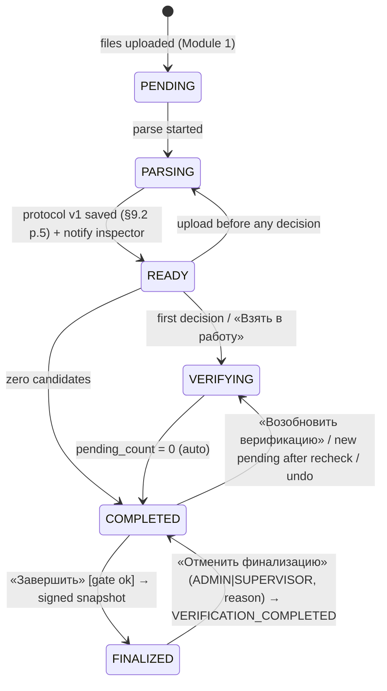

# B05 — Inspector Verification (Module 3, priority High)

> Planning/analysis report. Scope: ТЗ Module 3 «Верификация инспектором» (§7 row 3, §9.3; the section is titled «Модуль сравнения и формирования предварительного протокола» in the source by mistake). Requirement prefix: **VER-NN**.
> Language: English. Russian domain terms, statuses, UI labels and ТЗ quotes are kept verbatim. Product UI is Russian.

---

## 0. Executive summary

- **What this block is.** Module 3 is where an AI *candidate* becomes a legally meaningful decision. Only an inspector can set `CONFIRMED_VIOLATION` (§9.2 p.3). Every decision needs traceable evidence, a user, a timestamp, a comment, and a reason code for rejections. Finalization freezes everything. Only confirmed records go to ИАИС «РиН».
- **Where the jury will probe.** (1) the evidence card: expected/actual values, ПД/РД/ИД pages with highlighted bbox areas, шифр, редакция, approval status and `approved_change_ref`, all visible at once; (2) the three actions and their mandatory fields; (3) splitting composite candidates, with no `PARTIALLY_CONFIRMED`; (4) re-uploading files during verification without resetting decisions; (5) the finalization gate, the lock after finalizing, and un-finalization by admin/supervisor with a reason; (6) Dispute_Log, where the AI disagrees with a rejection (§9.4 sample comments); (7) the usability targets: ≤30 min per protocol and ≤3 clicks per violation, plus a usability test with 5 inspectors.
- **Design stance.**
  - A **keyboard-first verification workspace**: a queue on the left, 2–3 synchronized deep-zoom viewers in the centre (blue = expected/ПД basis, red = actual/deviation, the same colour convention as the organizers' markup kit), and the evidence card with its action bar on the right.
  - The next card opens automatically after each decision.
  - Comments and reason codes are prefilled by the AI.
  - Timing and click counting are built in, so the usability criteria can be *proven* and not just claimed.
- **Status model.** Statuses are kept on **separate axes**: model outcome (`finding_status`), data quality (`completeness_status`), inspector decision (`inspector_status`) and process/protocol status. The API returns both naming schemes from the ТЗ: §9.1 `COMPLETED/FINALIZED` and §9.3 `VERIFICATION_COMPLETED/PROTOCOL_FINALIZED`.
- **Decision storage.** Decisions are **append-only** records. Each one is bound to the evidence fingerprint the inspector actually saw. Optimistic locking and idempotency keys protect against races and double-submits. Incremental re-checks follow explicit rules for which decisions survive a change in evidence.
- **Coverage.** 75 atomic requirements: 63 FULL, 11 SIMPLIFIED, 1 MOCKED (УКЭП signature), 0 out of scope.

---

## 1. Scope — exact ТЗ clauses covered

| ТЗ clause | Quote / content | What this block does |
|---|---|---|
| §1.2 bullet 2 | «верификация выявленных нарушений инспектором с фиксацией решения и обоснования» | Decision recording with basis/comment |
| §1.2 bullet 4 | «инкрементальная дозагрузка файлов до момента финализации протокола» | Upload-during-verification semantics, finalization lock |
| §7 row 3 (High) | «Проверка кандидатов по карточкам доказательств; присвоение CONFIRMED_VIOLATION, NEGATIVE_VERIFIED или CLARIFICATION_REQUIRED; атомарные решения» | Whole block |
| §7 row 2 | «раздельные статусы комплектности и findings; обязательные карточки доказательств» | Completeness panel separated from candidates; card rendering |
| §7 row 9 | «Фиксация всех действий инспектора (подтверждение/отклонение, причина, время); версионность протоколов» | Emits audit events, protocol versions (Audit infra = Module 9) |
| §9.1 «Выбор актуальной редакции» | «При конфликте редакций… система присваивает CLARIFICATION_REQUIRED и не формирует вывод о нарушении. Устаревшая редакция не может использоваться как эталон.» | Authoritative-revision chooser; hard block on superseded revisions |
| §9.1 p.4 | normalized bbox «после учёта CropBox, MediaBox и Rotate; это обязательно для корректного отображения разметки» | Viewer overlay correctness |
| §9.1 «Статусы процесса проверки» | PENDING / PARSING / READY / VERIFYING / COMPLETED / FINALIZED, with upload/verification possibility | Process state machine |
| §9.2 p.3 | «CONFIRMED_VIOLATION присваивается исключительно инспектором после проверки доказательств и отсутствия согласованного изменения, отменяющего исходное требование» | Only the inspector can confirm; approved-change guard |
| §9.2 p.4 | evidence card fields: «finding_id, код параметра/правила, expected/actual, file_id и SHA-256 каждого источника, стадия, шифр, редакция, статус утверждения, лист/страница, bbox/polygon, обоснование, уровень риска, решение инспектора и причина решения» | Card content; decision fields in protocol tables (3) and (4) |
| §9.2 incremental | «Предыдущая версия протокола сохраняется в истории» | Decisions carried across protocol versions |
| §9.2 «Статусы параметров» table, column «Действие инспектора» | NEGATIVE_VERIFIED «Просмотр по выборке или при споре»; CANDIDATE «Подтвердить, отклонить или запросить уточнение»; CONFIRMED «Определить дальнейшее действие в пределах полномочий»; MISSING_EVIDENCE «Запросить/дозагрузить документ»; NOT_APPLICABLE «Подтвердить применимость при необходимости»; NOT_COMPARABLE «Уточнить состав/качество данных»; CLARIFICATION_REQUIRED «Выбрать авторитетную редакцию и зафиксировать основание»; SUSPICION «Сначала привязать доказательства; затем при необходимости преобразовать в CANDIDATE» | One UI action per status |
| §9.2 risk note | «Уровень риска… используется только для очередности экспертной проверки… не является автоматическим основанием для предписания» | Ordering only, with a disclaimer |
| **§9.3 (entire)** | Назначение, «Статусы верификации» table, «Алгоритм верификации» p.1–5, «Отмена финализации», «Критерии юзабилити» | Whole block |
| §9.4 scenario table | Rejected → negative draft example; clarification → not in GOLD; confirmed → positive GOLD candidate, «передача наружу только после финализации» | Decision side effects (GOLD pipeline itself = Module 4) |
| §9.4 sample comments | agreement comment (OCR_ERROR) and disagreement comment (→ CLARIFICATION_REQUIRED) | AI rejection validator + Dispute_Log |
| §9.5 | «Для перевода в CANDIDATE требуются конкретные источники и координаты доказательств; для CONFIRMED_VIOLATION — решение инспектора» | Evidence binding and conversion of SUSPICION |
| §9.6 | Transfer «возможна только при статусе протокола PROTOCOL_FINALIZED»; «сбой внешней передачи не отменяет и не изменяет подписанное решение инспектора»; auto-intake after finalization only notifies | Finalization invariants, РиН payload filter (transport = Module 6) |
| §10 tables | #2 Checks, #5 Protocols, #6 Rejection_Log, #7 Dispute_Log, #8 Suspicions (inspector_status), #12 Audit_Log, #14 Evidence_Fragments, #15 Dataset_Items | Owns #6, #7 and the decision columns; writes into the others |
| §11 #15 (and §9.3) | «Время полного цикла верификации протокола… Не более 30 минут ±10 минут» | UX design + instrumentation |
| §11 #9, #10, #11 | incremental ≤1 min; API p95 ≤200 ms; ≥100 concurrent inspectors | NFRs for verification endpoints |
| §12 #1, #2, #4, #6, #10 | auth, roles (inspector / admin / ML engineer), audit with IP, 152-ФЗ, УКЭП for РиН requests | RBAC for decisions/finalization, audit fields |
| §14.1 | «Положительная GOLD-метка допустима только для CONFIRMED_VIOLATION; отрицательная — для NEGATIVE_VERIFIED. Для каждой метки сохраняются решение эксперта, причина, дата и версии источников.» | Decision record content |
| Приложение 1, sheet «СХЕМА GOLD» | `approved_change_ref` string/NONE mandatory; `expert_id / timestamp`; `expert_reason_code / comment` «Код и обоснование подтверждения/отклонения» | Card fields; confirmation also has a reason (basis) code |
| Перечень ИД — registry rules | «Несколько редакций без однозначного статуса → CLARIFICATION_REQUIRED; вывод о нарушении блокируется до решения инспектора»; «NOT_APPLICABLE с обязательным основанием»; «Повторная загрузка создаёт новую запись и новую версию протокола» | Revision resolution; N/A basis; versioning |

Related NFRs: §1.3 (OpenAPI 3.0 validation), §1.4 (pull model), §13.1 (JSON logs with request_id, user_id), §12.3 (TLS), §12 #7 (integrity per 187-ФЗ → DB-level immutability after finalization).

---

## 2. Requirements checklist

Legend. Priority for winning: **MUST** / **SHOULD** / **NICE**. MVP decision: **FULL** / **SIMPLIFIED** / **MOCKED** / **OUT_OF_SCOPE**.

### 2.1 Evidence card and viewing

| ID | Requirement | ТЗ ref | Prio | MVP | Justification |
|---|---|---|---|---|---|
| VER-01 | Card shows expected and actual values at the same time, with unit, delta (absolute and %), and the trigger rule applied | §9.3 p.1; §9.2 p.3 | MUST | FULL | Core of the card |
| VER-02 | ПД/РД/ИД pages with highlighted areas (bbox/polygon overlays) are visible together in one screen | §9.3 p.1 | MUST | FULL | Side-by-side deep-zoom viewers |
| VER-03 | Шифр (document_code) and редакция (revision) shown per source | §9.3 p.1 | MUST | FULL | Sources table + viewer pane headers |
| VER-04 | Approval status (approval_status, approval_date, signature_status) shown per source, plus a current/superseded badge | §9.3 p.1; registry rules | MUST | FULL | Needed for the WRONG_REVISION judgement |
| VER-05 | Link to the approved change: `approved_change_ref` value or `NONE`. If it points to a file, it opens that file/page. RD change-registration entries («Изм.» tables) are shown separately as *information*, not as an approved change | §9.3 p.1; GOLD schema | MUST | FULL | Pilot UNDMS/LOS3A show why the two must not be conflated |
| VER-06 | All mandatory evidence-card fields from §9.2 p.4 present (finding_id … решение инспектора и причина решения) | §9.2 p.4 | MUST | FULL | Checklist-tested |
| VER-07 | Completeness statuses shown **separately** from candidates (own tab/panel), with «Статус загрузки документов» (PD_/RD_/ID_ UPLOADED/PARTIAL/MISSING) and «Тип проверки» (scenario) | §9.3 p.1; §9.2 p.4; §7 row 2 | MUST | FULL | Explicit in ТЗ |
| VER-08 | Overlays land exactly where the normalized [0;1] coordinates say, after CropBox/MediaBox/Rotate | §9.1 p.4 | MUST | FULL | Same MuPDF engine for parsing and rendering + joint contract test |
| VER-09 | Synchronized side-by-side viewers: zoom-to-bbox on open, cycling through multiple fragments, linked/coordinate/independent sync modes | derived from §9.3 p.1 + usability criteria | MUST | FULL | Pilot sheets up to A0 (3370×2384 pt) with bboxes ~5% of the page; unusable without this |
| VER-10 | Page-level evidence without bbox is displayable (pilot POL17-N01 has «bbox —») | Приложение 1 «ПРИМЕРЫ» | SHOULD | FULL | Stored as page-scope `[0,0,1,1]` + `scope=PAGE` |
| VER-11 | DOCX and XML sources are viewable in the card | §1.5, §9.1 inputs | SHOULD | SIMPLIFIED | DOCX through the PDF rendition from Module 1; XML as a tree with the evidence node highlighted by XPath |
| VER-12 | OCR/extraction quality visible: text origin (TEXT_LAYER / OCR / CV), OCR confidence, LOW_QUALITY/ABSTAIN flags | §9.1 p.1 | SHOULD | FULL | Prevents blind confirmation; feeds the dispute rules |
| VER-13 | Risk level/review_priority shown only as ordering, with the disclaimer text; never changes a status | §9.2 risk note; §8.1 | MUST | FULL | Invariant I12 |
| VER-14 | Matrix/model/dataset/protocol versions and input_manifest_hash visible in the header and fixed in the protocol | §9.2 p.1; §14.2 | MUST | FULL | Reproducibility |

### 2.2 Decisions

| ID | Requirement | ТЗ ref | Prio | MVP | Justification |
|---|---|---|---|---|---|
| VER-15 | «Подтвердить нарушение» → `CONFIRMED_VIOLATION`; the decision contains user_id, timestamp, comment | §9.3 p.2 | MUST | FULL | — |
| VER-16 | CONFIRMED_VIOLATION can be set **only** by an inspector decision. No model, system or import path can set it | §9.2 p.3 | MUST | FULL | Enforced in service + DB check (invariant I1) |
| VER-17 | Confirmation is allowed only when no approved change cancels the requirement. If `approved_change_ref ≠ NONE`, confirming needs an explicit justification | §9.2 p.3 | MUST | FULL | Extra mandatory field in that case only |
| VER-18 | Confirmation carries an `expert_reason_code` (basis code), auto-defaulted from the discrepancy type | GOLD schema «Код и обоснование подтверждения/отклонения» | SHOULD | FULL | 0 extra clicks |
| VER-19 | «Отклонить» → `NEGATIVE_VERIFIED` with mandatory `reason_code` **and** comment | §9.3 p.2 | MUST | FULL | 422 when either is missing |
| VER-20 | Reason-code dictionary covering the ТЗ examples (WRONG_REVISION, APPROVED_CHANGE, OCR_ERROR, LINKING_ERROR, NOT_APPLICABLE_PARAM) plus extensions; stored as a table and admin-editable | §9.3 p.2; §9.4 sample | MUST | FULL | §3.6 |
| VER-21 | A rejection creates a *verified negative example*: a Rejection_Log row plus a **draft** Dataset_Item, used for training only after curator review | §9.3 Назначение; §9.4 row 1; §10 #6 | MUST | FULL | Curation itself is Module 4 |
| VER-22 | AI agreement comment attached on rejection (§9.4 sample 1 wording) | §9.4 | MUST | FULL | Template |
| VER-23 | If the AI disagrees with a rejection: status → `CLARIFICATION_REQUIRED`, a Dispute_Log row is created, the §9.4 sample 2 comment is attached, and the record stays out of GOLD/export until the inspector decides again | §9.4; §10 #7 | MUST | FULL | Deterministic validator (§3.7) |
| VER-24 | Rejection_Log carries `rejection_reason`, `ai_verdict`, `suggested_fix`, `retraining_status` | §10 #6 | MUST | FULL | Also feeds the weekly ML report (Module 10) |
| VER-25 | «Требует уточнения» → `CLARIFICATION_REQUIRED` with a recorded basis (basis code + text) | §9.3 p.2; §9.2 table | MUST | FULL | — |
| VER-26 | Choose the authoritative revision and record the basis; this triggers re-comparison of every affected group | §9.2 table; §9.1; §9.3 Назначение «выбор актуальной редакции» | MUST | FULL | One resolution applies to the whole document chain |
| VER-27 | A superseded/cancelled revision can never be chosen as the etalon | §9.1 | MUST | FULL | UI disables it; API returns 422 |
| VER-28 | CLARIFICATION_REQUIRED never enters GOLD; the card shows the sources, coordinates and the revision conflict | §9.4 row 2 | MUST | FULL | — |
| VER-29 | A package without the machine-readable registry is CLARIFICATION_REQUIRED; the inspector resolves metadata in bulk | Перечень ИД registry rules | SHOULD | SIMPLIFIED | Bulk revision-resolution dialog; the registry wizard belongs to Module 1 |
| VER-30 | A composite candidate is split into atomic findings, each with its own decision and evidence. `PARTIALLY_CONFIRMED` does not exist | §9.3 p.2 | MUST | FULL | §3.8 |
| VER-31 | Atomic decisions: one decision per atomic finding, committed in one DB transaction with audit, logs and outbox | §7 row 3 | MUST | FULL | §3.5 |
| VER-32 | A decision can be changed before finalization; the history is append-only; undo is available | §7 row 9 (versioning); §9.3 | MUST | FULL | — |

### 2.3 Re-upload, incremental update, completeness

| ID | Requirement | ТЗ ref | Prio | MVP | Justification |
|---|---|---|---|---|---|
| VER-33 | Files can be uploaded during verification without resetting verification | §9.3 p.3; §1.2 | MUST | FULL | The upload endpoint is Module 1; the lock rules are here |
| VER-34 | After an upload, an incremental re-check updates only the affected groups and creates a new protocol version; the previous version stays in history | §9.3 p.3; §9.2; registry rule | MUST | FULL | Engine = Module 2 |
| VER-35 | Explicit rules decide whether a decision survives an evidence change (fingerprint-based) | derived from §9.3 p.3 + §9.1 | MUST | FULL | §3.10 |
| VER-36 | Incremental update finishes in ≤1 min | §11 #9 | SHOULD | FULL | Only affected groups are re-run |
| VER-37 | Finalization is allowed only when every CANDIDATE is processed or explicitly moved to CLARIFICATION_REQUIRED | §9.3 p.4 | MUST | FULL | Server-side gate with a list of blockers |
| VER-38 | MISSING_EVIDENCE is listed separately and never becomes a violation | §9.3 p.4; §9.2 | MUST | FULL | Invariant I5 |
| VER-39 | MISSING_EVIDENCE offers «Запросить/дозагрузить документ» | §9.2 table | MUST | SIMPLIFIED | Scoped upload is FULL; the letter-to-developer template is NICE |
| VER-40 | NOT_APPLICABLE: the inspector can confirm or dispute applicability with a basis. NOT_COMPARABLE: the inspector can request a replacement | §9.2 table; registry rules | SHOULD | SIMPLIFIED | Simple actions with a basis text |
| VER-41 | Model-issued NEGATIVE_VERIFIED can be reviewed on a sample and disputed (reopened as CANDIDATE) | §9.2 table «Просмотр по выборке или при споре» | SHOULD | SIMPLIFIED | Random 10% sample tab + «Оспорить» |
| VER-42 | For CONFIRMED findings, a «дальнейшее действие в пределах полномочий» field is recorded; nothing issues a предписание automatically | §9.2 table; risk note | NICE | SIMPLIFIED | Optional dictionary field |

### 2.4 Finalization, locking, un-finalization, external transfer

| ID | Requirement | ТЗ ref | Prio | MVP | Justification |
|---|---|---|---|---|---|
| VER-43 | Button «Завершить» finalizes: process `FINALIZED` / verification `PROTOCOL_FINALIZED`; an immutable protocol snapshot with a hash is created | §9.1 table; §9.3 | MUST | FULL | — |
| VER-44 | After finalization, no uploads and no status changes are possible. Enforced at API level (423) **and** by DB triggers | §9.3 p.5 | MUST | FULL | Integrity (§12 #7) |
| VER-45 | Only an admin or an inspector with supervisor rights can un-finalize | §9.3 «Отмена финализации» | MUST | FULL | RBAC |
| VER-46 | Un-finalization needs a mandatory reason, recorded in Audit_Log | §9.3 | MUST | FULL | — |
| VER-47 | After un-finalization the status is `VERIFICATION_COMPLETED` (process COMPLETED) and uploads work again | §9.3 | MUST | FULL | — |
| VER-48 | The verification status set (PENDING, CONFIRMED_VIOLATION, NEGATIVE_VERIFIED, CLARIFICATION_REQUIRED, VERIFICATION_COMPLETED, PROTOCOL_FINALIZED) is implemented and mapped to process statuses, and the upload-possibility matrix is enforced | §9.3 table; §9.1 table | MUST | FULL | §3.2 |
| VER-49 | Only inspector-confirmed records go to РиН, together with the protocol, matrix and model versions and the input file registry | §9.3 p.4 | MUST | FULL | This block builds the payload; Module 6 transports it |
| VER-50 | Transfer happens only at PROTOCOL_FINALIZED. A sync failure (PENDING_SYNC) never changes the decision | §9.6 | MUST | FULL | Snapshot is immutable |
| VER-51 | Auto-intake from РиН after finalization only notifies the inspector and offers «создать новую проверку» | §9.6 | SHOULD | SIMPLIFIED | Banner + button; intake = Module 6 |
| VER-52 | The inspector's decision/finalization is signed («подписанное решение инспектора»; УКЭП) | §9.6; §12 #10 | SHOULD | MOCKED | Demo signer behind a signer interface; CryptoPro is out of reach |

### 2.5 GOLD, suspicions, traceability

| ID | Requirement | ТЗ ref | Prio | MVP | Justification |
|---|---|---|---|---|---|
| VER-53 | A confirmation creates a positive GOLD *candidate*; it leaves the system only after finalization | §9.4 row 3 | MUST | FULL | Event to Module 4 |
| VER-54 | Every GOLD label stores the expert decision, reason, date and source versions (file_id, SHA-256, revision, approval) | §14.1; GOLD schema | MUST | FULL | Decision record holds all of it |
| VER-55 | SUSPICION → CANDIDATE only after concrete sources and coordinates are bound (≥1 expected + ≥1 actual fragment) | §9.5; §9.2 table | MUST | FULL | 422 otherwise |
| VER-56 | SUSPICION is never a violation or a GOLD label; `inspector_status` is tracked (PENDING / CONVERTED / DISMISSED) | §9.5; §10 #8 | MUST | FULL | — |
| VER-57 | Evidence-binding tool: draw a bbox on a page, pick file/page/role | §9.2 table «привязать доказательства» | MUST | FULL | Also used by split |
| VER-58 | Each decision is traceable to the exact evidence snapshot the inspector saw (fingerprint, file hashes, protocol version) | §9.3 Назначение «полной трассируемостью решения» | MUST | FULL | Stale-evidence guard |
| VER-59 | Protocol versioning: initial, incremental, final and re-final versions | §7 row 9; §10 #5 | MUST | FULL | — |

### 2.6 Security, audit, concurrency, NFR

| ID | Requirement | ТЗ ref | Prio | MVP | Justification |
|---|---|---|---|---|---|
| VER-60 | Every inspector action is audited (user_id, action, object_id, details, timestamp, ip_address, user_agent) | §7 row 9; §12 #4; §10 #12 | MUST | FULL | Written in the same transaction |
| VER-61 | Roles: INSPECTOR (view/verify), SUPERVISOR (inspector + un-finalize), ADMIN (un-finalize, dictionaries), ML_ENGINEER (read-only logs/data) | §12 #2; §9.3 | MUST | FULL | Login/password is platform-level |
| VER-62 | Concurrency: optimistic locking per finding and per process, a conflict dialog, presence indicators | derived; §11 #11 | SHOULD | FULL | — |
| VER-63 | Idempotent submissions (Idempotency-Key) | derived | SHOULD | FULL | Stops double-click duplicates |
| VER-64 | The inspector is notified when a protocol is ready | §9.2 p.5 | SHOULD | SIMPLIFIED | In-app + SSE; email/Telegram out |
| VER-70 | All verification endpoints validated against OpenAPI 3.0 | §1.3 | MUST | FULL | Contract-first |
| VER-71 | Verification API p95 ≤200 ms | §11 #10 | SHOULD | FULL | Simple transactions; cached cards |
| VER-72 | Negative scenarios (finalized, conflict, validation, stale evidence, render failure) return clear RU messages | §7 row 12 | MUST | FULL | Problem+json codes (§3.15.4) |
| VER-73 | Personal data minimization: ФИО in the UI only, user_id in logs, pseudonymized usability data | §12 #6 | SHOULD | SIMPLIFIED | — |
| VER-75 | ≥100 concurrent inspectors (stateless API, SSE) | §11 #11 | SHOULD | SIMPLIFIED | k6 load test on the local stack |

### 2.7 Usability

| ID | Requirement | ТЗ ref | Prio | MVP | Justification |
|---|---|---|---|---|---|
| VER-65 | Full cycle ≤30 min for an experienced user (132 params, 14 violations) | §9.3; §11 #15 | MUST | FULL | Design target ≤20 min median |
| VER-66 | ≤3 clicks per violation | §9.3 | MUST | FULL | Click budget in §3.17.4 |
| VER-67 | Keyboard-first flow: hotkeys, auto-advance, reason quick-pick, prefilled comments, undo | derived from VER-65/66 | SHOULD | FULL | — |
| VER-68 | Built-in timing/click instrumentation and an automatic usability report | derived; needed to prove VER-65/66 | MUST | FULL | `ui_events` |
| VER-69 | Usability test with 5 inspectors, then UI rework until the targets are met | §9.3 | MUST | SIMPLIFIED | Method and tooling FULL; participants may be proxies if real inspectors are unavailable |
| VER-74 | Pilot evidence groups (9 objects + 3 ventilation violations) seeded and reviewable | §14.1; Приложение 1 | MUST | FULL | Demo base |

**Totals:** 75 requirements. FULL 63; SIMPLIFIED 11 (VER-11, 29, 39, 40, 41, 42, 51, 64, 69, 73, 75); MOCKED 1 (VER-52); OUT_OF_SCOPE 0.

---

## 3. Proposed design

### 3.1 Vocabulary

- **Evidence group** (`evidence_group_id`, §14.1): object + one parameter or atomic rule + the comparable current ПД/РД/ИД revisions + fragments with coordinates. It is the unit of result (§9.2).
- **Finding** (a Checks row, `finding_id` = stable human ID, e.g. `OKT103-M083-01`): the verifiable item attached to one evidence group. Kinds: `MATRIX` (from the 132 params), `SUSPICION_CONVERTED` (from Module 5), `SPLIT_CHILD` (created by splitting).
- **Decision**: an append-only record of one inspector action on one finding.
- **Verification session** = the process (`process_id`), which carries the process status.
- **Protocol version**: a Protocols row. It can be DRAFT (initial or incremental) or FINAL (signed snapshot).
- **group_key**: a deterministic identity of an evidence group that survives re-checks and new revisions. It is computed by Module 2 (contract in §4). The decision carry-over mechanism depends on it.

### 3.2 Status model (reconciliation)

Four orthogonal axes. Keeping them apart fixes the naming clashes in the ТЗ (see §6).

| Axis | Field | Values | Set by |
|---|---|---|---|
| A. Model outcome | `checks.finding_status` | `CANDIDATE`, `NEGATIVE_VERIFIED`, `SUSPICION`, `CONFIRMED_VIOLATION` (GOLD-schema enum) | Model (Module 2) for CANDIDATE/NEGATIVE; Module 5 for SUSPICION; **inspector only** for CONFIRMED_VIOLATION (mirrors axis C) |
| B. Data quality | `checks.completeness_status` | `COMPLETE`, `MISSING_EVIDENCE`, `NOT_APPLICABLE`, `NOT_COMPARABLE`, `CLARIFICATION_REQUIRED` | Module 2; the inspector through revision resolution / N/A confirmation |
| C. Inspector decision | `checks.inspector_status` | `PENDING`, `CONFIRMED_VIOLATION`, `NEGATIVE_VERIFIED`, `CLARIFICATION_REQUIRED` (§9.3 table rows 1–4). NULL for rows that are not reviewable (pure completeness rows) | Inspector (and the AI validator for the dispute case, §3.7) |
| D. Process / protocol | `processes.status` + derived `verification_status` | `PENDING, PARSING, READY, VERIFYING, COMPLETED, FINALIZED` (§9.1); alias `verification_status`: `PENDING` (candidates await decisions) → `VERIFICATION_COMPLETED` (=COMPLETED) → `PROTOCOL_FINALIZED` (=FINALIZED) | System + inspector (finalize) + admin/supervisor (un-finalize) |

Additional structural field: `checks.lifecycle_state ∈ {ACTIVE, SPLIT, SUPERSEDED}`. A split parent is `SPLIT`. It is not a status, is never counted, and never becomes a label.

**Mapping of an inspector action to the axes:**

| Action | inspector_status | finding_status | completeness_status | Counted as violation | GOLD |
|---|---|---|---|---|---|
| Confirm | CONFIRMED_VIOLATION | CONFIRMED_VIOLATION | COMPLETE | yes | positive draft |
| Reject (AI agrees/uncertain) | NEGATIVE_VERIFIED | NEGATIVE_VERIFIED (`decided_by=INSPECTOR`) | COMPLETE (or NOT_APPLICABLE for NOT_APPLICABLE_PARAM) | no | negative draft |
| Reject (AI disagrees) | CLARIFICATION_REQUIRED (dispute OPEN) | CANDIDATE | unchanged | no | none |
| Clarify | CLARIFICATION_REQUIRED | CANDIDATE | CLARIFICATION_REQUIRED | no | none |
| Revert/undo | PENDING | CANDIDATE | restored | no | draft withdrawn |

**Upload/verification possibility matrix (enforced by API):**

| process.status | verification_status alias | Upload | Decisions | Notes |
|---|---|---|---|---|
| PENDING | — | yes | no | before first parse |
| PARSING | — | no (queued with 409 + retry hint) | no | only during the *initial* parse (see §6 C4) |
| READY | PENDING | yes → re-parse (READY→PARSING→READY while no decision exists yet) | yes | first decision → VERIFYING |
| VERIFYING | PENDING | yes → incremental re-check; status stays VERIFYING; affected findings locked | yes (except locked findings) | auto → COMPLETED when pending = 0 |
| COMPLETED | VERIFICATION_COMPLETED | yes → incremental re-check | no. «Возобновить верификацию» (audited) → VERIFYING first | new pending (new candidates / review-required) → VERIFYING automatically |
| FINALIZED | PROTOCOL_FINALIZED | **no** (423) | **no** (423) | only un-finalize by ADMIN/SUPERVISOR |

### 3.3 Finding state machine (inspector axis)

```mermaid
stateDiagram-v2
    [*] --> PENDING: CANDIDATE produced by Module 2\n(or SUSPICION converted, or split child)
    PENDING --> CONFIRMED_VIOLATION: Подтвердить (C)
    PENDING --> NEGATIVE_VERIFIED: Отклонить + reason_code + comment\n[validator AGREE/UNCERTAIN]
    PENDING --> CLARIFICATION_REQUIRED: Отклонить [validator DISAGREE] → Dispute OPEN
    PENDING --> CLARIFICATION_REQUIRED: Требует уточнения (U) + basis
    PENDING --> SPLIT: Разделить (parent leaves axis; children start PENDING)
    CLARIFICATION_REQUIRED --> PENDING: revision resolved → recheck returns CANDIDATE
    CLARIFICATION_REQUIRED --> CONFIRMED_VIOLATION: re-decision
    CLARIFICATION_REQUIRED --> NEGATIVE_VERIFIED: re-decision (dispute INSPECTOR_UPHELD)
    CONFIRMED_VIOLATION --> PENDING: undo / change decision / evidence MATERIAL change
    NEGATIVE_VERIFIED --> PENDING: undo / change decision / evidence MATERIAL change
    CONFIRMED_VIOLATION --> NEGATIVE_VERIFIED: change decision (before finalization)
    NEGATIVE_VERIFIED --> CONFIRMED_VIOLATION: change decision (before finalization)
```



Every transition = a new `verification_decisions` row. Guards on **all** transitions: process not FINALIZED; process not COMPLETED unless reopened (undo within 10 s reopens automatically); finding `ACTIVE`; not locked by a running re-check; `If-Match` row_version matches; `seen_fingerprint` equals the current fingerprint.

SUSPICION axis (Suspicions.inspector_status): `PENDING → CONVERTED` (evidence bound → a new CANDIDATE finding) | `PENDING → DISMISSED` (dismissal code + comment; not a GOLD negative because no complete card exists).

### 3.4 Process state machine



The incremental re-check during VERIFYING/COMPLETED is a **sub-state** (`processes.recheck_state ∈ {IDLE, RUNNING, FAILED}`, `recheck_job_id`). It is not a transition to PARSING. This is how «без сброса верификации» (§9.3 p.3) is honoured.

### 3.5 Decision service (atomic transaction)

`POST /findings/{id}/decisions` runs in **one PostgreSQL transaction**:

1. `SELECT status, recheck_state FROM processes WHERE id=$p FOR SHARE`. Reject with 423 if FINALIZED. Reject with 409 if COMPLETED and not reopened (except undo ≤10 s, which also reopens). Finalize takes `FOR UPDATE`, so decisions and finalization serialize.
2. Validate the body against OpenAPI and the per-decision rules (reason_code required for reject; comment non-empty; approved_change_ref required for APPROVED_CHANGE; authoritative revision not SUPERSEDED/CANCELLED; justification needed if confirming while approved_change_ref ≠ NONE).
3. Guard `seen_fingerprint == checks.evidence_fingerprint`, else 409 `EVIDENCE_CHANGED`.
4. Run the **rejection validator** (§3.7, in-process, <20 ms) → `ai_verdict`.
5. `UPDATE checks SET inspector_status=…, finding_status=…, completeness_status=…, current_decision_id=…, row_version=row_version+1 WHERE id=$f AND row_version=$ifMatch AND lifecycle_state='ACTIVE' RETURNING *`. Zero rows → 409 `VERSION_CONFLICT` with the current state.
6. `INSERT verification_decisions` (append-only). Set `invalidated_*` on the previous decision if it is replaced.
7. On reject: `INSERT rejection_log`. On disagree: `INSERT dispute_log`.
8. `INSERT audit_log` (action, details JSON, ip, user_agent).
9. `INSERT outbox_events` (`verification.decision.recorded`; plus `verification.dispute.opened` when relevant).
10. Recompute `pending_count`. If 0 and status is VERIFYING → set COMPLETED (+ audit `VERIFICATION_COMPLETED`, outbox `verification.completed`). If status is READY → VERIFYING.
11. Store the response under `(user_id, Idempotency-Key)` for replay.

Response includes `next_finding_id` (queue order), so the client auto-advances without another request.

### 3.6 Code dictionaries

Stored in table `decision_codes(code, kind, label_ru, description_ru, family, required_fields jsonb, gold_effect, comment_template_ru, suggested_fix_ru, hotkey_default, sort_order, is_active)`. Admin-editable (Module 8 UI pattern). Codes are **never deleted**, only deactivated, to preserve history.

#### 3.6.1 Rejection reason codes (`kind=REJECT` → NEGATIVE_VERIFIED)

| Code | RU label (UI) | Family | Required extra fields | Comment template (prefilled, editable) | suggested_fix (Rejection_Log) |
|---|---|---|---|---|---|
| `WRONG_REVISION` | Актуальная редакция выбрана неверно | MODEL_ERROR | `correct_file_id` (the right revision; SUPERSEDED/CANCELLED not selectable) | «Отклонено: сравнение выполнено с неактуальной редакцией {code} ред. {rev}. Актуальная — ред. {rev2}.» | Check predecessor/successor & approval_status selection |
| `APPROVED_CHANGE` | Согласованное изменение | LEGIT_DEVIATION | `approved_change_ref` (uploaded file+page, or external reference: type, number, date) | «Отклонено: изменение согласовано — {ref}.» | Add detection of approval documents for changes |
| `OCR_ERROR` | Ошибка распознавания (OCR) | MODEL_ERROR | optional `corrected_value` | «Отклонено: ошибка распознавания значения на {page_ref}; фактическое значение {corrected_value}.» | Add fragment to OCR set; check preprocessing |
| `EXTRACTION_ERROR` | Ошибка извлечения значения (ячейка, единица измерения, множитель) | MODEL_ERROR | optional `corrected_value` | «Отклонено: значение извлечено неверно ({detail}).» | Refine regex_pattern / semantic anchor of {param} |
| `CV_ERROR` | Ошибка распознавания графики (линии, условные обозначения, масштаб) | MODEL_ERROR | — | «Отклонено: графический элемент распознан неверно на {page_ref}.» | Label fragment for CV model |
| `LINKING_ERROR` | Ошибка привязки (не тот объект / лист / помещение / элемент) | MODEL_ERROR | optional `correct_locus` | «Отклонено: сопоставлены несопоставимые фрагменты ({detail}).» | Check sheet/room linking rules |
| `WITHIN_TOLERANCE` | Расхождение в пределах допуска / нормы | MODEL_ERROR | — | «Отклонено: отклонение {delta} в пределах допуска {threshold}.» | Check min/max threshold of {param} in normative base |
| `EQUIVALENT_SOLUTION` | Равнозначное решение (иное обозначение / формулировка) | MODEL_ERROR | — | «Отклонено: решения равнозначны ({detail}).» | Add synonyms/equivalents to term dictionary |
| `METHODOLOGY_DIFFERENCE` | Различие методики подсчёта (без изменения решения) | LEGIT_DEVIATION | — | «Отклонено: различие обусловлено методикой подсчёта ({detail}).» | Encode calculation method (e.g., summer-room coefficients) |
| `NOT_APPLICABLE_PARAM` | Параметр неприменим к объекту / виду работ | LEGIT_DEVIATION | `na_basis` (sets completeness NOT_APPLICABLE «с обязательным основанием») | «Отклонено: параметр {param} неприменим — {basis}.» | Refine applicability rules of {param} |
| `DUPLICATE` | Дубликат другого finding | MODEL_ERROR | `duplicate_of` (ACTIVE finding) | «Отклонено: дублирует {finding_id}.» | Improve evidence_group dedup |
| `OTHER` | Иное | OTHER | comment ≥ 30 chars written by hand (no template) | — | Flag for curator review |

The ТЗ examples map 1:1: «актуальная редакция выбрана неверно» = WRONG_REVISION, «согласованное изменение» = APPROVED_CHANGE, «ошибка OCR» = OCR_ERROR, «ошибка привязки» = LINKING_ERROR, «параметр неприменим» = NOT_APPLICABLE_PARAM.

**Why there is no "source unreadable" code:** an unreadable source is not «предметное расхождение не подтверждено» on comparable sources, so it must not become a GOLD negative. The UI redirects the inspector to «Требует уточнения» with basis `SOURCE_UNREADABLE` (and NOT_COMPARABLE on the group).

**Quick-pick ordering:** digits 1–9 are ordered by (a) the AI-suggested code first, (b) this inspector's frequency. The ordering is stable within a session, so muscle memory still works.

#### 3.6.2 Confirmation basis codes (`kind=CONFIRM`; GOLD `expert_reason_code`)

| Code | RU label | Auto-default when |
|---|---|---|
| `CV_DEVIATION_PD_RD` | Решение РД не соответствует утверждённой ПД; согласованное изменение отсутствует | PD↔RD value/config discrepancy |
| `CV_MISSING_IN_RD` | Решение ПД не отражено в РД | actual = absent (e.g., warm-floor contours) |
| `CV_NOT_PER_RD` | Выполненные работы (ИД) не соответствуют РД | RD↔ID discrepancy |
| `CV_TOLERANCE_EXCEEDED` | Превышение допустимых отклонений по ИД | ID tolerance rule (OKT103 case) |
| `CV_UNAPPROVED_CHANGE` | Изменение внесено без требуемого согласования / экспертизы | change-log entry found, `approved_change_ref=NONE` (UNDMS case) |
| `CV_NORM_VIOLATION` | Нарушение нормативного требования (СП/ГОСТ) | normative rule / converted suspicion |

Confirm comment template: «Подтверждаю нарушение по параметру {code} «{name}»: ожидается {expected} ({stage_e} {doc_e} ред. {rev_e}, л. {sheet_e}), фактически {actual} ({stage_a} {doc_a} ред. {rev_a}, л. {sheet_a}). Согласованное изменение не представлено.» Stored with `comment_source = TEMPLATE | EDITED | MANUAL`.

#### 3.6.3 Clarification basis codes (`kind=CLARIFY`)

| Code | RU label | Needs authoritative revision choice | Stays CLARIFICATION at finalization? |
|---|---|---|---|
| `REVISION_CONFLICT` | Конфликт редакций | yes → recheck | only if left unresolved |
| `APPROVAL_UNKNOWN` | Нет признака утверждения | yes → recheck | only if left unresolved |
| `AMBIGUOUS_CHAIN` | Неоднозначная связь predecessor/successor | yes → recheck | only if left unresolved |
| `NO_REGISTRY` | Реестр файлов не представлен | bulk metadata resolution | only if left unresolved |
| `AWAITING_DOCUMENT` | Ожидается документ от застройщика | no | yes (explicit transfer) |
| `AWAITING_APPROVAL_CHECK` | Требуется проверка согласования изменения | no | yes |
| `SOURCE_UNREADABLE` | Исходный документ нечитаем / листы не сопоставлены | no (request replacement) | yes |
| `EXPERT_CONSULTATION` | Требуется консультация профильного специалиста | no | yes |

Authoritative-revision basis codes: `REGISTRY_CONFIRMED`, `STAMP_IN_PRODUCTION` (штамп «В производство работ», date), `APPROVAL_LETTER`, `CUSTOMER_CONFIRMATION`, `LATEST_UKEP_SIGNED`, `OTHER` (+ text). Suspicion dismissal codes: `NO_EVIDENCE`, `FALSE_HYPOTHESIS`, `DUPLICATE_OF_MATRIX_FINDING`, `OUT_OF_SCOPE`, `OTHER`. Un-finalization reason codes (plus mandatory text ≥20 chars): `DECISION_ERROR`, `NEW_DOCUMENTS`, `RIN_REJECTED`, `SUPERVISOR_REVIEW`, `OTHER`.

Optional `planned_action` for CONFIRMED (VER-42): `ISSUE_ORDER` (подготовить предписание), `REQUEST_EXPLANATION`, `REQUEST_DOCUMENTS`, `SCHEDULE_INSPECTION`, `NO_FURTHER_ACTION`. This is informational only; nothing is issued automatically.

### 3.7 AI rejection validator and Dispute flow

A deterministic, explainable rule engine runs on every rejection (it can be extended later with model confidence). Output: `ai_verdict ∈ {AGREE, UNCERTAIN, DISAGREE}`, `ai_rule_ids[]`, `ai_argument_ru`, `ai_evidence` (fragments/pages to show).

| Rule | Condition | Verdict | AI argument (appended to the §9.4 template) |
|---|---|---|---|
| R-OCR-1 | reason OCR_ERROR and every contested fragment has `text_origin=TEXT_LAYER` (vector PDF, no OCR involved) | DISAGREE | «Значение «{v}» извлечено из текстового слоя PDF без OCR (л. {sheet}); ошибка распознавания исключена. Проверьте привязку или извлечение.» |
| R-OCR-2 | OCR_ERROR and OCR confidence ≥ 0.98 and value confirmed by second pass | UNCERTAIN | «Уверенность распознавания {conf}.» |
| R-APC-1 | APPROVED_CHANGE and the ref is a change-registration table of the RD itself («Изм./Лист/Содержание изменения») or a file with approval_status ∉ {APPROVED, FOR_CONSTRUCTION} | DISAGREE | «Запись в таблице регистрации изменений РД не является согласованием изменения ПД; требуется документ утверждения/экспертизы.» |
| R-APC-2 | APPROVED_CHANGE with an external ref that is not in the uploaded set | UNCERTAIN | «Документ согласования не загружен; для трассируемости рекомендуется дозагрузка.» |
| R-REV-1 | WRONG_REVISION but every source is the latest applicable approved revision in its chain and no competing revision exists | DISAGREE | «Использованы актуальные утверждённые редакции: {list}. Иных редакций в реестре нет.» |
| R-NA-1 | NOT_APPLICABLE_PARAM but the applicability rule marks the parameter as mandatory for this object class (e.g., §3 note: sections 5, 6, 9, 11 mandatory for budget-funded objects) | DISAGREE | «Параметр обязателен для объектов данного типа ({basis}).» |
| R-TOL-1 | WITHIN_TOLERANCE but \|delta\| exceeds `Params.max_value/min_value` or the trigger threshold (e.g., >1% for M-002) | DISAGREE | «Отклонение {delta} превышает порог {threshold} ({normative_ref}).» |
| R-LNK-1 | LINKING_ERROR but locus keys (room/element number, sheet designation, document codes) match exactly and linkage score ≥ 0.95 | UNCERTAIN | «Привязка совпадает по номеру помещения и листу.» |
| R-HIGH-1 | review_priority HIGH, model confidence ≥ 0.95, reason ∈ {EQUIVALENT_SOLUTION, OTHER} | UNCERTAIN | «Высокая уверенность модели; запись помечена для куратора.» |
| (default) | none of the above | AGREE | — |

**Behaviour:**
- **AGREE / UNCERTAIN** → NEGATIVE_VERIFIED. A system comment is attached, word for word per §9.4 sample 1: «Результат инспектора: NEGATIVE_VERIFIED. Причина: {reason_code}. Запись включена в черновик следующей версии набора данных; её использование для обучения допускается только после проверки куратором данных и выпуска dataset_version». UNCERTAIN also sets `rejection_log.curator_flag=true`.
- **DISAGREE** → inspector_status CLARIFICATION_REQUIRED, a Dispute_Log row (`resolution_status=OPEN`), and the system comment per §9.4 sample 2: «Статус: CLARIFICATION_REQUIRED. Показаны точные страницы и доказательные фрагменты. До повторного решения инспектора запись не включается в GOLD и не передаётся во внешнюю систему» + «Основание: {ai_argument_ru}». The card immediately shows the dispute banner with three actions:
  - «Настоять на отклонении» → NEGATIVE_VERIFIED; needs an additional hand-written comment; dispute `INSPECTOR_UPHELD`; the GOLD draft gets `disputed=true` for curator attention.
  - «Подтвердить нарушение» → CONFIRMED; dispute `AI_UPHELD`.
  - «Оставить на уточнении» → CLARIFICATION_REQUIRED with a basis; dispute `KEPT_CLARIFICATION`. This counts as the explicit transfer that §9.3 p.4 requires.
- `resolved_by` = the user who re-decided. Optional config `disputes_require_supervisor=false`: when true, only a SUPERVISOR can resolve (`ESCALATED`).
- The AI **never** sets CONFIRMED_VIOLATION or NEGATIVE_VERIFIED on its own. It can only hold a rejection in CLARIFICATION pending the inspector's re-decision, which is exactly the §9.4 sample.
- **Pre-confirm warnings** (not disputes): confirming while `approved_change_ref ≠ NONE`, or while any fragment is LOW_QUALITY/ABSTAIN, requires an explicit justification checkbox and text.

### 3.8 Splitting composite candidates

Pilot examples that need splitting:
- Ventilation violation 3: rooms 140, 142 (missing local exhaust branches) and 147, 198, 314 (changed configuration) on ПД л.10 vs РД ОВ1 л.4/6.
- ALT79B-V01: two ПД pages (19, 20) and two РД pages (4, 5), each with several bboxes.

**Flow:**
1. Press «Разделить» (S). The split editor opens as a mode of the workspace, with viewers kept.
2. The system proposes children by clustering the parent's fragments by **locus** (room/element number found in the text layer inside/near the bbox, else by page + spatial cluster). Example: «Предложено разделение по помещениям: 140, 142, 147, 198, 314».
3. The inspector accepts (Enter) or edits: moves fragments between children (drag or checkbox), draws new bboxes (D), sets a child's `param_code` (default = parent's), and edits expected/actual (prefilled from fragment `extracted_value`).
4. Validation:
   - ≥2 children;
   - each child has ≥1 EXPECTED and ≥1 ACTUAL fragment (for single-document rules such as the ИД tolerance case, both roles may sit on the same file/page);
   - every parent fragment is assigned to ≥1 child or explicitly discarded with a reason;
   - the parent is ACTIVE with inspector_status ∈ {PENDING, CLARIFICATION_REQUIRED}.
5. Commit, in one transaction:
   - the parent gets `lifecycle_state=SPLIT`, its inspector_status is cleared, and it is excluded from the gate, counts, GOLD and РиН;
   - children are created with `finding_id = {parent}.{n}`, `kind=SPLIT_CHILD`, `parent_check_id`, `group_key = parent.group_key + ":" + locus_key`, new `evidence_group_id`, and fragments copied (`copied_from_fragment_id`) with the same file_id/sha/revision/approval;
   - each child starts with inspector_status PENDING and gets its own fingerprint;
   - audit `FINDING_SPLIT` with the full mapping; outbox `verification.finding.split`.
6. «Отменить разделение» is allowed only while no child has a decision (audited).

Click cost when the proposal is accepted: S → Enter → Enter (3 actions). Then each child is decided normally (2–3 clicks each).

### 3.9 Authoritative revision resolution

Triggered from:
- a finding with completeness_status CLARIFICATION_REQUIRED and basis REVISION_CONFLICT / APPROVAL_UNKNOWN / AMBIGUOUS_CHAIN / NO_REGISTRY;
- the inspector choosing «Требует уточнения» → «Выбрать актуальную редакцию».

**Revision chooser** dialog:
- Lists every file of the same `(object_id, doc_stage, discipline, document_code chain)`, showing revision, approval_status, approval_date, a detected «В производство работ» stamp (from Module 1), signature_status, uploaded_at and predecessor/successor arrows.
- SUPERSEDED/CANCELLED rows are disabled with the tooltip «Устаревшая редакция не может использоваться как эталон (§9.1)».
- The AI preselects the most likely authoritative revision: latest APPROVED/FOR_CONSTRUCTION with a stamp; ties broken by date.
- The basis code is prefilled when a stamp is detected (`STAMP_IN_PRODUCTION`, with date).

**Scope:** the resolution applies to the whole chain within this process. The dialog shows «Будет перепроверено групп: N».

**Effects:**
1. Insert a `revision_resolutions` row and audit `REVISION_CHOSEN`.
2. Publish the `comparison.recheck.request` command with `authoritative_overrides`.
3. Lock the affected findings («Обновляется…»).
4. Apply the results through §3.10.

Groups whose comparison now succeeds come back as CANDIDATE (PENDING) or model NEGATIVE_VERIFIED. The clarification decision stays in history.

### 3.10 Upload during verification: incremental update and decision survival

**Evidence fingerprint** (computed by the backend when results are applied):
```
evidence_fingerprint = sha256(canonical_json({
  group_key, param_code, rule_version,
  sources: sort_by(role, stage)[ {role, stage, file_sha256, revision, approval_status,
                                   page, bbox_q = round(bbox, 3)} ],
  expected_value_norm, actual_value_norm, approved_change_ref,
  model_outcome   // CANDIDATE | NEGATIVE_VERIFIED | NOT_COMPARABLE | ...
}))
```

**Sequence:**
1. Module 1 accepts the file (it rejects uploads when FINALIZED) and emits `ingest.file.accepted` with the parameters it may affect.
2. This block marks the candidate-affected findings as `locked_by_recheck` and pushes an SSE update.
3. Module 2 re-runs only the affected groups and emits `comparison.recheck.completed` with, for each group, `{group_key, new outcome, new sources, values}`.
4. This block classifies each group (table below), writes a new DRAFT protocol version (`trigger=INCREMENTAL`, diff summary), and unlocks.

| Change class | Detection | Decision handling | UI |
|---|---|---|---|
| **UNAFFECTED** | group not in recheck scope | kept | — |
| **IDENTICAL** | new fingerprint == old | kept | — |
| **COSMETIC** | same file_sha/page/values/outcome; bbox IoU ≥ 0.5 with the old one | kept; fingerprint updated; `decision.carried_over=true` | small «уточнены координаты» note |
| **ADDITIVE** | expected/actual sources and values unchanged; extra fragments/stages added (e.g., an ИД fragment joined a ПД–РД group) | kept; flag `new_evidence_available` (non-blocking) | «Новые доказательства» chip |
| **MATERIAL** | a source replaced by a successor revision, or value/outcome changed, or `approved_change_ref` appeared | previous decision **invalidated** (kept in history with `invalidated_by_protocol_version`); inspector_status → PENDING; `review_required_reason ∈ {SOURCE_SUPERSEDED, VALUE_CHANGED, APPROVED_CHANGE_FOUND}`; the previous decision is offered as a **one-click re-apply** | «Источник обновлён — требуется повторное решение (ранее: Подтверждено, Иванов 12:03)» |
| **CONSISTENT_FLIP** | new model outcome agrees with the existing inspector decision (e.g., inspector rejected, new model outcome = NEGATIVE) | kept; note | — |
| **NEW_GROUP** | a new group, e.g., MISSING_EVIDENCE resolved into a CANDIDATE | new finding PENDING → COMPLETED goes back to VERIFYING | appears in queue as «новый» |
| **GROUP_GONE** | group no longer produced (e.g., parameter now NOT_APPLICABLE) | if the decision was CONFIRMED → MATERIAL handling; otherwise the finding is `SUPERSEDED` (history kept) | — |

Split children follow the same rules through their own `group_key`. If the parent group changed MATERIALly, every child gets review_required.

**Why a MATERIAL change reopens the decision:** a decision taken on a superseded revision is legally invalid («Устаревшая редакция не может использоваться как эталон», §9.1). The whole verification is never reset. Only the materially affected findings reopen, and each needs one click to re-apply.

Re-uploading a byte-identical file (same SHA-256) creates a new file record, as the registry rule requires, but the fingerprint is unchanged, so nothing reopens.

### 3.11 SUSPICION binding and conversion

The «Гипотезы» tab lists Module 5 suspicions: discovery_method, confidence, description, pd/rd references, normative_base, review_priority. It shows a warning banner: «Гипотеза не является нарушением».

**Binding:**
1. The inspector opens the referenced pages (parsed from `pd_reference`/`rd_reference`, e.g., «25-01-АР-ПЭ, л.11, стр.3») in the viewers.
2. They press D to draw bboxes and pick a role for each (E expected / A actual). Each bbox becomes an `evidence_fragments` row with `origin=INSPECTOR`.

«Преобразовать в CANDIDATE» requires ≥1 EXPECTED + ≥1 ACTUAL fragment, each with file_id, sha256, page, bbox, and expected/actual values. It creates a finding with `kind=SUSPICION_CONVERTED` and `rule_version` from the suspicion, links it (`suspicions.converted_check_id`), and sets `suspicions.inspector_status=CONVERTED`. The new CANDIDATE enters the normal flow. The inspector may decide it right away, but only as a separate decision.

«Отклонить гипотезу» → `DISMISSED` with a dismissal code and comment. This produces no GOLD label.

Pending suspicions **do not block** finalization (they are not CANDIDATE). The finalization dialog warns about them and the protocol section (5) lists them with their status.

### 3.12 Finalization, immutability, un-finalization, РиН payload

**Gate** (`GET /verification` → `gate`). Every blocker comes with its finding IDs and a jump link:
- `PENDING_CANDIDATE` — ACTIVE findings with `finding_status=CANDIDATE` and `inspector_status=PENDING` (including split children and review-required findings);
- `OPEN_DISPUTE` — the inspector must re-decide, or explicitly choose «Оставить на уточнении»;
- `RECHECK_IN_PROGRESS` or `RECHECK_FAILED`;
- `PROCESS_NOT_COMPLETED`.

Warnings, which do not block: pending suspicions, unresolved system CLARIFICATION_REQUIRED groups, MISSING_EVIDENCE count, sample review of negatives not done.

**Finalize** (`POST /processes/{id}/finalize`, If-Match process row_version), in one transaction:
1. `SELECT … FOR UPDATE` on the process. Check status = COMPLETED and re-evaluate the gate (409 `FINALIZE_GATE_BLOCKED` + blockers).
2. Build the snapshot. It contains:
   - the header: object, process, scenario, «Статус загрузки документов»;
   - versions: matrix, model, dataset, protocol; input_manifest_hash; the input file registry;
   - the five tables: (1) comparability/completeness, (2) candidates with their final inspector status, (3) confirmed, (4) verified negatives with reason codes, (5) suspicions;
   - the separate MISSING_EVIDENCE list, the disputes summary, and the decision records.
3. Canonical JSON → `snapshot_sha256` → signature from the `Signer` interface (`DemoSigner`: an Ed25519 key held by the server, labelled «ЭП (демо)»; `CryptoProSigner`: a stub for real УКЭП).
4. `INSERT protocols` with version = max+1, `status=FINAL`, `trigger=FINALIZE`, snapshot, hash, signature, `finalized_at/by`.
5. `UPDATE processes SET status='FINALIZED'`, then audit `PROTOCOL_FINALIZE` and outbox `protocol.finalized`.
6. Consumers: Module 6 builds the РиН payload and sets `sync_status=PENDING_SYNC→SENT`; Module 4 freezes the GOLD drafts of this protocol (`ELIGIBLE_FOR_CURATION`); Module 7 enables export.

**Immutability (defence in depth):**
- API returns 423 `PROTOCOL_FINALIZED` on any write for that process: decisions, split, bind, revision resolution, uploads.
- A PostgreSQL trigger `trg_block_when_finalized` runs `BEFORE INSERT OR UPDATE OR DELETE` on `verification_decisions`, `checks` (inspector columns), `evidence_fragments`, `revision_resolutions`, `files` (for that object/process). It raises unless the session variable `app.unfinalize_tx='on'` was set inside the `SECURITY DEFINER` function `unfinalize_process()`.
- The content of `protocols` rows with `status=FINAL` is immutable via trigger. Only the `unfinalized_*` metadata columns can be written, and only by that function.

**Un-finalize** (`POST /processes/{id}/unfinalize`, roles ADMIN or SUPERVISOR):
1. Validate the reason code and reason text (≥20 chars). Returns 403 for other roles and 422 without a reason.
2. Run `unfinalize_process()`: process → COMPLETED (`verification_status=VERIFICATION_COMPLETED`); the FINAL protocol version stays (immutable) with `unfinalized_at/by/reason`; audit `PROTOCOL_UNFINALIZE` with the reason; outbox `protocol.unfinalized`.
3. Consumers: Module 4 puts this protocol's GOLD drafts `ON_HOLD`. Module 6: if the payload was already SENT, marks that sync record `SUPERSEDED_PENDING`; the next finalization sends version N+1 with `replaces_protocol_version=N` (a withdrawal notice to РиН is NICE and depends on the РиН spec).
4. Uploads work again. Decisions need «Возобновить верификацию».

**РиН payload** (built from the FINAL snapshot; filter rule enforced and tested):
```json
{
  "protocol_id": "…", "protocol_version": 5, "replaces_protocol_version": null,
  "matrix_version": "1.1", "model_version": "m-2026.09.1", "dataset_version": "ds-0.3",
  "input_manifest_hash": "sha256:…", "finalized_at": "2026-10-02T11:40:12Z",
  "finalized_by": {"user_id": "u-17"}, "snapshot_sha256": "…", "signature": {"alg": "DEMO-Ed25519", "value": "…"},
  "object": {"object_id": "OKT103", "name": "…", "address": "…", "permit_number": "…"},
  "violations": [ {
     "finding_id": "OKT103-M083-01", "param_code": "M-083", "parameter_name": "…",
     "expected_value": "…", "actual_value": "…", "delta": "…", "unit": "мм",
     "sources": [ {"role": "EXPECTED", "file_id": "OKT103-000099", "sha256": "…", "doc_stage": "ID",
                   "document_code": "…", "revision": "…", "approval_status": "APPROVED",
                   "page": 1, "bbox_norm": [0.0768, 0.4242, 0.3779, 0.5754]} ],
     "decision": {"status": "CONFIRMED_VIOLATION", "basis_code": "CV_TOLERANCE_EXCEEDED",
                  "user_id": "u-17", "timestamp": "…", "comment": "…"},
     "planned_action": "ISSUE_ORDER" } ],
  "input_files_registry": [ {"file_id": "…", "file_name": "…", "sha256": "…", "doc_stage": "PD",
                             "discipline": "АР", "document_code": "…", "revision": "…",
                             "approval_status": "APPROVED", "approval_date": "…",
                             "predecessor_id": null, "successor_id": null, "signature_status": "…"} ]
}
```
Invariant I6: `violations[*].decision.status == CONFIRMED_VIOLATION` and the finding is ACTIVE. NEGATIVE, CLARIFICATION, SUSPICION, MISSING_EVIDENCE and SPLIT parents are never present.

### 3.13 Concurrency and idempotency

- **Per finding:** `checks.row_version` is exposed as an `ETag`, and `If-Match` is required on every write. On a mismatch the server returns 409 `VERSION_CONFLICT` with `{current_finding, last_decision{user, decision, timestamp}}`. The UI then shows «Решение уже принято: Петров А. — Подтверждено, 12:41» with two options: [Принять и перейти далее] or [Заменить своим решением]. Replacing re-submits with the fresh If-Match and `override_of_decision_id`, and is audited as `DECISION_OVERRIDE`.
- **Per process:** `processes.row_version` guards finalize, unfinalize, claim and reopen. Finalize takes `FOR UPDATE`; decisions take `FOR SHARE`. So no decision can land after the snapshot, and none is lost.
- **Stale evidence:** `seen_fingerprint` in the decision body → 409 `EVIDENCE_CHANGED` if a re-check changed the group after the card was opened.
- **Presence (soft, no locks):** SSE channel `GET /processes/{id}/stream` with `presence` events ({user, finding_id}, heartbeat every 15 s). The queue shows «просматривает: Иванов». Other clients' queues update live on `finding.updated`.
- **Assignment:** `processes.assigned_inspector_id` (owner, for accountability and dashboard). Other inspectors with access can contribute (config `collaborative=true`). A supervisor can reassign.
- **Idempotency:** header `Idempotency-Key` (UUID) with a UNIQUE `(user_id, idempotency_key)` constraint. A replay returns the stored response. Same key with a different body → 422.

### 3.14 Data model (owned or extended by this block)

Names follow ТЗ §10. Columns this block adds to shared tables are marked (+).

```sql
-- §10 #2 Checks (owner: Module 2). Verification columns (+):
ALTER TABLE checks ADD COLUMN
  finding_id            varchar(64) UNIQUE NOT NULL,      -- stable human id (§9.2 p.4)
  process_id            uuid NOT NULL,
  kind                  varchar(24) NOT NULL DEFAULT 'MATRIX',  -- MATRIX|SUSPICION_CONVERTED|SPLIT_CHILD
  group_key             char(40) NOT NULL,                -- deterministic, from Module 2
  parent_check_id       bigint NULL REFERENCES checks(id),
  lifecycle_state       varchar(12) NOT NULL DEFAULT 'ACTIVE', -- ACTIVE|SPLIT|SUPERSEDED
  inspector_status      varchar(24) NULL,                 -- PENDING|CONFIRMED_VIOLATION|NEGATIVE_VERIFIED|CLARIFICATION_REQUIRED
  decided_by            varchar(12) NOT NULL DEFAULT 'MODEL',  -- MODEL|INSPECTOR (origin of finding_status)
  current_decision_id   bigint NULL,
  evidence_fingerprint  char(64) NOT NULL,
  review_required_reason varchar(32) NULL,               -- SOURCE_SUPERSEDED|VALUE_CHANGED|APPROVED_CHANGE_FOUND|...
  new_evidence_available boolean NOT NULL DEFAULT false,
  locked_by_recheck     boolean NOT NULL DEFAULT false,
  approved_change_ref   text NOT NULL DEFAULT 'NONE',
  approved_change_file_id bigint NULL, approved_change_page int NULL,
  risk_level            varchar(8), model_confidence real, rationale text,
  unit varchar(20), delta text,
  planned_action        varchar(32) NULL,
  row_version           int NOT NULL DEFAULT 1;
-- CHECK: finding_status <> 'CONFIRMED_VIOLATION' OR decided_by = 'INSPECTOR'  (invariant I1)
-- CHECK: inspector_status IN (...4 values...)  -- no PARTIALLY_CONFIRMED anywhere (I2)

CREATE TABLE verification_decisions (          -- append-only
  id bigserial PRIMARY KEY,
  check_id bigint NOT NULL REFERENCES checks(id),
  process_id uuid NOT NULL,
  protocol_version_at_decision int NOT NULL,
  decision varchar(24) NOT NULL,                -- CONFIRMED_VIOLATION|NEGATIVE_VERIFIED|CLARIFICATION_REQUIRED|REVERT_TO_PENDING
  effective_status varchar(24) NOT NULL,        -- what the finding became (differs on DISAGREE)
  reason_code varchar(40) NULL,                 -- REJECT codes
  basis_code varchar(40) NULL,                  -- CONFIRM / CLARIFY codes
  comment text NOT NULL,
  comment_source varchar(10) NOT NULL,          -- TEMPLATE|EDITED|MANUAL
  system_comment text NULL,                     -- §9.4 templates
  approved_change_ref text NULL, corrected_value text NULL, correct_file_id bigint NULL,
  duplicate_of bigint NULL, na_basis text NULL, justification text NULL,
  authoritative_file_id bigint NULL, authoritative_basis_code varchar(40) NULL, authoritative_basis_text text NULL,
  ai_verdict varchar(10) NULL, ai_rule_ids text[] NULL,
  seen_fingerprint char(64) NOT NULL,           -- traceability (VER-58)
  evidence_snapshot jsonb NOT NULL,             -- sources: file_id, sha256, stage, code, revision, approval, page, bbox
  user_id bigint NOT NULL, user_role varchar(16) NOT NULL,
  created_at timestamptz NOT NULL DEFAULT now(),
  ip_address inet, user_agent text,
  idempotency_key uuid NOT NULL,
  supersedes_decision_id bigint NULL, override_of_decision_id bigint NULL,
  invalidated_at timestamptz NULL, invalidated_reason varchar(32) NULL, invalidated_by_protocol_version int NULL,
  client_metrics jsonb NULL,                    -- time_on_card_ms, clicks, keys (usability only)
  UNIQUE (user_id, idempotency_key)
);

CREATE TABLE rejection_log (                    -- §10 #6
  id bigserial PRIMARY KEY,
  violation_id bigint NOT NULL REFERENCES checks(id),   -- naming per ТЗ; = finding
  decision_id bigint NOT NULL REFERENCES verification_decisions(id),
  rejection_reason varchar(40) NOT NULL,        -- reason_code
  reason_comment text NOT NULL,
  corrected_value text NULL,
  ai_verdict varchar(10) NOT NULL,              -- AGREE|UNCERTAIN|DISAGREE
  ai_rule_ids text[] NULL,
  suggested_fix text NULL,
  retraining_status varchar(24) NOT NULL DEFAULT 'DRAFT', -- DRAFT|ON_HOLD|ELIGIBLE_FOR_CURATION|ACCEPTED|EXCLUDED|INCLUDED
  curator_flag boolean NOT NULL DEFAULT false,
  created_at timestamptz NOT NULL DEFAULT now()
);

CREATE TABLE dispute_log (                      -- §10 #7
  id bigserial PRIMARY KEY,
  violation_id bigint NOT NULL REFERENCES checks(id),
  decision_id bigint NOT NULL REFERENCES verification_decisions(id),
  inspector_comment text NOT NULL,
  ai_comment text NOT NULL,                     -- §9.4 sample 2 + argument
  ai_rule_ids text[] NOT NULL, ai_evidence jsonb NULL,
  resolution_status varchar(24) NOT NULL DEFAULT 'OPEN', -- OPEN|INSPECTOR_UPHELD|AI_UPHELD|KEPT_CLARIFICATION|ESCALATED|WITHDRAWN
  resolved_by bigint NULL, resolution_comment text NULL, resolution_decision_id bigint NULL,
  created_at timestamptz NOT NULL DEFAULT now(), resolved_at timestamptz NULL
);

CREATE TABLE revision_resolutions (
  id bigserial PRIMARY KEY, process_id uuid NOT NULL, object_id varchar(64) NOT NULL,
  doc_stage varchar(4) NOT NULL, discipline varchar(16) NOT NULL, document_code varchar(128) NOT NULL,
  chain_root_file_id bigint NOT NULL, chosen_file_id bigint NOT NULL, rejected_file_ids bigint[] NOT NULL,
  basis_code varchar(40) NOT NULL, basis_text text NOT NULL, basis_file_id bigint NULL, basis_page int NULL,
  user_id bigint NOT NULL, created_at timestamptz NOT NULL DEFAULT now(), superseded_by bigint NULL
);

-- §10 #5 Protocols (owner: Module 2); finalization columns (+):
ALTER TABLE protocols ADD COLUMN process_id uuid NOT NULL,
  kind varchar(8) NOT NULL DEFAULT 'DRAFT',     -- DRAFT|FINAL
  trigger varchar(16) NOT NULL,                 -- INITIAL|INCREMENTAL|FINALIZE|REFINALIZE
  parent_protocol_id bigint NULL, diff_summary jsonb NULL,
  snapshot jsonb NULL, snapshot_sha256 char(64) NULL,
  signature text NULL, signature_alg varchar(24) NULL, finalized_by bigint NULL,
  unfinalized_at timestamptz NULL, unfinalized_by bigint NULL, unfinalize_reason_code varchar(32) NULL, unfinalize_reason text NULL,
  replaces_protocol_version int NULL;
-- (status, created_at, finalized_at, version, matrix_version, dataset_version, model_version, input_manifest_hash per ТЗ)

-- processes (owner: platform/Module 1); verification columns (+):
--   status, row_version, assigned_inspector_id, verification_started_at, completed_at,
--   recheck_state (IDLE|RUNNING|FAILED), recheck_job_id, reopened_count

-- §10 #8 Suspicions (owner: Module 5); (+) converted_check_id, dismissal_code, dismissal_comment, decided_by, decided_at
-- §10 #14 Evidence_Fragments (owner: Module 1/2); (+) origin (MODEL|INSPECTOR|SPLIT_COPY), created_by,
--   copied_from_fragment_id, scope (BBOX|PAGE), locator_type (PDF_BBOX|XML_PATH), xml_path, text_origin, ocr_confidence, quality_flag
-- §10 #12 Audit_Log (owner: Module 9) — this block writes rows in-transaction.

CREATE TABLE decision_codes ( code varchar(40) PRIMARY KEY, kind varchar(16) NOT NULL, label_ru text NOT NULL,
  description_ru text, family varchar(20), required_fields jsonb NOT NULL DEFAULT '[]', gold_effect varchar(12),
  comment_template_ru text, suggested_fix_ru text, hotkey_default varchar(4), sort_order int, is_active boolean NOT NULL DEFAULT true );

CREATE TABLE outbox_events ( id bigserial PRIMARY KEY, exchange text, routing_key text, payload jsonb,
  created_at timestamptz DEFAULT now(), published_at timestamptz NULL );

CREATE TABLE usability_sessions ( id uuid PRIMARY KEY, participant_code varchar(8) NOT NULL, round int NOT NULL,
  scenario_id varchar(32) NOT NULL, process_id uuid NOT NULL, facilitator_id bigint, started_at timestamptz,
  finished_at timestamptz, sus_answers int[] NULL, sus_score real NULL, notes text );

CREATE TABLE ui_events ( id bigserial PRIMARY KEY, session_id uuid NULL, user_id bigint NOT NULL, process_id uuid,
  finding_id varchar(64) NULL, type varchar(32) NOT NULL, target varchar(64) NULL, input varchar(8) NULL, -- MOUSE|KEY
  ts_client timestamptz NOT NULL, ts_server timestamptz NOT NULL DEFAULT now(), payload jsonb );
```

Indexes: `checks(process_id, lifecycle_state, inspector_status, review_priority)`, `checks(group_key)`, `verification_decisions(check_id, created_at DESC)`, `dispute_log(violation_id) WHERE resolution_status='OPEN'`, `ui_events(session_id, ts_client)`.

Retention: `ui_events` 90 days (§12 #5). Decisions, disputes and audit are kept permanently (legal record).

### 3.15 REST API (all under `/api/v1`, OpenAPI 3.0, JSON, validated request and response)

The path style needs to be agreed with the architecture block. `/processes/{process_id}` is the verification session. ТЗ-named endpoints (`/documents/upload`, `/inspection/{process_id}`) belong to Modules 1 and 6.

#### 3.15.1 Read

| Method, path | Purpose | Response sketch |
|---|---|---|
| `GET /processes/{pid}/verification` | Header/summary + gate | `{process_id, object, status, verification_status, row_version, scenario, doc_upload_statuses:{pd:"PD_UPLOADED",rd:"RD_UPLOADED",id:"ID_PARTIAL"}, versions:{matrix,model,dataset,protocol}, input_manifest_hash, counts:{candidates_total, pending, confirmed, negative_inspector, negative_model, clarification, missing_evidence, not_applicable, not_comparable, suspicions_pending, disputes_open}, recheck:{state, affected}, gate:{can_finalize, blockers:[{type, finding_ids}], warnings:[…]}, assigned_inspector, presence:[…]}` |
| `GET /processes/{pid}/findings?tab=candidates\|clarification\|suspicions\|completeness\|negatives_sample\|confirmed&priority=&section=&status=&cursor=` | Queue (light rows) | `[{finding_id, param_code, param_alias, parameter_name, section, review_priority, finding_status, completeness_status, inspector_status, lifecycle_state, review_required_reason, has_open_dispute, locked_by_recheck, viewing:[users], row_version}]` sorted by (PENDING first, priority HIGH→LOW, section order, param code) |
| `GET /findings/{finding_id}` | Full evidence card (ETag = row_version) | see below |
| `GET /processes/{pid}/completeness` | Completeness tables | `{scenario, doc_upload_statuses, groups:[{finding_id, param_code, completeness_status, missing_doc_type, basis, required_stage}]}` |
| `GET /files/{file_id}/revisions` | Revision chain for chooser | `[{file_id, revision, approval_status, approval_date, stamp_in_production:{found, date, page, bbox}, signature_status, predecessor_id, successor_id, selectable}]` |
| `GET /files/{file_id}/pages/{n}/meta` · `GET /files/{file_id}/pages/{n}/tiles/{level}/{x}_{y}.webp` | Viewer page metadata and tiles (proxied to the render service) | `{width, height (visible, after CropBox+Rotate), tile_size:512, max_level, has_text_layer}` |
| `GET /dictionaries/decision-codes?kind=` | Codes for quick-pick | `[{code, label_ru, required_fields, comment_template_ru, hotkey_default}]` |
| `GET /processes/{pid}/stream` (SSE) | Live updates | events `finding.updated`, `presence`, `recheck.started`, `recheck.completed`, `process.status`, `dispute.opened` |
| `GET /processes/{pid}/protocols` · `GET /protocols/{id}` | Versions / snapshot | `[{version, kind, trigger, created_at, finalized_at, snapshot_sha256}]` |

`GET /findings/{finding_id}` response (abridged):
```json
{
  "finding_id": "SOSH25-M041-01", "id": 812, "process_id": "…", "kind": "MATRIX", "row_version": 3,
  "object": {"object_id": "SOSH25", "name": "Полярная улица, 25 — СОШ 1100 мест, корпус 7"},
  "param": {"code": "M-041", "alias": "AR-41", "name": "…", "section": "АР", "unit": "м²",
            "trigger_logic": "…", "review_priority": "HIGH",
            "normative": {"sp": "…", "gost": "…", "fz": "…", "other": "…"}},
  "finding_status": "CANDIDATE", "completeness_status": "COMPLETE", "inspector_status": "PENDING",
  "lifecycle_state": "ACTIVE", "review_required_reason": null, "locked_by_recheck": false,
  "values": {"expected": {"value": "6234,1", "normalized": 6234.1},
             "actual": {"value": "6252,3", "normalized": 6252.3},
             "delta": {"abs": 18.2, "pct": 0.29, "rule": "Расхождение > 0"}},
  "risk_level": "HIGH", "model_confidence": 0.93,
  "rationale": "В РД добавлена зона ожидания 1.109 площадью 18,2 м²; итог — 6252,3 м².",
  "approved_change_ref": "NONE",
  "change_log_hits": [{"file_id": "…", "page": 3, "bbox_norm": [..], "text": "…", "kind": "RD_CHANGE_REGISTRATION"}],
  "sources": [
    {"role": "EXPECTED", "file_id": "SOSH25-003562", "file_name": "…pdf", "sha256": "…",
     "doc_stage": "PD", "discipline": "АР", "document_code": "…", "revision": "0",
     "approval_status": "APPROVED", "approval_date": "…", "signature_status": "…", "is_current": true,
     "chain": {"predecessor_id": null, "successor_id": null},
     "fragments": [{"fragment_id": 5001, "page": 49, "sheet": "…", "scope": "BBOX",
                    "bbox_norm": [0.8961, 0.2603, 0.9822, 0.3191], "polygon_norm": null,
                    "extracted_value": "6234,1", "text_origin": "TEXT_LAYER", "ocr_confidence": null,
                    "quality_flag": null, "context_text": "…Итого по этажу 6234,1…"}]},
    {"role": "ACTUAL", "file_id": "SOSH25-003642", "doc_stage": "RD", "…": "…",
     "fragments": [{"page": 34, "bbox_norm": [0.4985, 0.9291, 0.6083, 0.9794]},
                   {"page": 34, "bbox_norm": [0.7344, 0.8305, 0.7671, 0.8578]}]}
  ],
  "ai_suggestion": {"action": "CONFIRM", "basis_code": "CV_DEVIATION_PD_RD", "reason_code": null,
                    "explanation": "…", "split_proposal": null},
  "recommended_checks": ["Проверить утверждение новой функциональной зоны и корректировку ПД/ТЭП."],
  "prefill": {"confirm_comment": "Подтверждаю нарушение по параметру M-041 …",
              "reject_comments": {"OCR_ERROR": "…", "APPROVED_CHANGE": "…"}},
  "history": [{"decision_id": 1, "decision": "…", "user": {"id": 17, "name": "Иванов И.И."}, "created_at": "…",
               "invalidated_at": null}],
  "disputes": [],
  "evidence_fingerprint": "…",
  "versions": {"matrix_version": "1.1", "model_version": "…", "dataset_version": "…", "protocol_version": 4}
}
```

#### 3.15.2 Write (all require `If-Match` + `Idempotency-Key`; all audited)

| Method, path | Body | Success | Errors |
|---|---|---|---|
| `POST /findings/{fid}/decisions` | `{decision: CONFIRMED_VIOLATION\|NEGATIVE_VERIFIED\|CLARIFICATION_REQUIRED\|REVERT_TO_PENDING, reason_code?, basis_code?, comment, comment_source, approved_change_ref?, approved_change_file_id?, approved_change_page?, corrected_value?, correct_file_id?, duplicate_of?, na_basis?, justification?, authoritative_file_id?, authoritative_basis_code?, authoritative_basis_text?, planned_action?, override_of_decision_id?, seen_fingerprint, client_metrics?}` | 201 `{finding, decision, ai_verdict, system_comment, dispute?, process:{status, verification_status, pending_count, can_finalize}, next_finding_id}` | 409 VERSION_CONFLICT / EVIDENCE_CHANGED / FINDING_LOCKED_BY_RECHECK / VERIFICATION_NOT_ALLOWED_IN_STATUS; 422 REASON_CODE_REQUIRED / COMMENT_REQUIRED / APPROVED_CHANGE_REF_REQUIRED / SUPERSEDED_REVISION_NOT_ALLOWED / JUSTIFICATION_REQUIRED; 423 PROTOCOL_FINALIZED; 403 |
| `POST /findings/{fid}/decisions:validate` | same body | 200 `{ai_verdict, argument, warnings}` (dry run, no side effects) | 422 |
| `POST /disputes/{id}/resolve` | `{resolution: INSPECTOR_UPHELD\|AI_UPHELD\|KEPT_CLARIFICATION, comment, basis_code?}` | 200 `{dispute, finding, decision}` (creates the decision) | 409/423/422 |
| `POST /findings/{fid}/split` | `{children:[{title, param_code, expected_value, actual_value, fragment_ids:[], new_fragments:[{file_id, page, bbox_norm, polygon_norm?, role, extracted_value?}]}], discarded:[{fragment_id, reason}], comment}` | 201 `{parent, children:[…]}` | 422 SPLIT_INVALID (+ details) / 409 / 423 |
| `DELETE /findings/{fid}/split` | `{comment}` | 200 | 409 CHILD_ALREADY_DECIDED |
| `POST /findings/{fid}/fragments` | `{file_id, page, bbox_norm, polygon_norm?, role, extracted_value?}` | 201 fragment (origin=INSPECTOR) | 422 BBOX_OUT_OF_RANGE |
| `POST /processes/{pid}/revision-resolutions` | `{doc_stage, discipline, document_code, chosen_file_id, basis_code, basis_text, basis_file_id?, basis_page?}` | 202 `{resolution_id, affected_finding_ids, recheck_job_id}` | 422 SUPERSEDED_REVISION_NOT_ALLOWED / 423 |
| `POST /suspicions/{sid}/fragments` | as fragments | 201 | — |
| `POST /suspicions/{sid}/convert` | `{param_code?, expected_value, actual_value, fragment_ids:[…]}` | 201 `{finding}` (CANDIDATE, PENDING) | 422 EVIDENCE_REQUIRED |
| `POST /suspicions/{sid}/dismiss` | `{dismissal_code, comment}` | 200 | 423 |
| `POST /processes/{pid}/verification/claim` | `{}` | 200 (READY→VERIFYING, assigned) | 409 |
| `POST /processes/{pid}/verification/reopen` | `{comment?}` | 200 (COMPLETED→VERIFYING) | 409/423 |
| `POST /processes/{pid}/finalize` | `{signature:{mode:"DEMO"\|"CRYPTOPRO", payload?}}` | 200 `{status:"FINALIZED", verification_status:"PROTOCOL_FINALIZED", protocol:{id, version, snapshot_sha256, finalized_at, finalized_by}, counts, rin_sync:{status:"PENDING_SYNC"}}` | 409 FINALIZE_GATE_BLOCKED (+blockers) / VERSION_CONFLICT; 403 |
| `POST /processes/{pid}/unfinalize` | `{reason_code, reason}` | 200 `{status:"COMPLETED", verification_status:"VERIFICATION_COMPLETED"}` | 403 UNFINALIZE_FORBIDDEN; 422 UNFINALIZE_REASON_REQUIRED; 409 |
| `GET /processes/{pid}/rin-payload:preview` | — | 200 payload (for the finalization dialog and demo) | — |
| `POST /telemetry/ui-events` | `{session_id?, events:[…≤200]}` | 202 | — |
| `POST /usability/sessions` · `PATCH /usability/sessions/{id}` · `GET /usability/sessions/{id}/report` · `GET /usability/report?round=` | session lifecycle, SUS answers, reports | — | — |
| `PUT /dictionaries/decision-codes/{code}` | ADMIN only | 200 | — |

#### 3.15.3 RBAC

| Operation | INSPECTOR | SUPERVISOR | ADMIN | ML_ENGINEER |
|---|---|---|---|---|
| View protocol, card, completeness | ✓ | ✓ | ✓ | ✓ (read-only) |
| Decisions / split / bind / revision resolution / dispute resolve | ✓ | ✓ | ✗ (separation of duties) | ✗ |
| Finalize | ✓ (owner or participant) | ✓ | ✗ | ✗ |
| Un-finalize | ✗ | ✓ | ✓ | ✗ |
| Edit decision codes | ✗ | ✗ | ✓ | ✗ |
| Usability console / reports | ✗ | ✓ | ✓ | ✓ (read) |

#### 3.15.4 Error format

`application/problem+json`: `{type, title, status, code, detail_ru, fields?, blockers?, current?}`.

Examples of `detail_ru`:
- 423 — «Протокол финализирован. Изменения и дозагрузка невозможны. Для новых документов создайте новую проверку.»
- 422 REASON_CODE_REQUIRED — «Для отклонения укажите код причины.»
- 409 VERSION_CONFLICT — «Решение по карточке уже изменено другим пользователем.»

### 3.16 RabbitMQ contracts

Envelope for every message: `{event_id: uuid, type, schema_version: 1, occurred_at, process_id, object_id, actor: {user_id, role} | {system: "verification"}, data: {...}}`. The publisher is the transactional outbox relay (at-least-once); consumers are idempotent on `event_id`.

| Direction | Exchange / queue | Routing key | Payload `data` |
|---|---|---|---|
| publish | `inspector.events` (topic) | `verification.decision.recorded` | `{finding_id, check_id, decision_id, decision, effective_status, reason_code, basis_code, ai_verdict, evidence_group_id, gold_effect: POSITIVE_DRAFT\|NEGATIVE_DRAFT\|WITHDRAW\|NONE, disputed}` → Module 4 (Dataset_Items drafts), Module 7 (dashboard), Module 10 (weekly report) |
| publish | `inspector.events` | `verification.finding.split` | `{parent_finding_id, children:[{finding_id, group_key, evidence_group_id}]}` |
| publish | `inspector.events` | `verification.dispute.opened` / `.resolved` | `{dispute_id, finding_id, ai_rule_ids, resolution_status}` |
| publish | `inspector.events` | `verification.suspicion.converted` / `.dismissed` | `{suspicion_id, finding_id?}` → Module 5 |
| publish | `inspector.events` | `verification.completed` | `{counts}` |
| publish | `inspector.events` | `protocol.finalized` | `{protocol_id, version, snapshot_sha256, confirmed_count}` → Module 6 (РиН), Module 4 (freeze drafts), Module 7 |
| publish | `inspector.events` | `protocol.unfinalized` | `{protocol_id, version, reason_code}` |
| command | `comparison.recheck.requests` (queue, durable) | — | `{process_id, reason: FILE_UPLOADED\|REVISION_RESOLVED, group_keys?:[], param_codes?:[], authoritative_overrides:[{doc_stage, discipline, document_code, file_id}], correlation_id}` → Module 2 |
| consume | `verification.recheck-results` bound to `comparison.events` | `comparison.recheck.completed` | `{process_id, protocol_version, correlation_id, groups:[{group_key, finding_id?, outcome, completeness_status, sources, values, fingerprint_inputs}]}` |
| consume | bound to `comparison.events` | `comparison.protocol.ready` | `{process_id, protocol_version}` → READY + notify |
| consume | bound to `ingest.events` | `ingest.file.accepted` | `{process_id, file_id, affected_param_codes}` → lock affected findings |
| consume | bound to `integration.events` | `rin.documents.arrived` | `{object_id, process_id, files}` → if FINALIZED: notification «новые документы — создать новую проверку» |

### 3.17 UI — screens, keyboard, click budget

#### 3.17.1 Screens

1. **Verification workspace** (route `/processes/:pid/verify/:findingId?`), the main screen:
```
┌─────────────────────────────────────────────────────────────────────────────────────────────┐
│ Инспектор ИИ ▸ Полярная, 25 (СОШ) ▸ Проверка П-000123 ▸ ред. протокола 4   [ВЕРИФИКАЦИЯ] 9/14 ▓▓▓▓▓▓░░ │
│ Тип проверки: FULL · ПД: PD_UPLOADED · РД: RD_UPLOADED · ИД: ID_PARTIAL · Матрица 1.1 · Модель m-… │
├──────────────┬─────────────────────────────────────────────────────┬────────────────────────┤
│ Кандидаты 14 │ ПД · 25-АР ред.0 · л.49 · APPROVED  │ РД · 25-АР ред.2 · л.34 · FOR_CONSTR. │ M-041 · АР · HIGH*     │
│ Уточнение 2  │ ┌──────────────────────────────┐ │ ┌──────────────────────────────┐ │ Ожидается: 6234,1 м²   │
│ Гипотезы 3   │ │  deep-zoom, blue bbox        │ │ │  deep-zoom, red bbox(es)     │ │ Факт:      6252,3 м²   │
│ Комплектн. 9 │ │                              │ │ │                              │ │ Δ +18,2 м² (+0,29 %)   │
│ Отриц. (выб.)│ └──────────────────────────────┘ │ └──────────────────────────────┘ │ Согл. изменение: NONE  │
│ Подтвержд. 7 │ ⟲ Связанный · [ ] 1/2 · O слои · 0 лист · D выделить                  │ Источники ▸ (SHA, ред.)│
│──────────────│ Контекст: «…Итого по этажу 6234,1…»                                     │ ИИ: подтвердить (0,93) │
│ ● M-041 HIGH │                                                                         │ Проверить: утверждение…│
│ ○ M-055 HIGH │                                                                         │ [C Подтвердить нарушение]│
│ ○ M-003 MED  │                                                                         │ [R Отклонить] [U Уточнить]│
│ …            │                                                                         │ [S Разделить]  ⌨ ?      │
└──────────────┴─────────────────────────────────────────────────────┴────────────────────────┘
  * «Уровень риска — только очерёдность проверки; не является основанием для предписания»
```
   - A third pane (ИД) appears in the FULL scenario. For single-stage evidence (OKT103, ИД only) there is one pane with both blue (tolerance) and red (measured deviation) boxes.
   - Tabs keep completeness **separate** from candidates (VER-07).
2. **Decision popovers**, anchored to the action bar: Confirm (basis chip preselected, comment prefilled, approved-change warning); Reject (reason chips 1–9 with the AI suggestion first, extra fields per code, prefilled comment); Clarify (basis chips; revision radio list preselected).
3. **Dispute banner** inside the card: AI argument, highlighted fragments, three buttons (§3.7).
4. **Split editor**, a workspace mode: fragment thumbnails with checkboxes per child, «Разделить по помещениям» proposal, draw tool.
5. **Revision chooser** modal: chain graph with approval badges, stamps, disabled superseded rows, basis prefilled.
6. **Completeness panel**: scenario, PD/RD/ID upload statuses, MISSING_EVIDENCE list with «Дозагрузить» (dropzone scoped to stage/discipline, calls Module 1), NOT_APPLICABLE confirm/dispute, NOT_COMPARABLE «Запросить замену».
7. **Finalization dialog**:
   - counts by status and the separate MISSING_EVIDENCE list;
   - blockers with jump links, or a green gate;
   - a «Что будет передано в ИАИС «РиН»» preview (confirmed only, plus versions and registry);
   - a warning about pending suspicions;
   - [Подписать и завершить] (demo ЭП).
8. **Finalized read-only view**: banner «Протокол финализирован 02.10.2026 11:40, Иванов И.И. · хеш …»; all actions disabled; upload disabled with an explanation; «Отменить финализацию» (visible to SUPERVISOR/ADMIN) → reason dialog.
9. **Usability console** (`/usability`): create session (participant code, round, scenario), live timer and click counter, SUS form, reports.

#### 3.17.2 Evidence viewer

- **Engine:** OpenSeadragon deep zoom with server-side tiles. Tiles are rendered from each file's own PDF (or the PDF rendition for DOCX) by a Python render service using PyMuPDF, the same MuPDF engine the parser uses.
- **Overlays:** SVG layer. EXPECTED = blue (#1F5FBF), ACTUAL = red (#D0021B), context = grey dashed. This mirrors the organizers' legend «ПД - проектное решение, база сравнения» (blue) / «РД - зона отсутствующего или измененного решения» (red). Each overlay has a label chip such as «ПД л.21 · ожид.». O toggles all overlays; the active fragment gets a thicker stroke.
- **Zoom-to-bbox on open:** `fitBounds(bbox ⊕ 25% padding, min 8% of page)`, applied immediately (no animation). `[`/`]` cycle through fragments; `0` fits the page. Page-scope evidence (no bbox) fits the whole page with a thin frame.
- **Sync modes:**
  - *Связанный* (default): each pane stays anchored to its own bbox; pan offsets and zoom ratios are transferred relative to the anchor size.
  - *По координатам*: same normalized centre and zoom. Useful for same-layout floor plans.
  - *Независимый*.
- **Coordinate conversion:** OSD viewport units are width-normalized, so a normalized bbox `[x0,y0,x1,y1]` (origin top-left) maps to `Rect(x0, y0·h/w, x1−x0, (y1−y0)·h/w)`.
- **Draw tool (D):** drag a rectangle, then pick role E/A. The rectangle becomes a provisional fragment (bind/split). Polygon drawing is NICE.
- **Performance:** prefetch the JSON of the next 2 queue cards and the tiles of their initial viewport. Card switch target is <300 ms perceived.
- **Fallback:** if the tile service fails, show a 150-dpi full-page PNG with an error notice. If the page cannot be rendered, the card offers «Требует уточнения → SOURCE_UNREADABLE».
- **XML sources:** a collapsible tree with the XPath-located node highlighted (no tiles).
- **Why not pdf.js in the browser:**
  - A0 sheets at high zoom exceed browser canvas limits (Safari ≈16.7 Mpx).
  - Re-rendering heavy CAD vector pages on every zoom is slow with 2–3 panes open.
  - It would use a different engine from the parser, which risks misaligned overlays.

#### 3.17.3 Keyboard map (shown with `?`)

| Key | Action | Key | Action |
|---|---|---|---|
| `C` | Подтвердить нарушение (popover) | `Shift+C` | Confirm immediately with prefilled basis/comment |
| `R` | Отклонить → `1..9` reason | `U` | Требует уточнения → `1..8` basis |
| `Enter` | Commit popover | `Esc` | Cancel popover |
| `E` | Edit comment | `Ctrl+Z` | Undo last decision (≤10 s, audited revert) |
| `J`/`↓`, `K`/`↑` | Next / previous in queue | `N` | Next unprocessed |
| `S` | Разделить | `D` | Draw bbox |
| `[` `]` | Previous / next fragment | `0` | Fit page |
| `+`/`-` | Zoom | `L` | Cycle sync mode |
| `O` | Toggle overlays | `F` | Fullscreen viewers |
| `1`–`6` (no popover open) | Switch tab | `?` | Help |

#### 3.17.4 Click budget (VER-66)

Measured from «card shown» to «decision committed». Keyboard shortcuts count as actions, not clicks. Navigation is automatic (0 clicks).

| Case | Mouse clicks | Keys |
|---|---|---|
| Confirm (basis + comment prefilled) | **2**: «Подтвердить нарушение» → «Сохранить» | `C`, `Enter` (or `Shift+C`) |
| Reject, AI-suggested reason | **3**: «Отклонить» → reason chip → «Сохранить» | `R`, `1`, `Enter` |
| Clarify (revision preselected) | **3**: «Требует уточнения» → basis chip → «Сохранить» | `U`, `1`, `Enter` |
| Split with accepted proposal | **3** (+ per-child decisions) | `S`, `Enter`, `Enter` |
| Dispute re-decision | **2**: action button → «Сохранить» (comment typed) | — |
| Finalize (once per protocol) | **2** | — |

#### 3.17.5 Time budget (VER-65), experienced user, 132 params / 14 violations

| Step | Est. |
|---|---|
| Open protocol, scan header + completeness tab | 2 min |
| 14 violations × ~50 s (evidence already zoomed, 2–3 actions) | 12 min |
| ~6 false-positive candidates × ~60 s | 6 min |
| 1 revision conflict + 1 split | 3 min |
| Optional sample review of negatives | 2 min |
| Finalization dialog | 1 min |
| **Total** | **≈26 min** (hard limit 30). Engineering target: **≤20 min median** in our tests, through prefetch and AI prefill |

### 3.18 Usability instrumentation and the mandatory test with 5 inspectors (VER-68, VER-69)

**Instrumentation (always on, pseudonymized):**
- `ui_events` types: `card_shown`, `click` (with target id, excluding viewer drag/wheel), `key`, `popover_open`, `decision_committed`, `decision_reverted`, `split_opened/committed`, `zoom`, `pan`, `idle_start/idle_end` (60 s threshold), `finalize_clicked`, `error_shown`.
- Batched every 5 s or on decision via `POST /telemetry/ui-events`.
- Derived per session: wall time (first open → finalize), active time (minus idle), time per card (median/p90), clicks per violation (mean/max, % ≤3), keyboard share, reverts, accuracy vs ground truth, disputes, time-to-split.
- A facilitator overlay (toggle) shows a stopwatch and «клики: n» per card, which doubles as a jury demo effect.

**Test protocol:**
- **Participants:** 5 inspectors. Preferred: Мосгосстройнадзор inspectors via the organizers, ≥2 years' experience, a mix of АР/КР/ИОС. Fallback: 5 proxy civil/MEP engineers, clearly labelled as proxies in the report.
- **Material:** benchmark protocol «УТ-1»: 132 params, **14 true violations** (from pilot evidence plus synthetic ones, including 1 composite to split), 5 false-positive candidates (OCR_ERROR, APPROVED_CHANGE, WRONG_REVISION, LINKING_ERROR, WITHIN_TOLERANCE), 1 revision conflict, 6 MISSING_EVIDENCE, 5 NOT_APPLICABLE, 2 SUSPICION, the rest model NEGATIVE_VERIFIED. Ground truth is stored in the seed, hidden from the participant.
- **Script, 45 min per participant:**
  1. Consent and briefing, 3 min.
  2. Warm-up on a 5-candidate mini-protocol with the keyboard help, 5 min.
  3. **Timed task**, target ≤30 min: T1 process all candidates; T2 split the composite; T3 resolve the revision conflict; T4 upload the provided missing ИД file and continue; T5 finalize.
  4. SUS questionnaire (10 items, RU) + 3 open questions, 5 min.
  5. Think-aloud notes by the facilitator.
- **Success criteria:**
  - all 5 finish in ≤30 min wall time;
  - ≥95% of violations take ≤3 clicks, and the median is ≤2;
  - decision accuracy ≥95% vs ground truth (speed without accuracy doesn't count);
  - SUS ≥75.
- **Iteration:** round 1 → issue log (severity × frequency) → fixes → round 2, repeated until the criteria are met, as the ТЗ requires («с последующей доработкой интерфейса до достижения целевых метрик»). The report page (and PDF/CSV export) shows per-participant and aggregate metrics against the targets, plus the iteration log.

### 3.19 Libraries (proposed; final picks aligned with the architecture/frontend blocks)

| Layer | Library | Rationale |
|---|---|---|
| Frontend | React 18.3 (or 19) + TypeScript 5 + Vite 5/6 | Stack per ТЗ §1.5 |
| Server state | @tanstack/react-query 5 | Optimistic updates with rollback on 409, prefetch of next cards |
| UI state | zustand 4/5 | Workspace/viewer state |
| Hotkeys | react-hotkeys-hook 4 | Scoped hotkeys (popover vs workspace) |
| Viewer | openseadragon 5.x (+ custom SVG overlay; optionally @annotorious/openseadragon 3 for drawing) | Deep zoom on A0 sheets, overlays, fitBounds, multi-viewer sync |
| Lists | @tanstack/react-virtual 3 | Queue and negatives tabs |
| Forms | react-hook-form + zod | Per-code required fields |
| UI kit | Ant Design 5 (ru_RU locale, dense tables) or Mantine 7 | Decided by the frontend owner |
| Backend | Node 22 LTS; Fastify 5 (JSON-schema validation, @fastify/swagger) or NestJS 11 + express-openapi-validator | OpenAPI 3.0 validation per §1.3 |
| DB | PostgreSQL 16/17; Kysely or Drizzle (explicit SQL for `FOR UPDATE`, triggers) | Transactions + triggers |
| MQ | amqplib + amqp-connection-manager | RabbitMQ per §1.5 |
| Cache | ioredis | Card JSON cache per row_version; SSE fan-out via pub/sub (multi-instance) |
| Render service | Python 3.11+, FastAPI, PyMuPDF ≥1.24 (venv has 1.28.2), Pillow | Tiles, same engine as the parser |
| Tests | Vitest, Playwright (e2e, keyboard-only flow, click counting), k6 (load), fast-check (state machine properties) | — |

### 3.20 Key invariants (unit/property-tested)

- **I1** — `CONFIRMED_VIOLATION` exists only with `decided_by=INSPECTOR` and a matching decision row.
- **I2** — No `PARTIALLY_CONFIRMED` value in any enum, API schema or DB check.
- **I3** — Decisions are append-only. The current status equals the latest non-invalidated decision (or PENDING).
- **I4** — Process FINALIZED ⇒ no writes to its decisions, findings, fragments, files or resolutions (DB trigger).
- **I5** — The violation count is ACTIVE findings with `inspector_status=CONFIRMED_VIOLATION`. SPLIT parents, SUSPICION, MISSING_EVIDENCE and CLARIFICATION are never counted.
- **I6** — РиН payload ⊆ CONFIRMED ∧ ACTIVE.
- **I7** — GOLD drafts come only from inspector CONFIRMED/NEGATIVE with a complete card. Never from CANDIDATE, CLARIFICATION, SUSPICION or MISSING_EVIDENCE, and never while a dispute is open.
- **I8** — A SUPERSEDED/CANCELLED revision is never chosen as authoritative or used as the etalon.
- **I9** — Every decision stores `seen_fingerprint == fingerprint at commit`.
- **I10** — Every un-finalization has actor ∈ {ADMIN, SUPERVISOR}, a reason, and an audit row.
- **I11** — Every write action has an audit row in the same transaction.
- **I12** — Risk level / review_priority never changes any status.

---

## 4. Interfaces with other blocks

| Block (ТЗ module) | This block consumes | This block produces | Contract points |
|---|---|---|---|
| Module 1 — upload/parsing | Files with registry metadata (stage, discipline, document_code, revision, approval_status/date, predecessor/successor, signature_status, stamp «В производство работ» detection); Evidence_Fragments with **normalized bbox in visible page space** (after CropBox/MediaBox/Rotate, i.e. PyMuPDF text coordinates × `page.rotation_matrix`, relative to `page.rect`); `text_origin`, OCR confidence, quality flags; PDF rendition for DOCX; `ingest.file.accepted` | Upload lock rules (423 when FINALIZED; PARSING semantics); scoped-upload UI calls `POST /documents/upload` with `process_id` | Joint coordinate test on synthetic PDFs (Rotate 0/90/180/270, offset CropBox, MediaBox≠CropBox): overlay error ≤2 px at 1:1 |
| Module 2 — comparison/protocol | Checks rows with **deterministic `group_key`** (object + param/rule + locus key + chain-root document ids, *not* revisions), `finding_id`, expected/actual/delta, sources, `approved_change_ref` + `change_log_hits`, model confidence, rationale, `ai_suggestion` (incl. split proposal by locus); `comparison.protocol.ready`, `comparison.recheck.completed` | `comparison.recheck.requests` (FILE_UPLOADED, REVISION_RESOLVED with authoritative_overrides); decision data for protocol tables (3) and (4); FINAL snapshot | group_key stability test: re-running with a new revision of the same document yields the same group_key |
| Module 4 — feedback/retraining | Curator status (to show `retraining_status`) | `verification.decision.recorded` with `gold_effect`, `disputed`; `protocol.finalized/unfinalized` (freeze / hold drafts); Rejection_Log rows; decision record with expert_id, reason, date, source versions (GOLD schema fields) | Dataset_Items are created by Module 4 from events (draft), never directly by the UI |
| Module 5 — free hypothesis search | Suspicions (id, method, confidence, description, pd/rd refs, normative_base, review_priority) | `inspector_status` updates, conversion to CANDIDATE, dismissal codes | Parse `pd_reference` strings into (document_code, sheet, page) with Module 5's help |
| Module 6 — РиН integration | `rin.documents.arrived` (for the notification when finalized); sync status for display | `protocol.finalized` + FINAL snapshot; payload builder/filter (only CONFIRMED + versions + registry) | Sync failure never touches decisions (PENDING_SYNC); un-finalize after SENT → `replaces_protocol_version` |
| Module 7 — dashboard/export | — | Counts by status, verification progress, finalized protocols; the snapshot is the single source for PDF/DOCX/XML export (Приложение № 2 format) | Dashboard colour: red if CONFIRMED > 0, yellow if pending/clarification/missing, green if finalized with 0 violations (proposal for Module 7) |
| Module 8 — normative base admin | Params (trigger_logic, min/max, normative refs), applicability rules | — | R-TOL-1 and R-NA-1 rules read thresholds and applicability from here |
| Module 9 — audit | Audit_Log table + retention + hash-chain | Audit rows in-transaction (actions listed in §3.5, §3.12) | Action enum shared |
| Module 10 — weekly ML report | — | Rejection_Log (reason distribution, ai_verdict, suggested_fix), Dispute_Log outcomes | — |
| Module 11 — monitoring | — | Metrics: `verification_decisions_total{decision,reason}`, `verification_decision_latency_ms`, `disputes_open`, `recheck_duration_ms`, `sse_connections`, `usability_session_minutes` | Prometheus naming per Module 11 |
| Module 12 — negative scenarios | Shared error catalogue | Verification error codes (§3.15.4) | RU messages reviewed together |
| Platform/auth | users, roles (INSPECTOR, SUPERVISOR, ADMIN, ML_ENGINEER, CURATOR), sessions | — | Supervisor = role flag on an inspector account |

---

## 5. Too complex / risky items and the simplification that still meets the letter of the ТЗ

| Item | Why it's hard/risky | Simplification |
|---|---|---|
| Real УКЭП signature of decisions/finalization (§9.6 «подписанное решение», §12 #10) | Needs CryptoPro CSP, a browser plug-in and qualified certificates; not available at a hackathon | `Signer` interface. `DemoSigner` (server Ed25519, labelled «ЭП (демо)») signs `snapshot_sha256`; `CryptoProSigner` stub. The immutable, hash-chained snapshot already guarantees integrity |
| Usability test with 5 real inspectors and iterating to target | Access to inspectors isn't guaranteed; a limited time window | Tooling, script and ground-truth benchmark ready. Run with 5 proxies before the demo and publish the method and the report. The same tooling runs the official test with Мосгосстройнадзор staff |
| Deciding whether a decision survives new evidence *semantically* | Semantic diff of drawings is open-ended | Fingerprint + 7 explicit change classes (§3.10). Conservative rule: a MATERIAL change reopens, with one-click re-apply |
| AI "disagreeing" with the inspector | An LLM judgement would be non-deterministic and hard to defend | Deterministic metadata rules (text-layer origin, registry chain, thresholds, applicability, change-log vs approval). Explainable and unit-testable. ML confidence only adds UNCERTAIN |
| Deep zoom on A0 vector sheets in 2–3 synchronized panes | Canvas limits, CPU cost | Server tiles (PyMuPDF display-list cache, 512 px WebP, content-addressed cache) + OpenSeadragon |
| Real-time multi-inspector collaboration | CRDT/locking complexity | Optimistic locking + conflict dialog + SSE presence. No hard locks |
| Automatic split proposals | Locus detection on drawings is imperfect | Proposal by room/element numbers from the text layer near the bbox, else spatial clustering per page. The inspector can always edit |
| Onion-skin/overlay diff of ПД vs РД sheets | Needs sheet registration (alignment) | Out of MVP (NICE): the «По координатам» sync mode covers same-layout sheets |
| A synthetic 132-param/14-violation protocol for timing | No full document set was provided | Build «УТ-1» from pilot evidence + synthetic, clearly labelled as a test protocol |

---

## 6. ТЗ contradictions / ambiguities for this block and recommended interpretations

| # | Issue | ТЗ ref | Recommended interpretation |
|---|---|---|---|
| C1 | §9.3 carries the title of §9.2 | §9.3 heading | Treat §9.3 as Module 3 «Верификация инспектором» (its Назначение and §7 row 3 are unambiguous). Point this out in the jury presentation to show careful reading |
| C2 | Process statuses (§9.1: PENDING…COMPLETED/FINALIZED) vs verification statuses (§9.3: …VERIFICATION_COMPLETED/PROTOCOL_FINALIZED). The §9.3 table mixes finding-level rows (PENDING, CONFIRMED_VIOLATION, NEGATIVE_VERIFIED, CLARIFICATION_REQUIRED) with protocol-level rows. «PENDING» means different things at process and finding level | §9.1, §9.3 | Separate axes (§3.2). API returns `status` (§9.1 names) **and** `verification_status` (§9.3 names). Finding-level `inspector_status` uses the first four §9.3 values |
| C3 | COMPLETED: «Возможность верификации — Нет», yet un-finalization returns to VERIFICATION_COMPLETED with uploads possible, and uploads can produce new candidates | §9.1 table; §9.3 | In COMPLETED, decisions need an explicit «Возобновить верификацию» (→ VERIFYING, audited). New pending items after a recheck switch to VERIFYING automatically |
| C4 | PARSING: uploads «Нет», verification «Нет», but §9.3 p.3 wants uploads during verification «без сброса верификации» | §9.1; §9.3 p.3 | PARSING is used only for the initial parse (and for re-parse at READY before any decision). During VERIFYING/COMPLETED an incremental recheck is a sub-state; only the affected findings are locked |
| C5 | The §9.4 disagreement sample puts a rejection into CLARIFICATION_REQUIRED automatically. Does that count as «явный перенос» for the finalization gate? | §9.3 p.4; §9.4 | No. An OPEN dispute blocks finalization until the inspector re-decides (including «Оставить на уточнении», which is the explicit transfer) |
| C6 | NEGATIVE_VERIFIED is both a model preliminary status (§9.2 p.3) and an inspector decision/GOLD negative (§9.3, §14.1 «Для каждой метки сохраняются решение эксперта») | §9.2; §9.3; §14.1 | Track `decided_by`. Only inspector negatives (incl. sample-reviewed model negatives) become GOLD drafts |
| C7 | CLARIFICATION_REQUIRED is a verification status (§9.3), a parameter status (§9.2) and a `completeness_status` value (GOLD schema), but not a `finding_status` value | GOLD schema | When the inspector clarifies: `inspector_status=CLARIFICATION_REQUIRED`, `completeness_status=CLARIFICATION_REQUIRED`, `finding_status` stays CANDIDATE |
| C8 | §9.3 requires only a comment for confirmation; the GOLD schema requires `expert_reason_code` «подтверждения/отклонения» | §9.3 p.2; GOLD schema | Confirmation basis codes, auto-defaulted (0 extra clicks) |
| C9 | «не более 3 кликов на одно нарушение»: it is unclear whether opening the card and typing count | §9.3 | Define and publish the method: clicks counted from card shown to decision committed; navigation is automatic; keyboard shortcuts reported separately; typing is not a click |
| C10 | 30 min (§9.3 hard) vs «30 минут ±10» (§11 #15) | §9.3; §11 | Treat 30 min as the hard limit and design for ≤20 min median |
| C11 | Rejection_Log/Dispute_Log use `violation_id`, but rows concern candidates, not confirmed violations | §10 #6, #7 | Keep the column name `violation_id` (literal compliance) as an FK to the Checks/finding id; document it |
| C12 | §9.6 speaks of a «подписанное решение инспектора», but signing is never specified | §9.6; §12 #10 | Finalization = signing act over the snapshot hash (demo signer in MVP) |
| C13 | The GOLD schema marks page+bbox mandatory, but the pilot negative POL17-N01 has «bbox —» | GOLD schema; ПРИМЕРЫ | Page-scope evidence stored as `[0,0,1,1]` with `scope=PAGE`. Allowed for NEGATIVE only; CANDIDATE/CONFIRMED need a real bbox |
| C14 | §9.2 p.5 sets READY after protocol generation. Applying that after an incremental update during VERIFYING would look like a reset | §9.2 p.5 | READY only for the initial protocol (or re-parse before the first decision); the process stays VERIFYING/COMPLETED otherwise |
| C15 | Un-finalization: the fate of data already sent to РиН and of GOLD drafts is unspecified | §9.3; §9.6 | GOLD drafts ON_HOLD; РиН record SUPERSEDED_PENDING; re-finalization sends version N+1 with `replaces_protocol_version` |
| C16 | «Для каждого нарушения инспектор выбирает действие» — «нарушения» here means candidates | §9.3 p.2 | Actions apply to CANDIDATE findings; CONFIRMED is the result |
| C17 | A package without the registry is «принимается со статусом CLARIFICATION_REQUIRED», so every finding would be blocked | Перечень ИД rules | Bulk metadata/revision resolution by the inspector (VER-29) unblocks the comparison; the basis is recorded |
| C18 | «Повторная загрузка создаёт новую запись и новую версию протокола» vs «без сброса верификации» | Перечень ИД rules; §9.3 | Consistent: a new DRAFT protocol version carries the decisions forward (§3.10) |
| C19 | A change recorded in the RD's own change-registration table («Изм. … Содержание изменения», e.g. UNDMS: «бронированный лист … исключён») could be misread as an «согласованное изменение» | §9.2 p.3; pilot | Show RD change-log hits as information only. `approved_change_ref` must point to an approving document (expertise conclusion / approved ПД change / required agreement); rule R-APC-1 disputes rejections that cite only the RD change log |

---

## 7. Decisions needed from the user

| # | Question | Options | Recommendation | Impact |
|---|---|---|---|---|
| D1 | Can we get 5 real inspectors (via the organizers) for the mandatory usability test, and when? | a) Ask the organizers now for a 45-min remote session each; b) proxies (engineers) + method only; c) skip the test (not recommended) | **a with b as fallback**; run the proxies round before the demo regardless | Determines whether VER-69 is FULL or SIMPLIFIED; strong jury signal |
| D2 | When the AI disagrees with a rejection, follow the literal §9.4 sample (status → CLARIFICATION_REQUIRED until re-decision) or keep NEGATIVE_VERIFIED with a warning? | a) Literal (dispute state); b) warning only | **a** — matches the ТЗ text exactly; costs 1–2 extra clicks only on disputed items | Finalization gate and GOLD purity |
| D3 | Signature of finalization | a) Demo signer labelled «ЭП (демо)»; b) attempt CryptoPro integration | **a** | Saves days; keeps an interface for real УКЭП |
| D4 | Who resolves disputes? | a) The same inspector re-decides (supervisor sees the log); b) always a supervisor | **a**, configurable to b | Click budget and workflow realism |
| D5 | Is a prefilled (template) comment an acceptable «комментарий инспектора» for confirmations/rejections? | a) Yes, stored with `comment_source=TEMPLATE`; b) require manual text always | **a** (manual text required for OTHER, dispute override, un-finalization) | ≤3-click criterion is only reachable with prefill |
| D6 | Multi-inspector model | a) Collaborative + optimistic locking + presence; b) exclusive single owner per protocol | **a** (owner still assigned for accountability) | Concurrency tests; demo with two browsers |
| D7 | Decision reopening after a MATERIAL evidence change (e.g., new revision of a source) | a) Reopen affected findings with one-click re-apply; b) keep decisions and just warn | **a** — a decision on a superseded revision is invalid per §9.1 | Legal defensibility vs a small click cost |
| D8 | Should the reason-code dictionary be validated with the organizers (they may have an internal classifier)? | a) Ask; b) ship ours (admin-editable) | **a + b** | Credibility of the rejection statistics and the weekly ML report |

---

## 8. Data needed

| What | Why | Fallback if never received |
|---|---|---|
| **Приложение № 2** (sample output protocol, declared mandatory in §9.2) | Defines how decisions, reasons and inspector data appear in protocol tables (3)/(4) and the finalized document | Build the protocol from the §9.2 p.4 field list + 5 tables; keep the snapshot schema format-agnostic so the renderer can be adjusted quickly |
| Organizers' classification of rejection reasons / approved-change document types | Reason-code dictionary and approved_change_ref typing | Our dictionary (§3.6), admin-editable |
| Examples of approved-change documents (заключения повторной экспертизы, утверждённые изменения ПД, согласования) and real revision chains with registry files | approved_change_ref detection; revision chooser realism; R-APC/R-REV rules | Synthetic registry for the pilot objects + a synthetic «письмо-согласование» PDF for the demo |
| At least one full ПД/РД/ИД set of one object | A realistic «132 params / 14 violations» protocol for the timing test | Synthetic «УТ-1» protocol assembled from pilot evidence + generated fillers, labelled synthetic |
| Access to 5 inspectors | VER-69 | 5 proxy participants + published method |
| Role model of Мосгосстройнадзор (who is an «инспектор с правом супервизора»; object-level access rules) | RBAC realism | SUPERVISOR role flag; process-level access = assigned inspector + supervisors |
| ИАИС «РиН» payload specification for confirmed violations | Exact export fields | Our JSON schema (§3.12), aligned with Module 6 |
| УКЭП test certificates / CryptoPro | Real signing | Demo signer |
| Object-type applicability rules (budget-funded, linear objects, production vs non-production) | R-NA-1 and N/A handling | Minimal rule table from §3 notes; the inspector's basis text |

---

## 9. Jury demo scenario for this block, plus acceptance criteria/tests

### 9.1 Demo script (≈7 minutes; seeded data; two browser windows: inspector and supervisor)

1. **Open** the protocol «АНО/150321 — ИОС5.4.2 vs ОВ1/ОВ2.1». The header shows the scenario and doc upload statuses; the completeness tab is **separate** (e.g., ИД missing → MISSING_EVIDENCE for АОСР of the ventilation systems).
2. **Warm-floor candidate** (МГН 267/270/271/272): ПД л.21 (blue) and РД ОВ2.1 л.4 (red) open already zoomed to the bboxes. Toggle sync. Press `C`, `Enter` → CONFIRMED_VIOLATION; the counter shows «2 действия, 14 с»; the next card opens automatically.
3. **Composite candidate** «местные отсосы 140/142/147/198/314»: `S` → «Предложено разделение по помещениям» → `Enter` → 5 atomic findings, each with its own ПД л.10 / РД ОВ1 л.4/6 bboxes. Confirm them one by one; point out that `PARTIALLY_CONFIRMED` doesn't exist.
4. **UNDMS armored sheet** (pilot): the card shows «Запись в листе изменений РД: «Металлический бронированный лист… исключён» (Изм. 1, л. 6)» and `approved_change_ref: NONE`. The inspector tries «Отклонить → APPROVED_CHANGE» citing that page → **AI disagrees**: CLARIFICATION_REQUIRED + Dispute_Log, §9.4 sample 2 comment + argument. The inspector chooses «Оставить на уточнении» (basis AWAITING_APPROVAL_CHECK).
5. **Synthetic OCR false positive** on a raster scan: `R`, `1` (OCR_ERROR, suggested), `Enter` → NEGATIVE_VERIFIED with the §9.4 sample 1 comment; a Rejection_Log row and draft dataset item are shown.
6. **Revision conflict** (synthetic second РД revision of ALT79B without approval status): CLARIFICATION_REQUIRED → revision chooser (the superseded revision is greyed out) → basis «Штамп «В производство работ» 12.05.2025» → recheck (<1 min) → CANDIDATE appears → confirm.
7. **Upload during verification**: drop the missing ИД file into MISSING_EVIDENCE → incremental update → banner «Решения сохранены: 9 из 9; 1 карточка требует повторного решения (источник заменён ред. 2)» → one-click re-apply. The protocol version increments and history is shown.
8. **Finalization**: click «Завершить» while one candidate is pending → blocked, with the blocker list. Process it → «Завершить» → preview «В ИАИС «РиН» будет передано: 12 подтверждённых нарушений + версии + реестр файлов» → sign (demo) → PROTOCOL_FINALIZED. Attempt an upload and a decision → 423 with RU messages.
9. **Supervisor** window: «Отменить финализацию» with an empty reason → rejected; with a reason → VERIFICATION_COMPLETED. The audit log entry is shown.
10. **Usability report**: «14 нарушений: медиана 2 действия, максимум 3; 11 мин 40 с» plus the SUS results of the proxy round.

Optional: a concurrent decision from a second inspector window → conflict dialog.

### 9.2 Acceptance tests (automated unless marked)

| Test | Proves | Type |
|---|---|---|
| AT-01 Confirm → CONFIRMED_VIOLATION; decision row has user_id, timestamp, comment; audit row exists | VER-15, 60 | API |
| AT-02 No code path except the decision endpoint can set CONFIRMED (DB CHECK + attempt via model import fails) | VER-16, I1 | API/DB |
| AT-03 Reject without reason_code → 422; without comment → 422; valid → NEGATIVE_VERIFIED + Rejection_Log + `gold_effect=NEGATIVE_DRAFT` event | VER-19, 21, 24 | API |
| AT-04 APPROVED_CHANGE without ref → 422; confirm with ref ≠ NONE and no justification → 422 | VER-17 | API |
| AT-05 Validator: OCR_ERROR on TEXT_LAYER value → CLARIFICATION_REQUIRED + Dispute_Log OPEN + exact §9.4 sample 2 text; normal OCR case → sample 1 text | VER-22, 23 | API (golden strings) |
| AT-06 Clarify → basis recorded; revision resolution → recheck command published with overrides; affected findings updated | VER-25, 26 | API + MQ |
| AT-07 Selecting a SUPERSEDED revision → 422; UI row disabled | VER-27, I8 | API + e2e |
| AT-08 Split: invalid (orphan fragment / child without ACTUAL) → 422; valid → parent SPLIT, excluded from counts; `PARTIALLY_CONFIRMED` rejected by schema | VER-30, I2, I5 | API |
| AT-09 Upload during VERIFYING: unaffected decisions byte-identical; MATERIAL change → PENDING + review_required + invalidated decision kept; protocol version +1, previous retrievable | VER-33–35, 59 | Integration |
| AT-10 Incremental update ≤60 s on seeded data | VER-36 | Perf |
| AT-11 Finalize with pending/open dispute/recheck → 409 + blockers; valid → FINALIZED/PROTOCOL_FINALIZED, snapshot hash stable on re-read | VER-37, 43, 48 | API |
| AT-12 After finalize: decision, split, bind, upload → 423; direct SQL UPDATE on checks → trigger exception | VER-44, I4 | API + DB |
| AT-13 Unfinalize by INSPECTOR → 403; SUPERVISOR without reason → 422; with reason → COMPLETED/VERIFICATION_COMPLETED + audit; upload allowed again | VER-45–47, I10 | API |
| AT-14 РиН payload contains only CONFIRMED ACTIVE findings + versions + registry (property test over random decision sets) | VER-49, I6 | Property |
| AT-15 Concurrency: two parallel decisions with the same If-Match → exactly one 201, one 409; finalize racing a decision → never loses the decision | VER-62 | Integration |
| AT-16 Idempotency: same key twice → one decision, same response | VER-63 | API |
| AT-17 SUSPICION convert without fragments → 422; with → CANDIDATE PENDING; suspicion inspector_status CONVERTED | VER-55, 56 | API |
| AT-18 Overlay alignment on synthetic PDFs (Rotate 0/90/180/270, offset CropBox): rendered bbox within 2 px | VER-08 | Visual (Playwright screenshot + pixel check) |
| AT-19 Card contains every §9.2 p.4 field (schema test on GET /findings) | VER-06 | Contract |
| AT-20 Keyboard-only e2e: full УТ-1 protocol processed and finalized without the mouse; measured clicks ≤3 per violation with mouse script | VER-66, 67 | e2e |
| AT-21 Decision endpoint p95 ≤200 ms with 100 virtual inspectors (k6) | VER-71, 75 | Load |
| AT-22 Usability round report shows 5 participants, all ≤30 min, SUS, accuracy | VER-65, 69 | Manual + report |
| AT-23 State machine property test: random action sequences never violate I1–I12 | all | Property (fast-check) |

---

## 10. Work breakdown

Sizes: S ≤0.5 day, M ≤1.5 days, L ≤3 days. Suggested implementation owners:
- **BE-V**: backend verification agent (Node)
- **FE-V**: frontend verification agent (React)
- **PY-R**: Python render/ML-support agent
- **DATA**: seed/data agent
- **QA**: test agent

| ID | Task | Size | Depends on | Owner |
|---|---|---|---|---|
| VT-01 | OpenAPI 3.0 spec for verification endpoints (+ problem+json error catalogue, RU messages) | S | architecture API conventions | BE-V |
| VT-02 | DB migrations: checks extensions, verification_decisions, rejection_log, dispute_log, revision_resolutions, decision_codes (+ seed dictionaries), outbox, ui_events, usability_sessions, protocol/process columns, finalization triggers, CHECK constraints | M | core schema (Modules 1/2), VT-01 | BE-V |
| VT-03 | Decision service: state machine, atomic transaction, If-Match/row_version, Idempotency-Key, seen_fingerprint guard, auto READY→VERIFYING→COMPLETED, reopen/undo, outbox relay → RabbitMQ | M | VT-02 | BE-V |
| VT-04 | Rejection validator rules R-* + system comment templates + Dispute flow (resolve endpoint, gate blocker) | M | VT-03, Module 8 Params API | BE-V |
| VT-05 | Split service (validation, fragment copy, child keys, unsplit) + locus-based split proposal | M | VT-03, Module 2 fragment/locus data | BE-V (+PY-R for locus extraction) |
| VT-06 | Revision resolution endpoint + recheck command + recheck-result consumer + fingerprint & change classification (7 classes) + DRAFT protocol versions | M | VT-03, Module 2 recheck contract | BE-V |
| VT-07 | Finalization gate, finalize (snapshot, DemoSigner, immutability), unfinalize (SECURITY DEFINER fn), РиН payload builder + preview | M | VT-03, VT-06 | BE-V |
| VT-08 | Suspicion endpoints (fragments, convert, dismiss) | S | VT-03, Module 5 | BE-V |
| VT-09 | SSE stream (presence, finding.updated, recheck progress) with Redis pub/sub | S | VT-03 | BE-V |
| VT-10 | Page render/tile service (PyMuPDF display-list cache, WebP tiles, meta endpoint, disk cache, fallback PNG) + Node proxy route + joint coordinate contract test with Module 1 | M | Module 1 file storage | PY-R |
| VT-11 | Evidence viewer component: OSD panes, tile source, SVG overlays (colour legend), zoom-to-bbox, fragment cycling, 3 sync modes, page-scope, draw tool, XML view | L | VT-10 | FE-V |
| VT-12 | Verification workspace: queue tabs (virtualized), card panel (sources table, approved change, change-log hits, AI suggestion, recommended checks, history), action bar, popovers with per-code fields, hotkeys, auto-advance, prefetch, optimistic updates, conflict/stale dialogs, dispute banner | L | VT-03, VT-04, VT-11 | FE-V |
| VT-13 | Split editor + revision chooser + suspicion binding UI | M | VT-05, VT-06, VT-08, VT-11 | FE-V |
| VT-14 | Completeness panel (scoped upload to Module 1), finalization dialog (gate, РиН preview, sign), finalized read-only mode, un-finalize dialog, notifications | M | VT-07, Module 1 upload | FE-V |
| VT-15 | Usability instrumentation (ui_events client + API), facilitator console, SUS form, report page + CSV/PDF export | M | VT-12 | FE-V + BE-V |
| VT-16 | Seeds: pilot 9 groups + 3 ventilation violations as findings/fragments; synthetic revision conflict, OCR false positive, approved-change letter; «УТ-1» benchmark protocol with ground truth | M | Module 1/2 seed formats | DATA |
| VT-17 | Test suite: API contract tests, property tests (I1–I12), MQ integration, Playwright e2e (keyboard-only, click counting, overlay alignment), k6 load | L | VT-03…VT-15 | QA |
| VT-18 | Usability round 1 with 5 participants (proxies or inspectors), issue log, fixes, round 2 | M | VT-15, VT-16 | FE-V + product lead (human) |

Critical path: VT-02 → VT-03 → (VT-06, VT-07) → VT-12 → VT-15 → VT-18. The viewer path (VT-10 → VT-11) runs in parallel from day 1.
