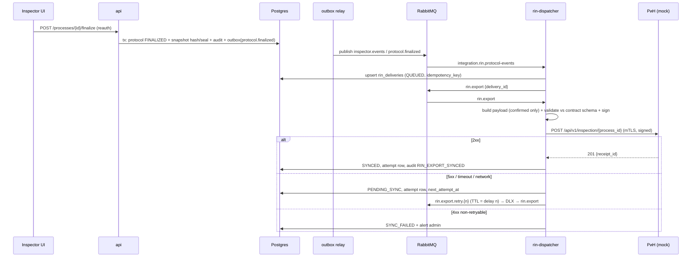

# B09 — Platform: ИАИС «РиН» integration, Audit log, Monitoring & logging, Performance (§11), Security (§12)

> Planning/analysis report for the «Инспектор ИИ» hackathon MVP (task №10, Мосгосстройнадзор).
> Covers ТЗ module 6 (Low), module 9 (Medium), module 11 (Medium), §9.6, §10 (Audit_Log, Monitoring_Metrics, Protocols versioning), §11 (all 15 rows), §12 (all 11 rows), §13 (all 8 rows).
> Requirement prefix: **PLT-NN**. Date: 2026-09-27. Status: proposal for orchestrator review. No application code is written yet.

---

## 0. Executive summary

- The block is **cross-cutting infrastructure**. Every other block depends on its conventions on day 1: `request_id`, the JSON log format, the audit API, RBAC permissions, the RabbitMQ envelope and outbox, config flags and the compose topology. The foundation tasks (§10, wave 0) must land first.
- **ИАИС «РиН»**: no real API or access is available, so we build a **mock РиН service with its own OpenAPI 3.0 contract**. It uses the literal ТЗ paths: `POST /api/v1/documents/upload` on our side, and `POST /api/v1/inspection/{process_id}` on both sides. It verifies signatures, validates our payload against its schema, simulates prescriptions and exposes chaos modes (503, timeout, bad signature). The real adapter is swappable.
- **УКЭП / GOST**: a certified CryptoPro stack is unavailable. We implement a **pluggable signer** (`none` | `soft-gost` | `openssl-gost` | `cryptopro`). The MVP ships `soft-gost`: real GOST R 34.10-2012 (256-bit) signatures over a Streebog-256 (GOST R 34.11-2012) digest, from a pure-TS library, in an RFC 9421-style `Signature` header, cross-verified by an independent Python implementation. Transport authentication uses **mTLS** with dev-CA certificates. Production path: a GOST-TLS egress gateway plus CryptoPro, documented and not built.
- **Delivery semantics**: finalization writes a transactional outbox row. Sending happens through RabbitMQ with TTL/DLX retry tiers (1/5/15 min, configurable to seconds for the demo). The protocol stays `PROTOCOL_FINALIZED` while delivery is `PENDING_SYNC`. The journal records every attempt. After retries are exhausted, a recovery probe resumes delivery. Pulled files never trigger a re-check on a finalized protocol; they only notify the inspector and offer «Создать новую проверку».
- **Audit**: a single `audit_log` table (§10 fields plus traceability extras). It is append-only, enforced by DB grants and a trigger, and tamper-evident through hash-chain seals signed by the system GOST key. Domain events are written in the same transaction as the change; access events are batched. Protocol versions are immutable snapshots with history and a diff view. Un-finalization requires supervisor/admin, a reason and re-authentication.
- **Monitoring**: pino (Node) and structlog (Python) emit JSON lines with exactly `timestamp, level, service, message, request_id, user_id`. Metrics come from prom-client / prometheus_client, RabbitMQ's built-in Prometheus plugin, node-exporter, cAdvisor and blackbox. Five Grafana dashboards are provisioned as code. Alertmanager sends email (Mailpit in the demo) and Telegram (native `telegram_configs`). ELK runs as an optional compose profile with ILM 90 d / 365 d. A daily file-hash integrity job and a `Monitoring_Metrics` snapshotter also run.
- **Security**: login/password with argon2id, lockout and Redis server-side sessions with CSRF. Six roles: `inspector`, `supervisor`, `admin`, `ml_engineer`, `data_curator`, plus an `integration_client` service account. TLS 1.3-only nginx edge. App-level AES-256-GCM envelope encryption for stored files and PII columns. ClamAV runs before storage and fails closed. Rate limiting plus IDS-lite rules. Daily encrypted backups with 30-day retention, plus WAL archiving for RPO ≤ 15 min. 152-ФЗ and 187-ФЗ measures are mapped explicitly.
- **Performance (§11)**: rows 1, 4–11 and 15 are achievable on the M2 Max CPU-only demo machine. Rows 2–3 (OCR) are achievable for A4 but risky for A0/A1 raster scans. Rows 12–14 (SLA, RTO, RPO) are **designed and drilled, not proven**. A k6 harness (100 VUs, threshold p95 < 200 ms) and a benchmark harness feed an in-app «Соответствие ТЗ (НФТ)» page.
- Requirement count: **103 atomic requirements**: 81 FULL, 16 SIMPLIFIED, 2 MOCKED, 4 OUT_OF_SCOPE.

---

## 1. Scope

### 1.1 ТЗ clauses owned by this block

| Clause | Quote (verbatim, abridged) | What we own |
|---|---|---|
| §1.2 bullet 3 | «программный API для обмена данными с внешними информационными системами (целевая: … ИАИС «РиН») для обмена документами и результатами проверок» | External API surface, РиН connector |
| §1.2 bullet 4 | «автоматический контроль наличия документов и инкрементальная дозагрузка файлов до момента финализации протокола» | Automatic intake from РиН (routing only; parsing is module 1) |
| §1.3 | «REST over HTTPS (JSON)… с обязательной валидацией схемы OpenAPI 3.0» | OpenAPI validation of all B09 endpoints and of the mock РиН contract |
| §1.4 | «Асинхронный (Pull-модель получения результатов)… Статус обработки отслеживается через эндпоинт мониторинга» | `GET /api/v1/inspection/{process_id}` pull endpoint; health/monitoring endpoints |
| §1.5 | «Взаимодействие между модулями… через REST API и асинхронную очередь сообщений (RabbitMQ)» | RabbitMQ conventions (envelope, DLQ, retry tiers, outbox) |
| §7 module 6 (Low) | «Автоматический забор файлов для проверки и передача результатов проверки» | Whole module |
| §7 module 9 (Medium) | «Фиксация всех действий инспектора (подтверждение/отклонение, причина, время); версионность протоколов» | Whole module |
| §7 module 11 (Medium) | «Сбор метрик производительности, логирование событий системы, интеграция с централизованной системой мониторинга» | Whole module |
| §7 module 12 (High), partially | «…сбои интеграции…» | Integration-failure handling (jointly with the module 12 owner) |
| §9.1 error table | «Таймаут при обработке файла → Повторная попытка обработки (до 2 раз). При неудаче – уведомление администратора» | The admin-notification channel (retry logic belongs to module 1) |
| §9.2 п.5 | «Протокол сохраняется в БД (таблица Protocols) с присвоением версии… Инспектор получает уведомление» | Versioning mechanism; notification service backend |
| §9.2 incremental | «Предыдущая версия протокола сохраняется в истории» | Version history |
| §9.3 п.4 | «В ИАИС «РиН» передаются только подтверждённые инспектором записи вместе с версиями протокола, Матрицы, модели и реестром входных файлов» | Export payload |
| §9.3 п.5 and «Отмена финализации» | «Отмена финализации доступна только администратору системы или инспектору с правом супервизора. Все отмены фиксируются в журнале аудита с обязательным указанием причины… возвращается в статус VERIFICATION_COMPLETED» | RBAC, audit and journal of un-finalization (endpoint shared with module 3) |
| §9.6 (entire) | Endpoints, УКЭП client certificates, retries «1, 5, 15 минут», PENDING_SYNC, prescription statuses «ISSUED, IN_PROGRESS, COMPLETED, CANCELLED, EXTENDED», blocking automatic re-check on a finalized protocol | Whole section |
| §10 #5 Protocols | «id, object_id, version, matrix_version, dataset_version, model_version, input_manifest_hash, status, created_at, finalized_at» | Versioning and immutability semantics (DDL shared with module 2) |
| §10 #12 Audit_Log | «id, user_id, action, object_id, details, timestamp, ip_address, user_agent» | Owned |
| §10 #13 Monitoring_Metrics | «id, metric_name, value, timestamp, service_name, tags» | Owned |
| §11 rows 1–15 | Performance targets | Rows 6, 10–14 owned; the others measured by our harness |
| §12 rows 1–11 | Security | Owned; row 11 (AV) is integrated into the module 1 upload flow |
| §13 rows 1–8 | Monitoring and logging | Owned |
| Registry rules (03_perechen…) | «без него пакет принимается со статусом CLARIFICATION_REQUIRED»; «Перезапись файла под тем же file_id запрещена. Повторная загрузка создаёт новую запись и новую версию протокола» | Registry enforcement for packages pulled from РиН; storage immutability |
| §2 (normative base) | 152-ФЗ, 187-ФЗ, 397-ПП | Compliance mapping |

### 1.2 Related statuses

- Process (§9.1): `PENDING, PARSING, READY, VERIFYING, COMPLETED, FINALIZED`. This drives РиН pull routing.
- Verification (§9.3): `PENDING, CONFIRMED_VIOLATION, NEGATIVE_VERIFIED, CLARIFICATION_REQUIRED, VERIFICATION_COMPLETED, PROTOCOL_FINALIZED`. This drives the export gate.
- Sync (§9.6): `PENDING_SYNC`. We add `QUEUED, SENDING, SYNCED, SYNC_FAILED, CANCELLED` (see §3.5.4).
- Prescription (§9.6): `ISSUED, IN_PROGRESS, COMPLETED, CANCELLED, EXTENDED`.
- Registry `approval_status`: `DRAFT / APPROVED / FOR_CONSTRUCTION / SUPERSEDED / CANCELLED`; `signature_status`.

---

## 2. Requirements checklist

Legend. **Priority**: MUST / SHOULD / NICE, meaning importance for winning. **MVP**: FULL / SIMPLIFIED / MOCKED / OUT_OF_SCOPE.

### 2.1 ИАИС «РиН» integration (module 6, §9.6)

| ID | Requirement | ТЗ ref | Priority | MVP | Justification |
|---|---|---|---|---|---|
| PLT-01 | Programmatic API for data exchange with an external IS (target ИАИС «РиН») | §1.2 b.3 | MUST | FULL | Our OpenAPI-described integration endpoints |
| PLT-02 | Interaction type: REST over HTTPS (JSON) plus automatic file pull | §9.6 table | MUST | FULL | Runs against the mock over HTTPS/mTLS |
| PLT-03 | Pull model: external IS fetches results by `process_id` when ready (`GET /api/v1/inspection/{process_id}`, 409 until finalized) and tracks status | §1.4, §9.6 | MUST | FULL | Cheap; reconciles the pull-vs-push ambiguity (§6 C-1) |
| PLT-04 | Intake scenario `POST /api/v1/documents/upload` → `process_id`, usable by the UI (session) and by РиН (client certificate) | §9.6 «Сценарии» п.1 | MUST | FULL | Handler owned by module 1; B09 adds mTLS client auth and the integration client registry |
| PLT-05 | Automatic pull of files from РиН for checking (scheduler + webhook trigger) | §7 m.6, §9.6 | SHOULD | MOCKED | The connector is real; the source is the mock РиН (no real access) |
| PLT-06 | Pulled packages carry the machine-readable registry (CSV/XLSX/JSON fields); without it the package gets `CLARIFICATION_REQUIRED` | Registry rules | MUST | FULL | Mock publishes `registry.json`; connector maps fields |
| PLT-07 | Automatic дозагрузка of pulled files into non-finalized processes (PENDING/READY/VERIFYING/COMPLETED); queued while PARSING («дозагрузка: Нет») | §1.2 b.4, §9.1 status table | SHOULD | FULL | Routing only; incremental re-check is module 1/2 |
| PLT-08 | If the protocol is finalized, automatic дозагрузка from РиН does **not** start a check; it notifies the inspector and offers to create a new check | §9.6 «Блокировка…» | MUST | FULL | Explicit ТЗ rule; strong demo moment |
| PLT-09 | Result transfer endpoint `POST /api/v1/inspection/{process_id}` | §9.6 | MUST | FULL | Exists on both sides: our trigger and the mock/РиН receiver (§6 C-2) |
| PLT-10 | Transfer only when the protocol status is `PROTOCOL_FINALIZED` (otherwise 409 `PROTOCOL_NOT_FINALIZED`) | §9.6 | MUST | FULL | Server-side gate plus DB check |
| PLT-11 | Payload contains **only inspector-confirmed records** plus protocol, Матрица, model and dataset versions, `input_manifest_hash` and the input file registry | §9.3 п.4, §14.2 «Версионность» | MUST | FULL | JSON schema in the mock contract |
| PLT-12 | Authentication to РиН with client certificates (УКЭП) | §9.6 | MUST | SIMPLIFIED | mTLS with dev-CA RSA/ECDSA certs; GOST-TLS gateway documented |
| PLT-13 | All requests to external systems (including pulls/GETs) signed with УКЭП | §12.10 | MUST | SIMPLIFIED | Algorithmic GOST R 34.10-2012 via pluggable signer; not a legally qualified signature (no accredited УЦ / certified СКЗИ) |
| PLT-14 | On 5xx or timeouts: up to 3 retries with exponential delays 1, 5, 15 min (configurable; seconds in the demo) | §9.6 | MUST | FULL | TTL/DLX retry tiers plus DB journal |
| PLT-15 | When РиН is unavailable the protocol stays `PROTOCOL_FINALIZED`, sync status = `PENDING_SYNC`, the system keeps resending with journaling, and the signed inspector decision is never changed | §9.6 | MUST | FULL | Separate `sync_status` field; the protocol row is immutable |
| PLT-16 | Integration journal: every attempt with time, request_id, HTTP status, latency, outcome class, error, payload hash, signature key id | §9.6 «с журналированием» | MUST | FULL | `rin_delivery_attempts` table plus audit events |
| PLT-17 | Prescription statuses `ISSUED, IN_PROGRESS, COMPLETED, CANCELLED, EXTENDED` mirrored from РиН per confirmed violation | §9.6 | SHOULD | MOCKED | The mock drives the state machine; we sync read-only |
| PLT-18 | Sending to РиН ≤ 30 s (±10 s) | §11 #6 | MUST | FULL | Measured as finalize→SYNCED against the mock (<1 s expected) |
| PLT-19 | Integration failures handled as a negative scenario: user-visible status, admin alert, no data loss | §7 m.12 | MUST | FULL | Joint with the module 12 owner |
| PLT-20 | Mock РиН service: own OpenAPI 3.0 contract, strict schema validation, mTLS + signature verification with replay protection, cases/documents/registry/content, prescriptions, chaos modes, Russian UI | Demo enabler | MUST | FULL | Without it modules 6 and §12.10 cannot be shown |
| PLT-21 | Inbound webhooks from РиН (new documents, prescription status) with mTLS + signature verification | Derived (§9.6 «автоматический забор») | NICE | SIMPLIFIED | Webhook only triggers an immediate pull; polling stays the source of truth |
| PLT-22 | On un-finalization: cancel undelivered deliveries (`CANCELLED/SUPERSEDED`); if already synced, send a reopen notice and later deliver the superseding version | Derived §9.3 + §9.6 | SHOULD | FULL | Prevents sending a protocol that no longer stands |
| PLT-23 | Connection to the real ИАИС «РиН» (ДИТ onboarding, network access, real API) | §9.6 | NICE | OUT_OF_SCOPE | No access; adapter pattern keeps it a config change |
| PLT-24 | Production CryptoPro CSP / GOST-TLS (NGate/stunnel-gost) / CryptoPro DSS | §9.6, §12.10 | NICE | OUT_OF_SCOPE | Licensing and certification; stub provider plus runbook |

### 2.2 Audit log and protocol versioning (module 9, §12.4–12.5)

| ID | Requirement | ТЗ ref | Priority | MVP | Justification |
|---|---|---|---|---|---|
| PLT-25 | Every user action recorded with time, IP address, action type and object identifier (plus user agent) | §12.4, §10 #12 | MUST | FULL | Domain audit plus access audit of every authenticated request |
| PLT-26 | `Audit_Log` table with §10 fields `id, user_id, action, object_id, details, timestamp, ip_address, user_agent` | §10 #12 | MUST | FULL | Extended with traceability columns (§3.4) |
| PLT-27 | Inspector decisions (confirm/reject with `reason_code` and comment, clarification, split into atomic findings, choice of authoritative редакция, SUSPICION promotion) logged with user and time | §7 m.9, §9.3 п.2 | MUST | FULL | Action catalogue (§3.4.2) |
| PLT-28 | Domain audit written atomically in the same DB transaction as the change it records | §9.3 «полная трассируемость» | MUST | FULL | No decision can exist without its audit record |
| PLT-29 | Un-finalization only by admin or supervisor; mandatory reason; logged; protocol returns to `VERIFICATION_COMPLETED`; дозагрузка possible again | §9.3 | MUST | FULL | RBAC + reason schema + re-auth; endpoint shared with module 3 |
| PLT-30 | Protocol versioning: each generation, incremental update, re-upload and finalization produces an immutable version; history kept | §7 m.9, §9.2 п.5, §9.2 incremental, registry rules | MUST | FULL | `protocols` rows are snapshots |
| PLT-31 | Version history browser and diff (findings added/removed/status changed) | Derived §7 m.9 | SHOULD | FULL | Differentiator for the jury |
| PLT-32 | Finalized snapshot is immutable, hashed (SHA-256 + Streebog-256) and signed: inspector re-auth (простая ЭП) plus a system GOST seal | §9.3 п.5, §9.6 «подписанное решение инспектора» | MUST | SIMPLIFIED | Personal УКЭП via the CryptoPro browser plug-in is the documented production path |
| PLT-33 | Tamper evidence for the audit log: append-only grants, UPDATE/DELETE-blocking trigger, hash-chain seals, verify endpoint | §12.7 (187-ФЗ integrity) | SHOULD | FULL | Cheap and demoable |
| PLT-34 | Audit viewer UI: filters (user, action, category, object, объект, process, period), per-process and per-finding timelines, CSV/JSON export (the export is itself audited) | Derived §7 m.9 | SHOULD | FULL | — |
| PLT-35 | Retention: ≥ 90 days for routine operations, ≥ 1 year for security events; decision/finalization/config events kept permanently | §12.5 | MUST | SIMPLIFIED | Retention classes + purge job; not proven over real time |
| PLT-36 | System and integration actors audited too (actor_type USER / SYSTEM / INTEGRATION) | Derived | SHOULD | FULL | Python workers publish audit events to the `platform.audit` queue |
| PLT-37 | Verification-cycle-time metric derived from audit (first `PROTOCOL_OPENED` → `PROTOCOL_FINALIZED`) and decision-click counts | §11 #15, §9.3 usability | NICE | FULL | Evidence for module 3 usability KPIs |

### 2.3 Monitoring and logging (module 11, §13)

| ID | Requirement | ТЗ ref | Priority | MVP | Justification |
|---|---|---|---|---|---|
| PLT-38 | JSON logs with mandatory `timestamp, level, service, message, request_id, user_id` in every service (Node pino, Python structlog) | §13.1 | MUST | FULL | Shared logger packages |
| PLT-39 | `request_id` propagated end-to-end: HTTP `X-Request-Id` → AsyncLocalStorage → AMQP header → Python contextvars → outbound РиН call | §13.1 | MUST | FULL | Makes the field meaningful; Kibana demo |
| PLT-40 | Level policy: INFO for routine operations (upload, parsing, comparison), ERROR for failures, WARNING for non-critical problems, DEBUG only in the test contour (start-up guard) | §13.2 | MUST | FULL | `level` values literally `INFO/WARNING/ERROR/DEBUG` |
| PLT-41 | Log retention 90 days for INFO+, 1 year for security-related ERROR/WARNING | §13.3 | MUST | SIMPLIFIED | ES ILM policies (`logs-app` 90 d, `logs-security` 365 d) + local file rotation |
| PLT-42 | Redaction of secrets and PII (passwords, cookies, tokens, ФИО, email, phone) in all logs | §12.6 | MUST | FULL | pino `redact` + structlog processor |
| PLT-43 | Metric: CPU and RAM per service | §13.4 | MUST | FULL | Process metrics (always) + cAdvisor (Docker) |
| PLT-44 | Metric: disk usage | §13.4 | MUST | FULL | node-exporter + app gauge for the storage volume |
| PLT-45 | Metric: requests per second | §13.4 | MUST | FULL | HTTP histogram `_count` rate |
| PLT-46 | Metric: average response time (plus p95) | §13.4, §11 #10 | MUST | FULL | Histogram with 0.2 s / 0.5 s buckets |
| PLT-47 | Metric: HTTP 5xx count | §13.4 | MUST | FULL | `http_server_requests_total{status_class="5xx"}` |
| PLT-48 | Metric: RabbitMQ queue size | §13.4 | MUST | FULL | `rabbitmq_prometheus` per-object metrics |
| PLT-49 | Metric: active user sessions | §13.4 | MUST | FULL | Redis ZSET of `last_seen` → gauge |
| PLT-50 | Prometheus integration | §13.5 | MUST | FULL | `monitoring` compose profile |
| PLT-51 | Grafana dashboards provisioned as code | §13.5 | MUST | FULL | 5 dashboards (§3.6.4) |
| PLT-52 | ELK integration (Elasticsearch, Logstash, Kibana) for centralized storage and search | §13.6 | MUST | FULL | Optional `elk` profile (heavy); Filebeat → Logstash → ES → Kibana |
| PLT-53 | Alert rules for thresholds: CPU > 80%, response time > 500 ms, plus 5xx rate, service down, queue backlog, disk, РиН sync, integrity, AV, brute force, backup missing, certificate expiry | §13.7 | MUST | FULL | `alerts.yml` as code |
| PLT-54 | Alerts delivered to the administrator by email | §13.7 | MUST | FULL | Alertmanager `email_configs`; Mailpit SMTP sink in the demo |
| PLT-55 | Alerts delivered to Telegram | §13.7 | MUST | FULL | Alertmanager `telegram_configs`; needs a bot token (fallback: mocked sender) |
| PLT-56 | Daily checksum (hash) verification of stored files to detect corruption or unauthorized modification | §13.8 | MUST | FULL | Scheduler job + manual trigger + alert |
| PLT-57 | `Monitoring_Metrics` table (`id, metric_name, value, timestamp, service_name, tags`) populated | §10 #13 | MUST | FULL | 60 s snapshotter |
| PLT-58 | Admin notification channel for system events (§9.1 processing timeout after 2 retries, AV detection, РиН sync failure, integrity failure) | §9.1, §7 m.11 | MUST | FULL | NotificationService → Alertmanager / direct SMTP+Telegram + in-app |
| PLT-59 | Health endpoints (`/health/live`, `/health/ready`) for every service + blackbox uptime probes | Supports §11 #12, §1.4 | SHOULD | FULL | Compose healthchecks depend on them |
| PLT-60 | In-app «Мониторинг» admin page (works without Grafana, from `Monitoring_Metrics`) | Derived | NICE | FULL | Useful in the non-Docker run path |

### 2.4 Security (§12)

| ID | Requirement | ТЗ ref | Priority | MVP | Justification |
|---|---|---|---|---|---|
| PLT-61 | Login/password authentication for all user categories | §12.1 | MUST | FULL | — |
| PLT-62 | argon2id password hashing, password policy, account lockout on repeated failures | §12.1, §12.9 | MUST | FULL | OWASP parameters |
| PLT-63 | Server-side sessions (HttpOnly/Secure/SameSite=Strict cookie), idle 30 min / absolute 12 h, revocation, CSRF token, step-up re-auth for finalize/unfinalize | Derived | MUST | FULL | Also feeds PLT-49 |
| PLT-64 | RBAC: inspector (view/verify), administrator (parameters and normative base), ML engineer (logs and retraining data) | §12.2 | MUST | FULL | Permission matrix §3.3.3 |
| PLT-65 | Extra roles: supervisor («инспектор с правом супервизора»), data curator («куратор данных»), model-publication approver («ответственное лицо») | §9.3, §9.4 | MUST | FULL | Permissions, not ad-hoc checks |
| PLT-66 | Authorization enforced server-side on every endpoint; UI gating; every 403 audited as `ACCESS_DENIED` | §12.2 | MUST | FULL | Table-driven RBAC test |
| PLT-67 | Object-level visibility: inspectors see assigned объекты; supervisor/admin see all | Derived (152-ФЗ minimization) | SHOULD | SIMPLIFIED | Single assignment table, no department hierarchy |
| PLT-68 | TLS 1.3 for all external traffic (browser ↔ edge, РиН ↔ edge, egress to РиН) | §12.3 | MUST | FULL | nginx `ssl_protocols TLSv1.3` only |
| PLT-69 | TLS for internal hops (Postgres, RabbitMQ, Redis, storage) | §12.3 «при передаче» | SHOULD | SIMPLIFIED | `INTERNAL_TLS=true` flag, on in the Docker `prod-like` profile |
| PLT-70 | Encryption at rest: file storage | §12.3 | MUST | FULL | App-level AES-256-GCM envelope encryption (DEK per file, KEK from secret) |
| PLT-71 | Encryption at rest: database | §12.3 | MUST | SIMPLIFIED | Column-level encryption of PII + encrypted volume (documented); community Postgres has no TDE |
| PLT-72 | 152-ФЗ: PII inventory, minimization, masking, access audit, encryption, localization (no foreign transfer, no external CDNs/fonts/SaaS), retention/anonymization, policy templates | §12.6 | MUST | SIMPLIFIED | Technical measures FULL; organizational documents as templates |
| PLT-73 | 187-ФЗ integrity: SHA-256 at intake, no overwrite under the same `file_id`, integrity job, hash-sealed audit, signed protocol snapshots, audited config changes | §12.7 | MUST | FULL | — |
| PLT-74 | Daily backups of the DB and the file storage, 30-day retention | §12.8 | MUST | FULL | `backup` profile / local script |
| PLT-75 | Backups encrypted; automated restore drill with timing | Derived §12.3/12.8, §11 #13 | SHOULD | FULL | restic (AES-256) |
| PLT-76 | Intrusion detection (IDS) | §12.9 | MUST | SIMPLIFIED | App-level IDS-lite rules + security events + alerts; network IDS (ФСТЭК-certified СОВ) documented; optional CrowdSec |
| PLT-77 | DDoS protection | §12.9 | MUST | SIMPLIFIED | nginx `limit_req`/`limit_conn`, body/time limits, per-user app limits; perimeter protection documented |
| PLT-78 | Antivirus scan of every uploaded or pulled file **before** it is stored; infected → reject and security event; AV unavailable → fail closed | §12.11 | MUST | FULL | ClamAV `clamd` INSTREAM |
| PLT-79 | Signer key and certificate lifecycle: key ids, expiry monitoring (alert 30 d before), rotation procedure | §12.10 support | SHOULD | FULL | Also mTLS certificates |
| PLT-80 | Hardening: security headers (HSTS, CSP, frame-ancestors), strict OpenAPI validation (`additionalProperties:false`), upload hardening (magic bytes, XXE/billion-laughs off, zip-bomb ratio, page/object limits) | §1.3 + best practice | MUST | FULL | Joint with the module 1 and 12 owners |
| PLT-81 | Secrets management: no secrets in the repo, Docker secrets / secret files, KEK and key rotation runbook | Derived | SHOULD | FULL | — |
| PLT-82 | Formal ИСПДн/ГИС attestation, ФСТЭК-certified СЗИ, модель угроз approval | §12.6–12.9 implied | NICE | OUT_OF_SCOPE | Organizational; design aligned and documented |

### 2.5 Performance (§11, all 15 rows; row 6 is PLT-18)

| ID | §11 row | Target | Owner of implementation | Priority | MVP | Justification |
|---|---|---|---|---|---|---|
| PLT-83 | #1 Upload of up to 10 files × 50 MB | ≤ 2 min ±30 s | Module 1 (+ B09 AV/encryption) | MUST | FULL | Measured by the harness; clamd limits raised |
| PLT-84 | #2 OCR of a PDF up to 100 pages | ≤ 3 min ±30 s | Module 1 | MUST | FULL | Measured; risk for A0/A1 raster pages (§5) |
| PLT-85 | #3 OCR of a PDF up to 500 pages | ≤ 10 min ±60 s | Module 1 | MUST | FULL | Measured; parallel page workers |
| PLT-86 | #4 Comparison of 132 parameters | ≤ 2 min ±30 s | Module 2 | MUST | FULL | Measured |
| PLT-87 | #5 Protocol generation (JSON/PDF) | ≤ 30 s ±10 s | Module 2 / 7 | MUST | FULL | Measured |
| PLT-88 | #7 ML analysis of one parameter (NLP) | ≤ 500 ms ±100 ms | Module 1/2 | MUST | FULL | p95 per parameter from worker metrics |
| PLT-89 | #8 CV analysis of one drawing («DWG») | ≤ 30 s ±10 s | Module 1 | SHOULD | SIMPLIFIED | Measured on PDF drawings; DWG input out of scope (§6 C-12) |
| PLT-90 | #9 Incremental protocol update after дозагрузка | ≤ 1 min ±15 s | Module 1/2 | MUST | FULL | Measured |
| PLT-91 | #10 API response time p95 | ≤ 200 ms ±50 ms | B09 + all API owners | MUST | FULL | k6 threshold on the defined «API» endpoint set |
| PLT-92 | #11 Concurrent users | ≥ 100 inspectors | B09 | MUST | FULL | k6 100 VUs, realistic inspector loop, background ML load |
| PLT-93 | #12 Availability SLA | 99.9% 24/7 | B09 | SHOULD | SIMPLIFIED | HA design documented; uptime measured by blackbox during the demo period |
| PLT-94 | #13 RTO | ≤ 1 h | B09 | SHOULD | SIMPLIFIED | Runbook + timed restore drill |
| PLT-95 | #14 RPO | ≤ 15 min | B09 | SHOULD | SIMPLIFIED | WAL archiving (`archive_timeout` 300 s) + 15-min storage increments + PITR drill |
| PLT-96 | #15 Full verification cycle for an experienced user | ≤ 30 min ±10 min | Module 3 | MUST | FULL | Measured from audit timestamps (PLT-37) |
| PLT-97 | Unified performance harness + «Соответствие ТЗ (НФТ)» report page with the last measured value of every §11 row | Derived | SHOULD | FULL | Turns NFRs into visible evidence for the jury |

### 2.6 Platform and deployment

| ID | Requirement | Ref | Priority | MVP | Justification |
|---|---|---|---|---|---|
| PLT-98 | Separate backend server and separate web frontend; local (non-Docker) run path; drops into docker-compose unchanged | User wish, §1.5 | MUST | FULL | 12-factor config |
| PLT-99 | Compose profiles (core, monitoring, elk, backup, loadtest, prod-like), healthchecks, resource limits, multi-arch (arm64/amd64) images | User wish | MUST | FULL | — |
| PLT-100 | RabbitMQ conventions: message envelope, quorum queues, DLQ, retry tiers, idempotent consumers, transactional outbox relay | §1.5 | MUST | FULL | Shared by all blocks |
| PLT-101 | OpenAPI 3.0 request **and** response validation for all B09 endpoints; published `/api/docs` | §1.3 | MUST | FULL | — |
| PLT-102 | Feature/config flags for graceful degradation (`AV_MODE`, `SIGNER_PROVIDER`, `ALERT_TRANSPORT`, `STORAGE_DRIVER`, `INTERNAL_TLS`, `RIN_RETRY_DELAYS_SEC`, `LOG_SINK`) | Derived | SHOULD | FULL | The same code runs locally and in Docker |
| PLT-103 | HA multi-node deployment (Patroni, RabbitMQ cluster, N API replicas behind LB) | §11 #12 | NICE | OUT_OF_SCOPE | Documented reference architecture only |

**Totals: 103 requirements. FULL 81, SIMPLIFIED 16, MOCKED 2, OUT_OF_SCOPE 4.**

---

## 3. Proposed design

### 3.1 Architecture and topology

```
                         Browser (React SPA, Russian UI)
                                   │ HTTPS TLS 1.3 (443)
                ┌──────────────────▼───────────────────┐    mTLS TLS 1.3 (8443)
                │ proxy (nginx): TLS1.3-only, HSTS/CSP, │◄──────────────────────── rin-mock / ИАИС «РиН»
                │ limit_req/limit_conn, body limits,    │   (upload, pull results, webhooks)
                │ mTLS verify for integration host,     │
                │ auth_request guard for /grafana,/kibana│
                └───┬───────────────┬───────────────────┘
                    │ /api          │ / (static SPA)
          ┌─────────▼─────────┐   ┌─▼──────┐
          │ api (Node/Fastify)│   │  web   │
          │ auth, RBAC, audit,│   └────────┘
          │ domain APIs, OAS  │
          └──┬──────┬──────┬──┘
             │      │      │ AMQP (envelope + x-request-id)
   ┌─────────▼┐ ┌───▼───┐ ┌▼──────────────────────────────────────────────┐
   │ postgres │ │ redis │ │ rabbitmq 4.x (quorum queues, DLX retry tiers,  │
   │ 17 (+WAL │ │ /valkey│ │ prometheus plugin)                             │
   │ archive) │ └───────┘ └──┬───────────────┬─────────────────────────────┘
   └──────────┘              │               │
          ┌──────────────────▼───┐   ┌───────▼──────────────────────────┐
          │ worker (Node):       │   │ ml-worker(s) (Python ≥3.11):     │
          │ outbox relay,        │   │ parsing/OCR/NLP/CV/compare       │
          │ rin-connector (pull),│   │ (modules 1,2,4,5; structlog,     │
          │ rin-dispatcher (push)│   │ prometheus_client)               │
          │ scheduler (cron),    │   └──────────────────────────────────┘
          │ notifier, audit      │         egress mTLS + GOST-signed requests
          │ writer, integrity job│─────────────────────────────────────────► rin-mock / РиН
          └──────────┬───────────┘
                     │
      ┌──────────────▼───────────┐   ┌──────────┐  ┌──────────────┐
      │ storage (FS volume, AES- │   │ clamav   │  │ mailpit      │
      │ GCM envelope; S3 option) │   │ (clamd)  │  │ (SMTP sink)  │
      └──────────────────────────┘   └──────────┘  └──────────────┘

 profile monitoring: prometheus, alertmanager(→email, Telegram), grafana, node-exporter, cadvisor,
                     postgres-exporter, redis-exporter, blackbox-exporter
 profile elk:        filebeat → logstash → elasticsearch → kibana (+ one-shot elk-setup: ILM, data views)
 profile backup:     backup (supercronic: pg_dump + restic, WAL archive volume, restore drill)
 profile loadtest:   k6 (→ Prometheus remote-write so Grafana shows the load live)
```

Key principles:

1. **One Node codebase, two process types**: `api` (HTTP) and `worker` (scheduler, integration, outbox relay, notifier, audit writer). This scales independently and keeps API latency isolated from background work.
2. **Python ML workers** never expose public HTTP. They consume RabbitMQ and expose `/metrics` on an internal port only.
3. **Everything is configured through env** (`.env.example` shared by the local and Docker modes). Hostnames are `localhost` locally and service names in compose.
4. **Assumed backend framework: Fastify 5**. It fits the OpenAPI-first approach (JSON-schema validation through ajv, `@fastify/swagger` emits OpenAPI 3.0.3) and is fast enough for p95 ≤ 200 ms. If the architecture owner chooses NestJS, the design maps 1:1 onto guards and interceptors.

### 3.2 Cross-cutting conventions (must be adopted by all blocks, wave 0)

#### 3.2.1 Request context

- The edge nginx sets `X-Request-Id` if it is absent (`$request_id`) and passes it on. Fastify `genReqId` reads the header, or generates a UUIDv7 otherwise.
- An `AsyncLocalStorage` context `{request_id, user_id, session_id, roles, ip, user_agent}` is set in the `onRequest` hook after session resolution.
- Real client IP: Fastify `trustProxy` is set **only** to the proxy address or subnet. nginx overwrites (does not append) `X-Forwarded-For` and strips any client-supplied `X-SSL-Client-*` headers.
- Outbound: every AMQP publish sets the headers `x-request-id` and `x-user-id`. Python consumers bind them into `structlog.contextvars`. Every outbound HTTP call to РиН carries `X-Request-Id`.

#### 3.2.2 Message envelope (RabbitMQ)

```json
{
  "message_id": "0192f6c4-…(uuidv7)",
  "type": "protocol.finalized",
  "schema_version": 1,
  "occurred_at": "2026-10-02T09:03:11.412Z",
  "producer": "api",
  "request_id": "0192f6c4-…",
  "user_id": "u-…|null",
  "process_id": "p-…|null",
  "object_id": "obj-…|null",
  "payload": { }
}
```

Consumers are idempotent: a `processed_messages(message_id PK, consumer, processed_at)` insert happens inside the consumer's transaction (or Redis `SETNX` with a 7-day TTL for non-DB consumers). Quorum queues use `x-delivery-limit: 5`, then go to the DLQ `<queue>.dlq`.

#### 3.2.3 Transactional outbox (platform component)

- Table `outbox_events(id bigserial, event_type, aggregate_type, aggregate_id, payload jsonb, request_id, user_id, created_at, published_at, publish_attempts)`.
- Producers (module 3 finalization, module 2 protocol generation, and so on) insert into `outbox_events` in the same transaction as the state change.
- The relay (in `worker`) runs `SELECT … FOR UPDATE SKIP LOCKED LIMIT 100` every 500 ms, publishes with publisher confirms to exchange `inspector.events` (topic), then sets `published_at`. This guarantees that a `protocol.finalized` event is never lost, which is the basis of PLT-15.

#### 3.2.4 Config flags

| Flag | Values (default) | Effect |
|---|---|---|
| `APP_ENV` | `dev` \| `test` \| `demo` \| `prod` (`dev`) | DEBUG allowed only in `dev`/`test` |
| `LOG_LEVEL` | `info` | Start-up guard: `debug` in `demo/prod` → forced to `info` + WARNING log |
| `LOG_SINK` | `stdout` \| `stdout+file` (`stdout`) | Local mode can also write `./var/log/<service>.log` (rotated) |
| `AV_MODE` | `required` \| `optional` \| `disabled` (`required`) | `required`: clamd down → 503 `AV_UNAVAILABLE` (fail closed) |
| `SIGNER_PROVIDER` | `none` \| `soft-gost` \| `openssl-gost` \| `cryptopro` (`soft-gost`) | Outgoing request signing and system seals |
| `ALERT_TRANSPORT` | `alertmanager` \| `direct` (`alertmanager` in Docker, `direct` locally) | `direct` = nodemailer SMTP + Telegram Bot API |
| `STORAGE_DRIVER` | `fs` \| `s3` (`fs`) | Storage adapter |
| `ENCRYPTION_AT_REST` | `app` \| `none` (`app`) | Envelope encryption in the storage adapter |
| `INTERNAL_TLS` | `true` \| `false` (`false` local, `true` in prod-like) | TLS for pg/amqp/redis clients |
| `RIN_BASE_URL` | `https://rin-mock:9443` | Real/mock/GOST-gateway switch |
| `RIN_RETRY_DELAYS_SEC` | `60,300,900` (demo `5,10,15`) | §9.6 retry tiers |
| `RIN_ATTEMPT_TIMEOUT_SEC` | `30` | Per-attempt timeout (aligned with §11 #6) |
| `RIN_PULL_INTERVAL_SEC` | `900` (demo `20`) | Automatic pull |
| `RIN_AUTO_EXPORT` | `true` | Send automatically on finalization |
| `RIN_AUTO_START_CHECK` | `true` | Auto-start a check for a new РиН package with no active process |

### 3.3 Security design

#### 3.3.1 Authentication (PLT-61..63)

- `users`: login (unique, plaintext for lookup), `password_hash` (argon2id; `m=19456 KiB, t=2, p=1` per the OWASP minimum, around 30–60 ms on M2; tunable). PII columns `full_name`, `email`, `phone`, `position` are stored encrypted (see §3.3.4), with `email_bidx` (HMAC-SHA-256 blind index) for lookup.
- Password policy: minimum 12 characters, not equal to the login, checked against a small bundled list of common passwords, change forced on first login, history of the last 5 hashes.
- Lockout: 5 consecutive failures → `locked_until = now()+15 min` → `AUTH_LOCKED` (SECURITY) + alert. IP-level: 20 failures per 10 min → IP ban 30 min (Redis) → `IDS_BRUTE_FORCE`.
- Sessions: opaque 256-bit token in cookie `ii_sid` (`HttpOnly; Secure; SameSite=Strict; Path=/`). Server side in Redis `sess:{sha256(token)}` → `{user_id, roles, created_at, last_seen_at, ip, ua, csrf}`. ZSET `sessions:active` (score = last_seen) is used for the active-sessions gauge. Idle timeout 30 min, absolute 12 h, maximum 3 concurrent sessions per user (the oldest is evicted). Logout deletes the key. Admins can revoke sessions.
- CSRF: `X-CSRF-Token` header must equal `sess.csrf` on every non-GET request, in addition to SameSite=Strict.
- **Step-up re-auth** (`POST /api/v1/auth/reauth {password}` → `reauth_token`, 5 min, single use). Required for `finalize`, `unfinalize`, role changes and model publication approval. This is the «простая электронная подпись» for the inspector's decision in the MVP (§6 C-9).
- Integration clients (РиН) never use passwords. They authenticate by mTLS certificate fingerprint against `integration_clients` (scopes: `documents:upload`, `inspection:read`, `webhooks:send`).
- Optional (NICE, not planned): TOTP second factor for admin.

#### 3.3.2 Roles

| Role code | Russian name (UI) | Source | Notes |
|---|---|---|---|
| `inspector` | Инспектор | §12.2 | View/verify assigned объекты |
| `supervisor` | Инспектор-супервизор | §9.3 | Inherits all inspector permissions; all объекты of the department; un-finalization; dispute resolution |
| `admin` | Администратор системы | §12.2, §9.3 | Params, normative base, thresholds, users, integration settings, audit, backups; un-finalization. **No finding decisions** (segregation of duties) |
| `ml_engineer` | ML-инженер | §12.2 | Logs (Grafana/Kibana), Rejection_Log/Dispute_Log, datasets, training, model registry, weekly report |
| `data_curator` | Куратор данных | §9.4 | Reviews the dataset draft and releases `dataset_version` |
| `integration_client` | Внешняя система (сервисная УЗ) | §9.6 | mTLS only |

The «ответственное лицо» who signs model publication (§9.4) is the permission `model.publish.approve`. It is granted to `supervisor` by default and configurable. The module 4 owner confirms.

#### 3.3.3 Permission matrix (enforced by `requirePermission()` preHandler; table-driven test)

| Permission | inspector | supervisor | admin | ml_engineer | data_curator | integration_client |
|---|---|---|---|---|---|---|
| `object.read` (assigned / all) | assigned | all | all (metadata) | — | — | own cases |
| `process.create`, `documents.upload` | ✓ | ✓ | — | — | — | ✓ |
| `protocol.read`, `evidence.read` | assigned | all | — | via dataset views | via dataset views | own (finalized) |
| `finding.decide` (confirm/reject/clarify/split) | ✓ | ✓ | — | — | — | — |
| `protocol.finalize` (+reauth) | ✓ | ✓ | — | — | — | — |
| `protocol.unfinalize` (+reauth +reason) | — | ✓ | ✓ | — | — | — |
| `protocol.export` (PDF/DOCX/XML) | ✓ | ✓ | — | — | — | — |
| `rin.send` (manual trigger/retry own) | ✓ | ✓ | ✓ | — | — | — |
| `rin.inbox.create_process` | ✓ | ✓ | — | — | — | — |
| `rin.admin` (settings, all deliveries) | — | — | ✓ | — | — | — |
| `params.manage`, `normative.manage`, `rules.manage` | — | — | ✓ | — | — | — |
| `users.manage`, `sessions.manage` | — | — | ✓ | — | — | — |
| `audit.read` (own / all) | own | all | all | ML/decision categories, pseudonymized | — | — |
| `audit.export`, `audit.verify` | — | — | ✓ | — | — | — |
| `logs.read` (Kibana), `monitoring.read` (Grafana) | — | — | ✓ | ✓ | — | — |
| `retraining.read` | — | — | — | ✓ | ✓ | — |
| `dataset.curate`, `dataset.release` | — | — | — | — | ✓ | — |
| `model.train`, `model.evaluate`, `model.propose` | — | — | — | ✓ | — | — |
| `model.publish.approve` (+reauth) | — | ✓ | — | — | — | — |
| `integrity.run`, `backup.run`, `nfr.run` | — | — | ✓ | — | — | — |

The permission matrix lives in code (`packages/shared/rbac.ts`), is versioned, and is exposed read-only at `GET /api/v1/admin/roles`. Only `user_roles` is stored in the DB.

#### 3.3.4 Cryptography and encryption (PLT-68..71, 75)

**In transit**

- Edge nginx:
  ```nginx
  ssl_protocols TLSv1.3;
  ssl_prefer_server_ciphers off;
  ssl_conf_command Ciphersuites TLS_AES_256_GCM_SHA384:TLS_CHACHA20_POLY1305_SHA256:TLS_AES_128_GCM_SHA256;
  add_header Strict-Transport-Security "max-age=31536000; includeSubDomains" always;
  ```
- Integration server block on `:8443` with `ssl_verify_client on; ssl_client_certificate /pki/integration-ca.pem;`. It forwards `X-SSL-Client-Verify`, `X-SSL-Client-Fingerprint` and `X-SSL-Client-S-DN` to the API after stripping client-supplied copies. The API trusts these headers only from the proxy address.
- Egress to РиН: undici `Agent({connect:{cert,key,ca,minVersion:'TLSv1.3'}})`. Production GOST-TLS: point `RIN_BASE_URL` at a local **GOST-TLS gateway** (CryptoPro NGate or stunnel built with a GOST engine). The application does not change.
- Internal (`INTERNAL_TLS=true`):
  - Postgres: `ssl=on`, `ssl_min_protocol_version='TLSv1.3'`, `hostssl` in `pg_hba`.
  - RabbitMQ: `amqps` on 5671 with TLS 1.3.
  - Redis/Valkey: `tls-port`, `tls-protocols "TLSv1.3"`.
  - All certificates come from `scripts/pki/make-dev-pki.sh` (openssl 3, dev CA «Инспектор ИИ — тестовый УЦ»).

**At rest: files**

The storage adapter performs envelope encryption (the same format in Node and Python):

```
object = MAGIC "IIENC1" | u32 header_len | header JSON {kek_id, wrapped_dek(b64), iv(b64,12B), alg:"A256GCM"} | ciphertext | tag(16B)
```

- DEK: random 256-bit per file, wrapped with the KEK using AES-256-GCM. The KEK is read from a secret file (prod: HSM/Vault).
- Files are ≤ 50 MB, so single-shot AES-GCM in memory is enough. KEK rotation re-wraps DEKs only.
- `file_hash` (SHA-256 of the **plaintext**, as the ТЗ requires) and `stored_object_sha256` (hash of the ciphertext, used by the fast daily integrity check) are both kept.
- This works identically in local FS mode and with S3.
- MinIO note: MinIO changed its community distribution in 2025. Verify image availability before depending on it; SeaweedFS and Garage are alternatives behind the same adapter. We do not rely on vendor SSE.

**At rest: database**

- Community PostgreSQL 17 has no TDE. Measures:
  - (a) Data volume on an encrypted disk: FileVault on the demo Mac, LUKS or an encrypted storage class in prod. This is documented, not coded.
  - (b) App-level AES-256-GCM for PII columns (`users.full_name/email/phone/position`, and the contact fields of `objects.customer/contractor` when they hold person data).
  - (c) Encrypted backups.
- `pgcrypto` is not used for column encryption because the key would pass through SQL text and could land in `log_statement` output.

**Backups**: restic repositories (AES-256 + Poly1305); the password comes from a secret.

#### 3.3.5 Antivirus (PLT-78)

- `clamav/clamav` (clamd 1.5.x) runs as a container. Locally: `brew install clamav`, then `freshclam`, then `clamd`.
- Required `clamd.conf` changes, because the defaults would reject 50 MB files: `StreamMaxLength 60M`, `MaxFileSize 60M`, `MaxScanSize 250M`, `MaxThreads 8`, `ConcurrentDatabaseReload no`.
- Flow, called by the module 1 upload handler and by the РиН connector through `SecurityScanService.scan(buffer|stream, meta)`, **before** `storage.put()`:
  - `CLEAN` → continue.
  - `INFECTED(signature)` → reject with `VIRUS_DETECTED` (HTTP 422 per file, as part of a per-file result list). The file is not stored. Audit `FILE_AV_INFECTED` (SECURITY, 1 y) with sha256, filename, signature and uploader. Critical alert.
  - `ERROR/UNAVAILABLE` → `AV_MODE=required` → 503 `AV_UNAVAILABLE` (retryable). The upload is not accepted.
- Metrics: `av_scans_total{result}`, `av_scan_duration_seconds`.
- Demo and test: an EICAR test file, including one wrapped in a PDF/ZIP.

#### 3.3.6 Rate limiting and IDS-lite (PLT-76, 77)

nginx:

```nginx
limit_req_zone $binary_remote_addr zone=perip:20m rate=50r/s;
limit_req_zone $binary_remote_addr zone=login:5m rate=10r/m;
limit_conn_zone $binary_remote_addr zone=conn:10m;
location /api/v1/auth/login { limit_req zone=login burst=5 nodelay; }
location /api/          { limit_req zone=perip burst=200; limit_conn conn 100; client_max_body_size 1m; }
location = /api/v1/documents/upload { client_max_body_size 210m; client_body_timeout 120s; }
```

Per-IP limits are deliberately generous. 100 inspectors can sit behind a single Мосгосстройнадзор NAT address, so fairness is enforced **per user** in the app: `@fastify/rate-limit` with a Redis store, 600 req/min per user and 30 uploads/h per user. 429 responses carry `Retry-After`.

IDS-lite rules (worker evaluates Redis counters). Every hit becomes an `audit_log` SECURITY event, a Prometheus counter `security_events_total{rule}`, and an alert:

| Rule | Condition | Response |
|---|---|---|
| `BRUTE_FORCE_ACCOUNT` | ≥ 5 failed logins per login in 15 min | Lock account 15 min |
| `BRUTE_FORCE_IP` / `CREDENTIAL_STUFFING` | ≥ 20 failures or ≥ 10 distinct logins per IP in 10 min | IP ban 30 min |
| `PRIVILEGE_PROBING` | ≥ 20 × 403 per user in 5 min | Alert (warning) |
| `PATH_SCANNING` | ≥ 30 × 404 per IP per min on `/api` | Alert + temporary ban |
| `INTEGRATION_SIGNATURE_FAILURE` | Any inbound signature/mTLS failure | Alert |
| `AV_DETECTION`, `INTEGRITY_FAILURE` | Any | Critical alert |

Production statement (documented): a network IDS with a ФСТЭК-certified СОВ in the ДИТ perimeter, DDoS mitigation by the data-center/perimeter provider, WAF. Optional NICE: a CrowdSec profile parsing nginx logs.

#### 3.3.7 152-ФЗ (PLT-72) and 187-ФЗ (PLT-73)

| PII / category | Where | Measures |
|---|---|---|
| Inspector ФИО, login, position, email, phone | `users` | Encrypted columns; only `users.manage` reads contacts; ФИО appears on protocols (legal need); logs carry `user_id` only |
| Застройщик / заказчик / подрядчик contact persons | `objects` contact fields | Encrypted; shown only in the object card |
| Names and signatures inside ИД documents (acts, stamps) | Stored files, extracted text in Checks/Evidence | Encrypted storage; access-audited (`FILE_VIEWED`, `EVIDENCE_VIEWED`); never logged; dataset exports pseudonymize `expert_id` |
| IP address, user agent | `audit_log` | Retention classes; admin-only |
| Session data | Redis | TTL-bound, no content |

Additional 152-ФЗ measures:

- Legal basis: processing needed to exercise state powers (152-ФЗ ст.6 ч.1 п.2–3); consent is not required for official processing (to be confirmed by the customer's lawyer).
- **Localization**: all processing on RF-hosted infrastructure. No foreign SaaS: no cloud Sentry, no foreign LLM APIs, **no external CDNs or Google Fonts in the web app** (self-host fonts). No telemetry beacons.
- On user deactivation the account is not deleted (audit integrity); PII is anonymized after the retention period.
- Documentation templates in `docs/security/`: «Положение об обработке ПДн», «Перечень ПДн», retention policy, threat-model summary, and a measure mapping to ПП РФ № 1119 / Приказ ФСТЭК № 21 (and the ГИС requirements now in force; confirm the applicable ФСТЭК order with the customer).

187-ФЗ integrity controls:

- SHA-256 at intake.
- Immutable file records (no overwrite under the same `file_id`, per the registry rules).
- Daily integrity job covering files, protocol snapshot hashes, audit seals and model artifact hashes (the module 4 `artifact_hash`).
- Hash-sealed append-only audit.
- Signed finalized protocols.
- Audited config/Params changes with before/after values.
- Backups with checksums.
- NTP time sync on hosts (audit time trustworthiness).

### 3.4 Audit log and protocol versioning (module 9)

#### 3.4.1 Two capture paths

1. **Domain audit (authoritative, transactional)**: `auditService.record(tx, event)` runs inside the same DB transaction as the change. Examples: decision insert, finalization, Params update. If the transaction rolls back, the audit record disappears with it. Python workers publish `audit.record` messages to the `platform.audit` queue; the Node audit writer inserts them, so one writer owns schema and chaining.
2. **Access audit (every user request)**: a Fastify `onResponse` hook for every authenticated request records `action = HTTP_<METHOD>` plus the route template, the object id parsed from route params, status, duration, ip, ua and request_id. It is buffered in memory and bulk-inserted every 1 s or every 500 rows, to protect p95. A crash can lose at most about 1 s of access records; domain records are never lost. This satisfies «Каждое действие пользователя фиксируется» including reads.

#### 3.4.2 Action catalogue (enum, extensible; Russian labels in the UI)

- **AUTH / SECURITY**: `AUTH_LOGIN_SUCCESS`, `AUTH_LOGIN_FAILED`, `AUTH_LOCKED`, `AUTH_LOGOUT`, `AUTH_REAUTH`, `AUTH_PASSWORD_CHANGED`, `SESSION_REVOKED`, `ACCESS_DENIED`, `RATE_LIMIT_EXCEEDED` (sampled), `IDS_*`, `FILE_AV_INFECTED`, `INTEGRITY_CHECK_FAILED`, `INTEGRATION_SIGNATURE_INVALID`, `CERT_EXPIRING`.
- **USERS / CONFIG**: `USER_CREATED`, `USER_UPDATED`, `USER_ROLE_CHANGED`, `USER_DEACTIVATED`, `PARAM_UPDATED` (details: before/after), `PARAM_THRESHOLD_CHANGED`, `NORMATIVE_CREATED/UPDATED/DEACTIVATED`, `LOGICAL_RULE_*`, `CONFIG_CHANGED`, `INTEGRATION_SETTINGS_CHANGED`.
- **PROCESS / FILES**: `PROCESS_CREATED`, `FILE_UPLOADED`, `FILE_REJECTED` (reason_code), `FILE_VIEWED`, `FILE_DOWNLOADED`, `REGISTRY_UPLOADED`, `PROCESS_STATUS_CHANGED` (system).
- **VERIFICATION**: `PROTOCOL_OPENED`, `EVIDENCE_VIEWED`, `FINDING_CONFIRMED` (comment), `FINDING_REJECTED` (reason_code + comment), `FINDING_CLARIFICATION_REQUESTED`, `FINDING_SPLIT` (child ids), `REVISION_SELECTED` (authoritative редакция + basis), `SUSPICION_PROMOTED`, `SUSPICION_DISMISSED`, `VERIFICATION_COMPLETED`, `PROTOCOL_FINALIZED`, `PROTOCOL_UNFINALIZED` (reason_code + reason_text), `PROTOCOL_EXPORTED` (format), `PROTOCOL_VERSION_CREATED` (reason).
- **INTEGRATION**: `RIN_EXPORT_QUEUED`, `RIN_EXPORT_ATTEMPT`, `RIN_EXPORT_SYNCED`, `RIN_EXPORT_PENDING_SYNC`, `RIN_EXPORT_FAILED`, `RIN_EXPORT_CANCELLED`, `RIN_REOPEN_NOTICE_SENT`, `RIN_DOCUMENTS_PULLED`, `RIN_PACKAGE_NO_REGISTRY`, `RIN_IMPORT_BLOCKED_FINALIZED`, `RIN_NEW_CHECK_CREATED`, `RIN_PRESCRIPTION_STATUS_CHANGED`.
- **ML / DATA** (emitted by modules 4 and 10): `DATASET_ITEM_CURATED`, `DATASET_VERSION_RELEASED`, `MODEL_TRAINING_STARTED`, `MODEL_EVALUATED`, `MODEL_PUBLICATION_APPROVED`, `MODEL_PUBLISHED`, `MODEL_ROLLED_BACK`, `WEEKLY_REPORT_GENERATED`.
- **OPS**: `BACKUP_COMPLETED`, `BACKUP_FAILED`, `RESTORE_DRILL_COMPLETED`, `INTEGRITY_CHECK_OK`, `RETENTION_PURGE_EXECUTED`, `AUDIT_EXPORTED`, `AUDIT_VERIFIED`.

#### 3.4.3 Retention classes (PLT-35)

| Class | Actions | Minimum kept | Purge |
|---|---|---|---|
| `STANDARD` | Access audit (`HTTP_*`), views, exports | 90 days (`AUDIT_RETENTION_STANDARD_DAYS=90`) | Daily purge job |
| `SECURITY` | AUTH_*, IDS_*, ACCESS_DENIED, AV, integrity, signature failures | 365 days (`…_SECURITY_DAYS=365`) | Daily purge job |
| `PERMANENT` | Decisions, finalization/un-finalization, protocol versions, config/Params/normative changes, model publication | Lifetime of the protocol/system | Never (archival policy set by the customer) |

Purging runs only through the `SECURITY DEFINER` function `audit_purge_expired()` owned by the `audit_maintainer` role. The app role has `INSERT, SELECT` on `audit_log` only; a trigger raises on UPDATE/DELETE for everyone else. Each purge writes `RETENTION_PURGE_EXECUTED` with counts and ranges.

#### 3.4.4 Tamper evidence (PLT-33)

- A sealer job runs every 60 s. It takes unsealed rows in `id` order, computes `batch_hash = SHA-256(concat(row_hash_i))` where `row_hash_i = SHA-256(canonical_json(row))`, then `seal_hash = SHA-256(prev_seal_hash || batch_hash || to_id)`. The seal is signed with the system signer (GOST) and stored in `audit_seals`.
- `GET /api/v1/audit/verify?from&to` recomputes and reports the first broken seal or row.
- Purged ranges are marked `purged=true` in their seals; the chain of seal hashes stays verifiable.
- There is no hot-path contention (no per-insert lock).

#### 3.4.5 Protocol versioning (PLT-30..32)

Ownership split proposal:

- Module 2 owns protocol **content** generation (the 5 tables of §9.2 п.4) and the `protocols` DDL.
- Module 3 owns decisions and the finalize/unfinalize endpoints.
- B09 owns **versioning semantics, immutability, hashing/sealing, history/diff APIs and UI, and the un-finalization journal**.

| Concept | Rule |
|---|---|
| Version row | `protocols` row = immutable snapshot `content_json` of the full protocol at that moment, with `matrix_version, dataset_version, model_version, input_manifest_hash` |
| Version reasons | `INITIAL` (first READY), `INCREMENTAL_UPDATE` (after дозагрузка), `REUPLOAD` (new file record of an existing document), `FINALIZED` (frozen snapshot including all decisions), `REOPENED_BASELINE` (first working version after un-finalization), `MANUAL_REGENERATE` (admin) |
| Row status | `DRAFT` (latest working version; decisions live in the decisions table, not in the snapshot), `FINALIZED` (immutable, hashed, signed), `SUPERSEDED` (a finalized version later reopened, or a draft replaced) |
| Immutability | DB trigger: once `status='FINALIZED'`, only `superseded_at` and `superseded_reason` may change (NULL → value). Everything else raises |
| Hashing | `content_sha256` and `content_streebog256` over canonical JSON (RFC 8785 JCS) |
| Signing | At finalization: inspector step-up re-auth (`sign_method=SIMPLE_EP_REAUTH`, `signed_by`, `signed_at`) + system seal `system_signature` (GOST R 34.10-2012 over the Streebog-256 digest, `signer_key_id`). Production: optional inspector CAdES-BES via the CryptoPro browser plug-in (`sign_method=CADES_BES`) |
| Un-finalization | `POST /api/v1/processes/{id}/unfinalize {reason_code, reason_text(≥10 chars), reauth_token}`. Only supervisor/admin. Marks the FINALIZED row `SUPERSEDED`, inserts `protocol_unfinalizations`, audits `PROTOCOL_UNFINALIZED` (PERMANENT), sets verification status → `VERIFICATION_COMPLETED` (process → `COMPLETED`), triggers PLT-22, notifies the assigned inspector |
| Reason codes | `NEW_DOCUMENTS`, `INSPECTOR_ERROR`, `REVISION_CONFLICT_RESOLVED`, `RIN_REQUEST`, `APPEAL_OR_COURT`, `OTHER` |
| Diff | `GET …/versions/{a}/diff/{b}` → findings `added`, `removed`, `status_changed` (from→to, by, reason), `value_changed` (expected/actual), `versions_changed` (matrix/model/dataset), `inputs_changed` (files added/removed, by sha256) |

### 3.5 ИАИС «РиН» integration (module 6)

#### 3.5.1 Components

| Component | Process | Responsibility |
|---|---|---|
| `RinClient` | api + worker | undici mTLS agent, per-attempt timeout 30 s, connect timeout 5 s, request signing via `RequestSigner`, response classification |
| `RequestSigner` | shared lib | Pluggable providers (§3.5.2) |
| `rin-dispatcher` | worker | Consumes `rin.export`, builds and validates the payload, sends, journals, schedules retries |
| `rin-connector` | worker | Scheduled/webhook pull of documents and prescriptions, download, verify, AV, registry mapping, routing to module 1 ingestion |
| `rin-recovery-probe` | worker | `GET {RIN}/api/v1/health` every 60 s while exhausted `PENDING_SYNC` deliveries exist; on recovery, starts a new retry cycle |
| `rin-mock` | separate service | Our model of РиН (§3.5.6) |

#### 3.5.2 Signer (PLT-13, 79)

```ts
interface RequestSigner {
  id: 'none' | 'soft-gost' | 'openssl-gost' | 'cryptopro';
  alg: 'none' | 'gost3410-2012-256';        // hash: gost3411-2012-256 (Streebog-256)
  keyId(): string;                           // Streebog-256 thumbprint of the public key / cert
  sign(data: Uint8Array): Promise<Uint8Array>; // raw r||s (64 B) or CMS detached (openssl/cryptopro)
  certificateInfo(): Promise<{subject: string; issuer: string; notBefore: string; notAfter: string; thumbprint: string} | null>;
}
```

- `none`: dev only. The mock in `strict` mode rejects it.
- `soft-gost` (**MVP default**): `@li0ard/gost` (pure TS, GOST R 34.10-2012 with TC26 256-bit curves, Streebog, RFC 6979 deterministic signatures). The key pair is generated by `scripts/pki/make-gost-keys.ts`. The public key is published as a JWK-like JSON `{kty:"GOST", crv:"id-tc26-gost-3410-2012-256-paramSetA", x, y, kid}` and pinned in the mock trust store.
  - Correctness is proven by (a) the ГОСТ Р 34.10-2012 / RFC 7091 test vectors and (b) **cross-verification with the independent Python `gostcrypto` 1.2.5** in a test. If the two libraries disagree on byte order, we fix the convention once and document it.
- `openssl-gost` (NICE): a sidecar container built on OpenSSL + gost-engine, producing CMS/CAdES-BES detached signatures (`openssl cms -sign -binary -outform DER -engine gost`) with a GOST X.509 test certificate.
- `cryptopro` (stub, documented): CryptoPro CSP 5 `cryptcp`/`csptest`, or the CryptoPro DSS REST API, with the organization's УКЭП issued by an accredited УЦ.

**Request signature format** (RFC 9421 structure, GOST algorithm label):

```
X-Request-Id: 0192f6c4-…
X-Timestamp: 2026-10-02T09:03:12Z
X-Nonce: 3b0f9c1e8d7a4c55
Idempotency-Key: <process_id>:v<protocol_version>        (POST only)
Content-Digest: gost3411-2012-256=:<base64 Streebog-256(body)>:
Signature-Input: sig1=("@method" "@target-uri" "content-digest" "idempotency-key" "x-timestamp" "x-nonce");created=1791104592;keyid="<kid>";alg="gost3410-2012-256"
Signature: sig1=:<base64 signature>:
```

- GET requests (pulls, downloads) sign `@method @target-uri x-timestamp x-nonce`. This satisfies «все запросы».
- The mock enforces clock skew ±300 s and a nonce replay cache (10 min).
- The same signer produces **system seals** (protocol snapshots, audit seals).
- Certificate and key expiry is exported as the metric `signer_cert_expiry_seconds` → alert at < 30 d.

#### 3.5.3 Outbound: result transfer



Classification:

- **Retryable**: network errors (`ECONNREFUSED`, `ECONNRESET`, `ETIMEDOUT`, `EAI_AGAIN`), our 30 s attempt timeout, HTTP 500/502/503/504, 408, and 429 (honoring `Retry-After`, capped at the tier delay).
- **Non-retryable**: 400, 401 (signature/cert), 403, 404, 413, 422.
- **409 `DUPLICATE`** with the same `Idempotency-Key` and the same payload hash is treated as success (already received).

Schedule:

- Attempt #1 is immediate. Retry #1 runs after 60 s, retry #2 after 300 s, retry #3 after 900 s (`RIN_RETRY_DELAYS_SEC`). Retry tiers are queues `rin.export.retry.60s|300s|900s` with `x-message-ttl` and DLX back to `rin.export`. The delay is part of the queue name, so changing the config never conflicts with an already-declared TTL.
- A DB watchdog (every 60 s) re-enqueues any delivery whose `next_attempt_at` has passed with no message in flight. The DB is the source of truth; RabbitMQ is transport.
- After retry #3 fails: `sync_status` stays **`PENDING_SYNC`** with `retries_exhausted_at` set, a warning alert goes to the admin, and `rin-recovery-probe` starts. When `/health` returns 200, a fresh cycle begins. Manual «Повторить отправку» also starts a fresh cycle.
- Per-process serialization: only the **latest finalized** version is delivered. Older undelivered versions become `CANCELLED(SUPERSEDED)`.

#### 3.5.4 Sync status state machine (per protocol version delivery)

```
NOT_REQUIRED ──finalized──► QUEUED ──► SENDING ──2xx──► SYNCED ──unfinalize──► (reopen notice sent; row stays SYNCED, flag reopened=true)
                               ▲          │
                               │          ├─5xx/timeout (n<3)──► PENDING_SYNC ──delay n──► SENDING
                               │          ├─5xx/timeout (n=3)──► PENDING_SYNC [exhausted] ──probe OK / manual──► QUEUED
                               │          └─4xx non-retryable──► SYNC_FAILED ──manual retry (after fix)──► QUEUED
       QUEUED/PENDING_SYNC/SYNC_FAILED ──unfinalize or newer version──► CANCELLED
```

The protocol's own status (`PROTOCOL_FINALIZED`) is never modified by any transition above (PLT-15). UI labels: «Не требуется», «В очереди», «Отправляется», «Ожидает синхронизации с РиН», «Передано в РиН», «Ошибка передачи — требуется действие», «Отменено».

#### 3.5.5 Export payload (`RinInspectionResult`, schema in both OpenAPI documents)

```json
{
  "schema_version": "1.0",
  "process_id": "p-0192f6c4",
  "idempotency_key": "p-0192f6c4:v4",
  "object": {"object_id": "OKT103", "rin_case_id": "56235", "permit_number": "…", "name": "…", "address": "Октябрьская улица, 103"},
  "scenario": "FULL",
  "protocol": {
    "protocol_id": "…", "version": 4, "status": "PROTOCOL_FINALIZED",
    "finalized_at": "2026-10-02T09:03:11Z",
    "finalized_by": {"user_id": "u-…", "full_name": "Иванов И. И.", "position": "главный инспектор"},
    "content_sha256": "…", "content_streebog256": "…",
    "system_seal": {"alg": "gost3410-2012-256", "key_id": "…", "value": "base64"},
    "supersedes_version": null,
    "pdf": {"url": "https://inspector.local:8443/api/v1/inspection/p-0192f6c4/protocol.pdf", "sha256": "…"}
  },
  "versions": {"matrix_version": "1.1", "model_version": "m-2026.10.01-3", "dataset_version": "ds-0.3", "input_manifest_hash": "sha256:…"},
  "input_registry": [
    {"file_id": "OKT103-000099", "file_name": "…pdf", "sha256": "…", "doc_stage": "ID", "discipline": "…",
     "document_code": "…", "revision": "1", "approval_status": "APPROVED", "approval_date": "2025-11-10",
     "sheet_page_range": "1-3", "predecessor_id": null, "successor_id": null, "signature_status": "…"}
  ],
  "confirmed_violations": [
    {"finding_id": "OKT103-V01", "evidence_group_id": "EG-…", "param_code": "M-0NN", "parameter_name": "…", "section": "…",
     "expected_value": "допуск ±12 мм", "actual_value": "+980 мм", "delta": "…", "unit": "мм", "review_priority": "HIGH",
     "normative_refs": {"sp": "…", "gost": "…", "fz": "…", "other": null}, "approved_change_ref": "NONE",
     "evidence": [{"role": "EXPECTED", "file_id": "OKT103-000099", "sha256": "…", "stage": "ID", "document_code": "…",
                   "revision": "1", "approval_status": "APPROVED", "page": 1, "bbox_norm": [0.0768, 0.4242, 0.3779, 0.5754]}],
     "inspector_decision": {"status": "CONFIRMED_VIOLATION", "user_id": "u-…", "decided_at": "…", "comment": "…"}}
  ],
  "summary": {"confirmed_count": 1}
}
```

- **Only** `CONFIRMED_VIOLATION` records are sent (PLT-11). Candidates, negatives, missing-evidence and suspicion records are never serialized. A payload builder unit test asserts this.
- An empty `confirmed_violations` list is still sent, recording that the check finished without confirmed violations (§6 C-10).
- The payload is validated against the contract schema **before** signing. A local schema failure → `SYNC_FAILED` + alert, so an invalid payload is never sent.

#### 3.5.6 Mock ИАИС «РиН» (`rin-mock`, PLT-20)

A separate small Fastify 5 service with its own `openapi/rin-mock.yaml` (OpenAPI 3.0.3), a Russian UI and SQLite/JSON-file state.

| Method & path | Purpose |
|---|---|
| `POST /api/v1/inspection/{process_id}` | Receive results: mTLS + signature + replay check + strict schema validation (ajv, `additionalProperties:false`) → `201 {receipt_id, received_at, status:"ACCEPTED"}`; 400/422 `{code, errors[]}`; 401 `SIGNATURE_INVALID`/`CERT_NOT_TRUSTED`; 409 `DUPLICATE_DIFFERENT_PAYLOAD` |
| `POST /api/v1/inspection/{process_id}/notices` | Reopen notice `{type:"PROTOCOL_REOPENED", version, reason_code, reason_text}` |
| `GET /api/v1/cases?updated_since=` | Cases (надзорные дела) with new material |
| `GET /api/v1/cases/{case_id}/documents?since={cursor}` | New document metadata (registry fields + `rin_document_id`, `size`, `published_at`) → `{items, next_cursor}` |
| `GET /api/v1/cases/{case_id}/registry?package_id=` | Machine-readable registry JSON (registry rules fields); a «пакет без реестра» option simulates `CLARIFICATION_REQUIRED` |
| `GET /api/v1/documents/{rin_document_id}/content` | Binary content + `X-Content-SHA256` |
| `GET /api/v1/prescriptions?updated_since=` | Prescriptions `{rin_prescription_id, number, process_id, finding_id, object_id, status, issued_at, due_date, extended_to, completed_at, history[]}` |
| `GET /api/v1/health` | Health (honors chaos modes) |
| `POST /mock/admin/mode` | `{mode: normal \| http_503 \| http_500 \| timeout \| slow_5s \| reject_signature \| http_422}`, optional `{count:N}` for "fail the next N requests" |
| `POST /mock/admin/cases/{case_id}/publish` | Drop new documents (from the pilot files) into a case; optionally `notify:true` → webhook to our `/api/v1/integration/rin/webhooks/documents` |
| `PATCH /mock/admin/prescriptions/{id}` | Drive the prescription state machine |
| `GET /mock/admin/received` | Received inspections with signature verification details (alg, key id, digest match), schema validation result, idempotency info |

Prescription state machine (РиН-side, mirrored read-only by us):

```
ISSUED ──► IN_PROGRESS ──► COMPLETED (terminal)
  │            │  ▲
  │            ▼  │
  └──────► EXTENDED (new due date; history keeps the old one) ──► IN_PROGRESS | COMPLETED
ISSUED | IN_PROGRESS | EXTENDED ──► CANCELLED (terminal)
```

The mock auto-creates an `ISSUED` prescription for each received confirmed violation (switchable). This simulates the inspector issuing it in РиН. Our system **never issues prescriptions**: risk level and CONFIRMED_VIOLATION are not automatic grounds (§9.2).

UI labels: ISSUED «Выдано», IN_PROGRESS «Исполняется», COMPLETED «Исполнено», CANCELLED «Отменено», EXTENDED «Срок продлён».

#### 3.5.7 Inbound: automatic pull and routing (PLT-05..08)

1. Trigger: scheduler every `RIN_PULL_INTERVAL_SEC` for `rin_object_links.pull_enabled`, the webhook, or admin «Запросить сейчас».
2. `GET cases/{case}/documents?since=cursor` (signed). For each new document, a `rin_inbox` row `NEW` is created (unique on `(rin_document_id, sha256)`, so re-polls are idempotent).
3. Download (signed GET) → verify `sha256` against the metadata (mismatch → `FAILED_HASH`, alert) → AV scan (infected → `REJECTED_AV`) → store (encrypted) → registry mapping. If the package has no registry, the package gets `CLARIFICATION_REQUIRED` per the registry rules and the files are still stored.
4. Routing, by the latest process of the object:

| Latest process status | Action | Inbox status |
|---|---|---|
| none | Create a process (`source=RIN`, PENDING); auto-start the check if `RIN_AUTO_START_CHECK`; notify the assigned inspector | `ATTACHED` |
| `PENDING`, `READY`, `VERIFYING`, `COMPLETED` | Call module 1 `ingestExternal(process_id, files, registry)` → дозагрузка + incremental re-check (modules 1/2); notify | `ATTACHED` |
| `PARSING` | Hold; a `process.status.changed` consumer attaches when the process leaves PARSING | `QUEUED_FOR_PROCESS` |
| `FINALIZED` | **No check is started.** Notification to the inspector: «Поступили новые документы из ИАИС «РиН» по объекту «…» (N файлов). Протокол финализирован — автоматическая проверка не запускается.» with buttons «Создать новую проверку» / «Отклонить» | `BLOCKED_FINALIZED` → `AWAITING_INSPECTOR` |

5. «Создать новую проверку» → `POST /api/v1/integration/rin/inbox/create-process {inbox_ids}` → a new process linked by `previous_process_id`. Its file set is the previous process's actual file set (re-linked, not re-uploaded) plus the new documents; the check starts. Audit `RIN_NEW_CHECK_CREATED`.
6. Prescriptions: the same connector polls `GET /prescriptions?updated_since=` and upserts `rin_prescriptions`. Changes → audit `RIN_PRESCRIPTION_STATUS_CHANGED` + notification. Protocol and dashboard views show a badge per confirmed violation.

### 3.6 Monitoring and logging (module 11)

#### 3.6.1 Log format (PLT-38..42)

Every line is one JSON object. The six mandatory keys always exist; `user_id` and `request_id` are `null` when there is no context.

```json
{"timestamp":"2026-10-02T09:03:12.345Z","level":"INFO","service":"api","message":"file uploaded",
 "request_id":"0192f6c4-…","user_id":"u-…","process_id":"p-…","file_id":"…","duration_ms":812,"env":"demo","version":"0.4.1"}
```

Node (`packages/logger`):

```ts
pino({
  messageKey: 'message',
  base: { service: SERVICE_NAME, env: APP_ENV, version: APP_VERSION },
  timestamp: () => `,"timestamp":"${new Date().toISOString()}"`,
  formatters: { level: (l) => ({ level: l === 'warn' ? 'WARNING' : l === 'fatal' ? 'ERROR' : l.toUpperCase() }) },
  mixin: () => { const c = ctx.get(); return { request_id: c?.requestId ?? null, user_id: c?.userId ?? null }; },
  redact: { paths: ['req.headers.authorization', 'req.headers.cookie', '*.password', '*.reauth_token',
                    '*.full_name', '*.email', '*.phone', 'res.headers["set-cookie"]'], censor: '[REDACTED]' },
})
```

Python (`inspector_common.logging`):

```python
structlog.configure(processors=[
    structlog.contextvars.merge_contextvars,          # request_id, user_id, process_id from AMQP headers
    structlog.processors.add_log_level, upper_level,  # "WARNING", not "warn"
    structlog.processors.TimeStamper(fmt="iso", utc=True, key="timestamp"),
    add_static(service=SERVICE_NAME), ensure_keys("request_id", "user_id"), redact_pii,
    structlog.processors.format_exc_info,
    structlog.processors.EventRenamer("message"),
    structlog.processors.JSONRenderer(ensure_ascii=False),
])
```

Stdlib `logging` from third-party libraries is routed through `structlog.stdlib.ProcessorFormatter`, so pdf/ocr library logs are JSON too.

Level policy (PLT-40):

- INFO: upload accepted, parsing started/finished, comparison finished, protocol generated, РиН synced.
- WARNING: retryable failures, LOW_QUALITY/ABSTAIN pages, PENDING_SYNC, rate-limit hits.
- ERROR: unhandled exceptions, exhausted retries, integrity/AV failures.
- DEBUG: blocked outside `dev/test` by the start-up guard.

Security events carry `"security": true` and `"event_category": "security"` for routing to the 1-year index.

#### 3.6.2 Metrics (PLT-43..49)

| ТЗ metric | Source | Series |
|---|---|---|
| CPU per service | prom-client/prometheus_client process collectors; cAdvisor in Docker | `process_cpu_seconds_total{job}`, `container_cpu_usage_seconds_total{name}` |
| RAM per service | Same | `process_resident_memory_bytes{job}`, `container_memory_working_set_bytes{name}` |
| Disk usage | node-exporter; app gauge for the storage volume and Postgres DB size | `node_filesystem_avail_bytes`, `storage_used_bytes`, `pg_database_size_bytes` |
| RPS | api HTTP histogram | `sum(rate(http_server_request_duration_seconds_count[1m]))` |
| Avg response time | Same | `rate(..._sum[5m]) / rate(..._count[5m])`; p95 via `histogram_quantile(0.95, …_bucket)`; buckets `0.005,0.01,0.025,0.05,0.1,0.2,0.3,0.5,1,2.5,5,10,30` |
| HTTP 5xx | api | `http_server_requests_total{route,method,status_class="5xx"}` |
| RabbitMQ queue size | RabbitMQ built-in `rabbitmq_prometheus` (`:15692/metrics/per-object`, or `return_per_object_metrics=true`) | `rabbitmq_queue_messages_ready{queue}`, `rabbitmq_queue_messages_unacked{queue}` |
| Active sessions | api gauge (ZCOUNT of `sessions:active` within the idle window, refreshed every 15 s) | `auth_active_sessions` |

Additional business and NFR series:

- `process_stage_duration_seconds{stage=upload|ocr|parse|compare|protocol|incremental}`
- `ocr_pages_total`
- `nlp_param_latency_seconds`
- `cv_drawing_seconds`
- `rin_delivery_attempts_total{outcome}`, `rin_deliveries{sync_status}`, `rin_delivery_latency_seconds` (finalize→SYNCED)
- `av_scans_total{result}`
- `integrity_last_run_timestamp`, `integrity_failures_total`
- `backup_last_success_timestamp_seconds{kind}`
- `security_events_total{rule}`
- `signer_cert_expiry_seconds`
- `audit_write_lag_seconds`

Python workers expose metrics with `start_http_server(9101)`, or in multiprocess mode with `PROMETHEUS_MULTIPROC_DIR` when a worker forks OCR subprocesses.

`/metrics` is blocked at the edge (served on the internal network only).

«Интеграция с централизованной системой мониторинга» (module 11): Prometheus `remote_write` to the customer's central TSDB, and a Filebeat/Logstash output to the central ELK. Both are configuration only and documented.

#### 3.6.3 `Monitoring_Metrics` table (PLT-57)

A worker job runs every 60 s. It collects a curated set of about 30 series from the local prom-client registry and, when Prometheus is present, from the Prometheus HTTP API for Python and infra series. It inserts rows `(metric_name, value, timestamp, service_name, tags jsonb)`.

- Retention: 30 days (daily purge).
- Consumers: the in-app «Мониторинг» page, the NFR page, and the weekly ML report (module 10) if needed.
- In the non-Docker run path, where Prometheus is absent, the table is still populated from the app registries.

#### 3.6.4 Grafana (PLT-51)

`deploy/grafana/provisioning/{datasources,dashboards}` holds datasources (Prometheus; Elasticsearch in the `elk` profile) and 5 JSON dashboards, with Russian titles:

1. «Инспектор ИИ — обзор сервиса»: RPS, avg and p95 latency with 200/500 ms threshold lines, 5xx, active sessions, CPU/RAM per service, disk, uptime.
2. «Конвейер обработки»: queue depths per queue, processes by status, stage durations vs §11 targets, OCR pages/min, NLP p95 per parameter.
3. «Интеграция с ИАИС «РиН»»: deliveries by sync status, attempts by outcome, finalize→SYNCED latency (≤ 30 s line), inbox by status, prescriptions by status.
4. «Безопасность»: failed logins, lockouts, 403s, rate-limit hits, IDS rules, AV detections, integrity failures, certificate expiry.
5. «Доступность и резервное копирование»: uptime % vs 99.9% with error budget, last backup age, restore drill duration, WAL archive lag.

Access: nginx `auth_request` to `GET /api/v1/auth/check?perm=monitoring.read` + Grafana `auth.proxy` (header `X-WEBAUTH-USER`). The same session works across the app and Grafana.

#### 3.6.5 Alerting (PLT-53..55, 58)

`deploy/prometheus/alerts.yml`:

| Alert | Expression (sketch) | For | Severity |
|---|---|---|---|
| `HighCPU` | `rate(container_cpu_usage_seconds_total[2m]) / (container_spec_cpu_quota/container_spec_cpu_period) > 0.8`, or host `1-avg(rate(node_cpu_seconds_total{mode="idle"}[2m])) > 0.8`; process-level fallback `rate(process_cpu_seconds_total[2m]) > 0.8*cores_limit` | 2m (demo 30s) | warning |
| `HighLatencyAvg` | `sum(rate(http_server_request_duration_seconds_sum[5m]))/sum(rate(…_count[5m])) > 0.5` | 2m | warning |
| `HighLatencyP95` | `histogram_quantile(0.95, sum by (le)(rate(…_bucket{api_group="api"}[5m]))) > 0.2` | 5m | warning |
| `High5xxRate` | `sum(rate(http_server_requests_total{status_class="5xx"}[5m])) / sum(rate(http_server_requests_total[5m])) > 0.01` | 5m | critical |
| `ServiceDown` | `up == 0` or `probe_success == 0` | 1m | critical |
| `QueueBacklog` | `rabbitmq_queue_messages_ready > 100` | 10m | warning |
| `DLQNotEmpty` | `rabbitmq_queue_messages_ready{queue=~".*\\.dlq"} > 0` | 1m | warning |
| `DiskSpaceLow` | `node_filesystem_avail_bytes/node_filesystem_size_bytes < 0.15` | 5m | warning |
| `RinSyncPending` | `rin_deliveries{sync_status="PENDING_SYNC"} > 0` | 30m | warning |
| `RinSyncFailed` | `increase(rin_delivery_attempts_total{outcome="non_retryable"}[5m]) > 0` | 0m | critical |
| `IntegrityCheckFailed` | `increase(integrity_failures_total[1d]) > 0` | 0m | critical |
| `IntegrityCheckNotRun` | `time() - integrity_last_run_timestamp > 26*3600` | 0m | warning |
| `AntivirusDetection` | `increase(av_scans_total{result="infected"}[5m]) > 0` | 0m | critical |
| `BruteForce` | `increase(security_events_total{rule=~"BRUTE_FORCE.*"}[5m]) > 0` | 0m | critical |
| `BackupMissing` | `time() - backup_last_success_timestamp_seconds > 26*3600` | 0m | critical |
| `CertificateExpiring` | `signer_cert_expiry_seconds < 30*86400` | 1h | warning |

Alertmanager (`deploy/alertmanager/alertmanager.yml`):

```yaml
route: { receiver: admin-email, group_by: [alertname, service], routes: [ { matchers: [severity="critical"], receiver: admin-all } ] }
receivers:
  - name: admin-email
    email_configs: [ { to: "${ADMIN_EMAIL}", from: "alerts@inspector.local", smarthost: "mailpit:1025", require_tls: false } ]
  - name: admin-all
    email_configs: [ { to: "${ADMIN_EMAIL}", from: "alerts@inspector.local", smarthost: "mailpit:1025", require_tls: false } ]
    telegram_configs: [ { bot_token_file: /run/secrets/telegram_bot_token, chat_id: ${TELEGRAM_CHAT_ID}, parse_mode: HTML } ]
```

Russian templates include the alert name, service, value, a Grafana link and a runbook link.

App-originated events (§9.1 processing timeout after 2 retries, AV, integrity, РиН non-retryable) go through `NotificationService.notifyAdmin(event)`:

- `ALERT_TRANSPORT=alertmanager`: POST `/api/v2/alerts` to Alertmanager, so routing lives in one place.
- `direct`: nodemailer + Telegram Bot API `sendMessage`.

Both paths also create an in-app notification.

#### 3.6.6 ELK (PLT-52, 41), `elk` profile

- **Filebeat** (container input over the Docker json-file logs, with the `decode_json_fields` processor) → **Logstash** pipeline: parse, normalize `level`, route `security==true` → index `logs-security-*`, else `logs-app-*` → **Elasticsearch** (single node, `ES_JAVA_OPTS=-Xms1g -Xmx1g`) → **Kibana**.
- One-shot `elk-setup` container:
  - ILM policies `logs-app` (hot → delete at 90 d) and `logs-security` (delete at 365 d).
  - Index templates.
  - Kibana data views, a saved search «Трассировка по request_id», a saved search «События безопасности», and a dashboard «Журнал событий».
- Access: nginx `auth_request` (`perm=logs.read`). ES security is disabled on the isolated internal network in the demo; this must be enabled in prod (documented).
- Local non-Docker mode: logs go to rotated files in `./var/log`; ELK is optional.

#### 3.6.7 Daily integrity check (PLT-56)

- Scheduled at 03:00 (`INTEGRITY_CRON`) and manually via `POST /api/v1/admin/integrity/run`.
- **Files**: for each `files` row, read the stored object. Check that `sha256(stored) == stored_object_sha256` (fast); the GCM tag authenticates decryption. With `INTEGRITY_FULL=true` (default at demo scale), also decrypt and check `sha256(plaintext) == file_hash`.
- **Other artifacts**: protocol FINALIZED snapshot hashes and seals; audit seal chain; model artifact hashes (module 4 `model_versions.artifact_hash`); latest backup checksums.
- **Results**: `integrity_check_runs` + `integrity_check_failures`.
- **On failure**: `files.integrity_status='CORRUPTED'` (module 2 must treat such a file as `NOT_COMPARABLE` for new runs), SECURITY audit event, critical alert, red banner on the admin page.
- Demo: `make tamper FILE=<id>` flips one byte in the stored object.

### 3.7 Backup and DR (PLT-74, 75, 93–95)

| Item | Mechanism |
|---|---|
| Daily DB backup | 02:00: `pg_dump -Fc` → restic repo `backups/db` (encrypted). Retention `restic forget --keep-daily 30 --prune` |
| Daily storage backup | 02:30: `restic backup /data/storage` (already-encrypted objects; incremental, deduplicated). Retention 30 daily |
| RPO ≤ 15 min | Postgres `wal_level=replica`, `archive_mode=on`, `archive_timeout=300`, `archive_command` → `/wal-archive` volume (prod: WAL-G/pgBackRest to remote S3). Weekly `pg_basebackup` for PITR. Storage: restic increment every 15 min (`*/15`). Worst case DB ≈ 5 min, files ≤ 15 min |
| RTO ≤ 1 h | `scripts/dr/restore-drill.sh` starts a scratch Postgres, restores the latest dump (or base backup + WAL to a target time), restores storage to a temp dir, runs sanity checks (row counts, 20 random file hashes, protocol snapshot hashes) and records the duration in `backup_runs(kind='RESTORE_DRILL')` |
| Monitoring | `backup_last_success_timestamp_seconds` via the node-exporter textfile collector + `backup_runs` table + `BackupMissing` alert |
| SLA 99.9% | Documented reference: 2+ API replicas behind LB, Patroni Postgres (sync replica), RabbitMQ 3-node quorum queues, Redis Sentinel/Valkey replicas, storage replication, blue/green deploys. MVP: compose `restart: unless-stopped`, healthchecks, graceful shutdown (drain AMQP consumers, finish HTTP requests), blackbox uptime probe → «Доступность» panel. 99.9% ≈ 43.8 min/month error budget |
| Local path | `scripts/backup-local.sh` (Homebrew `pg_dump` + `restic`), same retention |

### 3.8 Performance plan (§11, all rows)

Measurement environment: Apple M2 Max, 12 cores (8P+4E), 32 GB RAM, CPU only; Docker VM ≥ 10 CPU / 20 GB RAM. Hardware is recorded in each report.

| # | Scenario | Target | Achievability on the demo machine | Main risk / mitigation | How measured (harness) |
|---|---|---|---|---|---|
| 1 | Upload 10 × 50 MB | ≤ 2 min ±30 s | **Yes**. Expected 20–60 s: loopback, SHA-256 ≈ 1–2 GB/s, clamd 2–10 s per 50 MB PDF in parallel, AES-GCM negligible | clamd default `StreamMaxLength 25M` rejects files → raise limits; clamd RAM 1.2–1.6 GB | `perf/upload.k6.js`: 10 synthetic 50 MB PDFs (multipart); first byte → all files `STORED` |
| 2 | OCR 100 pages | ≤ 3 min ±30 s | **Yes for A4**: Tesseract 5 `rus` about 1.5–4 s per page per core, with 8–10 page workers → 30–60 s; text-layer pages skip OCR. **Risky for A0/A1 raster**: 300 dpi A1 ≈ 7000×9900 px → 20–60 s per page | Russian pack needed (`brew install tesseract-lang`, or the Docker image with `tesseract-ocr-rus`). Page-size-aware DPI, tile parallelism, OCR only where there is no text layer (module 1) | `perf/ocr_bench.py` on (a) 100-page A4 scans at 300 dpi, (b) mixed formats from the pilot; metric `process_stage_duration_seconds{stage="ocr"}` |
| 3 | OCR 500 pages | ≤ 10 min ±60 s | **Yes for A4** (needs ≥ 1.2 s per page effective → ≥ 4 workers); risky for large formats | As above; report the page-format mix | Same, 500 pages |
| 4 | Compare 132 params | ≤ 2 min ±30 s | **Yes** if rule/regex/embedding based. **No** if a local LLM runs per parameter on CPU (7B ≈ 5–15 tok/s) | Keep any LLM out of the 132-param critical path (async hints only) | `perf/pipeline_bench.py` on the pilot object with a full set |
| 5 | Protocol JSON/PDF | ≤ 30 s ±10 s | **Yes** (JSON ms; PDF via headless Chromium/WeasyPrint 1–5 s incl. evidence thumbnails) | Pre-render thumbnails at parse time | Stage metric |
| 6 | Send to РиН | ≤ 30 s ±10 s | **Yes** (< 1 s against the mock; GOST sign ≈ 5–50 ms in pure TS) | Real network unknown; retries (min-scale) are outside this metric by definition | `rin_delivery_latency_seconds` p95 over 50 finalizations |
| 7 | NLP per parameter | ≤ 500 ms ±100 ms | **Yes**. Multilingual MiniLM/e5-small on CPU 5–40 ms per batch; chunk embeddings precomputed at parse time; per-param = 1 query embedding + vector search | Model choice (module 1/2) | `nlp_param_latency_seconds` p95 across 132 params |
| 8 | CV per drawing | ≤ 30 s ±10 s | **Yes** for PDF drawings (rasterize A1 at 150–200 dpi ≈ 1–2 s; OpenCV LSD/Hough 1–5 s; PyMuPDF vector paths faster) | «DWG» ambiguity (§6 C-12) | `cv_drawing_seconds` p95 over pilot drawing pages |
| 9 | Incremental update | ≤ 1 min ±15 s | **Yes** with the Redis parse cache by file hash and param-level recompute | Depends on module 2 dependency tracking | Harness: add 1 file to a READY process; upload → new protocol version |
| 10 | API p95 | ≤ 200 ms ±50 ms | **Yes**. Fastify + indexed Postgres + Redis: typical 2–30 ms | Heavy endpoints (full protocol JSON, evidence lists) → pagination, ETag caching, precomputed read models. argon2 login (30–60 ms) is reported separately. Access audit is batched | k6 threshold `http_req_duration{api_group:api}: p(95)<200`. The «API» set is explicitly defined (status, lists, protocol and finding reads, decisions, dashboard, audit queries); file upload/download and PDF export are excluded and reported separately |
| 11 | 100 concurrent inspectors | ≥ 100 | **Yes**. 100 VUs with 2–5 s think time ≈ 25–50 RPS; M2 handles thousands of simple RPS | CPU contention with ML workers → compose CPU limits (e.g. api 2 CPU reserved, ml-worker ≤ 8 CPU); run the test **with** background OCR load for honesty | `perf/inspectors.k6.js`: 100 VUs × 10 min; loop login(once) → dashboard → open process → list findings → open evidence (page image) → decide (sandbox dataset reset per run) → poll status. Thresholds: p95 < 200 ms, `http_req_failed < 0.1%` |
| 12 | SLA 99.9% | 99.9% 24/7 | **Not provable** in a hackathon | Documented HA reference + uptime panel | blackbox `probe_success` over the demo period |
| 13 | RTO | ≤ 1 h | **Drillable**: expected minutes at demo data size | Runbook | `restore-drill.sh` duration |
| 14 | RPO | ≤ 15 min | **Drillable** | WAL archiving + 15-min storage increments | PITR drill: write marker → wait `archive_timeout` → kill DB volume → restore → marker present |
| 15 | Verification cycle | ≤ 30 min ±10 min | Module 3 UX; measurable | Needs usability sessions | PLT-37 metric from audit timestamps |

Harness layout: `perf/` contains the k6 scripts (k6 2.x; `-o experimental-prometheus-rw` so Grafana shows the load live), the Python benchmarks, a data seeder, and `perf/run_all.sh`.

- The seeder creates 200 objects, 500 processes, 66k checks, 10k findings and 1M audit rows, so index performance is tested at realistic size.
- `run_all.sh` writes `perf/results/<ts>.json` → `POST /api/v1/admin/nfr/results` → «Соответствие ТЗ (НФТ)» page: row, target, measured value, pass/fail, date, hardware, link to raw output.

### 3.9 Data model owned or co-owned by B09 (PostgreSQL 17)

```sql
-- Security
users(id uuid pk, login varchar(64) unique not null, password_hash text not null,
      full_name_enc bytea, email_enc bytea, email_bidx bytea, phone_enc bytea, position_enc bytea,
      is_active bool default true, must_change_password bool default true,
      failed_login_count int default 0, locked_until timestamptz, last_login_at timestamptz,
      password_history jsonb default '[]', created_at, updated_at, deactivated_at, anonymized_at)
user_roles(user_id uuid fk, role_code varchar(32) check (role_code in
      ('inspector','supervisor','admin','ml_engineer','data_curator')), granted_by uuid, granted_at, pk(user_id, role_code))
object_assignments(object_id fk Objects, user_id fk users, assigned_by, assigned_at, pk(object_id,user_id))
integration_clients(id uuid pk, name, cert_fingerprint_sha256 char(64) unique, subject_dn, issuer_dn,
      scopes text[], is_active bool, not_after timestamptz, created_at)

-- Audit (§10 #12 + extensions)
audit_log(id bigserial pk, timestamp timestamptz not null default now(),
      user_id uuid null, actor_type varchar(16) not null,          -- USER | SYSTEM | INTEGRATION
      actor_role varchar(32), action varchar(64) not null,
      category varchar(16) not null,                               -- BUSINESS|SECURITY|SYSTEM|INTEGRATION|ACCESS
      severity varchar(8) not null default 'INFO', result varchar(8) not null default 'SUCCESS', -- SUCCESS|FAILURE|DENIED
      object_type varchar(32), object_id text,                     -- §10 object_id = affected entity id
      construction_object_id uuid null, process_id uuid null, protocol_version int null,
      details jsonb not null default '{}',                         -- reason_code, comment, before/after, http route/status
      ip_address inet, user_agent text, request_id varchar(64), session_ref char(16),
      retention_class varchar(12) not null,                        -- STANDARD|SECURITY|PERMANENT
      seal_id bigint null)
  -- idx: (timestamp), (user_id,timestamp), (object_type,object_id), (process_id,timestamp), (action,timestamp),
  --      (retention_class,timestamp), (construction_object_id,timestamp); BRIN on timestamp for large volumes
audit_seals(id bigserial pk, from_audit_id bigint, to_audit_id bigint, records_count int, batch_hash char(64),
      prev_seal_hash char(64), seal_hash char(64), signature text, signer_key_id text, purged bool default false, created_at)

-- Protocol versioning (DDL co-owned with module 2; §10 #5 fields first)
protocols(id uuid pk, object_id uuid, version int, matrix_version text, dataset_version text, model_version text,
      input_manifest_hash text, status varchar(16),               -- DRAFT|FINALIZED|SUPERSEDED
      created_at timestamptz, finalized_at timestamptz,
      process_id uuid not null, parent_protocol_id uuid null, version_reason varchar(24),
      content_json jsonb, content_sha256 char(64), content_streebog256 char(64),
      sign_method varchar(24), signed_by uuid, signed_at timestamptz, system_signature text, signer_key_id text,
      superseded_at timestamptz, superseded_reason text, created_by uuid,
      unique(process_id, version))
protocol_unfinalizations(id uuid pk, protocol_id uuid fk, process_id uuid, requested_by uuid, requester_role varchar(32),
      reason_code varchar(32), reason_text text not null, audit_id bigint, created_at)

-- Integration
rin_object_links(object_id uuid pk, rin_case_id varchar(64) unique, permit_number varchar(64),
      pull_enabled bool default true, docs_cursor text, prescriptions_cursor text, last_pulled_at timestamptz)
rin_deliveries(id uuid pk, process_id uuid, protocol_id uuid unique, protocol_version int, idempotency_key text unique,
      sync_status varchar(16),                                     -- NOT_REQUIRED|QUEUED|SENDING|PENDING_SYNC|SYNCED|SYNC_FAILED|CANCELLED
      attempts int default 0, cycle int default 1, next_attempt_at timestamptz, retries_exhausted_at timestamptz,
      last_http_status int, last_error text, payload_sha256 char(64), payload_ref text, signature_key_id text,
      receipt_id text, reopened bool default false, cancelled_reason text, created_at, synced_at, updated_at)
rin_delivery_attempts(id bigserial pk, delivery_id uuid fk, cycle int, attempt_no int, started_at, finished_at, duration_ms int,
      outcome varchar(20),                                         -- SUCCESS|RETRYABLE_HTTP|TIMEOUT|NETWORK|NON_RETRYABLE|DUPLICATE_OK
      http_status int, error text, request_id text, response_excerpt text)
rin_inbox(id uuid pk, object_id uuid, rin_case_id text, rin_document_id text, package_id text, file_name text, sha256 char(64),
      size_bytes bigint, metadata jsonb, has_registry bool,
      status varchar(24),                                          -- NEW|DOWNLOADED|REJECTED_AV|FAILED_HASH|QUEUED_FOR_PROCESS|ATTACHED|BLOCKED_FINALIZED|AWAITING_INSPECTOR|NEW_CHECK_CREATED|DISMISSED
      target_process_id uuid, file_id uuid, decided_by uuid, decided_at timestamptz, received_at timestamptz,
      unique(rin_document_id, sha256))
rin_prescriptions(id uuid pk, rin_prescription_id text unique, number text, process_id uuid, finding_id text, object_id uuid,
      status varchar(12) check (status in ('ISSUED','IN_PROGRESS','COMPLETED','CANCELLED','EXTENDED')),
      issued_at, due_date date, extended_to date, completed_at, history jsonb, updated_at)

-- Platform
outbox_events(id bigserial pk, event_type, aggregate_type, aggregate_id, payload jsonb, request_id, user_id,
      created_at, published_at, publish_attempts int default 0)
processed_messages(message_id uuid, consumer varchar(64), processed_at, pk(message_id, consumer))
notifications(id uuid pk, recipient_user_id uuid null, recipient_role varchar(32) null, type varchar(48), severity varchar(8),
      title text, body text, link text, payload jsonb, channels_sent jsonb, created_at, read_at)
monitoring_metrics(id bigserial pk, metric_name varchar(128), value double precision, timestamp timestamptz,
      service_name varchar(64), tags jsonb)                        -- §10 #13 exactly; idx (metric_name,timestamp)
integrity_check_runs(id uuid pk, started_at, finished_at, scope text[], files_total int, ok int, mismatched int, missing int,
      errors int, status varchar(12))
integrity_check_failures(id bigserial pk, run_id uuid fk, artifact_type varchar(24), artifact_id text, expected_hash text,
      actual_hash text, kind varchar(16))                          -- MISMATCH|MISSING|DECRYPT_FAIL
backup_runs(id uuid pk, kind varchar(16), started_at, finished_at, status, size_bytes bigint, location text, checksum text,
      retention_until date, duration_ms int, error text)
nfr_results(id uuid pk, run_at timestamptz, row_no int, scenario text, target text, measured jsonb, passed bool,
      hardware jsonb, raw_ref text)

-- Columns B09 asks other owners to add
files.stored_object_sha256 char(64), files.integrity_status varchar(12) default 'OK', files.source varchar(8) ('UI'|'API'|'RIN'),
files.av_status varchar(12), files.av_signature text, files.encryption_kek_id text
processes.previous_process_id uuid, processes.source varchar(8)
```

DB roles:

- `app_rw`: DML on business tables; `INSERT, SELECT` only on `audit_log` and `audit_seals`.
- `audit_maintainer`: executes the purge function.
- `readonly_ml`: views for the ML engineer.
- `migrator`: DDL.
- A trigger `audit_log_block_mutation` raises on UPDATE/DELETE except inside `audit_purge_expired()`.

### 3.10 REST endpoints (B09 scope; all in OpenAPI 3.0.3, validated request **and** response)

| Method | Path | Auth / permission | Request → Response (sketch) |
|---|---|---|---|
| POST | `/api/v1/auth/login` | public (rate-limited) | `{login,password}` → `200 {user:{id,login,full_name,roles},csrf_token,must_change_password}` + cookie; `401 INVALID_CREDENTIALS`; `423 ACCOUNT_LOCKED {locked_until}` |
| POST | `/api/v1/auth/logout` | session | → 204 |
| GET | `/api/v1/auth/me` | session | → `{user, roles, permissions[]}` |
| POST | `/api/v1/auth/password` | session | `{current_password,new_password}` → 204; `422 PASSWORD_POLICY {violations[]}` |
| POST | `/api/v1/auth/reauth` | session | `{password}` → `{reauth_token, expires_at}` |
| GET | `/api/v1/auth/check?perm=` | session (nginx auth_request) | → 204 / 401 / 403 + `X-WEBAUTH-USER` |
| GET/POST | `/api/v1/admin/users` | `users.manage` | list (paged, filters) / create `{login, full_name, email, phone, position, roles[]}` → `201 {id, temp_password}` |
| PATCH | `/api/v1/admin/users/{id}` | `users.manage` (+reauth for role changes) | `{roles?, is_active?, …}` → user |
| POST | `/api/v1/admin/users/{id}/reset-password` | `users.manage` | → `{temp_password}` |
| GET | `/api/v1/admin/roles` | `users.manage` | → permission matrix |
| GET/DELETE | `/api/v1/admin/sessions[/{id}]` | `sessions.manage` | list active sessions / revoke |
| PUT | `/api/v1/admin/objects/{object_id}/assignments` | `users.manage` or supervisor | `{user_ids[]}` |
| GET | `/api/v1/audit` | `audit.read` (scope by role) | `?user_id&action&category&object_type&object_id&construction_object_id&process_id&from&to&result&page&page_size` → `{items[], total}` |
| GET | `/api/v1/audit/export` | `audit.export` | `?format=csv\|json&…filters` → stream (audited) |
| GET | `/api/v1/audit/verify` | `audit.verify` | `?from&to` → `{ok, seals_checked, first_break?:{seal_id, audit_id}}` |
| GET | `/api/v1/processes/{process_id}/history` | `protocol.read` | → timeline (audit + version events) |
| GET | `/api/v1/findings/{finding_id}/history` | `protocol.read` | → decisions timeline |
| GET | `/api/v1/processes/{process_id}/protocol/versions` | `protocol.read` | → `[{version, status, reason, created_at, created_by, finalized_at, content_sha256, superseded_at, superseded_reason}]` |
| GET | `/api/v1/processes/{process_id}/protocol/versions/{v}` | `protocol.read` | → snapshot `content_json` + hashes + signature info |
| GET | `/api/v1/processes/{process_id}/protocol/versions/{a}/diff/{b}` | `protocol.read` | → `{added[], removed[], status_changed[], value_changed[], versions_changed{}, inputs_changed{}}` |
| POST | `/api/v1/processes/{process_id}/unfinalize` | `protocol.unfinalize` + reauth | `{reason_code, reason_text, reauth_token}` → `200 {status:"VERIFICATION_COMPLETED", superseded_version}`; `403`; `409 NOT_FINALIZED` (co-owned with module 3) |
| POST | `/api/v1/documents/upload` | session `documents.upload` **or** mTLS `integration_client` | Module 1 handler; B09 adds client auth, AV, encryption, `Idempotency-Key` support → `202 {process_id, status, accepted_files[], rejected_files[{file_name, reason_code, message}]}` |
| POST | `/api/v1/inspection/{process_id}` | session `rin.send` | Trigger or force transfer → `202 {delivery_id, protocol_version, sync_status}`; `409 {code:"PROTOCOL_NOT_FINALIZED", current_status}`; `404` |
| GET | `/api/v1/inspection/{process_id}` | mTLS `inspection:read` or session `protocol.read` | Pull model → `200 RinInspectionResult` (only when `PROTOCOL_FINALIZED`); `409 PROTOCOL_NOT_FINALIZED {current_status}` |
| GET | `/api/v1/inspection/{process_id}/protocol.pdf` | as above | Finalized PDF |
| GET | `/api/v1/inspection/{process_id}/sync` | session | → `{sync_status, cycle, attempts[], next_attempt_at, retries_exhausted_at, receipt_id, last_error}` |
| GET | `/api/v1/integration/rin/deliveries` | `rin.admin` | `?sync_status&from&to` → list |
| POST | `/api/v1/integration/rin/deliveries/{id}/retry` | `rin.send` | → new cycle `202` |
| GET | `/api/v1/integration/rin/inbox` | `object.read` | `?status&object_id` → list |
| POST | `/api/v1/integration/rin/inbox/create-process` | `rin.inbox.create_process` | `{inbox_ids[]}` → `201 {process_id}` |
| POST | `/api/v1/integration/rin/inbox/{id}/dismiss` | `rin.inbox.create_process` | `{comment}` → 204 |
| POST | `/api/v1/integration/rin/pull` | `rin.admin` | `{object_id?}` → `202` |
| GET | `/api/v1/integration/rin/status` | `rin.admin` | → `{base_url, health, last_probe_at, signer:{provider, alg, key_id, not_after}, mtls_cert:{subject, not_after}, pull_interval_sec, retry_delays_sec}` |
| POST | `/api/v1/integration/rin/webhooks/documents` | mTLS + signature (`webhooks:send`) | `{case_id, package_id}` → `202` (triggers pull) |
| POST | `/api/v1/integration/rin/webhooks/prescriptions` | mTLS + signature | `{rin_prescription_id, status, …}` → `202` |
| GET | `/api/v1/prescriptions` | `object.read` | `?process_id&object_id&status` → list |
| GET | `/api/v1/notifications` / POST `/{id}/read` | session | Shared with the module 7 UI |
| GET | `/health/live`, `/health/ready` | internal | ready = db, redis, amqp, storage, clamd (AV_MODE) |
| GET | `/metrics` | internal only | Prometheus |
| GET | `/api/v1/admin/monitoring/summary` | `monitoring.read` | Key tiles from `monitoring_metrics` + firing alerts (Alertmanager API proxy) |
| GET | `/api/v1/admin/monitoring/metrics` | `monitoring.read` | `?metric_name&service_name&from&to` → series |
| GET/POST | `/api/v1/admin/integrity/runs` / `/run` | `integrity.run` | list / trigger |
| GET/POST | `/api/v1/admin/backups` / `/run` | `backup.run` | list / trigger |
| GET/POST | `/api/v1/admin/nfr` / `/results` | `nfr.run` | NFR compliance table / ingest harness results |

Error format (shared across blocks): `{"code":"UPPER_SNAKE","message":"человекочитаемое сообщение на русском","details":{},"request_id":"…"}`.

### 3.11 RabbitMQ topology (B09 part; the full topology is merged by the architecture owner)

| Exchange (type) | Routing key / queue | Producer → consumer | Payload |
|---|---|---|---|
| `inspector.events` (topic) | `protocol.finalized`, `protocol.unfinalized`, `protocol.version.created`, `process.status.changed`, `file.stored`, `processing.timeout` | outbox relay → various | Envelope with ids |
| ↳ queue `integration.rin.protocol-events` (quorum) | binds `protocol.finalized`, `protocol.unfinalized` | → rin-dispatcher | `{process_id, protocol_id, version}` |
| ↳ queue `integration.rin.process-events` | binds `process.status.changed` | → rin-connector (release `QUEUED_FOR_PROCESS`) | `{process_id, from, to}` |
| ↳ queue `platform.notify.events` | binds `processing.timeout`, `protocol.version.created` (READY) | → notifier | — |
| `integration.rin` (direct) | `rin.export` (quorum, delivery-limit 5 → `rin.export.dlq`) | dispatcher ↔ dispatcher | `{delivery_id, cycle, attempt_no}` |
| | `rin.export.retry.{60s,300s,900s}` (classic, `x-message-ttl`, DLX → `integration.rin`/`rin.export`) | dispatcher | Same |
| | `rin.pull` | scheduler/webhook → connector | `{object_id, case_id, reason}` |
| | `rin.download` (prefetch 4) | connector → connector | `{inbox_id}` |
| `platform.audit` (direct) | `audit.record` (quorum) | Python workers / others → audit writer | `{actor_type, action, category, object_type, object_id, process_id, details, request_id, user_id}` |
| `platform.alerts` (topic) | `alert.{critical\|warning}.{type}` | Any service → notifier | `{type, severity, title, body, labels}` |

### 3.12 UI screens owned by B09 (React SPA, Russian)

1. **«Вход в систему»**: login, lockout message with time, forced password change, session-expiry modal.
2. **«Администрирование → Пользователи и роли»**: table (ФИО, логин, роли, статус, последний вход), create/edit, role checkboxes (reauth modal), deactivate, reset password, «Активные сессии» tab with revoke, read-only «Матрица прав».
3. **«Журнал аудита»**: filters (period, user, role, category, action, объект, process), virtualized table (время МСК, пользователь, действие, объект, результат, IP), detail drawer (JSON details with the before/after diff), CSV export, «Проверить целостность журнала» button → green/red result with the first broken seal.
4. **«История протокола»** (component embedded in the module 3 protocol page): versions timeline with reason chips, signature/hash badge on finalized versions, un-finalization records with reason, «Сравнить версии» diff view (added/removed/changed findings), per-finding «История решений» popover.
5. **«Интеграция с ИАИС «РиН»»** tabs:
   - «Отправки»: status chips, attempts timeline with countdown to the next retry, «Повторить».
   - «Входящие документы»: inbox with statuses and «Создать новую проверку» / «Отклонить».
   - «Предписания»: status per finding, due/extended dates.
   - «Состояние и настройки»: endpoint, health, signer provider/alg/key id, certificate expiry, intervals, the legal-basis text «ПП Москвы № 397-ПП; оператор — ДИТ г. Москвы; координатор — Мосгосстройнадзор».
6. **«Мониторинг»** (admin): KPI tiles (RPS, p95, 5xx, sessions, queue depth, CPU/RAM per service, disk), firing alerts, links to Grafana/Kibana, «Проверка целостности» runs and trigger, «Резервные копии» list/trigger/drill results.
7. **«Соответствие ТЗ (НФТ)»**: the §11 table with target, measured value, pass/fail, date, hardware; plus the §12/§13 checklist with an evidence link per row (e.g. «TLS 1.3 — проверено openssl s_client»).
8. **Notification bell** (backend by B09, rendering by module 7): PROTOCOL_READY, RIN_NEW_DOCUMENTS_FINALIZED (with action), RIN_SYNC_*, PRESCRIPTION_STATUS_CHANGED, PROTOCOL_UNFINALIZED, admin alerts.
9. **Mock РиН UI** (separate app, styled neutrally as «Имитатор ИАИС «РиН» (демо)» so it does not impersonate the real system): «Полученные результаты проверок» (payload viewer + «Подпись ГОСТ Р 34.10-2012: действительна/недействительна» + schema validation), «Дела и документы» (publish documents), «Предписания» (change status), «Режим сбоев» (normal/503/timeout/bad signature/…).

### 3.13 Docker-compose topology and local run path (PLT-98, 99)

| Service | Profile | Image / build | Ports (host) | Est. RAM |
|---|---|---|---|---|
| `proxy` | core | nginx 1.27+ (TLS1.3, mTLS) | 443, 8443 | 50 MB |
| `web` | core | build `apps/web` (static, served by proxy) | — | — |
| `api` | core | build `apps/server` (`node dist/api.js`) | internal 3000 | 300 MB |
| `worker` | core | same image (`node dist/worker.js`) | internal | 300 MB |
| `ml-worker` | core | build `ml/` (Python 3.11/3.12, Tesseract rus) | internal 9101 | 2–6 GB |
| `postgres` | core | postgres:17 (+ WAL archive volume, ssl) | 5432 (dev only) | 500 MB |
| `redis` | core | valkey:8 or redis:7/8 (license choice §7 D-10) | internal | 100 MB |
| `rabbitmq` | core | rabbitmq:4.x-management (prometheus plugin) | 15672 (dev) | 300 MB |
| `clamav` | core | clamav/clamav 1.5 (verify arm64 tag) | internal 3310 | 1.2–1.6 GB |
| `storage` | core | volume (`fs`) or S3-compatible (optional) | — | — |
| `rin-mock` | core | build `apps/rin-mock` | 9443 | 150 MB |
| `mailpit` | core | axllent/mailpit | 8025 (UI) | 30 MB |
| `prometheus`, `alertmanager`, `grafana`, `node-exporter`, `cadvisor`, `postgres-exporter`, `redis-exporter`, `blackbox-exporter` | monitoring | official images | 3001 (Grafana via proxy /grafana) | ~1.2 GB total |
| `elasticsearch`, `logstash`, `kibana`, `filebeat`, `elk-setup` | elk | Elastic 8.19/9.x (pin at implementation) | via proxy /kibana | ~4–5 GB total |
| `backup` | backup | alpine + supercronic + postgresql-client + restic | — | 100 MB |
| `k6` | loadtest | grafana/k6 2.x | — | 200 MB |

- Networks: `edge` (proxy only), `app` (internal), `data` (internal: postgres, redis, rabbitmq, storage, clamav), `obs`.
- Secrets: `secrets/` directory mounted as Docker secrets (db passwords, session secret, KEK, restic password, telegram token, signer private key, mTLS keys).
- Every service has a `healthcheck`; `depends_on: condition: service_healthy`; `restart: unless-stopped`; `deploy.resources.limits` (cpus/memory), which also makes per-service CPU-% alerts meaningful.
- Images are built multi-arch (`docker buildx --platform linux/arm64,linux/amd64`). cAdvisor on Docker Desktop for Mac reports VM-level cgroups (partial); the process metrics are the reliable per-service fallback.
- Makefile targets: `make pki`, `make up` (core), `make up-full` (core+monitoring+elk+backup), `make demo-reset`, `make perf`, `make backup`, `make restore-drill`, `make tamper FILE=…`, `make eicar`.

**Local (non-Docker) path**:

- `brew install rabbitmq clamav k6 restic tesseract-lang`
- `brew services start postgresql@17 redis rabbitmq`
- `freshclam && clamd` with the provided `clamd.conf` (raised limits)
- `npm run dev:all` (concurrently: api, worker, web via Vite, rin-mock)
- `uv run python -m ml.worker`
- Optional local nginx (installed) with `deploy/nginx/local.conf` and the dev PKI for TLS 1.3/mTLS; otherwise plain `http://localhost` for development.
- Flags: `ALERT_TRANSPORT=direct`, `LOG_SINK=stdout+file`, `STORAGE_DRIVER=fs`. Prometheus/Grafana/ELK are optional; `Monitoring_Metrics` and the in-app monitoring page still work.

### 3.14 Libraries (versions checked on npm/PyPI 2026-09-27; pin at implementation)

| Area | Library | Version | Rationale |
|---|---|---|---|
| HTTP | fastify | 5.12.x | Performance, JSON-schema validation, pino built in |
| OpenAPI | @fastify/swagger / fastify-openapi-glue | 9.9.x / 4.11.x | OpenAPI 3.0.3 emission (code-first) or contract-first routing |
| Response validation | @fastify/response-validation | 3.0.x | Enabled in test/demo to prove §1.3 |
| Validation | ajv | 8.20.x | Also used by rin-mock |
| Logging | pino / pino-http | 10.3.x / 11.x | §13.1 |
| Metrics | prom-client | 15.1.x | §13.4 |
| Password hashing | argon2 | 0.45.x | argon2id |
| Rate limit / headers | @fastify/rate-limit / @fastify/helmet | 11.2.x / 13.1.x | §12.9 MVP, CSP/HSTS |
| AMQP | amqplib | 2.0.x (or `rabbitmq-client`) | Publisher confirms, quorum queues |
| HTTP client | undici | 8.11.x | mTLS agent, timeouts |
| GOST crypto | @li0ard/gost | 0.2.5 | GOST R 34.10-2012 DSA (TC26 curves), Streebog, RFC 6979. Alpha-quality ecosystem → guarded by test vectors + cross-check |
| GOST cross-check (Python) | gostcrypto | 1.2.5 | Independent verification in tests and in the Python mock variant |
| ClamAV client | clamscan (or a ~60-line INSTREAM client) | 2.4.x | clamd TCP streaming |
| Scheduler | node-cron + Postgres advisory lock (or pg-boss 12.x) | 4.6.x | Single-run cron across replicas |
| Mail | nodemailer | 10.0.x | `ALERT_TRANSPORT=direct` |
| Python logging | structlog | 26.1.x | §13.1 |
| Python metrics | prometheus-client | 0.26.x | §13.4 |
| Load testing | k6 / autocannon | 2.3.x / 8.0.x | §11 #10–11 |
| Infra | PostgreSQL 17, RabbitMQ 4.3.x, ClamAV 1.5.x, nginx 1.27+, Prometheus 3.x, Alertmanager 0.28+, Grafana 12.x, Elastic Stack 8.19/9.x, restic 0.17+, Mailpit | — | Mainstream; Alertmanager `telegram_configs` is native |

---

## 4. Interfaces with other blocks

| Counterpart | B09 consumes | B09 provides | Contract points |
|---|---|---|---|
| **All blocks (wave 0)** | — | `@inspector/logger`, `inspector_common.logging`, request context, error format, message envelope, outbox relay, `auditService.record()`, `requirePermission()`, config loader, metrics helpers, health endpoints | Adopted before any feature code |
| **Module 1: upload/parsing** | `ingestExternal(process_id \| object_id, files[], registry)`; `file.stored` and `processing.timeout` events; file registry fields | `SecurityScanService.scan()` (AV, before store); `StorageAdapter.put/get` (encryption + `stored_object_sha256`); mTLS client identity on `/documents/upload`; `Idempotency-Key` semantics; clamd limits; upload hardening checklist (magic bytes, XXE, zip-bomb, page limits) | Module 1 calls AV **before** `storage.put`; rejected-file reason codes include `VIRUS_DETECTED`, `AV_UNAVAILABLE`; `files` gets `source`, `av_status`, `stored_object_sha256`, `integrity_status` |
| **Module 2: comparison/protocol** | Protocol `content_json` (the 5 tables per §9.2 п.4), `protocol.version.created` event, versions (matrix/dataset/model), `input_manifest_hash` | Versioning service (immutability, hashing, seal), history/diff API, notification service (PROTOCOL_READY) | Module 2 writes versions through `protocolVersioning.createVersion(tx, {process_id, reason, content})`; treats `integrity_status='CORRUPTED'` files as `NOT_COMPARABLE` |
| **Module 3: verification** | Finalize transaction (writes outbox `protocol.finalized`), decision events, split events | Re-auth tokens, audit actions, unfinalize endpoint (co-owned), RBAC (`finding.decide`, `protocol.finalize`, `protocol.unfinalize`), PLT-37 metric | Verification status `PROTOCOL_FINALIZED` ⇔ process `FINALIZED`; unfinalize → `VERIFICATION_COMPLETED`/`COMPLETED` |
| **Module 4: retraining / GOLD** | `model.publish.approve` flow, artifact hashes | RBAC roles `ml_engineer`, `data_curator`, approver permission; audit actions for dataset/model events; integrity check over `model_versions.artifact_hash`; pseudonymized audit view | Module 4 audits `MODEL_*`, `DATASET_*` via `platform.audit` |
| **Module 5: hypotheses** | SUSPICION promote/dismiss events | Audit actions | — |
| **Module 7: dashboard** | Renders notifications, sync badges, prescription badges | `/notifications`, `/prescriptions`, `/inspection/{id}/sync`, audit timeline component | Red/yellow/green colors may also use prescription status (module 7 decides) |
| **Module 8: normative base admin** | Param/normative/threshold change events | RBAC `params.manage`/`normative.manage`; before/after audit (PERMANENT) | Every Params update is audited with a diff |
| **Module 10: weekly ML report** | Scheduler slot, `Monitoring_Metrics`, audit decision stats | Cron infrastructure (node-cron + advisory lock), `notifications`/email transport | Report generation audited `WEEKLY_REPORT_GENERATED` |
| **Module 12: negative scenarios** | Error catalogue | Integration failure handling (PLT-19), AV/limits responses, alerting for «уведомление администратора» | Shared error codes table |
| **Architecture / orchestrator** | Framework choice, monorepo layout | Compose topology, profiles, PKI, Makefile, `.env.example` | Merges the RabbitMQ topology and the DDL ownership map |

---

## 5. Too complex / risky items and simplifications

| # | Item | Why hard | Simplification that still meets the letter of the ТЗ |
|---|---|---|---|
| R-1 | УКЭП signing (§12.10) and client certs «УКЭП» (§9.6) | Requires a ФСБ-certified СКЗИ (CryptoPro CSP license), a qualified certificate from an accredited УЦ, and GOST-TLS | Pluggable signer; `soft-gost` performs **real GOST R 34.10-2012 / 34.11-2012** signatures with a test key (not legally qualified); mTLS with dev-CA certs; GOST-TLS gateway + CryptoPro provider documented as the production swap. State this openly in the demo |
| R-2 | Real ИАИС «РиН» | No public API, no network access, no test stand | Mock with our own OpenAPI contract using the literal ТЗ endpoints; adapter isolated behind `RinClient`; field mapping table documented |
| R-3 | SLA 99.9%, RTO 1 h, RPO 15 min (§11 #12–14) | Needs multi-node HA and long observation | Documented HA reference + WAL archiving + timed restore/PITR drills + uptime panel; label them «спроектировано и проверено учениями», not «доказано» |
| R-4 | IDS / DDoS (§12.9) | A network IDS and DDoS scrubbing are perimeter services | IDS-lite detection rules + security events + alerts + nginx/app rate limits; production perimeter (ФСТЭК-certified СОВ, provider DDoS protection, WAF) documented; optional CrowdSec |
| R-5 | ELK on a laptop next to OCR/ML | 4–5 GB RAM, slow start | Separate `elk` profile with capped heaps; logs still available via files/stdout; enable for the jury demo only |
| R-6 | Encryption at rest for Postgres | No TDE in community Postgres | Encrypted volume (documented) + app-level PII column encryption + encrypted backups; file storage encrypted by the app |
| R-7 | TLS 1.3 on every internal hop | Cert plumbing for pg/amqp/redis/storage clients in Node and Python | `INTERNAL_TLS` flag on in the prod-like profile; one PKI script; edge TLS 1.3 always |
| R-8 | 100 concurrent users while ML runs on the same 12-core machine | CPU contention can push p95 beyond 200 ms | CPU limits per service, API isolated from worker processes, read-model caching; report both "idle ML" and "ML under load" results honestly |
| R-9 | OCR throughput for A0/A1 raster pages (§11 #2–3) | Pixel count is 8–16× A4 | Module 1: text layer first, adaptive DPI, tile parallelism; the harness reports the page-format mix |
| R-10 | Audit "every action" without hurting p95 | One insert per GET doubles DB writes | Batched access audit (≤ 1 s loss window) + transactional domain audit; BRIN index; partitioning documented for prod |
| R-11 | Hash-chained audit under concurrency | Per-row chaining needs global serialization | Batch seals every 60 s (Merkle-like), signed; verification endpoint |
| R-12 | Pure-TS GOST library maturity (`@li0ard/*` is young; one package is marked alpha) | Possible bugs or encoding differences | Test vectors from the ГОСТ/RFC 7091 appendix + cross-verification with Python `gostcrypto`; fallback `openssl-gost` sidecar |
| R-13 | Log retention of 1 year / 90 days | Cannot be demonstrated in real time | ILM policies + purge jobs with configurable periods; demo with shortened periods (e.g. minutes) in a test |
| R-14 | MinIO community distribution changes (2025) | Risk of missing images/features | Default `fs` driver with app encryption; S3 as an option (SeaweedFS/Garage/MinIO) |
| R-15 | Telegram availability in the demo network | Corporate networks may block `api.telegram.org`; a bot token is needed | Email via Mailpit always works; the Telegram receiver is enabled when a token is provided; screenshot fallback |

---

## 6. ТЗ contradictions / ambiguities (block-specific) and recommended interpretation

| # | Issue | ТЗ ref | Recommended interpretation |
|---|---|---|---|
| C-1 | «Pull-модель получения результатов» vs a push transfer with retries (`POST …/inspection/{process_id}`, 5xx retries) | §1.4, §9.6 | Support **both**: push on finalization with retries, **and** `GET /api/v1/inspection/{process_id}` for РиН to pull. Same payload |
| C-2 | Whose endpoint is `POST /api/v1/inspection/{process_id}`? | §9.6 | On РиН's side it is the receiver (our client calls `${RIN_BASE_URL}/api/v1/inspection/{process_id}`; the mock implements it). On our side the same path is the explicit "send / resend" trigger. Both appear in the two OpenAPI documents |
| C-3 | «Сценарии получения документов» lists only п.1 (upload); the automatic pull is mentioned elsewhere | §9.6, §7 m.6 | п.2 = automatic pull by our connector (poll + optional webhook). The upload endpoint serves both the UI and РиН (mTLS) |
| C-4 | Process status `FINALIZED` vs verification status `PROTOCOL_FINALIZED`; `COMPLETED` vs `VERIFICATION_COMPLETED` | §9.1, §9.3 | Mapping: process `COMPLETED` ⇔ `VERIFICATION_COMPLETED`; process `FINALIZED` ⇔ `PROTOCOL_FINALIZED`. The РиН gate checks `PROTOCOL_FINALIZED`. The architecture owner publishes one enum mapping for all blocks |
| C-5 | «до 3 повторных попыток» vs «Система повторяет отправку с журналированием» (sounds unbounded) | §9.6 | 3 retries (1/5/15 min) per delivery cycle; then `PENDING_SYNC` persists and a new cycle starts automatically when the РиН health probe succeeds, or manually. Every attempt is journaled |
| C-6 | «клиентские сертификаты (УКЭП)»: УКЭП is a signature certificate of a person or legal entity, not a TLS client certificate | §9.6, §12.10 | Use the **organization's** qualified certificate (Мосгосстройнадзор/system) both for GOST-TLS client auth (via the gateway) and for request signatures. The inspector's personal signature applies to the protocol decision (C-9) |
| C-7 | Prescription statuses are listed with no workflow or owner | §9.6 | Prescriptions are РиН-side entities issued by an inspector in РиН. We mirror their status read-only per confirmed violation. Transitions per §3.5.6 |
| C-8 | Roles: §12.2 lists 3 roles; §9.3 adds «инспектор с правом супервизора»; §9.4 adds «куратор данных» and «ответственное лицо» | §12.2, §9.3, §9.4 | 5 human roles + integration service account; «ответственное лицо» = permission `model.publish.approve` (default supervisor) |
| C-9 | «подписанное решение инспектора» (§9.6), but no signing step is described for finalization | §9.3, §9.6 | Finalization = inspector step-up re-auth (простая ЭП in MVP terms) + system GOST seal over the snapshot hash; production option: inspector CAdES-BES via the CryptoPro browser plug-in |
| C-10 | «передаются только подтверждённые инспектором записи»: what happens when there are none? | §9.3 п.4 | Still send the result with an empty `confirmed_violations` list and counts only, so РиН knows the check completed. Never send other statuses as records |
| C-11 | «Каждое действие пользователя» (§12.4): does it include reads? | §12.4 | Yes. Access audit of every authenticated request + domain audit. Retention for reads is 90 days |
| C-12 | «CV-анализ одного чертежа (DWG)», while inputs are PDF/DOCX/XML | §11 #8, §9.1 | Measure on PDF drawing sheets. DWG input is out of scope unless the organizers confirm; a DWG → PDF conversion path (ODA File Converter/LibreDWG) is documented only |
| C-13 | §12.5 «не менее 90 дней / 1 года» vs §13.3 «90 дней… 1 год для событий с уровнем ERROR и WARNING, связанных с нарушением безопасности» | §12.5, §13.3 | Consistent minimums: security events (any level) ≥ 1 year; everything else ≥ 90 days; decision/finalization/config audit kept permanently (it is part of the protocol's legal trace) |
| C-14 | Audit_Log `object_id`: the affected entity or the construction object (Objects)? | §10 #12 | Entity id (`object_type` + `object_id`); add `construction_object_id` for filtering by объект |
| C-15 | «среднее время ответа» (§13.4) vs p95 (§11 #10) vs the alert «время ответа > 500 мс» (§13.7) | §11, §13 | Collect a histogram; display avg and p95; alert on avg > 500 ms (literal) **and** p95 > 200 ms (NFR guard) |
| C-16 | §11 #6 «Отправка в ИАИС «РиН» ≤ 30 с» vs retry delays of minutes | §11, §9.6 | The metric applies to a successful attempt while РиН is available; retries under unavailability are outside the metric. The per-attempt timeout is set to 30 s |
| C-17 | «Все запросы к внешним системам подписываются» | §12.10 | Includes GET polls and downloads (RFC 9421-style signature over method, URI, timestamp, nonce), and our outbound webhooks/notices |
| C-18 | «Шифрование… база данных» with community Postgres | §12.3 | Volume encryption + column-level PII encryption; documented |
| C-19 | `Monitoring_Metrics` table vs Prometheus as the metric store | §10 #13, §13.5 | Prometheus is the primary TSDB; the table stores 1-minute snapshots of key technical/business metrics for in-app views and reports |
| C-20 | «Интеграция с централизованной системой мониторинга» (module 11) without naming it | §7 m.11 | Prometheus `remote_write`/federation and a Logstash/Filebeat output to the customer's central stack; configuration only |
| C-21 | §9.1 «уведомление администратора» after processing timeouts: channel not specified | §9.1, §13.7 | Same channel as alerts (email + Telegram) + in-app |
| C-22 | Registry rule «Повторная загрузка создаёт новую запись и новую версию протокола» vs incremental updates | Registry rules, §9.2 | Re-upload = new file record → the incremental update creates protocol version reason `REUPLOAD`; the old file is kept for audit and excluded as the reference |

---

## 7. Decisions needed from the user

| # | Question | Options | Recommendation | Impact |
|---|---|---|---|---|
| D-1 | May external/cloud LLM APIs be used? | (a) Local models only; (b) Russian-hosted LLM APIs (e.g. GigaChat/YandexGPT) with PII redaction; (c) any cloud LLM | **(a) by default, (b) as an optional flag** for non-PII hint generation only. Never foreign APIs for document content (152-ФЗ localization, cross-border transfer) | Security narrative, module 2/5 design, performance row 4 |
| D-2 | Docker runtime on the Mac (Docker is not installed yet) | Docker Desktop / OrbStack / Colima | **OrbStack** (fast and light on Apple Silicon) or Docker Desktop; install **now**; allocate ≥ 10 CPU / 20 GB | Blocks compose work and ELK/monitoring demos |
| D-3 | Depth of GOST/УКЭП implementation | (a) mock HMAC; (b) soft-gost (real GOST algorithms, test keys); (c) + OpenSSL gost-engine CMS sidecar; (d) real CryptoPro + certificate | **(b)**, with (c) as a stretch goal; (d) is documented as the production path | Credibility with a government jury; effort 1–3 days |
| D-4 | ELK in the jury demo | Full ELK profile / lighter Loki (does not match the ТЗ wording) / none | **Full ELK as an optional profile**, started for the demo (the ТЗ names ELK explicitly) | ~4–5 GB RAM during the demo |
| D-5 | Telegram alerts | Provide a bot token + chat id / mock only | **Provide a real bot** (create via @BotFather, private chat/group) for a live demo; Mailpit email always on | Visible «алерт пришёл в Telegram» moment |
| D-6 | Automatic send to РиН on finalization | Auto on finalize / manual button only | **Auto + manual resend** | UX, demo flow |
| D-7 | After un-finalization of an already delivered protocol | Journal only / send a reopen notice to РиН and deliver the new version | **Send a reopen notice + deliver the superseding version** | Data consistency with РиН |
| D-8 | Inspector visibility | All объекты / assigned only (supervisor sees all) | **Assigned only**, supervisor/admin all | 152-ФЗ minimization; one extra table |
| D-9 | Admin segregation of duties | Admin may also verify findings / admin cannot decide findings | **Admin cannot decide findings** | RBAC matrix |
| D-10 | Cache/session store license | Redis 7/8 (license terms changed 2024–2025) / Valkey 8 (BSD) | **Valkey 8** (drop-in, permissive) unless the team prefers Redis | Compose image only |
| D-11 | Object storage | App-encrypted FS volume / S3-compatible server (MinIO/SeaweedFS/Garage) | **FS volume by default**, S3 driver optional | Simplicity, fewer containers |
| D-12 | Internal TLS in the demo | Edge only / all hops | **Edge always + internal in the prod-like profile** | Cert plumbing effort ~0.5–1 day |
| D-13 | Retry delays shown in the demo | Real 1/5/15 min / compressed 5/10/15 s | **Compressed via config**, with the real values shown in settings | Demo time |

---

## 8. Data needed

| What | Why | Fallback if never received |
|---|---|---|
| Real ИАИС «РиН» API specification (endpoints, auth, payload schemas, document metadata, prescription model, case identifiers) | Faithful adapter | Our own OpenAPI contract with the literal ТЗ endpoints; field mapping isolated in `RinClient`/mapper |
| Приложение № 2 (sample output protocol), referenced as mandatory in §9.2 | Export payload and PDF fields | Derive from the §9.2 п.4 card fields and the GOLD schema sheet; mark as provisional |
| Test УКЭП certificate / CryptoPro test license / test УЦ | Real qualified signing and GOST-TLS | Self-generated GOST keys (soft-gost) + optional OpenSSL-gost test certificates |
| Telegram bot token + chat id; SMTP credentials (optional) | §13.7 live alerts | Mailpit for email; Telegram receiver disabled or replaced by a local mock endpoint |
| Mapping of `object_id` ↔ РиН case / permit number (e.g. «дело №56235» for УНДМС) | Pull connector keys | `objects.permit_number` + `rin_object_links.rin_case_id` seeded from the pilot objects |
| Organizational structure (departments, supervisors, which inspectors own which objects) | RBAC scoping and seed users | Seed: 3 inspectors, 1 supervisor, 1 admin, 1 ML engineer, 1 data curator |
| Retention requirements beyond the ТЗ minimums (archival law for inspection protocols) | Purge policy | Never purge PERMANENT audit; STANDARD 90 d, SECURITY 365 d |
| Target hardware / conditions for NFR acceptance measurement | Interpreting §11 results | Report measured values on the M2 Max with the hardware spec and the page-format mix |
| Whether DWG files will appear in the hidden test | §11 #8 scope | Treat drawings as PDF; DWG out of scope |
| Whether the organizers' environment blocks outbound internet (Telegram, CDN) | Demo reliability | Everything self-hosted; screenshots/recording as backup |

---

## 9. Jury demo scenario and acceptance criteria

### 9.1 Demo storyline (about 8 minutes; can run as part of the overall demo)

1. **Security at the door (1 min)**:
   - Log in as `inspector`; open «Администрирование» → 403 page.
   - Switch to `admin` → «Журнал аудита» shows `ACCESS_DENIED` with IP, user agent and time.
   - Six wrong passwords for a test account → «Учётная запись заблокирована до 12:45» → a Telegram message and an email in Mailpit: «Подбор пароля».
2. **Antivirus (30 s)**: upload `eicar.pdf` → «Файл отклонён: обнаружена угроза Eicar-Test-Signature. Файл не сохранён.» → SECURITY event.
3. **Audit and versions (1.5 min)**:
   - On the pilot object Октябрьская 103, the inspector confirms the violation (comment) and rejects a candidate (`reason_code` + comment), then finalizes (re-auth).
   - «История протокола» shows v1 (INITIAL) → v2 (FINALIZED, GOST seal ✓).
   - The supervisor un-finalizes with reason «NEW_DOCUMENTS: …» → status «Верификация завершена», and the diff between versions is shown.
   - «Проверить целостность журнала» ✓. A pre-recorded tamper (psql UPDATE as superuser) → verification shows the broken seal.
4. **РиН delivery and resilience (2 min)**:
   - Re-finalize → «Передано в РиН» within about 1 s. The mock UI shows the received payload with **only the confirmed violations**, versions, the registry and «Подпись ГОСТ Р 34.10-2012: действительна».
   - Switch the mock to `http_503` → finalize another protocol → «Ожидает синхронизации с РиН» with a countdown (5/10/15 s demo delays). The protocol stays «Финализирован». The attempts timeline fills up.
   - Switch the mock back → the recovery probe → «Передано».
   - `reject_signature` mode → «Ошибка передачи — требуется действие» + critical alert.
5. **Automatic pull (1 min)**:
   - In the mock, publish new documents for an object with an open process → they appear as «Дозагружено из РиН» and an incremental check runs.
   - Publish for the finalized object → notification «Поступили новые документы… автоматическая проверка не запускается» → «Создать новую проверку» → a new process is linked to the previous one.
   - In the mock, set the prescription to EXTENDED → the badge «Срок продлён до …» appears on the violation.
6. **Observability (1.5 min)**:
   - `make perf` runs k6 with 100 VUs; the Grafana «Обзор сервиса» shows RPS, p95 ≈ 20–60 ms under the 200 ms line, sessions ≈ 100 and queue depth.
   - Trigger CPU stress on `ml-worker` → `HighCPU` alert in Telegram and email.
   - Kibana: paste one `request_id` → log lines from `api` → `worker` → `ml-worker` → `rin` for a single upload.
7. **NFR compliance (30 s)**: «Соответствие ТЗ (НФТ)» page with all 15 §11 rows (measured values, pass/fail, hardware) + restore drill «RTO: 3 мин 12 с», RPO drill result, TLS check «TLS 1.2 — отказ, TLS 1.3 — OK».

### 9.2 Acceptance tests (automated unless noted)

| Test | Proves | Criterion |
|---|---|---|
| T-PLT-01 | PLT-61..63 | Login OK/fail; lockout after 5 failures; session idle expiry; CSRF missing → 403; every case audited with ip/ua |
| T-PLT-02 | PLT-64..66 | Table-driven: every (role × protected endpoint) pair returns the expected 2xx/403, generated from the permission matrix; 100% of routes are covered by a permission declaration (lint check) |
| T-PLT-03 | PLT-29 | Unfinalize by an inspector → 403; missing reason → 400; supervisor with reauth → 200, `VERIFICATION_COMPLETED`, `protocol_unfinalizations` row, PERMANENT audit |
| T-PLT-04 | PLT-25..28 | E2E scenario of N user actions → ≥ N audit rows with non-null `timestamp, action, object_id, ip_address, user_agent, request_id`; a rolled-back decision leaves no audit row |
| T-PLT-05 | PLT-33 | App role UPDATE/DELETE on `audit_log` → permission error; superuser tamper → `/audit/verify` reports the exact broken seal |
| T-PLT-06 | PLT-30..32 | Finalized protocol row UPDATE → trigger error; hashes recompute equal; system seal verifies; diff API returns the expected changes |
| T-PLT-07 | PLT-09..11 | `POST /inspection/{id}` on non-finalized → 409; finalized → 202; the mock received exactly the confirmed findings (count and ids), `versions.*`, `input_manifest_hash` and the registry; payload valid against the mock schema |
| T-PLT-08 | PLT-14..16 | Mock `http_503` → attempts at t0, +d1, +d2, +d3 (±10%); `sync_status=PENDING_SYNC`; protocol status unchanged; 4 attempt rows; recovery probe → `SYNCED` |
| T-PLT-09 | PLT-14 | Mock `timeout` → outcome `TIMEOUT` after 30 s (demo override 3 s) → retried |
| T-PLT-10 | PLT-19 | Mock `http_422` / `reject_signature` → `SYNC_FAILED`, no retries, critical alert |
| T-PLT-11 | PLT-13 | The mock verifies the GOST signature; body tamper → 401; nonce replay → 401; skew > 300 s → 401 |
| T-PLT-12 | PLT-13 | GOST R 34.10-2012 test vectors pass; a Node signature is verified by Python `gostcrypto` |
| T-PLT-13 | PLT-05..08 | Publish docs → open process: attached + incremental run started; PARSING: queued then attached; finalized: `BLOCKED_FINALIZED`, a notification exists, **no** new PARSING transition; "create new check" → new process with `previous_process_id` |
| T-PLT-14 | PLT-06 | Package without registry → `CLARIFICATION_REQUIRED` on the package |
| T-PLT-15 | PLT-17 | Mock prescription → EXTENDED → our API shows EXTENDED + `extended_to` within one pull interval |
| T-PLT-16 | PLT-78 | EICAR (plain, in ZIP, in PDF) → rejected `VIRUS_DETECTED`, storage object count unchanged, SECURITY audit, alert; clamd stopped + `AV_MODE=required` → 503 |
| T-PLT-17 | PLT-68 | `openssl s_client -tls1_2` → handshake failure; `-tls1_3` → OK; mTLS port without a client cert → handshake failure (manual/scripted) |
| T-PLT-18 | PLT-70..71 | Raw stored object has the `IIENC1` magic, no `%PDF` header, and near-8.0 bits/byte entropy; `pg_dump` shows PII columns as ciphertext |
| T-PLT-19 | PLT-56 | `make tamper` → integrity run reports MISMATCH for exactly that file, sets `integrity_status=CORRUPTED`, fires an alert |
| T-PLT-20 | PLT-38..40 | Log-schema test: 100% of captured lines from api/worker/ml-worker parse as JSON with the 6 keys; `level ∈ {DEBUG, INFO, WARNING, ERROR}`; one upload shares one `request_id` across services |
| T-PLT-21 | PLT-40 | `APP_ENV=demo LOG_LEVEL=debug` → the service runs at INFO and logs a WARNING about the downgrade |
| T-PLT-22 | PLT-43..50 | `/metrics` contains every required series family; Prometheus targets all UP |
| T-PLT-23 | PLT-53..55 | Injected latency (debug-only delay endpoint) > 500 ms and CPU stress → alerts firing → email in Mailpit, Telegram message (if a token is configured) |
| T-PLT-24 | PLT-57 | `monitoring_metrics` gains rows for each curated metric every 60 s ±5 s |
| T-PLT-25 | PLT-74..75, 94 | Backup job creates DB and storage snapshots; prune keeps ≤ 30 daily; restore drill completes and records a duration < 60 min |
| T-PLT-26 | PLT-95 | PITR drill: marker written, DB destroyed, restored to the latest WAL → marker present; measured loss window ≤ 15 min |
| T-PLT-27 | PLT-91..92 | k6 100 VUs × 10 min: `p(95) < 200 ms` on the API group; `http_req_failed < 0.1%`; repeated with background OCR load and reported |
| T-PLT-28 | PLT-77 | Login > 10/min per IP → 429; 100 distinct users behind one IP at normal pace → no 429 |
| T-PLT-29 | PLT-101 | Invalid body → 400 with a schema error listing; the response-validation plugin in the test env reports 0 violations across the e2e suite |
| T-PLT-30 | PLT-18 | p95 finalize→SYNCED ≤ 30 s over 50 runs against the mock (expected < 2 s) |
| T-PLT-31 | PLT-35, 41 | With shortened retention (test config: STANDARD 2 min, SECURITY 5 min) the purge removes exactly the expired classes, keeps PERMANENT, and logs `RETENTION_PURGE_EXECUTED`; ES ILM policy present with 90 d / 365 d |
| T-PLT-32 | PLT-22 | Un-finalize while `PENDING_SYNC` → delivery `CANCELLED`, nothing is sent afterwards; un-finalize after `SYNCED` → reopen notice received by the mock; re-finalize → v(N+1) delivered with `supersedes_version` |

---

## 10. Work breakdown

Owners (implementation agents):

- **impl-platform**: DevOps, observability, DR, performance.
- **impl-security**: authentication, RBAC, audit, cryptography, AV, 152/187-ФЗ.
- **impl-integration**: РиН connector, dispatcher, signer, mock.

Wave 0 is foundation work that other blocks depend on.

| ID | Task | Size | Depends on | Owner |
|---|---|---|---|---|
| **Wave 0: foundation (days 1–2)** | | | | |
| PLT-T01 | Monorepo conventions for the platform part: config loader + `.env.example` + flags (§3.2.4), error format, health endpoints | S | architecture decision | impl-platform |
| PLT-T02 | Dev PKI script (dev CA; server certs for proxy/rin-mock/internal; client certs for us→РиН and РиН→us) + GOST key generation script | S | — | impl-platform |
| PLT-T03 | Shared logging: `@inspector/logger` (pino, 6 fields, WARNING mapping, redact, ALS context) + `inspector_common.logging` (structlog) + DEBUG guard + AMQP header propagation helpers | M | T01 | impl-platform |
| PLT-T04 | Message envelope + transactional outbox relay + idempotent consumer helper + RabbitMQ topology declaration module | S | T01 | impl-platform |
| PLT-T05 | Auth core: users table, argon2id, login/logout/me/password, lockout, Valkey sessions, CSRF, reauth tokens, seed users per role | M | T01 | impl-security |
| PLT-T06 | RBAC: permission matrix module, `requirePermission` preHandler, route-coverage lint, object assignments filter, table-driven RBAC test harness | M | T05 | impl-security |
| PLT-T07 | Audit core: `audit_log` DDL + roles/grants/trigger, `auditService.record(tx)`, batched access-audit hook, action catalogue, `platform.audit` consumer, retention classes | M | T04, T05 | impl-security |
| **Wave 1: core features (days 2–5)** | | | | |
| PLT-T08 | docker-compose core topology (networks, secrets, healthchecks, limits, multi-arch build) + Makefile + local run path (brew, `dev:all`) | M | T01, T02 | impl-platform |
| PLT-T09 | nginx edge: TLS 1.3 only, HSTS/CSP, limit_req/limit_conn/body limits, mTLS integration server, header stripping, `/metrics` block, auth_request for /grafana and /kibana; local nginx config | M | T02, T06 | impl-platform |
| PLT-T10 | Metrics instrumentation: Fastify plugin (HTTP histogram, 5xx, sessions gauge, business gauges), Python helper, `/metrics` on all services | S | T03 | impl-platform |
| PLT-T11 | AV service: clamd client (INSTREAM), limits config, fail-closed modes, EICAR tests, integration hook for module 1 | S | T07 | impl-security |
| PLT-T12 | Storage envelope encryption (Node + Python compatible format), KEK handling + rotation, `stored_object_sha256`; PII column encryption + blind index | M | T01 | impl-security |
| PLT-T13 | Audit seals (hash chain, GOST-signed via signer), `/audit/verify`, purge function + job | S | T07, T15 | impl-security |
| PLT-T14 | Protocol versioning service (with modules 2/3): immutability trigger, JCS hashing, system seal, `createVersion` API, versions/snapshot/diff endpoints, unfinalize journal + endpoint co-implementation | M | T07, T15, module 2 DDL | impl-security |
| PLT-T15 | Signer abstraction + `soft-gost` (@li0ard/gost) + `none` + stubs (`openssl-gost`, `cryptopro`); RFC 9421-style signing/verification lib; GOST test vectors; Python `gostcrypto` interop test | M | T02 | impl-integration |
| PLT-T16 | Mock РиН service: OpenAPI 3.0 contract, receiver (mTLS, signature, replay, strict schema), cases/documents/registry/content with pilot files, prescriptions state machine, chaos modes, notices, Russian admin UI | L | T15, T02 | impl-integration |
| PLT-T17 | `RinClient` (undici mTLS agent, timeouts, classification) + our integration OpenAPI (inspection trigger/pull/sync/pdf endpoints) + `RinInspectionResult` builder with a confirmed-only guard | M | T15, T16 contract | impl-integration |
| **Wave 2: integration and observability (days 4–7)** | | | | |
| PLT-T18 | Delivery pipeline: `protocol.finalized` consumer → `rin_deliveries`; `rin.export` + TTL/DLX retry tiers; attempts journal; PENDING_SYNC; exhaustion + recovery probe; DB watchdog; supersede/cancel on unfinalize; reopen notice; manual retry; alerts; metrics | L | T17, T04, T07, module 3 finalize event | impl-integration |
| PLT-T19 | Pull connector: scheduler, cursors, signed downloads, sha256 verification, AV, storage, registry mapping (`CLARIFICATION_REQUIRED` if absent), process-state routing (attach / queue during PARSING / auto-create / block when finalized + notification + create-new-check), webhooks | L | T17, T11, T12, module 1 `ingestExternal` | impl-integration |
| PLT-T20 | Prescription sync + `/prescriptions` API + badges data | S | T16, T19 | impl-integration |
| PLT-T21 | Notification service: `notifications` table, in-app API, `notifyAdmin` with Alertmanager/direct transports (nodemailer, Telegram Bot API), Russian templates | S | T04 | impl-platform |
| PLT-T22 | Monitoring profile: Prometheus scrape config, exporters (node, cAdvisor, postgres, redis, rabbitmq per-object, blackbox), alert rules, Alertmanager (email → Mailpit, Telegram) | M | T08, T10 | impl-platform |
| PLT-T23 | Grafana provisioning: datasources + 5 dashboards JSON (§3.6.4) + auth.proxy | M | T22 | impl-platform |
| PLT-T24 | ELK profile: Filebeat → Logstash (routing app/security) → ES → Kibana; `elk-setup` (ILM 90 d/365 d, templates, data views, saved searches, dashboard) | L | T03, T08 | impl-platform |
| PLT-T25 | `Monitoring_Metrics` snapshotter + admin monitoring summary/metrics API | S | T10 | impl-platform |
| PLT-T26 | Integrity job (files fast/full, protocol snapshots, audit seals, model artifacts, backups) + runs/failures tables + API + `make tamper` | S | T12, T13 | impl-security |
| PLT-T27 | Rate limiting (per-user Valkey store) + IDS-lite rules + security events + «Безопасность» dashboard data | S | T05, T07, T10 | impl-security |
| **Wave 3: UI, DR, performance, docs (days 6–9)** | | | | |
| PLT-T28 | UI: login/password change/lockout; «Пользователи и роли»; «Активные сессии» | M | T05, T06, web shell (module 7) | impl-security |
| PLT-T29 | UI: «Журнал аудита» (filters, drawer, export, verify) + «История протокола» component (timeline, diff, unfinalize records, per-finding history) | M | T07, T13, T14 | impl-security |
| PLT-T30 | UI: «Интеграция с ИАИС «РиН»» (deliveries with timeline/countdown, inbox with actions, prescriptions, status/settings with cert expiry) | M | T18, T19, T20 | impl-integration |
| PLT-T31 | Backup/DR: backup container (supercronic, pg_dump, restic, retention 30 d), WAL archiving config, weekly base backup, restore drill + PITR drill scripts, `backup_runs`, metrics, local script | M | T08 | impl-platform |
| PLT-T32 | Performance harness: data seeder, k6 scenarios (100 inspectors, API p95, upload 10×50 MB), Python benchmarks hooks for rows 2–9 (with module 1/2 owners), `run_all.sh`, results ingestion | M | Core APIs of modules 1–3 | impl-platform |
| PLT-T33 | UI: «Мониторинг» + «Соответствие ТЗ (НФТ)» pages | S | T25, T31, T32 | impl-platform |
| PLT-T34 | Internal TLS (pg/amqp/valkey) under `INTERNAL_TLS` + prod-like compose profile | S | T02, T08 | impl-platform |
| PLT-T35 | Security documentation pack: 152-ФЗ PII inventory + measures, 187-ФЗ integrity controls, retention policy, production hardening (GOST-TLS gateway, CryptoPro, IDS/DDoS perimeter, HA reference for SLA), runbooks (alerts, restore), threat-model summary | S | Most of the above | impl-security |
| PLT-T36 | Demo script automation: `make demo-reset`, seeded pilot objects, mock scenarios (chaos toggles), EICAR, tamper, stress helpers; rehearsal checklist | S | T16, T18, T19, T22, T26 | impl-integration |
| PLT-T37 | Optional stretch: `openssl-gost` CMS signer sidecar; CrowdSec profile | M | T15, T09 | impl-integration |

Critical path: T01 → T03/T04/T05 → T07 → T15 → T16/T17 → T18/T19 → T30 → T36. With three implementation agents working in parallel, this is about 8–9 working days.

Priority order if time runs short:

1. **Must survive**: T01–T07, T08, T09, T11, T15–T19, T21, T22, T23, T26, T28, T29.
2. **Should**: T12, T13, T14, T24, T25, T27, T30, T31, T32, T33.
3. **Nice**: T20, T34, T35, T36 (T36 is cheap and strongly recommended), T37.
