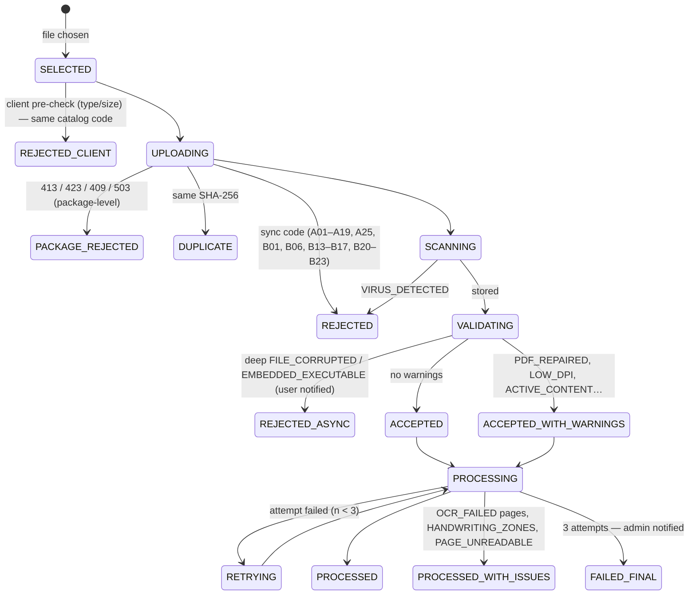

# B10 — Error Handling and Negative Scenarios (Module 12, priority High, cross-cutting)

Owner block: **B10-errors-negative**. Requirement prefix: **ERR-NN**. Negative-scenario IDs: **NS-&lt;domain&gt;&lt;nn&gt;** (for example NS-A07). The automated test for a scenario has the same ID (`T-NS-A07`).

Sources read: `01_TZ_text.txt` (full ТЗ), `02_matrix_all_sheets.txt` (СХЕМА GOLD, МЕТРИКИ, ПРИМЕРЫ РАЗМЕТКИ), `03_perechen_ID_registry_rules.txt`, pilot page previews (`img_razmetka/p14.png`), and the original PDFs (inspected with PyMuPDF 1.28.2 and pikepdf 10.13). Sibling reports read for alignment: `00_architecture.md` (B00), `01_ingestion_registry_revisions.md` (B01), `04_comparison_protocol.md` (B04), `05_verification_inspector.md` (B05), `06_feedback_retraining_weekly_report.md` (B06), `07_free_hypothesis_search.md` (B07), `08_frontend_dashboard_normative_admin.md` (B08), `09_platform_integration_audit_monitoring_security.md` (B09).

Experiments for this report ran in the scratchpad (`…/scratchpad/negfix/`, 25 generated fixtures). Their results are quoted in §3.8 and drive several decisions. No application code was written.

---

## 0. Executive summary (read this first)

1. **One rule above all: fail visible, never fail negative.** An error, a timeout, an unreadable page, a unit mismatch or an unresolved revision must never produce `NEGATIVE_VERIFIED` ("checked, no violation"). That would hide violations and poison the negative GOLD set. It must also never produce `CANDIDATE`, which would inflate the False Positive Rate that §14.3 caps at ≤ 0,10 "на NEGATIVE_VERIFIED и на случаях с устаревшей редакцией". Every failure maps to exactly one visible data-quality outcome: an intake rejection, `NOT_COMPARABLE`, `CLARIFICATION_REQUIRED`, `MISSING_EVIDENCE`, or a `LOW_QUALITY`/`ABSTAIN` flag. The mapping is in §3.7 and is enforced by property tests.
2. **One error envelope and one catalog for the whole system.** The sibling reports currently use four different error-body shapes: `{error_code, message}` (B00 upload), `{code, message_ru}` (B01), `{code, detail_ru}` (B05) and RFC 7807 (B08). About a dozen codes also conflict (`VIRUS_DETECTED`/`AV_INFECTED`, `FILE_CORRUPTED`/`CORRUPTED_FILE`, 409 vs 423 for uploads into a finalized protocol, and others). We standardise on **RFC 9457 `application/problem+json`** (RFC 9457 obsoletes 7807; it is wire-compatible) with Russian `title`/`detail` plus a stable machine `code`, `request_id`, `retryable`, `errors[]`, `details` and `actions[]`. The single source is `packages/contracts/errors.yaml`, generated into TS, Python, OpenAPI (`ErrorCode` enum and per-operation `x-error-codes`), the web message map and a Russian docs page. CI fails when a code has no test (§3.4, §3.6).
3. **The organizers' own pilot file is a negative case.** `Комплект_предметной_разметки.pdf` is **53 993 684 bytes = 51,49 MiB**. It exceeds the ТЗ limit of 50 МБ whichever way МБ is read. A letter-of-the-ТЗ system must reject it with `FILE_TOO_LARGE`. The demo therefore shows this rejection on purpose and then loads the pilot split into per-source files (with the registry file_ids ALT79B-000015 and so on). This is decision E-D6.
4. **A strict "any PDF warning = corrupted" rule would reject the organizers' own file.** pikepdf `check_pdf_syntax()` reports 12 problems on the pilot PDF, and MuPDF logs "premature end of data in flate filter" on several of its pages, yet every page renders correctly. The reverse also happens. A bit-flipped content stream opens and renders with no exception, and the text is silently lost; only MuPDF's object-load warnings and a page-count disagreement (pikepdf 0 pages vs MuPDF 1) reveal the damage. A multi-page PDF truncated at 70–97 % "opens" in PyMuPDF with **0 pages**. We therefore propose a **severity-classified corruption policy**: fatal vs repairable vs benign (§3.8.2, decision E-D1).
5. **The only CONFIRMED_VIOLATION in the pilot (OKT103, pilot p.14) is a 200 dpi scan with handwritten notes, a blue seal and signatures.** Rejecting or ABSTAINing below 300 dpi at file level would throw away the one confirmed positive. Quality handling is therefore **zone-level**. The printed tolerance table is extracted, while handwriting and seal zones become `ABSTAIN` and are excluded from the OCR metric with their share reported (§9.1 alg.1), and the page carries `LOW_DPI` (§3.9, decision E-D2).
6. **Parser libraries fail in raw, inconsistent ways.** HTML renamed to `.pdf` raises `TypeError` inside PyMuPDF. A non-Word ZIP raises `AttributeError` in python-docx. A truncated OLE file raises `ValueError` in olefile. A 231 KB DOCX that expands to 200 MB (ratio 869) opens *successfully* in python-docx and loads everything into RAM. EICAR inside a `.pdf` is reported by PyMuPDF as a broken PDF. Therefore: magic sniffing comes first, then AV, then bomb guards, then parsers, and every parser call is wrapped and mapped to a canonical code. A bad input must never cause a 5xx (invariant I7).
7. **Environment facts that are themselves negative scenarios:**
   - Tesseract on the dev machine has **no `rus` pack**. The readiness check must fail loudly (`OCR_LANG_MISSING`) instead of OCR-ing Cyrillic with `eng`.
   - ClamAV, qpdf and Docker are not installed.
   - The scratch venv is Python 3.10.9. The ТЗ requires ≥ 3.11, and B00 fixed 3.12.
8. **The catalog has 236 scenarios in 12 domains** (§3.12). Each has a trigger, detection point, system action (ТЗ-mandated behaviour marked «ТЗ»), HTTP status and code, a Russian user message, log level, audit/alert effect, retry policy and a test.
9. **Several cross-block contradictions need an architecture ruling** (§6.2). The most important: B01 moves the process to `PARSING` on every incremental upload, while B00/B05 keep the status and run a sub-state. Under B01's model a second upload during an incremental parse would get 409, and verification would be blocked during every incremental parse, because the §9.1 table says PARSING = «верификация: Нет». That contradicts §9.3 п.3 «дозагрузить файлы без сброса верификации». We recommend the B00/B05 model.
10. **For the jury** we deliver three things:
    - a deterministic **negative-fixture generator** (`tools/negfixtures`, 150+ fixtures including boundary files at 50 MiB ± 1 byte and a 5 × 45 MiB package);
    - an **automated negative suite** covering the API contract, chaos (toxiproxy), UI (Playwright), fuzzing (schemathesis) and invariants (hypothesis), with a coverage gate of "every error code ≥ 1 test, every ТЗ-mandated row ≥ 1 E2E test";
    - an admin **«Самопроверка»** page that runs about 60 jury-visible scenarios live against the running system in under 2 minutes, using `DEMO_TIME_SCALE`, and exports an HTML/JUnit report.

**MVP stance.** All ТЗ-mandated negative behaviours are FULL. Handwriting detection, IDS/DDoS and the RTO/RPO drill are SIMPLIFIED. The УКЭП client certificate to РиН is MOCKED. A certified network IDS is OUT_OF_SCOPE and replaced by documented IDS-lite. Totals are in §2.

---

## 1. Scope

### 1.1 ТЗ clauses owned by this block

| ТЗ ref | Quote / content | Coverage |
|---|---|---|
| §7 row 12 (High) | «Обработка ошибок и отрицательных сценариев — Обработка ситуаций: повреждённые файлы, нечитаемые форматы, превышение лимитов, сбои интеграции, некорректные данные» | full, cross-cutting |
| §9.1 «Обработка ошибок при загрузке» | unsupported format → «Отклонение файла с указанием поддерживаемых форматов (PDF, DOCX, XML)»; corrupted PDF → «Отклонение файла, уведомление пользователя о необходимости повторной загрузки»; > 50 МБ → «Отклонение файла, указание максимального допустимого размера»; > 200 МБ → «Отклонение пакета файлов, указание превышенного лимита»; timeout → «Повторная попытка обработки (до 2 раз). При неудаче – уведомление администратора» | full (catalog + tests); implementation in B01 |
| §9.1 alg.1 | «Рукописные и заранее размеченные нечитаемые зоны не включаются в OCR-метрику, но система обязана вернуть LOW_QUALITY или ABSTAIN; доля таких зон и общая покрываемость отчётно фиксируются» | contract + tests; implementation in B01 parsing |
| §9.1 «Выбор актуальной редакции» | «При конфликте редакций, отсутствии признака утверждения или неоднозначной связи система присваивает CLARIFICATION_REQUIRED и не формирует вывод о нарушении. Устаревшая редакция не может использоваться как эталон.» | negative scenarios + invariants; resolver in B01 |
| §9.1 статусы процесса | the table «Возможность дозагрузки / верификации» (PARSING: no upload; FINALIZED: no upload, no verification) | guard catalog + auto-generated lock tests |
| 03 «Обязательный машиночитаемый реестр» | «без него пакет принимается со статусом CLARIFICATION_REQUIRED»; «Перезапись файла под тем же file_id запрещена»; table «Ситуация → Результат системы» (MISSING_EVIDENCE, NOT_APPLICABLE с основанием, NOT_COMPARABLE «Файл нечитаем или листы не сопоставлены») | negative scenarios; registry validator in B01 |
| §9.2 alg.3 | MISSING_EVIDENCE «без включения записи в число нарушений»; NOT_COMPARABLE / CLARIFICATION_REQUIRED «отражают качество входных данных и не являются нарушением»; CONFIRMED_VIOLATION «исключительно инспектором» | fail-visible mapping (§3.7) |
| §9.3 п.2, п.4, п.5, «Отмена финализации» | reject needs `reason_code` + comment; no PARTIALLY_CONFIRMED; finalization «только после обработки всех CANDIDATE…»; «После финализации дозагрузка и изменения статусов становятся невозможными»; un-finalization «только администратору системы или инспектору с правом супервизора… с обязательным указанием причины» | negative scenarios; implementation in B05 |
| §9.5 | SUSPICION «не считается нарушением»; «Для перевода в CANDIDATE требуются конкретные источники и координаты» | negative scenarios; implementation in B07 |
| §9.6 | transfer «только при статусе протокола PROTOCOL_FINALIZED»; «При ошибках 5xx или таймаутах – до 3 повторных попыток с экспоненциальной задержкой (1, 5, 15 минут)»; PENDING_SYNC; «сбой внешней передачи не отменяет и не изменяет подписанное решение»; auto-pull into a finalized protocol «не запускает проверку, а только уведомляет» | negative scenarios, chaos tests; implementation in B09 |
| §9.4 | release contains «только CONFIRMED_VIOLATION и NEGATIVE_VERIFIED с полными карточками… CANDIDATE, SUSPICION, MISSING_EVIDENCE и незавершённые решения в обучение не включаются»; object split; hidden test «не используются для обучения, подбора порогов или ручной донастройки»; publication only after gate | negative scenarios; implementation in B06 |
| §7 row 8, §8.1, §10 #10 | admin updates «пороговые значения параметров (min_value, max_value) без перекодирования»; Normative_Base `effective_from/effective_to` | validation negatives; implementation in B08 |
| §12.1–12.11 | login/password; RBAC; TLS 1.3; audit with IP; log retention 90 d / 1 y for security events; 152-ФЗ; 187-ФЗ integrity; IDS/DDoS; УКЭП for РиН; «Все загружаемые файлы проходят антивирусную проверку перед сохранением в хранилище» | security negatives; implementation in B09 |
| §13.1–13.8 | JSON logs with `timestamp, level, service, message, request_id, user_id`; level policy; metrics incl. «количество ошибок (HTTP 5xx), размер очереди сообщений»; alerts «по электронной почте и в Telegram»; daily hash check | error logging/metrics/alert contract; implementation in B09 |
| §1.3, §1.4 | «Все запросы и ответы передаются в формате JSON с обязательной валидацией схемы OpenAPI 3.0»; pull model with `process_id` and status endpoint | envelope, validation errors, `RESULT_NOT_READY` |

### 1.2 Statuses this block relies on (does not own)

- Process (§9.1): `PENDING, PARSING, READY, VERIFYING, COMPLETED, FINALIZED`. Verification alias (§9.3): `VERIFICATION_COMPLETED ≡ COMPLETED`, `PROTOCOL_FINALIZED ≡ FINALIZED`.
- Upload per stage: `PD_/RD_/ID_ UPLOADED | PARTIAL | MISSING`. Scenario: `FULL … PARTIALLY_LOADED`.
- Completeness (СХЕМА GOLD): `COMPLETE, MISSING_EVIDENCE, NOT_APPLICABLE, NOT_COMPARABLE, CLARIFICATION_REQUIRED`. Finding: `CANDIDATE, NEGATIVE_VERIFIED, CONFIRMED_VIOLATION, SUSPICION`. Quality: `OK, LOW_QUALITY, ABSTAIN`.
- File intake (B01): `RECEIVED → STORED → VALIDATED → META_EXTRACTED | REJECTED_{FORMAT|SIZE|CORRUPTED|ENCRYPTED|EMPTY|INFECTED|MISMATCH} | FAILED_TIMEOUT`. Package: `ACCEPTED | ACCEPTED_WITH_REJECTIONS | CLARIFICATION_REQUIRED | REJECTED_PACKAGE_LIMIT`. Registry: `MISSING | INVALID | VALID_WITH_WARNINGS | VALID | DRAFT_UNCONFIRMED`.
- Job (B00): `QUEUED, RUNNING, SUCCEEDED, RETRY_SCHEDULED, FAILED, DEAD_LETTERED, CANCELLED`. Sync (B09): `NOT_REQUIRED, QUEUED, SENDING, PENDING_SYNC, SYNCED, SYNC_FAILED, CANCELLED`.

**Rule:** an error `code` never reuses a status name, with one deliberate exception, `PROTOCOL_FINALIZED` (the code for "blocked because finalized", matching B05/B07). UI status chips are always namespaced (B08 `StatusTag({ns, code})`).

### 1.3 Related NFRs

- §11 #10: API p95 ≤ 200 ms also applies to error responses. Rejections based on size or state are made before the body is read (§3.8.1).
- §11 #1: 10 files of up to 50 МБ in ≤ 2 min, including AV and validation.
- §11 #2–3: OCR 100 pages ≤ 3 min, 500 pages ≤ 10 min. These set the timeout formula.
- §11 #6: РиН send ≤ 30 s (per-attempt timeout).
- §11 #12–14: 99.9 % availability, RTO ≤ 1 h, RPO ≤ 15 min. These drive the degradation modes and the restore drill.

### 1.4 Ownership split

B10 owns the **contracts and proofs**: the error envelope, the code catalog, the fail-visible invariants, the retry/timeout/degradation policy, the UI error-pattern specification, the negative-fixture generator, the automated negative suite, the chaos harness, the self-test page and the cross-block reconciliation. **Handlers live in the owning blocks**: intake in B01, comparison statuses in B04, verification locks in B05, the GOLD/model gate in B06, suspicions in B07, UI screens and normative validation in B08, and РиН/security/monitoring in B09. B00 names the implementation agent for Module 12 **AG-09 (suite owner)**; the catalog file is created by AG-00 in the contract freeze.

---

## 2. Requirements checklist

Legend: priority for winning = MUST / SHOULD / NICE; MVP = FULL / SIMPLIFIED / MOCKED / OUT_OF_SCOPE.

### A. ТЗ §9.1 mandatory error table

| ID | Requirement | ТЗ ref | Prio | MVP | Justification |
|---|---|---|---|---|---|
| ERR-01 | Unsupported format → reject the file, listing the supported formats «PDF, DOCX, XML» | §9.1 err.1 | MUST | FULL | Magic + extension; exact ТЗ wording in the message (NS-A01…A05) |
| ERR-02 | Corrupted PDF → reject the file and notify the user to re-upload (sync or async) | §9.1 err.2 | MUST | FULL | Severity-classified policy (§3.8.2); async rejections are pushed to the wizard and the notification feed |
| ERR-03 | File > 50 МБ → reject the file, stating the maximum size | §9.1 err.3 | MUST | FULL | 52 428 800 bytes; stream stops at limit + 1; the message states "50 МБ" and the exact bytes |
| ERR-04 | Package > 200 МБ → reject the whole package, stating the exceeded limit | §9.1 err.4 | MUST | FULL | Content-Length pre-check plus a streaming counter; nothing is committed |
| ERR-05 | Processing timeout → up to 2 retries, then an admin notification | §9.1 err.5 | MUST | FULL | 3 attempts; email + Telegram + in-app; file becomes NOT_COMPARABLE and the process continues |

### B. Module 12 scope

| ID | Requirement | ТЗ ref | Prio | MVP | Justification |
|---|---|---|---|---|---|
| ERR-06 | Damaged files of every accepted type get specific codes and messages: truncated/0-page/bit-flipped PDF, encrypted PDF/OOXML, zero-byte, invalid ZIP, non-well-formed XML | §7 #12 «повреждённые файлы» | MUST | FULL | Jury probes these first |
| ERR-07 | Unreadable formats are decided by content, not extension (renamed files, legacy DOC, macro DOCX, DWG) | §7 #12 «нечитаемые форматы» | MUST | FULL | Prototype shows raw parser crashes otherwise |
| ERR-08 | Limits beyond size: file count per package, page count, decompression ratio, JSON body size, nesting depth, rate limits | §7 #12 «превышение лимитов»; §12.9 | SHOULD | FULL | Cheap guards; DoS protection |
| ERR-09 | Integration failures (РиН and internal: PostgreSQL, RabbitMQ, Redis, storage, ClamAV, ml-api, Gotenberg, SMTP/Telegram) have defined behaviour, user message, alert and recovery | §7 #12 «сбои интеграции»; §9.6 | MUST | FULL | Degradation matrix §3.11 + chaos tests |
| ERR-10 | Incorrect data (registry errors, invalid values in XML/DOCX, implausible or unparseable extracted values, unit mismatch) never produce a violation | §7 #12 «некорректные данные» | MUST | FULL | Maps to NOT_COMPARABLE / CLARIFICATION_REQUIRED |

### C. Quality and data-status semantics

| ID | Requirement | ТЗ ref | Prio | MVP | Justification |
|---|---|---|---|---|---|
| ERR-11 | Handwritten and pre-marked unreadable zones → LOW_QUALITY/ABSTAIN, excluded from the OCR metric, with share and coverage reported | §9.1 alg.1 | MUST | SIMPLIFIED | Heuristic detector (ink colour + stroke statistics + OCR confidence) plus manual «Отметить зону нечитаемой»; no trained model |
| ERR-12 | Low-quality scans (< 300 dpi, skew, noise) are flagged, not rejected. Field-level ABSTAIN. An ABSTAIN value never yields CANDIDATE or NEGATIVE_VERIFIED | §9.1 alg.1; §14.3 | MUST | FULL | OKT103 evidence (§0 p.5) |
| ERR-13 | A file that parses but has no text, where OCR also fails, is accepted; its pages become NOT_COMPARABLE and a replacement is requested | 03 row 6 | MUST | FULL | Distinct from intake rejection |
| ERR-14 | Revision conflict, missing approval or ambiguous chain → CLARIFICATION_REQUIRED, with no violation conclusion | §9.1; 03 row 3 | MUST | FULL | Resolver (B01) + invariant test |
| ERR-15 | A superseded or cancelled revision is never the reference; an inspector's attempt to choose one is blocked | §9.1 | MUST | FULL | Invariant I3 + 422 |
| ERR-16 | Missing registry → package CLARIFICATION_REQUIRED; files kept; no violation conclusions | 03 | MUST | FULL | Banner + auto-draft helper |
| ERR-17 | Registry ↔ files mismatches (listed not uploaded, uploaded not listed, hash mismatch, ambiguous match, foreign object, bad page range) are listed with their effect on statuses | 03 | MUST | FULL | Reconciliation panel |
| ERR-18 | Overwriting under the same `file_id` is forbidden; a different file creates a new record | 03 | MUST | FULL | 409 FILE_ID_IMMUTABLE |
| ERR-19 | Duplicate SHA-256 is handled idempotently and audited | 03 (B01 D5) | SHOULD | FULL | No protocol-version noise |
| ERR-20 | Missing mandatory source → MISSING_EVIDENCE, listed separately, not a violation | §9.2 alg.3; §9.3 п.4 | MUST | FULL | Summary-count invariant |
| ERR-21 | Insufficient or non-comparable sources → NOT_COMPARABLE / CLARIFICATION_REQUIRED, not violations | §9.2 alg.3 | MUST | FULL | Basis codes (§3.7.2) |
| ERR-22 | A file of a different object mixed into the package is detected, excluded from linkage and raised for confirmation | 03 (object_id); §14.2 | SHOULD | SIMPLIFIED | Registry object_id (hard) + title-block address/code similarity (soft warning) |
| ERR-23 | Fail-visible invariant: no processing error or quality condition produces NEGATIVE_VERIFIED or CANDIDATE | derived from §9.2, §14.3 FPR | MUST | FULL | Property tests I1/I2 |
| ERR-24 | SINGLE_ONLY or no comparable stage pair → completeness-only protocol with an explanatory banner | §9.2 alg.2 | SHOULD | FULL | Not an error, but a negative path the jury will try |

### D. Lifecycle guards

| ID | Requirement | ТЗ ref | Prio | MVP | Justification |
|---|---|---|---|---|---|
| ERR-25 | Upload is blocked during the initial PARSING | §9.1 table | MUST | FULL | 409 PROCESS_BUSY + Retry-After |
| ERR-26 | Upload is blocked after FINALIZED, with the «Создать новую проверку» action | §9.1 table; §9.3 п.5 | MUST | FULL | 423 PROTOCOL_FINALIZED |
| ERR-27 | Any status change after FINALIZED is blocked in the API **and** by a DB trigger | §9.3 п.5 | MUST | FULL | Auto-generated test over all mutating operationIds |
| ERR-28 | Verification actions are blocked where the §9.1 table says «Нет» | §9.1 table | MUST | FULL | 409 VERIFICATION_NOT_ALLOWED_IN_STATUS |
| ERR-29 | Finalization is blocked while unprocessed CANDIDATEs exist | §9.3 п.4 | MUST | FULL | 409 FINALIZE_GATE_BLOCKED + blockers |
| ERR-30 | Un-finalization only by ADMIN/SUPERVISOR, with a mandatory reason and an audit record | §9.3 | MUST | FULL | 403 / 422 |
| ERR-31 | «Отклонить» requires reason_code + comment | §9.3 п.2 | MUST | FULL | 422 REASON_CODE_REQUIRED / COMMENT_REQUIRED |
| ERR-32 | PARTIALLY_CONFIRMED is forbidden (split instead) | §9.3 п.2 | MUST | FULL | 422 STATUS_NOT_ALLOWED |
| ERR-33 | CONFIRMED_VIOLATION is set only by an inspector role, never by the system, ML or an integration client | §9.2 alg.3 | MUST | FULL | 403 + invariant |
| ERR-34 | Concurrent edits: optimistic locking (ETag/If-Match), idempotency keys, conflict dialog | §11 #11 (100 inspectors), derived | MUST | FULL | 409 VERSION_CONFLICT / 428 |
| ERR-35 | A failed incremental upload or recheck never resets or loses verification decisions | §9.3 п.3 | MUST | FULL | recheck_state FAILED blocks finalization only |
| ERR-36 | SUSPICION → CANDIDATE needs sources and coordinates; SUSPICION never counted as a violation | §9.5 | MUST | FULL | 422 EVIDENCE_REQUIRED |

### E. ИАИС «РиН»

| ID | Requirement | ТЗ ref | Prio | MVP | Justification |
|---|---|---|---|---|---|
| ERR-37 | Transfer is possible only in PROTOCOL_FINALIZED | §9.6 | MUST | FULL | 409 PROTOCOL_NOT_FINALIZED |
| ERR-38 | 5xx/timeouts → up to 3 retries with delays of 1, 5 and 15 min, each attempt logged | §9.6 | MUST | FULL | TTL retry queues + DB watchdog (B09); `DEMO_TIME_SCALE` for the demo |
| ERR-39 | РиН unavailable → the protocol stays PROTOCOL_FINALIZED and sync becomes PENDING_SYNC; the signed decision is untouched | §9.6 | MUST | FULL | Separate sync record |
| ERR-40 | Auto-pull into a FINALIZED protocol → no check is started; the inspector is notified and offered a new check | §9.6 | MUST | FULL | Inbox BLOCKED_FINALIZED |
| ERR-41 | Non-retryable 4xx and certificate/signature failures → SYNC_FAILED + admin alert | §9.6; §12.10 | SHOULD | FULL | Classification table (B09) |
| ERR-42 | Only inspector-confirmed records are transmitted (payload invariant) | §9.3 п.4 | MUST | FULL | Property test + pre-send assertion |
| ERR-43 | Client certificates / УКЭП on РиН requests | §9.6; §12.10 | NICE | MOCKED | mTLS to rin-mock; `Signer` interface (B09) |

### F. Security

| ID | Requirement | ТЗ ref | Prio | MVP | Justification |
|---|---|---|---|---|---|
| ERR-44 | Authentication failures: generic message, lockout, audit | §12.1; §12.4 | MUST | FULL | No user enumeration |
| ERR-45 | RBAC violations → 403 plus a security audit record | §12.2 | MUST | FULL | Table-driven test from the permission matrix |
| ERR-46 | AV scan before storage; infected files rejected; fail-closed when AV is down | §12.11 | MUST | FULL | clamd INSTREAM; EICAR fixtures |
| ERR-47 | XSS / injection: comments stored as text and rendered escaped; parameterized SQL; CSV/XLSX formula injection neutralised; log injection impossible | §12 (derived) | MUST | FULL | Payload list in the suite |
| ERR-48 | Hostile file structures: XXE/DTD, zip bombs, zip-slip, PDF active content, embedded executables, path traversal in names | §12 (derived) | MUST | FULL | Fixtures + tests |
| ERR-49 | Rate limiting and IDS-lite as the MVP reading of «IDS и защита от DDoS-атак» | §12.9 | SHOULD | SIMPLIFIED | nginx + per-user limits + rules (B09) |
| ERR-50 | TLS 1.3 only; plaintext redirected; TLS ≤ 1.2 refused | §12.3 | SHOULD | SIMPLIFIED | Edge config + `openssl s_client` test |
| ERR-51 | Error responses and logs contain no stack traces, SQL, internal paths or PII | §12.6 (152-ФЗ) | MUST | FULL | Regex check on every negative test |
| ERR-52 | Daily storage integrity check; a mismatch raises an alert and blocks the file as evidence | §13.8; §12.7 | SHOULD | FULL | Tamper demo |
| ERR-53 | Security events retained 1 year, routine logs 90 days | §12.5; §13.3 | SHOULD | SIMPLIFIED | Config + ILM policy; not demonstrable in time |

### G. ML/GOLD and normative base

| ID | Requirement | ТЗ ref | Prio | MVP | Justification |
|---|---|---|---|---|---|
| ERR-54 | A model cannot be published without passing the gate; no auto-publication; separation of duties | §9.4 | MUST | FULL | 409 / 403 |
| ERR-55 | A dataset release with forbidden statuses or incomplete cards is blocked | §9.4 | MUST | FULL | 422 with an item list |
| ERR-56 | Object-split leakage is blocked | §9.4; §14.2 | MUST | FULL | 422 SPLIT_LEAKAGE |
| ERR-57 | Hidden-test leakage attempts are blocked and audited; evaluation and self-test processes are excluded from GOLD | §9.4; §14.2 | MUST | FULL | Hash blocklist + purpose flag |
| ERR-58 | Invalid normative edits are rejected: min > max, bounds on a non-numeric type, invalid or overlapping validity periods, invalid or ReDoS-prone regex, unknown unit | §7 #8; §8.1; §10 #10 | MUST | FULL | Inline field errors |
| ERR-59 | Admin edits never mutate a running or finalized run (versions pinned) | §9.2 alg.1 | SHOULD | FULL | matrix_version snapshot |

### H. API contract and observability

| ID | Requirement | ТЗ ref | Prio | MVP | Justification |
|---|---|---|---|---|---|
| ERR-60 | One error envelope (RFC 9457 problem+json with `code`, `request_id`) for every 4xx/5xx, described in OpenAPI | §1.3; §13.1 | MUST | FULL | §3.2 |
| ERR-61 | Single error catalog `errors.yaml` (code, HTTP, RU title/detail template, severity, retryable, audit, alert, UI treatment, ТЗ ref, tests), generated into all consumers | derived | MUST | FULL | §3.4 |
| ERR-62 | Request schema violations → 400 VALIDATION_ERROR with JSON pointers; responses validated against OpenAPI | §1.3 | MUST | FULL | ajv via openapi-backend (B00) |
| ERR-63 | Pull-model misuse (results before READY) → 409 RESULT_NOT_READY with status and Retry-After | §1.4 | SHOULD | FULL | Consistent with B04 |
| ERR-64 | Every error is logged as JSON with the §13.1 fields, following the level policy | §13.1; §13.2 | MUST | FULL | §3.17 |
| ERR-65 | Error metrics: 5xx count, errors by code, retries, dead letters, queue size, degraded components | §13.4 | MUST | FULL | prom-client / prometheus-client |
| ERR-66 | Admin alerts by email + Telegram (+ in-app) for final timeouts, DLQ, AV, integrity, РиН failures, degraded dependencies | §13.7; §9.1 | MUST | SIMPLIFIED | Email via Mailpit; Telegram via a real bot if a token is given, else telegram-mock |
| ERR-67 | Degraded modes: Redis cache optional; broker outage buffered by the outbox; DB, storage and AV fail closed with 503 + Retry-After | §11 #12–14 | MUST | FULL | §3.11 |
| ERR-68 | Worker crash / poison-message handling: redelivery, attempts counted, DLQ, watchdog | §1.5 | MUST | FULL | §3.10 |
| ERR-69 | Error responses are fast (p95 ≤ 200 ms); size and state checks happen before the body is read | §11 #10 | SHOULD | FULL | k6 negative scenario |
| ERR-70 | RTO ≤ 1 h / RPO ≤ 15 min proven by a restore drill | §11 #13–14 | NICE | SIMPLIFIED | Scripted drill, not an SLA |

### I. UX

| ID | Requirement | ТЗ ref | Prio | MVP | Justification |
|---|---|---|---|---|---|
| ERR-71 | UI error patterns: inline field error, per-file status in the upload wizard, registry reconciliation panel, toast with «Код обращения», persistent banner, blocking modal, full-page state | §1.5; §9.1 «уведомление пользователя» | MUST | FULL | §3.18 |
| ERR-72 | Every code has a Russian message; ТЗ wording is used verbatim where the ТЗ gives it | §9.1 | MUST | FULL | Catalog lint |
| ERR-73 | Users are notified of asynchronous rejections and failures of their files | §9.1 err.2 | MUST | FULL | SSE/poll + notification feed |

### J. Proofs, tests and demo

| ID | Requirement | ТЗ ref | Prio | MVP | Justification |
|---|---|---|---|---|---|
| ERR-74 | Deterministic negative-fixture generator with a manifest of expected outcomes | task brief | MUST | FULL | §3.19 |
| ERR-75 | Automated negative suite (API contract, chaos, UI, fuzz, property) + coverage gate (every code ≥ 1 test; every «ТЗ» row ≥ 1 E2E) | task brief | MUST | FULL | §3.20 |
| ERR-76 | Jury self-test page running the suite live with an exportable report | task brief | SHOULD | FULL | §3.21 |
| ERR-77 | Chaos harness: toxiproxy for pg/amqp/redis/s3/clamd/РиН, rin-mock fault modes, `DEMO_TIME_SCALE` | task brief | SHOULD | FULL | Runs natively via Homebrew and in compose |
| ERR-78 | "No 5xx on bad input" invariant verified by OpenAPI fuzzing | §1.3 (derived) | SHOULD | FULL | schemathesis |
| ERR-79 | Startup self-checks: tessdata `rus`, clamd limits and signature freshness, disk space, config sanity → readiness fails with a clear reason | §13; derived | SHOULD | FULL | The dev machine lacks `rus` today |
| ERR-80 | Scanned ИД without visible requisites (signatures, seals, dates, reg. numbers), or electronic ИД without a signature, is flagged; groups relying only on it become CLARIFICATION_REQUIRED | §5 notes 1–2 | SHOULD | SIMPLIFIED | Presence detection only (B01 ING-39) |
| ERR-81 | Notification delivery failures never block the main flow and are retried | §13.7 (derived) | SHOULD | FULL | In-app is always written |
| ERR-82 | Protocol export/render failures: retry, visible FAILED state, JSON protocol stays available | §11 #5 | SHOULD | FULL | Export jobs |
| ERR-83 | Certified network IDS / DDoS mitigation | §12.9 | NICE | OUT_OF_SCOPE | Production statement in the docs (B09) |

**Totals:** 83 requirements: 61 MUST · 19 SHOULD · 3 NICE (ERR-43, ERR-70, ERR-83). MVP: **FULL 73 · SIMPLIFIED 8 (ERR-11, 22, 49, 50, 53, 66, 70, 80) · MOCKED 1 (ERR-43) · OUT_OF_SCOPE 1 (ERR-83).**

---

## 3. Proposed design

### 3.1 Design principles

| # | Principle | Consequence |
|---|---|---|
| P1 | **Fail visible, never fail negative** | Errors map to data-quality statuses (§3.7). An engine exception on a parameter gives `NOT_COMPARABLE(ENGINE_ERROR)`, never a silent skip and never `NEGATIVE_VERIFIED`. |
| P2 | **Reject early, cheap and specifically** | Order: auth/state → Content-Length → streaming size → magic → AV → bomb guards → parsers (§3.8.1). A 423 or 413 costs milliseconds, not a 200 MB read. |
| P3 | **Nothing is silently dropped** | Every rejected file, registry row, page, job and sync attempt leaves a `processing_issues` row, an audit record (for user actions), a log line with `request_id` and a metric increment. |
| P4 | **Retry only what can succeed on retry** | Deterministic input errors are never retried. Transient ones follow a bounded, logged schedule (§3.10). |
| P5 | **Idempotent everywhere** | `Idempotency-Key` on unsafe POSTs, `message_id` dedupe for consumers, content-addressed storage and deterministic result keys (B00 §3.8.3). |
| P6 | **Optional dependencies degrade; mandatory ones fail closed** | Redis cache, ml-api, notifier, monitoring → degrade. PostgreSQL, storage, AV, the session store → 503 with Retry-After (§3.11). |
| P7 | **Finalized means immutable (defence in depth)** | API guard + DB trigger + an auto-generated test over every mutating operation (B05 §3.12). |
| P8 | **One catalog, one envelope, one message per code** | Consistent UX, docs and tests. The UI never hardcodes Russian error text. |

### 3.2 Error envelope (RFC 9457 `application/problem+json`)

All 4xx/5xx responses, on every endpoint including binary downloads and multipart upload, return `Content-Type: application/problem+json` and the header `X-Request-Id`.

| Member | Type | Required | Content |
|---|---|---|---|
| `type` | URI-reference | yes | `/problems/<code-kebab>`, for example `/problems/file-too-large`. It is resolvable: `GET /problems/{slug}` serves the Russian docs page for the code (RFC 9457 §3.1.1) |
| `title` | string (RU) | yes | Short, per code, constant (`Превышен размер файла`) |
| `status` | int | yes | HTTP status (mirrors the response) |
| `detail` | string (RU) | yes | Rendered from the catalog template with `details` (ТЗ wording where given) |
| `instance` | string | yes | Request path + `#` + request_id |
| `code` | string (enum `ErrorCode`) | yes | Stable machine code, UPPER_SNAKE |
| `request_id` | string | yes | Same as the `X-Request-Id` header. The UI shows it as «Код обращения» |
| `timestamp` | date-time | yes | Server time (UTC) |
| `retryable` | bool | yes | From the catalog. The client uses it for its retry decision |
| `retry_after_s` | int | when 429/503/409-busy | Mirrors the `Retry-After` header |
| `details` | object | code-specific | Typed parameters (`limit_bytes`, `actual_bytes`, `file_name`, `process_status`, …), JSON Schema per code |
| `errors[]` | array | for VALIDATION_ERROR and multi-item errors | `{pointer (JSON Pointer), code, detail, params?}` or `{file_name, code, detail}` / `{row, field, code, detail}` |
| `blockers[]` | array | FINALIZE_GATE_BLOCKED and similar gates | `{type, count, finding_ids[], link}` |
| `actions[]` | array | when a next step exists | `{action, label_ru, method?, href?}`; `action` ∈ CREATE_SUCCESSOR, REUPLOAD, DOWNLOAD_REGISTRY_TEMPLATE, BUILD_REGISTRY_DRAFT, OPEN_BLOCKERS, CONFIRM_BELONGS, REMOVE_FROM_PACKAGE, RELOGIN, RETRY |
| `current` | object | VERSION_CONFLICT | Current server state (B05) |

**Warnings travel in successful bodies**, not as errors: `warnings[]: [{code, title, detail, details}]`, the same item shape.

**Per-item errors inside a batch** (upload, registry import, bulk operations) use the **problem item** subset `{code, title, detail, details}`. The batch HTTP status follows the rule: at least one item accepted → `202`; none accepted → `422 NO_ACCEPTED_FILES` with `errors[]`; a package-level violation → a package-level problem (413 PACKAGE_TOO_LARGE, 423, 409, 503).

Examples:

```http
HTTP/1.1 423 Locked
Content-Type: application/problem+json
X-Request-Id: 0192f6c4-7a1e-7b2c-9d10-4f5a6b7c8d9e

{
  "type": "/problems/protocol-finalized",
  "title": "Протокол финализирован",
  "status": 423,
  "detail": "Протокол финализирован. Изменения и дозагрузка невозможны. Для новых документов создайте новую проверку.",
  "instance": "/api/v1/documents/upload#0192f6c4-7a1e-7b2c-9d10-4f5a6b7c8d9e",
  "code": "PROTOCOL_FINALIZED",
  "request_id": "0192f6c4-7a1e-7b2c-9d10-4f5a6b7c8d9e",
  "timestamp": "2026-10-02T09:03:11.412Z",
  "retryable": false,
  "details": { "process_id": "p-0192…", "process_status": "FINALIZED", "protocol_version": 5, "finalized_at": "2026-10-02T08:40:12Z" },
  "actions": [ { "action": "CREATE_SUCCESSOR", "label_ru": "Создать новую проверку", "method": "POST", "href": "/api/v1/processes/p-0192…/successor" } ]
}
```

```http
HTTP/1.1 202 Accepted
Content-Type: application/json

{
  "process_id": "p-0192…", "package_id": "pkg-…", "package_status": "ACCEPTED_WITH_REJECTIONS",
  "registry": { "status": "MISSING", "warnings": [ { "code": "REGISTRY_MISSING", "title": "Реестр файлов не приложен",
                "detail": "Пакет принят без реестра файлов. Статус: CLARIFICATION_REQUIRED — выводы о нарушениях не формируются до загрузки реестра." } ] },
  "files": [
    { "client_key": "f1", "file_name": "SOSH25-003562.pdf", "size": 40055808, "sha256": "3fa1…9b07", "file_id": "SOSH25-003562", "intake_status": "STORED", "warnings": [] },
    { "client_key": "f3", "file_name": "ОВ1_схема.dwg", "size": 4299161, "intake_status": "REJECTED_FORMAT",
      "error": { "code": "UNSUPPORTED_FORMAT", "title": "Формат не поддерживается",
                 "detail": "Формат файла «ОВ1_схема.dwg» не поддерживается. Допустимые форматы: PDF, DOCX, XML.",
                 "details": { "detected": "DWG", "allowed": ["PDF", "DOCX", "XML"] } } },
    { "client_key": "f4", "file_name": "OKT103-000099.pdf", "size": 6021113, "sha256": "…", "file_id": "OKT103-000099", "intake_status": "STORED",
      "warnings": [ { "code": "LOW_DPI", "title": "Низкое разрешение скана",
                      "detail": "Страница 1: разрешение скана 200 dpi (рекомендуется не менее 300 dpi). Нечитаемые и рукописные зоны будут исключены из анализа.",
                      "details": { "pages": [1], "min_dpi": 200 } } ] }
  ],
  "summary": { "accepted": 2, "rejected": 1, "duplicates": 0 }
}
```

```http
HTTP/1.1 503 Service Unavailable
Retry-After: 30
Content-Type: application/problem+json

{ "type": "/problems/av-unavailable", "title": "Антивирусная проверка недоступна", "status": 503,
  "detail": "Антивирусная проверка временно недоступна, файлы не приняты. Повторите загрузку через 30 с.",
  "code": "AV_UNAVAILABLE", "retryable": true, "retry_after_s": 30, "request_id": "…", "timestamp": "…", "instance": "…" }
```

```http
HTTP/1.1 422 Unprocessable Content
Content-Type: application/problem+json

{ "type": "/problems/threshold-range-invalid", "title": "Некорректный диапазон", "status": 422,
  "detail": "Минимальное значение (0,9) не может быть больше максимального (0,8).",
  "code": "THRESHOLD_RANGE_INVALID", "retryable": false, "request_id": "…", "timestamp": "…", "instance": "…",
  "errors": [ { "pointer": "/changes/min_value", "code": "THRESHOLD_RANGE_INVALID", "detail": "Больше максимального значения" },
              { "pointer": "/changes/max_value", "code": "THRESHOLD_RANGE_INVALID", "detail": "Меньше минимального значения" } ] }
```

**OpenAPI 3.0.3.** `components.schemas.Problem`, `ProblemItem` and `ErrorCode` (an enum generated from the catalog). Every operation declares `default: Problem` plus its explicit 4xx/5xx, and the vendor extension `x-error-codes: [..]` lists every code it may return. The contract test fails if an operation returns an undeclared code. RFC 9457's JSON Schema uses 2020-12 constructs; we stay with OAS 3.0.3 (B00 decision), so nullability is expressed as `nullable: true`.

### 3.3 HTTP status policy

| Status | Used for (codes) |
|---|---|
| 400 | Malformed syntax or schema: VALIDATION_ERROR, MALFORMED_JSON, NO_FILES, MULTIPART_MALFORMED, UPLOAD_INCOMPLETE |
| 401 | UNAUTHENTICATED, INVALID_CREDENTIALS, SESSION_EXPIRED, REAUTH_REQUIRED, CLIENT_CERT_INVALID, REQUEST_SIGNATURE_INVALID |
| 403 | FORBIDDEN (RBAC), CSRF_TOKEN_INVALID, SEPARATION_OF_DUTIES, UNFINALIZE_FORBIDDEN, HIDDEN_TEST_ACCESS_DENIED, PASSWORD_CHANGE_REQUIRED |
| 404 | NOT_FOUND, PROCESS_NOT_FOUND, FILE_NOT_FOUND (also used instead of 403 for objects the caller may not know exist) |
| 405 / 406 | METHOD_NOT_ALLOWED / NOT_ACCEPTABLE |
| 408 | REQUEST_TIMEOUT (edge, slow body) |
| 409 | State conflicts: PROCESS_BUSY, VERSION_CONFLICT, EVIDENCE_CHANGED, FINDING_LOCKED_BY_RECHECK, VERIFICATION_NOT_ALLOWED_IN_STATUS, FINALIZE_GATE_BLOCKED, RESULT_NOT_READY, PROTOCOL_NOT_FINALIZED, FILE_ID_IMMUTABLE, EFFECTIVE_PERIOD_OVERLAP, REFERENCE_IN_USE, MATRIX_VERSION_IMMUTABLE, PARAM_CODE_DUPLICATE, MODEL_GATE_NOT_PASSED, MODEL_NOT_APPROVED, MODEL_ROLLBACK_TARGET_INVALID, TEST_SET_HASH_MISMATCH |
| 413 | FILE_TOO_LARGE, PACKAGE_TOO_LARGE, TOO_MANY_FILES, PAYLOAD_TOO_LARGE |
| 415 | UNSUPPORTED_FORMAT, CONTENT_TYPE_MISMATCH, MACRO_ENABLED_DOCUMENT, UNSUPPORTED_MEDIA_TYPE |
| 422 | Semantically invalid content or business rule: FILE_CORRUPTED, FILE_ENCRYPTED, EMPTY_FILE, VIRUS_DETECTED, ARCHIVE_BOMB_SUSPECTED, XML_*, EMBEDDED_EXECUTABLE, NO_ACCEPTED_FILES, REASON_CODE_REQUIRED, COMMENT_REQUIRED, STATUS_NOT_ALLOWED, EVIDENCE_REQUIRED, SUPERSEDED_REVISION_NOT_ALLOWED, UNFINALIZE_REASON_REQUIRED, THRESHOLD_*, REGEX_*, DATASET_*, SPLIT_LEAKAGE, HIDDEN_TEST_LEAKAGE, IDEMPOTENCY_KEY_REUSED |
| 423 | PROTOCOL_FINALIZED (any write on a finalized process), ACCOUNT_LOCKED |
| 428 | PRECONDITION_REQUIRED (If-Match missing) |
| 429 | RATE_LIMITED, IP_TEMPORARILY_BLOCKED |
| 500 | INTERNAL_ERROR (never with internals), RESPONSE_SCHEMA_VIOLATION (test/demo profiles only) |
| 502 / 504 | UPSTREAM_BAD_RESPONSE / UPSTREAM_TIMEOUT (synchronous proxy calls only; РиН is async and never surfaces them to the user) |
| 503 | SERVICE_UNAVAILABLE, DB_UNAVAILABLE, STORAGE_UNAVAILABLE, AV_UNAVAILABLE, SESSION_STORE_UNAVAILABLE, ML_API_UNAVAILABLE, MAINTENANCE_MODE (always with Retry-After) |

A bad input must end in 4xx. A 5xx on any fixture of the negative manifest is a defect (invariant I7).

### 3.4 Error catalog `packages/contracts/errors.yaml`

It sits next to `enums.yaml` (B00). One entry per code:

```yaml
- code: FILE_TOO_LARGE
  http: 413
  domain: intake                 # intake|content|registry|revision|quality|processing|infra|comparison|verification|protocol|rin|auth|security|normative|ml|api|client
  scope: file                    # request|package|file|page|registry_row|revision_group|param|job|sync
  severity: error                # error|warning|info  → UI colour and default log level
  log_level: WARNING             # §13.2 policy (§3.17)
  retryable: false
  security_event: false          # true → Audit_Log category SECURITY (1-year retention)
  audit_action: UPLOAD_REJECTED  # null when not a user action
  alert: null                    # null|warning|critical  (critical = email + Telegram; warning = email; both + in-app)
  user_notification: null        # null|inline|feed  (feed = notifications table)
  tz_ref: "§9.1 «Обработка ошибок при загрузке», строка 3"
  title_ru: "Превышен размер файла"
  detail_ru: "Файл «{file_name}» ({size_mb} МБ) превышает максимальный допустимый размер {limit_mb} МБ ({limit_bytes} байт)."
  hint_ru: "Разделите документ на части или уменьшите размер файла и загрузите повторно."
  details_schema: { file_name: string, size_bytes: integer, limit_bytes: integer, size_mb: string, limit_mb: string }
  ui: { treatment: file_row, icon: error, actions: [REUPLOAD] }   # file_row|inline_field|toast|banner|modal|page|chip
  maps_to: { intake_status: REJECTED_SIZE }                     # status effects (§3.7)
  scenarios: [NS-A07, NS-A08]
```

**Codegen (AG-00, `pnpm gen`):**
- `gen/ts/errors.ts`: a `const` map + union type + zod schemas for `details`, plus a `problem(code, details)` helper that renders `detail`.
- `gen/py/errors.py`: a `StrEnum` + pydantic models + `InspectorError(code, details)`.
- OpenAPI: `ErrorCode` enum + `Problem` schemas.
- `packages/domain/errors.ru.ts` for the web: title, detail template, hint and UI treatment.
- `docs/errors/*.md` and the `/problems/{slug}` pages.

**CI checks:**
1. Every code has `title_ru`, `detail_ru`, and a `hint_ru` when `severity=error`.
2. Every code appears in at least one test (`T-NS-*` tags or `@covers CODE` annotations).
3. Every scenario with a «ТЗ» action has at least one E2E API test.
4. Every `x-error-codes` entry exists in the catalog.
5. No two codes share a `detail_ru` template.
6. Templates reference only fields that exist in `details_schema`.
7. Russian typography lint: «ёлочки», no Latin look-alike letters in Russian words.

### 3.5 Canonical code registry

Columns: code, HTTP, retryable (R), default log level (L: I/W/E), security event (S), alert (A: C/W/–). A user-facing message for every code is in the scenario catalog §3.12 and in `errors.yaml`.

**Generic API**

| Code | HTTP | R | L | S | A |
|---|---|---|---|---|---|
| VALIDATION_ERROR | 400 | – | I | – | – |
| MALFORMED_JSON | 400 | – | I | – | – |
| PAYLOAD_TOO_LARGE | 413 | – | W | – | – |
| UNSUPPORTED_MEDIA_TYPE | 415 | – | I | – | – |
| NOT_FOUND | 404 | – | I | – | – |
| METHOD_NOT_ALLOWED / NOT_ACCEPTABLE | 405/406 | – | I | – | – |
| REQUEST_TIMEOUT | 408 | ✓ | W | – | – |
| PRECONDITION_REQUIRED | 428 | – | I | – | – |
| IDEMPOTENCY_KEY_REUSED | 422 | – | W | – | – |
| RESULT_NOT_READY | 409 | ✓ | I | – | – |
| RATE_LIMITED | 429 | ✓ | W | ✓ | – |
| INTERNAL_ERROR | 500 | ✓ | E | – | W (rate) |
| RESPONSE_SCHEMA_VIOLATION | 500 | – | E | – | W |
| SERVICE_UNAVAILABLE / MAINTENANCE_MODE | 503 | ✓ | E/I | – | – |
| UPSTREAM_BAD_RESPONSE / UPSTREAM_TIMEOUT | 502/504 | ✓ | E | – | – |

**Auth, RBAC, security**

| Code | HTTP | R | L | S | A |
|---|---|---|---|---|---|
| UNAUTHENTICATED | 401 | – | I | – | – |
| INVALID_CREDENTIALS | 401 | – | W | ✓ | – |
| SESSION_EXPIRED | 401 | – | I | – | – |
| REAUTH_REQUIRED | 401 | – | I | – | – |
| ACCOUNT_LOCKED | 423 | ✓ | W | ✓ | C |
| IP_TEMPORARILY_BLOCKED | 429 | ✓ | W | ✓ | C |
| PASSWORD_CHANGE_REQUIRED | 403 | – | I | – | – |
| CSRF_TOKEN_INVALID | 403 | – | W | ✓ | – |
| FORBIDDEN | 403 | – | W | ✓ | W (probing rule) |
| SEPARATION_OF_DUTIES | 403 | – | W | ✓ | – |
| CLIENT_CERT_INVALID / REQUEST_SIGNATURE_INVALID | 401 | – | E | ✓ | C |
| SESSION_STORE_UNAVAILABLE | 503 | ✓ | E | – | C |

**Intake and content** (per-file items unless noted)

| Code | HTTP | R | L | S | A |
|---|---|---|---|---|---|
| NO_FILES (request) | 400 | – | I | – | – |
| NO_ACCEPTED_FILES (request) | 422 | – | W | – | – |
| PACKAGE_TOO_LARGE (package) | 413 | – | W | – | – |
| TOO_MANY_FILES (package) | 413 | – | W | – | – |
| FILE_TOO_LARGE | 413 | – | W | – | – |
| EMPTY_FILE | 422 | – | W | – | – |
| UNSUPPORTED_FORMAT | 415 | – | W | – | – |
| CONTENT_TYPE_MISMATCH | 415 | – | W | ✓ | – |
| MACRO_ENABLED_DOCUMENT | 415 | – | W | ✓ | – |
| FILE_CORRUPTED | 422 | – | W | – | – |
| FILE_ENCRYPTED | 422 | – | W | – | – |
| ARCHIVE_BOMB_SUSPECTED | 422 | – | W | ✓ | W |
| EMBEDDED_EXECUTABLE | 422 | – | W | ✓ | W |
| XML_MALFORMED | 422 | – | W | – | – |
| XML_FORBIDDEN_DTD | 422 | – | W | ✓ | W |
| XML_ENCODING_INVALID | 422 | – | W | – | – |
| XML_LIMITS_EXCEEDED | 422 | – | W | ✓ | – |
| TOO_MANY_PAGES | 422 | – | W | – | – |
| FILENAME_INVALID | 422 | – | W | – | – |
| CHECKSUM_MISMATCH | 422 | ✓ | W | – | – |
| VIRUS_DETECTED | 422 | – | E | ✓ | C |
| AV_UNAVAILABLE (package) | 503 | ✓ | E | – | C (≥ 3 in 5 min) |
| STORAGE_UNAVAILABLE (package) | 503 | ✓ | E | – | C |
| FILE_ID_IMMUTABLE | 409 | – | W | – | – |
| PROCESS_BUSY (request) | 409 | ✓ | I | – | – |
| PROTOCOL_FINALIZED (request) | 423 | – | I | – | – |
| MULTIPART_MALFORMED / UPLOAD_INCOMPLETE | 400 | ✓ | W | – | – |

**Warnings (non-blocking; `warnings[]` / `processing_issues`)**

`DUPLICATE_FILE`, `DUPLICATE_IN_PACKAGE`, `PDF_REPAIRED`, `PDF_PERMISSIONS_RESTRICTED`, `PDF_ACTIVE_CONTENT`, `PDF_HAS_REVIEW_MARKUP`, `EXTERNAL_REFERENCES_IGNORED`, `RENDER_CAPPED`, `LARGE_DOCUMENT`, `NO_TEXT_LAYER`, `LOW_DPI`, `SKEW_CORRECTED`, `SKEW_RESIDUAL`, `HANDWRITING_ZONES`, `SEAL_OVERLAP`, `OCR_PARTIAL`, `LOW_COVERAGE`, `XML_SCHEMA_UNKNOWN`, `XML_SCHEMA_INVALID`, `RENDITION_FAILED`, `DRAFT_NEWER_EXISTS`, `META_OBJECT_MISMATCH`, `META_CONFLICT`, `SIGNATURE_MISSING`, `REQUISITES_MISSING`, `REGISTRY_EXTRA_COLUMNS`. Log level INFO or WARNING, never an HTTP error.

**Registry and revisions** (items in `registry.errors[]` / `warnings[]`, and group basis codes)

| Code | Effect | L |
|---|---|---|
| REGISTRY_MISSING | package CLARIFICATION_REQUIRED | W |
| REGISTRY_FORMAT_UNSUPPORTED / REGISTRY_UNREADABLE | as MISSING | W |
| REGISTRY_COLUMN_MISSING | registry INVALID | W |
| REGISTRY_ROW_INVALID (+ field codes REQUIRED, ENUM_INVALID, DATE_INVALID, PATTERN_MISMATCH, STAGE_STATUS_INCONSISTENT) | file CLARIFICATION_REQUIRED | W |
| REGISTRY_DUPLICATE_FILE_ID | rows INVALID | W |
| REGISTRY_FILE_NOT_UPLOADED | stage PARTIAL; MISSING_EVIDENCE | I |
| REGISTRY_FILE_NOT_LISTED | file not a source | W |
| REGISTRY_HASH_MISMATCH | file not a source; CLARIFICATION_REQUIRED | W |
| REGISTRY_AMBIGUOUS_MATCH | CLARIFICATION_REQUIRED | W |
| REGISTRY_OBJECT_MISMATCH | registry rejected (B01) | W (S) |
| REGISTRY_PAGE_RANGE_INVALID | sheets unmapped → NOT_COMPARABLE | W |
| REVISION_CONFLICT, APPROVAL_STATUS_MISSING, REVISION_CHAIN_CYCLE, REVISION_CHAIN_FORK, REVISION_CHAIN_DANGLING, REVISION_DATE_INVERSION, REVISION_LABEL_DUPLICATE | CLARIFICATION_REQUIRED | W |
| CURRENT_REVISION_NOT_UPLOADED | MISSING_EVIDENCE | I |
| SUPERSEDED_REVISION_NOT_ALLOWED (HTTP 422) | inspector choice rejected | W |

**Processing, quality, infrastructure**

| Code | HTTP / surface | R | L | A |
|---|---|---|---|---|
| PROCESSING_TIMEOUT | job | ✓ (≤ 2 retries) | W, final E | W (final, ТЗ) |
| PARSE_RESOURCE_LIMIT | job | ✓ | W, final E | W (final) |
| WORKER_CRASHED | job | ✓ | E | W (final) |
| JOB_DEAD_LETTERED | job | – | E | W |
| OCR_FAILED (page) | issue | – | W | – |
| PAGE_UNREADABLE (page) | issue | – | W | – |
| OCR_LANG_MISSING | readiness | – | E | C |
| ENGINE_ERROR (param) | basis | – | E | W (if > 10 %) |
| RECHECK_FAILED | process | ✓ | E | W |
| EXPORT_FAILED | export job | ✓ | E | – |
| DB_UNAVAILABLE / DB_BUSY | 503 | ✓ | E | C |
| BROKER_UNAVAILABLE | internal (status: queued) | ✓ | E | C (> 2 min) |
| CACHE_UNAVAILABLE | internal | ✓ | W | W |
| ML_API_UNAVAILABLE | 503 (sync ops) | ✓ | E | W |
| RENDERER_UNAVAILABLE | job | ✓ | E | W |
| NOTIFIER_UNAVAILABLE | internal | ✓ | W | – |
| DISK_SPACE_LOW | alert | – | W | W / C |
| STORAGE_INTEGRITY_VIOLATION | alert + issue | – | E (S) | C |
| MODEL_ARTIFACT_INTEGRITY_FAILED | alert | – | E (S) | C |
| CONFIG_INVALID | startup | – | E | C |
| PROCESS_STALLED | alert | – | W | W |

**Verification and protocol** (B05/B07 names kept)

VERSION_CONFLICT 409 · EVIDENCE_CHANGED 409 · FINDING_LOCKED_BY_RECHECK 409 · VERIFICATION_NOT_ALLOWED_IN_STATUS 409 · REASON_CODE_REQUIRED 422 · COMMENT_REQUIRED 422 · APPROVED_CHANGE_REF_REQUIRED 422 · JUSTIFICATION_REQUIRED 422 · STATUS_NOT_ALLOWED 422 · EVIDENCE_REQUIRED 422 · SPLIT_INVALID 422 · FINALIZE_GATE_BLOCKED 409 · UNFINALIZE_FORBIDDEN 403 · UNFINALIZE_REASON_REQUIRED 422 · PROTOCOL_FINALIZED 423 · PROTOCOL_NOT_FINALIZED 409 · EXPORT_FORMAT_UNSUPPORTED 422 · HYP_* (B07, detector-level, internal).

**РиН** (sync outcomes; internal codes on `rin_delivery_attempts`, never user-facing HTTP errors)

RIN_UNAVAILABLE (R) · RIN_TIMEOUT (R) · RIN_RATE_LIMITED (R) · RIN_REJECTED (non-R → SYNC_FAILED) · RIN_AUTH_FAILED (non-R, C) · RIN_PAYLOAD_INVALID (non-R, C) · RIN_PAYLOAD_INVARIANT_VIOLATION (non-R, C) · SIGNER_UNAVAILABLE (non-R until fixed, C) · RIN_INBOUND_HASH_MISMATCH (C) · RIN_INBOUND_OBJECT_UNKNOWN (W) · NEW_DOCS_AFTER_FINALIZATION (notification type).

**Normative base** (B08)

THRESHOLD_RANGE_INVALID 422 · THRESHOLD_TYPE_MISMATCH 422 · EFFECTIVE_PERIOD_INVALID 422 · EFFECTIVE_PERIOD_OVERLAP 409 · REGEX_INVALID 422 · REGEX_UNSAFE 422 · UNIT_UNKNOWN 422 · PARAM_CODE_INVALID 422 · PARAM_CODE_DUPLICATE 409 · REASON_REQUIRED 422 · REFERENCE_IN_USE 409 · MATRIX_VERSION_IMMUTABLE 409 · MATRIX_IMPORT_INVALID 422.

**ML / GOLD** (B06)

MODEL_GATE_NOT_PASSED 409 · MODEL_NOT_APPROVED 409 · MODEL_ROLLBACK_TARGET_INVALID 409 · DATASET_FORBIDDEN_ITEMS 422 · DATASET_INCOMPLETE_CARDS 422 · SPLIT_LEAKAGE 422 · HIDDEN_TEST_LEAKAGE 422 (S, C) · HIDDEN_TEST_ACCESS_DENIED 403 (S) · TEST_SET_HASH_MISMATCH 409 (C) · EVALUATION_ITEM_NOT_ELIGIBLE 422 · TRAINING_FAILED (job) · REPORT_GENERATION_FAILED (job).

### 3.6 Cross-block reconciliation (proposed canonical names; AG-00 to ratify in the contract freeze)

| Topic | B00 | B01 | B05 / B07 | B08 | B09 | **Canonical** |
|---|---|---|---|---|---|---|
| Error body | `{error_code, message}` in upload rejected[] | `{code, message_ru}` | `{code, detail_ru}` | RFC 7807 `{type,title,status,detail,code,errors[],request_id}` | — | **RFC 9457** (§3.2); per-item `{code,title,detail,details}` |
| Upload into FINALIZED | — | 409 `UPLOAD_NOT_ALLOWED` + CREATE_SUCCESSOR | 423 `PROTOCOL_FINALIZED` | `STATUS_FORBIDDEN` | — | **423 PROTOCOL_FINALIZED** + `actions[CREATE_SUCCESSOR]` |
| Upload into PARSING | 409 `PROCESS_BUSY` | 409 `UPLOAD_NOT_ALLOWED` | 409 | — | — | **409 PROCESS_BUSY** + Retry-After |
| Infected file | — | status `REJECTED_INFECTED` | — | `AV_INFECTED` | `VIRUS_DETECTED` | code **VIRUS_DETECTED**; status REJECTED_INFECTED |
| Corrupted | `CORRUPTED_FILE` | `REJECTED_CORRUPTED` / `CORRUPTED` | — | `FILE_CORRUPTED` | — | code **FILE_CORRUPTED** |
| Encrypted | `ENCRYPTED_PDF` | `REJECTED_ENCRYPTED` | — | — | — | code **FILE_ENCRYPTED** (PDF and OOXML) |
| Timeout | `TIMEOUT` | `FAILED_TIMEOUT` | — | `PROCESSING_TIMEOUT` | — | code **PROCESSING_TIMEOUT**; file status FAILED_TIMEOUT |
| Optimistic lock | — | — | `VERSION_CONFLICT` | `CONFLICT` | — | **VERSION_CONFLICT** |
| Schema error | — | — | — | `VALIDATION_ERROR` | — | **VALIDATION_ERROR** |
| Suspicion conversion without evidence | — | — | B05: 422 `EVIDENCE_REQUIRED`; B07: 409 `{missing}` | — | — | **422 EVIDENCE_REQUIRED** with `errors[]` listing each missing item |
| Integration down (UI) | — | — | — | `INTEGRATION_UNAVAILABLE` | PENDING_SYNC | Not an HTTP error. A sync-status chip; internal code RIN_UNAVAILABLE |
| Exchanges | `inspector.jobs/events/retry/dlx` | `ii.ingest/parse/process/notify/retry/dead` | `inspector.events` | `inspector.events` | `inspector.events` | **B00 names** |
| Retry TTLs (processing) | 10 s, 60 s | 30 s, 120 s | — | — | — | **B00** (configurable) |
| Broker redelivery cap | 3 attempts | 3 attempts | — | — | `x-delivery-limit: 5` | Both: app attempt counter = 3 (authoritative, §9.1); broker 5 = poison backstop |
| SyncStatus enum | NOT_SENT, PENDING_SYNC, SYNCING, SYNCED, SYNC_FAILED | — | — | — | NOT_REQUIRED, QUEUED, SENDING, PENDING_SYNC, SYNCED, SYNC_FAILED, CANCELLED | **B09** (update `enums.yaml`) |
| Demo time compression | `DEMO_TIME_SCALE` | — | — | — | `RIN_RETRY_DELAYS_SEC` demo `5,10,15` | One global **`DEMO_TIME_SCALE`** divisor; per-feature delays configured at scale 1 |
| Catalog location | `packages/contracts/errors.yaml` | — | — | `packages/domain` | — | Source in **contracts**, generated into domain |
| Reason code for a binding error | `LINKING_ERROR` | — | B05/B06: `BINDING_ERROR` | `LINKING_ERROR` | — | B05 decides (flagged, not a B10 code) |

### 3.7 Fail-visible status mapping

#### 3.7.1 Condition → effect

| Condition (detected by) | File / page effect | Evidence slot | `completeness_status` of the group | `finding_status` | Counted as violation | GOLD |
|---|---|---|---|---|---|---|
| Intake rejection (format, size, corrupted, encrypted, infected, bomb) | not stored, or stored-and-excluded (async); `REJECTED_*` | none | MISSING_EVIDENCE if the file was the only source («файл отклонён») | — | no | no |
| Registry missing / invalid for the file | stored; `meta_status=CLARIFICATION_REQUIRED` | UNAUTHORITATIVE | CLARIFICATION_REQUIRED (REGISTRY_MISSING / REGISTRY_ROW_INVALID) | — | no | no |
| Hash mismatch / not listed / foreign object | stored, excluded as source | UNAUTHORITATIVE | CLARIFICATION_REQUIRED | — | no | no |
| Listed but not uploaded; successor declared but absent | — | MISSING | MISSING_EVIDENCE | — | no | no |
| Revision conflict / no approval / chain ambiguity | stored | UNRESOLVED | CLARIFICATION_REQUIRED (REVISION_UNRESOLVED) | — | no | no |
| Only superseded available, no successor info | stored | STALE | CLARIFICATION_REQUIRED | — | no | no |
| Timeout ×3 / crash ×3 / page unrenderable | FAILED_TIMEOUT / PAGE_UNREADABLE | UNREADABLE | NOT_COMPARABLE (FILE_NOT_PROCESSED / SOURCE_UNREADABLE) | — | no | no |
| No text and OCR failed | page OCR_FAILED | UNREADABLE | NOT_COMPARABLE (SOURCE_UNREADABLE) | — | no | no |
| Needed value in a LOW_QUALITY zone with confidence < τ, or in an ABSTAIN zone | value ABSTAIN | UNREADABLE | NOT_COMPARABLE | — | no | no |
| Units not convertible; value unparseable or implausible | value INVALID | INVALID | NOT_COMPARABLE (UNIT_INCOMPATIBLE / VALUE_UNPARSEABLE / VALUE_IMPLAUSIBLE) | — | no | no |
| Sheets unmapped; scope mismatch; evidence not localisable | — | — | NOT_COMPARABLE | — (a candidate is downgraded) | no | no |
| Engine exception on the parameter | — | — | NOT_COMPARABLE (ENGINE_ERROR) | — | no | no |
| Hypothesis module failed | — | — | — (section 5 marked «модуль гипотез недоступен») | no SUSPICION | no | no |
| All sources COMPLETE, current, comparable, and delta within rule | — | OK | COMPLETE | NEGATIVE_VERIFIED (decided_by=SYSTEM) | no | only after inspector review (B06) |
| All sources COMPLETE and delta breaches rule | — | OK | COMPLETE | CANDIDATE | no (until the inspector confirms) | no |

#### 3.7.2 Basis codes for data-quality statuses

These are shared with B04 and printed in protocol table (1) «Причина / основание»:

- `REGISTRY_MISSING, REGISTRY_ROW_INVALID, REGISTRY_HASH_MISMATCH, FILE_NOT_LISTED, OBJECT_MISMATCH, REVISION_UNRESOLVED, APPROVAL_MISSING, SUPERSEDED_ONLY` → CLARIFICATION_REQUIRED
- `MANDATORY_SOURCE_MISSING, DECLARED_NOT_RECEIVED, CURRENT_REVISION_NOT_UPLOADED, FILE_REJECTED` → MISSING_EVIDENCE
- `SOURCE_UNREADABLE, FILE_NOT_PROCESSED, VALUE_ABSTAINED, UNIT_INCOMPATIBLE, VALUE_UNPARSEABLE, VALUE_IMPLAUSIBLE, SCOPE_MISMATCH, SHEETS_NOT_MATCHED, EVIDENCE_NOT_LOCALIZABLE, ENGINE_ERROR` → NOT_COMPARABLE
- `STAGE_NOT_APPLICABLE, PARAM_NOT_APPLICABLE_TO_OBJECT` (+ basis text) → NOT_APPLICABLE

#### 3.7.3 Invariants (property-tested; the names are used in tests)

- **I1.** No `finding_status = NEGATIVE_VERIFIED` when any required slot is UNREADABLE, INVALID, UNRESOLVED, UNAUTHORITATIVE, STALE or MISSING.
- **I2.** `CANDIDATE` only if every required slot is OK (current, approved, same object, units compatible, localised).
- **I3.** No ACTIVE finding has an EXPECTED or ACTUAL fragment from a file with `approval_status ∈ {SUPERSEDED, CANCELLED}` or `intake_status ∉ {STORED, VALIDATED, META_EXTRACTED, PARSED}`.
- **I4.** No write lands on a FINALIZED process, whether through the API or the DB trigger.
- **I5.** The РиН payload contains only `CONFIRMED_VIOLATION` from ACTIVE findings.
- **I6.** Every 4xx/5xx body validates against `Problem` and has `request_id` equal to the header.
- **I7.** No negative-manifest fixture ever yields a 5xx.
- **I8.** Every rejection produces an audit record (user actions) or a `processing_issues` row (system), plus a log line with `request_id`.
- **I9.** No response contains `Traceback`, `at …(.ts|.js):`, `/Users/`, `/app/`, `node_modules`, SQL keywords with an error context, or the ФИО/e-mail of third parties.
- **I10.** Dataset releases contain only eligible items; no `object_group_id` appears in two splits; no item comes from an EVALUATION or SELFTEST process or from a blocklisted SHA-256.
- **I11.** The summary violation count equals the number of ACTIVE `CONFIRMED_VIOLATION` findings, regardless of the counts of MISSING_EVIDENCE, NOT_COMPARABLE, CLARIFICATION_REQUIRED, SUSPICION or CANDIDATE.

### 3.8 Intake validation pipeline and evidence-based detection rules

#### 3.8.1 Order of checks (cheapest and most decisive first)

| # | Stage | Where | Rejects with | Notes |
|---|---|---|---|---|
| 0 | Auth, CSRF, RBAC, rate limit | edge + API guard | 401/403/429 | Before the body is read |
| 1 | Process state (advisory lock) | API | 409 PROCESS_BUSY / 423 PROTOCOL_FINALIZED / 404 | Before the body is read (B01 step 2) |
| 2 | `Content-Length` > 200 MiB + 2 MiB multipart allowance | edge (`client_max_body_size 210m`) + API | 413 PACKAGE_TOO_LARGE | Instant |
| 3 | Streaming counters: per part > 50 MiB (drain the part), package > 200 MiB (abort all), parts > 1000 | API (busboy) | FILE_TOO_LARGE / PACKAGE_TOO_LARGE / TOO_MANY_FILES | SHA-256 computed on the fly; bytes go to quarantine (0600, never served) |
| 4 | Size 0 | API | EMPTY_FILE | |
| 5 | Filename: NFC-normalise, strip control and bidi characters, basename only, ≤ 255 bytes | API | FILENAME_INVALID (only if empty after sanitising) | The original (NFC) name is kept for display and for registry matching |
| 6 | Magic sniffing vs extension allowlist {pdf, docx, xml}; OLE disambiguation (EncryptedPackage → encrypted OOXML; WordDocument → legacy DOC); DOCX = ZIP with `[Content_Types].xml` + `word/document.xml`, and not macro-enabled | API (`file-type` + own checks; OLE check in intake-worker if needed) | UNSUPPORTED_FORMAT / CONTENT_TYPE_MISMATCH / MACRO_ENABLED_DOCUMENT / FILE_ENCRYPTED | Must precede any parser (the prototype showed a PyMuPDF `TypeError` on HTML-as-PDF) |
| 7 | Duplicate by SHA-256 within the process or package | API | DUPLICATE_FILE (warning, not stored twice) | B01 D5 |
| 8 | **Antivirus** (clamd INSTREAM, 60 s) | API | VIRUS_DETECTED / 503 AV_UNAVAILABLE | **Before any parser and before storage** (§12.11). EICAR-in-PDF is otherwise reported as "corrupted" by PyMuPDF |
| 9 | Fast structure: PDF `%PDF-` + `startxref`/`%%EOF` presence + `/Encrypt` sniff; ZIP central directory with Σ uncompressed ≤ 500 MB, ratio ≤ 100, no `..` entries; XML streaming parse with DOCTYPE forbidden and depth ≤ 256 | API (Node: yauzl, saxes) | FILE_CORRUPTED / FILE_ENCRYPTED / ARCHIVE_BOMB_SUSPECTED / XML_* | Instant feedback for the jury's typical broken files |
| 10 | Promote to encrypted content-addressed storage + DB rows + outbox, in one transaction | API | 503 STORAGE_UNAVAILABLE / DB_UNAVAILABLE | Nothing is committed on failure |
| 11 | **Deep validation** (async, intake-worker, 60 s): PDF policy §3.8.2, DOCX §3.8.3, XML §3.8.4, page geometry, DPI, content class | Python | async FILE_CORRUPTED (the file is excluded, the user is notified) or warnings | Results are pushed to the wizard (SSE/poll) within seconds |

#### 3.8.2 PDF corruption policy (severity-classified; decision E-D1)

Probes, all run in a subprocess with a time and memory limit:
1. `pymupdf.open` → `needs_pass`, `is_repaired`, `page_count`, `metadata.encryption`.
2. `pikepdf.open` → page count, `check_pdf_syntax()` messages (pikepdf ≥ 10 renamed `check()`; this was verified).
3. Render every page at 18–36 dpi, collecting `TOOLS.mupdf_warnings()` per page.
4. Catalog scan: `/OpenAction`, `/AA`, `/JavaScript`, `/Launch`, `/EmbeddedFiles`, `/RichMedia`, `/XFA`.

| Observation | Class | Outcome |
|---|---|---|
| Size 0 | fatal | EMPTY_FILE |
| Open fails in both libraries | fatal | FILE_CORRUPTED `{reason: CANNOT_OPEN}` |
| `needs_pass` / pikepdf PasswordError | fatal | FILE_ENCRYPTED |
| Opens with `page_count == 0` (seen: a 6-page PDF truncated at 70–97 % opens with 0 pages) | fatal | FILE_CORRUPTED `{reason: NO_PAGES}` |
| Page-count disagreement between the libraries (seen: bit-flip gives pikepdf 0 vs MuPDF 1) | fatal | FILE_CORRUPTED `{reason: PAGE_TREE_DAMAGED}` |
| Per-page MuPDF warnings of the *structural* class (`cannot load object`, `non-page object in page tree`, `invalid indirect reference`), or a render exception | fatal | FILE_CORRUPTED `{reason: PAGES_DAMAGED, pages:[…]}` |
| `is_repaired` / pikepdf "file is damaged", "can't find startxref", "can't find PDF header", with counts agreeing and every page rendering without structural warnings (seen: tail-truncated and header-damaged single-page files) | repairable | Accepted + **PDF_REPAIRED** warning («Файл содержал структурные ошибки и был автоматически восстановлен; рекомендуем загрузить исходный файл»). Strict mode `PDF_REPAIRED_POLICY=reject` turns this into FILE_CORRUPTED |
| *Benign stream* warnings only: `premature end of data in flate filter`, `input stream is complete but output may still be valid`, `invalid marked content sequence / clip nesting` (**all seen on the organizers' own 24-page pilot**, which renders perfectly) | benign | Accepted, INFO log only |
| `metadata.encryption` present but no password needed (owner-password restrictions; seen: "Standard V5 R6 256-bit AES", `can_extract=False`) | warning | Accepted + PDF_PERMISSIONS_RESTRICTED |
| JavaScript / Launch / RichMedia / XFA | warning | Accepted + PDF_ACTIVE_CONTENT. Originals are served only as attachments; the viewer uses server renditions and pdf.js with `enableScripting:false` |
| EmbeddedFiles whose payload magic is PE (`MZ`), ELF, Mach-O or a script shebang, or whose extension is in {exe, dll, js, vbs, bat, cmd, ps1, sh, jar, scr} | fatal (policy) | EMBEDDED_EXECUTABLE + security event |
| Pages > 2000 / > 500 | fatal / warning | TOO_MANY_PAGES / LARGE_DOCUMENT |
| Page area > 5 m² or an image > 2·10⁸ px | warning | RENDER_CAPPED (render DPI lowered for that page) |

Measured costs: `check_pdf_syntax` on the 51,49 MiB / 24-page pilot took 4,3 s; the 18-dpi render of all its A0/A1 pages took 1,2 s. So deep validation of every page is affordable (a 500-page file ≈ 25 s, asynchronous).

#### 3.8.3 DOCX rules

- Not a ZIP, or a truncated central directory → FILE_CORRUPTED (seen: `BadZipFile`).
- No `word/document.xml`, or `[Content_Types].xml` lacks the main part → FILE_CORRUPTED `{reason: NOT_WORDPROCESSINGML}`. Python-docx otherwise raised a raw `AttributeError`.
- Macro content type or `vbaProject.bin` present → MACRO_ENABLED_DOCUMENT (python-docx raised a raw `ValueError`).
- Σ uncompressed > 500 MB or any entry ratio > 100 → ARCHIVE_BOMB_SUSPECTED. This is checked from the central directory **and** enforced while streaming inflate, because the directory can lie. Seen: python-docx opened a 231 KB → 200 MB bomb without complaint.
- An entry name with `..` or an absolute path → FILE_CORRUPTED + security event (zip-slip; we never extract to disk anyway).
- OLE container: an `EncryptedPackage` stream → FILE_ENCRYPTED (seen with msoffcrypto-generated files); a `WordDocument` stream → UNSUPPORTED_FORMAT `{detected: DOC}`; otherwise → UNSUPPORTED_FORMAT. **olefile raises a raw `ValueError` on truncated CFB, so the call is wrapped.**
- `TargetMode="External"` relationships (remote templates or images) → EXTERNAL_REFERENCES_IGNORED. DOCX→PDF conversion (Gotenberg/LibreOffice) runs without network access, which is an SSRF guard.
- Embedded OLE executables → EMBEDDED_EXECUTABLE; other OLE objects are ignored with a warning.

#### 3.8.4 XML rules

- Parser: `lxml` with `resolve_entities=False, no_network=True, load_dtd=False, huge_tree=False` (Python), or `saxes` (Node fast gate). **Any `<!DOCTYPE` → XML_FORBIDDEN_DTD** (policy: simpler and safer than partial DTD support). Seen: lxml safe mode leaves `&x;` unresolved, and libxml2 stops billion-laughs with "Maximum entity amplification factor exceeded".
- Not well-formed → XML_MALFORMED `{line, column, message}`.
- Declared encoding mismatch, invalid byte sequence or forbidden control characters → XML_ENCODING_INVALID. `windows-1251` declared correctly is accepted.
- Depth > 256, a text node > 10 MB or more than 10⁶ elements → XML_LIMITS_EXCEEDED.
- Unknown root/namespace → accepted + XML_SCHEMA_UNKNOWN. The content is used only as generic text evidence (`locator = XPath`). A known namespace with an XSD available but failing validation → accepted + XML_SCHEMA_INVALID (first 20 errors). Values from invalid nodes are not used (→ NOT_COMPARABLE).
- Semantically invalid values (a date `2026-13-45`, a negative area, text in a numeric element, a missing unit) → the extraction is `INVALID` → NOT_COMPARABLE (VALUE_UNPARSEABLE / VALUE_IMPLAUSIBLE).

#### 3.8.5 Tested behaviours (prototype, 2026-09-27; PyMuPDF 1.28.2, pikepdf 10.13, python-docx 1.2, lxml 6.1, olefile 0.47)

| Fixture | Library behaviour observed | Consequence for design |
|---|---|---|
| `zero.pdf` | PyMuPDF `EmptyFileError` | Check size before the parser |
| `garbage.pdf`, `truncated_half.pdf` | `FileDataError` | FILE_CORRUPTED |
| `truncated_tail.pdf`, `no_header.pdf` | Opens; `is_repaired=True`; text intact; pikepdf 4–7 "damaged" warnings | Repairable class → PDF_REPAIRED |
| 6-page PDF truncated at 97/90/70 % | Opens with **0 pages**, `is_repaired=True` | `page_count==0` → FILE_CORRUPTED (naive code would treat it as an empty document) |
| `bitflip.pdf` (200 bytes inverted) | Opens, renders, **text length 0**, warnings "cannot load object", "non-page object in page tree"; pikepdf pages = 0 | Structural warnings + count disagreement → FILE_CORRUPTED |
| `html_as.pdf` | PyMuPDF raises `TypeError` in `fz_has_permission` | Magic sniff first; wrap parser exceptions |
| `enc_user.pdf` (AES-256) | `needs_pass=1`; pikepdf `PasswordError` | FILE_ENCRYPTED |
| `enc_owner_only.pdf` | Opens transparently; `metadata.encryption="Standard V5 R6 256-bit AES"`; copy permission denied | PDF_PERMISSIONS_RESTRICTED warning |
| `js_openaction.pdf`, `embedded_exe.pdf` | Open normally; OpenAction xref visible; `embfile_count=1` | Catalog scan needed (neither library complains) |
| `eicar.pdf` | PyMuPDF `FileDataError` (looks "corrupted") | AV before parsers, otherwise malware is mislabelled |
| `image_blank.pdf` | Opens; text 0 | OCR path → OCR_FAILED → NOT_COMPARABLE |
| Organizer pilot 24 p., 51,49 MiB | pikepdf 12 "input stream is complete…" warnings; MuPDF "premature end of data in flate filter" on pp. 1, 3–6; renders fine | Benign class; a strict policy would reject the organizers' file |
| `truncated.docx` | `BadZipFile` / `PackageNotFoundError` | FILE_CORRUPTED |
| `not_word.docx` | python-docx `AttributeError` | Structural check before python-docx |
| `macro.docx` | python-docx `ValueError` (content type) | MACRO_ENABLED_DOCUMENT |
| `bomb.docx` 231 KB → 200 MB | **Opens fine**; ratio 869 | Zip-bomb guard before parsing |
| `encrypted_real.docx` (msoffcrypto) | OLE with `EncryptedPackage`, `EncryptionInfo` | FILE_ENCRYPTED; distinguishable from legacy DOC |
| Truncated CFB (`encrypted.docx` stub) | olefile raises `ValueError` | Wrap → FILE_CORRUPTED |
| `xxe.xml` | lxml safe parse leaves the entity unresolved | Forbid DOCTYPE anyway |
| `billion.xml` | libxml2 "Maximum entity amplification factor exceeded" | XML_FORBIDDEN_DTD |
| `malformed.xml` | `XMLSyntaxError` with line/column | XML_MALFORMED with position |

### 3.9 Quality rules (LOW_QUALITY / ABSTAIN), a contract with B01 parsing and B04

- **Page level.** `min_image_dpi` (image px ÷ visible size in inches), `content_class`, `ocr_mean_conf`, `skew_deg`, `handwritten_share`, `seal_share`.
  - `LOW_DPI` if a full-page raster is < 300 dpi. Pilot pp. 3 and 5 are 150 dpi; p. 14 (OKT103) is 200 dpi.
  - `LOW_QUALITY` if dpi < 150, the mean OCR confidence is < 60, or the residual skew is > 2° after deskew (auto-deskew up to 10°; OSD auto-rotation for 90°/180°).
- **Zone level.**
  - Handwriting: a heuristic mask of blue/violet ink hue (HSV) ∩ connected components with high stroke-width variance ∩ low Tesseract confidence → `ABSTAIN` zone.
  - Seals: a circular Hough over the ink mask → `SEAL_OVERLAP` zone. Values under a seal ABSTAIN unless the confidence is ≥ τ.
  - Pre-marked zones from the organizers or an inspector («Отметить зону нечитаемой» in the viewer) → ABSTAIN.
- **Field level.** Token confidence below `τ_field` (default 70; per key field) → the value is `ABSTAIN`. A second engine is used if it is installed (B01). ABSTAIN values are never compared.
- **Reporting (§9.1).** Per file and per process: `coverage = extracted_needed_fields / needed_fields`, `abstention_share`, `handwritten_zone_share` and `low_quality_pages`, printed in the protocol header and in the §14 evaluation harness output. `LOW_COVERAGE` warning if coverage < 50 %.
- **OKT103 acceptance test.** On pilot page 14 the printed tolerance table (15 мм, ±12 мм, 20 мм and the deviations up to +980 мм) is extracted with confidence ≥ τ. The blue handwritten notes and the seal are ABSTAIN zones. The page is LOW_DPI, not rejected. The group stays eligible for CANDIDATE.

### 3.10 Retries, timeouts and idempotency (consolidated)

| Class | Examples | Policy | Budget / delays | After the budget |
|---|---|---|---|---|
| Deterministic input error | FILE_CORRUPTED, FILE_ENCRYPTED, UNSUPPORTED_FORMAT, VALIDATION_ERROR, REGISTRY_* | No retry | — | User fixes and re-uploads |
| Processing timeout (§9.1) | parse, ocr, extract, compare, hypothesis, render, validate | 2 retries (3 attempts) through `inspector.retry` TTL queues | Delays 10 s, 60 s (B00). Deadlines: validate 60 s; parse `60 s + 1,2 s/page`, cap 11 min (100 p. ≈ 3 min, 500 p. ≈ 11 min, within §11 #2–3 tolerance); OCR batch 120 s; extract/compare/hypothesis 120 s; render 60 s | FAILED (+ DEAD_LETTERED copy); file FAILED_TIMEOUT; NOT_COMPARABLE(FILE_NOT_PROCESSED); **admin notified** (email + Telegram + in-app, ТЗ); the user sees «не обработан — администратор уведомлён»; the process continues |
| Resource limit / crash | OOM (RLIMIT_AS 4 GiB), segfault in MuPDF, container restart, lost heartbeat | Same budget as timeouts (an attempt is counted at job start in the DB, so a crash loop consumes attempts); the retry may lower the render DPI | Watchdog every 15–30 s: RUNNING and heartbeat older than 2 × deadline → attempt failed | As above; broker `x-delivery-limit: 5` → DLQ is only a backstop |
| Poison message | payload fails the schema | No retry | — | DLQ + JOB_DEAD_LETTERED alert |
| Transient infrastructure inside a job | DB serialization failure/deadlock, S3 5xx, AMQP reconnect | In-process retry 3× with exponential backoff and jitter | 100 ms → 400 ms → 1,6 s | Job attempt fails (counts toward its budget) |
| РиН (§9.6) | 5xx, 408, network, our 30 s attempt timeout, 429 (Retry-After capped by tier) | Immediate attempt + 3 retries | 60 s, 300 s, 900 s | PENDING_SYNC with `retries_exhausted_at`, warning alert, recovery probe, manual «Повторить отправку» (B09) |
| РиН non-retryable | 400, 401, 403, 404, 413, 422; our payload invalid; signer unavailable | None | — | SYNC_FAILED + critical alert |
| РиН 409 DUPLICATE with the same payload hash | — | Treated as success | — | SYNCED |
| Notifications | SMTP, Telegram | 3 retries | 5 s, 30 s, 120 s | Logged WARNING; in-app is always written |
| Client GET | 5xx / network | 2 retries with backoff (TanStack Query) | 1 s, 3 s | ErrorState with request_id |
| Client mutations | any | Never automatic; a manual retry is safe with the same `Idempotency-Key` | — | Toast with a «Повторить» button |
| 429 / 503 | — | Honour `Retry-After` | — | Countdown on the disabled button |

`DEMO_TIME_SCALE=N` divides every delay and deadline listed as "delay" above, but not the per-attempt HTTP timeouts. The UI shows a banner when N ≠ 1. At N = 60 the РиН schedule becomes 1 s / 5 s / 15 s, and processing retries 0,2 s / 1 s.

**Idempotency.** `Idempotency-Key` on upload, decisions, finalize, unfinalize, inspection and admin writes. Responses are cached for 24 h (Redis state). The same key with a different body → 422 IDEMPOTENCY_KEY_REUSED. Consumers dedupe on `message_id` (`processed_messages`, B09). Jobs use `idempotency_key UNIQUE` (B00).

### 3.11 Degradation matrix (dependencies)

| Dependency | Kind | Detection | Behaviour while down | User-visible | Alert | Recovery |
|---|---|---|---|---|---|---|
| PostgreSQL | mandatory | pool error, readiness probe | API 503 DB_UNAVAILABLE (Retry-After 15); workers stop acking (nack with requeue delay) so no message is lost; the outbox is naturally paused | Banner «Сервис временно недоступен»; forms keep their drafts | critical (ServiceDown) | Automatic; RPO ≤ 15 min via backups (B09) |
| Object storage (MinIO / fs) | mandatory | put/get error | Upload 503 STORAGE_UNAVAILABLE (the transaction is rolled back); viewer tiles 503 → placeholder; workers retry | Banner; page placeholder «Страница временно недоступна» | critical | Automatic |
| ClamAV | mandatory (`AV_MODE=required`) | INSTREAM error or timeout | Upload 503 AV_UNAVAILABLE (fail closed); РиН inbound files wait in the inbox | Upload banner «Антивирусная проверка недоступна» | critical after 3 in 5 min | Automatic; demo-only `AV_MODE=mock-eicar` |
| RabbitMQ | mandatory for processing, not for acceptance | connection error, publisher-confirm timeout | Uploads and decisions commit with outbox rows (202 as usual); the relay retries every 500 ms; the process shows «Ожидает постановки в очередь»; readiness `degraded(broker)` | Status chip «Очередь недоступна — обработка начнётся автоматически» | critical if > 2 min | Relay drains the outbox; unacked messages are redelivered |
| Redis cache | optional | command error / timeout (50 ms) | Bypass: every lookup is a miss; single-flight falls back to a DB advisory lock | None (slower) | warning (CACHE_UNAVAILABLE, rate-limited) | Automatic |
| Redis state (sessions, idempotency, rate limit) | mandatory for authenticated calls | command error | 503 SESSION_STORE_UNAVAILABLE for authenticated routes (fail closed); the rate limiter falls back to an in-memory per-instance store | Login page banner | critical | Automatic; sessions are lost only if the Redis data is lost |
| ml-api (sync) | optional | HTTP error / timeout (500 ms budget) | Regex-test returns 503 ML_API_UNAVAILABLE (the rest of the save is allowed; see NS-J15); the AI verdict is `UNAVAILABLE` and the inspector's decision is saved (B06) | Inline note | warning | Automatic |
| ml-workers | mandatory for processing | no consumers on a queue, backlog | Jobs wait; ETA shown; watchdog handles stuck jobs | Progress with a wait note | warning (QueueBacklog) | Scale workers or restart |
| Gotenberg / renderer | optional | job error | Export job retried ×2 → EXPORT_FAILED; JSON protocol still available; DOCX rendition missing → RENDITION_FAILED (text evidence without bbox) | Export chip «Ошибка формирования — повторить» | warning | Manual retry |
| SMTP / Telegram | optional | send error | Retries; the other channel is used; in-app is always written | None | logged | Automatic |
| Prometheus / ELK | optional | — | The app is unaffected; logs go to stdout/file, and Filebeat catches up | None | Watchdog alert from Alertmanager | — |
| РиН | external | see §3.10 | Sync record only; protocol untouched | Sync chip «Ожидает синхронизации с РиН — повтор в 14:35» | per B09 | Automatic + manual |
| Tesseract `rus` / tessdata | mandatory for OCR | startup self-check | Readiness FAIL `OCR_LANG_MISSING`; OCR queue not consumed; text-layer processing continues | Admin banner «OCR недоступен: не установлен языковой пакет rus» | critical | Install the pack; no silent `eng` fallback |

`GET /api/v1/system/status` (cached 5 s) returns `{status: OK|DEGRADED|DOWN, components:[{name, status, since, impact_ru}], demo_time_scale}`. The web polls it every 30 s, and immediately after any 503, to drive the system banner.

### 3.12 Negative-scenario catalog

Legend.
- **Detection:** `edge` (nginx), `api` (NestJS/Fastify handler or guard), `iw` (Python intake-worker, deep validation), `av` (clamd), `pw` (parse/OCR worker), `reg` (registry validator), `rev` (revision resolver), `cmp` (comparison engine), `ver` (verification service), `prot` (protocol service/renderer), `rin` (РиН dispatcher/inbound), `auth`, `adm` (normative admin), `ml` (ml-registry/trainer), `wd` (watchdog/scheduler), `web`.
- **Log:** I/W/E = INFO/WARNING/ERROR; (S) = security event, 1-year retention.
- **Audit · alert:** audit action or `issue` (`processing_issues` row); alert C = critical (email + Telegram + in-app), W = warning (email + in-app), N = user notification in the feed.
- **Retry:** `клиент` = the user fixes and re-uploads; `авто ×2` = 2 automatic retries (§3.10); `РиН` = 1/5/15 min.
- **«ТЗ»** marks behaviour mandated verbatim by the ТЗ.
- **Test:** the automated test `T-<ID>` uses the named fixture and asserts HTTP + `code` + Russian `detail` + the listed side effects. Tests marked (UI) also run in Playwright; (chaos) run in the toxiproxy suite.

#### A. Transport and intake (synchronous, `POST /api/v1/documents/upload`)

| ID | Trigger | Detection | System action | HTTP · code | Сообщение пользователю | Log | Audit · alert | Retry | Test |
|---|---|---|---|---|---|---|---|---|---|
| NS-A01 | Extension not allowed (.jpg, .png, .xls, .zip, .rar, .sig/.p7s, .txt…) | api: allowlist + magic | File rejected, rest of the package continues; no Files row «ТЗ» | item 415 UNSUPPORTED_FORMAT (all rejected → 422 NO_ACCEPTED_FILES) | «Формат файла «{file_name}» не поддерживается. Допустимые форматы: PDF, DOCX, XML.» | W | UPLOAD_REJECTED · issue | клиент | NF-TYPE-* → item code; detail contains «PDF, DOCX, XML»; no Files row; audit row |
| NS-A02 | DWG drawing (magic `AC10xx`) | api | As A01, `details.detected=DWG` + hint | item 415 UNSUPPORTED_FORMAT | «Формат DWG не поддерживается. Загрузите PDF-экспорт чертежа. Допустимые форматы: PDF, DOCX, XML.» | W | UPLOAD_REJECTED | клиент | NF-TYPE-DWG |
| NS-A03 | Content ≠ extension (HTML/EXE renamed to .pdf; PDF named .docx) | api: magic | Rejected before any parser (PyMuPDF raised `TypeError` on HTML-as-PDF) | item 415 CONTENT_TYPE_MISMATCH | «Содержимое файла «{file_name}» не соответствует расширению .{ext} (определено: {detected}). Допустимые форматы: PDF, DOCX, XML.» | W (S) | UPLOAD_REJECTED | клиент | NF-TYPE-HTML-AS-PDF, NF-TYPE-EXE-AS-PDF → never 5xx |
| NS-A04 | Legacy Word 97–2003 (.doc, OLE `WordDocument`) | api/iw: OLE probe | Rejected | item 415 UNSUPPORTED_FORMAT `{detected: DOC}` | «Формат DOC (Word 97–2003) не поддерживается. Сохраните документ в формате DOCX или PDF.» | W | UPLOAD_REJECTED | клиент | NF-DOCX-LEGACY-DOC |
| NS-A05 | Macro-enabled document (.docm renamed; `vbaProject.bin`) | api: ZIP content types | Rejected | item 415 MACRO_ENABLED_DOCUMENT | «Файл «{file_name}» содержит макросы и не может быть принят. Сохраните документ как DOCX без макросов или PDF.» | W (S) | UPLOAD_REJECTED | клиент | NF-DOCX-MACRO |
| NS-A06 | Zero-byte file | api | Rejected | item 422 EMPTY_FILE | «Файл «{file_name}» пустой (0 байт). Загрузите файл повторно.» | W | UPLOAD_REJECTED | клиент | NF-PDF-ZERO, NF-DOCX-ZERO, NF-XML-ZERO |
| NS-A07 | File > 50 МБ (52 428 800 bytes) | api: stream counter | Part stops at limit + 1 byte and is drained; other files continue «ТЗ» | item 413 FILE_TOO_LARGE | «Файл «{file_name}» ({size_mb} МБ) превышает максимальный допустимый размер 50 МБ.» | W | UPLOAD_REJECTED | клиент | NF-SIZE-50MIB (accepted), NF-SIZE-50MIB+1 (rejected) |
| NS-A08 | Organizers' pilot kit `Комплект_предметной_разметки.pdf` (53 993 684 bytes) | api | As A07 (a real-world instance; used in the demo) | item 413 FILE_TOO_LARGE | as A07 (51,5 МБ) | W | UPLOAD_REJECTED | клиент (split per source) | NF-PILOT-KIT (not committed; taken from `ТЗ/`) |
| NS-A09 | Package > 200 МБ declared by Content-Length | edge + api, before reading the body | Whole package rejected; nothing written «ТЗ» | 413 PACKAGE_TOO_LARGE `{limit_bytes: 209715200, actual_bytes}` | «Общий размер пакета ({total_mb} МБ) превышает лимит загрузки 200 МБ. Пакет отклонён целиком — загрузите файлы несколькими пакетами.» | W | UPLOAD_REJECTED | клиент | NF-PKG-5x45MIB → 413 in < 200 ms; no rows in files/packages |
| NS-A10 | Package > 200 МБ discovered mid-stream (chunked, no Content-Length) | api: total counter | Abort, shred all quarantined parts, roll back | 413 PACKAGE_TOO_LARGE | as A09 | W | UPLOAD_REJECTED | клиент | NF-PKG-CHUNKED-201MIB |
| NS-A11 | More than 1000 files in one package | api | Package rejected | 413 TOO_MANY_FILES | «В пакете {count} файлов — максимум {limit}. Разделите пакет на части.» | W | UPLOAD_REJECTED | клиент | NF-PKG-1001-FILES |
| NS-A12 | Request with no file parts | api | Rejected | 400 NO_FILES | «Не выбрано ни одного файла для загрузки.» | I | – | клиент | empty multipart |
| NS-A13 | Every file in the package rejected | api | No process created | 422 NO_ACCEPTED_FILES + `errors[]` per file | «Ни один файл пакета не принят. Причины указаны для каждого файла.» | W | UPLOAD_REJECTED ×n | клиент | package of A01+A06+B01 fixtures |
| NS-A14 | Upload interrupted (client abort, connection reset) | api | Single transaction: nothing committed; quarantine shredded | 400 UPLOAD_INCOMPLETE (logged; the client may not receive it) | «Загрузка прервана. Повторите загрузку — уже принятые файлы не будут загружены повторно.» | W | – | клиент (same Idempotency-Key) | abort after 60 % → no partial rows |
| NS-A15 | Client-declared `sha256` ≠ computed | api | File rejected (transfer corruption) | item 422 CHECKSUM_MISMATCH | «Контрольная сумма файла «{file_name}» не совпала с переданной (повреждение при передаче). Загрузите файл повторно.» | W | UPLOAD_REJECTED | клиент | wrong `sha256[]` field |
| NS-A16 | Hostile or odd filename: `../../x.pdf`, control or bidi characters (U+202E), NFD Cyrillic from macOS, > 255 bytes | api | Sanitised to an NFC basename; stored by UUID/sha; rejected only if empty after sanitising | item 422 FILENAME_INVALID (rare) | «Недопустимое имя файла. Переименуйте файл и загрузите повторно.» | W (S if traversal) | issue | клиент | NF-API-NAMES → stored name is the NFC basename; an NFD name still matches its NFC registry row |
| NS-A17 | Same SHA-256 already in this process | api | Idempotent: no new Files row, no new protocol version (B01 D5) | item 200-like `intake_status=DUPLICATE` + warning DUPLICATE_FILE | «Файл «{file_name}» уже загружен в эту проверку (совпадает SHA-256 с «{existing_name}», {uploaded_at}). Повторная обработка не требуется.» | I | UPLOAD_DUPLICATE | – | upload the same file twice → the protocol version is unchanged |
| NS-A18 | The same file twice inside one package | api | One copy accepted | warning DUPLICATE_IN_PACKAGE | «Файл «{file_name}» повторяется в пакете (совпадает с «{other_name}»); принят один экземпляр.» | I | – | – | two identical parts |
| NS-A19 | Registry `file_id` already exists with a different hash | api/reg | Rejected; overwrite forbidden «ТЗ» (03) | item 409 FILE_ID_IMMUTABLE | «Файл с идентификатором {file_id} уже загружен с другим содержимым. Перезапись запрещена — укажите в реестре новый file_id и редакцию.» | W | UPLOAD_REJECTED | клиент | NF-REG-FILEID-REUSE |
| NS-A20 | New revision with different bytes (positive control) | api | New record, incremental run, new protocol version (03) | 202 | — | I | UPLOAD | – | protocol_version + 1; the previous version is kept |
| NS-A21 | Upload while the process is in the initial PARSING | api guard | Rejected; the UI may queue the files client-side «ТЗ» (§9.1 table) | 409 PROCESS_BUSY + Retry-After | «Дозагрузка недоступна: выполняется парсинг документов. Повторите после его завершения.» | I | – | клиент (auto after status change) | during PARSING |
| NS-A22 | Upload into FINALIZED | api guard (+ DB trigger) | Rejected; offer a new check «ТЗ» (§9.3 п.5) | 423 PROTOCOL_FINALIZED + `actions[CREATE_SUCCESSOR]` | «Протокол финализирован. Изменения и дозагрузка невозможны. Для новых документов создайте новую проверку.» | I | UPLOAD_BLOCKED_FINALIZED | – | after finalize → 423; after unfinalize → 202 (UI) |
| NS-A23 | Unknown process or a process the user may not access | api | Rejected without revealing existence | 404 PROCESS_NOT_FOUND | «Проверка не найдена или у вас нет к ней доступа.» | I (W if repeated) | ACCESS_DENIED (if not owner) | – | random UUID; another inspector's process |
| NS-A24 | No `object_id` and no object in the registry | api | Rejected | 400 VALIDATION_ERROR (`/object_id`) | «Укажите объект капитального строительства.» | I | – | клиент | form without object |
| NS-A25 | Malware (EICAR; EICAR inside PDF/DOCX/ZIP) | av (before parsers and storage) | Rejected, not stored, quarantine shredded; security audit | item 422 VIRUS_DETECTED | «Файл «{file_name}» не прошёл антивирусную проверку и отклонён. Администратор уведомлён.» | E (S) | FILE_AV_INFECTED · C | – | NF-EICAR-* generated at runtime |
| NS-A26 | ClamAV unavailable | av | Fail closed: nothing accepted (§12.11) | 503 AV_UNAVAILABLE + Retry-After 30 | «Антивирусная проверка временно недоступна, файлы не приняты. Повторите загрузку через {retry_after_s} с.» | E | · C (≥ 3 in 5 min) | клиент (Retry-After) | (chaos) clamd down |
| NS-A27 | AV scan of one file exceeds 60 s | av | As A26 for the package | 503 AV_UNAVAILABLE | as A26 | E | · W | клиент | (chaos) clamd latency 70 s |
| NS-A28 | Storage write failure or disk full | api | Transaction rolled back; quarantine shredded | 503 STORAGE_UNAVAILABLE | «Хранилище файлов временно недоступно. Файлы не приняты, повторите загрузку позже.» | E | · C | клиент | (chaos) MinIO down; fs quota |
| NS-A29 | Per-user upload rate exceeded (30 per hour) | api (rate limiter) | Rejected | 429 RATE_LIMITED + Retry-After | «Превышено число загрузок ({limit} в час). Повторите через {retry_after_min} мин.» | W (S) | · (IDS rule) | клиент | 31 uploads |
| NS-A30 | Slow client body (> 120 s) | edge | Connection closed with a JSON problem (nginx `error_page` → static problem+json) | 408 REQUEST_TIMEOUT | «Превышено время передачи файлов. Проверьте соединение и повторите загрузку.» | W | – | клиент | throttled client |
| NS-A31 | Registry-type file (CSV/XLSX/JSON) put into `files[]` | api | Rejected as a document, with a hint | item 415 UNSUPPORTED_FORMAT `{hint: REGISTRY_FIELD}` | «Файл «{file_name}» похож на реестр. Реестр файлов прикладывается в поле «Реестр» (CSV, XLSX, JSON); документы — в форматах PDF, DOCX, XML.» | W | UPLOAD_REJECTED | клиент | NF-REG-AS-DOCUMENT |
| NS-A32 | Malformed multipart (bad boundary, missing headers) | api | Rejected | 400 MULTIPART_MALFORMED | «Некорректный формат запроса загрузки.» | W | – | клиент | raw bad request |
| NS-A33 | Role without upload permission (ML_ENGINEER, AUDITOR) | api guard | Rejected | 403 FORBIDDEN | «Недостаточно прав для загрузки документов.» | W (S) | ACCESS_DENIED | – | RBAC matrix test |

#### B. File content (fast gate in `api`, deep validation in `iw`; asynchronous results are pushed to the wizard and the notification feed)

| ID | Trigger | Detection | System action | HTTP · code | Сообщение пользователю | Log | Audit · alert | Retry | Test |
|---|---|---|---|---|---|---|---|---|---|
| NS-B01 | PDF cannot be opened (random bytes, truncated to half, trailer lost) | api fast / iw | Rejected; user told to re-upload «ТЗ» | item 422 FILE_CORRUPTED `{reason: CANNOT_OPEN}` | «Файл «{file_name}» повреждён и не может быть обработан. Загрузите файл повторно.» | W | UPLOAD_REJECTED · N | клиент | NF-PDF-GARBAGE, NF-PDF-TRUNC-HALF |
| NS-B02 | PDF "opens" with 0 pages (multi-page file truncated at 70–97 %) | iw | Rejected; the file is excluded if already stored | 422 FILE_CORRUPTED `{reason: NO_PAGES}` | «Файл «{file_name}» повреждён: не удалось прочитать ни одной страницы. Загрузите файл повторно.» | W | · N | клиент | NF-PDF-TRUNC-MULTI-90 |
| NS-B03 | Page tree damaged: libraries disagree on the page count, or structural render warnings (bit-flip) | iw | Rejected, listing the pages | 422 FILE_CORRUPTED `{reason: PAGES_DAMAGED, pages}` | «Файл «{file_name}» повреждён (страницы {pages}). Загрузите файл повторно.» | W | · N | клиент | NF-PDF-BITFLIP |
| NS-B04 | Repairable xref/header damage; every page renders; the libraries agree | iw | Accepted with a warning (E-D1); strict mode rejects | warning PDF_REPAIRED | «Файл «{file_name}» содержал структурные ошибки и был автоматически восстановлен. Рекомендуем загрузить исходный файл.» | W | issue | – | NF-PDF-TRUNC-TAIL, NF-PDF-NO-HEADER; with `PDF_REPAIRED_POLICY=reject` → FILE_CORRUPTED |
| NS-B05 | Benign stream warnings only (flate "premature end", marked-content nesting) | iw | Accepted silently | — | — | I | – | – | pilot pages (split) → no warning, no rejection |
| NS-B06 | PDF with a user (open) password | api fast / iw | Rejected | item 422 FILE_ENCRYPTED | «Файл «{file_name}» защищён паролем. Снимите защиту и загрузите файл повторно.» | W | UPLOAD_REJECTED | клиент | NF-PDF-ENC-AES256, NF-PDF-ENC-RC4 |
| NS-B07 | Owner-password restrictions only (no password needed to open) | iw | Accepted with a warning | warning PDF_PERMISSIONS_RESTRICTED | «Для файла «{file_name}» установлены ограничения прав (копирование, печать). Файл принят; содержимое используется только для проверки.» | I | issue | – | NF-PDF-OWNER-ONLY |
| NS-B08 | Active content: JavaScript OpenAction/AA, Launch, RichMedia, XFA | iw: catalog scan | Accepted; never executed; the viewer uses server renditions and pdf.js with scripting disabled; originals are served only as attachments | warning PDF_ACTIVE_CONTENT | «Файл «{file_name}» содержит активное содержимое (JavaScript, действия). Оно не исполняется; для просмотра используется безопасная копия.» | W (S) | issue | – | NF-PDF-JS, NF-PDF-LAUNCH; E2E: the viewer does not execute the script |
| NS-B09 | Embedded executable or script in EmbeddedFiles / OLE | iw | Rejected (policy) | 422 EMBEDDED_EXECUTABLE | «Файл «{file_name}» содержит вложенный исполняемый файл и отклонён по требованиям безопасности.» | W (S) | UPLOAD_REJECTED · W | клиент | NF-PDF-EMBEDDED-EXE, NF-DOCX-OLE-EXE |
| NS-B10 | Very large page count: > 2000 (reject) or > 500 (warn) | iw | Reject or warn (§11 #3 budget) | 422 TOO_MANY_PAGES / warning LARGE_DOCUMENT | «Файл «{file_name}» содержит {pages} страниц — максимум {limit}. Разделите документ.» / «Обработка файла «{file_name}» ({pages} стр.) может занять более 10 минут.» | W / I | issue | клиент | NF-PDF-2001-PAGES, NF-PDF-600-PAGES |
| NS-B11 | Page or pixel bomb (page > 5 m²; image > 2·10⁸ px) | iw/pw | Render DPI capped for that page; if rendering still fails → PAGE_UNREADABLE | warning RENDER_CAPPED | «Страницы {pages} файла «{file_name}» слишком велики для полного разрешения; анализ выполнен с пониженным разрешением.» | W | issue | – | NF-PDF-PIXEL-BOMB (memory stays under the rlimit) |
| NS-B12 | Digitally signed PDF (/Sig, /ByteRange) — positive control | iw | Accepted; signature presence recorded; not treated as damage | — | — | I | – | – | NF-PDF-SIGNED |
| NS-B13 | DOCX is not a valid ZIP (truncated) | api fast | Rejected | item 422 FILE_CORRUPTED | as B01 | W | UPLOAD_REJECTED | клиент | NF-DOCX-TRUNC |
| NS-B14 | ZIP without `word/document.xml` or a valid content-types part | api fast | Rejected (python-docx would raise a raw AttributeError) | item 422 FILE_CORRUPTED `{reason: NOT_WORDPROCESSINGML}` | «Файл «{file_name}» не является документом Word (DOCX) или повреждён.» | W | UPLOAD_REJECTED | клиент | NF-DOCX-NOT-WORD |
| NS-B15 | Decompression bomb (Σ > 500 MB or ratio > 100) | api fast (central directory) + iw (streaming inflate) | Rejected | item 422 ARCHIVE_BOMB_SUSPECTED | «Файл «{file_name}» отклонён: недопустимая степень сжатия содержимого (признак «zip-бомбы»).» | W (S) | UPLOAD_REJECTED · W | – | NF-DOCX-BOMB (231 KB → 200 MB); the worker RSS stays < 300 MB |
| NS-B16 | Zip-slip entry names (`../`, absolute paths) | api fast | Rejected | item 422 FILE_CORRUPTED `{reason: UNSAFE_ENTRY}` | as B14 | W (S) | UPLOAD_REJECTED | – | NF-DOCX-ZIPSLIP |
| NS-B17 | Encrypted OOXML (OLE with `EncryptedPackage`) | api/iw: OLE probe | Rejected | item 422 FILE_ENCRYPTED | as B06 | W | UPLOAD_REJECTED | клиент | NF-DOCX-ENCRYPTED (msoffcrypto) |
| NS-B18 | External relationships (remote template or images) | iw | Accepted; conversion runs without network (SSRF guard) | warning EXTERNAL_REFERENCES_IGNORED | «Внешние ссылки в файле «{file_name}» (шаблоны, изображения по сети) не загружаются.» | W (S) | issue | – | NF-DOCX-EXTERNAL-REF → no outbound request (toxiproxy counter) |
| NS-B19 | Embedded OLE objects (non-executable) | iw | Ignored with a warning | warning (OLE_OBJECTS_IGNORED) | «Встроенные объекты в файле «{file_name}» не анализируются.» | I | issue | – | NF-DOCX-OLE |
| NS-B20 | XML not well-formed | api fast / iw | Rejected, with the position | item 422 XML_MALFORMED `{line, column}` | «XML-файл «{file_name}» содержит синтаксическую ошибку (строка {line}, позиция {column}). Исправьте файл и загрузите повторно.» | W | UPLOAD_REJECTED | клиент | NF-XML-MALFORMED |
| NS-B21 | DOCTYPE or entity declarations (XXE, billion laughs, external DTD) | api fast | Rejected (policy) | item 422 XML_FORBIDDEN_DTD | «XML-файл «{file_name}» содержит объявление DOCTYPE или сущностей, запрещённое требованиями безопасности.» | W (S) | UPLOAD_REJECTED · W | – | NF-XML-XXE-FILE, NF-XML-XXE-HTTP (no outbound request), NF-XML-BILLION |
| NS-B22 | Encoding invalid, or the declared encoding does not match | api fast / iw | Rejected; a correctly declared cp1251 is accepted | item 422 XML_ENCODING_INVALID | «Кодировка XML-файла «{file_name}» не соответствует объявленной ({declared}).» | W | UPLOAD_REJECTED | клиент | NF-XML-CP1251-MISLABELED; NF-XML-CP1251-OK accepted |
| NS-B23 | Excessive depth (> 256) or node size | api fast | Rejected | item 422 XML_LIMITS_EXCEEDED | «XML-файл «{file_name}» превышает допустимую вложенность или размер элементов.» | W (S) | UPLOAD_REJECTED | – | NF-XML-DEEP-10000 |
| NS-B24 | Unknown XML schema or namespace | iw | Accepted; used only as a text source | warning XML_SCHEMA_UNKNOWN | «Схема XML-файла «{file_name}» не распознана; файл используется только как текстовый источник.» | I | issue | – | NF-XML-UNKNOWN-NS |
| NS-B25 | Known schema, XSD validation fails | iw | Accepted; invalid nodes are not used | warning XML_SCHEMA_INVALID | «XML-файл «{file_name}» не соответствует схеме {schema} (ошибок: {n}); некорректные элементы не используются при сравнении.» | W | issue | – | NF-XML-XSD-INVALID (only when an XSD is present) |
| NS-B26 | Semantically wrong values in XML/DOCX (date 2026-13-45, negative area, text in a numeric element, missing unit) | pw/cmp | The extraction is INVALID → NOT_COMPARABLE, never CANDIDATE | basis VALUE_UNPARSEABLE / VALUE_IMPLAUSIBLE | «Некорректное значение «{raw}» в поле {field} ({file_name}, {locator}); параметр {param_code} не сравнивается.» | W | issue | клиент | NF-XML-INVALID-VALUES → group NOT_COMPARABLE |
| NS-B27 | A parser library raises an unexpected exception (TypeError, AttributeError, ValueError…) | iw/pw wrapper | Mapped to FILE_CORRUPTED; `error_class` logged; never a 500, never a stuck job | 422 FILE_CORRUPTED `{reason: PARSER_EXCEPTION}` | as B01 | E | · N | клиент | fuzzed-byte fixtures (NF-PDF-FUZZ-*) → no 5xx, no RUNNING job after 60 s |
| NS-B28 | EICAR hidden inside a PDF/DOCX/ZIP container | av (before parsers) | Rejected as malware, not as corruption | item 422 VIRUS_DETECTED | as A25 | E (S) | FILE_AV_INFECTED · C | – | NF-EICAR-IN-PDF, NF-EICAR-IN-DOCX |

#### C. Registry, revisions, object integrity

| ID | Trigger | Detection | System action | HTTP · code | Сообщение пользователю | Log | Audit · alert | Retry | Test |
|---|---|---|---|---|---|---|---|---|---|
| NS-C01 | Package without a registry | reg | Package accepted as CLARIFICATION_REQUIRED; files stored and parsed; every dependent group is CLARIFICATION_REQUIRED, with no CANDIDATE «ТЗ» (03) | 202 + registry warning REGISTRY_MISSING | «Пакет принят без реестра файлов. Статус: CLARIFICATION_REQUIRED — выводы о нарушениях не формируются до загрузки реестра.» + [Скачать шаблон] [Сформировать по штампам] | W | issue · N | клиент | NF-PKG-NO-REGISTRY → 0 CANDIDATE, 0 NEGATIVE_VERIFIED in the protocol |
| NS-C02 | Registry in an unsupported format (.ods, .txt, .docx) | reg | Treated as missing | warning REGISTRY_FORMAT_UNSUPPORTED | «Реестр принимается в форматах CSV, XLSX или JSON. Пакет принят без реестра (CLARIFICATION_REQUIRED).» | W | issue | клиент | NF-REG-ODS |
| NS-C03 | Registry unreadable (broken XLSX, invalid JSON, unknown encoding) | reg | Treated as missing | warning REGISTRY_UNREADABLE | «Не удалось прочитать реестр «{file_name}» ({reason}). Проверьте формат и кодировку.» | W | issue | клиент | NF-REG-BROKEN-XLSX, NF-REG-BAD-JSON |
| NS-C04 | CSV in cp1251, `;` delimiter, Russian headers — positive control | reg | Accepted (encoding and delimiter auto-detected; header aliases) | — | — | I | – | – | NF-REG-CSV-CP1251 → status VALID |
| NS-C05 | Required column missing | reg | Registry INVALID → behaves as missing for the affected fields | registry error REGISTRY_COLUMN_MISSING | «В реестре отсутствуют обязательные столбцы: {columns}.» | W | issue | клиент | NF-REG-NO-SHA-COLUMN |
| NS-C06 | Row field invalid: enum («PDD»), date, empty required field, SHA format | reg | Row INVALID; the matched file → CLARIFICATION_REQUIRED (REGISTRY_ROW_INVALID) | registry error REGISTRY_ROW_INVALID `{row, field, code}` | «Строка {row}: поле «{field}» — {reason}.» (for example «значение «PDD» не входит в PD, RD, ID») | W | issue | клиент | NF-REG-BAD-ENUM, NF-REG-BAD-DATE; aliases «ПД/РД/ИД» accepted |
| NS-C07 | Duplicate `file_id` rows | reg | Rows INVALID | REGISTRY_DUPLICATE_FILE_ID | «Идентификатор {file_id} повторяется в строках {rows}.» | W | issue | клиент | NF-REG-DUP-FILEID |
| NS-C08 | File listed but not uploaded | reg | Stage becomes PARTIAL; MISSING_EVIDENCE for dependent parameters; «Дозагрузить» offered (03 row 4) | REGISTRY_FILE_NOT_UPLOADED | «Файл «{file_name}» указан в реестре (строка {row}), но не загружен.» | I | issue | клиент | NF-REG-LISTED-MISSING → scenario PARTIALLY_LOADED |
| NS-C09 | File uploaded but not listed | reg | Stored, not used as a source; «Добавить в реестр» offered | REGISTRY_FILE_NOT_LISTED | «Файл «{file_name}» загружен, но отсутствует в реестре. Он не используется для сравнения, пока не будет добавлен в реестр.» | W | issue | клиент | NF-REG-UNLISTED-FILE → no fragment from this file |
| NS-C10 | SHA-256 in the registry ≠ computed | reg | Excluded as a source; CLARIFICATION_REQUIRED | REGISTRY_HASH_MISMATCH | «Контрольная сумма файла «{file_name}» не совпадает с реестром (реестр: {expected_short}, файл: {actual_short}). Проверьте, загружена ли нужная редакция.» | W | issue | клиент | NF-REG-HASH-MISMATCH |
| NS-C11 | Ambiguous row ↔ file match (same name twice; NFD vs NFC names) | reg | Match by SHA-256 first, then by NFC-normalised name; still ambiguous → CLARIFICATION_REQUIRED | REGISTRY_AMBIGUOUS_MATCH | «Строке реестра {row} соответствует несколько файлов: {files}. Укажите SHA-256.» | W | issue | клиент | NF-REG-AMBIGUOUS; NF-REG-NFD-NAME resolves |
| NS-C12 | Registry `object_id` ≠ the process object | reg | Registry rejected; files kept as without a registry (B01) | REGISTRY_OBJECT_MISMATCH | «Реестр относится к объекту {registry_object}, а проверка — к объекту {process_object}. Реестр не принят.» | W (S) | issue · W | клиент | NF-REG-OTHER-OBJECT |
| NS-C13 | `sheet_page_range` beyond the page count, or overlapping | reg | Sheets unmapped → NOT_COMPARABLE (03 row 6) | REGISTRY_PAGE_RANGE_INVALID | «Диапазон листов «{range}» (строка {row}) выходит за пределы файла ({page_count} стр.); листы не сопоставлены.» | W | issue | клиент | NF-REG-PAGE-RANGE |
| NS-C14 | Stage/status inconsistent (FOR_CONSTRUCTION on PD) | reg | Row INVALID | REGISTRY_ROW_INVALID `{code: STAGE_STATUS_INCONSISTENT}` | «Строка {row}: статус FOR_CONSTRUCTION допустим только для рабочей документации.» | W | issue | клиент | NF-REG-FC-ON-PD |
| NS-C15 | Registry contradicts the title block (stage, шифр, sheet) | reg + iw meta | CLARIFICATION_REQUIRED («противоречивые метаданные») | META_CONFLICT | «Метаданные файла «{file_name}» противоречат штампу: {field} в реестре — «{registry_value}», на листе — «{stamp_value}».» | W | issue | – | NF-REV-STAGE-CONFLICT |
| NS-C16 | Two APPROVED revisions of one document without a replacement link | rev | CLARIFICATION_REQUIRED; no violation conclusion «ТЗ»; revision chooser offered | REVISION_CONFLICT | «Для документа {document_code} найдено несколько утверждённых редакций ({revisions}) без связи замены. Выберите актуальную редакцию — до этого выводы о нарушениях не формируются.» | W | issue | – | NF-REV-TWO-APPROVED → 0 CANDIDATE in affected groups |
| NS-C17 | No approval status (empty or DRAFT only) | rev | CLARIFICATION_REQUIRED «ТЗ» | APPROVAL_STATUS_MISSING | «Для документа {document_code} ред. {revision} не указан статус утверждения. Выводы о нарушениях не формируются.» | W | issue | – | NF-REV-NO-APPROVAL, NF-REV-DRAFT-ONLY |
| NS-C18 | A newer DRAFT exists above an approved revision | rev | Reference stays on the approved revision (B01 ING-53) | warning DRAFT_NEWER_EXISTS | «Для {document_code} есть более новая неутверждённая редакция {draft_revision}; сравнение выполняется по утверждённой ред. {approved_revision}.» | I | issue | – | NF-REV-DRAFT-NEWER |
| NS-C19 | Chain cycle, fork, dangling predecessor, or date inversion | rev | CLARIFICATION_REQUIRED «ТЗ» («неоднозначная связь») with a chain diagram | REVISION_CHAIN_CYCLE / _FORK / _DANGLING / _DATE_INVERSION | «Цепочка редакций {document_code} неоднозначна: {reason}. Выберите актуальную редакцию.» | W | issue | – | NF-REV-CYCLE, NF-REV-FORK, NF-REV-DANGLING, NF-REV-DATE-INV |
| NS-C20 | Same revision label, different files | rev | CLARIFICATION_REQUIRED | REVISION_LABEL_DUPLICATE | «Два разных файла заявлены как {document_code} ред. {revision}.» | W | issue | – | NF-REV-SAME-LABEL |
| NS-C21 | Only SUPERSEDED/CANCELLED revisions uploaded | rev | Successor declared but absent → MISSING_EVIDENCE (B01 ING-54); no successor information → CLARIFICATION_REQUIRED. Never falls back to the stale revision «ТЗ» | CURRENT_REVISION_NOT_UPLOADED | «Актуальная редакция {successor_ref} документа {document_code} не загружена; устаревшая ред. {revision} не используется как эталон.» | I | issue | клиент | NF-REV-SUPERSEDED-ONLY (both variants) |
| NS-C22 | Inspector picks a SUPERSEDED/CANCELLED revision as authoritative | ver/rev | Rejected «ТЗ» | 422 SUPERSEDED_REVISION_NOT_ALLOWED | «Устаревшая или аннулированная редакция не может использоваться как эталон.» | W | REVISION_SELECTION_REJECTED | – | API + UI (the option is disabled; the API still rejects it) |
| NS-C23 | Engine attempts to use a superseded revision (defence in depth) | cmp invariant I3 + DB check | Run rejected as ENGINE_ERROR; never persisted | internal ENGINE_ERROR | — | E | · W | – | property test over random chains (hypothesis) |
| NS-C24 | File of another object mixed in (the title-block address/шифр differs; the registry looks fine) | iw meta | Excluded from linkage pending confirmation; CLARIFICATION_REQUIRED for the groups it would feed; banner | warning META_OBJECT_MISMATCH + `actions[CONFIRM_BELONGS, REMOVE_FROM_PACKAGE]` | «Файл «{file_name}» по данным штампа относится к другому объекту ({stamp_address}). Файл исключён из сравнения до подтверждения.» | W | issue · N | – | NF-OBJ-FOREIGN-FILE (POL17 page in a POL16 package) |
| NS-C25 | Several `object_id` values in one registry | reg | Foreign rows rejected | REGISTRY_OBJECT_MISMATCH (per row) | «Строки {rows} реестра относятся к другому объекту ({object_id}) и не приняты.» | W | issue | клиент | NF-REG-MIXED-OBJECTS |
| NS-C26 | Scanned ИД without visible requisites (signatures, seals, dates, reg. no.); electronic ИД without a signature | iw requisites check | Flagged; groups relying only on this document → CLARIFICATION_REQUIRED (§5 notes 1–2) | warning REQUISITES_MISSING / SIGNATURE_MISSING | «На скане «{file_name}» не обнаружены обязательные реквизиты: {missing}.» / «Электронный документ «{file_name}» не подписан (УКЭП/УНЭП не обнаружена).» | W | issue | клиент | NF-SCAN-NO-SEAL, NF-XML-UNSIGNED |
| NS-C27 | Registry uploaded later — positive control | reg | New registry version; CLARIFICATION lifted; incremental recompute ≤ 1 min | 202 | «Реестр принят (версия {v}). Проверка обновлена.» | I | REGISTRY_SUBMITTED | – | C01 then a valid registry → CANDIDATE groups appear |

#### D. Parsing, OCR and quality

| ID | Trigger | Detection | System action | HTTP · code | Сообщение пользователю | Log | Audit · alert | Retry | Test |
|---|---|---|---|---|---|---|---|---|---|
| NS-D01 | No text layer and OCR yields nothing (blank or graphics-only pages) | pw | File accepted; pages OCR_FAILED → NOT_COMPARABLE (SOURCE_UNREADABLE); replacement requested (03 row 6) | issue OCR_FAILED | «Не удалось распознать текст на страницах {pages} файла «{file_name}». Загрузите скан лучшего качества (не менее 300 dpi).» | W | issue · N | клиент | NF-SCAN-BLANK, NF-PDF-IMAGE-BLANK |
| NS-D02 | Scan below 300 dpi (OKT103: 200 dpi) | iw/pw | Accepted; LOW_DPI; OCR attempted; field confidence decides (§3.9) | warning LOW_DPI | «Страницы {pages}: разрешение скана {dpi} dpi (рекомендуется не менее 300 dpi). Нечитаемые и рукописные зоны исключены из анализа.» | I | issue | – | NF-SCAN-200DPI; pilot p.14 → tolerance table extracted |
| NS-D03 | Very low quality (< 150 dpi, mean OCR confidence < 60) | pw | LOW_QUALITY page; key fields ABSTAIN unless confidence ≥ τ | warning (LOW_QUALITY) | «Страницы {pages} файла «{file_name}» низкого качества; значения с низкой уверенностью распознавания не используются.» | W | issue | клиент | NF-SCAN-100DPI, NF-SCAN-JPEG-Q20 |
| NS-D04 | Skew or rotation | pw | Deskew up to 10°; OSD for 90°/180°; residual > 2° → LOW_QUALITY | info SKEW_CORRECTED / warning SKEW_RESIDUAL | «Страницы {pages} отсканированы с перекосом {deg}°; точность распознавания снижена.» | I/W | issue | – | NF-SCAN-SKEW-3, NF-SCAN-SKEW-8, NF-SCAN-UPSIDE-DOWN |
| NS-D05 | Handwritten zones (blue ink, signatures, «Выполнено…» notes) | pw | Zone ABSTAIN; excluded from the OCR metric; share reported «ТЗ» (§9.1 alg.1) | warning HANDWRITING_ZONES | «На страницах {pages} обнаружены рукописные зоны ({share} % площади); они исключены из анализа (ABSTAIN).» | I | issue | – | NF-SCAN-HANDWRITING; pilot p.14 zones flagged |
| NS-D06 | Pre-marked unreadable zones (organizer mark or inspector «Отметить зону нечитаемой») | pw / web | ABSTAIN «ТЗ»; recomputed incrementally | issue (ABSTAIN) | «Зона отмечена как нечитаемая; значения из неё не используются.» | I | ZONE_MARKED_UNREADABLE | – | UI mark → affected group NOT_COMPARABLE |
| NS-D07 | Seal overlapping text | pw | Values under the seal ABSTAIN unless confident | warning SEAL_OVERLAP | «Часть значений на странице {page} перекрыта печатью и не используется.» | I | issue | – | NF-SCAN-SEAL-OVER-TABLE |
| NS-D08 | Review markup (Ink annotations, overlay text) inside an uploaded PDF | iw | Flagged; ignored by the parsers (B01 ING-44) | warning PDF_HAS_REVIEW_MARKUP | «Файл содержит пометки проверяющего (аннотации); они не учитываются при извлечении данных.» | I | issue | – | pilot p.1/p.3 Ink annotations |
| NS-D09 | Tesseract `rus` pack missing (true on the dev machine today) | startup self-check | Readiness FAIL; OCR queue not consumed; text-layer work continues; **no silent `eng` fallback** | readiness OCR_LANG_MISSING | Admin banner: «OCR недоступен: не установлен языковой пакет rus. Сканы не будут обработаны до устранения.» | E | · C | – | start without `rus.traineddata` → /ready = 503 with a reason |
| NS-D10 | Processing timeout (parse, OCR, extract) | pw hard kill + wd | 2 retries (10 s, 60 s); then FAILED_TIMEOUT; NOT_COMPARABLE (FILE_NOT_PROCESSED); **admin notified**; the process continues «ТЗ» | job PROCESSING_TIMEOUT (final) | User: «Файл «{file_name}» не обработан за отведённое время (3 попытки). Администратор уведомлён. Загрузите файл повторно или продолжите без него.» Admin: «[Инспектор ИИ] Таймаут обработки: {file_name} ({pages} стр.), проверка {process_id}, 3 попытки. Код обращения {request_id}.» | W, final E | PROCESSING_FAILED · W + N | авто ×2 | (chaos) fault `parse.sleep` → exactly 3 attempts, 1 email in Mailpit, 1 Telegram-mock message, process READY |
| NS-D11 | Parser out of memory (RLIMIT_AS 4 GiB) | pw | Treated like a timeout; the retry lowers render DPI | job PARSE_RESOURCE_LIMIT | as D10 on the final attempt | W/E | · W (final) | авто ×2 | NF-PDF-PIXEL-BOMB with a low rlimit |
| NS-D12 | Worker process crash (segfault, SIGKILL, container restart) | wd heartbeat / redelivery | The attempt is counted at job start; retried; the final failure is as D10 | job WORKER_CRASHED | as D10 (final) | E | · W (final) | авто ×2 | (chaos) SIGKILL mid-parse → retry succeeds |
| NS-D13 | One page of a file cannot be rendered | pw | That page PAGE_UNREADABLE; the file is PARSED_WITH_WARNINGS; groups relying on the page are NOT_COMPARABLE | issue PAGE_UNREADABLE | «Страница {page} файла «{file_name}» не может быть прочитана; зависимые параметры не сравниваются.» | W | issue · N | клиент | NF-PDF-ONE-BAD-PAGE |
| NS-D14 | Cache entry built by an older parser version | pw | Key includes `parser_version` → miss → re-parse | — | — | I | – | – | bump the version → re-parse, not a stale hit |
| NS-D15 | Low extraction coverage (< 50 % of needed fields) | pw/cmp | Warning in the protocol header; coverage reported | warning LOW_COVERAGE | «Покрытие извлечения по файлу «{file_name}» — {coverage} %; часть параметров не сравнивается.» | I | issue | – | NF-SCAN-100DPI package |
| NS-D16 | DOCX → PDF rendition fails (Gotenberg/LibreOffice down or timing out) | pw | 2 retries; then text-only evidence (no bbox) | warning RENDITION_FAILED | «Не удалось построить постраничное представление DOCX «{file_name}»; доказательства будут указаны без координат.» | W | issue | авто ×2 | (chaos) gotenberg down |

#### E. Processing and infrastructure

| ID | Trigger | Detection | System action | HTTP · code | Сообщение пользователю | Log | Audit · alert | Retry | Test |
|---|---|---|---|---|---|---|---|---|---|
| NS-E01 | RabbitMQ down at upload time | api publish (outbox relay) | Upload committed with outbox rows → 202 as usual; process shows «queued»; readiness `degraded(broker)`; relay drains after recovery | 202; status chip | «Очередь обработки временно недоступна — обработка начнётся автоматически.» | E | · C (> 2 min) | авто (relay) | (chaos) broker down → upload 202 → broker up → PARSED within 30 s |
| NS-E02 | Broker connection lost during processing | worker | Unacked messages redelivered; consumer dedupe by `message_id`; attempts counted in the DB | — | — | W | – | авто | (chaos) broker restart mid-job → exactly one result row |
| NS-E03 | Poison message (payload fails the schema) | consumer | Rejected without requeue → DLQ; job DEAD_LETTERED | job JOB_DEAD_LETTERED | Admin: «Сообщение очереди {queue} отклонено как некорректное и перемещено в DLQ (job {job_id}).» | E | · W | – | publish a malformed message → DLQ count 1; other jobs continue |
| NS-E04 | Queue backlog (> 100 ready for 10 min) | Prometheus | ETA shown to the user | — | «Обработка задерживается из-за высокой нагрузки (ожидание ≈ {eta_min} мин).» | W | · W (QueueBacklog) | – | k6 burst |
| NS-E05 | Redis cache down | client wrapper | Bypass (every lookup misses); single-flight via a DB advisory lock | — | — | W (rate-limited) | · W | авто | (chaos) redis-cache down → no 5xx; processing slower |
| NS-E06 | Redis state down (sessions, idempotency, rate limit) | auth guard | Authenticated routes → 503 (fail closed); the rate limiter falls back to in-memory | 503 SESSION_STORE_UNAVAILABLE | «Сервис авторизации временно недоступен. Повторите попытку позже.» | E | · C | клиент | (chaos) |
| NS-E07 | PostgreSQL down | api / workers | API 503; workers stop acking (nack with requeue delay); nothing lost; readiness FAIL | 503 DB_UNAVAILABLE + Retry-After 15 | «Сервис временно недоступен. Повторите попытку через {retry_after_s} с. Код обращения: {request_id}.» | E | · C | клиент / авто | (chaos) pg down 60 s → the queue drains after recovery; no job FAILED |
| NS-E08 | Deadlock / serialization failure / statement timeout | api | 3 in-process retries with jitter; then 503 | 503 DB_BUSY | «Сервис перегружен. Повторите действие через несколько секунд.» | W→E | – | авто ×3 | concurrent decision storm |
| NS-E09 | Object storage down | api / workers | Uploads 503; viewer tiles 503 → placeholder; workers retry | 503 STORAGE_UNAVAILABLE | as A28; viewer: «Страница временно недоступна» | E | · C | авто | (chaos) minio down |
| NS-E10 | ml-api down (synchronous operations) | api | Regex test → 503; AI verdict UNAVAILABLE and the decision is saved (B06) | 503 ML_API_UNAVAILABLE | «Сервис проверки временно недоступен; решение сохранено без комментария ИИ.» | E | · W | клиент | (chaos) ml-api down during a decision |
| NS-E11 | Renderer/Gotenberg down during export | prot | 2 retries → EXPORT_FAILED; JSON protocol still available (§11 #5) | export status FAILED `EXPORT_FAILED` | «Не удалось сформировать протокол в формате {format}. Повторите попытку; протокол доступен в формате JSON.» | E | · W | авто ×2 / клиент | (chaos) gotenberg down |
| NS-E12 | Engine exception on one parameter | cmp | That parameter → NOT_COMPARABLE (ENGINE_ERROR); the run continues; > 10 % errors → run FAILED → 2 retries → admin | basis ENGINE_ERROR | «Параметр {param_code} не проверен из-за внутренней ошибки (код обращения {request_id}).» | E | · W (if > 10 %) | авто ×2 (run) | fault `cmp.raise:M-041` → M-041 NOT_COMPARABLE, others normal; I1 holds |
| NS-E13 | Comparison or hypothesis job timeout | wd | 2 retries; a hypothesis failure never blocks the protocol (section 5 marked unavailable) | job PROCESSING_TIMEOUT | «Модуль свободного поиска гипотез недоступен для этой версии протокола.» | W/E | · W (final) | авто ×2 | fault `hyp.sleep` → protocol READY with the section-5 note |
| NS-E14 | Incremental recheck fails during verification | ver | `recheck_state=FAILED`; decisions intact; finalization blocked (RECHECK_FAILED gate) until retried (B05) | banner RECHECK_FAILED | «Инкрементальная проверка не выполнена. Решения сохранены; финализация недоступна до успешного повтора.» [Повторить] | E | · W | клиент | fault during recheck → decisions unchanged; finalize → 409 |
| NS-E15 | Heartbeat older than 2 × deadline (hung worker) | wd | Attempt marked failed → retry | job PROCESSING_TIMEOUT / WORKER_CRASHED | as D10 on final | W | – | авто ×2 | SIGSTOP a worker |
| NS-E16 | Process stuck in PARSING > 15 min without progress | wd | PROCESS_STALLED alert; admin action «Перезапустить обработку» | alert PROCESS_STALLED | Admin: «Проверка {process_id} не продвигается более 15 минут.» | W | · W | клиент (admin) | fault: consumer paused |
| NS-E17 | Every file of a process failed | orchestrator | PARSING → PENDING with `last_error` (B00) | notification | «Ни один файл не удалось обработать. Проверка возвращена в статус PENDING; загрузите файлы повторно.» | E | · N | клиент | package of D10-failing files |
| NS-E18 | Disk space low (< 15 % → alert; < 5 % → refuse uploads) | monitoring / api | Proactive 503 for uploads under 5 % | 503 STORAGE_UNAVAILABLE `{reason: DISK_FULL}` | «Недостаточно места в хранилище. Загрузка временно невозможна; администратор уведомлён.» | E | · C | клиент | fs quota fixture |
| NS-E19 | Model artifact hash mismatch on load | ml | Refuse to load; keep the previously deployed model | alert MODEL_ARTIFACT_INTEGRITY_FAILED | Admin: «Целостность артефакта модели {model_version} нарушена; используется предыдущая версия.» | E (S) | · C | – | tamper with the bundle byte |
| NS-E20 | Daily integrity check finds a stored-file hash mismatch | wd (§13.8) | File flagged INTEGRITY_FAILED; findings citing it flagged «Источник повреждён»; finalization blocked in non-finalized processes; incident record for finalized ones | alert STORAGE_INTEGRITY_VIOLATION | «Файл «{file_name}» в хранилище повреждён или изменён. Доказательства из него не используются; администратор уведомлён.» | E (S) | INTEGRITY_FAILURE · C | – | flip a byte in a blob → next check → alert + flags |
| NS-E21 | Notification channel failure (SMTP/Telegram) | notifier | 3 retries; other channel used; in-app always written; never blocks the main flow | internal NOTIFIER_UNAVAILABLE | — | W | – | авто ×3 | (chaos) mailpit down |
| NS-E22 | Prometheus/ELK down | — | App unaffected; logs to stdout/file; Filebeat catches up | — | — | – | watchdog alert | – | stop ELK → API p95 unchanged |
| NS-E23 | Invalid configuration at start (missing secret, clamd `StreamMaxLength` < 60M, DEBUG in demo/prod) | startup | Fail fast with a clear message; DEBUG forced to INFO in demo/prod (B09) | startup CONFIG_INVALID | Console: «Конфигурация некорректна: {field} — {reason}.» | E | · C | – | bad env matrix |
| NS-E24 | Long job vs RabbitMQ `consumer_timeout` | broker config | `consumer_timeout` 15 min > max deadline 11 min → no false redelivery | — | — | – | – | – | 500-page fixture → a single delivery |

#### F. Comparison semantics (data-level negatives; the engine is B04)

| ID | Trigger | Detection | System action | HTTP · code | Сообщение пользователю | Log | Audit · alert | Retry | Test |
|---|---|---|---|---|---|---|---|---|---|
| NS-F01 | Mandatory source missing (for example, no РД explication) | cmp | MISSING_EVIDENCE, listed separately, not a violation «ТЗ» | basis MANDATORY_SOURCE_MISSING | «Отсутствует обязательный источник: {doc_kind} ({stage}). Запросите или дозагрузите документ.» | I | issue | клиент | PD-only object → MISSING_EVIDENCE rows; violations = 0 (I11) |
| NS-F02 | Stage or parameter not applicable | cmp / inspector | NOT_APPLICABLE with a mandatory basis «ТЗ» (03 row 5) | basis STAGE_NOT_APPLICABLE / PARAM_NOT_APPLICABLE_TO_OBJECT | «Параметр {param_code} неприменим к объекту: {basis}.» | I | NA_MARKED (inspector) | – | no underground parking → M-012 NOT_APPLICABLE with basis text |
| NS-F03 | Units not convertible (м² vs м³; «Марка» vs «Класс» without a mapping) | cmp | NOT_COMPARABLE | basis UNIT_INCOMPATIBLE | «Значения несопоставимы по единицам измерения: {expected_unit} и {actual_unit}.» | W | issue | – | NF-VAL-M2-VS-M3, NF-VAL-B25-VS-M350 |
| NS-F04 | Units convertible (мм vs м; «м2» vs «м²») — positive control | cmp | Normalised and compared | — | — | I | – | – | NF-VAL-MM-VS-M → a real comparison result |
| NS-F05 | Value unparseable or implausible (area −5; 500 storeys; OCR «6234,l») | cmp | NOT_COMPARABLE; never CANDIDATE (FPR protection) | basis VALUE_UNPARSEABLE / VALUE_IMPLAUSIBLE | «Значение «{raw}» не распознано или вне допустимого диапазона; параметр {param_code} не сравнивается.» | W | issue | клиент | NF-VAL-IMPLAUSIBLE |
| NS-F06 | Scope mismatch (whole building vs incomplete per-section data) | cmp | NOT_COMPARABLE (B04) | basis SCOPE_MISMATCH | «Области сравнения не совпадают ({expected_scope} и {actual_scope}).» | I | issue | – | NF-VAL-SCOPE |
| NS-F07 | ПД ↔ РД sheets not mapped | cmp | NOT_COMPARABLE «ТЗ» (03 row 6) | basis SHEETS_NOT_MATCHED | «Листы ПД и РД не сопоставлены; запросите уточнение состава листов.» | I | issue | клиент | NF-VAL-UNPAIRED-SHEETS |
| NS-F08 | Evidence cannot be localised (no bbox/page) | cmp card validator | Candidate downgraded to NOT_COMPARABLE (B04) | basis EVIDENCE_NOT_LOCALIZABLE | «Не удалось локализовать доказательство на листе; кандидат не сформирован.» | W | issue | – | fault: drop bbox → no CANDIDATE |
| NS-F09 | Current revision not determined | cmp | CLARIFICATION_REQUIRED; no candidate «ТЗ» | basis REVISION_UNRESOLVED | as C16 | W | issue | – | NF-REV-TWO-APPROVED |
| NS-F10 | SINGLE_ONLY scenario (one stage uploaded) | cmp | No pairwise comparisons; comparative parameters MISSING_EVIDENCE or NOT_APPLICABLE; completeness and hypotheses only | banner (scenario) | «Загружен только один вид документации ({stage}). Сравнение стадий невозможно — доступны контроль комплектности и свободный поиск гипотез.» | I | – | клиент | RD-only package |
| NS-F11 | Parameter deactivated (`is_active=false`) | cmp | Skipped; listed in the protocol as deactivated (not NOT_COMPARABLE) | — | «Параметр {param_code} деактивирован администратором ({date}).» | I | – | – | deactivate M-041 → absent from comparisons, listed |
| NS-F12 | Matrix or normative edit during a running comparison | cmp | Run pinned to its `matrix_version`; the edit applies to the next run | — | «Опубликована новая версия матрицы v{n} — доступна перепроверка.» (B08) | I | – | – | edit mid-run → run result has the old version |

#### G. Verification and protocol lifecycle (handlers in B05; codes kept from B05)

| ID | Trigger | Detection | System action | HTTP · code | Сообщение пользователю | Log | Audit · alert | Retry | Test |
|---|---|---|---|---|---|---|---|---|---|
| NS-G01 | Decision in a status where verification is «Нет» (PENDING, PARSING, COMPLETED without reopen) | ver guard | Rejected «ТЗ» (§9.1 table) | 409 VERIFICATION_NOT_ALLOWED_IN_STATUS | «Верификация недоступна в статусе {status}.» | I | – | – | each status |
| NS-G02 | «Отклонить» without reason_code or without a comment | ver | Rejected «ТЗ» (§9.3 п.2) | 422 REASON_CODE_REQUIRED / COMMENT_REQUIRED | «Для отклонения укажите код причины.» / «Добавьте комментарий к решению.» | I | – | клиент | API + UI inline |
| NS-G03 | PARTIALLY_CONFIRMED submitted | ver | Rejected «ТЗ» | 422 STATUS_NOT_ALLOWED | «Статус PARTIALLY_CONFIRMED не используется: разделите кандидата на атомарные нарушения.» | I | – | – | API |
| NS-G04 | System, ML or an integration client tries to set CONFIRMED_VIOLATION | ver guard | Rejected «ТЗ» (§9.2 alg.3) | 403 FORBIDDEN `{reason: CONFIRMATION_RESERVED_TO_INSPECTOR}` | «Подтвердить нарушение может только инспектор.» | W (S) | ACCESS_DENIED | – | integration token → 403 |
| NS-G05 | Concurrent decision (stale If-Match) | ver | Rejected with the current state; conflict dialog | 409 VERSION_CONFLICT + `current` | «Решение по карточке уже изменено: {user}, {decision}, {time}.» [Принять и перейти далее] [Заменить своим решением] | I | – | клиент | two browser sessions (UI) |
| NS-G06 | If-Match header missing on a write | api | Rejected | 428 PRECONDITION_REQUIRED | «Обновите карточку и повторите действие.» | I | – | клиент | API |
| NS-G07 | Evidence changed after the card was opened | ver | Rejected | 409 EVIDENCE_CHANGED | «Доказательства по карточке обновлены после дозагрузки. Проверьте карточку ещё раз.» | I | – | клиент | upload during an open card |
| NS-G08 | Finding locked by a running recheck | ver | Rejected | 409 FINDING_LOCKED_BY_RECHECK | «Карточка обновляется после дозагрузки. Повторите через несколько секунд.» | I | – | клиент | decide during a recheck |
| NS-G09 | Double submit, or the same Idempotency-Key with a different body | api | Replay returns the stored response; a different body → rejected | 200 replay / 422 IDEMPOTENCY_KEY_REUSED | «Повторный запрос с тем же ключом содержит другие данные.» | W | – | – | API |
| NS-G10 | Finalize with unprocessed CANDIDATE, an open dispute, or a recheck running/failed | ver gate | Rejected with the blocker list and jump links «ТЗ» (§9.3 п.4) | 409 FINALIZE_GATE_BLOCKED + `blockers[]` | «Финализация невозможна: не обработано кандидатов — {n}. Примите решение или переведите их в CLARIFICATION_REQUIRED.» | I | FINALIZE_BLOCKED | клиент | UI modal + API |
| NS-G11 | Finalize without step-up re-authentication | auth | Rejected (B09) | 401 REAUTH_REQUIRED | «Подтвердите действие вводом пароля.» | I | – | клиент | API |
| NS-G12 | Second finalize of an already finalized protocol | ver | Replay if same key; otherwise rejected | 423 PROTOCOL_FINALIZED | as A22 | I | – | – | double click, new key |
| NS-G13 | **Any** write after FINALIZED: decisions, split, revision choice, NOT_APPLICABLE marks, suspicion convert/dismiss, registry versions, zone marks, uploads | api guard + DB trigger | Rejected «ТЗ» (§9.3 п.5); the DB trigger raises if the API is bypassed | 423 PROTOCOL_FINALIZED | as A22 | I (W if via DB) | WRITE_BLOCKED_FINALIZED | – | **auto-generated** from OpenAPI: every mutating operation with a process scope → 423; direct SQL UPDATE → trigger error |
| NS-G14 | Un-finalize by an INSPECTOR (not supervisor) | ver guard | Rejected «ТЗ» | 403 UNFINALIZE_FORBIDDEN | «Отменить финализацию может только администратор или инспектор с правом супервизора.» | W (S) | UNFINALIZE_DENIED | – | API + UI (button hidden) |
| NS-G15 | Un-finalize without a reason, or a reason under 20 characters | ver | Rejected «ТЗ» | 422 UNFINALIZE_REASON_REQUIRED | «Укажите причину отмены финализации (не менее 20 символов).» | I | – | клиент | API |
| NS-G16 | Un-finalize while a РиН delivery is in flight | ver + rin | Allowed; the delivery is CANCELLED(SUPERSEDED) or a reopen notice is sent (B09) | 200 | «Финализация отменена. Передача в ИАИС «РиН» версии {v} отменена.» | I | PROTOCOL_UNFINALIZE | – | (chaos) slow rin-mock |
| NS-G17 | SUSPICION → CANDIDATE without sources or coordinates | ver/hyp | Rejected «ТЗ» (§9.5) | 422 EVIDENCE_REQUIRED + `errors[]` (each missing item) | «Для перевода гипотезы в кандидаты укажите источники и координаты доказательств: {missing}.» | I | – | клиент | API |
| NS-G18 | A non-violation status leaking into the violation count | prot invariant I11 | Summary counts only ACTIVE CONFIRMED_VIOLATION | — | — | – | – | – | property test over random protocols |
| NS-G19 | Protocol requested before READY (pull model) | prot | Rejected with the current status | 409 RESULT_NOT_READY + `{status, progress}` + Retry-After | «Протокол ещё формируется (этап: {stage}, {pct} %). Повторите запрос позже.» | I | – | клиент | API during PARSING |
| NS-G20 | Unsupported export format, or a non-existent version | prot | Rejected | 422 EXPORT_FORMAT_UNSUPPORTED / 404 NOT_FOUND | «Формат {format} не поддерживается. Доступно: PDF, DOCX, XML, JSON.» | I | – | клиент | API |
| NS-G21 | Export rendering fails | prot | As E11 | as E11 | as E11 | E | · W | авто ×2 | as E11 |

#### H. ИАИС «РиН» integration (handlers in B09)

| ID | Trigger | Detection | System action | HTTP · code | Сообщение пользователю | Log | Audit · alert | Retry | Test |
|---|---|---|---|---|---|---|---|---|---|
| NS-H01 | `POST /api/v1/inspection/{process_id}` while the protocol is not PROTOCOL_FINALIZED | api | Rejected «ТЗ» (§9.6) | 409 PROTOCOL_NOT_FINALIZED | «Передача в ИАИС «РиН» возможна только для финализированного протокола.» | I | – | – | API in each status |
| NS-H02 | РиН 5xx, timeout (> 30 s) or network error | rin | PENDING_SYNC; 3 retries at 1, 5, 15 min, each logged; the protocol stays PROTOCOL_FINALIZED; the decision is untouched «ТЗ» | sync PENDING_SYNC · RIN_UNAVAILABLE / RIN_TIMEOUT | Chip: «Ожидает синхронизации с ИАИС «РиН». Следующая попытка: {time}.» | W | RIN_EXPORT_ATTEMPT · – | РиН | (chaos) rin-mock `503×3` then 200 → SYNCED on attempt 4; the protocol hash is unchanged |
| NS-H03 | All 3 retries failed | rin | Stays PENDING_SYNC with `retries_exhausted_at`; recovery probe; manual «Повторить отправку» (B09) | sync PENDING_SYNC (exhausted) | «Передача в ИАИС «РиН» не выполнена после 3 повторов. Администратор уведомлён; отправка будет повторена автоматически при восстановлении связи.» | E | · W | probe / клиент | rin-mock `503×4` |
| NS-H04 | РиН 429 | rin | Honour Retry-After (capped by the tier delay); counts as a retry | sync PENDING_SYNC · RIN_RATE_LIMITED | as H02 | W | – | РиН | rin-mock 429 |
| NS-H05 | РиН 400/404/413/422 (non-retryable) | rin | SYNC_FAILED + critical alert with a response excerpt | sync SYNC_FAILED · RIN_REJECTED | «ИАИС «РиН» отклонила передачу: {reason}. Требуется действие администратора.» | E | RIN_EXPORT_FAILED · C | клиент (admin, after a fix) | rin-mock 422 |
| NS-H06 | РиН 401/403 (certificate or signature rejected) | rin | SYNC_FAILED; CertificateExpiring alert beforehand (B09) | sync SYNC_FAILED · RIN_AUTH_FAILED | «Ошибка аутентификации при передаче в ИАИС «РиН» (сертификат/подпись).» | E (S) | · C | клиент (admin) | rin-mock 401 |
| NS-H07 | Ambiguous timeout (the request may have been received) | rin | Re-send with the same Idempotency-Key; 409 DUPLICATE with the same payload hash → SYNCED | sync SYNCED | — | W | – | РиН | rin-mock "accept then hang" |
| NS-H08 | Our payload fails our own contract schema | rin (pre-send) | Not sent; SYNC_FAILED (a defect) | sync SYNC_FAILED · RIN_PAYLOAD_INVALID | Admin: «Сформированный пакет для ИАИС «РиН» не прошёл проверку схемы.» | E | · C | – | fault: corrupt one field |
| NS-H09 | A non-confirmed record would be included | rin (pre-send) invariant I5 | Send blocked | sync SYNC_FAILED · RIN_PAYLOAD_INVARIANT_VIOLATION | Admin: «В пакет для ИАИС «РиН» попали неподтверждённые записи; передача заблокирована.» | E | · C | – | property test + fault injection |
| NS-H10 | Signer unavailable or certificate expired | rin | Not sent until fixed; SYNC_FAILED | sync SYNC_FAILED · SIGNER_UNAVAILABLE | «Подписание запроса к ИАИС «РиН» недоступно (сертификат/ключ).» | E | · C | клиент (admin) | remove the key |
| NS-H11 | Auto-pull brings new documents while the latest process is FINALIZED | rin inbound | No check started; the inspector is notified with «Создать новую проверку» / «Отклонить» «ТЗ» (§9.6) | notification NEW_DOCS_AFTER_FINALIZATION | «Поступили новые документы из ИАИС «РиН» по объекту «{object}» ({n} файлов). Протокол финализирован — автоматическая проверка не запускается.» [Создать новую проверку] | I | RIN_INBOUND_BLOCKED_FINALIZED · N | – | rin-mock pushes 2 docs → no job created; 1 notification |
| NS-H12 | Auto-pull while the process is in PARSING | rin inbound | Held and attached after PARSING ends (B09) | inbox QUEUED_FOR_PROCESS | — | I | – | авто | rin-mock push during PARSING |
| NS-H13 | Auto-pulled file fails validation (corrupted, infected, oversize) | rin inbound → intake | Same codes as manual upload; inbox REJECTED_*; inspector notified | per A/B codes | «Документ «{file_name}» из ИАИС «РиН» отклонён: {reason}.» | W/E | as A/B · N | – | rin-mock serves NF fixtures |
| NS-H14 | Auto-pulled file hash ≠ РиН metadata | rin inbound | FAILED_HASH; not stored (B09) | inbox FAILED_HASH · RIN_INBOUND_HASH_MISMATCH | Admin: «Хеш документа из ИАИС «РиН» не совпал с метаданными.» | E (S) | · C | – | rin-mock wrong hash |
| NS-H15 | Duplicate pull of the same document | rin inbound | Idempotent skip (unique `rin_document_id` + sha256) | — | — | I | – | – | repeat poll |
| NS-H16 | Inbound request with an invalid mTLS certificate or signature | edge / rin | Rejected; INTEGRATION_SIGNATURE_FAILURE alert | 401 CLIENT_CERT_INVALID / REQUEST_SIGNATURE_INVALID | «Запрос отклонён: недействительный сертификат или подпись.» | E (S) | · C | – | curl with a wrong cert |
| NS-H17 | Inbound documents for an unknown object | rin inbound | Inbox UNMATCHED → admin review | inbox UNMATCHED · RIN_INBOUND_OBJECT_UNKNOWN | Admin: «Поступили документы по неизвестному объекту {rin_case}.» | W | · W | – | rin-mock unknown case |

#### I. Security (handlers in B09 unless noted)

| ID | Trigger | Detection | System action | HTTP · code | Сообщение пользователю | Log | Audit · alert | Retry | Test |
|---|---|---|---|---|---|---|---|---|---|
| NS-I01 | Wrong login or password | auth | Generic answer (no user enumeration); constant-time comparison | 401 INVALID_CREDENTIALS | «Неверный логин или пароль.» | W (S) | LOGIN_FAILED | клиент | unknown user vs wrong password → identical body and similar timing |
| NS-I02 | 5 consecutive failures for one account | auth | Locked for 15 min; admin can unlock | 423 ACCOUNT_LOCKED + Retry-After | «Учётная запись временно заблокирована из-за неудачных попыток входа. Повторите через {minutes} мин или обратитесь к администратору.» | W (S) | AUTH_LOCKED · C | клиент | 6 attempts |
| NS-I03 | IP brute force or credential stuffing | IDS-lite | IP banned for 30 min | 429 IP_TEMPORARILY_BLOCKED | «Слишком много неудачных попыток входа с вашего адреса. Повторите позже.» | W (S) | IDS_BRUTE_FORCE · C | клиент | 21 failures / 11 logins |
| NS-I04 | Session expired (idle 30 min / absolute 12 h) | auth | Re-login modal; unsent drafts preserved | 401 SESSION_EXPIRED | «Сеанс завершён. Войдите снова — несохранённый комментарий будет восстановлен.» | I | – | клиент | UI: expire the session while a comment is typed |
| NS-I05 | Missing or invalid CSRF token | auth | Rejected | 403 CSRF_TOKEN_INVALID | «Запрос отклонён по соображениям безопасности. Обновите страницу.» | W (S) | ACCESS_DENIED | клиент | API without the header |
| NS-I06 | RBAC violation (ML_ENGINEER finalizes; INSPECTOR edits the normative base; ADMIN decides a finding) | api guard | Rejected; PRIVILEGE_PROBING rule | 403 FORBIDDEN | «Недостаточно прав для выполнения действия.» | W (S) | ACCESS_DENIED · W (rule) | – | **table-driven** from the permission matrix: every role × operation |
| NS-I07 | Object-level access to another inspector's process (IDOR) | api | 404 (existence not revealed) | 404 NOT_FOUND | «Объект не найден или у вас нет к нему доступа.» | W (S) | ACCESS_DENIED | – | enumerate ids |
| NS-I08 | XSS payload in comments, bases or registry fields | api + web | Stored verbatim (NFC; NUL rejected; bidi controls stripped); rendered as text (React escaping, no `dangerouslySetInnerHTML`, CSP `script-src 'self'`); PDF/DOCX/XML exports escape | 201 (stored) | — | I | – | – | NF-API-XSS list → no dialog/console error in Playwright; export shows the text literally |
| NS-I09 | SQL injection in filters or sort | api | Parameterised queries; sort/filter whitelist | 400 VALIDATION_ERROR | «Недопустимое значение фильтра или сортировки.» | W (S) | – | – | NF-API-SQLI list → 400, no 500, no timing anomaly |
| NS-I10 | CSV/XLSX formula injection (a comment starting with `=`, `+`, `-`, `@`, TAB, CR) | exports | Prefixed with `'` in CSV/XLSX exports (GOLD, audit, dashboard) | — | — | I | – | – | export contains `'=HYPERLINK(…)` as text |
| NS-I11 | Log injection (CRLF, ANSI escapes in inputs) | logger | JSON logs escape all fields; no string concatenation | — | — | – | – | – | log line parses as one JSON object |
| NS-I12 | JSON body > 1 MiB, or nesting > 64 | edge/api | Rejected | 413 PAYLOAD_TOO_LARGE / 400 VALIDATION_ERROR | «Слишком большой запрос.» | W | – | клиент | NF-API-BIG-JSON, NF-API-DEEP-JSON |
| NS-I13 | Unknown fields or wrong types in a JSON body | api (ajv, `additionalProperties:false`) | Rejected with pointers | 400 VALIDATION_ERROR + `errors[]` | «Запрос содержит ошибки: {n}.» (field-level texts) | I | – | клиент | schemathesis |
| NS-I14 | Per-user rate limit exceeded (600 req/min) | api | Rejected | 429 RATE_LIMITED + Retry-After + RateLimit headers | «Слишком много запросов. Повторите через {seconds} с.» | W (S) | · (rule) | клиент | k6 |
| NS-I15 | Plain HTTP, or TLS ≤ 1.2 | edge | 301 to HTTPS; handshake refused for TLS ≤ 1.2 «ТЗ» (TLS 1.3) | 301 / handshake failure | — | W | – | – | `openssl s_client -tls1_2` fails; `-tls1_3` succeeds |
| NS-I16 | An error response leaking internals (stack, SQL, paths, PII) | test oracle | Must never happen (I9) | — | — | – | – | – | regex applied to every negative test response |
| NS-I17 | Fault-injection or self-test endpoints called in the prod profile | api | Not mounted | 404 NOT_FOUND | — | W (S) | ACCESS_DENIED | – | prod profile boot → 404 |
| NS-I18 | Path traversal in file download (`/files/../../etc/passwd`) | api | Opaque ids only | 404 / 400 | «Файл не найден.» | W (S) | – | – | API |
| NS-I19 | Download of an original file by a role without access | api | Rejected; audited | 403 FORBIDDEN | as I06 | W (S) | FILE_DOWNLOAD_DENIED | – | RBAC table |
| NS-I20 | Step-up token reused or expired | auth | Rejected | 401 REAUTH_REQUIRED | «Срок подтверждения истёк. Введите пароль ещё раз.» | W (S) | – | клиент | reuse the token twice |

#### J. Normative base administration (handlers in B08)

| ID | Trigger | Detection | System action | HTTP · code | Сообщение пользователю | Log | Audit · alert | Retry | Test |
|---|---|---|---|---|---|---|---|---|---|
| NS-J01 | `min_value` > `max_value` | adm | Rejected; inline on both fields | 422 THRESHOLD_RANGE_INVALID | «Минимальное значение ({min}) не может быть больше максимального ({max}).» | I | – | клиент | API + UI |
| NS-J02 | min/max set on a non-numeric `data_type` | adm | Rejected | 422 THRESHOLD_TYPE_MISMATCH | «Пороговые значения допустимы только для числовых параметров (тип: {data_type}).» | I | – | клиент | API |
| NS-J03 | `effective_to` before `effective_from` | adm | Rejected | 422 EFFECTIVE_PERIOD_INVALID | «Дата окончания действия раньше даты начала.» | I | – | клиент | API |
| NS-J04 | Overlapping validity for the same parameter/threshold | adm | Rejected, naming the other row | 409 EFFECTIVE_PERIOD_OVERLAP | «Период действия пересекается с записью «{other}» ({from}–{to}).» | I | – | клиент | API |
| NS-J05 | `regex_pattern` does not compile (Python `re`) | adm → ml-api | Rejected with the position | 422 REGEX_INVALID | «Регулярное выражение некорректно: {error} (позиция {pos}).» | I | – | клиент | API |
| NS-J06 | Catastrophic regex (adversarial test input > 200 ms) | ml-api | Rejected | 422 REGEX_UNSAFE | «Регулярное выражение потенциально опасно (экспоненциальная сложность). Упростите шаблон.» | W | – | клиент | `(a+)+$` |
| NS-J07 | Unit not in the unit dictionary | adm | Rejected with suggestions | 422 UNIT_UNKNOWN | «Единица измерения «{unit}» не найдена в справочнике. Возможно: {suggestions}.» | I | – | клиент | «м.кв» |
| NS-J08 | Invalid or duplicate parameter code | adm | Rejected | 422 PARAM_CODE_INVALID / 409 PARAM_CODE_DUPLICATE | «Код параметра должен иметь вид M-NNN.» / «Параметр {code} уже существует.» | I | – | клиент | API |
| NS-J09 | Admin write without a reason (≥ 10 characters) | adm | Rejected | 422 REASON_REQUIRED | «Укажите основание изменения (не менее 10 символов).» | I | – | клиент | API |
| NS-J10 | Stale If-Match or none | adm | Rejected | 409 VERSION_CONFLICT / 428 PRECONDITION_REQUIRED | «Запись изменена другим пользователем. Обновите данные.» | I | – | клиент | two admins |
| NS-J11 | Delete a normative reference used by protocols | adm | Rejected (deactivate instead) | 409 REFERENCE_IN_USE | «Ссылка используется в {n} протоколах и не может быть удалена. Деактивируйте её.» | I | – | – | API |
| NS-J12 | Edit a PUBLISHED matrix version | adm | Rejected (create a DRAFT) | 409 MATRIX_VERSION_IMMUTABLE | «Опубликованная версия матрицы не изменяется. Создайте новую черновую версию.» | I | – | – | API |
| NS-J13 | Matrix import file malformed, or the count ≠ 132 | adm | Rejected with row errors / warning for the count | 422 MATRIX_IMPORT_INVALID | «Файл матрицы содержит ошибки: {n} (строки {rows}).» / «В файле {count} параметров вместо 132.» | W | – | клиент | broken xlsx |
| NS-J14 | Deactivating a parameter used by a running process | adm | Allowed; effective from the next run (F11/F12) | 200 + warning | «Изменение вступит в силу для следующих запусков.» | I | PARAM_DEACTIVATED | – | API |
| NS-J15 | ml-api unavailable during a regex test | adm | Regex field cannot be validated → that field's save is blocked; other fields save | 503 ML_API_UNAVAILABLE (field) | «Проверка регулярного выражения временно недоступна; поле не сохранено.» | W | – | клиент | (chaos) |

#### K. ML, GOLD and datasets (handlers in B06)

| ID | Trigger | Detection | System action | HTTP · code | Сообщение пользователю | Log | Audit · alert | Retry | Test |
|---|---|---|---|---|---|---|---|---|---|
| NS-K01 | Publish a model that did not pass the gate | ml | Rejected; UI button disabled «ТЗ» (§9.4) | 409 MODEL_GATE_NOT_PASSED | «Модель {v} не прошла приёмочные пороги (раздел 14) и не может быть опубликована.» | W | MODEL_PUBLISH_BLOCKED | – | API |
| NS-K02 | Approver is the requester | ml | Rejected | 403 SEPARATION_OF_DUTIES | «Решение о публикации должен подписать другой ответственный сотрудник.» | W (S) | ACCESS_DENIED | – | API |
| NS-K03 | Deploy without a signed approval (automatic publication attempt) | ml | Rejected «ТЗ» | 409 MODEL_NOT_APPROVED | «Публикация модели без подписанного решения запрещена.» | W (S) | · W | – | pipeline call |
| NS-K04 | Rollback to a missing or incompatible version | ml | Rejected | 409 MODEL_ROLLBACK_TARGET_INVALID | «Откат на версию {v} невозможен: {reason}.» | W | – | – | API |
| NS-K05 | Dataset release containing CANDIDATE, SUSPICION, MISSING_EVIDENCE, CLARIFICATION, undecided or non-finalized items | ml validator | Rejected with the item list «ТЗ» (§9.4) | 422 DATASET_FORBIDDEN_ITEMS | «Релиз содержит недопустимые записи ({n}): допускаются только CONFIRMED_VIOLATION и NEGATIVE_VERIFIED с полными карточками доказательств.» | W | DATASET_RELEASE_BLOCKED | клиент | seeded forbidden items |
| NS-K06 | Items with incomplete evidence cards | ml validator | Rejected with the missing fields | 422 DATASET_INCOMPLETE_CARDS | «У записей {ids} неполные карточки доказательств: {fields}.» | W | – | клиент | drop sha256 on one item |
| NS-K07 | The same `object_group_id` in two splits | ml validator | Rejected «ТЗ» (§9.4, §14.2) | 422 SPLIT_LEAKAGE | «Объект {object_group_id} попал в разные выборки ({splits}); разбиение по объектам нарушено.» | W (S) | · W | клиент | property test |
| NS-K08 | Trainer input contains a HIDDEN_TEST item or a test object group | trainer assert | Training aborted «ТЗ» | job HIDDEN_TEST_LEAKAGE | Admin: «Обучение остановлено: во входных данных обнаружены элементы скрытого тестового набора.» | E (S) | TRAINING_ABORTED · C | – | inject a test item |
| NS-K09 | ML engineer requests per-item hidden-test results | ml | Rejected (aggregates only) | 403 HIDDEN_TEST_ACCESS_DENIED | «Поэлементные результаты скрытого теста недоступны; доступны только агрегированные метрики.» | W (S) | ACCESS_DENIED | – | API |
| NS-K10 | Test-set manifest hash mismatch | ml | Evaluation aborted | 409 TEST_SET_HASH_MISMATCH | «Хеш тестового набора не совпадает с зафиксированным; оценка остановлена.» | E (S) | · C | – | tamper with the manifest |
| NS-K11 | Threshold tuning requested on the HIDDEN_TEST split | ml | Rejected (no such operation for the test split) | 422 VALIDATION_ERROR `{split}` | «Подбор порогов допускается только на VALIDATION.» | W (S) | – | – | API |
| NS-K12 | Decisions from EVALUATION or SELFTEST processes, or a source SHA-256 on the organizers' hidden-test blocklist, reaching curation | ml validator | Not eligible for GOLD | 422 EVALUATION_ITEM_NOT_ELIGIBLE | «Решения по проверкам в режиме оценки или самопроверки не включаются в GOLD.» | W (S) | · W | – | self-test run → 0 dataset items |
| NS-K13 | Weekly report generation fails | ml | 2 retries; report marked INCOMPLETE; ML engineers notified | job REPORT_GENERATION_FAILED | «Еженедельный отчёт за {period} сформирован не полностью: {reason}.» | E | · N | авто ×2 | fault in the report job |
| NS-K14 | Training job fails or times out | ml | Iteration FAILED; no model registered | job TRAINING_FAILED | «Итерация дообучения {id} завершилась ошибкой; модель не зарегистрирована.» | E | · N | клиент | fault |

#### L. Frontend and client (handlers in B08)

| ID | Trigger | Detection | System action | HTTP · code | Сообщение пользователю | Log | Audit · alert | Retry | Test |
|---|---|---|---|---|---|---|---|---|---|
| NS-L01 | Browser offline or API unreachable | web | Persistent banner; queries paused; refetch on reconnect; mutations never auto-retried | client | «Нет соединения с сервером. Данные обновятся автоматически после восстановления связи.» | client log | – | авто (GET) | Playwright offline mode |
| NS-L02 | 5xx on a GET | web | 2 retries with backoff, then ErrorState with request_id | 5xx | «Не удалось загрузить данные. Код обращения: {request_id}.» [Повторить] | client log | – | авто ×2 | mock 500 |
| NS-L03 | Chunk load error after a redeploy | web | Offer reload | client | «Доступна новая версия приложения — обновите страницу.» | client log | – | клиент | stale bundle |
| NS-L04 | Page refresh or browser closed during an upload | web + api | Server discards the partial upload; the wizard shows the interrupted package on return (state in localStorage) | — | «Загрузка пакета была прервана. Выберите файлы снова — уже принятые файлы повторно не загружаются.» | client log | – | клиент | reload mid-upload |
| NS-L05 | File > 50 МБ or a wrong type chosen in the file picker | web (pre-check) | Rejected instantly with the same catalog message; the server still enforces it | client (same codes) | as A01/A07 | – | – | клиент | Playwright |
| NS-L06 | Session expires while a comment is typed | web | Draft kept in localStorage; restored after re-login | 401 SESSION_EXPIRED | as I04 | – | – | клиент | Playwright |
| NS-L07 | Page tile or image fails to load | web | Placeholder + retry button | client | «Страница недоступна.» [Повторить] | client log | – | клиент | block tile URLs |
| NS-L08 | React render crash | web ErrorBoundary | Error page with request_id; report sent to `/api/v1/client-logs` | client | «Произошла ошибка интерфейса. Код обращения: {request_id}.» [Вернуться] | client log E | – | клиент | throw in a component (test build) |
| NS-L09 | `DEMO_TIME_SCALE` ≠ 1 | web (system status) | Persistent banner | — | «Демо-режим: задержки повторов ускорены в {n} раз.» | – | – | – | status endpoint |

**Count:** A 33 · B 28 · C 27 · D 16 · E 24 · F 12 · G 21 · H 17 · I 20 · J 15 · K 14 · L 9 = **236 scenarios**. About 60 of them are "Tier-1 jury-visible" and run in the self-test (§3.21).

### 3.13 State machines (error overlays; the base machines are owned by B00/B01/B09)

**Upload item as shown in the wizard.** These are UI states, derived from `intake_status` plus job state.



| UI state | Label (RU) | Chip | Detail line |
|---|---|---|---|
| UPLOADING | «Загрузка {pct} %» | blue, spinner | bytes / speed |
| SCANNING | «Антивирусная проверка» | blue, spinner | — |
| VALIDATING | «Проверка структуры файла» | blue, spinner | — |
| ACCEPTED | «Принят» | green ✔ | stage · discipline · revision · pages (from meta) |
| ACCEPTED_WITH_WARNINGS | «Принят с замечаниями» | amber ⚠ | first warning + «Подробнее» |
| DUPLICATE | «Дубликат» | grey ⧉ | «совпадает с №{n} (SHA-256 {short})» |
| REJECTED / REJECTED_ASYNC | «Отклонён» | red ✖ | catalog `detail` + [Заменить файл] |
| REJECTED (VIRUS) | «Отклонён — угроза безопасности» | red ⛔ | catalog `detail` |
| PROCESSING | «Обработка (стр. {k}/{n})» | blue | stage (OCR / извлечение) |
| RETRYING | «Повторная попытка {n} из 2» | amber | reason |
| PROCESSED_WITH_ISSUES | «Обработан с замечаниями» | amber | «стр. 3–5 не распознаны» |
| FAILED_FINAL | «Не обработан — администратор уведомлён» | red | [Загрузить повторно] |

**Process error overlay** (no new process statuses; flags on `processes`): `recheck_state ∈ {IDLE, RUNNING, FAILED}` (B05), `queue_delayed: bool` (broker outage), `stalled_since`, `last_error {code, at}`, `degraded_components[]` (from system status). The UI banner priority is FINALIZED > DOWN > RECHECK_FAILED > REGISTRY_MISSING > degraded > PENDING_SYNC > warnings.

**Job** (B00): `QUEUED → RUNNING → SUCCEEDED | RETRY_SCHEDULED → QUEUED (≤ 2) | FAILED → DEAD_LETTERED`. B10 adds: an attempt is counted **at job start** (so crash loops consume the budget), `error_history[]` keeps every attempt's `{code, at, worker, duration_ms}`, and an admin can move FAILED → QUEUED («Повторить», audited, resets the budget once) or → CANCELLED («Отменить»).

**Sync** (B09 §3.5.4): adopted unchanged; B10 adds the codes on `rin_delivery_attempts.outcome_code`.

### 3.14 Data model owned by B10

Only Node writes these tables (B00 decision 3). Python reports issues inside `job.*.completed` / `job.*.failed` payloads.

```sql
-- Unified read model of everything that went wrong or needs attention in a process.
-- Feeds: upload wizard, completeness table (1) «Причина/основание», protocol annex
-- «Отклонённые и проблемные файлы», dashboard yellow/red reasons, self-test assertions.
CREATE TABLE processing_issues (
  id              uuid PRIMARY KEY DEFAULT gen_random_uuid(),
  process_id      uuid REFERENCES processes(id),          -- null for pre-process sync rejections (NO_ACCEPTED_FILES)
  object_id       text,
  package_id      uuid,
  scope           text NOT NULL CHECK (scope IN ('PACKAGE','FILE','PAGE','ZONE','REGISTRY_ROW','REVISION_GROUP','PARAM','JOB','SYNC','SYSTEM')),
  file_id         text,                                   -- null for sync rejections (no Files row, B01 rule)
  subject_name    text,                                   -- NFC original file name / registry file_name
  subject_sha256  char(64),
  page_index      int,
  registry_row    int,
  param_code      text,
  code            text NOT NULL,                          -- FK-like to errors.yaml (CHECK generated from the catalog)
  severity        text NOT NULL CHECK (severity IN ('ERROR','WARNING','INFO')),
  details         jsonb NOT NULL DEFAULT '{}',
  status          text NOT NULL DEFAULT 'OPEN' CHECK (status IN ('OPEN','ACKNOWLEDGED','RESOLVED','SUPERSEDED')),
  first_seen_at   timestamptz NOT NULL DEFAULT now(),
  last_seen_at    timestamptz NOT NULL DEFAULT now(),
  occurrences     int NOT NULL DEFAULT 1,
  resolved_at     timestamptz, resolved_by uuid, resolution_note text,
  request_id      text,
  protocol_version_introduced int
);
CREATE UNIQUE INDEX ux_issue_identity ON processing_issues
  (process_id, scope, coalesce(file_id, subject_sha256, subject_name, ''), coalesce(page_index,-1),
   coalesce(registry_row,-1), coalesce(param_code,''), code) WHERE status IN ('OPEN','ACKNOWLEDGED');

-- Self-test runs shown on the «Самопроверка» page.
CREATE TABLE selftest_runs (
  id uuid PRIMARY KEY, started_by uuid NOT NULL, started_at timestamptz NOT NULL, finished_at timestamptz,
  profile text NOT NULL CHECK (profile IN ('TIER1','FULL','CHAOS')), status text NOT NULL,   -- RUNNING/PASSED/FAILED/ABORTED
  totals jsonb, sandbox_object_id text NOT NULL, demo_time_scale int NOT NULL, report_key text, app_version text
);
CREATE TABLE selftest_results (
  run_id uuid REFERENCES selftest_runs(id), scenario_id text, title_ru text, tz_ref text,
  expected jsonb, actual jsonb, outcome text CHECK (outcome IN ('PASS','FAIL','SKIP')),
  duration_ms int, request_ids text[], PRIMARY KEY (run_id, scenario_id)
);
```

Extensions to shared tables (the owners implement them):
- `jobs`: `attempt`, `max_attempts`, `deadline_at`, `heartbeat_at`, `last_error_code`, `error_history jsonb`.
- `processes`: `purpose ∈ {INSPECTION, EVALUATION, SELFTEST}` (default INSPECTION; EVALUATION/SELFTEST are excluded from GOLD, dashboards and weekly stats), `queue_delayed`, `stalled_since`, `last_error`.
- `files`: `quality_summary` (already in B00) gains `warnings[]` codes.
- `ml_test_hash_blocklist(sha256 PK, source, added_by, added_at)` for the organizers' hidden-test SHA-256 values (NS-K12).
- `notifications` (B08) already has `dedup_key`; B10 defines the key format `{code}:{scope}:{subject}` and a 15-minute window.

### 3.15 REST endpoints owned by B10 (OpenAPI 3.0.3, `/api/v1`, validated request and response)

| Method, path | Role | Purpose | Response sketch |
|---|---|---|---|
| `GET /meta/error-codes` | any authenticated user | Catalog for the UI and docs (ETag) | `[{code, http, domain, severity, retryable, title_ru, detail_template_ru, hint_ru, ui_treatment, tz_ref}]` |
| `GET /problems/{slug}` (outside `/api`) | public | Dereferenceable `type` URI: a Russian HTML page per code | HTML |
| `GET /processes/{id}/issues?scope=&severity=&status=&cursor=` | inspector+ | Issues of a process (wizard, completeness, annex) | `{items:[{id, scope, subject_name, file_id, page_index, registry_row, param_code, code, severity, title, detail, details, status, first_seen_at, occurrences}], counts:{error, warning, info}}` |
| `POST /processes/{id}/issues/{issue_id}/acknowledge` | inspector+ | Acknowledge a warning (not errors) | 200; 409 if severity=ERROR; 423 if FINALIZED |
| `GET /system/status` | any authenticated user | Banner data (cached 5 s) | `{status, components:[{name, status, since, impact_ru}], demo_time_scale, maintenance}` |
| `GET /admin/jobs?status=FAILED\|DEAD_LETTERED&queue=&cursor=` | admin | Failed and dead-lettered jobs | `[{job_id, type, process_id, file_id, attempts, last_error_code, error_history, created_at}]` |
| `POST /admin/jobs/{job_id}/retry` · `POST /admin/jobs/{job_id}/cancel` | admin | Manual recovery (Idempotency-Key; audited) | 202 / 200 |
| `POST /admin/selftest/runs` | admin (only if `SELFTEST_ENABLED=true`) | Start a self-test run | `{profile: TIER1\|FULL\|CHAOS, suites?:[…]}` → 202 `{run_id}`; 409 if one is running |
| `GET /admin/selftest/runs/{id}` · `GET /admin/selftest/runs/{id}/report?format=html\|junit\|json` | admin | Live results and report | `{status, totals, results:[…]}` / file |
| `GET /admin/selftest/runs/{id}/stream` (SSE) | admin | Progress events | `scenario.started`, `scenario.finished`, `run.finished` |
| `POST /__test/faults` | only when `APP_ENV ∈ {test, demo}` **and** `FAULT_INJECTION=true`; otherwise not mounted (NS-I17) | Toggle a fault: `{target: parse\|ocr\|compare\|hyp\|render\|rin\|av\|pg\|amqp\|redis-cache\|redis-state\|s3\|ml-api, mode: sleep\|raise\|down\|latency\|status, value?, duration_s}` | 200 `{fault_id, expires_at}`; `DELETE /__test/faults/{id}` |

Consumed, not owned: `POST /api/v1/client-logs` (B08), `GET /api/v1/monitoring/health` (B00/B09), `GET /api/v1/notifications` (B08), `GET /api/v1/processes/{id}/status` (B01/B08). B10 requires `status.files[].error` and `.warnings[]` to use the problem-item shape.

### 3.16 RabbitMQ contracts (B00 topology and envelope)

- **Standard failure payload** for every `job.*.failed`:
  `{job_id, attempt, max_attempts, final: bool, error: {code, retryable, message, error_class, details}, worker: {host, pid, version}, duration_ms}`.
  `error_class` is the raw exception class (for example `TypeError`) and is logged only, never shown to users.
- **Issues in completions.** `job.parse.completed` and `job.extract.completed` carry `issues: [{scope, page_index?, zone?, param_code?, code, severity, details}]`. The Node result consumer upserts `processing_issues`.
- **`notification.requested`** (B00 `inspector.events`) used by B10 codes: `{type: <code>, severity, audience: {role} | {user_id}, dedup_key, title_ru, body_ru, link, channels: [in_app, email, telegram]}`. The mapping from code to audience/channels comes from the catalog (`alert`, `user_notification`).
- **DLQ consumer** on `inspector.dlx` → `dlq.#`: mark the job DEAD_LETTERED, write `processing_issues(scope=JOB, code=JOB_DEAD_LETTERED)`, and emit `notification.requested` (admin, warning).
- **Self-test events** `selftest.scenario.finished {run_id, scenario_id, outcome, duration_ms}` feed the SSE stream.
- **Retry queues**: `inspector.retry` / `retry.<queue>.<delay>` (B00). Delays are `delay_s / DEMO_TIME_SCALE`. The queue names carry the delay, so changing the scale never conflicts with an already declared TTL (B09 rule). With `DEMO_TIME_SCALE=60`, `retry.ml.parse.10s` gets TTL 167 ms.

### 3.17 Logging, audit, metrics and alerts for errors

**Log level policy** (§13.2):
- User input rejected (4xx on uploads, registry, normative validation) → **WARNING** for file/registry rejections (data-quality signal), **INFO** for form validation.
- Security-relevant 401/403/423/429 → **WARNING** with `security=true`.
- Any 5xx, a final job failure, infrastructure down, AV positive, integrity failure → **ERROR**.
- Retry scheduled → WARNING. Degraded optional dependency → WARNING, rate-limited to 1 per minute per component.
- DEBUG only in `dev`/`test` (B09 guard).

**Log line** (pino / structlog; §13.1 mandatory fields first):

```json
{"timestamp":"2026-10-02T09:03:11.412Z","level":"WARNING","service":"api","message":"upload item rejected",
 "request_id":"0192f6c4-…","user_id":"u-17","process_id":"p-0192…","code":"FILE_TOO_LARGE","http_status":413,
 "scope":"file","subject_sha256":null,"details":{"size_bytes":53993684,"limit_bytes":52428800},"security":false}
```

```json
{"timestamp":"2026-10-02T09:15:40.003Z","level":"ERROR","service":"ml-worker-parse","message":"job failed (final)",
 "request_id":"0192f6c4-…","user_id":"system","job_id":"j-…","file_id":"OKT103-000099","code":"PROCESSING_TIMEOUT",
 "attempt":3,"max_attempts":3,"error_class":"SoftTimeLimitExceeded","deadline_s":180,"final":true}
```

Rules: never log file contents, comments or ФИО (152-ФЗ). `details` go through an allowlist per code (`details_schema`). Exceptions are logged with a stack trace **only** in the service log, never in the response (I9).

**Audit** (B09 action catalog; B10 adds these actions): `UPLOAD_REJECTED`, `UPLOAD_DUPLICATE`, `UPLOAD_BLOCKED_FINALIZED`, `WRITE_BLOCKED_FINALIZED`, `FINALIZE_BLOCKED`, `UNFINALIZE_DENIED`, `REVISION_SELECTION_REJECTED`, `ZONE_MARKED_UNREADABLE`, `ISSUE_ACKNOWLEDGED`, `JOB_MANUAL_RETRY`, `JOB_CANCELLED`, `SELFTEST_RUN`, `FAULT_INJECTED` (demo/test only), `DATASET_RELEASE_BLOCKED`, `MODEL_PUBLISH_BLOCKED`, `TRAINING_ABORTED`, `FILE_DOWNLOAD_DENIED`. `ACCESS_DENIED`, `LOGIN_FAILED`, `AUTH_LOCKED`, `FILE_AV_INFECTED` and `INTEGRITY_FAILURE` already exist in B09 and are SECURITY class (1-year retention).

**Metrics** (Prometheus; B09 conventions):
- `inspector_errors_total{service, code, http_status}` (the 5xx subset feeds the §13.4 "количество ошибок (HTTP 5xx)").
- `inspector_upload_rejections_total{code}`.
- `inspector_job_attempts_total{queue, outcome=success|retry|final_failure|dead_letter}`.
- `inspector_quality_flags_total{flag}`.
- `inspector_abstention_ratio` (histogram per file).
- `inspector_degraded_component{component}` (gauge 0/1).
- `inspector_outbox_pending` (gauge).
- `inspector_selftest_last_outcome{suite}` (gauge 1/0).
- `inspector_rin_delivery_attempts_total{outcome_code}`.

**Alerts** (added to B09 `alerts.yml`):

| Alert | Expression (sketch) | Severity |
|---|---|---|
| `ProcessingFailedFinal` | `increase(inspector_job_attempts_total{outcome="final_failure"}[5m]) > 0` | warning (ТЗ «уведомление администратора»; the app also sends it directly with file details) |
| `DeadLetters` | = B09 `DLQNotEmpty` | warning |
| `UploadRejectionSpike` | `sum(rate(inspector_upload_rejections_total{code=~"FILE_CORRUPTED\|PROCESSING_TIMEOUT"}[15m])) > 0.2` | warning |
| `ComponentDegraded` | `max_over_time(inspector_degraded_component[2m]) == 1` | warning (critical for pg/s3/av/redis-state) |
| `OutboxStuck` | `inspector_outbox_pending > 0 and delta(inspector_outbox_pending[5m]) >= 0` for 5m | critical |
| `OcrUnavailable` | readiness reason `OCR_LANG_MISSING` | critical |
| `SelftestFailed` | `min(inspector_selftest_last_outcome) == 0` | warning |

### 3.18 UI error patterns (spec for B08; components from AntD 5, texts from the catalog)

| Pattern | When (catalog `ui.treatment`) | Component | Behaviour | Accessibility |
|---|---|---|---|---|
| **Inline field error** | `inline_field`: VALIDATION_ERROR `errors[].pointer`, REASON_CODE_REQUIRED, THRESHOLD_*, REGEX_*, UNFINALIZE_REASON_REQUIRED | `Form.Item validateStatus="error" help` | Focus the first invalid field; the message comes from the catalog; the server's pointer is mapped to the field name | `aria-invalid`, `aria-describedby` |
| **File-row status** | `file_row`: every intake code and warning | Upload wizard table row: status chip + detail + actions | Persistent; [Заменить файл] [Удалить] [Подробнее]; rows are sortable by status | Chip has an icon **and** text (colour is never the only cue) |
| **Registry reconciliation panel** | REGISTRY_* codes | Collapsible panel above the file table | Lists: «В реестре, но не загружены», «Загружены, но нет в реестре», «Хеш не совпадает», «Другой объект», «Ошибки строк» — each with its effect on statuses and a one-click action | Each list is a landmark region |
| **Toast** | `toast`: action outcomes, 5xx, network errors | `notification` | Success auto-closes after 3 s; errors persist until closed; always shows «Код обращения: {request_id}» with a copy button; [Повторить] for retryable codes | `aria-live="assertive"` for errors, `polite` for success |
| **Banner** | `banner`: persistent state — PROTOCOL_FINALIZED, REGISTRY_MISSING / CLARIFICATION_REQUIRED, RECHECK_FAILED, PENDING_SYNC, system DEGRADED/DOWN, offline, OCR unavailable, demo time scale | `Alert` banner at the top of the page | Not dismissible while the state persists; shows at most 2 at once (priority §3.13); contains the next action | `role="status"` / `role="alert"` for DOWN |
| **Blocking modal** | `modal`: FINALIZE_GATE_BLOCKED (blockers with jump links), VERSION_CONFLICT (take theirs / replace), SESSION_EXPIRED (re-login, keep draft), upload into FINALIZED («Создать новую проверку?»), unfinalize reason | `Modal` | Requires an explicit choice; Esc = cancel | Focus trap; the first action is focused |
| **Full-page state** | `page`: route-level 403/404/500, ErrorBoundary | `Result` | Shows request_id, [На главную], [Повторить] | Heading `h1` |
| **Status chip** | `chip`: sync status, quality flags, file status | `Tag` with icon | Tooltip with the catalog `detail` | Text label always present |
| **Countdown button** | 429/503 with Retry-After, PROCESS_BUSY | Disabled `Button` | «Повторить через 12 с»; auto-enables | `aria-disabled` + live countdown text every 5 s |

Client logic: a single `useApiError()` hook parses problem+json (non-problem 5xx bodies get a synthetic INTERNAL_ERROR), looks up the code in the generated catalog and routes it by `ui.treatment`. Only VERSION_CONFLICT, FINALIZE_GATE_BLOCKED, SESSION_EXPIRED and PROTOCOL_FINALIZED have bespoke dialogs; everything else is generic. The client never hardcodes Russian error text.

**Upload wizard wireframe** (Russian UI):

```
┌ Загрузка документов · Объект: Полярная ул., 25 — СОШ · Проверка П-000123 (PENDING) ─────────────────────────┐
│ ⚠ Реестр файлов не приложен — пакет будет принят со статусом CLARIFICATION_REQUIRED.                         │
│   [Скачать шаблон реестра]  [Сформировать реестр по штампам]                                                  │
│ Пакет: 9 файлов · 187,4 из 200 МБ ▓▓▓▓▓▓▓▓▓░                                                                  │
├────┬─────────────────────────────┬─────────┬──────────────────────────────┬───────────────────────────────────┤
│ №  │ Файл                        │ Размер  │ Статус                       │ Подробности                       │
│ 1  │ SOSH25-003562.pdf           │ 38,2 МБ │ ✔ Принят                     │ ПД · АР · ред. 0 · 64 стр.        │
│ 2  │ SOSH25-003642.pdf           │ 12,9 МБ │ ◌ Антивирусная проверка      │                                   │
│ 3  │ ОВ1_схема.dwg               │  4,1 МБ │ ✖ Отклонён                   │ Формат DWG не поддерживается.     │
│    │                             │         │                              │ Допустимые: PDF, DOCX, XML [Заменить]│
│ 4  │ OKT103-000099.pdf           │  6,0 МБ │ ⚠ Принят с замечаниями       │ Скан 200 dpi; рукописные зоны     │
│    │                             │         │                              │ исключены (ABSTAIN) [Подробнее]   │
│ 5  │ akt_12.pdf                  │    0 Б  │ ✖ Отклонён                   │ Файл пустой (0 байт)              │
│ 6  │ Комплект_…разметки.pdf      │ 51,5 МБ │ ✖ Отклонён                   │ Превышен размер 50 МБ             │
│ 7  │ SOSH25-003562 (копия).pdf   │ 38,2 МБ │ ⧉ Дубликат                   │ Совпадает с №1 (SHA-256 3fa1…9b07) │
│ 8  │ ИД_акт_защищён.pdf          │  1,2 МБ │ ✖ Отклонён                   │ Защищён паролем                   │
│ 9  │ сертификат.pdf              │  0,1 МБ │ ⛔ Отклонён — угроза          │ Не прошёл антивирусную проверку   │
└────┴─────────────────────────────┴─────────┴──────────────────────────────┴───────────────────────────────────┘
 [Отменить]                              Принято 3 · Отклонено 5 · Дубликаты 1            [Запустить проверку]
```

**Registry reconciliation panel:**

```
Сверка с реестром (версия 2, 14 строк)                                                          [Свернуть]
 ✖ В реестре, но не загружены (2): АР-ОД ред. 2 (стр. 5); ОВ2.1 л. 3–7 (стр. 9)   → MISSING_EVIDENCE        [Дозагрузить]
 ⚠ Загружены, но нет в реестре (1): scan_17.pdf                                   → не используется         [Добавить в реестр]
 ✖ Хеш не совпадает (1): SOSH25-003642.pdf — реестр 3fa1…, файл 9c0e…             → CLARIFICATION_REQUIRED  [Проверить редакцию]
 ✖ Другой объект (1): POL17-000031.pdf — object_id POL17 ≠ SOSH25                 → исключён                [Удалить из пакета]
 ✖ Ошибки строк (1): строка 7 — поле «approval_status»: значение «УТВ» не распознано
```

### 3.19 Negative-fixture generator `tools/negfixtures` (Python 3.12, uv)

CLI:
- `uv run negfixtures build --out data/negative --seed 20260927 [--families pdf,docx,…] [--large]`
- `negfixtures verify` rebuilds and compares hashes (determinism).
- `negfixtures list --scenario NS-B03`.

Determinism: fixed seeds, fixed PDF metadata dates and IDs, `zipfile` entries with a fixed `date_time`. Large fixtures (≥ 45 MiB) and the EICAR files are **generated at test time**, never committed (EICAR can upset developer antivirus tools and CI scanners). The organizer pilot file is referenced from `ТЗ/` and never copied.

**Manifest** `data/negative/manifest.json` (one entry per fixture; the API suite is data-driven from it):

```json
{"id":"NF-PDF-TRUNC-MULTI-90","family":"pdf","path":"pdf/trunc_multi_90.pdf","sha256":"…","size":301234,
 "generator":"truncate(src=synthetic_6p, frac=0.90)","seed":20260927,"scenarios":["NS-B02"],
 "expect":{"http":202,"async":true,"intake_status":"REJECTED_CORRUPTED","code":"FILE_CORRUPTED","details":{"reason":"NO_PAGES"}},
 "tier":1}
```

**Fixture families** (about 150 files plus about 25 packages):

| Family | Fixtures |
|---|---|
| **Synthetic base** | A reportlab-generated set of realistic sheets with a ГОСТ Р 21.101 title block (шифр, стадия, лист, Изм. table) for 3 synthetic objects (`NEG-OBJ-A/B/C`): ПД АР explication, РД АР explication with a known +18,2 м² change, ИД АОСР (DOCX), ИД geodetic schema scan (raster), and an XML АОСР-like document. Each is also a positive control. |
| `NF-PDF-*` | ZERO, GARBAGE, TRUNC-HALF, TRUNC-TAIL (repairable), NO-HEADER (repairable), TRUNC-MULTI-{70,90,97} (0 pages), BITFLIP, HTML-AS-PDF, EXE-AS-PDF, ENC-AES256, ENC-RC4, OWNER-ONLY, JS, LAUNCH, EMBEDDED-EXE, SIGNED (valid), ROTATED-CROPBOX (valid), INK-ANNOT (valid), 600-PAGES, 2001-PAGES (tiny blank pages), PIXEL-BOMB, ONE-BAD-PAGE, FUZZ-{01..20} (random byte mutations of valid files), SIZE-50MIB (exactly 52 428 800 B), SIZE-50MIB+1 |
| `NF-DOCX-*` | ZERO, TRUNC, NOT-WORD, MACRO, LEGACY-DOC (converted with LibreOffice, or a tiny checked-in public-domain `.doc`), ENCRYPTED (msoffcrypto), BOMB (ratio > 100; also a > 500 MB variant), ZIPSLIP, EXTERNAL-REF, OLE, OLE-EXE, TRUNC-CFB |
| `NF-XML-*` | ZERO, MALFORMED, XXE-FILE, XXE-HTTP (points at a toxiproxy canary), BILLION, QUADRATIC, DTD-EXTERNAL, CP1251-OK, CP1251-MISLABELED, UTF16-BOM, DEEP-10000, UNKNOWN-NS, XSD-INVALID (if an XSD exists), INVALID-VALUES, UNSIGNED |
| `NF-TYPE-*` | DWG (magic `AC1032`), JPG, PNG, ZIP, RAR, EXE, TXT, XLSX-AS-DOCUMENT, SIG, P7S, ODS |
| `NF-SCAN-*` | Rendered from the synthetic base: 300DPI (control), 200DPI, 150DPI, 100DPI, SKEW-3, SKEW-8, UPSIDE-DOWN, JPEG-Q20, NOISE, LOW-CONTRAST, BLANK, HANDWRITING (blue Bézier strokes over part of the table + a signature), SEAL-OVER-TABLE (blue circular seal), NO-SEAL (ИД scan without requisites), MIXED (good and bad pages) |
| `NF-REG-*` | CSV-UTF8, CSV-CP1251 (`;`, Russian headers), XLSX, JSON (all valid); ODS; BROKEN-XLSX; BAD-JSON; NO-SHA-COLUMN; BAD-ENUM; BAD-DATE; DUP-FILEID; LISTED-MISSING; UNLISTED-FILE; HASH-MISMATCH; AMBIGUOUS; NFD-NAME; OTHER-OBJECT; MIXED-OBJECTS; PAGE-RANGE; FC-ON-PD; FILEID-REUSE; EXTRA-COLUMNS (accepted with a warning); AS-DOCUMENT |
| `NF-REV-*` | TWO-APPROVED, NO-APPROVAL, DRAFT-ONLY, DRAFT-NEWER, CYCLE, FORK, DANGLING, DATE-INV, SAME-LABEL, SUPERSEDED-ONLY-WITH-SUCCESSOR, SUPERSEDED-ONLY-NO-SUCCESSOR, STAGE-CONFLICT |
| `NF-OBJ-*` | FOREIGN-FILE (title block of NEG-OBJ-B inside an NEG-OBJ-A package), MIXED-REGISTRY |
| `NF-PKG-*` | NO-REGISTRY, 5x45MIB (225 MiB), EXACT-200MIB (accepted), CHUNKED-201MIB, 1001-FILES, ALL-REJECTED, MIXED-JURY (the 9-file wizard demo package) |
| `NF-VAL-*` | Evidence pairs for the engine: M2-VS-M3, MM-VS-M (convertible control), B25-VS-M350, IMPLAUSIBLE, UNPARSEABLE, SCOPE, UNPAIRED-SHEETS, MISSING-RD, NOT-APPLICABLE-PARKING |
| `NF-API-*` | XSS list (20 payloads, incl. ``, `javascript:`, SVG), SQLI list, CSV-formula list, BIDI/zero-width/NUL strings, BIG-JSON (1 MiB + 1), DEEP-JSON (1000 levels), NAMES (traversal, control characters, NFD, 300-byte, emoji), CRLF header values |
| `NF-EICAR-*` | Runtime only: raw EICAR, EICAR-IN-PDF (embedded file), EICAR-IN-DOCX (zip entry), EICAR-IN-ZIP |
| `NF-PILOT-KIT` | Reference to `ТЗ/Комплект_предметной_разметки.pdf` (expected FILE_TOO_LARGE) |

Implementation notes: PyMuPDF for PDF edits (`save(encryption=…)`, `embfile_add`, `xref_set_key` for OpenAction; all used in the prototype); pikepdf for page-tree damage; msoffcrypto-tool 6 to encrypt OOXML; `zipfile` for DOCX variants; OpenCV + Pillow for scan degradation; reportlab for synthetic sheets. The **generator is pure Python and runs without Docker**.

### 3.20 Automated negative test suite

**Layout:**

```
tests/negative/
  api/            Vitest 3 + undici, against a running stack (hybrid or compose); data-driven from the manifest + errors.yaml
    ns-a-intake.spec.ts … ns-l-client.spec.ts
    finalization-lock.generated.spec.ts   ← generated from OpenAPI: every mutating operation with a process scope → 423 after finalize
    rbac-matrix.generated.spec.ts         ← generated from the B09 permission matrix: every role × operation
  chaos/          Vitest + toxiproxy-node-client + rin-mock control API (profile CHAOS)
  ui/             Playwright 1.5x: wizard statuses, banners, modals, toasts, offline, XSS rendering, a11y (axe)
  fuzz/           schemathesis over the bundled OpenAPI: not_a_server_error, response_schema_conformance, status_code_conformance, content_type_conformance
  perf/           k6: 100 VUs hitting rejection paths (413/415/423/409) → p95 < 200 ms
  coverage/       check-coverage.ts: errors.yaml codes ↔ tests ↔ NS ids ↔ ТЗ clauses → coverage matrix (markdown + JSON)
services/ml/packages/*/tests/negative/   pytest + hypothesis: validators, PDF policy, quality mapping, invariants I1–I3, I10, I11
```

**Standard assertion helper** `expectProblem(res, code, {details?})`:
1. The status equals the catalog `http`.
2. `Content-Type: application/problem+json`.
3. The body validates against `Problem`.
4. `body.code === code`, and `request_id` equals the `X-Request-Id` header.
5. `detail` equals the catalog template rendered with `details`.
6. No leak (the I9 regex).
7. Side effects: an audit row exists (`GET /api/v1/audit?request_id=`) when `audit_action` is set; a log line exists (test mode reads the JSON log sink by request_id); `inspector_errors_total{code}` was incremented (scrape `/metrics` before and after); a `processing_issues` row exists when scope ≠ request.

**Chaos scenarios** (toxiproxy in front of pg, amqp, redis-cache, redis-state, s3, clamd, rin-mock, ml-api; also usable natively via `brew install toxiproxy` until Docker is installed):

| ID | Fault | Expected |
|---|---|---|
| CH-01 | amqp down during upload | 202; outbox grows; `degraded(broker)`; after restore everything is published within 5 s; the process completes (NS-E01) |
| CH-02 | amqp reset during parse | Exactly one result; the attempt is counted (NS-E02) |
| CH-03 | redis-cache down | No 5xx; `cache_bypass` metric increments (NS-E05) |
| CH-04 | redis-state down | 503 SESSION_STORE_UNAVAILABLE; login banner (NS-E06) |
| CH-05 | pg down for 60 s | 503 + Retry-After; no job FAILED; drains after restore (NS-E07) |
| CH-06 | s3 down | Upload 503; tile placeholder (NS-E09, NS-A28) |
| CH-07 | clamd down / 70 s latency | 503 AV_UNAVAILABLE; alert (NS-A26/A27) |
| CH-08 | SIGKILL of the parse worker mid-job | Retry → success (NS-D12) |
| CH-09 | `parse.sleep` fault | 3 attempts → FAILED_TIMEOUT; 1 Mailpit email + 1 Telegram-mock message; process READY (NS-D10) |
| CH-10 | rin-mock `503×3 → 200` | PENDING_SYNC → SYNCED on attempt 4; protocol hash unchanged (NS-H02) |
| CH-11 | rin-mock 40 s latency | Attempt timeout 30 s → retry (NS-H02) |
| CH-12 | rin-mock 422 / 401 | SYNC_FAILED + critical alert (NS-H05/H06) |
| CH-13 | rin-mock "accept then hang" | Re-send → 409 DUPLICATE with the same hash → SYNCED (NS-H07) |
| CH-14 | ml-api down during a decision | Decision saved; verdict UNAVAILABLE (NS-E10) |
| CH-15 | gotenberg down during export | EXPORT_FAILED; JSON available (NS-E11) |
| CH-16 | poison message published | DLQ = 1; others continue (NS-E03) |
| CH-17 | `cmp.raise:M-041` | M-041 NOT_COMPARABLE(ENGINE_ERROR); I1 holds (NS-E12) |
| CH-18 | recheck fault during verification | Decisions intact; finalize → 409 RECHECK_FAILED (NS-E14) |

**Property tests (hypothesis, Python engine):** random evidence groups × random slot states → I1/I2 hold; random revision graphs → I3 holds and CLARIFICATION_REQUIRED appears exactly when the resolver finds an ambiguity; random dataset selections → I10; random protocols → I11.

**Coverage gate (CI):** fails when a catalog code has no test; when a «ТЗ» scenario has no E2E API test; when an OpenAPI operation declares a code the tests never trigger (warning only); or when any negative fixture produces a 5xx. It produces `docs/errors/coverage.md`: a matrix of ТЗ clause → NS ids → codes → tests → last result, which is also shown to the jury.

**Test tiers:**
- Tier-1 (about 60 scenarios, jury-visible, E2E through the API, < 2 min at `DEMO_TIME_SCALE=60`) — run in the self-test and on every CI build.
- Tier-2 (the remaining scenarios, API + unit) — CI.
- Tier-3 (TLS handshake, backup restore drill, 1-year retention config) — scripted checks run manually, recorded in `docs/compliance`.

### 3.21 Jury self-test page «Самопроверка отрицательных сценариев» (admin, `SELFTEST_ENABLED=true`)

- **Sandbox.** Each run creates a dedicated object `ТЕСТ-НЕГАТИВ-{run}` and processes with `purpose=SELFTEST`: excluded from dashboards, weekly statistics and GOLD (NS-K12), and cleaned up after 24 h. Runs use the pre-built fixtures (`negfixtures build` at image build time; large files and EICAR are generated on the fly).
- **Suites** (checkboxes): Загрузка и форматы · Повреждённые файлы · Реестр и редакции · Качество сканов · Жизненный цикл протокола · ИАИС «РиН» · Безопасность · Нормативная база · ML/GOLD · Инфраструктура (CHAOS, only when toxiproxy is configured).
- **Live table:** `ID · Сценарий (RU) · Требование ТЗ · Ожидание · Факт · Итог (PASS/FAIL) · Время · Код обращения` (links to the log search by request_id). Header: «62 из 62 — PASS · 1 мин 48 с · DEMO_TIME_SCALE ×60 · версия {app_version}».
- **Export:** HTML (self-contained), JUnit XML, JSON.
- **Safety:** the endpoint and page do not exist in the `prod` profile (NS-I17). Faults are scoped to the sandbox process where possible (for example `parse.sleep` applies only to files whose sha256 is in the sandbox set). Global faults (broker/pg down) run only in the CHAOS profile and are announced by a system banner.

### 3.22 Libraries (major versions current as of 2026; pin exact versions at install)

- **Node 22:**
  - `@fastify/multipart` (busboy limits), `file-type` 19+ (magic), `yauzl` 3 (ZIP central directory), `saxes` 6 (streaming XML, DTD rejection).
  - `@fastify/rate-limit` 10, `@fastify/helmet` (CSP).
  - `ajv` 8 + `ajv-formats` (via `openapi-backend`, B00), `pino` 9, `prom-client` 15.
  - Tests: `undici` (test client), `vitest` 3, `@playwright/test` 1.5x, `@axe-core/playwright`, `toxiproxy-node-client`.
  - Formula-safe CSV via our own escape function around `csv-stringify`; `exceljs` 4 with cell-type text for user strings.
- **Python 3.12:**
  - `pymupdf` ≥ 1.24 (behaviour verified on 1.28.2), `pikepdf` ≥ 9 (use `check_pdf_syntax()`; `check()` no longer exists in 10.x), `olefile` 0.47 (wrap: `ValueError` on truncated CFB), `msoffcrypto-tool` 6 (fixtures and encrypted-OOXML detection).
  - `lxml` 6 with the safe parser flags, or `defusedxml` 0.7.1; `python-docx` 1.2 (only after the structural guard).
  - `opencv-python-headless` 4 (deskew, ink masks, Hough seals), `Pillow`, `reportlab` 4 (synthetic sheets).
  - `hypothesis` 6, `pytest` 8, `schemathesis` (v4 CLI), `structlog`, `prometheus-client`.
- **Infra:** ClamAV clamd 1.4/1.5 (multi-arch image; verify the arm64 tag at install; `AV_MODE=mock-eicar` only as an explicit dev flag), toxiproxy 2.x, Mailpit (email sink), rin-mock (B09), telegram-mock (B00 `mocks` profile), k6.

---

## 4. Interfaces with other blocks

| Block | B10 consumes | B10 provides | Action items for that block |
|---|---|---|---|
| **B00 / AG-00** Platform & contracts | `enums.yaml`, OpenAPI tooling (openapi-backend, codegen), RabbitMQ topology (`inspector.*`), outbox, `jobs`, `DEMO_TIME_SCALE`, compose profiles | `errors.yaml` schema and full seed content (§3.4–3.5), `Problem`/`ProblemItem`/`ErrorCode` schemas, the `x-error-codes` convention, the reconciliation table (§3.6), the fault-injection hook spec (§3.15), the `processing_issues`/`selftest_*` tables, the `processes.purpose` column | Ratify §3.6 in contract freeze CP0; rule on X1 (incremental upload status); add the NestJS global exception filter and the Fastify error handler (B10-T02) |
| **B01** Ingestion, registry, revisions | Intake statuses, registry validation rows, resolver outcomes, meta conflicts | Codes and Russian messages for sections A, B, C; the PDF severity policy (§3.8.2); DOCX/XML rules; the filename NFC rule; fixtures NF-PDF/DOCX/XML/TYPE/REG/REV/OBJ/PKG | Use the problem-item shape in `files[].error`; 423 (not 409) for FINALIZED; deep validation of **all** pages (pikepdf syntax + low-DPI render + warning classes) instead of page 1 only; write registry and intake problems to `processing_issues`; wrap olefile/python-docx/PyMuPDF exceptions |
| **Parsing / OCR** (AG-01 Python) | Quality flags, OCR confidences, job failures | The quality contract (§3.9); the timeout formula (B01's, confirmed); the `OCR_LANG_MISSING` readiness check; the standard failure payload (§3.16); NF-SCAN fixtures; the OKT103 acceptance test | Emit `issues[]` in `job.*.completed`; count attempts at job start; run the child process under RLIMIT_AS |
| **B04** Comparison & protocol | Completeness/finding statuses, basis codes, decision trace, protocol sections | The fail-visible mapping (§3.7), invariants I1–I3 and I11, the basis-code list (§3.7.2), the ENGINE_ERROR policy (per-parameter isolation, 10 % run threshold), NF-VAL fixtures, the protocol annex «Отклонённые и проблемные файлы» fed by `processing_issues` | Align basis-code names; add the annex to table (1) |
| **B05** Verification | Decision errors, the finalization gate, locks, un-finalization | Codes adopted unchanged; the auto-generated finalization-lock test; the modal specs (§3.18) | Rename `detail_ru` → `detail`; keep 422 EVIDENCE_REQUIRED |
| **B06** Feedback, retraining, weekly report | The gate, dataset validator, split/leakage guards | Section K codes; the `purpose` flag; `ml_test_hash_blocklist` | Exclude EVALUATION/SELFTEST processes from drafts; return 422 EVALUATION_ITEM_NOT_ELIGIBLE |
| **B07** Free hypothesis search | `HYP_*` detector errors, run status | 422 EVIDENCE_REQUIRED alignment; the rule that a hypothesis failure never blocks the protocol | Switch the conversion error from 409 `{missing}` to 422 with `errors[]` |
| **B08** Frontend, dashboard, normative admin | App shell, notifications, normative validation, the status endpoint consumer | UI pattern spec (§3.18); catalog-driven routing; wizard states (§3.13); reconciliation panel; banner priority; self-test page spec (§3.21) | Generate `packages/domain` error texts from `contracts/errors.yaml`; implement `useApiError()` |
| **B09** Platform: РиН, audit, monitoring, security | AV service, auth/lockout, rate limiting, IDS-lite, rin-dispatcher, audit catalog, alertmanager, log shipping | Section H and I codes; audit actions (§3.17); alert additions; the log-level policy; chaos scenarios CH-*; required rin-mock fault modes (`503×n`, latency, 401, 422, 429, accept-then-hang, wrong hash) | Adopt `DEMO_TIME_SCALE` as the only time-compression switch; publish the SyncStatus enum into `enums.yaml` |
| **AG-09** (implementation owner of Module 12, per B00) | Everything above | Fixture generator, API/chaos/UI/fuzz/perf suites, coverage gate, self-test runner, error docs | — |

---

## 5. Too complex or risky items, with the simplification that still meets the letter of the ТЗ

| # | Item | Why it is hard or risky | Simplification (still ТЗ-compliant) |
|---|---|---|---|
| 1 | Handwriting and seal detection (§9.1 alg.1) | Needs a trained model to be accurate; no labelled data | Heuristic mask (blue/violet ink hue ∩ stroke-width variance ∩ low OCR confidence) + circular Hough for seals + manual «Отметить зону нечитаемой». The ТЗ requires returning LOW_QUALITY/ABSTAIN and reporting the share — both are delivered. Calibrated on NF-SCAN-HANDWRITING and pilot p.14 |
| 2 | "Corrupted PDF" definition | A strict reading rejects the organizers' own file; a lax one lets damage through silently | Severity classes (§3.8.2) + strict-mode toggle (E-D1) + fixtures proving each class |
| 3 | Certified antivirus, IDS, DDoS protection (§12.9, §12.11) | ФСТЭК-certified tools are not available in a hackathon | ClamAV fail-closed + nginx/app rate limits + IDS-lite rules (B09) + a documented production statement (ERR-83 out of scope) |
| 4 | Real УКЭП / mTLS to РиН | Needs CryptoPro and certificates | mTLS to rin-mock with self-signed certificates; the `Signer` interface (B09); signer failures are still tested (NS-H10) |
| 5 | Exactly-once processing | Not achievable with RabbitMQ + external effects | At-least-once + idempotency keys + deterministic result keys + message dedupe (P5) |
| 6 | 99,9 % SLA, RTO ≤ 1 h, RPO ≤ 15 min | Needs HA infrastructure | Graceful degradation (§3.11) + backup/restore drill script with a measured RTO/RPO (ERR-70 simplified) |
| 7 | XSD validation of Минстрой XML | Schemas not supplied | XML_SCHEMA_UNKNOWN path; XSD validation switches on automatically when schemas are dropped into `data/xsd/` |
| 8 | Chaos testing without Docker (not installed yet) | Container stop/start is the usual method | toxiproxy runs natively (`brew install toxiproxy`); the same tests run in compose later |
| 9 | 236 scenarios in hackathon time | Too many for full E2E | Tiering: Tier-1 ~60 E2E (jury-visible), Tier-2 API/unit, Tier-3 scripted checks (§3.20). The coverage gate still requires ≥ 1 test per code |
| 10 | Time-based retries (1/5/15 min) in a live demo | 21 minutes of waiting | `DEMO_TIME_SCALE` (same code path, only config differs; the UI shows a banner) |
| 11 | Deep validation cost on large files | Rendering every page could be slow | Measured: pikepdf syntax check 4,3 s and an 18-dpi render 1,2 s for the 51,5 MiB / 24-page pilot; about 25 s for 500 pages, asynchronous, within the 60 s validation deadline |
| 12 | Wrong-object detection | Title-block addresses are noisy; false alarms annoy inspectors | Hard check only on registry `object_id`; title-block similarity gives a warning plus exclusion pending one-click confirmation (E-D10) |
| 13 | Fault injection in a demo build | A security risk if left enabled | Mounted only when `APP_ENV ∈ {test, demo}` **and** `FAULT_INJECTION=true`; the prod profile boot test asserts 404 (NS-I17) |

---

## 6. ТЗ contradictions and ambiguities

### 6.1 Within the ТЗ

| # | Issue | ТЗ refs | Recommended interpretation |
|---|---|---|---|
| T1 | «Загружен повреждённый PDF-файл → Отклонение» — but many real PDFs are mildly damaged yet fully usable; the organizers' pilot itself produces stream warnings | §9.1 err.2; pilot file | Severity classes: fatal → reject; repairable → accept with PDF_REPAIRED (strict mode optional); benign → accept silently (E-D1) |
| T2 | «Повторная попытка обработки (до 2 раз)»: 2 attempts or 2 retries? | §9.1 err.5 | 2 retries = 3 attempts (same as B01 C10) |
| T3 | 50 МБ / 200 МБ: MB or MiB; "package" = request or process; §11 #1 «до 10 файлов по 50 МБ» = 500 MB > 200 MB | §9.1; §11 #1 | MiB; package = one request (B01 C1/C20, D3). **New fact:** the organizers' pilot kit (51,49 MiB) exceeds the limit either way → it is rejected, and the demo uses per-source files (E-D6) |
| T4 | «до 3 повторных попыток… (1, 5, 15 минут)» — what happens after the third retry fails? | §9.6 | Stay PENDING_SYNC (the only status the ТЗ names) with `retries_exhausted_at`, admin alert, recovery probe, manual retry; non-retryable 4xx → SYNC_FAILED (B09) |
| T5 | «антивирусную проверку перед сохранением в хранилище» vs streaming uploads that must land somewhere first | §12.11 | The quarantine area (0600, never served, shredded on rejection, not backed up) is not the storage; promotion to storage happens only after a clean scan |
| T6 | «Все запросы и ответы передаются в формате JSON» vs multipart upload, binary downloads and the `application/problem+json` media type | §1.3 | All structured bodies are JSON (problem+json is JSON); upload is multipart with JSON text fields validated against the OpenAPI schema; binary endpoints return problem+json on error |
| T7 | LOW_QUALITY / ABSTAIN are named in §9.1 but absent from the §9.2 status table | §9.1 alg.1; §9.2 | Extraction- and zone-level quality flags; at group level they map to NOT_COMPARABLE (basis VALUE_ABSTAINED / SOURCE_UNREADABLE) |
| T8 | Module 12 «нечитаемые форматы» vs 03 «Файл нечитаем… → NOT_COMPARABLE» | §7 #12; 03 row 6 | Cannot be opened → reject at intake; opens but content unusable → accept + NOT_COMPARABLE (as B01 C4) |
| T9 | «уведомление администратора» is required only for timeouts, but Module 12 covers much more | §9.1; §7 #12 | Admins are notified for every *final* job failure, AV detection, integrity failure, dead letter, РиН exhaustion/non-retryable failure and mandatory-dependency outage; users are notified about their own files |
| T10 | Duplicate re-upload: «Повторная загрузка создаёт новую запись и новую версию протокола» | 03 | Identical bytes → idempotent, audited, no new version (B01 C9/D5); different bytes → new record + new version |
| T11 | Status name collisions: PENDING (process, candidate, job, suspicion), COMPLETED (process vs prescription) | §9.1; §9.3; §9.6 | Error codes never reuse status names (except PROTOCOL_FINALIZED); the UI always namespaces statuses |
| T12 | «IDS и защита от DDoS-атак» in an MVP | §12.9 | IDS-lite + rate limiting + a production statement (B09) |
| T13 | §9.1 table: PARSING = «верификация: Нет» — if incremental uploads move the process to PARSING, verification freezes during every re-upload, contradicting §9.3 п.3 | §9.1; §9.3 п.3 | PARSING only for the initial run; incremental processing is a sub-state (see X1) |
| T14 | OpenAPI 3.0 vs RFC 9457's JSON Schema 2020-12 examples | §1.3 | Keep OAS 3.0.3 (B00); express Problem in 3.0 syntax (`nullable`) |

### 6.2 Between sibling reports (need an AG-00 ruling)

| # | Conflict | Where | Recommendation |
|---|---|---|---|
| X1 | **Incremental upload moves the process to PARSING** (B01 §3.7) vs **status unchanged with an active-run sub-state** (B00 §3.7.1, B05 §3.4) | B01 vs B00/B05 | B00/B05. With B01's model a second upload during an incremental parse is refused (409 PROCESS_BUSY), and inspector decisions are blocked for the whole re-parse (§9.1 table: PARSING → «верификация: Нет»), contradicting §9.3 п.3 «дозагрузить файлы без сброса верификации» |
| X2 | Upload into FINALIZED: 409 UPLOAD_NOT_ALLOWED vs 423 PROTOCOL_FINALIZED vs STATUS_FORBIDDEN | B01 / B05, B07 / B08 | 423 PROTOCOL_FINALIZED + `actions[CREATE_SUCCESSOR]` |
| X3 | Upload into PARSING: PROCESS_BUSY vs UPLOAD_NOT_ALLOWED | B00 / B01 | 409 PROCESS_BUSY + Retry-After |
| X4 | Four error body shapes | B00, B01, B05, B08 | RFC 9457 + `code` (§3.2) |
| X5 | Code names (infected, corrupted, encrypted, timeout, conflict, schema error) | B00, B01, B08, B09 | Table §3.6 |
| X6 | Suspicion conversion without evidence: 422 vs 409 | B05 / B07 | 422 EVIDENCE_REQUIRED with `errors[]` |
| X7 | Exchange names `inspector.*` vs `ii.*` | B00 / B01 | `inspector.*` (B00) |
| X8 | Processing retry delays 10/60 s vs 30/120 s | B00 / B01 | B00, configurable |
| X9 | Broker delivery limit 5 vs 3 attempts | B09 / B00 | Both, layered (§3.10) |
| X10 | SyncStatus enum (5 vs 7 values) | B00 / B09 | B09 values |
| X11 | Time compression: `DEMO_TIME_SCALE` vs per-feature demo delays | B00 / B09 | One global `DEMO_TIME_SCALE` |
| X12 | Error catalog location | B00 / B08 | Source in `packages/contracts`, generated into `packages/domain` |
| X13 | Deep validation renders page 1 only | B01 §3.2 step 9 | Render all pages at low DPI + pikepdf syntax check + warning classification (evidence: bit-flip damage is visible only in per-page warnings) |
| X14 | Synchronous rejections leave only an audit record | B01 §3.4 | Keep "no Files row", but also write a `processing_issues` row so the wizard, protocol annex and dashboard can show it |
| X15 | Reason code LINKING_ERROR vs BINDING_ERROR | B00, B08 / B05, B06 | B05 decides; one spelling in `enums.yaml` |

---

## 7. Decisions needed from the user

Decisions already raised by B01 and relevant here: **D3** (200 МБ = per request), **D4** (reject ZIP/.sig/DWG/DOC), **D5** (byte-identical re-upload is idempotent), **D7** (ClamAV, fail-closed). B10 supports B01's recommendations and adds the following.

| # | Question | Options | Recommendation | Impact |
|---|---|---|---|---|
| E-D1 | Mildly damaged but fully repairable PDFs (every page renders, the libraries agree) | (a) accept with a PDF_REPAIRED warning, strict mode as a toggle; (b) always reject ("damaged is damaged"); (c) accept silently | **(a)**. Truly broken files (cannot open, 0 pages, damaged pages) are rejected in every option, so the jury's typical "corrupted file" tests behave the same | Avoids rejecting real-world files; stays within the ТЗ because the user is told and can re-upload |
| E-D2 | Scans below 300 dpi | (a) accept with LOW_DPI, zone/field-level ABSTAIN; (b) reject < 300 dpi | **(a)**. The only CONFIRMED_VIOLATION in the pilot (OKT103) is a 200 dpi scan with handwriting and a seal | Recall on real ИД scans |
| E-D3 | Unified error envelope for all blocks | (a) RFC 9457 + `code`, Russian `title`/`detail`; (b) keep per-block shapes | **(a)** | One UI error layer, one test oracle; a small rename in B01/B05 |
| E-D4 | Show the «Самопроверка» page in the demo build | (a) yes, admin-only, absent in prod; (b) CLI report only | **(a)** | Strong jury moment: 60 negative scenarios passing live in < 2 min |
| E-D5 | Fault-injection hooks in the demo profile | (a) yes (toxiproxy + `/__test/faults`, demo/test only); (b) only in CI | **(a)** | Lets us show RabbitMQ/РиН/timeout recovery live |
| E-D6 | Using the organizers' pilot kit in the demo | (a) show it rejected (FILE_TOO_LARGE), then load the per-source split files with a registry; (b) raise the limit | **(a)**. Raising the limit breaks the ТЗ letter | Demonstrates ТЗ compliance with the organizers' own file |
| E-D7 | Telegram alerts | (a) real bot (token + chat id from you) plus Mailpit; (b) telegram-mock plus Mailpit | **(b)** for the demo, (a) if you provide a token | §13.7 visibility |
| E-D8 | Engine errors | (a) per-parameter NOT_COMPARABLE, and the whole run fails when > 10 % of parameters error; (b) always partial | **(a)** | Prevents a silently hollow protocol |
| E-D9 | Evaluation runs on the organizers' hidden test | (a) mark as `purpose=EVALUATION` and add their SHA-256 list to a blocklist so nothing flows into GOLD; (b) no special handling | **(a)** | §14.2 «Запрет утечки» provable |
| E-D10 | A file of another object in the package (title-block evidence only) | (a) warning + exclusion pending one-click confirmation; (b) hard reject | **(a)**; hard reject only on registry `object_id` | Balances safety and false alarms |
| E-D11 | PDFs with JavaScript or other active content | (a) accept with a warning, never execute, serve renditions; (b) reject all | **(a)**; reject only embedded executables | Real ПД exports sometimes contain form JS |
| E-D12 | Install on the dev machine now: `tesseract-lang` (rus), ClamAV, toxiproxy, Mailpit (Homebrew) | (a) yes; (b) wait for Docker | **(a)** — OCR of Russian scans cannot be tested without `rus` | Unblocks D-section and chaos tests |

---

## 8. Data needed

| # | What | Why | Fallback if never received |
|---|---|---|---|
| N1 | Which negative cases the organizers' hidden test contains (they state: conflicts of revisions, missing evidence, not-applicable parameters, outdated revisions) and whether it includes damaged or unreadable files | Prioritise Tier-1 coverage | Synthetic generator covers all listed classes plus file damage |
| N2 | Real damaged or low-quality documents from Мосгосстройнадзор practice (bad scans, broken exports) | Calibrate the PDF severity classes and quality thresholds | Synthetic fixtures + pilot pages (p.3/p.5 at 150 dpi, p.14 at 200 dpi) |
| N3 | ИАИС «РиН» API error semantics: status codes, idempotency, duplicate handling, rate limits, certificate requirements | Retry classification, SYNC_FAILED rules | Our contract + rin-mock (B09) |
| N4 | Приложение № 2 (protocol sample) — how rejected files and quality problems must appear | Protocol annex layout | Our annex «Отклонённые и проблемные файлы» + table (1) basis column |
| N5 | SMTP relay and a Telegram bot token + chat id | Real alert delivery | Mailpit + telegram-mock |
| N6 | Official Минстрой XML schemas (XSD) for electronic ИД | XML_SCHEMA_INVALID path | XML_SCHEMA_UNKNOWN + generic text evidence |
| N7 | Мосгосстройнадзор password, lockout and session policy | NS-I01…I04 values | OWASP-based defaults (B09): 12 characters, 5 failures → 15 min |
| N8 | Whether a certified antivirus is required for the demo | AV choice | ClamAV |
| N9 | The organizers' hidden-test SHA-256 manifest (they fix it before the competition, §14.2) | Hash blocklist for NS-K12 | `purpose=EVALUATION` flag only |
| N10 | Permission to install `tesseract-lang`, ClamAV, toxiproxy, Mailpit locally (E-D12) | Test the OCR and chaos paths now | Wait for Docker |

---

## 9. Jury demo scenario and acceptance criteria

### 9.1 Demo (about 7 minutes; `DEMO_TIME_SCALE=60`, banner visible)

1. **Upload wizard, 9-file package `NF-PKG-MIXED-JURY`** (0:00–1:30). Drag in the files from the §3.18 wireframe. Size and type problems are rejected instantly on the client; the server confirms them. The table fills with per-file statuses in Russian: DWG → «Формат не поддерживается… PDF, DOCX, XML»; 0-byte; password-protected; EICAR → «угроза», plus the admin's Mailpit shows a critical alert; the duplicate → «Дубликат»; **the organizers' own `Комплект_предметной_разметки.pdf` → «Превышен размер 50 МБ»**; OKT103 scan → «Принят с замечаниями: 200 dpi, рукописные зоны исключены». A `process_id` is returned; three files are accepted.
2. **Package limit** (1:30–1:50). Drop 5 × 45 MiB → an instant 413 «Общий размер пакета 225 МБ превышает лимит 200 МБ. Пакет отклонён целиком». Nothing is stored (show the process file count unchanged).
3. **Registry** (1:50–3:00). The banner says «без реестра → CLARIFICATION_REQUIRED»; the protocol preview shows 0 candidates. Upload a registry with one hash mismatch, one listed-but-missing file and one foreign-object row → the reconciliation panel shows three lists with their effects. Fix and re-upload the registry → the banner clears and candidates appear (incremental ≤ 1 min).
4. **Revisions** (3:00–3:40). Two APPROVED revisions without a link → the group is CLARIFICATION_REQUIRED with no violation. Try to choose the SUPERSEDED file as the reference → blocked: «Устаревшая или аннулированная редакция не может использоваться как эталон». Choose the correct one → the candidate appears.
5. **Quality** (3:40–4:10). Open the OKT103 evidence: the printed tolerance table is highlighted as extracted; the handwriting and seal zones are hatched ABSTAIN; the protocol header shows coverage and abstention share.
6. **Resilience** (4:10–5:20). In «Самопроверка → Инфраструктура», trigger `parse.sleep` on a sandbox file → «Повторная попытка 1 из 2», «2 из 2», «Не обработан — администратор уведомлён» (Mailpit + Telegram-mock), and the process continues to READY. Stop RabbitMQ via toxiproxy → an upload still returns 202 with «Очередь недоступна — обработка начнётся автоматически»; restore it → processing completes.
7. **Lifecycle locks** (5:20–6:10). Finalize with pending candidates → a modal listing the blockers with jump links. Resolve them and finalize. Try to upload → 423 banner «Протокол финализирован… создайте новую проверку». A `curl` decision → 423. A direct SQL UPDATE → trigger error. Un-finalize as an inspector → 403; as a supervisor without a reason → 422; with a reason → success, with an audit record shown.
8. **РиН** (6:10–6:40). rin-mock set to `503×3` → the chip changes «Ожидает синхронизации… повтор в …» three times → «Передано в РиН», and the protocol hash is unchanged. rin-mock pushes new documents for the finalized object → a notification only, «Создать новую проверку».
9. **Self-test** (6:40–7:00). Run Tier-1: «62 из 62 — PASS · 1 мин 48 с». Export the HTML report and show the coverage matrix «ТЗ → сценарии → коды → тесты».

### 9.2 Acceptance criteria (automated unless marked)

| # | Criterion | Proof |
|---|---|---|
| AC-01 | All five §9.1 error-table rows behave exactly as specified, with the ТЗ wording in the messages | T-NS-A01, A07, A09, B01, D10 (E2E) |
| AC-02 | Every code in `errors.yaml` is covered by ≥ 1 test; every «ТЗ» scenario by ≥ 1 E2E API test | Coverage gate in CI |
| AC-03 | No fixture in the negative manifest produces a 5xx; every 4xx/5xx body validates against `Problem` with `request_id` equal to the header (I6, I7) | API suite + schemathesis |
| AC-04 | No response leaks internals or PII (I9) | Regex oracle on every negative response |
| AC-05 | Fail-visible invariants I1, I2, I3 and I11 hold on random inputs and on all fixtures | hypothesis property tests + protocol assertions |
| AC-06 | Missing registry → 0 CANDIDATE and 0 NEGATIVE_VERIFIED; CLARIFICATION_REQUIRED on dependent groups | T-NS-C01 |
| AC-07 | Every write on a FINALIZED process returns 423, and the DB trigger blocks a direct UPDATE | Generated finalization-lock test (NS-G13) |
| AC-08 | Processing timeout → exactly 3 attempts, 1 admin email + 1 Telegram message, NOT_COMPARABLE for the file, process reaches READY | CH-09 |
| AC-09 | РиН 5xx → retries at 1/5/15 (scaled), PENDING_SYNC, protocol hash unchanged; 4xx → SYNC_FAILED + critical alert | CH-10, CH-12 |
| AC-10 | Infrastructure outages (pg, amqp, redis-cache, redis-state, s3, clamd) produce the §3.11 behaviour with no data loss | CH-01…CH-07 |
| AC-11 | Rejection responses p95 ≤ 200 ms under 100 VUs; 413 for a 225 MiB package returned before the body is read (< 200 ms) | k6 negative scenario |
| AC-12 | OKT103 pilot page: tolerance table extracted; handwriting and seal zones ABSTAIN; page LOW_DPI, not rejected | Parsing acceptance test |
| AC-13 | The organizers' pilot kit is rejected with FILE_TOO_LARGE; its per-source split files are accepted, and pilot pages with benign stream warnings produce no warning | T-NS-A08, T-NS-B05 |
| AC-14 | Dataset release with forbidden items → 422 with the item list; self-test and evaluation processes never produce dataset items | T-NS-K05, T-NS-K12 |
| AC-15 | Tier-1 self-test completes in < 2 min at `DEMO_TIME_SCALE=60` with 100 % PASS | Self-test run report |
| AC-16 (manual) | TLS ≤ 1.2 refused; backup restore drill meets RTO ≤ 1 h / RPO ≤ 15 min | Tier-3 scripts, recorded in `docs/compliance` |

---

## 10. Work breakdown

Sizes: S ≤ 0.5 day, M ≤ 1.5 days, L ≤ 3 days. Owners are the B00 implementation agents: AG-00 (platform & contracts), AG-01 (ingestion + parsing, Node and Python), AG-02 (comparison/protocol), AG-03 (verification), AG-04 (ML feedback), AG-05 (hypotheses), AG-06 (РиН), AG-07 (web + normative admin), AG-08 (audit/monitoring/security), AG-09 (negative scenarios suite owner).

| ID | Task | Size | Depends on | Owner |
|---|---|---|---|---|
| B10-T01 | Cross-block reconciliation ADR: ratify §3.6 codes, shapes, X1–X15; publish in `docs/adr` | S | — | AG-09 with AG-00 |
| B10-T02 | `errors.yaml` schema + full seed catalog (all codes in §3.5 with RU texts from §3.12) + codegen (TS, Python, OpenAPI `ErrorCode`/`Problem`/`x-error-codes`, web map, docs pages, `/problems/{slug}`) + CI lint and drift checks | M | T01 | AG-00 (catalog content by AG-09) |
| B10-T03 | Runtime envelope: NestJS global exception filter + Fastify error handler; ajv errors → VALIDATION_ERROR with pointers; unknown exceptions → INTERNAL_ERROR without internals; `request_id`; Retry-After; nginx JSON `error_page` for 408/413/429/502/504 | S | T02 | AG-00 |
| B10-T04 | Python error model: `InspectorError(code, details)`, standard `job.*.failed` payload, parser-exception wrappers (PyMuPDF, pikepdf, python-docx, olefile, lxml), attempt counting at job start, RLIMIT_AS child processes | S | T02 | AG-01 |
| B10-T05 | Intake hardening beyond B01: PDF severity policy (§3.8.2: all-page low-DPI render, pikepdf syntax check, warning classifier, repair policy toggle), OLE disambiguation, zip-bomb streaming guard, NFC filename rule, EICAR-before-parser ordering | M | T04 | AG-01 |
| B10-T06 | Quality contract: LOW_DPI / LOW_QUALITY / HANDWRITING_ZONES / SEAL_OVERLAP heuristics, field-level ABSTAIN, coverage/abstention reporting, «Отметить зону нечитаемой» API; OKT103 acceptance test | M | T04 | AG-01 |
| B10-T07 | Fail-visible mapping in the engine: basis codes, per-parameter exception isolation, 10 % run threshold, invariants I1–I3/I11 as hypothesis property tests | S | T02 | AG-02 |
| B10-T08 | Job reliability: deadlines formula, retry TTL queues with `DEMO_TIME_SCALE`, watchdog, DLQ consumer → DEAD_LETTERED + notification, admin jobs API (list/retry/cancel) | M | T02 | AG-00 |
| B10-T09 | Degradation: Redis-cache bypass wrapper, redis-state fail-closed, outbox status chip, 503 + Retry-After helpers, `GET /system/status`, startup self-checks (tessdata `rus`, clamd limits, disk, config) | M | T03 | AG-00 with AG-08 |
| B10-T10 | `processing_issues` read model: table, upsert from API handlers and job payloads, `GET /processes/{id}/issues`, acknowledge; protocol annex feed for B04 | S | T02 | AG-01 |
| B10-T11 | Security negatives not already in B09 tasks: CSV/XLSX formula escaping in all exports, bidi/NUL sanitising, JSON depth limit, sort/filter whitelists, IDOR 404 policy, prod-profile check for test endpoints | S | T03 | AG-08 |
| B10-T12 | Frontend error kit: `useApiError()` routing by `ui.treatment`, toast with request_id, banner manager with priority, blocking modals (gate, conflict, session, finalized), countdown button, ErrorBoundary, offline banner, wizard status column + reconciliation panel | M | T02 | AG-07 |
| B10-T13 | Negative-fixture generator `tools/negfixtures` (all families in §3.19, manifest, determinism check, runtime EICAR/large files) | M | T02 | AG-09 |
| B10-T14 | API negative suite (Vitest, data-driven from the manifest + catalog; `expectProblem`; generated finalization-lock and RBAC-matrix specs) | L | T03, T13 | AG-09 |
| B10-T15 | Chaos suite: toxiproxy wiring (native and compose), rin-mock fault modes (with AG-06), `/__test/faults` hooks, CH-01…CH-18 | M | T08, T09, T13 | AG-09 (+ AG-06) |
| B10-T16 | UI negative E2E (Playwright + axe): wizard states, banners, modals, toasts, offline, XSS rendering, session-expiry draft restore | M | T12, T13 | AG-09 |
| B10-T17 | Fuzz and perf: schemathesis config over the bundled OpenAPI; k6 rejection-path scenario (p95 ≤ 200 ms) | S | T03 | AG-09 |
| B10-T18 | Coverage gate + matrix generator (ТЗ → NS → codes → tests → last result) | S | T02, T14 | AG-09 |
| B10-T19 | Self-test runner + «Самопроверка» page (sandbox object, SSE progress, HTML/JUnit export) | M | T14, T12 | AG-09 + AG-07 |
| B10-T20 | Normative/ML negative tests (sections J, K) against B08/B06 validators; hash blocklist + `purpose` exclusion checks | S | T14 | AG-09 (implementations by AG-07/AG-04) |
| B10-T21 | Error docs (RU): per code — meaning, user action, admin action; runbook for alerts; `docs/errors/coverage.md` | S | T02, T18 | AG-09 |
| B10-T22 | Demo package prep: split the pilot kit into per-source files + registry (with AG-01), `NF-PKG-MIXED-JURY`, demo script rehearsal | S | T13 | AG-09 |

Critical path for Module 12: T01 → T02 → T03 → T14 → T19. T13 (fixtures) can start on day 1 in parallel, because it depends only on the catalog codes.
