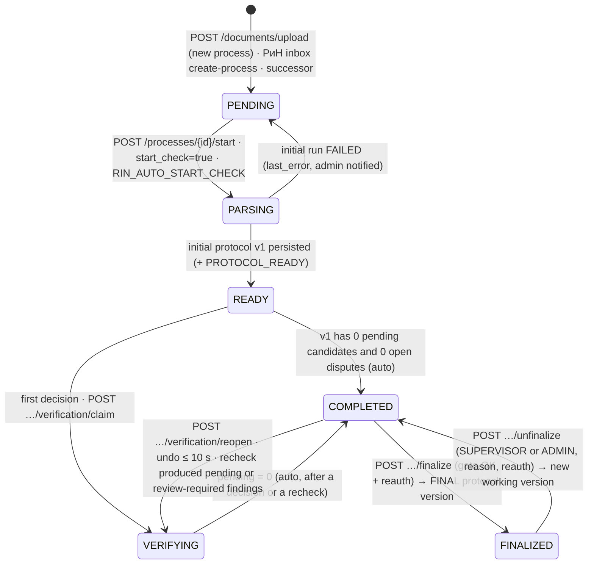

# B90 — Cross-block Consistency and the Canonical Model («Инспектор ИИ»)

Status: PLANNING / ANALYSIS (no application code). Requirement prefix: **CON-NN**. Conflict prefix: **C-NN**. User-decision prefix: **U-NN**.
Role: consistency integrator across the eleven block analyses B00–B10.

Inputs read for this document:
- `docs/spec/01_TZ_text.txt` (full ТЗ, all 14 sections), `02_matrix_all_sheets.txt` (sheets СХЕМА GOLD, МЕТРИКИ, ПРИМЕРЫ РАЗМЕТКИ, МАТРИЦА header).
- `00_architecture.md` in full. For `01`…`10`: executive summaries, scope and status sections, the complete «Proposed design» sections (data model, state machines, REST, RabbitMQ, libraries), «Interfaces», «ТЗ contradictions», «Decisions» and «Work breakdown» sections. `_block_summaries.json` for the decision lists.

**Authority.** This document is the tie-breaker for everything shared between blocks: status names and transitions, table ownership and field names, endpoint paths and verbs, queue and routing-key names, IDs and versions, roles, and library choices. Where a block report disagrees with this document, this document wins, and §4 lists the edit each block must make. The canonical model changes only through an ADR reviewed by AG-00 and the affected owners, under the same governance as `packages/contracts`. Items marked **U-NN** are still open for the user; their recommended default is what the canonical model assumes until the user answers.

---

## 0. Executive summary: the rulings

| # | Topic | Canonical ruling | Conflict resolved (details in §3.1) |
|---|---|---|---|
| 1 | Block and agent numbering | Block IDs are the report file numbers (B00…B10). Implementation agent **AG-NN owns block BNN** (11 agents, AG-00…AG-10) | B00 numbered blocks by ТЗ module (its "B03" is Verification); B01, B04 and B06 mixed both schemes (C-01) |
| 2 | Process status during дозагрузка | Status **does not change**. The incremental run is a sub-state `recheck_state ∈ {IDLE, RUNNING, FAILED}`. `PARSING` is used only for the initial run | B01 moved READY/VERIFYING/COMPLETED → PARSING; B00, B05 and B10 did not (C-02) |
| 3 | Finalization gate | «Завершить» only from `COMPLETED`. `READY` with 0 pending candidates moves to `COMPLETED` automatically | B00 allowed READY → FINALIZED (C-03) |
| 4 | Protocol version rows | `protocols.status ∈ {IN_VERIFICATION, VERIFICATION_COMPLETED, PROTOCOL_FINALIZED, SUPERSEDED}`. Finalization **creates a new FINAL version**. Un-finalization supersedes it and opens a new working version in `VERIFICATION_COMPLETED` | Four different enums and two finalization models (C-04, C-05, C-06) |
| 5 | Findings storage | `checks` are **living rows per process**, `UNIQUE(process_id, finding_id)`. History lives in frozen protocol snapshots (`content_json`) and append-only `verification_decisions` | B00 copied checks per protocol version; B04 and B05 did not (C-07) |
| 6 | Status axes | `completeness_status` is system-owned and never changed by an inspector decision. «Требует уточнения» changes only `inspector_status` | B05 let decisions rewrite completeness (C-08) |
| 7 | SUSPICION | Lives only in `suspicions`. **B07 is the only producer.** Matrix INTERNAL_CONSISTENCY sub-checks (M-002.b, M-003.c, …) become Logical_Rules | B04 allowed SUSPICION in `checks`; B03 and B07 both produced the ALT79B explication-sum suspicion (C-10, C-53) |
| 8 | Who writes the DB | **Node writes every table except the B02 docproc machine tables** (`document_pages`, `page_zones`, `page_tables`, `extraction_runs`, `extracted_values`, `param_extraction_status`). Compare, hypothesis and training results travel as claim-check artifacts; Node persists them in one transaction | B02, B04, B06 and B07 wrote from Python; B00 and B10 forbade it (C-35) |
| 9 | Revision selection, completeness, scenario | Computed in **Node by B01** (pure TS functions + property tests). Python engines consume them through the run manifest and never re-resolve | B00 put linkage in `inspector_compare`; B04 had its own RevisionResolver and ScenarioDetector (C-57) |
| 10 | Comparison engine | Python `inspector_compare` (B04) on a shared change-detection library `inspector_changes`. Node assembles, versions and finalizes protocols. Node never computes a finding | Agreed in principle by B00/B04; placement details reconciled (C-57, C-59) |
| 11 | Reference data versioning | One published **reference snapshot** identified by `matrix_version = "1.1.N"`: Params (+ rule DSL), Normative_Base, Logical_Rules, dictionaries, Change_Matrix_Map, completeness templates, extraction profiles. Draft → publish; pinned per process | B00 had a separate `rules_version`; B08 published on every save with an integer version (C-19, C-45) |
| 12 | Rule representation | One column `params.comparison_rule JSONB` (B03 DSL + `candidate_policy`). B08 "templates" are a UI view over it. One expression language: a JSONLogic subset with a three-valued Python evaluator | Four representations (B00 VARCHAR, B03 DSL, B04 Param_Rules, B08 trigger_rule) and two languages (C-37, C-55) |
| 13 | Pilot routing | Room-level and configuration changes go to **matrix codes** through `change_matrix_map` (M-003, M-011, M-044, M-054, M-077…M-079). Only genuinely out-of-matrix groups (IZM12, LOS3A) become SUSPICION | B07 routed ALT79B/DOO25/SOSH25/POL16/vent to Module 5; B03/B04 to the matrix (C-52) |
| 14 | Identifiers | `objects.id` and `files.id` = external `VARCHAR(64)` ids echoed from the registry and GOLD. `processes`, `protocols`, `users` = UUIDv7. `checks.id` BIGSERIAL + stable `finding_id`. `suspicions.id` BIGSERIAL | UUID vs external vs bigint across B00/B01/B02/B05/B09 (C-31) |
| 15 | §10 tables | 16 ТЗ tables, **exactly one owner each**: Params B03; Checks, Protocols, Evidence_Fragments B04; Objects, Files B01; Rejection_Log, ML_Retraining_Log, Dataset_Items, Model_Versions B06; Dispute_Log B05; Suspicions, Logical_Rules B07; Normative_Base B08; Audit_Log, Monitoring_Metrics B09 | Double claims on Rejection/Dispute logs, Protocols, Params/Normative/Logical rules, Notifications, Processes, Outbox (C-30) |
| 16 | REST | One catalogue (§3.4). ТЗ paths exact. Findings nested under processes. ML under `/ml/`. RFC 9457 errors from B10's catalog | Dozens of path/verb collisions (C-71…C-86) |
| 17 | RabbitMQ | Exchanges `inspector.jobs`, `inspector.events`, `inspector.retry`, `inspector.dlx`, `integration.rin`, `platform.audit`. Job keys `job.<type>.requested`. One envelope | Five naming families (`inspector.*`, `ii.*`, `insp.*`, `iai.*`, `comparison.events`, …) (C-87…C-93) |
| 18 | Roles | `INSPECTOR, SUPERVISOR, ADMIN, ML_ENGINEER, DATA_CURATOR, MODEL_APPROVER` + service `INTEGRATION_CLIENT`. ADMIN never decides findings. Four-eyes for curation and model approval | Five different role lists (C-25) |
| 19 | AI rejection validator | Deterministic rule table evaluated **inside the decision transaction** (Node), using data stored on the check. Open disputes block finalization until the inspector resolves them explicitly (one click «Оставить на уточнении» counts) | B05 pre-commit vs B06 post-commit service call; B06 "disputes never block" (C-20, C-21) |
| 20 | Signatures | One `RequestSigner` (`soft-gost`, B09) for РиН requests, protocol seals, audit seals and model-approval records. Step-up re-auth for finalize, unfinalize and approve | Ed25519 (B05, B06), CMS (B00), soft-gost (B09) (C-105) |
| 21 | Storage, conversion, viewing | `StorageAdapter` with `fs` default and `IIENC1` envelope encryption (B09 format), `s3` optional. Gotenberg for every PDF conversion. OpenSeadragon + server tiles for the viewer | MinIO SSE vs app encryption; Playwright/WeasyPrint/LibreOffice-in-ML-image; pdf.js vs tiles (C-63…C-65, C-102) |
| 22 | Libraries | NestJS 11 on the Fastify 5 adapter (U-04), Drizzle, aio-pika, Python 3.12, AntD 6, RapidOCR PP-OCRv5 + Tesseract `rus`, `multilingual-e5-small` | §3.11 (C-94…C-108) |
| 23 | Duplicated capabilities | One owner each: title block B01; typed tables incl. explications and change logs B02; aligners B04; taxonomy data B03; tiles/crops B02; viewer B08; protocol renderer B04; notifications B09; evaluation harness B06; pilot and synthetic data B10 | Up to five blocks planned the same component (C-58…C-68) |
| 24 | Build order | CP0 contract freeze (day 0–1.5) → wave 1 → **CP1 thin slice (day 4)** on M-002/M-003/M-054 with ALT79B, POL17, OKT103 → wave 2 → CP2 feature-complete (day 8) → wave 3 → CP3 release candidate (day 10) | Three incompatible agent plans (§3.14) |
| 25 | Pilot facts | The red expert markup is **vector content appended at the end of the page content stream**; the Ink annotations are **white redaction strokes** over title blocks, and the text under them is still in the text layer. Clean copies are produced by truncating the overlay | The task brief, B00 and B01 said "Ink annotations"; B02 and B06 verified otherwise (C-69) |

The numbers in this document are the result of reading all eleven reports. About 110 distinct inconsistencies were found; §3.1 lists them with rulings, §4 turns them into a per-block edit list.

---

## 1. Scope

### 1.1 ТЗ clauses this document governs across blocks

| Clause | Quote / essence | Why it is cross-block |
|---|---|---|
| §1.3 | «REST over HTTPS (JSON). Все запросы и ответы … с обязательной валидацией схемы OpenAPI 3.0» | One OpenAPI document, one error envelope, one naming convention |
| §1.4 | «возвращает идентификатор процесса (process_id) … Статус обработки отслеживается через эндпоинт мониторинга» | One status endpoint shape consumed by B01, B04, B05, B08, B09, B10 |
| §1.5 | «клиентской частью на React и серверной частью на Node.js. ML-модули … Python (версии 3.11 и выше) … REST API и асинхронную очередь сообщений (RabbitMQ)» | Stack, writer rule, messaging topology |
| §7 | 12 modules with priorities | Module → block → agent map (§1.2) |
| §8.1 | Params table (21 fields) | One Params definition shared by B02, B03, B04, B08 |
| §9.1 | «Выбор актуальной редакции», «Статусы загрузки документов», «Статусы процесса проверки», error table, Redis cache «по хешу файла», bbox «после учёта CropBox, MediaBox и Rotate» | Status enums, gating, cache keys, coordinate contract |
| §9.2 | scenarios; «Версии Матрицы, набора данных и модели фиксируются в каждом запуске и в протоколе»; «Статусы параметров в протоколе»; «Протокол сохраняется … с присвоением версии»; «Инкрементальное обновление … Предыдущая версия протокола сохраняется в истории» | Status axes, versioning, incremental semantics |
| §9.3 | «Статусы верификации» (PENDING … PROTOCOL_FINALIZED), «Алгоритм верификации» п.1–5, «Отмена финализации» | Process ↔ protocol status mapping, locks |
| §9.4 | versioned GOLD, «ответственным лицом», rollback, lineage | ML statuses, roles |
| §9.5 | SUSPICION JSON, dedup, «не используется как положительная учебная метка» | Suspicion storage and producer |
| §9.6 | `POST /api/v1/documents/upload`, `POST /api/v1/inspection/{process_id}`, PENDING_SYNC, 1/5/15 min retries, prescription statuses, auto-pull after finalization | Sync enum, endpoint ownership |
| §10 | 16 tables and key fields | Single-owner table list |
| §11 #9, #10 | incremental ≤ 1 min; API p95 ≤ 200 ms | Incremental algorithm; read-model design |
| §12 #2, #4, #10 | roles; audit of every action; УКЭП for РиН | Role list, audit writer, signer |
| §13 #1 | JSON log fields `timestamp, level, service, message, request_id, user_id` | One log schema |
| §14.2 | «Каждый результат содержит dataset_version, matrix_version, model_version и input_manifest_hash» | Version and hash semantics |
| 03 (registry rules) | mandatory registry; «Перезапись файла под тем же file_id запрещена. Повторная загрузка создаёт новую запись и новую версию протокола» | ID semantics, re-upload semantics |
| Приложение 1, СХЕМА GOLD | field list (`evidence_group_id … split`) | One field vocabulary for protocol JSON, GOLD export, dataset items and the evaluation harness |

### 1.2 Block, module and agent map (canonical numbering)

| Block | Report | Scope | ТЗ modules (priority) | Agent | Aliases found in the reports (do not use) |
|---|---|---|---|---|---|
| B00 | `00_architecture.md` | Architecture, contracts, API core, orchestrator, process state machine, infra | cross-cutting | **AG-00** Platform & Contracts | — |
| B01 | `01_ingestion_registry_revisions.md` | Upload, registry, identification (title block), revisions, linkage, completeness, scenario, manifest | M1 part A (High) | **AG-01** Ingestion & Registry | B00 "B01 Upload/parsing"; B04 "B01 Upload/parsing/OCR/CV" |
| B02 | `02_extraction_ocr_nlp_cv.md` | OCR, text layer, tables, NLP extraction, CV, coordinates, render service | M1 part B (High) | **AG-02** Extraction | B06 uses "B02" for Comparison |
| B03 | `03_matrix_132_domain.md` | 132 params, rule DSL, dictionaries, normative seeds, Logical_Rules seed, ИД checklist, object facts | core of M1/M2/M5/M8 | **AG-03** Matrix & Domain | B00 uses "B03" for Verification |
| B04 | `04_comparison_protocol.md` | Comparison engine, evidence groups, protocol assembly, versions, exports | M2 (High), export side of M7 | **AG-04** Comparison & Protocol | B00 "B02 Comparison" |
| B05 | `05_verification_inspector.md` | Decisions, AI validator, disputes, split, revision chooser, finalize/unfinalize, usability | M3 (High) | **AG-05** Verification | B00/B01/B04/B06 "B03 Verification" |
| B06 | `06_feedback_retraining_weekly_report.md` | GOLD, curation, datasets, training, gate, model registry, weekly report, `inspector-eval` | M4 (High), M10 (Medium), §14 | **AG-06** ML Feedback & Evaluation | B00 "B04 + B10"; B04 "B04-retraining" |
| B07 | `07_free_hypothesis_search.md` | Hypothesis detectors, suspicions, Logical_Rules engine | M5 (High) | **AG-07** Hypotheses | B00/B04 "B05"; B03 "B05's AST" |
| B08 | `08_frontend_dashboard_normative_admin.md` | Web shell, dashboard, viewer, Module 8 admin UI + API | M7, M8 (Medium) | **AG-08** Web & Admin | B00 "B07/B08" |
| B09 | `09_platform_integration_audit_monitoring_security.md` | Auth/RBAC, audit, РиН, monitoring, security, notifications, performance | M6 (Low), M9, M11 (Medium), §11–§13 | **AG-09** Platform Services | B00 "B06/B09/B11"; B04 "B06 РиН, B09 audit, B11 monitoring" |
| B10 | `10_error_handling_negative_scenarios.md` | Error catalog, negative scenarios, QA suites, pilot and synthetic data | M12 (High) | **AG-10** Negative Scenarios, QA & Data | B00 "B12", "AG-09" |

B00's agent list (AG-00…AG-09) is replaced by this 11-agent list. B00's "AG-09 Negative scenarios, QA & Data" is now AG-10; B00's AG-06 (РиН) and AG-08 (Audit/Monitoring/Security) merge into AG-09.

---

## 2. Requirements checklist (CON)

Legend: priority for winning **MUST / SHOULD / NICE**; MVP decision **FULL / SIMPLIFIED / MOCKED / OUT_OF_SCOPE**. These are consistency requirements: each must hold across all blocks at once.

| ID | ТЗ ref | Requirement (atomic) | Prio | MVP | Justification |
|---|---|---|---|---|---|
| CON-01 | §1.3, §9 | Every enum has one source (`packages/contracts/enums.yaml`, §3.2.1), generated into SQL CHECKs, TS, Python and OpenAPI | MUST | FULL | 11 agents otherwise drift (they already did) |
| CON-02 | §9.1–§9.3, §9.6 | ТЗ status codes are used verbatim in DB, API and exports; the UI shows Russian labels with the code in a tooltip | MUST | FULL | The jury checks the codes |
| CON-03 | §9.1 | The process status machine and the «Возможность дозагрузки/верификации» matrix are enforced identically by the API, DB triggers and the UI `capabilities` object | MUST | FULL | One transition table in `packages/shared` |
| CON-04 | §9.1 vs §9.3 | Process `COMPLETED`/`FINALIZED` map 1:1 to protocol `VERIFICATION_COMPLETED`/`PROTOCOL_FINALIZED`; both names are exposed | MUST | FULL | §3.2.3 |
| CON-05 | §10 | All 16 ТЗ tables exist with ТЗ names (snake_case) and ТЗ key fields, and each has exactly one owning block | MUST | FULL | §3.3.3 |
| CON-06 | §8.1 | `params` carries exactly the 21 §8.1 fields and types; extensions are additive | MUST | FULL | §3.3.3 |
| CON-07 | §1.5 | One writer rule: Node writes all tables except the B02 docproc machine tables; enforced by DB roles | MUST | FULL | §3.3.1 |
| CON-08 | §1.3 | One bundled OpenAPI 3.0.3 document; every path appears once, tagged with its owner (`x-owner`) | MUST | FULL | §3.4 |
| CON-09 | §9.6 | ТЗ-named endpoints exist exactly: `POST /api/v1/documents/upload`, `POST /api/v1/inspection/{process_id}` | MUST | FULL | Literal compliance |
| CON-10 | §1.5 | One AsyncAPI document; one envelope; the exchange/queue/routing-key list of §3.5 | MUST | FULL | §3.5 |
| CON-11 | §7 #12 | One error envelope (RFC 9457 + `code`) and one catalog (`errors.yaml`, B10) for all blocks | MUST | FULL | B10 §3.2 |
| CON-12 | §9.2 п.1, §9.3 п.4, §14.2 | `matrix_version`, `dataset_version`, `model_version`, `input_manifest_hash` are identical in the run, the protocol, the GOLD export and the РиН payload | MUST | FULL | §3.8 |
| CON-13 | §9.2 п.4, §14.1 | `finding_id` and `evidence_group_id` are stable across protocol versions of a process | MUST | FULL | Diff, carry-over and GOLD depend on it |
| CON-14 | §9.2 | Every protocol version is preserved; exactly one current version per process | MUST | FULL | §3.2.3 |
| CON-15 | §9.2, §9.3 п.3, §11 #9 | One incremental re-check algorithm used by B01, B04, B05, B07 and B09 | MUST | FULL | §3.9 |
| CON-16 | §9.5 | SUSPICION never appears in `checks`, counts, GOLD or the РиН payload | MUST | FULL | DB CHECKs + tests |
| CON-17 | §9.2 п.3 | CONFIRMED_VIOLATION is set only by an inspector | MUST | FULL | DB CHECK `decided_by='INSPECTOR'` |
| CON-18 | §9.3 п.4 | РиН receives only confirmed records + protocol/matrix/model versions + the input registry | MUST | FULL | One payload builder (B09) |
| CON-19 | СХЕМА GOLD | GOLD field names are identical in the protocol JSON, the GOLD export, `dataset_items.evidence_card` and `inspector-eval` | MUST | FULL | `gold_record.schema.json` (B06) is the contract |
| CON-20 | §9.1 п.4 | One coordinate contract: visible area after CropBox/MediaBox/Rotate, top-left origin, y down, `[0;1]`, geometry = list of shapes | MUST | FULL | §3.3.6 |
| CON-21 | §12.2 | One server-side permission matrix, mirrored read-only by the UI | MUST | FULL | §3.10 |
| CON-22 | §12.4 | One audit writer (`auditService.record`) and one action catalogue | MUST | FULL | B09 §3.4 |
| CON-23 | §13.1 | All services log the same six mandatory JSON fields | MUST | FULL | B09 §3.6.1 |
| CON-24 | §9.1 п.5 | One Redis cache-key convention by file hash + pipeline version | MUST | FULL | §3.7 |
| CON-25 | §12.3 | One storage adapter and one encryption envelope format in Node and Python | MUST | SIMPLIFIED | Volume-level DB encryption documented |
| CON-26 | §9.6, §12.10 | One signer interface for all signatures | SHOULD | MOCKED | soft-gost test keys; CryptoPro documented |
| CON-27 | §9.2 п.5, §13.7 | One notification service and one type catalog | SHOULD | FULL | §3.13 |
| CON-28 | §7 #8, §9.2 п.1 | One reference snapshot (`matrix_version`) consumed by extraction, comparison and hypotheses | MUST | FULL | §3.8 |
| CON-29 | §9.5 | One rule-expression language for applicability and Logical_Rules | SHOULD | FULL | JSONLogic subset |
| CON-30 | §9.5 dedup, §14.3 | Each pilot change fact is owned by exactly one producer; nothing is counted twice | MUST | FULL | §3.12 |
| CON-31 | §14.3 | Production and evaluation run the same comparison engine | MUST | FULL | `inspector_compare` imported by the harness pipeline |
| CON-32 | win | One implementation per shared capability (title block, typed tables, change log, taxonomy, render/tiles, viewer, renderer, generators, evaluation) | SHOULD | FULL | §3.13 |
| CON-33 | win | Block and agent numbering normalized in all contracts, ADRs and task boards | MUST | FULL | §1.2 |
| CON-34 | §1.5 | One library stack per concern | MUST | FULL | §3.11 |
| CON-35 | win | CI fails on contract drift: enum parity, table ownership, writer grants, OpenAPI vs catalogue, AsyncAPI routing keys | MUST | FULL | §9.2 tests |
| CON-36 | §9.6 | One time-compression switch `DEMO_TIME_SCALE` for all retry/delay schedules | SHOULD | FULL | B10 §3.10 |
| CON-37 | win | One build order with checkpoints and owners | MUST | FULL | §3.14 |
| CON-38 | §9.1, §9.3 п.5 | Upload/decision gating returns the same codes everywhere: 409 `PROCESS_BUSY` during PARSING, 423 `PROTOCOL_FINALIZED` after finalization | MUST | FULL | B10 §3.6 |
| CON-39 | §9.2, §9.5 | A hypothesis-module failure never blocks the protocol (section (5) is marked «модуль гипотез недоступен») | SHOULD | FULL | B00, B07, B10 agree |
| CON-40 | §10 #10 | One rule selects the edition of a norm: the approval date of the reference revision, falling back to the run date | SHOULD | FULL | B03, B07 vs B08 (C-50) |
| CON-41 | §9.3 п.4 | One finalization gate (B05) drives both the finalize endpoint and `capabilities.can_finalize` | MUST | FULL | B04 also computed `can_finalize` |
| CON-42 | §14.2 «Запрет утечки» | Evaluation and self-test processes are flagged `purpose ∈ {EVALUATION, SELFTEST}` and excluded from GOLD, dashboards and weekly stats | SHOULD | FULL | B10 E-D9 |

**Totals: 42 requirements: FULL 40, SIMPLIFIED 1, MOCKED 1, OUT_OF_SCOPE 0.**

---
## 3. Canonical model

### 3.1 Conflict register

Every row is a disagreement between at least two block reports (or between a report and the verified facts). "Ruling" is canonical. "Edit" names the blocks that must change their design; §4 expands the edits per block.

#### 3.1.1 Organisation and facts

| ID | Topic | Positions found | Ruling | Edit |
|---|---|---|---|---|
| C-01 | Block numbering | B00 numbers blocks by ТЗ module (B01 Upload…B12 Errors) and agents AG-00…AG-09; B01, B04, B06, B07 mix module and file numbers (e.g. B06's "B02" = comparison; B04's "B03" = verification) | Block = report file number; AG-NN owns BNN (§1.2) | all (docs, ADRs, task boards) |
| C-69 | Pilot markup storage | Task brief, B00, B01: expert markup = Ink annotations. B02, B06: red markup = vector strokes appended at the tail of the page content stream (widths 4.0 evidence box, 3.0 callout, 2.5 leader); Ink = white strokes (1,1,1; width 9.75) redacting title-block cells, text still in the text layer | B02/B06 are correct (verified in the originals). Clean copies = truncate the overlay tail (B06 method); runtime guard = B02 width/visibility filter; text under opaque Ink is `occluded` and never used as evidence, never exported, never logged (PII) | B00, B01 facts; B10 data tooling |
| C-67 | Pilot/synthetic data toolchains | B01 W21, B03 MTX-T18, B04 T14, B06 T04/T05, B07 D9, B02 T13 (DS-A), B10 T13/T22 each plan a generator or pilot splitter | One toolchain owned by AG-10: `tools/pilot-convert` (split, clean copies, registries, page map to original page numbers, GOLD from ПРИМЕРЫ), `tools/synth` (documents + registries + GOLD + OCR/key-field truth), `tools/negfixtures`. Other blocks contribute specs, not generators | B01, B02, B03, B04, B06, B07 |
| C-68 | Evaluation harness | B00 `inspector_training.eval`, B02 `ocr_eval.py`, B06 `inspector_eval` | One library `inspector_eval` (B06) with OCR, key-field, linkage, localization, P/R/F1, FPR, CI; B02 builds OCR datasets and calls it | B00, B02 |

#### 3.1.2 Statuses and lifecycles

| ID | Topic | Positions found | Ruling | Edit |
|---|---|---|---|---|
| C-02 | Process status on upload into READY/VERIFYING/COMPLETED | B01: → PARSING (`status_before_parsing`), restored later. B00, B05, B10: status unchanged, sub-state (`active_run_id` / `recheck_state`) | Unchanged status + `recheck_state` (B05 name). Rationale: §9.1 forbids uploads and verification in PARSING, so B01's model blocks a second upload and all decisions during every re-parse, contradicting §9.3 п.3 «без сброса верификации» | B01, B08 (capabilities) |
| C-03 | Where finalization may start | B00: READY → FINALIZED if 0 pending. B05, B08: only COMPLETED → FINALIZED | Only from COMPLETED. READY auto → COMPLETED when the current protocol has 0 pending candidates and no open disputes | B00 |
| C-04 | Protocol version status enum | B00 {DRAFT, IN_VERIFICATION, VERIFICATION_COMPLETED, PROTOCOL_FINALIZED, SUPERSEDED}; B04 {GENERATING, READY, VERIFYING, VERIFICATION_COMPLETED, PROTOCOL_FINALIZED, SUPERSEDED}; B05 `kind` DRAFT/FINAL; B09 {DRAFT, FINALIZED, SUPERSEDED} | `{IN_VERIFICATION, VERIFICATION_COMPLETED, PROTOCOL_FINALIZED, SUPERSEDED}` (§3.2.3). No GENERATING: Node assembles a version inside one transaction | B00, B04, B05, B09 |
| C-05 | Finalization: new version or freeze in place | B04 (D7), B05, B08: new version. B00, B09: freeze the current row | New version `N+1`, `version_reason=FINALIZATION`, status PROTOCOL_FINALIZED; the working version becomes SUPERSEDED | B00, B09 |
| C-06 | Un-finalized final version | B00, B05: row stays PROTOCOL_FINALIZED with `revoked_*`/`unfinalized_*`. B09: row becomes SUPERSEDED | Row becomes **SUPERSEDED**, keeps `finalized_at`, gets `superseded_reason='UNFINALIZED'`; journal row in `protocol_unfinalizations`; a new working version `N+2` (`version_reason=UNFINALIZATION`) opens in VERIFICATION_COMPLETED. Invariant: exactly one non-SUPERSEDED version per process | B00, B05 |
| C-06a | `version_reason` vocabulary | B04 {INITIAL, INCREMENTAL_UPDATE, FULL_RERUN, VERIFICATION_SNAPSHOT, FINALIZATION, UNFINALIZATION}; B05 trigger {INITIAL, INCREMENTAL, FINALIZE, REFINALIZE}; B08 {INITIAL, INCREMENTAL_UPLOAD, FINALIZED, UNFINALIZED, RECHECK_MATRIX}; B09 {INITIAL, INCREMENTAL_UPDATE, REUPLOAD, FINALIZED, REOPENED_BASELINE, MANUAL_REGENERATE} | `{INITIAL, INCREMENTAL_UPDATE, RECHECK, FINALIZATION, UNFINALIZATION}` + `recheck_reason ∈ {REVISION_RESOLVED, FACT_OVERRIDE, COMPLETENESS_OVERRIDE, MATRIX_RECHECK, MANUAL}` + `trigger ∈ {UPLOAD, REUPLOAD, REGISTRY_UPDATE, RIN_PULL}` on INCREMENTAL_UPDATE | B04, B05, B08, B09 |
| C-07 | Checks per protocol version | B00: copy-on-version (`carried_from_check_id`). B04: unaffected findings "copied by reference". B05: `finding_id UNIQUE`, living rows with `lifecycle_state` | Living rows per process, `UNIQUE(process_id, finding_id)`, `first_protocol_version`/`last_protocol_version`; each protocol version stores a frozen `content_json`; diffs use snapshots | B00 |
| C-08 | Effect of inspector actions on `completeness_status` | B05: «Требует уточнения» → completeness CLARIFICATION_REQUIRED; reject `NOT_APPLICABLE_PARAM` → completeness NOT_APPLICABLE. B04, B00: two independent fields | Decisions **never** change `completeness_status`. Clarify → `inspector_status=CLARIFICATION_REQUIRED`, `finding_status=CANDIDATE`. `NOT_APPLICABLE_PARAM` is a normal NEGATIVE_VERIFIED rejection reason (ТЗ lists «параметр неприменим» as a reject reason). To make a parameter N/A for the object, the inspector overrides an object fact (C-42), which re-runs the group | B05 |
| C-09 | Origin of `finding_status` | B00, B04 SYSTEM/INSPECTOR; B05 MODEL/INSPECTOR; B06 `verification_source` | Column `decided_by ∈ {SYSTEM, INSPECTOR}` everywhere; GOLD export keeps the B06 name only as an alias | B05, B06 |
| C-10 | SUSPICION in `checks` | B04 allowed `finding_status=SUSPICION` in Checks; B00, B07 forbid | `checks.finding_status ∈ {CANDIDATE, NEGATIVE_VERIFIED, CONFIRMED_VIOLATION}` only; `suspicions.finding_status` CHECK = 'SUSPICION' | B04 |
| C-11 | Suspicion `inspector_status` | B00 {PENDING, PROMOTED, DISMISSED, CLARIFICATION_REQUIRED}; B05 {PENDING, CONVERTED, DISMISSED}; B07 {PENDING, CLARIFICATION_REQUIRED, DISMISSED, CONVERTED_TO_CANDIDATE, AUTO_CONVERTED, STALE, NOT_REVIEWED_AT_FINALIZATION} | `{PENDING, CLARIFICATION_REQUIRED, CONVERTED_TO_CANDIDATE, DISMISSED, STALE}` + `promoted_by ∈ {INSPECTOR, SYSTEM}`; «не рассмотрено» is a render label for PENDING/CLARIFICATION at finalization, not a status | B00, B05, B07, B08 |
| C-12 | `discovery_method` | B00, B03, B08 `ML_PATTERN`; B07 `ML_PATTERN_ANALYSIS` + `GRAPHIC_DIFF`; B04 prints `CHANGE_LOG` | `{LOGICAL_ANALYSIS, SEMANTIC_DISSONANCE, NORMATIVE_ANALYSIS, ML_PATTERN_ANALYSIS, GRAPHIC_DIFF}`; finer source in `detector` (e.g. `CHANGE_LOG`, `EXPLICATION_SUM`, `ROOM_ALIGNMENT`) | B00, B03, B04, B08 |
| C-13 | Sync status | B00 {NOT_SENT, PENDING_SYNC, SYNCING, SYNCED, SYNC_FAILED}; B05 PENDING_SYNC→SENT, SUPERSEDED_PENDING; B08 subset | B09: `{NOT_REQUIRED, QUEUED, SENDING, PENDING_SYNC, SYNCED, SYNC_FAILED, CANCELLED}` + `retries_exhausted_at`, `reopened` | B00, B05, B08 |
| C-14 | Dispute resolution status | B00 {OPEN, RESOLVED, ESCALATED}; B05 {OPEN, INSPECTOR_UPHELD, AI_UPHELD, KEPT_CLARIFICATION, ESCALATED, WITHDRAWN}; B06 {OPEN, RESOLVED_UPHELD, RESOLVED_CHANGED, RESOLVED_CLARIFICATION, ESCALATED} | B05's list (owner of `dispute_log`) | B00, B06 |
| C-15 | `rejection_log.retraining_status` | B00 {NEW, IN_DRAFT, CURATED, INCLUDED, USED_IN_TRAINING, EXCLUDED}; B05 {DRAFT, ON_HOLD, ELIGIBLE_FOR_CURATION, ACCEPTED, EXCLUDED, INCLUDED}; B06 {NEW, IN_DRAFT, DISPUTED, CURATOR_ACCEPTED, CURATOR_EXCLUDED, RELEASED, USED_IN_TRAINING, REVOKED} | B06's list (owner of `rejection_log`) | B00, B05 |
| C-16 | Dataset item status and `gold_label` | B00 item {DRAFT, CURATED, RELEASED, EXCLUDED}, label {CONFIRMED_VIOLATION, NEGATIVE_VERIFIED}; B06 item {DRAFT, PENDING_CURATION, INELIGIBLE, DISPUTED, SUSPENDED, ACCEPTED, EXCLUDED, RETURNED, RELEASED, REVOKE_PENDING}, label {POSITIVE, NEGATIVE} + `finding_status` | B06 (owner); CHECK `gold_label='POSITIVE' ⇔ finding_status='CONFIRMED_VIOLATION'` | B00 |
| C-17 | Model approval status | B00 {TRAINING, EVALUATED, PENDING_APPROVAL, APPROVED, REJECTED, DEPLOYED, ROLLED_BACK, RETIRED}; B06 {TRAINING, TRAINED, GATE_FAILED, PENDING_APPROVAL, APPROVED, REJECTED, DEPLOYED, ROLLED_BACK, RETIRED} | B06 + `FAILED` (training error) | B00 |
| C-18 | Dataset version status | B00 {DRAFT, RELEASED, DEPRECATED}; B06 {DRAFT, IN_REVIEW, RELEASED, DEPRECATED, REVOKED} | B06 | B00 |
| C-19 | Matrix version workflow and id | B00 {DRAFT, PUBLISHED, ARCHIVED}; B03 {DRAFT, PUBLISHED, RETIRED}, id `1.1-B03.1+<sha8>`, edits go to a draft; B04 id `1.1+<hash8>`; B08 publish on every save, `version int` | Draft → publish (B03/B00), `{DRAFT, PUBLISHED, RETIRED}`; id `"{edition}.{seq}"` (seed `1.1.0` from «Матрица_параметров_редакция1.1.xlsx»), hash in `snapshot_sha256`. B08 keeps one-click «Сохранить и опубликовать» (edit + publish in one call with a reason) | B00, B04, B08 |
| C-20 | Do open disputes block finalization | B05: yes (`OPEN_DISPUTE` blocker; «Оставить на уточнении» resolves). B06: never (the finding is already CLARIFICATION_REQUIRED) | Block (B05): §9.3 п.4 requires an **explicit** transfer to CLARIFICATION_REQUIRED; the AI-driven status is not the inspector's explicit act | B06 |
| C-21 | AI rejection validator placement | B05: deterministic rules inside the decision transaction (Node, < 20 ms). B06: synchronous call to `/internal/ml/ai-verdict` after commit, 800 ms timeout, `UNAVAILABLE` fallback. B00: `ml-api /v1/decisions/review` | In-transaction Node validator (B05) with the merged rule table (B05 R-* + B06 rules). The model-score rule uses `checks.model_score` stored at comparison time, so no network call. `ai_verdict ∈ {AGREE, UNCERTAIN, DISAGREE}` | B00, B06 |
| C-22 | `signature_status` enum | B00 {SIGNED_UKEP, SIGNED_UNEP, PAPER_SCAN, MISSING, NOT_REQUIRED, UNKNOWN}; B01 {UKEP, UNEP, WET_SCAN, ABSENT, UNKNOWN} | B01 (owner) + `NOT_REQUIRED` | B00 |
| C-23 | Object profile facts and phase | B01 columns `object_kind, work_type, funding, has_demolition, construction_phase ∈ {NOT_STARTED, IN_PROGRESS, COMPLETED}`, `profile.floors_above, has_gas…`; B03 facts catalog `purpose, is_linear, works_type, phase ∈ {DESIGN, CONSTRUCTION, COMPLETED}, floors_above_ground, has_gas_supply…`; B04 `object_type, floors_above, has_gas, is_demolition` | B03 facts catalog is canonical (table `object_facts`, fact provenance and `set_by`). `phase ∈ {DESIGN, CONSTRUCTION, COMPLETED}` | B01, B04 |
| C-24 | Completeness item status | B01 {PRESENT, MISSING_EVIDENCE, DECLARED_NOT_RECEIVED, NOT_APPLICABLE, CLARIFICATION_REQUIRED, NOT_COMPARABLE}; B03 {FOUND, FOUND_LOW_QUALITY, MISSING, NOT_APPLICABLE, APPLICABILITY_UNKNOWN} | B01 (owner of the engine). FOUND_LOW_QUALITY → PRESENT + quality warning; APPLICABILITY_UNKNOWN resolved by `default_applicable` (B03 rule) before the status is set | B03 |
| C-25 | Roles | B00 {INSPECTOR, SUPERVISOR, ADMIN, ML_ENGINEER, DATA_CURATOR, MODEL_APPROVER, INTEGRATION_CLIENT, AUDITOR}; B01 {INSPECTOR, SUPERVISOR, ADMIN, ML_ENGINEER, INTEGRATION}; B06 CURATOR, ML_APPROVER; B08 5 roles + per-user `model.approve`; B09 lowercase 6 roles, approver = permission granted to supervisor by default | `INSPECTOR, SUPERVISOR, ADMIN, ML_ENGINEER, DATA_CURATOR, MODEL_APPROVER` + service `INTEGRATION_CLIENT` (UPPER_SNAKE like every other enum). AUDITOR dropped (NICE). Four-eyes: curator ≠ deciding inspector; approver ≠ training requester | B00, B01, B06, B08, B09 |
| C-26 | Reject reason codes | LINKING_ERROR (B00, B05, B08) vs BINDING_ERROR (B06); NOT_APPLICABLE (B06, B08) vs NOT_APPLICABLE_PARAM (B05) vs PARAM_NOT_APPLICABLE (B00); table `reason_codes` (B00) vs `decision_codes` (B05) | B05 owns: table `decision_codes` (kinds REJECT, CONFIRM, CLARIFY, REVISION_BASIS, SUSPICION_DISMISS, UNFINALIZE); REJECT codes = WRONG_REVISION, APPROVED_CHANGE, OCR_ERROR, EXTRACTION_ERROR, CV_ERROR, LINKING_ERROR, WITHIN_TOLERANCE, EQUIVALENT_SOLUTION, METHODOLOGY_DIFFERENCE, NOT_APPLICABLE_PARAM, DUPLICATE, OTHER | B00, B06, B08 |
| C-27 | "Тип нарушения" taxonomy | B03 `violation_type` (16 buckets per sub-check); B04 `discrepancy_type` (18 per atomic finding); B06 its own 13-value `discrepancy_type` | Two fields: `violation_type` (B03) is the §14.3 metric dimension and a B06 gate category; `discrepancy_type` (B04 list) is the per-finding label used for matching. B06's list is dropped (mapping in §4 B06) | B06 |
| C-28 | Un-finalization reasons and text length | B05 {DECISION_ERROR, NEW_DOCUMENTS, RIN_REJECTED, SUPERVISOR_REVIEW, OTHER}, text ≥ 20; B09 {NEW_DOCUMENTS, INSPECTOR_ERROR, REVISION_CONFLICT_RESOLVED, RIN_REQUEST, APPEAL_OR_COURT, OTHER}, text ≥ 10 | Union: NEW_DOCUMENTS, DECISION_ERROR, REVISION_CONFLICT_RESOLVED, RIN_REQUEST, SUPERVISOR_REVIEW, APPEAL_OR_COURT, OTHER. Every mandatory reason text ≥ 10 chars; `OTHER` codes ≥ 20 chars | B05, B09 |
| C-29 | Error envelope and codes | four body shapes; ~12 conflicting codes | B10 §3.2/§3.6 adopted as is (RFC 9457 + `code`) | B00, B01, B05, B07, B08, B09 |
| C-43 | Random review of system negatives | B00 `checks.inspector_reviewed`; B04 `checks.sampled_for_review` (10 %); B06 table `audit_sample` | `checks.sampled_for_review` (B04 sets, 10 %, min 3 per protocol); the review is a normal decision on the row; B06 reads it. `audit_sample` table dropped | B00, B06 |
| C-51 | Linked/duplicate params in counts | B03 D-07 and B08: report under both codes, count once. B04: separate groups, counted separately | Report under both codes, count the **evidence fingerprint once** in headline numbers (`linked_finding_id`). B10 invariant I11 counts distinct fingerprints. Pending U-07 | B04, B10 |
| C-56 | Candidate policy below a numeric trigger | B03: strict for numeric triggers, "any change" for qualitative ones. B04: per-param `candidate_policy`, default DEVIATION, trigger drives risk | `candidate_policy` lives in the DSL and is **derived by default** from the trigger text: numeric trigger → `TRIGGER`, qualitative → `DEVIATION`; admin-overridable. Pilot findings are caught by room-level sub-checks (M-003.b). Pending U-05 | B03, B04 |

#### 3.1.3 Data model and ownership

| ID | Topic | Positions found | Ruling | Edit |
|---|---|---|---|---|
| C-30 | Double table ownership | Rejection_Log and Dispute_Log: B05 and B06; Protocols: B04, B05, B09; Params/Normative_Base/Logical_Rules: B03, B07, B08; Notifications: B01, B08, B09; Processes: B00, B01; Outbox: B01, B05, B09; `document_pages`: B01, B02 | One owner each (§3.3.3/§3.3.4). Owner = schema, migrations, semantics and invariants; other blocks may be listed as writers of specific columns | all |
| C-31 | ID types | `objects.id`: UUID (B00, B02, B09) vs external VARCHAR (B01, B05, B06). `files.id`: UUID (B00, B02, B09) vs registry `file_id` (B01) vs bigint (B05). `users.id`: UUID (B09) vs bigint (B05) | §3.3.2. External `object_id`/`file_id` are kept verbatim because GOLD scoring requires «точное совпадение file_id и страницы» | B00, B02, B05, B09 |
| C-32 | Page table and numbering | `document_pages` (B00, B02) vs `File_Pages` (B01); `page_index` vs `page_no`; 0- or 1-based unspecified in B00 | `document_pages(file_id, page_no)`, `page_no` 1-based PDF page of the **original** file (pilot «стр.N»); `sheet_no` TEXT separately | B00, B01, B04 |
| C-33 | Geometry field shape | B00 `{"type":"bbox","coords":[…]}`; B02 `{token_boxes, evidence_boxes, polygons}`; B04 `bbox_polygon` + `polygon_norm`; B05 `bbox_norm`; B06 list of shapes | `bbox_polygon_norm` = JSON array of shapes; shape = `[x0,y0,x1,y1]` or `[[x,y],…]`; 4 decimals. Token boxes stay in `extracted_values.geometry` only. GOLD export writes it as `source_*_bbox_polygon` | B00, B02, B04, B05 |
| C-34 | Same table, different names | upload_batches/Upload_Packages; file_registries/Registries; comparison_runs/runs/hypothesis_runs; protocol_artifacts/export_jobs/protocol_exports; param_normative_links/param_normative; ordinal_scales/enum_scales; revision_overrides/revision_resolutions; rin_sync_jobs/rin_deliveries; rin_inbound_documents/rin_inbox; prescriptions/rin_prescriptions; usability_events/ui_events; hidden_test_manifests/test_sets; integrity_checks/integrity_check_runs; Outbox/outbox_events; Processing_Jobs/jobs | Canonical names in §3.3.5 | all |
| C-35 | Python DB writes | B02 (extraction tables + Checks skeleton), B04 (Checks/Evidence via SQLAlchemy), B06 (ML registry rows), B07 (Suspicions) write from Python; B00, B10: only Node writes | W1/W2 rule (§3.3.1): Python writes only the B02 docproc machine tables | B02, B04, B06, B07 |
| C-36 | "Выход: таблица Checks" from parsing | B02 upserts a Checks skeleton; B00, B04: Checks = comparison results | No skeleton. Parsing output = `extracted_values`; Checks are written once, by Node from the comparison result | B02 |
| C-37 | Rule representation | B00 `comparison_rule VARCHAR(40)` + tolerance columns; B03 `comparison_rule JSONB` DSL; B04 `Param_Rules`/`comparison_spec`; B08 `trigger_rule` templates | `params.comparison_rule JSONB` (B03 DSL + `candidate_policy`, `value_shape` from B04). B08 derives `template` for the editor from `rule_type`; the editor writes thresholds only through `$min_value/$max_value` or DSL fields | B00, B04, B08 |
| C-38 | Alias code column | B00 `alt_code`; B03, B04, B08 `alias_code` | `alias_code` | B00 |
| C-39 | `audit_log.object_id` meaning | B00, B09: affected entity id (+ `construction_object_id`); B08: construction object (+ `entity_type/id`) | B09 (owner): `object_type` + `object_id` = entity; `construction_object_id` for filtering | B08 |
| C-40 | Audit tamper evidence | B00 per-row hash chain in a trigger; B09 batch seals every 60 s, GOST-signed | B09 | B00 |
| C-41 | Storage of inspector revision choices | B00 `revision_overrides`; B01 new registry version (source INSPECTOR_DECISION) + `Revision_Links`; B05 `revision_resolutions` | Table `revision_resolutions` (B05 columns, **owned by B01**, whose resolver consumes it as decision input); `revision_links.basis='INSPECTOR'`. No synthetic registry version | B00, B01 |
| C-42 | Applicability overrides | B00 `applicability_overrides` + `POST /processes/{id}/applicability`; B01 N/A mark on completeness items; B03 object-fact override; B05 reject code NOT_APPLICABLE_PARAM | Three mechanisms with separate meanings: (1) object fact override `PUT /objects/{id}/facts/{key}` → re-run of affected groups (B03); (2) completeness item N/A with basis (B01); (3) rejection reason NOT_APPLICABLE_PARAM on one finding (B05). `applicability_overrides` dropped | B00 |
| C-44 | `input_manifest_hash` field set | B00: `{file_id, sha256, doc_stage, discipline, document_code, revision, approval_status}` + registry sha256; B01: full manifest incl. selections and algorithm versions; B04: `{file_id, sha256, object_id, doc_stage, discipline, document_code, revision, approval_status, approval_date, predecessor_id, successor_id, sheet_page_range, used_as_reference}` | B04's field list, sorted by `file_id`, JCS (RFC 8785), SHA-256, lowercase hex. Algorithm/engine versions are recorded separately (§3.8). One TS implementation in `packages/shared` + Python twin + golden vectors | B00, B01 |
| C-45 | Reference-data versions | B00 `matrix_version` + `rules_version`; B04 `rules_version` for weights; B07 `rules_set_version`, `normative_set_version`, `taxonomy_version`; B08 one `matrix_version` for everything | One `matrix_version` snapshot for all admin-managed reference data (§3.8). Engine/config versions go to `engine_versions` JSON on runs and protocols | B00, B04, B07 |
| C-46 | What `model_version` identifies | B00: bundle with OCR engine + embedder; B04: OCR + embeddings + CV thresholds; B06: bundle C1–C6 (scorer, thresholds, tolerances, anchors, OCR lexicon, change patterns) | B06 bundle C1–C6. Extraction pipeline components (OCR engine/model, embedder, CV) are versioned by `pipeline_version` (B02) and listed read-only in `bundle_manifest` | B00, B04 |
| C-47 | `dataset_version` format | B04 `DS-0.1-pilot9`; B05 `ds-0.3`; B06 `gold-1.0.0` | `gold-X.Y.Z`; initial `gold-0.1.0-pilot` (pilot 9 groups, flagged not-for-training); a protocol records the `dataset_version` of the model it used | B04, B05 |
| C-48 | `finding_id` format and uniqueness | B00 `ALT79B-M041-01`; B04 `{object}-{code}-{axis}-{slug}` (unique per protocol version); B05 globally UNIQUE | B04 format; `UNIQUE(process_id, finding_id)`; split children `{parent}.{n}`; REST addresses findings under their process | B00, B05 |
| C-49 | Fingerprint names | B00 `finding_key`; B04 `input_fingerprint` (finding) and `sources_fingerprint` (group); B05 `evidence_fingerprint` | `evidence_fingerprint` (finding level, B05 formula) + `sources_fingerprint` (group level, B04) | B00, B04 |
| C-50 | Which date selects a norm edition | B03, B07: approval date of the checked revision (fallback: check date). B08: run date by default, configurable | B03/B07 rule; B08 setting default changes | B08 |

#### 3.1.4 Processing placement and duplicated components

| ID | Topic | Positions found | Ruling | Edit |
|---|---|---|---|---|
| C-52 | Pilot change facts: matrix or hypotheses | B03/B04: ALT79B, DOO25, SOSH25 → M-003; POL16 → M-011 (B03) or M-003 (B04); vent → M-077/078/079. B07: ALT79B, POL16, DOO25, SOSH25, vent → Module 5 suspicions | Matrix codes (§3.12). The organizers' GOLD can only name matrix codes or *their* free-search rules; our internal `HR-*` rule versions cannot match their labels, so mapping to matrix codes maximises §14.3 matching. B07's router concept stays, with `change_matrix_map` seeded accordingly | B07 |
| C-53 | INTERNAL_CONSISTENCY / explication-sum suspicion | B03: M-003.c INTERNAL_CONSISTENCY → SUSPICION from the comparison engine; B07: HR-LOG-005 (same ALT79B Σ 2795,04 vs 2797,27) | B07 only (Logical_Rule HR-LOG-005, `overlaps_matrix_codes=[M-003]`). B03 removes `on_trigger: SUSPICION`; low-confidence SEMANTIC_DIFF sub-checks yield NOT_COMPARABLE (basis LOW_CONFIDENCE_SEMANTIC) | B03, B04 |
| C-54 | Change facts from hypotheses to comparison | B07 publishes `hypotheses.change_facts` to Module 2, but both run in parallel on the same run | Dropped. Both engines import the shared `inspector_changes` library and read `change_matrix_map` from the pinned snapshot: compare evaluates mapped change types, hypotheses emit only unmapped ones | B07 |
| C-55 | Expression language | JSONLogic (B01 applicability, B03 applicability, B08 builder) vs B07 JSON-AST for Logical_Rules; B03 proposed both | One JSONLogic subset ("IAI-Logic v1": `== != < <= > >= and or ! in var missing some all none count sum`) with Kleene three-valued semantics in the Python evaluator; `json-logic-js` for UI preview only. B07's 12 and B03's 40 seed rules are written in it | B03, B07 |
| C-57 | Revision resolution, completeness, scenario | B00: Python `inspector_compare` does linkage/revision selection and completeness; B01: Node resolver + completeness + scenario; B04: Python RevisionResolver + ScenarioDetector | Node, B01 (needed before any comparison: registry helper, completeness panel, upload statuses, CLARIFICATION panel, manifest). Selections, statuses and scenario reach Python through the run manifest | B00, B04 |
| C-58 | Title-block (штамп) extraction | B01 meta-worker (prototype, 15/20 exact); B02 T06 title-block parser | One module `inspector_docproc.titleblock`, owned by AG-01, run by the `job.meta` worker; it uses B02's `OcrEngine`. B02-T06 is dropped | B02 |
| C-59 | Explication-table extraction and room alignment | B02 T07 typed tables; B03 MTX-T08 explication reconstruction; B04 T07 aligners; B07 inventory with a PyMuPDF fallback | B02 extracts typed tables (EXPLICATION, TEP, SPEC_21110, CHANGE_LOG, DOOR_SCHEDULE, LAYERS…) with cell geometry; B04 owns `inspector_changes` (room/element inventories, Hungarian alignment, layer stacks, label sets); B07 and B03 consume. The PyMuPDF fallback exists only in tests | B03, B07 |
| C-60 | Change-log («Лист/Ведомость регистрации изменений») mining | B03 classifier, B04 ChangeLogMiner, B07 HR-LOG-038 | B02 parses CHANGE_LOG tables; B04 maps entries to params and attaches them as SUPPORTING evidence; B07 raises suspicions for unmapped entries. Never an `approved_change_ref` (B03, B05 R-APC-1 agree) | B03, B07 |
| C-61 | Room-function taxonomy | B03 `term_synonyms` function classes; B07 `room_taxonomy.yaml`, `category_shift_matrix.yaml`, `antonyms.yaml` | Data owned by B03 (dictionaries in the snapshot: `term_synonyms`, `vocabularies` incl. the shift matrix and antonyms); algorithm owned by B07 | B07 |
| C-62 | Page render/tiles service | B00 parser pre-renders DZI tiles; B02 `/internal/render` (crops only; pdf.js client-side); B05 VT-10 own PyMuPDF tile service; B08 PyMuPDF tiles | One render service in `ml-api` (`inspector_docproc.render`), owned by AG-02; Node proxies with auth and caching. B05-VT-10 becomes a consumer task | B02, B05 |
| C-63 | Protocol renderer | B04: Node — Playwright PDF from HTML, `docx-templates`, `xmlbuilder2`; B08: Python worker — docxtpl → LibreOffice PDF, lxml XML; B00: Node + Gotenberg | Node renderer in the worker role, owned by AG-04: DOCX from a Word template (`docx-templates`) → PDF through Gotenberg's LibreOffice route (local fallback `soffice`), so DOCX and PDF share one layout that can be swapped when Приложение № 2 arrives; XML via `xmlbuilder2` + XSD; crops from the B02 render service | B08 |
| C-64 | Weekly report rendering and scheduling | B06: Jinja2 + WeasyPrint in Python; APScheduler; MailHog | HTML from Jinja2 → PDF via Gotenberg's Chromium route; the single scheduler is the Node worker (node-cron + advisory lock) publishing `job.report.weekly.requested`; Mailpit | B06 |
| C-65 | Evidence viewer | B00, B02: pdf.js (+OSD fallback); B05, B08: OpenSeadragon + server tiles | OpenSeadragon + server tiles + SVG overlay (B08 builds `EvidenceViewer`; B05 builds the workspace on it); react-pdf only for small text PDFs | B00, B02 |
| C-66 | Notifications | Table/service in B01, B08 and B09; B00 too | B09 owns the table and dispatcher (in-app, email, Telegram); B08 owns the UI and contributes the type catalog | B01, B08 |
| C-70 | Hypothesis run trigger | B07: starts on its own `process.parsed` event; B00: orchestrator publishes compare and hypothesis in parallel | Orchestrator (B00) creates one `runs` row and publishes both jobs; protocol assembly waits for compare, and for hypotheses up to the 120 s budget | B07 |

#### 3.1.5 REST API

| ID | Topic | Positions found | Ruling | Edit |
|---|---|---|---|---|
| C-71 | Error body | B00 `{error_code,message}`, B01 `{code,message_ru}`, B05 `{code,detail_ru}`, B08 RFC 7807, B09 `{code,message,details,request_id}` | B10 RFC 9457 envelope | B00, B01, B05, B09 |
| C-72 | Upload into FINALIZED / PARSING | B01 409 UPLOAD_NOT_ALLOWED; B05/B07 423; B08 STATUS_FORBIDDEN; B00 409 PROCESS_BUSY | 423 `PROTOCOL_FINALIZED` + `actions[CREATE_SUCCESSOR]`; 409 `PROCESS_BUSY` + Retry-After | B01, B08 |
| C-73 | Protocol version endpoints | B09 `/processes/{id}/protocol/versions[/{v}]`, `/versions/{a}/diff/{b}`; B00/B04/B05/B08 `/processes/{id}/protocols`, `/protocols/{protocol_id}`, `/protocols/{id}/diff` | B04 style (§3.4 F) | B09 |
| C-74 | Findings endpoints | B00 `POST /findings/{id}/decision`; B04/B05 `GET /findings/{finding_id}`, `POST /findings/{fid}/decisions` with a global finding_id | Nested: `/processes/{process_id}/findings/{finding_id}[/decisions\|/split\|/fragments\|/history]` | B00, B04, B05, B09 |
| C-75 | Suspicion actions | B00 `/promote`; B05/B07 `/convert`; evidence binding `/fragments` (B05) vs `/evidence` (B07); B07 409 `{missing}` vs B05/B10 422 | `/suspicions/{id}/convert`, `/dismiss`, `/clarify`, `/reopen`, `/fragments`; 422 `EVIDENCE_REQUIRED` with `errors[]` | B00, B07 |
| C-76 | Revision decisions | B00 `POST /processes/{id}/revision-selection`; B01 `POST /processes/{id}/revisions/{selection_id}/decision`; B05 `POST /processes/{pid}/revision-resolutions`; B05 also `GET /files/{file_id}/revisions` | `GET /processes/{id}/revisions`; `POST /processes/{id}/revision-resolutions` (B01 service, B05 UI) | B00, B01, B05 |
| C-77 | Matrix/normative/rules admin paths | B00 `/admin/params`, `/admin/matrix-versions`; B03 `PATCH /matrix/params/{code}`, `/matrix/versions`, `/normative-base`, `/logical-rules`; B07 `/logical-rules` (PUT = new version); B08 `/admin/params`, `/admin/normative-base`, `/admin/logical-rules`, `/matrix/versions` | Reads under `/matrix/…`, `/normative-base`, `/logical-rules`, `/dictionaries/…`; writes under `/admin/…` (§3.4 E) | B03, B07 |
| C-78 | Exports | B00 `POST /protocols/{id}/exports`, `GET /exports/{export_id}`; B04 `POST /protocols/{id}/exports`, `GET /protocols/{id}/exports/{artifact_id}`; B08 `GET /protocols/{id}/export?format=` 200/202 | `POST /protocols/{protocol_id}/exports {format}` → 200 (cached) / 202 `{export_id}`; `GET /exports/{export_id}`; `GET /exports/{export_id}/file` | B04, B08 |
| C-79 | ML paths | B06 `/feedback/*`, `/datasets/*`, `/ml/*`; B00 `/ml/rejections`, `/ml/dataset-items`, `/evaluation/batch-runs`; B02 `/ml/ocr-evaluations` | Everything under `/ml/` (§3.4 I); evaluations of all kinds under `/ml/evaluations` | B00, B02, B06 |
| C-80 | Health and monitoring | B00 `/monitoring/health`, `/monitoring/metrics/summary`; B09 `/health/live\|ready`, `/admin/monitoring/*`; B10 `/system/status` | B09 + B10 (§3.4 M) | B00 |
| C-81 | Page descriptors, tiles, crops | B08 `/files/{id}/pages/{page}`, `/tiles/{z}/{x}_{y}.webp`, `/crop`; B05 `/pages/{n}/meta`, `/tiles/{level}/…`; B02 `/files/{id}/render?page=&dpi=&bbox=`; B01 `/pages/{n}/stamp.png`; B00 `/pages/{n}/image`; B04 `/evidence-fragments/{id}/thumbnail` | §3.4 D: descriptor `/files/{file_id}/pages/{page_no}`, `/tiles/{z}/{x}_{y}.webp`, `/image?dpi=`, `/crop?bbox=&dpi=&highlight=`; the fragment thumbnail stays as a convenience alias | B01, B02, B05 |
| C-82 | `/files/{id}/content` semantics | B01: original decrypted bytes; B02: original **or** rendered PDF for DOCX/XML (`X-Page-Basis`) | `/content` = original bytes only; `/rendition` = page-basis PDF for DOCX/XML | B02 |
| C-83 | Status endpoint shape | B01 `allowed_actions`, `upload_statuses`; B08 `capabilities`, `progress`, `files[]`; B00 `stage`, `incremental_in_progress`, `sync_status`; B04 `stage: PARSING\|COMPARING\|RENDERING` | Merged schema (§3.4 C, `ProcessStatusView`) with `capabilities` | B01, B04 |
| C-84 | Upload request/response | B00 `meta` JSON part + `auto_start`, response `accepted[]/rejected[]`; B01 flat fields + `start_check`, response `files[]`; B09 `accepted_files[]/rejected_files[]` | B01 flat multipart fields (`object_id`, `process_id?`, `registry?`, `registry_mode?`, `start_check?`, `files[]`); response `files[]` with `intake_status` and ProblemItem `error`/`warnings[]` (B10 example) | B00, B09 |
| C-85 | Pagination | `page/page_size` (B00, B09) vs `cursor` (B05, B08 notifications) | `page`/`page_size` (≤ 200) for tables; `cursor` for append-only feeds (notifications, UI events) | — |
| C-86 | Step-up re-auth | B09: finalize, unfinalize, role changes, model approval need `reauth_token`; B05 finalize without it; B06 approve with `password` in the body | B09: `POST /auth/reauth` → `reauth_token` (5 min, single use) required by finalize, unfinalize, model approve, role changes | B05, B06 |

#### 3.1.6 Messaging

| ID | Topic | Positions found | Ruling | Edit |
|---|---|---|---|---|
| C-87 | Exchange families | `inspector.jobs/events/retry/dlx` (B00, B04, B05, B06, B08, B10); `ii.ingest/parse/process/notify/retry/dead` (B01); `insp.cmd/evt/dlx` (B02); `iai.config/rpc` (B03); `inspector.tasks` (B07); `comparison.events`, `ingest.events`, `integration.events` (B05); `integration.rin`, `platform.audit`, `platform.alerts` (B09) | §3.5: `inspector.jobs`, `inspector.events`, `inspector.retry`, `inspector.dlx`, `integration.rin`, `platform.audit`. `platform.alerts` → `notification.requested` on `inspector.events` | B01, B02, B03, B05, B07, B09 |
| C-88 | Envelope | Five shapes (B00, B01, B05, B08, B09); `schema_version` string "1.0" vs int | §3.5.1 (B09 base + B00 job block), `schema_version` int | all |
| C-89 | Job granularity for document processing | B00: parse / ocr / extract queues; B01: intake-worker, meta-worker, parse-worker; B02: one `extract.file` command running F0–F9 | `job.intake`, `job.meta` (B01) and `job.parse`, `job.ocr` (optional page fan-out), `job.extract` (B02). Keeping `extract` separate lets a matrix change re-run only NLP (B02's own cache design) | B01, B02 |
| C-90 | Event names for the same fact | parsing.completed / process.parsed / ingest.file.accepted / files.added / process.snapshot.updated; protocol.ready / protocol.updated / comparison.protocol.ready; verification.decided / verification.decision.recorded; protocol.finalization_cancelled / protocol.unfinalized; matrix.version.published / matrix.updated / matrix.version.changed; ml.training.requested / job.train.requested | Canonical names in §3.5.3; the rest are dropped | B01, B02, B04, B05, B06, B07, B08 |
| C-91 | Processing retry delays and broker cap | B00 10 s / 60 s, 3 attempts; B01 30 s / 120 s; B09 `x-delivery-limit: 5` | B00 delays (configurable); app attempt counter = 3 (authoritative, §9.1 «до 2 раз» = 2 retries); broker limit 5 as a poison backstop (B10) | B01 |
| C-92 | Demo time compression | B00/B10 `DEMO_TIME_SCALE`; B09 `RIN_RETRY_DELAYS_SEC` demo `5,10,15` | One `DEMO_TIME_SCALE` divisor; per-feature delays configured at real values (60,300,900) | B09 |
| C-93 | Synchronous dry-runs | B03 RPC over AMQP (`iai.rpc matrix.dryrun.request`); B00 internal REST `ml-api`; B08 "proxy to Module 2 evaluator" | REST `ml-api /v1/matrix/dry-run`, `/v1/logical-rules/dry-run`, `/v1/regex-test` (5 s timeout) | B03 |

#### 3.1.7 Libraries, runtime and infrastructure

| ID | Topic | Positions found | Ruling | Edit |
|---|---|---|---|---|
| C-94 | Backend framework | B00 NestJS 11 on Fastify 5; B01, B04, B09 plain Fastify 5 (B09: "maps 1:1 to Nest") | NestJS 11 on `@nestjs/platform-fastify` (Fastify plugins such as `@fastify/multipart`, `@fastify/rate-limit`, `@fastify/helmet` registered on the adapter). U-04 ratifies | B01, B04, B09 |
| C-95 | ORM / migrations | B00 Drizzle; B01 Kysely + node-pg-migrate | Drizzle + drizzle-kit (SQL migrations incl. triggers/views) | B01 |
| C-96 | OpenAPI tooling | B00 contract-first + openapi-backend; B01/B09 `@fastify/swagger` code-first; B09 alt openapi-glue | Contract-first bundle in `packages/contracts`; request+response validation with openapi-backend (ajv 8); boot conformance check | B01, B09 |
| C-97 | Python worker framework | B00 FastStream; B01, B02, B04, B06, B07 aio-pika | aio-pika 9 behind `inspector_common.worker` | B00 |
| C-98 | Python version | B00 3.12; B02, B06, B07 3.11 images; B09 3.11/3.12 | 3.12 (`python:3.12-slim`) | B02, B06, B07 |
| C-99 | OCR engine | B00/B01 Tesseract baseline (+ optional PaddleOCR); B02 measured PP-OCRv5 via RapidOCR 0.97–0.98 vs Tesseract 0.77–0.92 | `OcrEngine` default RapidOCR 3.9 + PP-OCRv5 ONNX; Tesseract 5.5 `rus` for OSD and fallback | B00, B01 |
| C-100 | Embedding model | B02 benchmark: multilingual-e5-small 34/40 top-1; MiniLM-L12 22/40. B03, B04, B07 chose paraphrase-multilingual-MiniLM-L12-v2 | `intfloat/multilingual-e5-small` ONNX for every consumer (extraction, comparison, hypotheses, ML anchors); MiniLM-L12 and all-MiniLM-L6-v2 kept switchable and in the benchmark table | B03, B04, B06, B07 |
| C-101 | Frontend stack | B00 AntD 5, React Router 7, openapi-fetch, ECharts 5, TS 5, pdf.js; B08 (versions verified 2026-09-27) AntD 6.6, RR 8, Orval, ECharts 6, TS 6.0, OSD | B08 | B00 |
| C-102 | Object storage and file encryption | B00 MinIO + SSE; B01 fs, blob format `IIB1` (master key); B09 fs default, `IIENC1` envelope (DEK per file, KEK wrap), S3 optional | B09: fs default + `IIENC1`, content-addressed paths from B01; S3 driver optional (MinIO/SeaweedFS/Garage) | B00, B01 |
| C-103 | Redis | B00 Redis 7.4/8, two instances (cache, state); B09 Valkey 8 | Redis protocol; compose image `valkey/valkey:8`, local Homebrew `redis`; two logical instances (cache `allkeys-lru`, state `noeviction`); locks and idempotency keys in **state** (B02 put its locks in cache) | B02 |
| C-104 | Mail sink | B00, B09 Mailpit; B06 MailHog | Mailpit | B06 |
| C-105 | Signer | B00 dev CMS signer; B05 `DemoSigner` Ed25519; B06 Ed25519; B09 `soft-gost` (GOST R 34.10-2012 / Streebog, cross-checked with Python `gostcrypto`) | B09 `RequestSigner`, default `soft-gost` | B00, B05, B06 |
| C-106 | PDF engines | Playwright (B04), WeasyPrint (B06), LibreOffice in the ML image (B02, B08), Gotenberg (B00) | Gotenberg 8 (LibreOffice route: DOCX → PDF protocol and DOCX renditions; Chromium route: HTML → PDF reports); local fallbacks `soffice` CLI and Playwright | B02, B04, B06, B08 |
| C-107 | Session cookie and CSRF | B08 `__Host-session` + `X-CSRF-Token`; B09 `ii_sid` + `X-CSRF-Token`; B00 Redis sessions | `__Host-ii_sid` (HttpOnly, Secure, SameSite=Strict, Path=/) + `X-CSRF-Token`; idle 30 min, absolute 12 h | B08, B09 |
| C-108 | Ports, images and compose services | B00 proxy 8443/8080, rin-mock 4010, ml-api 8000; B09 443 + 8443 mTLS, rin-mock 9443; B02 `ml-extractor` :8090; B06 `ml-service`; B07 `hypothesis-worker`; B09 `apps/server`, `ml/` | §3.11.2: images `inspector-api` (APP_ROLE api/worker), `inspector-web`, `inspector-ml`, `inspector-ml-train`, `inspector-rin-mock`, `inspector-eval`; proxy 8443 (UI/API), 8444 (mTLS integration), rin-mock 9443, ml-api 8000 | B02, B06, B07, B09 |

---
### 3.2 Unified statuses and state machines

#### 3.2.1 Enum registry (content of `packages/contracts/enums.yaml`)

UPPER_SNAKE values, except `DataType` (lowercase per §8.1) and export formats. "Owner" defines semantics; AG-00 maintains the file. ТЗ-mandated values are in **bold**.

| Enum | Values | Owner | Source | Stored on |
|---|---|---|---|---|
| ProcessStatus | **PENDING, PARSING, READY, VERIFYING, COMPLETED, FINALIZED** | B00 | §9.1 | `processes.status` |
| ProcessStage (informational) | QUEUED, VALIDATING, META, PARSING, OCR, EXTRACTING, COMPARING, HYPOTHESIS, PROTOCOL_BUILDING, RENDERING, DONE, FAILED | B00 | ours | `processes.stage` |
| RecheckState | IDLE, RUNNING, FAILED | B00 | ours (B05) | `processes.recheck_state` |
| ProcessPurpose | INSPECTION, EVALUATION, SELFTEST | B10 | ours | `processes.purpose` |
| ProcessSource / FileSource | UI, API, RIN | B01 | ours | `processes.source`, `files.source` |
| ProtocolStatus | IN_VERIFICATION, **VERIFICATION_COMPLETED, PROTOCOL_FINALIZED**, SUPERSEDED | B04 | §9.3 + ours | `protocols.status` |
| ProtocolVersionReason | INITIAL, INCREMENTAL_UPDATE, RECHECK, FINALIZATION, UNFINALIZATION | B04 | ours | `protocols.version_reason` |
| RecheckReason | REVISION_RESOLVED, FACT_OVERRIDE, COMPLETENESS_OVERRIDE, MATRIX_RECHECK, MANUAL | B04 | ours | `protocols.recheck_reason`, `runs.reason` |
| IncrementalTrigger | UPLOAD, REUPLOAD, REGISTRY_UPDATE, RIN_PULL | B01 | ours | `runs.trigger` |
| StageUploadStatus | **PD_UPLOADED, PD_PARTIAL, PD_MISSING, RD_UPLOADED, RD_PARTIAL, RD_MISSING, ID_UPLOADED, ID_PARTIAL, ID_MISSING** | B01 | §9.1 | `processes.upload_status`, protocol header |
| LoadScenario | **FULL, PD_RD_ONLY, PD_ID_ONLY, RD_ID_ONLY, SINGLE_ONLY, PARTIALLY_LOADED** | B01 | §9.2 | `processes.scenario`, `protocols.scenario` |
| ScenarioBase | FULL, PD_RD_ONLY, PD_ID_ONLY, RD_ID_ONLY, SINGLE_ONLY, NONE | B01 | ours | `scenario_base` |
| DocStage | PD, RD, ID | B01 | registry | `files.doc_stage`, `evidence_fragments.stage` |
| ApprovalStatus | **DRAFT, APPROVED, FOR_CONSTRUCTION, SUPERSEDED, CANCELLED**, UNKNOWN (internal, no registry) | B01 | registry rules | `files.approval_status` |
| SignatureStatus | UKEP, UNEP, WET_SCAN, ABSENT, NOT_REQUIRED, UNKNOWN | B01 | registry + §5 notes | `files.signature_status` |
| RegistryStatus | MISSING, INVALID, VALID_WITH_WARNINGS, VALID, DRAFT_UNCONFIRMED | B01 | registry rules | `registries.status`, process |
| PackageStatus | ACCEPTED, ACCEPTED_WITH_REJECTIONS, CLARIFICATION_REQUIRED, REJECTED_PACKAGE_LIMIT | B01 | registry rules | `upload_packages.package_status` |
| FileIntakeStatus | RECEIVED, STORED, VALIDATED, META_EXTRACTED, PARSE_QUEUED, PARSED, REJECTED_FORMAT, REJECTED_SIZE, REJECTED_EMPTY, REJECTED_CORRUPTED, REJECTED_ENCRYPTED, REJECTED_INFECTED, REJECTED_MISMATCH, FAILED_TIMEOUT | B01 | ours | `files.intake_status` |
| FileIntegrityStatus | OK, CORRUPTED, MISSING | B09 | §13.8 | `files.integrity_status` |
| MetaSource / MetaStatus | REGISTRY, DRAFT_CONFIRMED, EXTRACTED_UNCONFIRMED / OK, CLARIFICATION_REQUIRED, NOT_COMPARABLE | B01 | ours | `files.meta_*` |
| SelectionBasis | SINGLE_APPROVED, EXPLICIT_CHAIN, SUPERSEDED_STATUS, INSPECTOR_DECISION, INFERRED_ORDER | B01 | ours | `reference_selections.basis` |
| CompletenessItemStatus | PRESENT, MISSING_EVIDENCE, DECLARED_NOT_RECEIVED, NOT_APPLICABLE, CLARIFICATION_REQUIRED, NOT_COMPARABLE | B01 | ours | `completeness_items.status` |
| ChecklistLevel | CORE, EXPECTED, OPTIONAL | B01 | ours | `completeness_templates.level` |
| ObjectPhase | DESIGN, CONSTRUCTION, COMPLETED | B03 | ours | `object_facts` (`phase`) |
| FactSetBy | SYSTEM, INSPECTOR | B03 | ours | `object_facts.set_by` |
| PageClass | VECTOR, HYBRID, RASTER_SCAN, RASTER_HIDDEN_OCR, VECTOR_OUTLINED_TEXT, BROKEN_ENCODING, EMPTY | B02 | ours | `document_pages.page_class` |
| QualityFlag | OK, **LOW_QUALITY, ABSTAIN** | B02 | §9.1 | pages, zones, values, fragments |
| ZoneSource | AUTO, PREMARKED, INSPECTOR | B02 | ours | `page_zones.source` |
| ExtractionMethod | TEXT_LAYER, OCR, TABLE, REGEX, TOKEN_GRAMMAR, SEMANTIC, CV_MEASURE, XML_XPATH, DOCX, MANUAL, VLM_ASSIST | B02 | ours | `extracted_values.method`, `evidence_fragments.method` |
| ParamExtractionStatus | FOUND, NOT_FOUND, OUT_OF_SCOPE, LOW_QUALITY_ONLY, AMBIGUOUS | B02 | ours | `param_extraction_status.status` |
| ExtractionRunStatus | QUEUED, RUNNING, CACHE_HIT, COMPLETED, REJECTED, FAILED_RETRYABLE, FAILED_FINAL | B02 | ours | `extraction_runs.status` |
| DataType | **number, string, boolean, coordinate, enum** | B03 | §8.1 | `params.data_type` |
| ReviewPriority / RiskLevel | **HIGH, MEDIUM, LOW** | B03 / B04 | §8.1, §9.2 | `params.review_priority`, `checks.review_priority`, `checks.risk_level` |
| RuleType | PAIRWISE_DELTA, NORMATIVE_BOUND, ORDINAL_COMPARE, ENUM_CHANGE, SET_DIFF, LAYER_STACK, PRESENCE, TOLERANCE_CHECK, GEOMETRY_OFFSET, GEOMETRY_CONTAINMENT, RATIO_BOUND, EXTERNAL_STATUS, SEMANTIC_DIFF | B03 | ours | `params.comparison_rule` (INTERNAL_CONSISTENCY moved to Logical_Rules, C-53) |
| CandidatePolicy | TRIGGER, DEVIATION | B03 (from B04) | ours | inside `comparison_rule` |
| ViolationType | NUMERIC_DECREASE, NORM_BOUND_VIOLATION, NUMERIC_DEVIATION, CONFIG_CHANGE, ELEMENT_REMOVED, NUMERIC_INCREASE, CLASS_DOWNGRADE, COUNT_DECREASE, MATERIAL_SUBSTITUTION, ZONE_INTRUSION, EXTERNAL_NONCOMPLIANCE, TOLERANCE_EXCEEDED, INTERNAL_INCONSISTENCY, LAYER_CHANGE, GEOMETRY_OFFSET, RATIO_VIOLATION | B03 | §14.3 «по типам нарушения» | sub-check, `checks.violation_type` |
| DiscrepancyType | VALUE_DECREASED, VALUE_INCREASED, VALUE_CHANGED, THRESHOLD_BELOW_MIN, THRESHOLD_ABOVE_MAX, TOLERANCE_EXCEEDED, CLASS_DOWNGRADED, MATERIAL_SUBSTITUTED, ELEMENT_MISSING, ELEMENT_ADDED, FUNCTION_CHANGED, LAYER_REMOVED, LAYER_CHANGED, POSITION_SHIFTED, CONFIGURATION_CHANGED, COUNT_CHANGED, TOTAL_CHANGED, UNDOCUMENTED_WORK | B04 | ours | `checks.discrepancy_type` |
| ComparisonAxis | PD_RD, RD_ID, PD_ID, NORM_PD, NORM_RD, NORM_ID | B04 | ours | `checks.axis` |
| CompletenessStatus | **COMPLETE, MISSING_EVIDENCE, NOT_APPLICABLE, NOT_COMPARABLE, CLARIFICATION_REQUIRED** | B04 | СХЕМА GOLD, §9.2 | `checks.completeness_status`, `reference_selections.status` |
| FindingStatus (GOLD) | **CANDIDATE, NEGATIVE_VERIFIED, CONFIRMED_VIOLATION, SUSPICION** | B04 | СХЕМА GOLD | `checks.finding_status` (without SUSPICION), `suspicions.finding_status` (= SUSPICION) |
| DecidedBy | SYSTEM, INSPECTOR | B04 | ours | `checks.decided_by`, `dataset_items.decided_by` |
| CheckKind | MATRIX, RULE, SUSPICION_CONVERTED, SPLIT_CHILD | B04/B05 | ours | `checks.kind` |
| CheckLifecycle | ACTIVE, SPLIT, SUPERSEDED | B05 | ours | `checks.lifecycle_state` |
| ReviewRequiredReason | SOURCE_SUPERSEDED, VALUE_CHANGED, APPROVED_CHANGE_FOUND, OUTCOME_CHANGED | B05 | ours | `checks.review_required_reason` |
| EvidenceRole | **EXPECTED, ACTUAL**, SUPPORTING_EXPECTED, SUPPORTING_ACTUAL, APPROVED_CHANGE, NORMATIVE, CONTEXT | B04 | §10 #14 + ours | `evidence_fragments.role_expected_actual` |
| FragmentOrigin | SYSTEM, INSPECTOR, SPLIT_COPY | B05 | ours | `evidence_fragments.origin` |
| InspectorStatus | **PENDING, CONFIRMED_VIOLATION, NEGATIVE_VERIFIED, CLARIFICATION_REQUIRED** | B05 | §9.3 | `checks.inspector_status` |
| DecisionType | CONFIRMED_VIOLATION, NEGATIVE_VERIFIED, CLARIFICATION_REQUIRED, REVERT_TO_PENDING | B05 | §9.3 | `verification_decisions.decision` |
| DecisionCodeKind | REJECT, CONFIRM, CLARIFY, REVISION_BASIS, SUSPICION_DISMISS, UNFINALIZE | B05 | ours | `decision_codes.kind` |
| AiVerdict | AGREE, UNCERTAIN, DISAGREE | B05 (rules co-owned by B06) | §10 #6 | `rejection_log.ai_verdict`, decisions |
| DisputeResolutionStatus | OPEN, INSPECTOR_UPHELD, AI_UPHELD, KEPT_CLARIFICATION, ESCALATED, WITHDRAWN | B05 | ours | `dispute_log.resolution_status` |
| PlannedAction | ISSUE_ORDER, REQUEST_EXPLANATION, REQUEST_DOCUMENTS, SCHEDULE_INSPECTION, NO_FURTHER_ACTION | B05 | §9.2 «в пределах полномочий» | `checks.planned_action` |
| DiscoveryMethod | **LOGICAL_ANALYSIS**, SEMANTIC_DISSONANCE, NORMATIVE_ANALYSIS, ML_PATTERN_ANALYSIS, GRAPHIC_DIFF | B07 | §9.5 | `suspicions.discovery_method`, `logical_rules.discovery_method` |
| SuspicionInspectorStatus | **PENDING**, CLARIFICATION_REQUIRED, CONVERTED_TO_CANDIDATE, DISMISSED, STALE | B07 | §9.5 + ours | `suspicions.inspector_status` |
| PromotedBy | INSPECTOR, SYSTEM | B07 | ours | `suspicions.promoted_by` |
| EvidenceBindStatus | UNBOUND, PARTIAL, BOUND | B07 | ours | `suspicions.evidence_status` |
| RetrainingStatus | NEW, IN_DRAFT, DISPUTED, CURATOR_ACCEPTED, CURATOR_EXCLUDED, RELEASED, USED_IN_TRAINING, REVOKED | B06 | §10 #6 | `rejection_log.retraining_status` |
| GoldLabel | POSITIVE, NEGATIVE | B06 | §14.1 | `dataset_items.gold_label` |
| DatasetItemStatus | DRAFT, PENDING_CURATION, INELIGIBLE, DISPUTED, SUSPENDED, ACCEPTED, EXCLUDED, RETURNED, RELEASED, REVOKE_PENDING | B06 | §9.4 | `dataset_items.item_status` |
| Split | **TRAIN, VALIDATION, HIDDEN_TEST** | B06 | СХЕМА GOLD | `dataset_items.split`, `object_splits.split` |
| SourceType | PRODUCTION, PILOT, SYNTHETIC, IMPORTED | B06 | ours | `dataset_items.source_type` |
| DatasetVersionStatus | DRAFT, IN_REVIEW, RELEASED, DEPRECATED, REVOKED | B06 | §9.4 | `dataset_versions.status` |
| ModelApprovalStatus | TRAINING, TRAINED, GATE_FAILED, PENDING_APPROVAL, APPROVED, REJECTED, DEPLOYED, ROLLED_BACK, RETIRED, FAILED | B06 | §9.4 | `model_versions.approval_status`, `ml_retraining_log.approval_status` |
| TrainingJobStatus | QUEUED, RUNNING, SUCCEEDED, FAILED | B06 | ours | `ml_retraining_log.status` |
| EvalKind | VALIDATION, HIDDEN_TEST, OCR_BENCH, EXTERNAL_GOLD, PILOT, SYNTHETIC, BATCH | B06 | §14 | `eval_runs.kind` |
| MatrixVersionStatus | DRAFT, PUBLISHED, RETIRED | B03 | ours | `matrix_versions.status` |
| NormativeDocType | SP, GOST, FZ, SANPIN, PP, GPZU, LOCAL, OTHER | B08 | ours | `normative_base.doc_type` |
| ReferenceConfidence | HIGH, MEDIUM, LOW | B03 | ours | references, `normative_base.confidence` |
| SyncStatus | NOT_REQUIRED, QUEUED, SENDING, **PENDING_SYNC**, SYNCED, SYNC_FAILED, CANCELLED | B09 | §9.6 + ours | `rin_deliveries.sync_status` |
| DeliveryAttemptOutcome | SUCCESS, RETRYABLE_HTTP, TIMEOUT, NETWORK, NON_RETRYABLE, DUPLICATE_OK | B09 | ours | `rin_delivery_attempts.outcome` |
| RinInboxStatus | NEW, DOWNLOADED, REJECTED_AV, FAILED_HASH, QUEUED_FOR_PROCESS, ATTACHED, BLOCKED_FINALIZED, AWAITING_INSPECTOR, NEW_CHECK_CREATED, DISMISSED | B09 | §9.6 | `rin_inbox.status` |
| PrescriptionStatus | **ISSUED, IN_PROGRESS, COMPLETED, CANCELLED, EXTENDED** | B09 | §9.6 | `rin_prescriptions.status` |
| JobStatus | QUEUED, RUNNING, SUCCEEDED, RETRY_SCHEDULED, FAILED, DEAD_LETTERED, CANCELLED | B00 | ours | `jobs.status` |
| RunMode / RunStatus | INITIAL, INCREMENTAL, RECHECK / QUEUED, RUNNING, SUCCEEDED, PARTIAL, FAILED | B00 | ours | `runs` |
| EngineStatus | QUEUED, RUNNING, OK, PARTIAL, TIMEOUT, FAILED | B00 | ours | `runs.compare_status`, `runs.hypothesis_status` |
| Role | INSPECTOR, SUPERVISOR, ADMIN, ML_ENGINEER, DATA_CURATOR, MODEL_APPROVER, INTEGRATION_CLIENT | B09 | §12.2, §9.3, §9.4 | `user_roles.role_code` |
| AuditCategory / RetentionClass | BUSINESS, SECURITY, SYSTEM, INTEGRATION, ACCESS / STANDARD, SECURITY, PERMANENT | B09 | §12.4–5 | `audit_log` |
| IndicatorColor | RED, YELLOW, GREEN, NONE | B08 | §7 #7 | `objects.indicator_color` |
| IssueScope / IssueSeverity / IssueStatus | PACKAGE, FILE, PAGE, ZONE, REGISTRY_ROW, REVISION_GROUP, PARAM, JOB, SYNC, SYSTEM / ERROR, WARNING, INFO / OPEN, ACKNOWLEDGED, RESOLVED, SUPERSEDED | B10 | §7 #12 | `processing_issues` |
| ExportFormat | pdf, docx, xml, json, gold_jsonl, gold_xlsx, gold_csv | B04 | §7 #7, §9.2 | `protocol_exports.format` |
| NotificationType | PROTOCOL_READY, PROTOCOL_UPDATED, UPLOAD_REJECTED, FILE_REJECTED_ASYNC, PROCESSING_FAILED, NEW_DOCS_AFTER_FINALIZATION, SYNC_PENDING, SYNC_FAILED, PROTOCOL_UNFINALIZED, PRESCRIPTION_STATUS_CHANGED, MATRIX_UPDATED, DATASET_DRAFT_ITEMS, MODEL_PENDING_APPROVAL, WEEKLY_REPORT_READY, ADMIN_ALERT | B09 (catalog co-owned by B08) | §9.2 п.5, §13.7 | `notifications.type` |

**Namespacing rule** (B08, B10). `PENDING` means four different things (process, candidate decision, suspicion, `PENDING_SYNC`), and `COMPLETED` two (process, prescription). The API always returns statuses inside a named field (`status`, `inspector_status`, `sync_status`, …), the UI renders `StatusTag({ns, code})`, and no error `code` reuses a status name except `PROTOCOL_FINALIZED` (B10).

#### 3.2.2 Process state machine (owner B00; one transition table in `packages/shared/process-sm.ts`)



An incremental run in READY, VERIFYING or COMPLETED is **not** a transition: `recheck_state` goes IDLE → RUNNING → IDLE (or FAILED) and the status stays. At the end of the run, only the automatic rules above may move VERIFYING ↔ COMPLETED.

| Transition | Performed by (service, owner) | Guard |
|---|---|---|
| ∅ → PENDING | ingestion (B01) | ≥ 1 accepted file, else 422 `NO_ACCEPTED_FILES` and no process |
| PENDING → PARSING | ingestion (B01) | `scenario_base ≠ NONE`; ≥ 1 accepted file |
| PARSING → READY | protocol service (B04) | initial run SUCCEEDED or PARTIAL (hypotheses may time out) |
| PARSING → PENDING | orchestrator (B00) | run FAILED: every file failed, or ENGINE_ERROR on > 10 % of parameters (B10 E-D8) |
| READY → COMPLETED | protocol service (B04) at v1 creation / verification (B05) | pending = 0, open disputes = 0 |
| READY → VERIFYING | verification (B05) | first decision or claim |
| VERIFYING → COMPLETED | verification (B05) or protocol service after a recheck (B04) | pending = 0 |
| COMPLETED → VERIFYING | verification (B05) or protocol service (B04) | reopen / undo / new pending after recheck |
| COMPLETED → FINALIZED | verification (B05), FINAL version via B04 function, seal via B09 signer | gate (§3.2.4), `reauth_token`, `If-Match` on `processes.row_version`, `SELECT … FOR UPDATE` |
| FINALIZED → COMPLETED | verification (B05) + `unfinalize_process()` SECURITY DEFINER (B09 journal) | role SUPERVISOR or ADMIN, reason code + text, `reauth_token` |

**Gating matrix** (the ТЗ §9.1 columns plus our rulings; `capabilities` in the status endpoint is computed from this table):

| Status | Upload (дозагрузка) | Decisions | Finalize | Unfinalize | Notes |
|---|---|---|---|---|---|
| PENDING | yes (intake + meta run; full parse waits for start) | no | no | no | «Документы загружены, проверка не начата» |
| PARSING | **409 `PROCESS_BUSY`** + Retry-After | no | no | no | Initial run only |
| READY | yes → incremental run | yes (except locked findings) | no (auto → COMPLETED at 0 pending) | no | |
| VERIFYING | yes → incremental run | yes (except locked) | no | no | «Да (до финализации)» |
| COMPLETED | yes → incremental run | only after reopen (or undo ≤ 10 s) | **yes** (gate) | no | §9.1 «верификация — Нет» honoured by the explicit reopen |
| FINALIZED | **423 `PROTOCOL_FINALIZED`** + `actions[CREATE_SUCCESSOR]`; РиН auto-pull → notification only | 423 | — | SUPERVISOR/ADMIN | |

While `recheck_state = RUNNING`: new uploads are accepted and coalesced into `pending_delta`; findings affected by the run are `locked_by_recheck` (409 `FINDING_LOCKED_BY_RECHECK`); decisions on other findings continue; finalization is blocked (`FINALIZE_GATE_BLOCKED` with blocker `RECHECK_IN_PROGRESS`).

Process fields that carry sub-state: `stage`, `progress`, `recheck_state`, `active_run_id`, `pending_delta`, `queue_delayed`, `stalled_since`, `last_error`, `purpose`, `matrix_version` (pinned), `current_protocol_id`, `assigned_inspector_id`, `row_version`.

#### 3.2.3 Protocol version lifecycle (owner B04; finalization and un-finalization executed by B05; seals by B09)

```mermaid
stateDiagram-v2
  [*] --> IN_VERIFICATION: INITIAL (PARSING→READY)
  IN_VERIFICATION --> VERIFICATION_COMPLETED: process → COMPLETED (same row)
  VERIFICATION_COMPLETED --> IN_VERIFICATION: process → VERIFYING (same row)
  IN_VERIFICATION --> SUPERSEDED: INCREMENTAL_UPDATE / RECHECK creates N+1
  VERIFICATION_COMPLETED --> SUPERSEDED: INCREMENTAL_UPDATE / RECHECK / FINALIZATION creates N+1
  state "PROTOCOL_FINALIZED (row N+1, FINALIZATION)" as FIN
  VERIFICATION_COMPLETED --> FIN: finalize
  FIN --> SUPERSEDED: unfinalize (finalized_at kept, superseded_reason=UNFINALIZED); new row N+2 UNFINALIZATION in VERIFICATION_COMPLETED
```



Rules:
1. Exactly one non-SUPERSEDED version per process = the **current** version (`GET /processes/{id}/protocol`).
2. The current working version (IN_VERIFICATION / VERIFICATION_COMPLETED) mirrors the process status (READY/VERIFYING ↔ IN_VERIFICATION; COMPLETED ↔ VERIFICATION_COMPLETED). Its `content_json` is re-assembled after each decision (the "working state"). Its `input_manifest_hash` and versions never change.
3. A new version is created only for: INITIAL, INCREMENTAL_UPDATE (new files or registry), RECHECK (revision resolution, fact or completeness override, matrix re-check, manual re-run), FINALIZATION, UNFINALIZATION. Decisions never create versions (B04 D7; all decisions are in `verification_decisions` and `audit_log`).
4. SUPERSEDED and PROTOCOL_FINALIZED rows are immutable (DB trigger); the only permitted write is setting `superseded_at`/`superseded_reason` once on a FINAL row inside `unfinalize_process()`.
5. FINAL row content: full snapshot incl. all decisions, `content_sha256`, `content_streebog256`, `system_signature` (soft-gost seal), `sign_method = SIMPLE_EP_REAUTH`, `signed_by`, `signed_at`, `finalized_by`, `finalized_at`.
6. API alias `verification_status` = status of the current version. `process.status` is always returned next to it.
7. РиН: each FINAL version is one delivery. Re-finalization after un-finalization sends the new FINAL version with `supersedes_version`. Older undelivered deliveries become `CANCELLED` (B09).

#### 3.2.4 Findings: four axes, actions and the gate (owners B04 for axes A/B, B05 for axis C)

| Axis | Field | Values | Written by |
|---|---|---|---|
| A. Outcome | `checks.finding_status` | CANDIDATE, NEGATIVE_VERIFIED, CONFIRMED_VIOLATION (NULL unless COMPLETE) | protocol service from the run result (CANDIDATE, NEGATIVE_VERIFIED with `decided_by=SYSTEM`); verification service mirrors inspector outcomes |
| B. Data quality | `checks.completeness_status` | COMPLETE, MISSING_EVIDENCE, NOT_APPLICABLE, NOT_COMPARABLE, CLARIFICATION_REQUIRED | protocol service only (run results) |
| C. Inspector | `checks.inspector_status` | PENDING, CONFIRMED_VIOLATION, NEGATIVE_VERIFIED, CLARIFICATION_REQUIRED (NULL for non-reviewable rows) | verification service only |
| D. Structure | `checks.lifecycle_state` | ACTIVE, SPLIT, SUPERSEDED | verification (split) and protocol service (group gone) |

Group-level precedence when several problems coexist (B04, literally §9.2 п.3): NOT_APPLICABLE > MISSING_EVIDENCE > CLARIFICATION_REQUIRED > NOT_COMPARABLE > comparison. Every issue is kept in `decision_trace`. Basis codes for the four data-quality statuses are the B10 §3.7.2 list, plus `LOW_CONFIDENCE_SEMANTIC` (C-53) and `PARAM_DEACTIVATED` (B08 #20).

Canonical action mapping (fixes C-08):

| Inspector action | inspector_status | finding_status | decided_by | completeness_status | Dispute | GOLD effect |
|---|---|---|---|---|---|---|
| Подтвердить | CONFIRMED_VIOLATION | CONFIRMED_VIOLATION | INSPECTOR | unchanged (COMPLETE) | — | POSITIVE draft |
| Отклонить, validator AGREE / UNCERTAIN | NEGATIVE_VERIFIED | NEGATIVE_VERIFIED | INSPECTOR | unchanged | — | NEGATIVE draft (UNCERTAIN → `curator_flag`) |
| Отклонить, validator DISAGREE | CLARIFICATION_REQUIRED | CANDIDATE | SYSTEM | unchanged | OPEN | none until resolved |
| Требует уточнения | CLARIFICATION_REQUIRED | CANDIDATE | SYSTEM | unchanged | — | none |
| Отменить / вернуть | PENDING | CANDIDATE | SYSTEM | unchanged | — | draft withdrawn |
| Review of a sampled system negative (`sampled_for_review`) | NEGATIVE_VERIFIED or PENDING (re-opened as candidate) | NEGATIVE_VERIFIED or CANDIDATE | INSPECTOR / SYSTEM | unchanged | — | NEGATIVE draft only when confirmed by the inspector |

Decidable rows: `completeness_status = COMPLETE`, `lifecycle_state = ACTIVE`, not `locked_by_recheck`, and either `finding_status = CANDIDATE`, an inspector-decided row (change before finalization), or a sampled system negative. Rows that are not COMPLETE are handled through completeness, revision and fact endpoints, never through decisions.

Finding transitions (B05 §3.3 adopted): PENDING → {CONFIRMED_VIOLATION | NEGATIVE_VERIFIED | CLARIFICATION_REQUIRED | SPLIT}; CLARIFICATION_REQUIRED → {PENDING (recheck resolved) | CONFIRMED_VIOLATION | NEGATIVE_VERIFIED}; CONFIRMED_VIOLATION ↔ NEGATIVE_VERIFIED (change before finalization); any decided → PENDING (undo or MATERIAL evidence change). Each transition appends a `verification_decisions` row. Guards: process not FINALIZED; COMPLETED requires reopen; `If-Match` = `row_version`; `seen_fingerprint` = current `evidence_fingerprint`.

**Finalization gate** (B05, single implementation; `capabilities.can_finalize` calls the same function):
- Blockers: `PENDING_CANDIDATE` (ACTIVE, `finding_status=CANDIDATE`, `inspector_status=PENDING`, including split children and review-required findings); `OPEN_DISPUTE`; `RECHECK_IN_PROGRESS` / `RECHECK_FAILED`; `PROCESS_NOT_COMPLETED`.
- Warnings (non-blocking): pending suspicions (rendered «не рассмотрено»), system CLARIFICATION_REQUIRED groups, MISSING_EVIDENCE count, sampled negatives not reviewed.

#### 3.2.5 Suspicion state machine (owner B07)

```
            clarify                         convert [evidence gate OK, process ∈ {READY, VERIFYING, COMPLETED}, not stale]
PENDING ────────────► CLARIFICATION_REQUIRED ─┐        ┌────────────────► CONVERTED_TO_CANDIDATE (promoted_by = INSPECTOR | SYSTEM)
   ▲  │ ◄──── reopen ─────────┘               ├────────┤                     → new checks row kind=SUSPICION_CONVERTED, CANDIDATE/PENDING
   │  └──────────────────────────────────────►┘        └────────────────► DISMISSED (dismissal code + comment)
   └── (any non-terminal) ── inputs superseded by дозагрузка ──► STALE (terminal, hidden by default)
At finalization: PENDING / CLARIFICATION_REQUIRED are frozen and rendered «не рассмотрено»; no transitions until un-finalization.
```

Evidence gate (B07 §3.7): ≥ 1 EXPECTED and ≥ 1 ACTUAL fragment (same document allowed for single-document rules; the Normative_Base row is the EXPECTED source for normative rules), every fragment with `file_id, file_sha256, stage, document_code, revision, approval_status ∈ {APPROVED, FOR_CONSTRUCTION}, page_no, sheet_no, bbox_polygon_norm`, sources current (not SUPERSEDED/CANCELLED, not under CLARIFICATION_REQUIRED), expected/actual values set, `rule_code@rule_version` set. Failure → 422 `EVIDENCE_REQUIRED` with `errors[]`.

Auto-promotion (`promoted_by = SYSTEM`) is allowed only when the gate passes, `confidence ≥ 0.8` and the rule is `promotable` (U-06). CONFIRMED_VIOLATION still requires the inspector.

Dismissal codes (union of B05 and B07): APPROVED_CHANGE, EXTRACTION_ERROR, ALIGNMENT_ERROR, RULE_NOT_APPLICABLE, NORM_EDITION_NOT_APPLICABLE, DUPLICATE_OF_MATRIX_FINDING, DETAILING_NOT_CHANGE, NO_EVIDENCE, FALSE_HYPOTHESIS, OTHER.

#### 3.2.6 File, extraction, job and run state machines

- **File intake** (owner B01, codes from B10):
  `RECEIVED → REJECTED_{FORMAT|SIZE|EMPTY|CORRUPTED|ENCRYPTED|INFECTED|MISMATCH}` (synchronous: no `files` row, a `processing_issues` row + audit record) `| STORED → VALIDATED | REJECTED_CORRUPTED (async: row kept, excluded, user notified) → META_EXTRACTED → PARSE_QUEUED → PARSED | FAILED_TIMEOUT (after 3 attempts: NOT_COMPARABLE basis FILE_NOT_PROCESSED, admin notified)`. Deep validation covers **all pages** (B10 X13).
- **Extraction run** (owner B02): `QUEUED → CACHE_HIT → COMPLETED | QUEUED → RUNNING[INVENTORY→TEXT→OCR→LAYOUT→TABLES→CV] → COMPLETED` (parse) and `RUNNING[NLP] → COMPLETED` (extract); `RUNNING → REJECTED` (corrupted/encrypted/empty/malformed → B01 marks the file); `RUNNING → FAILED_RETRYABLE → QUEUED` (≤ 2 retries) `→ FAILED_FINAL` (DLQ, admin alert).
- **Job** (owner B00; B10 additions): `QUEUED → RUNNING → SUCCEEDED | RETRY_SCHEDULED → QUEUED (≤ 2) | FAILED → DEAD_LETTERED`; attempt counted at job start; admin may move FAILED → QUEUED once (audited) or → CANCELLED.
- **Run** (owner B00): one `runs` row per computation of a process (`mode ∈ {INITIAL, INCREMENTAL, RECHECK}`); `QUEUED → RUNNING → SUCCEEDED | PARTIAL (hypotheses TIMEOUT/FAILED; section (5) marked) | FAILED`. At most one active run per process (partial unique index).

#### 3.2.7 Completeness, upload status and scenario (owner B01; consumed by B04 through the manifest)

- Upload status per stage X: `X_MISSING` ⇔ no accepted file of stage X; `X_UPLOADED` ⇔ ≥ 1 accepted file **and** no DECLARED_NOT_RECEIVED registry row of stage X **and** (default, U-12) no CORE checklist item of X missing; `X_PARTIAL` otherwise.
- Scenario: `scenario_base` from the set of non-missing stages (FULL / PD_RD_ONLY / PD_ID_ONLY / RD_ID_ONLY / SINGLE_ONLY / NONE); `scenario = PARTIALLY_LOADED` if any present stage is PARTIAL, else `scenario_base`. The protocol prints «Тип проверки: PARTIALLY_LOADED (базовый сценарий: FULL)».
- Missing-stage policy for pairwise sub-checks: `PHASE_BASED` (B03): with `phase = DESIGN` a missing ИД pair is NOT_APPLICABLE; with `phase ∈ {CONSTRUCTION, COMPLETED}` it is MISSING_EVIDENCE (B04 D6 literal reading preserved). The PDF aggregates stage-wide MISSING_EVIDENCE rows; the JSON keeps every row.
- Reference selection per document (B01 resolver): statuses = CompletenessStatus; a SUPERSEDED/CANCELLED file can never be selected (DB CHECK + trigger).
- Package without a registry: `registry_status = MISSING` → `package_status = CLARIFICATION_REQUIRED` → every dependent evidence group CLARIFICATION_REQUIRED (basis REGISTRY_MISSING) until a registry version is confirmed (U-10).

#### 3.2.8 Integration state machines (owner B09)

- **Delivery** (per FINAL version): `NOT_REQUIRED → QUEUED → SENDING → SYNCED`; `SENDING → PENDING_SYNC` on 5xx/408/429/timeout/network (retry at 60 / 300 / 900 s, divided by `DEMO_TIME_SCALE`); after the 3rd retry: stays `PENDING_SYNC` with `retries_exhausted_at`, admin warning, recovery probe; `SENDING → SYNC_FAILED` on non-retryable 4xx or local payload/signer failure; `QUEUED | PENDING_SYNC | SYNC_FAILED → CANCELLED` on un-finalization or a newer FINAL version; `SYNCED` + un-finalization → reopen notice, `reopened = true`. The protocol status is never changed by any of these (§9.6).
- **Prescription** (mirrored read-only from РиН): `ISSUED → IN_PROGRESS → COMPLETED`; `ISSUED | IN_PROGRESS → EXTENDED → IN_PROGRESS | COMPLETED`; `ISSUED | IN_PROGRESS | EXTENDED → CANCELLED`. The system never issues prescriptions.
- **Inbox** (РиН auto-pull): routing by the latest process status of the object: none → create process (+ auto-start); PENDING/READY/VERIFYING/COMPLETED → `ingestExternal` (incremental); PARSING → `QUEUED_FOR_PROCESS`; FINALIZED → `BLOCKED_FINALIZED → AWAITING_INSPECTOR` + notification «Создать новую проверку».

#### 3.2.9 ML state machines (owner B06)

- **Dataset item**: decision recorded → `DRAFT` → (protocol FINALIZED ∧ eligible ∧ no open dispute) `PENDING_CURATION` → `ACCEPTED | EXCLUDED | RETURNED`; `ACCEPTED` → release → `RELEASED`; `DRAFT → INELIGIBLE` (errors listed); `DRAFT → DISPUTED → DRAFT`; un-finalization: `DRAFT/PENDING_CURATION → SUSPENDED`, `RELEASED → REVOKE_PENDING` (dropped from the next release).
- **Dataset version**: one rolling `DRAFT`; `DRAFT → IN_REVIEW → RELEASED | DRAFT`; `RELEASED → DEPRECATED | REVOKED`. Releases are cumulative; split assignment per `object_group_id` is sticky.
- **Model version**: `TRAINING → TRAINED → GATE_FAILED | (gate passed) → PENDING_APPROVAL → APPROVED | REJECTED`; `APPROVED → DEPLOYED → ROLLED_BACK | RETIRED`; `TRAINING → FAILED`. No path from GATE_FAILED to APPROVED (409). Exactly one DEPLOYED (partial unique index). Initial deployed bundle `rules-baseline-1.0` (scorer disabled).
- **Rejection log**: `NEW → IN_DRAFT → DISPUTED? → CURATOR_ACCEPTED | CURATOR_EXCLUDED → RELEASED → USED_IN_TRAINING → (REVOKED)`.
- **Dispute** (owner B05): `OPEN → INSPECTOR_UPHELD | AI_UPHELD | KEPT_CLARIFICATION | ESCALATED | WITHDRAWN`.

#### 3.2.10 Reference snapshot (matrix version) state machine (owner B03; admin API B08)

`DRAFT` (at most one open; created on the first admin edit or by import/restore) → `PUBLISHED` (immutable canonical JSON + `snapshot_sha256`, `is_current`, event `matrix.version.published`) → `RETIRED` (runs keep their reference). A running process keeps its pinned version; «Перепроверить по матрице vN» creates a RECHECK run and protocol version with the new `matrix_version`.

---
### 3.3 Canonical data model

#### 3.3.1 Writer rule and DB roles

| Rule | Content |
|---|---|
| **W1** | Python may write **only** the B02 docproc machine tables: `extraction_runs`, `document_pages`, `page_zones` (source AUTO/PREMARKED), `page_tables`, `extracted_values`, `param_extraction_status`. These rows are immutable facts keyed by `file_sha256 + pipeline_version (+ matrix_version)`, reused across processes, never touched by humans or by the process lifecycle. DB role `ml_docproc_rw`: INSERT/SELECT on these tables, SELECT on `files` and `params`. |
| **W2** | Every other table is written only by Node (`app_rw`), in the same transaction as the related status change, audit record and outbox row. Compare, hypothesis, training, evaluation and report results travel as claim-check artifacts (`payload_ref` + `payload_sha256`) and small `job.*.completed` messages; Node persists them. |
| **W3** | Python reads through `ml_readonly` (SELECT on docproc tables, reference-snapshot JSON from storage, and views `v_gold_items`, `v_rejections_weekly`, `v_disputes_weekly`, `v_dataset_items_full`, `v_checks_features`). Python audit events go to `platform.audit` and are inserted by the Node audit writer. |
| **W4** | `audit_log`/`audit_seals`: `app_rw` has INSERT/SELECT only; UPDATE/DELETE raise except inside `audit_purge_expired()` (`audit_maintainer`). DDL only by `migrator`. |
| **W5** | Every table carries `COMMENT ON TABLE … 'owner=B0N'`; migrations live in `packages/db/migrations/<owner>/`; CODEOWNERS requires the owner's review. A CI test compares role grants with this list. |

#### 3.3.2 Identifiers

| Entity | Type | Format / example | Notes |
|---|---|---|---|
| `objects.id` (= `object_id`) | VARCHAR(64) | external mnemonic from the registry / надзорное дело, e.g. `ALT79B`, `SOSH25` | Echoed in GOLD. Generated only when no registry (`^[A-Z0-9]{2,10}$`) |
| `files.id` (= `file_id`) | VARCHAR(64) | registry `file_id`, e.g. `ALT79B-000015`; generated `<OBJ>-<NNNNNN>` without a registry | Immutable; same id + different hash → 409 `FILE_ID_IMMUTABLE` |
| `processes.id` (= `process_id`) | UUID v7 | | |
| `protocols.id` | UUID v7 | `version` INT per process; human `protocol_no = ИИ-{object_id}-{yyyymmdd}-{seq}` | |
| `checks.id` | BIGSERIAL | internal FK target (`violation_id`) | |
| `checks.finding_id` | VARCHAR(96) | `{object_id}-{param_or_rule_code}-{axis}-{element_slug}`, e.g. `ALT79B-M003-PDRD-F1R23`; split children `{parent}.{n}` | `UNIQUE(process_id, finding_id)`; stable across versions |
| `evidence_group_id` | VARCHAR(96) | `EG-{object_id}-{param_or_rule_code}-{scope_key}`, e.g. `EG-ALT79B-M003-OBJ` | Stable; sources tracked by `sources_fingerprint` |
| `suspicions.id` (= `suspicion_id`) | BIGSERIAL | integer as in the §9.5 example (2001) | Dedup by `suspicion_key` |
| `params.id` | INT | §8.1; `code` M-001…M-132, `alias_code` PZ-01…SM-132 | |
| `users.id`, `runs.id`, `jobs.id`, `dataset_items.id`, `rejection_log.id`, `dispute_log.id` | UUID v7 (rejection/dispute logs may use BIGSERIAL) | | |
| `model_version` | TEXT PK | `rules-baseline-1.0`, `m-X.Y.Z` | |
| `dataset_version` | TEXT PK | `gold-0.1.0-pilot`, `gold-X.Y.Z` | |
| `matrix_version` | TEXT PK | `"{edition}.{seq}"`, seed `1.1.0` | |
| `request_id`, `message_id` | UUID v7 | | |

#### 3.3.3 The 16 ТЗ tables (§10): one owner each

`*` = ТЗ key field (kept verbatim). "Writers" lists services; all are Node except W1.

**1. `params`** — owner **B03** · writers: admin API (B08 code) on the working copy; engines read published snapshots only.
- `id* INT PK, code* VARCHAR(20) UNIQUE, section VARCHAR(50), parameter_name* VARCHAR(255), unit VARCHAR(20), source_pd* TEXT, source_rd* TEXT, source_id* TEXT, trigger_logic TEXT, review_priority VARCHAR(20), sp_reference* TEXT, gost_reference* TEXT, fz_reference* TEXT, other_normative TEXT, data_type VARCHAR(20), min_value FLOAT, max_value FLOAT, regex_pattern VARCHAR(255), is_active BOOLEAN, created_at, updated_at` (all 21 §8.1 fields).
- Extensions: `alias_code VARCHAR(20) UNIQUE`, `matrix_section_no`, `pp87_section_no`, `section_title`, `unit_canonical`, **`comparison_rule JSONB NOT NULL`** (B03 DSL incl. `candidate_policy`, `sub_checks[]` with `sub_id`, `violation_type`, `stages_required`, `abstain_if`, threshold refs `$min_value/$max_value/$object.*/$derived.*`, `value_shape`), `applicability_conditions JSONB` (JSONLogic), `element_key`, `source_docs JSONB`, `extraction_methods TEXT[]`, `feasibility_tier CHAR(1)`, `regex_aux TEXT[]`, `semantic_anchors TEXT[]`, `references_json JSONB`, `reference_confidence_min`, `risk_level_default`, `linked_params TEXT[]`, `demo_priority`, `threshold_note`, `matrix_trigger_value JSONB`, `notes`, `row_version`, `updated_by`.
- Dropped proposals: B00 `alt_code`, `comparison_rule VARCHAR(40)`, `tolerance_abs/rel`, `required_stages`, `disciplines`, `id_doc_kinds`, `anchors`, `enum_values`, `extraction_hints`, `revision`; B08 `trigger_rule`; B04 `Param_Rules`; B03 per-version row copies (`params.matrix_version`).

**2. `checks`** — owner **B04** · writers: protocol service (machine columns, from run results), verification service (inspector columns). Never Python.
- `id* BIGSERIAL, param_id* INT NULL, object_id* VARCHAR(64), expected_value* JSONB, actual_value* JSONB, completeness_status*, finding_status* (NULL unless COMPLETE; CANDIDATE|NEGATIVE_VERIFIED|CONFIRMED_VIOLATION), review_priority*, evidence_group_id*`.
- Extensions: `process_id UUID`, `finding_id` (`UNIQUE(process_id, finding_id)`), `kind`, `param_code`, `sub_id` (e.g. `M-003.b`), `rule_code`, `rule_version`, `source_suspicion_id`, `axis`, `element_key JSONB`, `discrepancy_type`, `violation_type`, `delta JSONB`, `unit`, `trigger_exceeded`, `risk_level`, `risk_score`, `confidence`, `model_score`, `rationale`, `approved_change_ref TEXT NOT NULL DEFAULT 'NONE'`, `approved_change_file_id`, `approved_change_page`, `decision_trace JSONB`, `linked_finding_id`, `linked_param_codes TEXT[]`, `alt_param_codes TEXT[]`, `corrected_param_code`, `lifecycle_state`, `parent_check_id`, `decided_by`, `inspector_status`, `current_decision_id`, `decision_reason_code`, `decision_basis_code`, `decision_comment`, `decided_user_id`, `decided_at`, `evidence_fingerprint CHAR(64)`, `review_required_reason`, `new_evidence_available`, `locked_by_recheck`, `sampled_for_review`, `planned_action`, `first_protocol_version`, `last_protocol_version`, `run_id`, `row_version`, `created_at`, `updated_at`.
- Constraints: finding_status NULL ⇔ completeness_status ≠ COMPLETE; `finding_status='CONFIRMED_VIOLATION' ⇒ decided_by='INSPECTOR'`; no SUSPICION; `inspector_status` ∈ four §9.3 values or NULL; no PARTIALLY_CONFIRMED anywhere.

**3. `objects`** — owner **B01** · writers: objects API, ingestion; indicator columns by the dashboard module (B08 code).
- `id* VARCHAR(64) PK, name*, address*, customer*, contractor*, permit_number*`.
- Extensions: `supervision_case_no`, `parent_case_id`, `object_group_id` (ML split unit, default = id), `contacts_enc BYTEA` (PII, app-level AES-GCM), `indicator_color`, `indicator_reasons JSONB`, `indicator_counters JSONB`, `indicator_updated_at`, `created_at`, `updated_at`. Facts live in `object_facts` (B03); РиН link in `rin_object_links` (B09).

**4. `files`** — owner **B01** · writer: ingestion (Node), including updates from `job.intake/meta` results.
- `id* VARCHAR(64) PK, object_id*, doc_stage*, discipline*, document_code*, revision*, approval_status*, approval_date*, predecessor_id*, file_hash* CHAR(64) (SHA-256 of plaintext), file_path* (storage key), uploaded_at*`.
- Extensions: `successor_id`, `file_name`, `mime`, `ext`, `size_bytes`, `page_count`, `discipline_family`, `document_code_key`, `revision_order INT[]`, `revision_scope`, `sheet_page_range`, `signature_status`, `doc_type`, `related_document_code`, `change_ref`, `document_id`, `package_id`, `uploaded_by`, `source`, `rin_document_id`, `intake_status`, `rejection_code`, `av_status`, `av_signature`, `stored_object_sha256`, `encryption_kek_id`, `integrity_status`, `pdf_version`, `is_encrypted`, `has_annotations`, `has_active_content`, `rendition_hash`, `rendition_path`, `meta_extracted JSONB`, `meta_source`, `meta_status`, `meta_reason_codes TEXT[]`, `duplicate_of`, `quality_summary JSONB`, `pipeline_version`.
- Trigger: no UPDATE of id, object_id, file_hash, file_path, file_name, size_bytes, uploaded_at, uploaded_by, package_id; no DELETE outside the audited purge function.

**5. `protocols`** — owner **B04** · writers: protocol service (INITIAL/INCREMENTAL/RECHECK, working-state re-assembly), finalization/un-finalization via B04 SQL functions called by the verification service; the B09 signer provides seals.
- `id* UUID, object_id*, version* INT, matrix_version*, dataset_version*, model_version*, input_manifest_hash*, status* (ProtocolStatus), created_at*, finalized_at*`.
- Extensions: `process_id` (`UNIQUE(process_id, version)`), `protocol_no`, `version_reason`, `recheck_reason`, `trigger`, `previous_version_id`, `run_id`, `pipeline_version`, `engine_versions JSONB`, `scenario`, `scenario_base`, `upload_status JSONB`, `summary JSONB`, `content_json JSONB`, `content_sha256`, `content_streebog256`, `sign_method`, `signed_by`, `signed_at`, `system_signature`, `signer_key_id`, `finalized_by`, `supersedes_final_version`, `superseded_at`, `superseded_reason`, `created_by`.

**6. `rejection_log`** — owner **B06** · writers: verification decision transaction (B05 code path) inserts; ML-feedback module (Node) updates `retraining_status`, `suggested_fix`.
- `id*, violation_id* (→ checks.id), rejection_reason* (REJECT decision code), ai_verdict*, suggested_fix* JSONB, retraining_status*`.
- Extensions: `decision_id`, `finding_id`, `evidence_group_id`, `protocol_id`, `protocol_version`, `object_id`, `param_code`, `section`, `reason_comment`, `corrected_value`, `inspector_id` (pseudonymous in ML views), `ai_rule_ids TEXT[]`, `ai_comment`, `curator_flag`, `model_version`, `matrix_version`, `created_at`.

**7. `dispute_log`** — owner **B05** · writer: verification service.
- `id*, violation_id*, inspector_comment*, ai_comment*, resolution_status*, resolved_by*`.
- Extensions: `decision_id`, `rejection_log_id`, `evidence_group_id`, `ai_rule_ids`, `ai_evidence JSONB`, `resolution_comment`, `resolution_decision_id`, `created_at`, `resolved_at`.

**8. `suspicions`** — owner **B07** · writers: suspicion service (Node) from hypothesis-run artifacts and inspector actions.
- `id* BIGSERIAL, object_id*, discovery_method*, confidence* NUMERIC(4,3), description*, inspector_status*`.
- Extensions (§9.5 JSON + B07): `suspicion_key`, `process_id`, `run_id`, `first_protocol_id`, `detector`, `rule_code`, `rule_version`, `logical_rule_id`, `normative_base_id`, `subject_type`, `subject_key`, `expected_value`, `actual_value`, `pd_reference`, `rd_reference`, `id_reference`, `review_priority`, `normative_base TEXT`, `finding_status` (CHECK = 'SUSPICION'), `evidence_status`, `revision_fingerprint`, `supporting_methods JSONB`, `explanation JSONB`, `related_check_ids BIGINT[]`, `converted_check_id`, `promoted_by`, `is_stale`, `stale_reason`, `decided_by`, `decided_at`, `reason_code`, `inspector_comment`, `row_version`, `created_at`, `updated_at`. Unique `(object_id, suspicion_key) WHERE NOT is_stale`.

**9. `logical_rules`** — owner **B07** · writer: admin API (B08 code); seed content by B03 + B07.
- `id*, rule_name*, condition* JSONB (IAI-Logic v1), expected* JSONB, normative_base* TEXT, is_active*`.
- Extensions: `rule_code` (`HR-{LOG|SEM|NRM|MLP|GRA}-NNN`), `version`, `predecessor_id`, `discovery_method`, `description`, `applicability JSONB`, `severity`, `review_priority`, `base_confidence`, `promotable`, `message_template`, `overlaps_matrix_codes TEXT[]`, `normative_id`, `verified`, `verified_by`, `builder_state JSONB`, `created_by/at`, `updated_by/at`. Editing creates a new version row; runs reference exact versions through the snapshot.

**10. `normative_base`** — owner **B08** · writer: admin API; seed content by B03 (incl. B07's hypothesis norms).
- `id*, document_name*, document_number*, section*, parameter_name*, min_value*, max_value*, effective_from*, effective_to*`.
- Extensions: `doc_type`, `clause`, `unit`, `fact_key`, `condition JSONB`, `comparison`, `text_excerpt`, `confidence`, `expert_verified`, `verified_by`, `verified_at`, `is_active`, `deactivation_reason`, `row_version`, `created_*`, `updated_*`. Threshold resolution per B08 §3.12.3 with the date rule of C-50.

**11. `ml_retraining_log`** — owner **B06** · writer: ML-registry module (Node) from `job.train/evaluate.*` results and approvals.
- `id*, model_version*, dataset_version*, split_hashes*, precision*, recall*, f1*, false_positive_rate*, per_category_metrics*, approval_status*, approved_by*`.
- Extensions: `base_model_version`, `matrix_version`, `metrics_validation`, `metrics_test`, `ci`, `coverage`, `gate_checks`, `training_params`, `code_version`, `seeds`, `status` (TrainingJobStatus), `error`, `logs_uri`, `requested_by`, `started_at`, `finished_at`, `decision_at`.

**12. `audit_log`** — owner **B09** · writer: `auditService.record(tx, …)` (Node) and the access-audit batcher; Python via `platform.audit`.
- `id* BIGSERIAL, user_id*, action*, object_id* (affected entity id), details* JSONB, timestamp*, ip_address*, user_agent*`.
- Extensions: `actor_type`, `actor_role`, `category`, `severity`, `result`, `object_type`, `construction_object_id`, `process_id`, `protocol_version`, `request_id`, `session_ref`, `retention_class`, `seal_id`.

**13. `monitoring_metrics`** — owner **B09** · writer: snapshotter (Node worker), every 60 s.
- `id*, metric_name*, value*, timestamp*, service_name*, tags* JSONB` exactly.

**14. `evidence_fragments`** — owner **B04** · writers: protocol service (SYSTEM fragments from run results), verification service (INSPECTOR fragments, SPLIT_COPY), suspicion service (fragments bound to suspicions).
- `id*, evidence_group_id* (NULL while bound only to an unconverted suspicion), file_id*, stage*, sheet_page* (display «л. {sheet_no} / стр. {page_no}»), bbox_polygon_norm* JSONB, extracted_value*, role_expected_actual*`.
- Extensions: `check_id`, `finding_id`, `suspicion_id`, `file_sha256`, `document_code`, `revision`, `approval_status`, `approval_date`, `page_no`, `sheet_no`, `locator JSONB` (xpath / DOCX locator / `page_basis`), `anchor_text`, `context_text`, `extracted_value_id` (→ `extracted_values`), `method`, `source_engine`, `confidence`, `quality_flag`, `text_origin`, `ocr_confidence`, `origin`, `copied_from_fragment_id`, `zone_kind` (e.g. COMPARED_AREA for negatives without a discrepancy location), `thumbnail_ref`, `created_by`, `created_at`.

**15. `dataset_items`** — owner **B06** · writer: ML-feedback module (Node) on decision/finalization events and curation.
- `id*, evidence_group_id*, gold_label* (POSITIVE|NEGATIVE), expert_id*, reason_code*, dataset_version*, split*, object_group_id*`.
- Extensions: `item_key`, `finding_id`, `object_id`, `finding_status` (CONFIRMED_VIOLATION|NEGATIVE_VERIFIED), `decided_by` (CHECK = INSPECTOR), `matrix_code`, `rule_version`, `section`, `violation_type`, `discrepancy_type`, `case_tags TEXT[]`, `decided_at`, `expert_comment`, `evidence_card JSONB` (full СХЕМА GOLD record), `evidence_card_sha256`, `features_json`, `feature_schema_version`, `source_type`, `item_status`, `eligibility_errors`, `disputed`, `stale_matrix`, `curator_id`, `curated_at`, `curator_comment`, `protocol_id`, `protocol_version`, `protocol_finalized_at`, `matrix_version`, `created_at`. Rolling draft uses `dataset_version = 'draft:<next>'`; released rows immutable (trigger).

**16. `model_versions`** — owner **B06** · writer: ML-registry module (Node).
- `model_version* PK, artifact_hash*, dataset_version*, metrics_json*, approval_status*, approved_by*, deployed_at*, rollback_to*`.
- Extensions: `parent_model_version`, `artifact_uri`, `semantic_hash`, `components JSONB`, `bundle_manifest JSONB` (incl. read-only `pipeline_version`, OCR engine/model, embedder), `matrix_version`, `feature_schema_version`, `training_job_id`, `gate_result`, `gate_passed`, `approved_at`, `approval_signature JSONB` (soft-gost), `decision_comment`, `deployed_by`, `rolled_back_at`, `rollback_reason`, `is_active` (partial unique: one DEPLOYED), `trained_on_revoked`, `created_at`.

#### 3.3.4 Extension tables (canonical names and owners)

| Owner | Table | Purpose / key columns |
|---|---|---|
| B00 | `processes` | §3.2.2 fields: `object_id, status, stage, progress, recheck_state, active_run_id, pending_delta, scenario, scenario_base, upload_status JSONB, registry_status, registry_version, snapshot_version, input_manifest_hash, matrix_version (pinned), current_protocol_id, assigned_inspector_id, verification_started_at, completed_at, reopened_count, purpose, source, auto_start, previous_process_id, last_error, queue_delayed, stalled_since, created_by, created_at, updated_at, row_version` |
| B00 | `process_files` | `process_id, file_id, package_id, included, added_at` |
| B00 | `runs` | `id, process_id, mode, trigger, reason, delta JSONB, affected_params TEXT[], matrix_version, model_version, dataset_version, pipeline_version, engine_versions, input_manifest_hash, manifest_ref, status, compare_status, hypothesis_status, detector_status JSONB, started_at, finished_at, timings JSONB` (absorbs B04 `comparison_runs`, B07 `hypothesis_runs`) |
| B00 | `jobs` | `id, run_id, file_id, type, queue, status, attempt, max_attempts, deadline_at, heartbeat_at, idempotency_key UNIQUE, payload_ref, result_ref, last_error_code, error_history JSONB, worker_id` |
| B01 | `upload_packages` | `id, process_id, seq_no, source, uploaded_by, ip, user_agent, total_bytes, file_count, accepted_count, rejected_count, registry_id, package_status, idempotency_key` |
| B01 | `registries`, `registry_entries` | registry versions (FULL/DELTA; source UPLOADED_FILE/UI_HELPER/RIN) and rows with `row_status` |
| B01 | `documents`, `revision_links`, `linkage_groups`, `reference_selections` | revision families, chains (`basis` REGISTRY/INSPECTOR/INFERRED_SUGGESTION), linkage groups, per-stage selections with invariant trigger (never SUPERSEDED/CANCELLED) |
| B01 | `revision_resolutions` | inspector choice of the authoritative revision (B05 columns: `doc_stage, discipline, document_code, chain_root_file_id, chosen_file_id, rejected_file_ids, basis_code, basis_text, basis_file_id, basis_page, user_id, created_at, superseded_by`) |
| B01 | `completeness_templates`, `completeness_items` | checklist (seed from B03 `id_completeness_checklist.json`; in the reference snapshot) and per-process items (`status, matched_file_ids, basis, set_by`) |
| B01 | `discipline_map`, `doc_types`, `code_dictionary` | seed dictionaries (in the snapshot) |
| B02 | `extraction_runs`, `document_pages` (PK `file_id, page_no`), `page_zones`, `page_tables`, `extracted_values`, `param_extraction_status` | W1 tables. `document_pages` also holds B01 geometry and `title_block` written by the intake/meta workers (same Python package) |
| B02 | `param_extraction_profiles` | per-param extraction profile (in the snapshot; edited through admin) |
| B03 | `matrix_versions` | `matrix_version PK, status, base_source, snapshot_ref, snapshot_sha256, canonical JSON, change_summary, reason, previous_version, created_by, published_by, published_at, is_current` |
| B03 | `param_normative` | `param_id, normative_id, role ∈ {THRESHOLD, BASIS, METHOD}, sub_id` (absorbs B08 `param_normative_links`; REFERENCE ≡ BASIS) |
| B03 | `enum_scales`, `unit_conversions`, `term_synonyms`, `vocabularies`, `doc_kinds`, `violation_types` | dictionaries in the snapshot (absorbs B08 `ordinal_scales`, B04 `Enum_Scales/Unit_Conversions/Term_Synonyms`, B07 taxonomy/shift-matrix/antonym YAMLs) |
| B03 | `object_facts` | `object_id, fact_key, value JSONB, stage, sources JSONB, confidence, set_by, basis, updated_at` (absorbs B01 object profile columns and B00 `applicability_overrides`) |
| B04 | `evidence_groups` | `evidence_group_id PK, object_id, process_id, param_id/rule_code, sub_id, scope_key, group_completeness_status, group_finding_status (derived), stage_slots JSONB, selected_sources, excluded_sources, sources_fingerprint, features_json, feature_schema_version, first_protocol_version, last_recomputed_run_id` |
| B04 | `protocol_exports` | `id, protocol_id, format, template_version, storage_key, sha256, status, generated_at, duration_ms, created_by` (absorbs B04 `Protocol_Artifacts`, B08 `export_jobs`) |
| B04 | `discrepancy_types` | dictionary |
| B05 | `verification_decisions` | append-only decision history (B05 §3.14 columns; ids per §3.3.2) |
| B05 | `decision_codes` | all verification code dictionaries (absorbs B00 `reason_codes`) |
| B05 | `usability_sessions`, `ui_events` | usability telemetry (absorbs B00 `usability_events`, B08 `/telemetry/ux`) |
| B06 | `dataset_versions`, `object_splits`, `test_sets`, `test_access_log`, `eval_runs`, `weekly_reports`, `ml_test_hash_blocklist` | B06 §3.13 (absorbs B00 `hidden_test_manifests`) |
| B07 | `change_matrix_map` | `change_type, subject_category, discipline, matrix_code, sub_id, is_active` (in the snapshot) |
| B07 | `quantity_history` | intra/cross-object quantities for ML_PATTERN_ANALYSIS |
| B08 | `saved_filters` | per-user dashboard filters |
| B09 | `users`, `user_roles`, `object_assignments`, `integration_clients` | §12.1–12.2 |
| B09 | `audit_seals`, `protocol_unfinalizations` | audit tamper evidence; un-finalization journal |
| B09 | `outbox_events` | `id, exchange, routing_key, event_type, aggregate_type, aggregate_id, payload, request_id, user_id, created_at, published_at, publish_attempts` (absorbs B01 `Outbox`, B05 `outbox_events`) |
| B09 | `processed_messages` | consumer dedupe `(message_id, consumer)` |
| B09 | `notifications` | `id, recipient_user_id, recipient_role, type, severity, title, body, entity_type, entity_id, link, payload, dedup_key, channels_sent, created_at, read_at` (absorbs B01, B08, B00 versions) |
| B09 | `rin_object_links`, `rin_deliveries`, `rin_delivery_attempts`, `rin_inbox`, `rin_prescriptions` | §9.6 (absorbs B00 `rin_sync_jobs`, `rin_inbound_documents`, `prescriptions`) |
| B09 | `integrity_check_runs`, `integrity_check_failures`, `backup_runs`, `nfr_results` | §12.8, §13.8, §11 compliance page |
| B10 | `processing_issues`, `selftest_runs`, `selftest_results` | B10 §3.14 |

#### 3.3.5 Renamed, merged and dropped tables

| Proposed name (block) | Canonical |
|---|---|
| `upload_batches` (B00) | `upload_packages` |
| `file_registries` (B00), `Registries` (B01) | `registries` |
| `File_Pages` (B01) | `document_pages` |
| `Processing_Jobs` (B01) | `jobs` |
| `Outbox` (B01), `outbox_events` (B05 shape) | `outbox_events` (B09 shape + exchange/routing_key) |
| `Notifications` (B01), `notifications` (B08) | `notifications` (B09) |
| `comparison_runs` (B04), `Hypothesis_Runs` (B07) | `runs` |
| `Protocol_Artifacts` (B04), `export_jobs` (B08) | `protocol_exports` |
| `Param_Rules` (B04), `trigger_rule` column (B08) | `params.comparison_rule` |
| `param_normative_links` (B08) | `param_normative` |
| `ordinal_scales` (B08), `Enum_Scales` (B04) | `enum_scales` |
| `reason_codes` (B00) | `decision_codes` |
| `revision_overrides` (B00) | `revision_resolutions` |
| `applicability_overrides` (B00) | `object_facts` (set_by INSPECTOR) + completeness N/A marks |
| `approved_changes` (B00) | dropped: `approved_change_ref` + registry `change_ref` + APPROVED_CHANGE fragments |
| `rules_versions` (B00) | dropped: part of `matrix_versions` |
| `hidden_test_manifests` (B00) | `test_sets` |
| `usability_events` (B00) | `ui_events` |
| `integrity_checks` (B00) | `integrity_check_runs` |
| `rin_sync_jobs`, `rin_inbound_documents`, `prescriptions` (B00) | `rin_deliveries`, `rin_inbox`, `rin_prescriptions` |
| `audit_sample` (B06) | dropped: `checks.sampled_for_review` |
| `Checks skeleton` (B02) | dropped |

#### 3.3.6 Field conventions shared by all blocks

| Concept | Canonical field(s) | Rule |
|---|---|---|
| Geometry | `bbox_polygon_norm` | JSON array of shapes; shape = `[x0,y0,x1,y1]` or `[[x,y],…]`; visible page area after CropBox ∩ MediaBox and `/Rotate`; origin top-left, y down; clamped to [0;1]; 4 decimals. Verified against 27/27 pilot boxes (B02, IoU ≥ 0.997). GOLD export: `source_*_bbox_polygon` |
| Page | `page_no` (1-based PDF page of the original file), `sheet_no` (printed «Лист», TEXT), `sheet_page` (display) | Pilot pages are mapped back to original page numbers through the registry `sheet_page_range` (B06 §6 #20) |
| Stage | `doc_stage` on files and registry; `stage` on fragments and GOLD sources | values PD, RD, ID |
| Hashes | `file_hash` (DB, §10) = `sha256` (registry/API) of the plaintext; `stored_object_sha256` of the ciphertext | lowercase hex, no prefix |
| Upload statuses in JSON | `upload_status: {pd:{code, accepted, rejected, declared, declared_not_received, core_missing}, rd:{…}, id:{…}}` | same shape in the status endpoint, protocol header and РиН payload |
| Versions block in JSON | `versions: {matrix_version, dataset_version, model_version, pipeline_version, engine_versions}` + top-level `input_manifest_hash` | identical in run, protocol, GOLD export, РиН payload |
| Evidence card | B02 guarantee list ∪ СХЕМА GOLD ∪ §9.2 п.4 | `finding_id, evidence_group_id, matrix_code (param_code) / rule_version, expected/actual/delta, per source {role, file_id, file_sha256, stage, document_code, revision, approval_status, approval_date, page_no, sheet_no, bbox_polygon_norm}, rationale, risk_level, review_priority, approved_change_ref, inspector {status, reason_code, basis_code, comment, user_id, decided_at}` |
| Code display | `code` M-xxx stored; `alias_code` shown «AR-41 · M-041»; APIs accept both | B03 §3.3 |
| Time | `timestamptz` UTC; UI Europe/Moscow | — |
| JSON style | snake_case; enums as strings | — |

---
### 3.4 Canonical REST catalogue (`/api/v1`, OpenAPI 3.0.3)

**Conventions (all endpoints).** JSON snake_case; errors `application/problem+json` per B10 §3.2 with `code`, `request_id`, `retryable`, `errors[]`, `actions[]`; every operation lists `x-error-codes` and `x-owner`. Auth: session cookie `__Host-ii_sid` + `X-CSRF-Token` on unsafe methods; mTLS client identity (`INTEGRATION_CLIENT`) only on the endpoints marked "mTLS". `Idempotency-Key` is required on upload, decisions, split, finalize, unfinalize, revision resolutions, suspicion convert/dismiss, `POST /inspection/{process_id}`, admin publish, model approve/deploy/rollback, job retry; a replay returns the stored response (24 h), the same key with another body → 422 `IDEMPOTENCY_KEY_REUSED`. `If-Match` (428 when missing) on writes to versioned rows: findings, processes (finalize/unfinalize/claim/reopen), params, normative rows, logical rules. Lists: `page`, `page_size ≤ 200`, `sort`; feeds (notifications, UI events): `cursor`. Polled GETs return `ETag` and honour `If-None-Match` (status endpoint, notifications, dashboard, protocol by `content_sha256`). Every response carries `X-Request-Id`. SSE endpoints are optional (feature flag); the pull model never depends on them.

#### A. Auth, users, sessions — owner B09

| Method | Path | Notes |
|---|---|---|
| POST | `/auth/login` | 401 `INVALID_CREDENTIALS`, 423 `ACCOUNT_LOCKED` |
| POST | `/auth/logout` | |
| GET | `/auth/me` | `{user, roles[], permissions[]}` (UI mirrors it) |
| POST | `/auth/password` | policy violations 422 |
| POST | `/auth/reauth` | `{password}` → `{reauth_token, expires_at}` (5 min, single use) |
| GET | `/auth/check?perm=` | nginx `auth_request` for /grafana, /kibana |
| GET/POST | `/admin/users` | |
| PATCH | `/admin/users/{user_id}` | role change needs `reauth_token` |
| POST | `/admin/users/{user_id}/reset-password` | |
| GET | `/admin/roles` | permission matrix (read-only) |
| GET, DELETE | `/admin/sessions`, `/admin/sessions/{session_id}` | |
| PUT | `/admin/objects/{object_id}/assignments` | inspector visibility (U-08) |

#### B. Objects and facts — owner B01 (facts B03, indicator B08)

| Method | Path | Notes |
|---|---|---|
| GET | `/objects` | dashboard list: filters `q, color, process_status, finding_status, completeness_status, section, priority, scenario, sync_status, inspector_id, date_field, date_from, date_to`; returns `indicator`, counters, `last_process{…capabilities}`, `last_protocol{…}` (B08 §3.12.7) |
| POST | `/objects` | passport |
| GET, PATCH | `/objects/{object_id}` | |
| GET | `/objects/{object_id}/files` | document archive incl. revision chains |
| GET | `/objects/{object_id}/processes` | |
| GET | `/objects/{object_id}/facts` | B03 facts with provenance |
| PUT | `/objects/{object_id}/facts/{fact_key}` | inspector override `{value, basis}` → RECHECK run (reason FACT_OVERRIDE) on open processes |

#### C. Upload, processes, registry, completeness, revisions — owner B01 (state machine B00)

| Method | Path | Notes |
|---|---|---|
| POST | **`/documents/upload`** | ТЗ path. Multipart fields `object_id`, `process_id?`, `registry?` (file), `registry_mode? FULL\|DELTA`, `start_check?` (API default true, UI false), `files[]` (≤ 1000). mTLS allowed. 202 `{process_id, package_id, object_id, process_status, package_status, registry{status, version, errors[], warnings[]}, files[{client_key, file_name, size, sha256?, file_id?, intake_status, error?, warnings[]}], summary, links}`; 413 `PACKAGE_TOO_LARGE`; 409 `PROCESS_BUSY`; 423 `PROTOCOL_FINALIZED`; 422 `NO_ACCEPTED_FILES`; 503 `AV_UNAVAILABLE` |
| GET | `/processes` | list (filters object, status, dates) |
| GET | **`/processes/{process_id}/status`** | §1.4 monitoring endpoint; `ProcessStatusView` below; served from a Redis snapshot, ETag |
| POST | `/processes/{process_id}/start` | PENDING → PARSING |
| GET | `/processes/{process_id}/files` | effective registry view per file |
| POST | `/processes/{process_id}/successor` | «Создать новую проверку» (from FINALIZED); carries file references |
| GET | `/processes/{process_id}/issues` | B10 `processing_issues` |
| POST | `/processes/{process_id}/issues/{issue_id}/acknowledge` | B10 (warnings only) |
| GET | `/processes/{process_id}/history` | B09 timeline (audit + versions) |
| GET | `/registry/template?format=csv\|xlsx\|json` | |
| GET | `/registry/schema` | JSON Schema of the JSON registry |
| POST | `/registry/validate` | dry run |
| GET | `/processes/{process_id}/registry` | current version + history |
| GET | `/processes/{process_id}/registry/draft` | helper draft from stamps (per-cell provenance) |
| POST | `/processes/{process_id}/registry` | new version: file part or JSON rows, `mode FULL\|DELTA`, `confirm`; replaces B08 `PUT`/`import` |
| GET | `/processes/{process_id}/registry/export?format=` | effective input registry |
| GET | `/processes/{process_id}/completeness` | stage statuses, scenario, checklist tree (works in PENDING; replaces B08 `completeness-preview`) |
| PATCH | `/processes/{process_id}/completeness/items/{item_id}` | N/A with basis or revert → RECHECK (COMPLETENESS_OVERRIDE) |
| GET | `/processes/{process_id}/revisions` | linkage groups, selections, candidates, excluded, suggestions (replaces B05 `/files/{id}/revisions`) |
| POST | `/processes/{process_id}/revision-resolutions` | `{doc_stage, discipline, document_code \| selection_id, chosen_file_id, basis_code, basis_text, basis_file_id?, basis_page?}` → 202 `{resolution_id, affected_finding_ids, run_id}`; 422 `SUPERSEDED_REVISION_NOT_ALLOWED` |
| GET | `/completeness-templates` | read (snapshot) |

`ProcessStatusView` (merged from B00, B01, B04, B05, B08, B10): `{process_id, object_id, status, verification_status, stage, recheck_state, purpose, capabilities{can_upload, can_start, can_verify, can_finalize, can_unfinalize, can_reopen, can_create_successor}, progress{stage, pct, files_total, files_done, eta_seconds}, upload_status{pd, rd, id}, scenario, scenario_base, registry_status, files[{file_id, file_name, sha256, intake_status, pages, page_classes, quality, cache_hit, attempts, error?, warnings[]}], jobs{queued, running, failed}, latest_protocol{protocol_id, version, status, version_reason}, matrix_version, input_manifest_hash, sync_status, last_error?, updated_at}`.

#### D. Files, pages, viewer, extraction — owner B02 (file metadata B01)

| Method | Path | Notes |
|---|---|---|
| GET | `/files/{file_id}` | metadata + pages summary (B01) |
| GET | `/files/{file_id}/content` | **original bytes** (decrypted), Range, `Digest`, audited (B01) |
| GET | `/files/{file_id}/rendition` | page-basis PDF for DOCX (LibreOffice) and the XML view (B02) |
| GET | `/files/{file_id}/pages` | descriptors of all pages |
| GET | `/files/{file_id}/pages/{page_no}` | `{width_pt, height_pt, rotation, page_class, text_source, quality, title_block, stamps, tile_size, max_level}` |
| GET | `/files/{file_id}/pages/{page_no}/tiles/{z}/{x}_{y}.webp` | OSD tiles, visible-area space |
| GET | `/files/{file_id}/pages/{page_no}/image?dpi=` | whole page (phase-1 viewer fallback) |
| GET | `/files/{file_id}/pages/{page_no}/crop?bbox=&dpi=&highlight=&context=` | crops for cards, exports, stamp thumbnails |
| GET | `/files/{file_id}/pages/{page_no}/text?level=line\|word` | |
| GET, POST | `/files/{file_id}/pages/{page_no}/zones` | POST = «Отметить зону нечитаемой» (source INSPECTOR, Node writes) |
| GET | `/files/{file_id}/pages/{page_no}/tables` | typed tables with cell geometry |
| GET | `/files/{file_id}/extraction` | run status, versions, metrics |
| POST | `/files/{file_id}/reextract` | ADMIN, ML_ENGINEER; audited |
| GET | `/processes/{process_id}/extractions` | paged `extracted_values` |
| GET | `/processes/{process_id}/extraction-coverage` | per-param FOUND/NOT_FOUND per stage |

#### E. Matrix, normative base, logical rules, dictionaries — data owners B03/B07/B08; API implemented by AG-08

| Method | Path | Notes |
|---|---|---|
| GET | `/matrix/versions` | list |
| GET | `/matrix/versions/current` | pinned-by-default snapshot for engines and UI |
| GET | `/matrix/versions/{matrix_version}` | snapshot |
| GET | `/matrix/versions/{matrix_version}/diff?against=` | field-level diff |
| GET | `/matrix/params?version=&section=&tier=&priority=&active=&q=` | 132 rows with Russian rule rendering |
| GET | `/matrix/params/{code}` | `M-041` or `AR-41` |
| GET | `/matrix/export?version=&format=xlsx\|json` | Приложение 1 layout + enrichment sheet |
| GET | `/dictionaries/{name}` | enum_scales, units, term_synonyms, vocabularies, doc_kinds, violation_types, discrepancy_types, change_matrix_map, decision-codes |
| GET | `/normative-base?active_on=&q=&doc_type=` | |
| GET | `/logical-rules` | |
| GET | `/facts/catalog` | B03 fact catalog (B07/B08 consumers) |
| PATCH | `/admin/params/{code}` | writes the open DRAFT (created on demand); `If-Match`, `{changes, reason}`; optional `publish: true` = «Сохранить и опубликовать» |
| POST | `/admin/params/{code}/dry-run` | rule evaluation on samples or a process (→ `ml-api /v1/matrix/dry-run`); replaces B03 `/dry-run` and B08 `/rule-test` |
| POST | `/admin/params/{code}/regex-test` | Python `re` compile + ReDoS timeout |
| POST | `/admin/params/{code}/impact-preview` | flips over stored checks (numeric rules) |
| POST | `/admin/matrix/import` | xlsx → DRAFT with report |
| POST | `/admin/matrix-versions/{matrix_version}/publish` | `{reason}` → PUBLISHED, audit, outbox `matrix.version.published` |
| POST | `/admin/matrix-versions/{matrix_version}/discard` · `/retire` · `/restore` | restore = new DRAFT from an older version |
| POST, PATCH | `/admin/normative-base`, `/admin/normative-base/{id}` | |
| POST | `/admin/normative-base/{id}/deactivate` · `/activate` | shows dependents |
| POST, PATCH | `/admin/logical-rules`, `/admin/logical-rules/{id}` | PATCH creates a new rule version |
| POST | `/admin/logical-rules/{id}/activate` · `/deactivate` · `/dry-run` | dry-run → `ml-api /v1/logical-rules/dry-run` |
| PUT | `/admin/dictionaries/{name}/{key}` | dictionary edits go into the draft snapshot |
| PUT | `/admin/completeness-templates/{id}` | into the draft snapshot |
| PUT | `/admin/decision-codes/{code}` | B05 dictionary (not part of the snapshot; never deleted) |
| GET | `/admin/{entity}/{id}/history` | field diffs from `audit_log` |

#### F. Runs, protocols, evidence, exports — owner B04

| Method | Path | Notes |
|---|---|---|
| POST | `/processes/{process_id}/runs` | `{mode: RECHECK, reason: MANUAL\|MATRIX_RECHECK, matrix_version?}` → 202 `{run_id}` (replaces `/comparison-runs`, `/hypotheses/runs`) |
| GET | `/runs/{run_id}` | status, compare/hypothesis status, detector status, versions, timings |
| GET | `/processes/{process_id}/protocol` | current version; `?view=summary\|full`; 409 `RESULT_NOT_READY` while no version exists |
| GET | `/processes/{process_id}/protocols` | versions list |
| GET | `/protocols/{protocol_id}` | snapshot (ETag = `content_sha256`) |
| GET | `/protocols/{protocol_id}/diff?against={protocol_id}` | `{added, removed, status_changed, value_changed, decisions_outdated, versions_changed, inputs_changed}` |
| POST | `/protocols/{protocol_id}/exports` | `{format: pdf\|docx\|xml\|json\|gold_jsonl\|gold_xlsx\|gold_csv}` → 200 (cached) / 202 `{export_id}` |
| GET | `/exports/{export_id}` | status |
| GET | `/exports/{export_id}/file` | download (`Content-Disposition` RFC 5987) |
| GET | `/processes/{process_id}/evidence-groups` | filters |
| GET | `/evidence-groups/{evidence_group_id}` | slots, trace, findings, fragments |
| GET | `/evidence-fragments/{fragment_id}/thumbnail` | alias of the B02 crop with role colours |
| GET | `/processes/{process_id}/coverage` | 132 rows with status and basis (B03 view) |
| GET | `/schemas/protocol.xsd` | XSD of the XML export |

#### G. Verification — owner B05

| Method | Path | Notes |
|---|---|---|
| GET | `/processes/{process_id}/verification` | header, counts, gate `{can_finalize, blockers[], warnings[]}`, recheck state |
| GET | `/processes/{process_id}/findings?tab=candidates\|clarification\|completeness\|negatives_sample\|confirmed&…` | queue |
| GET | `/processes/{process_id}/findings/{finding_id}` | evidence card (ETag = `row_version`) |
| POST | `/processes/{process_id}/findings/{finding_id}/decisions` | body per B05 §3.15.2 + `seen_fingerprint`; 201 `{finding, decision, ai_verdict, system_comment, dispute?, process{status, verification_status, pending_count, can_finalize}, next_finding_id}` |
| POST | `/processes/{process_id}/findings/{finding_id}/decisions/validate` | dry run (no side effects) |
| POST, DELETE | `/processes/{process_id}/findings/{finding_id}/split` | |
| POST | `/processes/{process_id}/findings/{finding_id}/fragments` | inspector-drawn fragment |
| GET | `/processes/{process_id}/findings/{finding_id}/history` | decisions timeline (B09 audit view) |
| GET | `/processes/{process_id}/disputes` | |
| POST | `/disputes/{dispute_id}/resolve` | `{resolution: INSPECTOR_UPHELD\|AI_UPHELD\|KEPT_CLARIFICATION, comment, basis_code?}` |
| POST | `/disputes/{dispute_id}/escalate` | SUPERVISOR |
| POST | `/processes/{process_id}/verification/claim` | READY → VERIFYING, assignment |
| POST | `/processes/{process_id}/verification/reopen` | COMPLETED → VERIFYING |
| POST | `/processes/{process_id}/finalize` | `{reauth_token}`; `If-Match`; 409 `FINALIZE_GATE_BLOCKED` + `blockers[]` |
| POST | `/processes/{process_id}/unfinalize` | `{reason_code, reason_text, reauth_token}`; SUPERVISOR/ADMIN; 403 `UNFINALIZE_FORBIDDEN`, 422 `UNFINALIZE_REASON_REQUIRED` |
| GET | `/processes/{process_id}/rin-payload/preview` | payload builder of B09 in preview mode |
| POST | `/telemetry/ui-events` | usability events (≤ 200 per call) |
| POST, PATCH, GET | `/usability/sessions`, `/usability/sessions/{id}`, `/usability/sessions/{id}/report`, `/usability/report?round=` | |
| GET | `/processes/{process_id}/stream` | optional SSE (presence, finding.updated) |

#### H. Suspicions — owner B07

| Method | Path | Notes |
|---|---|---|
| GET | `/processes/{process_id}/suspicions` | filters `method, priority, inspector_status, evidence_status, include_stale` |
| GET | `/suspicions/{suspicion_id}` | + fragments, explanation, related checks, overlay URLs |
| POST, DELETE | `/suspicions/{suspicion_id}/fragments`, `/suspicions/{suspicion_id}/fragments/{fragment_id}` | evidence binding (replaces B07 `/evidence`) |
| POST | `/suspicions/{suspicion_id}/convert` | `If-Match`; 201 `{check_id, finding_id, evidence_group_id}`; 422 `EVIDENCE_REQUIRED`; 423 when finalized |
| POST | `/suspicions/{suspicion_id}/dismiss` · `/clarify` · `/reopen` | dismissal code + comment |
| GET | `/hypotheses/stats` | for the weekly report |

#### I. ML feedback, datasets, models, evaluation, reports — owner B06

| Method | Path | Notes |
|---|---|---|
| GET | `/ml/active-versions` | `{model_version, dataset_version, matrix_version, artifact_hash}` |
| GET | `/ml/feedback/rejections` · `/ml/feedback/disputes` | read-only views (pseudonymized inspector ids) |
| GET | `/ml/datasets/draft/items` | curation queue |
| POST | `/ml/datasets/draft/items/{item_id}/curate` · `/ml/datasets/draft/items/bulk-curate` | DATA_CURATOR ≠ deciding inspector |
| POST, GET | `/ml/datasets/versions`, `/ml/datasets/versions/{dataset_version}` | |
| POST | `/ml/datasets/versions/{dataset_version}/release` | |
| GET | `/ml/datasets/versions/{dataset_version}/diff?against=` · `/export?format=&split=` | HIDDEN_TEST export ADMIN only |
| POST | `/ml/datasets/import` | GOLD import (ADMIN) |
| POST, GET | `/ml/datasets/test-sets` | freeze internal HIDDEN_TEST |
| POST, GET | `/ml/training-jobs`, `/ml/training-jobs/{job_id}` | |
| GET | `/ml/models`, `/ml/models/{model_version}` | |
| POST | `/ml/models/{model_version}/submit-for-approval` | 409 if gate failed |
| POST | `/ml/models/{model_version}/approve` | MODEL_APPROVER ≠ requester; `{decision: APPROVE\|REJECT, comment, reauth_token}` |
| POST | `/ml/models/{model_version}/deploy` · `/ml/models/rollback` | |
| GET | `/ml/models/{model_version}/decision/verify` | signature check |
| POST, GET | `/ml/evaluations`, `/ml/evaluations/{eval_id}` | kinds VALIDATION, HIDDEN_TEST (aggregates only for ML_ENGINEER), OCR_BENCH, EXTERNAL_GOLD, BATCH (replaces B00 `/evaluation/batch-runs` and B02 `/ml/ocr-evaluations`) |
| GET, POST | `/ml/reports/weekly`, `/ml/reports/weekly/{report_id}?format=json\|html\|pdf` | POST = ad hoc |
| GET, PUT | `/ml/reports/weekly/schedule` | ADMIN |

#### J. ИАИС «РиН» — owner B09

| Method | Path | Notes |
|---|---|---|
| POST | **`/inspection/{process_id}`** | ТЗ path; trigger/resend; 202 `{delivery_id, protocol_version, sync_status}`; 409 `PROTOCOL_NOT_FINALIZED` |
| GET | `/inspection/{process_id}` | pull of `RinInspectionResult` (mTLS or session); 409 until PROTOCOL_FINALIZED |
| GET | `/inspection/{process_id}/protocol.pdf` | finalized PDF |
| GET | `/inspection/{process_id}/sync` | attempts, next attempt, receipt |
| GET | `/integration/rin/deliveries` · POST `/integration/rin/deliveries/{delivery_id}/retry` | |
| GET | `/integration/rin/inbox` · POST `/integration/rin/inbox/create-process` · POST `/integration/rin/inbox/{inbox_id}/dismiss` | |
| POST | `/integration/rin/pull` | ADMIN |
| GET | `/integration/rin/status` | endpoint, health, signer, certificates |
| POST | `/integration/rin/webhooks/documents` · `/integration/rin/webhooks/prescriptions` | mTLS + signature |
| GET | `/prescriptions` | mirrored statuses |

Outbound to РиН (mock): `POST {RIN_BASE_URL}/api/v1/inspection/{process_id}` with the same path (B09 C-2), signed (RFC 9421 structure, GOST algorithm), mTLS.

#### K. Audit — owner B09

`GET /audit` (filters `user_id, action, category, object_type, object_id, construction_object_id, process_id, from, to, result`), `GET /audit/export?format=csv|json`, `GET /audit/verify?from=&to=`.

#### L. Dashboard and notifications — owners B08 (dashboard), B09 (notifications)

`GET /dashboard/summary`; `GET /notifications?unread_only=&cursor=`; `POST /notifications/{notification_id}/read`; `POST /notifications/read-all`; optional SSE `GET /notifications/stream`.

#### M. Health, monitoring, operations, errors — owners B09 and B10

| Method | Path | Owner |
|---|---|---|
| GET | `/health/live`, `/health/ready` (outside `/api/v1`, internal) | B09 |
| GET | `/metrics` (internal network only) | B09 |
| GET | `/system/status` | B10 |
| GET | `/admin/monitoring/summary`, `/admin/monitoring/metrics` | B09 |
| GET, POST | `/admin/integrity/runs`, `/admin/integrity/run` (replaces B01 `/admin/storage/integrity-check`) | B09 |
| GET, POST | `/admin/backups`, `/admin/backups/run` | B09 |
| GET, POST | `/admin/nfr`, `/admin/nfr/results` | B09 |
| GET | `/admin/jobs?status=&queue=` · POST `/admin/jobs/{job_id}/retry` · `/cancel` | B10 |
| POST, GET | `/admin/selftest/runs`, `/admin/selftest/runs/{run_id}`, `/report`, `/stream` | B10 |
| GET | `/meta/error-codes` | B10 |
| GET | `/problems/{slug}` (outside `/api`) | B10 |
| POST | `/client-logs` | B08 |
| POST | `/__test/faults` (only `APP_ENV ∈ {test, demo}` and `FAULT_INJECTION=true`) | B10 |

#### N. Internal `ml-api` (FastAPI, service token, not routed by nginx) — owners as noted

`GET /health`, `GET /metrics`; `POST /v1/render/page`, `/v1/render/tile`, `/v1/render/crop` (B02); `POST /v1/matrix/dry-run` (B04 engine, B03 DSL); `POST /v1/logical-rules/dry-run` (B07); `POST /v1/regex-test` (B02); `POST /v1/nlp/extract-param` (B02, benchmarks/tests); `POST /v1/ml/score` (B06, batch; the compare worker normally imports the scorer directly).

#### O. Removed or renamed endpoints (do not implement)

`POST /processes` (upload creates processes); `POST /processes/{id}/applicability`; `POST /processes/{id}/revision-selection`; `POST /processes/{id}/revisions/{selection_id}/decision`; `GET /files/{file_id}/revisions`; `GET /files/{id}/pages/{n}/meta`; `GET /files/{id}/pages/{n}/stamp.png`; `GET /files/{id}/render`; `POST /findings/{id}/decision(s)` and every un-nested `/findings/{id}/…`; `POST /suspicions/{id}/promote`; `/suspicions/{id}/evidence`; `GET /protocols/{id}/export?format=`; `GET /protocols/{id}/exports/{artifact_id}`; `/processes/{id}/protocol/versions…`; `/processes/{id}/comparison-runs`, `/comparison-runs/{id}`, `/processes/{id}/hypotheses/runs`, `/hypotheses/runs/{id}`; `GET /processes/{id}/rin-payload`, `/rin-payload:preview`; `/processes/{id}/results?format=gold-jsonl`; `/evaluation/batch-runs`; `/ml/ocr-evaluations`; `/feedback/*`, `/datasets/*` without `/ml`; `/ml/rejections`, `/ml/dataset-items`, `/ml/training-runs`; `/monitoring/health`, `/monitoring/metrics/summary`; `/audit/chain-verification`; `/admin/storage/integrity-check`; `PATCH /matrix/params/{code}`; `POST /matrix/versions`; `/admin/ordinal-scales`; `PUT /processes/{id}/registry`; `POST /processes/{id}/registry/import`; `GET /processes/{id}/completeness-preview`; `POST /telemetry/ux`; `POST /dashboard/exports`; `/auth/tokens` (PATs are NICE, not in the MVP contract).

### 3.5 Canonical RabbitMQ topology (vhost `/inspector`, quorum queues, persistent messages, publisher confirms)

#### 3.5.1 Envelope (all messages; AsyncAPI `Envelope` v1)

```json
{
  "message_id": "0192f6c4-…(uuidv7)",
  "type": "job.compare.requested",
  "schema_version": 1,
  "occurred_at": "2026-10-02T09:03:11.412Z",
  "producer": "worker",
  "request_id": "0192f6c4-…",
  "correlation_id": "run-or-delivery-id",
  "user_id": "uuid|null",
  "process_id": "uuid|null",
  "object_id": "ALT79B|null",
  "job": { "job_id": "…", "run_id": "…|null", "attempt": 0, "max_attempts": 3, "timeout_s": 120, "idempotency_key": "compare:{run_id}" },
  "payload": { },
  "payload_ref": "artifacts/runs/{run_id}/manifest.json",
  "payload_sha256": "…"
}
```
- `job` is present only on `job.*` messages. AMQP headers `x-request-id` and `x-user-id` repeat the context (B09 §3.2.1).
- Large data never travels over AMQP (claim-check). Failure payload for every `job.*.failed`: `{error: {code, retryable, message, error_class, details}, final, worker: {host, pid, version}, duration_ms}` (B10 §3.16). Completions may carry `issues[]` (B10) that Node upserts into `processing_issues`.
- Consumers are idempotent through `processed_messages(message_id, consumer)`; jobs through `jobs.idempotency_key UNIQUE`.
- Every domain event is published through `outbox_events` in the same transaction as the state change (B09 relay, 500 ms, `FOR UPDATE SKIP LOCKED`).

#### 3.5.2 Exchanges

| Exchange | Type | Purpose |
|---|---|---|
| `inspector.jobs` | topic | work commands `job.<type>.requested` |
| `inspector.events` | topic | job results (`job.<type>.completed\|failed\|progress`) and domain events |
| `inspector.retry` | direct | TTL retry tiers `retry.<queue>.<delay>`; DLX back to `inspector.jobs` with the original routing key |
| `inspector.dlx` | topic | `dlq.<queue>` dead letters |
| `integration.rin` | direct | РиН delivery and pull (B09) |
| `platform.audit` | direct | `audit.record` from Python to the Node audit writer (B09) |

Dropped: `ii.*` (B01), `insp.*` (B02), `iai.config`, `iai.rpc` (B03), `inspector.tasks` (B07), `comparison.events`, `ingest.events`, `integration.events` (B05), `platform.alerts` (B09; replaced by `notification.requested`).

#### 3.5.3 Job queues

| Routing key → queue | Consumer (image / command) | Owner | Timeout / attempts | Payload (sketch) → completion |
|---|---|---|---|---|
| `job.intake.requested` → `ml.intake` | `inspector-ml` `ml-worker --queues intake,meta` | B01 | 60 s / 3 | `{file_id, sha256, storage_key, mime}` → `{page_count, pdf_version, flags, pages_geometry_written, signatures, rendition?}` or `failed{FILE_CORRUPTED…}` |
| `job.meta.requested` → `ml.meta` | same | B01 | 30 s + 2 s/page (≤ 10 min) / 3 | `{file_id, sha256, pages_to_scan, titleblock_version}` → `{file_aggregate{code_raw, stage, discipline_family, revision_guess, approval_hint, sheet_page_map}, stamps_detected}` (per-page stamps written to `document_pages`) |
| `job.parse.requested` → `ml.parse` | `ml-worker --queues parse,ocr,extract` | B02 | 60 s + 1.2 s/page (cap 11 min) / 3 | `{file_id, sha256, storage_key, pipeline_version, bypass_cache}` → `{extraction_run_id, cache_hit, pages_total, pages_ocr, page_classes, quality}` |
| `job.ocr.requested` → `ml.ocr` | same, N replicas | B02 | 120 s per page batch / 3 | page-range fan-out of large scans |
| `job.extract.requested` → `ml.extract` | same | B02 | 120 s / 3 | `{file_id, sha256, pipeline_version, matrix_version, snapshot_ref, param_codes?}` → `{values_count, params_touched[], facts[], extraction_status_summary}` |
| `job.compare.requested` → `ml.compare` | `ml-worker --queues compare` | B04 | 120 s / 3 | `{run_id, mode, manifest_ref, previous_result_ref?, delta?}` → `{result_ref, counts, affected_groups[], timings, warnings[]}` |
| `job.hypothesis.requested` → `ml.hypothesis` | `ml-worker --queues hypothesis` | B07 | 120 s budget (partial allowed) / 3 | `{run_id, mode, manifest_ref, delta?}` → `{suspicions_ref, counts_by_method, detector_status, stale_suspicion_keys[]}` |
| `job.protocol.render.requested` → `api.render` | `inspector-api` APP_ROLE=worker | B04 | 60 s / 3 | `{export_id, protocol_id, version, format, template_version}` → `{storage_key, sha256}` |
| `job.train.requested` → `ml.train` | `inspector-ml-train` | B06 | 30 min / 2 (1 retry, infra errors only) | `{job_id, dataset_version, base_model_version, config_preset}` → `{model_version, artifact_ref, artifact_hash, semantic_hash, lineage}` |
| `job.evaluate.requested` → `ml.evaluate` | `inspector-ml-train` | B06 | 30 min / 2 | `{eval_id, kind, model_version, dataset_version, split, mode: REPLAY\|RERUN}` → `{metrics_ref, gate_result}` |
| `job.report.weekly.requested` → `ml.report` | `inspector-ml-train` | B06 | 10 min / 3 | `{report_id, kind, period_start, period_end}` → `{files{json, html, pdf}}` |

Results: `job.<type>.completed|failed|progress` on `inspector.events` → queue `api.results` (Node worker; orchestrator, protocol service, ML registry dispatch by type). Retry tiers (scale 1): 10 s, 60 s (B00; divided by `DEMO_TIME_SCALE`). Broker `x-delivery-limit: 5` → `dlq.<queue>` is only a backstop; the application attempt counter (3) is authoritative. The DLQ consumer (`api.dlq`) marks the job DEAD_LETTERED, writes `processing_issues(JOB_DEAD_LETTERED)` and requests an admin notification (B10).

#### 3.5.4 Domain events on `inspector.events`

| Routing key | Producer (owner) | Consumers (queue) | Payload essentials |
|---|---|---|---|
| `process.status.changed` | process SM (B00) | `api.indicator` (B08), `api.notify` (B09), `integration.rin.process-events` (B09), SSE bridge | `{from, to, by}` |
| `process.snapshot.updated` | ingestion (B01) | orchestrator (`api.orchestrator`), SSE bridge | B01 §3.13 delta (`files_added, references_changed, selection_status_changed, completeness_changed, affected{families, doc_types, stages}`), `input_manifest_hash`, `scenario`, `upload_status` |
| `protocol.version.created` | protocol service (B04) | `api.notify` (PROTOCOL_READY for INITIAL, PROTOCOL_UPDATED otherwise), `api.indicator`, `api.exports-pregen` | `{protocol_id, version, version_reason, recheck_reason?, summary}` (replaces `protocol.ready`, `protocol.updated`, `comparison.protocol.ready`) |
| `protocol.finalized` | verification (B05) | `integration.rin.protocol-events` (B09), `api.ml-feedback` (B06), `api.indicator`, `api.exports-pregen` | `{protocol_id, version, content_sha256, confirmed_count}` |
| `protocol.unfinalized` | verification (B05) | `integration.rin.protocol-events`, `api.ml-feedback`, `api.indicator`, `api.notify` | `{protocol_id, version, reason_code}` (replaces `protocol.finalization_cancelled`) |
| `verification.decision.recorded` | verification (B05) | `api.ml-feedback`, `api.indicator` | B05 §3.16 payload incl. `gold_effect`, `disputed` (replaces `verification.decided`) |
| `verification.finding.split` · `verification.dispute.opened` · `verification.dispute.resolved` · `verification.completed` | verification (B05) | `api.ml-feedback`, `api.indicator`, metrics | B05 |
| `suspicion.converted` · `suspicion.dismissed` | suspicion service (B07) | `api.indicator`, metrics | `{suspicion_id, check_id?, promoted_by}` |
| `matrix.version.published` | admin API (B08; data owner B03) | per-instance auto-delete queues `ml.config.<instance>` (cache reload), `api.notify` (MATRIX_UPDATED), `api.ml-feedback` (`stale_matrix` flags) | `{matrix_version, previous_version, snapshot_sha256, changed{params[], normative_ids[], logical_rule_ids[], dictionaries[]}, reason, published_by}` (replaces `matrix.updated`, `matrix.version.changed`, `iai.config *`) |
| `dataset.version.released` · `ml.model.deployed` · `ml.model.rolled_back` · `ml.report.weekly.generated` | ML registry (B06) | `ml.config.<instance>` (bundle reload with hash check), `api.notify` | B06 §3.15 |
| `rin.sync.status.changed` · `rin.documents.arrived` · `rin.prescription.status.changed` | РиН connector/dispatcher (B09) | `api.notify`, `api.indicator` | B09 |
| `notification.requested` | any Node module | `api.notify` (B09 dispatcher) | `{type, severity, audience{role\|user_id}, dedup_key, title_ru, body_ru, link, channels[]}` |

#### 3.5.5 `integration.rin` and `platform.audit`

| Key → queue | Purpose |
|---|---|
| `rin.export` → `rin.export` (quorum, delivery-limit 5 → `rin.export.dlq`) | send one delivery `{delivery_id, cycle, attempt_no}` |
| `rin.export.retry.60s` · `.300s` · `.900s` | TTL tiers (delay in the name; divided by `DEMO_TIME_SCALE`), DLX → `rin.export` |
| `rin.pull` · `rin.download` (prefetch 4) | auto-pull cases and documents |
| `audit.record` → `platform.audit` | Python-originated audit events |

#### 3.5.6 Removed message names (mapping)

| Old name (block) | Canonical |
|---|---|
| `ingest.file.stored`, `intake.file.validated/rejected` (B01) | `job.intake.requested`, `job.intake.completed/failed` |
| `meta.file.requested/extracted` (B01) | `job.meta.requested/completed` |
| `parse.file.requested/completed` (B01), `extract.file` + `extraction.*` (B02) | `job.parse.*`, `job.ocr.*`, `job.extract.*` |
| `parsing.completed`, `files.added` (B04), `process.parsed` (B07), `ingest.file.accepted` (B05) | internal orchestrator step after `process.snapshot.updated` and job completions; no separate event |
| `comparison.run`, `comparison.requests`, `comparison.progress/completed/failed` (B04); `comparison.recheck.requests`, `comparison.recheck.completed` (B05) | `job.compare.requested/progress/completed/failed`; rechecks are runs with `mode=INCREMENTAL\|RECHECK` |
| `hypotheses.run.requested/completed` (B07) | `job.hypothesis.requested/completed` |
| `hypotheses.change_facts` (B07) | dropped (C-54) |
| `protocol.render` (B04), `protocol.export.requested/completed/failed` (B08) | `job.protocol.render.requested/completed/failed` |
| `protocol.ready`, `protocol.updated` (B04, B08), `comparison.protocol.ready` (B05) | `protocol.version.created` |
| `verification.decided` (B08) | `verification.decision.recorded` |
| `protocol.finalization_cancelled` (B06) | `protocol.unfinalized` |
| `matrix.updated` (B02), `matrix.version.changed` (B06), `iai.config normative.updated / logical_rules.updated / completeness.templates.published` (B03) | `matrix.version.published` |
| `iai.rpc matrix.dryrun.request` (B03) | `ml-api POST /v1/matrix/dry-run` |
| `ml.training.requested/progress/completed/failed`, `ml.evaluation.requested/completed`, `ml.report.weekly.requested/generated` (B06) | `job.train.*`, `job.evaluate.*`, `job.report.weekly.*`; `ml.report.weekly.generated` kept as the domain event |
| `notify.user`, `notify.admin` (B01), `admin.alert` (B02), `platform.alerts` (B09) | `notification.requested` |
| `file.rejected`, `process.failed`, `processing.timeout` (B08, B09) | `processing_issues` rows + `notification.requested` |

---
### 3.6 Where each computation lives (incl. the comparison engine)

| Step | Runtime | Package / module | Owner | Input | Output | Persisted by |
|---|---|---|---|---|---|---|
| Upload gate: auth/state, size, magic, filename, AV, fast structure, promote | Node api | `documents` (+ B09 `SecurityScanService`, `StorageAdapter`) | B01 (rules B10) | multipart | `files`, `upload_packages`, `process_files`, originals, outbox `job.intake` | Node |
| Deep validation, page geometry, DOCX rendition | Python `ml.intake` | `inspector_docproc.intake` | B01 | `job.intake` | `document_pages` geometry (W1), completion payload | Python (pages) / Node (files) |
| Title block (штамп), stamps «В производство работ» / «Выполнено согласно проекту», sheet ↔ page map | Python `ml.meta` | `inspector_docproc.titleblock` (uses B02 `OcrEngine`) | B01 | `job.meta` | `document_pages.title_block/stamps` (W1), file aggregate | Python / Node |
| Registry parse/validate, normaliser, revision resolver, linkage, completeness, stage statuses, scenario, manifest + `input_manifest_hash` | Node | `ingestion` + `packages/shared` | B01 | registries, files, meta, `revision_resolutions`, `object_facts`, templates | `registries`, `reference_selections`, `completeness_items`, process fields, `process.snapshot.updated` | Node |
| Parse: page inventory, visible text layer, OCR, layout, typed tables (EXPLICATION, TEP, SPEC_21110, CHANGE_LOG, …), CV | Python `ml.parse` / `ml.ocr` | `inspector_docproc.{inventory,text,ocr,layout,tables,cv}` | B02 | `job.parse` | `extraction_runs`, `document_pages`, `page_zones`, `page_tables`, artifacts, Redis | Python (W1) |
| Extract: 132-param NLP/regex/table/CV routes, normalisation, facts | Python `ml.extract` | `inspector_docproc.{extract,norm,facts}` | B02 (fact catalog B03) | `job.extract` + pinned snapshot | `extracted_values`, `param_extraction_status` (W1); `facts[]` in completion | Python (W1); Node upserts `object_facts` (SYSTEM) |
| Run creation, run manifest, fan-out/fan-in, coalescing, watchdog | Node worker | `orchestrator` | B00 | snapshot, delta | `runs`, `jobs`, `artifacts/runs/{run_id}/manifest.json` | Node |
| **Comparison** (applicability → evidence completeness → currency (reads B01 selections) → comparability → comparators → atomiser → card validator → risk → features/score) | Python `ml.compare` | `inspector_compare` + `inspector_changes` (inventories, aligners, layer stacks, label sets, change-log mapping) + `inspector_ml.{features,scorer}` | B04 (DSL semantics B03, scorer B06) | manifest, docproc tables, snapshot, model bundle | `artifacts/runs/{run_id}/compare.json` (groups, checks, fragments, features, `model_score`) | **Node** (protocol service) |
| Hypotheses (5 detectors, dedup, routing by `change_matrix_map`) | Python `ml.hypothesis` | `inspector_hypothesis` (+ `inspector_changes`) | B07 | manifest, docproc tables, snapshot | `artifacts/runs/{run_id}/hypothesis.json` | **Node** (suspicion service) |
| Protocol assembly, versioning, decision carry-over, `content_json`, counts | Node worker | `protocols` | B04 (carry-over classes B05) | run results + DB | `checks`, `evidence_groups`, `evidence_fragments`, `suspicions`, `protocols`, outbox `protocol.version.created` | Node (one transaction) |
| Exports PDF/DOCX/XML/JSON/GOLD | Node worker `api.render` + Gotenberg | `renderer` | B04 | protocol snapshot, crops | `protocol_exports`, files | Node |
| Tiles, crops, page images, renditions for viewing | Python `ml-api` | `inspector_docproc.render` | B02 | file sha, page, bbox | images (disk/Redis cache) | — |
| Decisions, AI validator, disputes, split, finalize/unfinalize | Node api | `verification` | B05 | requests | `verification_decisions`, `checks`, `rejection_log`, `dispute_log`, FINAL protocol row | Node |
| GOLD drafts, curation, releases, model registry | Node | `ml-registry` | B06 | events, requests | `dataset_items`, `dataset_versions`, `model_versions`, `ml_retraining_log` | Node |
| Training, evaluation, weekly report generation | Python `ml.train` / `ml.evaluate` / `ml.report` | `inspector_ml`, `inspector_eval` | B06 | RO views, manifests | artifacts + completion payloads | Node |
| РиН delivery and pull; audit; notifications; metrics snapshots | Node worker | `integration-rin`, `audit`, `notifications`, `monitoring` | B09 | events | `rin_*`, `audit_log`, `notifications`, `monitoring_metrics` | Node |

Rules: Python never mutates human-decided state; Node never computes a finding (B00 §10.2 rules 7). The same `inspector_compare` library runs in production and inside the `inspector-batch` pipeline used by the evaluation harness (CON-31).

```mermaid
sequenceDiagram
  participant W as Web / РиН client
  participant A as api (Node)
  participant K as worker (Node)
  participant Q as RabbitMQ
  participant I as ml.intake/meta
  participant P as ml.parse/ocr/extract
  participant C as ml.compare
  participant H as ml.hypothesis
  W->>A: POST /documents/upload (+registry)
  A->>A: gate, AV, store, files, process PENDING, outbox
  A-->>W: 202 {process_id, files[]}
  A->>Q: job.intake.requested, job.meta.requested
  I->>Q: job.intake/meta.completed (pages written W1)
  Q->>K: api.results → files updated → B01 snapshot recompute → process.snapshot.updated
  W->>A: POST /processes/{id}/start → PARSING
  K->>Q: job.parse.requested ×N → job.extract.requested ×N (pinned matrix_version)
  P->>Q: job.parse/extract.completed (docproc tables W1)
  K->>K: all files terminal → runs row + manifest (selections, statuses, scenario, input_manifest_hash)
  K->>Q: job.compare.requested + job.hypothesis.requested
  C->>Q: job.compare.completed {result_ref}
  H->>Q: job.hypothesis.completed {suspicions_ref} (or budget expires)
  K->>K: one TX: checks/groups/fragments/suspicions + protocol v1 + PARSING→READY (→COMPLETED if 0 pending) + outbox protocol.version.created
  W->>A: GET /processes/{id}/status (poll) → READY; GET /processes/{id}/protocol
```

### 3.7 Storage layout and cache keys

- **StorageAdapter** (B09 format, B01 paths): `fs` default (local and Docker volume), `s3` optional. Envelope `IIENC1` (AES-256-GCM, DEK per object wrapped by the KEK) identical in Node and Python. `file_hash` = SHA-256 of the plaintext; `stored_object_sha256` = of the ciphertext (fast daily integrity check).
- Prefixes: `quarantine/` (0600, never served, not backed up) · `originals/sha256/ab/cd/{sha256}` (content-addressed, write-once) · `artifacts/parse/{sha256}/{pipeline_version}/…` · `artifacts/renders/{sha256}/p{page_no}/{view|thumb}.webp` · `artifacts/tiles/{sha256}/p{page_no}/{z}/{x}_{y}.webp` · `artifacts/renditions/{sha256}.pdf` · `artifacts/extract/{sha256}/{pipeline_version}/{matrix_version}.json` · `artifacts/emb/{sha256}/{embedder_version}.npy` · `artifacts/runs/{run_id}/{manifest|compare|hypothesis}.json` · `artifacts/evidence/{fragment_id}.jpg` · `protocols/{protocol_id}/v{version}/protocol.{json,pdf,docx,xml,gold.jsonl}` · `registries/{registry_id}.{csv|xlsx|json}` · `reference/matrix/{matrix_version}.json` · `ml/datasets/{dataset_version}/…`, `ml/models/{model_version}/bundle.tar.gz`, `ml/reports/weekly/{yyyy-Www}.{json,html,pdf}`, `ml/evals/{eval_id}/…`. Backups on a separate volume.
- **Redis cache** (`allkeys-lru`, may be flushed): `parse:{sha256}:{pipeline_version}`, `parse:page:{sha256}:{pipeline_version}:{page_no}`, `values:{sha256}:{pipeline_version}:{matrix_version}`, `emb:{sha256}:{embedder_version}`, `matrix:{matrix_version}`, `status:{process_id}` (status-endpoint snapshot), `dash:*`, tile index. This implements §9.1 п.5 «Результаты парсинга сохраняются в Redis по хешу файла»; the version suffix prevents stale results after engine upgrades (B01 C18).
- **Redis state** (`noeviction`, AOF): `sess:{sha256(token)}`, `sessions:active` (ZSET), `reauth:{token}`, `idem:{user_id}:{key}`, `rl:*`, `ids:*`, `lock:parse:{sha256}`, `lock:*`. Locks never live in the cache instance.

### 3.8 Versioning semantics

| Version | Identifies | Created when | Recorded on | Rules |
|---|---|---|---|---|
| `matrix_version` (`1.1.N`) | the whole reference snapshot: `params` incl. `comparison_rule`, `param_normative`, `normative_base`, `logical_rules`, dictionaries (`enum_scales`, `unit_conversions`, `term_synonyms`, `vocabularies`, `doc_kinds`, `violation_types`, `discrepancy_types`), `change_matrix_map`, `completeness_templates`, `param_extraction_profiles`, `discipline_map`, `doc_types` | publish of a DRAFT (reason mandatory, audit PERMANENT) | processes (pinned), runs, protocols, extracted_values, checks via run, dataset items, model lineage | Immutable; canonical JSON (JCS) + `snapshot_sha256`; a process pins the version at its first run; incremental runs reuse it; «Перепроверить по матрице vN» = RECHECK |
| `model_version` | B06 bundle C1–C6 (scorer, thresholds, tolerances, anchor bank, OCR lexicon, change patterns) + `bundle_manifest` lineage | training job | runs, protocols, checks (`model_score`), evaluations | One DEPLOYED; initial `rules-baseline-1.0`; runs pin the deployed version at run start |
| `dataset_version` | released GOLD set | release (curator) | model_versions, protocols (= dataset of the model used), evaluations | Initial `gold-0.1.0-pilot` (format-only, never trained on) |
| `pipeline_version` | docproc code + OCR engine/model + embedder + CV parameters (B02 "P") | build | extraction_runs, extracted_values, runs, protocols, cache keys | Part of every parse/extract cache key |
| `engine_versions` | `{compare_engine, hypothesis_engine, titleblock, resolver, normaliser, renderer_template}` | build | runs, protocols | Printed in the protocol header next to the ТЗ versions |
| `protocols.version` | protocol snapshot per process | INITIAL / INCREMENTAL_UPDATE / RECHECK / FINALIZATION / UNFINALIZATION | protocols | §3.2.3 |
| `input_manifest_hash` | the input file set and its registry metadata incl. which files are used as references | every snapshot recompute (upload, registry version, revision resolution) | processes, runs, protocols, GOLD export, РиН payload | `sha256(JCS(sorted_by_file_id([{file_id, sha256, object_id, doc_stage, discipline, document_code, revision, approval_status, approval_date, predecessor_id, successor_id, sheet_page_range, used_as_reference}])))`, lowercase hex; one TS implementation in `packages/shared` + Python twin + golden vectors |
| `content_sha256` | protocol JSON without `{generated_at, content_sha256, signatures, artifacts}` | each version | protocols, PDF footer, РиН payload | Same inputs + same versions ⇒ same hash (determinism test) |
| `evidence_fingerprint` | what the inspector saw for one finding (B05 formula: group key, param, rule version, sorted sources {role, stage, file_sha256, revision, approval_status, page_no, bbox rounded to 3 decimals}, normalized values, approved_change_ref, model outcome) | each recompute | checks, decisions (`seen_fingerprint`) | Drives carry-over classes (§3.9) |
| `sources_fingerprint` | the source set of an evidence group | each recompute | evidence_groups | Change detection at group level |
| `finding_id`, `evidence_group_id` | stable identities | first appearance | checks, fragments, GOLD | Never re-numbered across versions; split children `{parent}.{n}` |

§14.2 compliance: every run, protocol, GOLD export row and РиН payload carries `dataset_version`, `matrix_version`, `model_version`, `input_manifest_hash` from the same run.

### 3.9 Incremental re-check semantics (one algorithm)

1. **Triggers.** Upload or registry version into READY/VERIFYING/COMPLETED (B01); РиН auto-pull into those states (B09 → B01 `ingestExternal`); revision resolution (B01 service, B05 UI); completeness N/A mark (B01); object-fact override (B03); manual or matrix re-check (B04/B08). FINALIZED: no run; uploads get 423; РиН pulls produce a notification with «Создать новую проверку».
2. **Serialization.** One active run per process. While `recheck_state = RUNNING`, further triggers are coalesced into `processes.pending_delta` and start the next run when the current one ends. New files are parsed and extracted as usual (cache by `sha256`), with the pinned `matrix_version`.
3. **Snapshot.** When the delta's files are terminal, B01 recomputes selections, completeness, stage statuses, scenario and `input_manifest_hash` and emits `process.snapshot.updated` with the explicit old → new reference mapping.
4. **Run.** The orchestrator (B00) creates `runs(mode=INCREMENTAL|RECHECK, trigger/reason, delta)` and publishes `job.compare` and `job.hypothesis` with the delta. Affected findings are marked `locked_by_recheck`; finalization is blocked.
5. **Affected set** (computed by `inspector_compare`, B04 dependency index): groups whose rule sources match the delta's (stage, discipline, doc_type); groups that used a file now superseded; groups whose slot was MISSING/NOT_FOUND/UNREADABLE for that stage/discipline; groups touched by overrides; all groups whose sufficient sets change when the scenario changes. Hypotheses re-run only changed sheet pairs and object-level rules; suspicions on superseded inputs become STALE.
6. **Apply** (Node protocol service, one transaction; B05 classes): for each recomputed group/finding compare `evidence_fingerprint`: UNAFFECTED / IDENTICAL / COSMETIC (same files, pages, values; bbox IoU ≥ 0.5) → decision kept; ADDITIVE → kept + `new_evidence_available`; MATERIAL (source superseded, value or outcome changed, approved change found) → decision kept in history and invalidated, `inspector_status = PENDING`, `review_required_reason` set, one-click re-apply offered; CONSISTENT_FLIP → kept; NEW_GROUP → new finding PENDING; GROUP_GONE → CONFIRMED decisions get MATERIAL handling, others `lifecycle_state = SUPERSEDED`. Findings that disappeared are listed in the diff as `resolved_by_new_data`.
7. **Version.** Create protocol version N+1 (`INCREMENTAL_UPDATE` with `trigger`, or `RECHECK` with `recheck_reason`), previous → SUPERSEDED, unlock, `recheck_state = IDLE`, outbox `protocol.version.created`. Process status: READY stays READY (or → COMPLETED at 0 pending); VERIFYING → COMPLETED at 0 pending; COMPLETED → VERIFYING if new pending or review-required findings exist.
8. **Budget.** ≤ 60 s from "the delta's files are parsed" to "version N+1 persisted" (§11 #9; OCR time of large new files is budgeted by §11 #2–3, B04 #17). Target: compare ≤ 10 s, apply ≤ 2 s, hypotheses ≤ 45 s (partial allowed).
9. **Re-upload rules.** Different bytes under a new `file_id` (with `predecessor_id`) → new record + new version. Same `file_id` with different bytes → 409 `FILE_ID_IMMUTABLE`. Byte-identical re-upload → idempotent: audited, response DUPLICATE, no new record, no new version (U-09).

### 3.10 Roles and permissions (server-side matrix in `packages/shared/rbac.ts`; UI mirrors `GET /auth/me`)

| Permission | INSPECTOR | SUPERVISOR | ADMIN | ML_ENGINEER | DATA_CURATOR | MODEL_APPROVER | INTEGRATION_CLIENT |
|---|---|---|---|---|---|---|---|
| `object.read`, dashboard | assigned (U-08) | all | all (metadata) | — | — | — | own cases |
| `documents.upload`, `process.start` | ✓ | ✓ | — | — | — | — | ✓ (mTLS) |
| `protocol.read`, `evidence.read`, exports | assigned | all | read | via dataset/curation views | via curation views | via gate views | own finalized (`GET /inspection`) |
| `finding.decide`, split, fragments, revision resolution, fact override, suspicion actions, dispute resolve | ✓ | ✓ | **—** (segregation of duties) | — | — | — | — |
| `protocol.finalize` (+reauth) | ✓ | ✓ | — | — | — | — | — |
| `protocol.unfinalize` (+reauth, reason) | — | ✓ | ✓ | — | — | — | — |
| `dispute.escalate` resolve-as-supervisor | — | ✓ | — | — | — | — | — |
| `rin.send` (trigger/retry own) | ✓ | ✓ | ✓ | — | — | — | — |
| `rin.inbox.create_process` | ✓ | ✓ | — | — | — | — | — |
| `rin.admin` | — | — | ✓ | — | — | — | — |
| `params.manage`, `normative.manage`, `rules.manage`, `matrix.publish`, decision-code admin | — | — | ✓ | — | — | — | — |
| `matrix.read`, `normative.read` | ✓ | ✓ | ✓ | ✓ | ✓ | ✓ | — |
| `users.manage`, `sessions.manage`, settings | — | — | ✓ | — | — | — | — |
| `audit.read` | own | all | all | ML/decision categories, pseudonymized | — | — | — |
| `audit.export`, `audit.verify`, `integrity.run`, `backup.run`, `nfr.run`, jobs admin, self-test | — | — | ✓ | — | — | — | — |
| `logs.read` (Kibana), `monitoring.read` (Grafana) | — | — | ✓ | ✓ | — | — | — |
| `retraining.read` (rejection/dispute logs, weekly reports) | — | — | — | ✓ | ✓ | ✓ | — |
| `dataset.curate`, `dataset.release` (curator ≠ deciding inspector) | — | — | — | read | ✓ | — | — |
| `model.train`, `model.evaluate`, `model.propose` | — | — | — | ✓ | — | — | — |
| `model.publish.approve`, deploy, rollback (+reauth; approver ≠ requester) | — | — | rollback only | — | — | ✓ | — |
| `testset.admin` (freeze, per-item hidden-test view) | — | — | ✓ | aggregates only | — | — | — |

Demo users: `inspector`, `inspector2`, `supervisor`, `admin`, `ml_engineer`, `curator`, `approver`, plus the `rin-mock` integration client.

### 3.11 Libraries, runtime and deployment units

#### 3.11.1 Canonical library stack

| Concern | Canonical choice | Replaces | Notes |
|---|---|---|---|
| Backend | NestJS 11 on `@nestjs/platform-fastify` (Fastify 5); Node 22 LTS; TypeScript | plain Fastify (B01, B04, B09) | U-04. Fastify plugins (`@fastify/multipart` streaming, `@fastify/rate-limit`, `@fastify/helmet`) registered on the adapter; B09 hooks become Nest guards/interceptors |
| OpenAPI | contract-first OAS 3.0.3 in `packages/contracts`; `openapi-backend` (ajv 8) request **and** response validation; Redocly lint/bundle; Redoc at `/api/docs`; boot conformance (operationId ↔ handler) | `@fastify/swagger` code-first | Schemathesis in CI |
| DB | PostgreSQL 17; Drizzle ORM + drizzle-kit (SQL migrations with triggers/views/partial indexes); `pg` | Kysely + node-pg-migrate (B01) | Python: SQLAlchemy 2 Core + psycopg 3 for W1 writes and RO reads |
| AMQP | Node: `amqplib` + `amqp-connection-manager` (confirm channels); Python: `aio-pika` 9 behind `inspector_common.worker` | FastStream (B00) | RabbitMQ 4.x, management + prometheus plugins |
| Redis | `ioredis` 5; `redis-py` 5; compose image `valkey/valkey:8`, local Homebrew `redis` | — | two logical instances (§3.7) |
| Python | 3.12 (`python:3.12-slim`), `uv` workspace | 3.11 images (B02, B06, B07) | ≥ 3.11 per §1.5 |
| Web | React 19.3, Vite 8, TypeScript 6.0 strict, Ant Design 6.6 (`ru_RU`), TanStack Query 5, React Router 8 (fallback 7.18), Orval (hooks, zod, MSW mocks), nuqs, zustand, ECharts 6, react-querybuilder 8 (JSONLogic), OpenSeadragon 6, @fontsource Golos Text / PT Astra | AntD 5, openapi-fetch, ECharts 5, pdf.js-first (B00) | B08 verified versions on npm 2026-09-27 |
| PDF parsing | PyMuPDF 1.26–1.28 (AGPL, U-22), pikepdf ≥ 9 (validation) | — | pypdfium2 + pdfplumber documented as the licence fallback |
| OCR | `OcrEngine`: RapidOCR 3.9 + PP-OCRv5 ONNX (onnxruntime 1.30) primary; Tesseract 5.5 `rus` (tessdata_best) for OSD and fallback | Tesseract-only (B00, B01) | readiness check `OCR_LANG_MISSING` |
| Embeddings | `intfloat/multilingual-e5-small` ONNX + tokenizers + onnxruntime (no torch at runtime) | paraphrase-multilingual-MiniLM-L12-v2 (B03, B04, B07) | benchmark table keeps all-MiniLM-L6-v2 and MiniLM-L12 as switchable baselines (U-26) |
| CV / text | opencv-python-headless 4.10+, shapely 2, scipy (Hungarian), rapidfuzz 3, pymorphy3, numpy 2 | — | pint optional |
| ML | scikit-learn ≥ 1.4, pandas, pyarrow, joblib | MLflow/DVC | §10 tables are the registry |
| Rule language | JSONLogic subset "IAI-Logic v1" + custom ops, own three-valued Python evaluator; `json-logic-js` for UI preview | B07 JSON-AST | C-55 |
| Protocol DOCX | `docx-templates` (Node) with `protocol_template.docx` | `docx` (npm, B00), docxtpl (B08) | template swappable when Приложение № 2 arrives |
| PDF generation | Gotenberg 8: LibreOffice route (protocol DOCX → PDF; DOCX renditions), Chromium route (HTML weekly report → PDF); local fallback `soffice` CLI / Playwright | Playwright primary (B04), WeasyPrint (B06), LibreOffice in the ML image (B02, B08) | multi-arch image |
| XML | `xmlbuilder2` + XSD validation (`xmllint` / `libxmljs2`); `lxml` + `defusedxml` for parsing inputs in Python | lxml for export (B08) | XSD published at `/schemas/protocol.xsd` |
| Storage | `StorageAdapter` fs / s3 (MinIO, SeaweedFS or Garage), `IIENC1` | MinIO SSE (B00), `IIB1` (B01) | |
| Signer | `RequestSigner`: `soft-gost` (`@li0ard/gost`, GOST R 34.10-2012 / Streebog-256, cross-checked with Python `gostcrypto`); `none` dev; `openssl-gost`, `cryptopro` stubs | Ed25519 (B05, B06), CMS (B00) | U-14 |
| AV | ClamAV 1.4/1.5 `clamd` INSTREAM, fail-closed; `mock-eicar` only as an explicit dev flag | — | raised stream limits (B09) |
| Logging / metrics | pino + nestjs-pino; structlog; prom-client; prometheus_client | winston | six mandatory fields |
| Scheduler | node-cron + PostgreSQL advisory lock in the Node worker | APScheduler (B06) | single scheduler |
| Mail / alerts | Mailpit (dev), nodemailer; Alertmanager email + Telegram | MailHog (B06) | |
| Observability | Prometheus 3, Grafana 11/12, Alertmanager 0.28+, exporters; ELK 8.19/9.x as an optional profile | Loki | §13.5–13.6 |
| Tests | Vitest, Playwright + axe, Schemathesis, fast-check, pytest + hypothesis, k6, toxiproxy | Jest, Dredd | |

#### 3.11.2 Images, services, ports

| Image | Services (compose profile) | Contents |
|---|---|---|
| `inspector-api` | `api` (APP_ROLE=api), `worker` (APP_ROLE=worker: orchestrator, protocol service, renderer, scheduler, outbox relay, notifier, audit writer, РиН connector) — `core` | Node 22 |
| `inspector-web` | served by `proxy` — `core` | static SPA |
| `inspector-ml` | `ml-api` (FastAPI :8000), `ml-worker-intake` (intake, meta), `ml-worker-parse` (parse, ocr, extract; scale N), `ml-worker-compare`, `ml-worker-hypothesis` — `core` | Python 3.12, PyMuPDF, RapidOCR + ONNX models, Tesseract rus, e5-small ONNX; no torch |
| `inspector-ml-train` | `ml-worker-train` (train, evaluate, report) — `train` | + scikit-learn, pandas, Jinja2 |
| `inspector-rin-mock` | `rin-mock` (:9443, mTLS) — `mocks` | Fastify + own OpenAPI |
| `inspector-eval` | standalone CLI (`inspector-eval`, `inspector-batch`) | no DB, no network |
| third party | `postgres`, `valkey` (cache + state), `rabbitmq`, `clamav`, `gotenberg`, `mailpit` — `infra`; `prometheus`, `alertmanager`, `grafana`, exporters — `monitoring`; `elasticsearch`, `logstash`, `kibana`, `filebeat` — `logging`; `backup` (supercronic, pg_dump, restic) — `backup`; `k6`, `toxiproxy`, `telegram-mock` — `tools`/`mocks`; `ollama` — `llm` (optional, host Ollama preferred on macOS) | |

Ports (local): proxy 8443 (UI + API, TLS 1.3), 8444 (mTLS integration host), web dev 5173, api 3000, ml-api 8000, rin-mock 9443, postgres 5432, valkey 6379/6380, rabbitmq 5672/15672/15692, clamd 3310, gotenberg 3002, mailpit 1025/8025, prometheus 9090, grafana 3001, alertmanager 9093, elasticsearch 9200, kibana 5601.

Monorepo: `apps/{api,web,rin-mock}`, `services/ml/packages/{inspector_common, inspector_docproc, inspector_changes, inspector_compare, inspector_hypothesis, inspector_ml, inspector_eval}`, `services/ml/apps/{ml_api, ml_worker}`, `packages/{contracts, db, shared}` (`shared` includes B08's `domain`: status dictionary, colour rule, capability map, diff, formatters), `tools/{pilot-convert, synth, negfixtures, k6, traceability}`, `infra/`, `data/`, `docs/`. B08's `packages/api-spec` = `packages/contracts/openapi`; `packages/api-client` = generated Orval output in `packages/contracts/gen/ts`.

### 3.12 Pilot routing (canonical producer, code and expected status)

Routing rule: `change_matrix_map` (in the snapshot) maps each atomic change type (ROOM_RENAMED, ROOM_CATEGORY_SHIFT, ROOM_ADDED, ROOM_REMOVED, ROOM_AREA_CHANGED, LAYER_REMOVED, ELEMENT_MISSING, ELEMENT_CONFIG_CHANGED, DOOR_MOVED, ID_TOLERANCE_EXCEEDED, ID_WORKS_WITHOUT_RD, …) × subject category × discipline to a matrix code and sub-check. Mapped facts are evaluated by the comparison engine; only unmapped facts become SUSPICION. No fact is owned by both.

| Pilot group | Producer | Code / rule | Sub-check → discrepancy_type | Expected system result | Notes |
|---|---|---|---|---|---|
| ALT79B-V01 | compare | **M-003** (M-002 as context) | M-003.b SET_DIFF → FUNCTION_CHANGED, VALUE_CHANGED, TOTAL_CHANGED | CANDIDATE on M-003; M-002 NEGATIVE_VERIFIED (+0,49 % < 1 %, strict) | Separate SUSPICION HR-LOG-005 «Σ экспликации 2795,04 ≠ итог 2797,27» (B07) |
| UNDMS-V01 | compare | **M-044** | LAYER_STACK → LAYER_REMOVED | CANDIDATE; RD change-log row as SUPPORTING_ACTUAL; `approved_change_ref = NONE` | Change-log entry is never an approved change |
| IZM12-V01 | hypotheses | **HR-LOG-007** (related M-058) | → UNDOCUMENTED_WORK | SUSPICION → CANDIDATE (auto-promoted if U-06 = hybrid) | Ask organizers how the hidden test encodes it |
| LOS3A-V01 | hypotheses | **HR-LOG-038** (change log) + HR-GRA-002 (door moved) | → POSITION_SHIFTED | SUSPICION → CANDIDATE | Same question |
| OKT103-V01 | compare | **M-054** (links M-060, M-061) | M-054.b TOLERANCE_CHECK → TOLERANCE_EXCEEDED | CANDIDATE → CONFIRMED_VIOLATION by the inspector | SINGLE_ONLY (ИД only); 200 dpi scan, handwriting/seal zones ABSTAIN |
| POL16-V01 | compare | **M-011** (alt M-003 on the card) | M-011.b → VALUE_CHANGED | CANDIDATE | U-25 |
| DOO25-V01 | compare | **M-003** (M-013 context) | M-003.b → CONFIGURATION_CHANGED, VALUE_CHANGED | CANDIDATE | |
| SOSH25-V01 | compare | **M-003** (M-002 context) | M-003.b → ELEMENT_ADDED | CANDIDATE | Room 1.109, 18,2 м² |
| POL17-N01 | compare | M-003, M-011 | — | NEGATIVE_VERIFIED; no HIGH suspicion | FP guard incl. the superseded-revision variant |
| VENT-P01 | compare | **M-079** | M-079.b → CONFIGURATION_CHANGED | CANDIDATE | vent chamber 012 |
| VENT-P02 | compare | **M-077** | M-077.c → ELEMENT_MISSING (rooms 267, 270, 271, 272) | CANDIDATE (composite → split) | |
| VENT-P03 | compare | **M-078** | M-078.b → ELEMENT_MISSING (140, 142), CONFIGURATION_CHANGED (147, 198, 314) | CANDIDATE (composite → split) | |

### 3.13 Single owner per shared capability

| Capability | Owner (agent) | Consumers | Replaces duplicates in |
|---|---|---|---|
| Title-block / stamp extraction | B01 (AG-01) `inspector_docproc.titleblock` | B02 doc scope, registry helper, B05 revision chooser | B02-T06 |
| OCR engine wrapper and quality zones | B02 (AG-02) `OcrEngine` | B01 meta, B07, B10 fixtures | B01 own Tesseract calls |
| Typed tables (EXPLICATION, TEP, SPEC_21110, CHANGE_LOG, DOOR_SCHEDULE, LAYERS, DEVIATION…) | B02 | B03 facts, B04, B07 | B03 MTX-T08, B07 inventory fallback |
| Inventories, aligners (rooms, keyed lists, layers, axis grid), change-type classification, change-log → param mapping | B04 (AG-04) `inspector_changes` | B07 | B07 `align`, B04 T07/T08 |
| Dictionaries: term synonyms and function classes, shift matrix, antonyms, scales, units, vocabularies | B03 (AG-03) data | B02, B04, B07 | B07 YAML seeds, B04 dictionaries, B08 `ordinal_scales` |
| Applicability / rule evaluator (IAI-Logic v1) | B03 spec, evaluator code in `inspector_common.logic` by AG-03 | B04 applicability, B07 Logical_Rules, B01 checklist applicability (Node uses the same spec via json-logic-js for previews only) | B07 AST engine, B03 ~150-LOC evaluator |
| Render: tiles, page images, crops, DOCX/XML renditions | B02 `inspector_docproc.render` in `ml-api` | B05 viewer, B08 viewer, B04 exports | B05 VT-10, B00 parser pre-render |
| Evidence viewer component | B08 (AG-08) `EvidenceViewer` | B05 workspace, B06 curation, B07 suspicion card | B05 VT-11 own component |
| Protocol renderer and templates | B04 | B08 export UI, B09 РиН PDF | B08-T25 |
| Notifications backend and delivery | B09 (AG-09) | all | B01, B08 |
| Signer | B09 | B05 finalize, B06 approval, B09 РиН and audit seals | B05 DemoSigner, B06 Ed25519 |
| Evaluation harness and metrics | B06 (AG-06) `inspector_eval` | B02 OCR benchmark, B01 key-field EM, B04 regression, B10 | B00 `inspector_training.eval`, B02 `ocr_eval.py` |
| Pilot conversion, synthetic generator, negative fixtures | B10 (AG-10) `tools/*` | everyone | B01 W21, B03 T18, B04 T14, B06 T04/T05, B07 D9, B02 T13 corpora builder, B10 T22 |
| Process state machine, manifest hash, fingerprint, geometry (TS twins) | B00 (AG-00) `packages/shared` + Python twins in `inspector_common` | all | B01 W11, B05 SM code |

---
### 3.14 Canonical build order

Day numbers are relative and must be recalibrated when the deadline is known (U-02). Task IDs refer to the block reports' §10 tables; tasks removed or moved by this document are listed in §4.

| Phase | Days | Goal | AG-00 Platform | AG-01 Ingestion | AG-02 Extraction | AG-03 Matrix | AG-04 Compare/Protocol | AG-05 Verification | AG-06 ML | AG-07 Hypotheses | AG-08 Web/Admin | AG-09 Platform services | AG-10 QA/Data |
|---|---|---|---|---|---|---|---|---|---|---|---|---|---|
| **Wave 0 → CP0 contract freeze** | 0–1.5 | Contracts, schemas, shared libs frozen | ARC-T01, T02 (`enums.yaml` = §3.2.1), T03 (OpenAPI skeleton = §3.4 with `x-owner`), T04 (AsyncAPI = §3.5), T05, T06 (DDL skeleton = §3.3, W1–W5 roles), T11, T15, T17; `packages/shared` process SM, manifest hash, fingerprint, geometry vectors | OpenAPI paths C; DDL for owned tables; W07 normaliser (no deps) | B02-T02 coordinates (Py + TS twin), B02-T08 normalisation | MTX-T01 params seed + `comparison_rule`; MTX-T03 DSL schema; MTX-T05 dictionaries; completeness-template seed | DSL adoption plan with AG-03; Protocol/EvidenceCard schemas | Verification schemas, `decision_codes` seed | B06-T01 GOLD record schema, features v1; `inspector_eval` start (T03) | Suspicion/Logical_Rules schemas; seed rules in IAI-Logic | B08-T01…T05 on Orval/MSW mocks | PLT-T01…T07 (config, PKI, logging, envelope/outbox, auth, RBAC = §3.10, audit core) | B10-T01/T02 catalog content; `tools/pilot-convert` (clean copies, per-source split, registries, page map, GOLD from ПРИМЕРЫ); pilot table fixtures (text-layer JSON) |
| **Wave 1** | 1.5–4 | Vertical pieces on mocks and fixtures | ARC-T08 API core, T10 messaging, T12 upload/AV integration, T13 orchestrator + runs, T14 compose | W03, W04, W06, W08 resolver, W10 completeness, W11 snapshot/manifest, W12 jobs, W14 intake-worker, W15 meta-worker (start) | T01, T03 inventory, T04 OCR, T07 tables (EXPLICATION first), T11 cache, render service in `ml-api` | MTX-T04 evaluator core (with AG-04), T06 applicability/facts, T11 normative seed, T12 Logical_Rules seed | T05 pipeline, T06 comparators, T07 `inspector_changes` explication aligner, T10 wiring, T11 assembler/versioning | VT-02, VT-03 decisions, VT-04 validator (merged rules), VT-07 finalize (reauth, signer) | T02 owned DDL, T06 feedback capture (Node), validator rule spec with AG-05 | HYP-T02, T03 docmodel on B02 tables, T05 taxonomy (B03 data), T07 IAI-Logic engine, T12 suspicion API | B08-T08 upload wizard, T09 process monitor, T10 viewer (phase 1 image), T11 protocol viewer, T20/T22 admin API + snapshot publish | PLT-T08…T12, T15 signer, T16 rin-mock, T17 RinClient, T21 notifications | B10-T03 envelope runtime, T04 Python errors, T08 job reliability, T13 negative fixtures, `tools/synth` v1 (ТЭП, explications, АОСР tolerance tables) |
| **CP1 thin slice** | end of 4 | ALT79B (PD_RD_ONLY), POL17 (negative + superseded revision), OKT103 (SINGLE_ONLY scan): upload + registry → intake/meta → parse/extract (M-002, M-003, M-054) → compare → protocol v1 → confirm OKT103 → finalize (reauth, seal) → РиН mock → PDF/XML export; `request_id` correlated in Node and Python logs; enum-parity and writer-grant CI green | lead | ✓ | ✓ | ✓ | ✓ | ✓ | GOLD draft visible | suspicion section present (may be empty) | ✓ | ✓ | fixtures, CI checks |
| **Wave 2** | 5–8 | Depth: 132 params, incremental, hypotheses, ML loop, admin, ops | integration support, perf of API | W09, W16 registry draft, W17–W19 UI parts, W22 batch CLI | T05 zones/requisites, T09 extraction (35 deep + 97 generic), T10 CV, T12 DOCX/XML, T13 OCR datasets, T14 localization harness, T18 perf | T07, T09, T10, T13 (with AG-01), T14 phase policy, T15 linked-param dedup, T16 normative review (human) | T08 config diff + change-log mapping, T09 risk/rationale, T12 incremental apply (§3.9), T13 renderers (docx-templates + Gotenberg), T16 | VT-05 split, VT-06 revision resolution + carry-over classes, VT-08, VT-12…VT-15 on `EvidenceViewer` | T05 synthetic spec → AG-10, T09 trainer, T10 gate, T11 publication, T12 weekly report, T14 loop demo | HYP-T04, T06, T08, T09, T10, T11 router via `change_matrix_map`, T13 UI, T14 rules admin (AG-08 shell), T16 golden tests | B08-T06, T07, T12, T13, T14, T15–T18 admin, T27 ML screens | PLT-T13, T14, T18 delivery, T19 pull, T20, T22–T27, T28–T30 UI | B10-T05, T06, T07, T09, T10, T12, T14 API suite, T15 chaos |
| **CP2 feature-complete** | 8 | All 12 modules demoable; pilot regression (§3.12) green; incremental ≤ 60 s; negative suite and Schemathesis green | | | | | | | | | | | |
| **Wave 3** | 9–10 | Quality, performance, usability, compliance | multi-arch images, traceability report | EM report for stamps | B02-T18 §11 #2–3, #7, #8 | — | T15 perf/determinism | VT-17 tests, VT-18 usability rounds (5 proxies) | evaluation report with CIs | POL17 FP gate | B08-T30 a11y/E2E | PLT-T31 DR drill, T32 k6/NFR, T33 NFR page, T34 internal TLS, T35 docs | B10-T16…T21 UI E2E, fuzz/perf, coverage gate, self-test page, docs |
| **CP3 release candidate** | 10 | `git clone && make demo` healthy on arm64 and amd64 in ≤ 15 min; all gates green | | | | | | | | | | | |
| **Wave 4 demo freeze** | 11+ | Rehearsal, backup video, runbook | | | | | | | | | | PLT-T36 demo automation | B10-T22 demo packages |

**Critical path:** CP0 → AG-01 W03 → W06 → W08 → W11 → AG-02 T03 → T04 → T07 (EXPLICATION tables) → AG-04 T05 → T07 → T11 → AG-05 VT-03 → VT-07 → **CP1** → AG-02 render + AG-08 T10 viewer → AG-05 VT-12 → AG-04 T12 incremental → AG-09 T18 delivery → **CP2**. AG-10's pilot table fixtures on day 1 decouple AG-04 and AG-07 from AG-02's extraction timeline.

---

## 4. Interfaces with other blocks: required edits per block

Each block keeps its design except for the items below. The edits are mechanical unless marked (decision).

| Block | Required edits |
|---|---|
| **B00** | Adopt W1 (Python docproc writes) instead of "only Node writes" for those six tables (C-35). Checks: living rows, drop `carried_from_check_id`, `finding_key`, `is_split_parent`, `stale`, `inspector_reviewed` → `lifecycle_state`, `evidence_fingerprint`, `locked_by_recheck`, `sampled_for_review` (C-07, C-43, C-49). Process SM: remove READY → FINALIZED, add READY → COMPLETED auto (C-03). ProtocolStatus/version rules §3.2.3 (C-04…C-06). SyncStatus = B09 (C-13); dispute, retraining, dataset, model, matrix enums per §3.2.1 (C-14…C-19); `ML_PATTERN_ANALYSIS`, add `GRAPHIC_DIFF` (C-12); suspicion statuses (C-11); SignatureStatus (C-22); roles (C-25); `decision_codes` (C-26). Revision selection and completeness leave `inspector_compare` (C-57). Table renames §3.3.5; drop `rules_versions`, `approved_changes`, `applicability_overrides`, `revision_overrides`, `reason_codes`, `hidden_test_manifests`, `usability_events`, `rin_sync_jobs`, `rin_inbound_documents`, `prescriptions`, `integrity_checks`. Endpoints per §3.4 O. Storage: fs + `IIENC1` default, MinIO optional (C-102). Viewer: OSD tiles (C-65). Python workers on aio-pika (C-97). Web stack per B08 (C-101). `model_version` = B06 bundle (C-46). Audit tamper evidence = B09 seals (C-40). Agent list replaced by §1.2 (C-01). `input_manifest_hash` field list per C-44 |
| **B01** | No PARSING on incremental uploads; `status_before_parsing` removed; `recheck_state` instead (C-02). 423 `PROTOCOL_FINALIZED` / 409 `PROCESS_BUSY` and RFC 9457 bodies (C-71, C-72). Exchanges and keys per §3.5 (`job.intake`, `job.meta`, `process.snapshot.updated`; drop `ii.*`, `notify.*`) (C-87, C-90). Retry delays 10 s / 60 s (C-91). Drizzle instead of Kysely (C-95). Blob format `IIENC1` via B09 `StorageAdapter` (C-102). `File_Pages` → `document_pages` owned by B02, written by the intake/meta workers (C-32). `Processing_Jobs` → `jobs`, `Outbox` → `outbox_events`, `Notifications` → B09 (C-30, C-66). Inspector revision choices stored in `revision_resolutions` (you own it), not as registry versions (C-41); endpoint `POST /processes/{id}/revision-resolutions` (C-76). `allowed_actions` → `capabilities`; status view per §3.4 (C-83). Object profile columns → B03 `object_facts` with B03 names; `phase ∈ {DESIGN, CONSTRUCTION, COMPLETED}` (C-23). `signature_status` + `NOT_REQUIRED` (C-22). Deep validation of all pages; sync rejections also write `processing_issues` (B10 X13, X14). Title-block module stays with you and uses B02 `OcrEngine` (PP-OCRv5) (C-58, C-99). Manifest hash field list per C-44. Synthetic demo data comes from AG-10's toolchain (C-67) |
| **B02** | No Checks skeleton (C-36). Direct DB writes only to the six docproc tables; everything else through job results (C-35). Jobs `job.parse`, `job.ocr`, `job.extract` on `inspector.jobs`; drop `insp.*`, `extract.file`, `extraction.*`, `admin.alert` (C-87, C-89, C-90). `file_id`/`object_id` are external strings, not UUIDs; storage keys via `StorageAdapter` (C-31, C-102). Drop B02-T06 (title block moves to B01) (C-58). Own the render service (tiles, page images, crops, renditions) in `ml-api` (C-62). `/files/{id}/content` = original; `/rendition` = page basis (C-82). Python 3.12 images (C-98). Redis keys per §3.7; locks in the state instance (C-103). OCR metrics through `inspector_eval` (C-68). `page_no` naming; geometry list-of-shapes (C-32, C-33). Your `multilingual-e5-small` choice becomes canonical for all blocks (C-100). LibreOffice rendition via Gotenberg in Docker (C-106). Viewer uses tiles, not client pdf.js (C-65) |
| **B03** | `comparison_rule` is the single rule column; absorb B04's `candidate_policy` and `value_shape` (C-37, C-56). Remove `on_trigger: SUSPICION`: INTERNAL_CONSISTENCY sub-checks move to Logical_Rules (HR-LOG-005 …); low-confidence SEMANTIC_DIFF → NOT_COMPARABLE `LOW_CONFIDENCE_SEMANTIC` (C-53). Matrix versions: `1.1.N`, draft → publish, RETIRED; one snapshot also carries Logical_Rules, dictionaries, `change_matrix_map`, templates (C-19, C-45). Endpoints: reads under `/matrix/…`, writes under `/admin/…` (C-77); dry-run via `ml-api` REST, not `iai.rpc`; event `matrix.version.published` only (C-90, C-93). Embedder `multilingual-e5-small` (C-100). Logical_Rules and applicability in IAI-Logic v1 (C-55). Completeness item statuses = B01 list (C-24). MTX-T08 (explication reconstruction) moves to B02 typed tables + B04 aligners (C-59). MTX-T18 generator moves to AG-10 (C-67). You own `object_facts` and the dictionaries, including the B07 shift matrix and antonyms (C-61) |
| **B04** | Python engine writes a result artifact; Node persists (C-35). Remove RevisionResolver and ScenarioDetector: consume B01 selections, statuses and scenario from the manifest (C-57). ProtocolStatus and version rules §3.2.3 (C-04…C-06a); finalization version created through your SQL function called by B05. `finding_status` without SUSPICION (C-10). `inspector_decision` → `inspector_status`; `decision_state` → B05 `review_required_reason` (C-08). `input_fingerprint` → `evidence_fingerprint` (C-49). Endpoints: `/processes/{id}/runs`, `/runs/{run_id}`, exports per C-78, findings nested (C-74), РиН payload via B09 (§3.4 J). Messages: `job.compare.*`, `protocol.version.created`, `job.protocol.render.*` (C-90). Renderer: `docx-templates` → Gotenberg LibreOffice; Playwright only as a local fallback (C-63, C-106). Change-log mining reads B02 CHANGE_LOG tables (C-60). Own `inspector_changes` (aligners) consumed by B07 (C-59). Count linked findings once (C-51, U-07). POL16 → M-011 with alt M-003 (U-25). `can_finalize` delegated to B05's gate (CON-41). Store `features_json`/`feature_schema_version` on `evidence_groups` and `model_score` on checks for B06 |
| **B05** | Findings endpoints nested under the process (C-74). Decisions never change `completeness_status`; «Требует уточнения» sets only `inspector_status`; `NOT_APPLICABLE_PARAM` is an ordinary rejection (C-08). `decided_by` SYSTEM/INSPECTOR (C-09). Finalize requires `reauth_token` and uses the B09 `soft-gost` signer, not DemoSigner/Ed25519 (C-86, C-105). The FINAL row becomes SUPERSEDED on un-finalization; unfinalize reasons per C-28 (C-06). IDs per §3.3.2 (varchar `file_id`, uuid users) (C-31). Drop `comparison.recheck.*` and `ingest.file.accepted`: rechecks are orchestrator runs (C-90). `rejection_log` is owned by B06 (you insert rows in the decision transaction); `dispute_log` stays yours (C-30). The validator absorbs B06's rules; `ai_verdict` has no UNAVAILABLE (C-21). VT-10 tile service → consume B02 render service; VT-11 viewer → B08 `EvidenceViewer` (C-62, C-65). SSE optional (§3.4 conventions). `/telemetry/ui-events` is canonical (B08 `/telemetry/ux` removed) |
| **B06** | Python trainer/evaluator/reporter return results through job completions; Node writes `ml_retraining_log`, `model_versions`, `dataset_items`, `weekly_reports` (C-35). The feedback consumer is a Node module (`ml-registry`), with the eligibility validator in TS or `ml-api` (C-35). AI verdict: contribute rules to B05's in-transaction validator; drop `/internal/ml/ai-verdict` and `UNAVAILABLE` (C-21). Open disputes block finalization (C-20). Endpoints under `/ml/` (C-79). Reason codes `LINKING_ERROR`, `NOT_APPLICABLE_PARAM` (C-26). Replace your `discrepancy_type` list by B04's (map VALUE_MISMATCH → VALUE_CHANGED, THRESHOLD_BREACH → THRESHOLD_BELOW_MIN/ABOVE_MAX, LOCATION_SHIFT → POSITION_SHIFTED, AREA_RECALCULATION → TOTAL_CHANGED, CLASS_DOWNGRADE → CLASS_DOWNGRADED, MATERIAL_SUBSTITUTION → MATERIAL_SUBSTITUTED); mandatory gate categories = sections + B03 `violation_type` + HIGH aggregate (C-27). Roles DATA_CURATOR, MODEL_APPROVER (C-25). Approval with `reauth_token` and the `soft-gost` signer (C-86, C-105). Weekly report PDF via Gotenberg Chromium; Node scheduler; Mailpit (C-64, C-104). `audit_sample` → `checks.sampled_for_review` (C-43). Messages `job.train/evaluate/report.weekly.*` (C-90). Embedder e5-small (C-100). `inspector_eval` absorbs B00/B02 metric code (C-68). Python 3.12 (C-98). Synthetic corpus built by AG-10 from your spec (C-67) |
| **B07** | Python returns a suspicions artifact; Node persists (C-35). Triggered by the orchestrator's `job.hypothesis.requested`, not `process.parsed` (C-70). Drop `hypotheses.change_facts`; use `inspector_changes` + `change_matrix_map` from the snapshot (C-54). Seed `change_matrix_map` so ALT79B/DOO25/SOSH25 (M-003), POL16 (M-011), UNDMS (M-044), OKT103 (M-054), vent (M-077/078/079) are **mapped** (C-52). You are the only producer of SUSPICION, including the explication-sum rule (C-53). `ML_PATTERN_ANALYSIS` stays (others change); statuses per C-11 (AUTO_CONVERTED → CONVERTED_TO_CANDIDATE + `promoted_by`). Endpoints `/fragments`, 422 `EVIDENCE_REQUIRED` (C-75). Logical rules in IAI-Logic v1 (C-55). Room taxonomy data lives in B03 dictionaries (C-61). Explication inventory from B02 tables (C-59). Embedder e5-small (C-100). Hypothesis run status lives in `runs` (C-34). Python 3.12 (C-98) |
| **B08** | Matrix: draft → publish with an optional one-click «Сохранить и опубликовать»; version id `1.1.N` (C-19). `trigger_rule` → a UI template derived from `comparison_rule` (C-37). Logical-rule builder emits IAI-Logic v1 (C-55). Norm-edition date default = approval date of the reference revision (C-50). Notifications backend → B09; you keep the UI and the type catalog (C-66). Exports: the renderer is B04's (Node, `docx-templates` + Gotenberg); you design the Word template with AG-04 (C-63). `ordinal_scales` → `enum_scales`, `param_normative_links` → `param_normative`, `export_jobs` → `protocol_exports` (C-34). Audit `object_id` semantics per B09 (C-39). Roles: uppercase list + MODEL_APPROVER role instead of a per-user permission (C-25). Status endpoint `capabilities` per §3.4 C; discovery namespace per C-12; exports endpoints per C-78; cookie `__Host-ii_sid` (C-107) |
| **B09** | Framework per U-04 (Nest modules/guards/interceptors on the Fastify adapter) (C-94). Contract-first OpenAPI with `openapi-backend` (C-96). Protocol version endpoints per §3.4 F (C-73). ProtocolStatus and version reasons per §3.2.3 (REUPLOAD → INCREMENTAL_UPDATE trigger, REOPENED_BASELINE → UNFINALIZATION, MANUAL_REGENERATE → RECHECK) (C-04, C-06a). `object_id`/`file_id` are varchar (C-31). Roles uppercase + MODEL_APPROVER role (C-25). RFC 9457 error bodies (C-71). `platform.alerts` → `notification.requested` (C-87). `outbox_events` gains `exchange`, `routing_key` (C-34). RIN retry delays configured at 60/300/900 s, compressed only by `DEMO_TIME_SCALE` (C-92). Ports 8443/8444 (C-108). You own `notifications`, the signer (used by B05 and B06) and `protocol_unfinalizations` |
| **B10** | Update the AG numbering (you are AG-10) (C-01). Invariant I11 counts distinct evidence fingerprints if U-07 = "once". Add codes for the new rulings where missing (`RECHECK_IN_PROGRESS` blocker is already covered by `FINALIZE_GATE_BLOCKED`; add `LOW_CONFIDENCE_SEMANTIC` basis). Own the unified data toolchains (C-67). Otherwise your §3.6 reconciliation is adopted unchanged |

---

## 5. Too complex / risky items (integration level)

| # | Risk | Why | Simplification / mitigation that keeps the letter of the ТЗ |
|---|---|---|---|
| 1 | Contract freeze with 11 agents in 1.5 days | Every block's schemas meet for the first time | This document is the pre-freeze. Owners only fill schemas for paths already listed; after CP0 any change needs an ADR + `schema_version` bump; CI drift checks from day 1 |
| 2 | Rename churn across eleven designs | About 110 conflicts | §4 is a mechanical checklist; the CI checks in §9.2 fail on leftovers (old exchange names, old enum values, undeclared routes) |
| 3 | Node persistence of comparison results inside the ≤ 1 min incremental budget | One more hop than B04's direct writes | Typical run ≈ 300 checks, 1 500 fragments, 50 suspicions: one multi-row insert/COPY < 1 s; `content_json` assembly < 1 s; measured in CP1 |
| 4 | Living checks vs protocol history | Diffs and legal traceability need past states | Diffs and exports always read frozen `content_json`; decisions are append-only; FINAL rows immutable by trigger |
| 5 | Explication extraction is on the path of 6 of 9 pilot groups and of two engines | Single point of failure | AG-10 ships pilot table fixtures (text-layer JSON) on day 1; AG-04 and AG-07 develop against them; B02-T07 replaces fixtures when ready |
| 6 | Organizers' GOLD labels for room-level and out-of-matrix groups are unknown | §14.3 matching needs «правильный параметр/тип расхождения» | Primary matrix code + `alt_param_codes` + `discrepancy_type` on every card; rule codes only for unmapped facts; question to the organizers (§8) |
| 7 | One snapshot for all reference data | Any rule edit bumps `matrix_version` | Versions are cheap; the protocol header shows the version and snapshot hash; runs pin a version |
| 8 | Late framework ratification (U-04) | Three blocks designed on plain Fastify | Default NestJS on the Fastify adapter; Fastify plugins and hooks port 1:1 (B09 said so) |
| 9 | Laptop RAM with ML, ClamAV (≈ 1.5 GB) and ELK (4–5 GB) | Docker VM limits | Profiles; ELK only for the demo segment; VM ≥ 10 CPU / 20 GB (B09 D-2) |
| 10 | `soft-gost` library maturity | Young pure-TS library | RFC 7091 test vectors + cross-check with Python `gostcrypto`; `openssl-gost` sidecar as a stretch goal |
| 11 | Auto-promotion looks like bypassing the inspector | §9.5 | `promoted_by = SYSTEM` visible; CONFIRMED only by an inspector; switchable per rule and globally (U-06) |
| 12 | Four-eyes rules need several demo users | Curator ≠ inspector; approver ≠ requester | Pre-seeded demo accounts (§3.10); dev-only role switcher |
| 13 | Framework-independent drift between Node (TS) and Python twins (geometry, manifest hash, fingerprint, IAI-Logic) | Two implementations | Golden vectors in `packages/contracts/vectors/*` run in both test suites |

---

## 6. ТЗ contradictions and ambiguities that affect several blocks

| # | Issue | ТЗ refs | Canonical interpretation | Detailed in |
|---|---|---|---|---|
| T-1 | Process statuses COMPLETED/FINALIZED vs verification statuses VERIFICATION_COMPLETED/PROTOCOL_FINALIZED | §9.1 vs §9.3 | Two enums, fixed 1:1 mapping; API returns both (`status`, `verification_status`) | §3.2.2–3.2.3; B00 #1, B04 #1, B05, B09 C-4 |
| T-2 | `PENDING` has four meanings; `COMPLETED` two | §9.1, §9.3, §9.5, §9.6 | Namespaced fields and UI tags; error codes never reuse status names | §3.2.1; B08 #3, B10 T11 |
| T-3 | COMPLETED: «верификация — Нет», yet decisions may change until finalization | §9.1 vs §9.3 п.5 | Explicit reopen (COMPLETED → VERIFYING) | B00 #2, B05 |
| T-4 | PARSING forbids uploads and verification, but дозагрузка is allowed in READY/VERIFYING «без сброса верификации» | §9.1, §9.3 п.3 | PARSING only for the initial run; incremental work is a sub-state | C-02; B10 T13/X1 |
| T-5 | «Статус процесса устанавливается в READY» after every protocol save vs no reset of verification | §9.2 п.5, §9.3 п.3 | READY only for v1; later versions keep the verification state | B04 #16 |
| T-6 | §9.3 carries the title of §9.2 | §9.3 | Treat as «Модуль верификации инспектором» | B00 #4 |
| T-7 | NEGATIVE_VERIFIED is both a system preliminary result and an inspector GOLD label | §9.2 п.3, §9.3, §14.1 | `decided_by`; only INSPECTOR rows are GOLD | C-09; B00 #13, B04 #7, B06 #1 |
| T-8 | CLARIFICATION_REQUIRED is both a data-quality status and an inspector decision | §9.2, §9.3 | Two fields; decisions never change completeness | C-08; B00 #14, B04 #6 |
| T-9 | Registry missing → package «принимается со статусом CLARIFICATION_REQUIRED» (a finding-level status) | 03 | `registry_status = MISSING` → `package_status = CLARIFICATION_REQUIRED` → dependent groups CLARIFICATION_REQUIRED | B01 C2, B00 #17 |
| T-10 | Parser output is «таблица Checks» while Checks = comparison results | §9.1 vs §10 | `extracted_values` + Checks written once from the comparison | C-36; B00 #12, B02 C8, B04 #13 |
| T-11 | §10 has no Processes table though `process_id` is central | §1.4, §10 | `processes` extension table (B00) | B04 #11 |
| T-12 | Two threshold stores: Params.min/max and Normative_Base.min/max | §8.1, §10 #10 | THRESHOLD links with validity windows, Params as fallback; edition date = approval date of the reference revision | B08 §3.12.3, C-50 |
| T-13 | Codes PZ-01/KR-55/AR-41 vs M-001…M-132 | §8.2 vs Приложение 1 | `code` = M-xxx; `alias_code`; APIs accept both | B03 §3.3 |
| T-14 | all-MiniLM-L6-v2 is English-only | §9.1 п.2 | «совместимый аналог» `multilingual-e5-small`, chosen by benchmark | C-100; B02 D3 |
| T-15 | «CV-анализ одного чертежа (DWG)» with PDF/DOCX/XML inputs | §11 #8 | One PDF drawing sheet; DWG rejected as unsupported | B00 #5, B01 C12, B02 C1 |
| T-16 | 10 × 50 MB upload vs 200 MB package; MB vs MiB; «до 2 раз» | §11 #1, §9.1 | Package = one request, MiB, 2 retries = 3 attempts; the organizers' 51,49 MiB pilot kit is rejected in the demo | B01 C1/C10/C20, B10 T2/T3 |
| T-17 | Pull model vs push to РиН; whose endpoint is `POST /api/v1/inspection/{process_id}` | §1.4, §9.6 | Both push (with retries) and `GET /inspection/{process_id}` pull; the POST path exists on both sides | B09 C-1, C-2; B00 #10 |
| T-18 | Roles beyond §12.2 (supervisor, curator, «ответственное лицо») | §12.2, §9.3, §9.4 | Six human roles + service account | C-25 |
| T-19 | Un-finalization «возвращается в статус VERIFICATION_COMPLETED» vs immutability of a signed, possibly delivered protocol | §9.3, §9.6, §12.7 | Final row frozen and superseded; new working version in VERIFICATION_COMPLETED; reopen notice to РиН | C-06; B09 D-7 |
| T-20 | Приложение № 2 mandatory but missing | §9.2 | Template-driven layout (Word template) mirroring the organizers' «Графическая фиксация»; swap on arrival | B04 §3.10, C-63 |
| T-21 | Audit_Log.object_id: entity or construction object | §10 #12 | Entity + `construction_object_id` | C-39 |
| T-22 | Monitoring_Metrics table vs Prometheus | §10 #13, §13.5 | Prometheus = TSDB; table = 60 s snapshots | B00 #22, B09 C-19 |
| T-23 | `discovery_method` values not enumerated; «ML-паттерн-анализ … Обучение на исторических данных» vs «SUSPICION … не используется как учебная метка» | §9.5 | Five values incl. GRAPHIC_DIFF; unsupervised statistics on finalized quantities only | C-12; B07 #3, #12 |
| T-24 | LOW_QUALITY/ABSTAIN named in §9.1 but absent from the §9.2 table | §9.1, §9.2 | Page/zone/value flags; group level → NOT_COMPARABLE (VALUE_ABSTAINED/SOURCE_UNREADABLE) | B10 T7 |
| T-25 | «Каждый результат содержит dataset_version, matrix_version, model_version и input_manifest_hash» with no definition of the hash | §14.2 | §3.8 formula, one implementation, golden vectors | C-44 |
| T-26 | Hidden test «фиксируются организатором» vs our own frozen HIDDEN_TEST split for the gate | §9.4, §14.2 | Two notions: external (we only run the harness) and internal frozen `test_sets` | B06 #3 |

---

## 7. Decisions needed from the user (consolidated)

Each item merges the same question raised by several blocks. "Default" is what the canonical model assumes until you decide.

| # | Question | Raised by | Options | Recommendation (default) |
|---|---|---|---|---|
| U-01 | Are external/cloud LLM APIs allowed (152-ФЗ, data localisation)? | B00 D1, B01, B02 D2, B03 D-01, B04 D11, B06 D8, B07 D4, B09 D-1 | none / local (Ollama on host) / Russian cloud / foreign cloud | **Deterministic core with LLM = none; optional local Ollama adapter off by default; Russian cloud only with written approval and PII scrubbing; never foreign cloud** |
| U-02 | Deadline, demo format, whether the jury runs our code, on what hardware, demo hosting, repository/CI | B00 D3, D9, D10 | — | Tell us the date; plan multi-arch images, an RF cloud VM with TLS + local fallback, GitHub private + Actions, backup video |
| U-03 | Install a Docker runtime and local dependencies now | B00 D2, B09 D-2, B10 E-D12, B01 N9 | OrbStack / Docker Desktop / Colima; Homebrew `tesseract-lang`, `clamav`, `rabbitmq`, `toxiproxy`, `mailpit`, LibreOffice | **OrbStack now (VM ≥ 10 CPU / 20 GB) + the Homebrew packages now** (Russian OCR cannot be tested without `rus`) |
| U-04 | Backend framework | B00 D4 vs B01/B04/B09 designs | NestJS 11 on Fastify adapter / plain Fastify 5 | **NestJS on the Fastify adapter** (structure for 11 agents; Fastify plugins still usable) |
| U-05 | What makes a CANDIDATE below a numeric matrix trigger (M-002 +0,49 % < 1 %) | B03 D-02, B04 D1 | strict trigger / any deviation / per-param derived policy | **Per-param policy derived from the trigger text** (numeric → strict, qualitative → any change beyond rounding), admin-overridable; pilot caught by room-level sub-checks |
| U-06 | Out-of-matrix pilot findings and SUSPICION → CANDIDATE auto-promotion | B03 D-08, B04 D5, B07 D1/D2 | inspector-only / hybrid / always auto | **Hybrid**: map room-level changes to matrix codes; unmapped (IZM12, LOS3A) are SUSPICIONs auto-promoted only with full evidence, confidence ≥ 0.8 and a `promotable` rule; ask the organizers how the hidden test labels them |
| U-07 | Linked/duplicate params (M-040/M-104, M-041/M-105, …) in counts | B03 D-07, B04, B08 #10 | count twice / count once / keep one | **Report under both codes, count once** |
| U-08 | Which objects an inspector sees | B09 D-8 vs B08 #22 | assigned only / all readable | **Assigned only for INSPECTOR; SUPERVISOR/ADMIN see all**; demo inspectors assigned to all demo objects |
| U-09 | Byte-identical re-upload | B01 D5, B05, B09 C-22, B10 T10 | idempotent / new record + new version | **Idempotent** (audited DUPLICATE); different bytes always create a new record and version |
| U-10 | May a registry built in the UI helper lift CLARIFICATION_REQUIRED? | B01 D1 | yes after confirmation / uploaded registry only | **Yes**, after explicit confirmation (`confirmed_by`), approval status chosen by a human |
| U-11 | Revision resolution without explicit links | B01 D2 | STRICT / INFERRED / per-object switch | **Per-object switch, default STRICT** with a one-click suggestion |
| U-12 | Do CORE checklist gaps (not only registry-declared missing files) make a stage PARTIAL? | B01 D8 | declared only / declared + CORE / configurable | **Configurable, default declared + CORE**; `scenario_base` always shown |
| U-13 | May the ML scorer suppress rule candidates into system NEGATIVE_VERIFIED? | B06 D6 | suppress below τ / rank only | **Suppress only with a deployed model that passed the gate**, visible note, one-click re-open, 10 % sampling, HIGH-priority recall floor; the baseline model never suppresses |
| U-14 | Depth of signatures | B04 D10, B05, B06 D2, B09 D-3 | mock / soft-gost / + OpenSSL-gost CMS / CryptoPro | **soft-gost + step-up re-auth**; OpenSSL-gost as a stretch; CryptoPro documented |
| U-15 | Roles for curator and model approver; four-eyes | B06 D1, B08 #17, B09 C-8 | dedicated roles / fold into ML engineer or admin | **DATA_CURATOR and MODEL_APPROVER roles with four-eyes** |
| U-16 | Clearly labelled synthetic data for retraining, gate, hypotheses demos | B06 D3, B07 D9 | yes / no | **Yes, badged «Синтетические данные»**, never presented as real acceptance |
| U-17 | Suspicious matrix thresholds (M-117 «< 1,5 м», M-048, ranges M-031/M-047/M-084/M-116, M-121) | B03 D-03…D-06, B04 #20, B08 #11 | literal / normative / conditional | **B03 defaults** (M-117 → 0,9 м with the matrix value shown; M-048 for МГН/external stairs; conditional ranges; M-121 literal 3,5) and ask the organizers |
| U-18 | Who verifies normative clause numbers before the demo | B03 D-10, B07 D8 | expert review / badges only | **~1–2 h of expert review** for the ~40 references used by demo params; «требует проверки» badges for the rest |
| U-19 | Mildly damaged PDFs and scans below 300 dpi | B10 E-D1, E-D2 | accept with warnings / reject | **Accept with `PDF_REPAIRED` / `LOW_DPI`**, zone-level ABSTAIN (the only CONFIRMED pilot, OKT103, is a 200 dpi scan) |
| U-20 | Real Telegram bot for alerts | B00 D12, B09 D-5, B10 E-D7 | real bot / mock | Real bot if you can provide a token + chat id; otherwise telegram-mock; Mailpit always on |
| U-21 | Full ELK in the jury demo | B09 D-4 | full ELK profile / none | **Optional profile started for the demo** (the ТЗ names ELK) |
| U-22 | PyMuPDF AGPL licence | B02 D4 | accept for the hackathon / switch to pypdfium2 + pdfplumber | **Accept**, note the production licence path |
| U-23 | Access to 5 real inspectors for the mandatory usability test | B05 | through the organizers / proxies | **Ask the organizers now; run a proxy round regardless** |
| U-24 | ~3 hours of human time to verify the OCR labelled set | B02 D7 | user / teammate / synthetic only | **User or teammate** (makes CA/EM claims credible) |
| U-25 | POL16 primary parameter | B03 D-12 vs B04 | M-011 / M-003 | **M-011, alt M-003 on the card** |
| U-26 | Deviating from the ТЗ-named embedder | B02 D3, B07 D5, B03 MTX-10 | multilingual-e5-small / literal all-MiniLM-L6-v2 / MiniLM-L12 | **multilingual-e5-small** with the benchmark table; MiniLM variants switchable for a "letter of the ТЗ" demo |

Defaults adopted without a separate question (object if you disagree): package limit per request (B01 D3); reject ZIP/.sig/DWG/DOC (B01 D4); object per building with `parent_case_id` (B01 D6); ClamAV fail-closed (B01 D7); explicit start in the UI, auto for API/РиН (B01 D11, B08); phase drives ИД applicability (B01 D12); ~35 deep + 97 generic extraction profiles (B02 D5); STRICT colour rule (B08 D1); AntD 6 (B08 D2); own XSD for XML (B08); ГПЗУ limits entered manually (B03 D-13); ventilation set and pilot candidates imported as CANDIDATE (B06 D4); gate categories = sections + violation types + HIGH aggregate (B06 D5); micro metrics, abstention = error (B06 D9); weekly report Monday 09:00 MSK, in-app + email (B06 D7, D11); finalization warns on pending suspicions (B07 D6); `GRAPHIC_DIFF` as a fifth method (B07 D3); vector plans for graphic diff (B07 D10); automatic РиН send + manual resend and a reopen notice (B09 D-6, D-7); ADMIN cannot decide findings (B09 D-9); Valkey image (B09 D-10); fs storage (B09 D-11, B00 D8); edge TLS always, internal TLS in the prod-like profile (B09 D-12); demo time compression via `DEMO_TIME_SCALE` (B09 D-13); RFC 9457 errors (B10 E-D3); self-test page and fault injection in demo/test only (B10 E-D4, E-D5); show the organizers' pilot kit rejected (B10 E-D6); engine-error isolation with a 10 % threshold (B10 E-D8); evaluation runs flagged and hash-blocklisted (B10 E-D9); title-block object mismatch → warning (B10 E-D10); active-content PDFs accepted with a warning (B10 E-D11); 10 % review sample of system negatives (B04 D9); protocol versions on data changes and finalization only (B04 D7); deterministic Russian templates for rationale and AI comments (B04 D11, B06 D8).

---

## 8. Data needed (consolidated)

| # | What | Why | Fallback if never received | Raised by |
|---|---|---|---|---|
| N-1 | **Приложение № 2** (sample protocol) | Mandatory layout (§9.2) | Word template mirroring the organizers' «Графическая фиксация» + all §9.2 п.4 sections; swap ≈ 1 day | all |
| N-2 | **Hidden-test protocol**: how the organizers run us (UI/API/CLI), input manifest and registry format, expected output (GOLD JSONL?), whether GOLD is exhaustive per object, how out-of-matrix and duplicate-param groups are labelled (matrix code vs rule version), EM/CER normalisation (dashes, homoglyphs, case), multi-box IoU, pre-marked zone format, reference hardware | Scoring depends on all of these | `inspector-batch` + `inspector-eval` accepting several formats; strict and relaxed metrics; `--unlabeled strict\|ignore`; our hardware and protocol published | B00, B02, B03, B04, B06, B10 |
| N-3 | Clean originals of the pilot files and their registries | Real page numbering, stamps, performance | `tools/pilot-convert`: clean copies by overlay truncation, per-source files, page map to original numbers, hand-written registries marked "assumed" | B00, B01, B02, B04, B06 |
| N-4 | At least 1–2 full ПД/РД/ИД sets | FULL scenario, 132-param coverage, 500-page performance | `tools/synth` (ТЭП, explications, specifications, АОСР, schedules, journals in PDF/DOCX/XML with injected violations, negatives, missing evidence, revision conflicts) | B01, B02, B03, B04, B06 |
| N-5 | Registry sample in the organizers' format | Parser fidelity; «Связка» metric | Our CSV/XLSX/JSON templates with generous header aliases | B01, B04 |
| N-6 | XML inputs and schemas (ПЗ XML, electronic ИД/АОСР); DOCX samples | XML/DOCX adapters | Generic XPath flattener + one adapter from a public XSD + synthetic instances | B01, B02, B10 |
| N-7 | ИАИС «РиН» API specification | Adapter fidelity | Our mock with its own OpenAPI on the literal ТЗ paths | B00, B09 |
| N-8 | Normative verification and threshold confirmation (M-117, M-048, ranges); access to a normative database | Credibility with an expert jury | Confidence badges, «требует проверки», admin-editable values | B03, B07, B08 |
| N-9 | Object passports (purpose, phase, gas, demolition, budget, ГПЗУ limits) | Applicability, phase-based MISSING/NOT_APPLICABLE | Inferred facts from documents + inspector confirmation on the object card | B01, B03, B04 |
| N-10 | Мосгосстройнадзор reason-code list, protocol numbering and signatory conventions | Coded rejections, title page | Our dictionaries (B05) and neutral branding | B04, B05 |
| N-11 | 5 inspectors for the usability test | §9.3 mandatory test | 5 proxy testers + telemetry + SUS | B05, B08 |
| N-12 | Telegram bot token + chat id; SMTP relay | §13.7 live demo | telegram-mock + Mailpit | B00, B09, B10 |
| N-13 | Organizers' hidden-test SHA-256 manifest | Leakage blocklist | `purpose = EVALUATION` flag only | B10 |
| N-14 | Vector originals of the ventilation comparison (АНО/150321) | Token-level branch diff | Raster-crop fallback → low-confidence composite candidate, split by the inspector | B03, B07 |
| N-15 | Printed scans ≥ 300 dpi with transcription | OCR acceptance proxy | Synthetic degradations + own print-and-scan + ~3 h manual labelling (U-24) | B02 |

---

## 9. Jury demo scenario (integrated) and consistency acceptance criteria

### 9.1 Integrated storyline (~15 minutes; each step names the block whose demo provides depth)

1. **One command and compliance page** (B00, B09): `make demo`; the «Соответствие ТЗ» page with the traceability matrix (clause → requirement → test) and the НФТ table; Redoc shows one OpenAPI 3.0.3 document; an invalid request returns RFC 9457 with a JSON pointer (B10).
2. **Negative intake** (B10, B01): a mixed package — `.dwg`, 60 МБ PDF, truncated PDF, EICAR, encrypted PDF, and **the organizers' own 51,49 MiB markup kit rejected with FILE_TOO_LARGE**; a 225 MiB package rejected before the body is read.
3. **Registry and revisions** (B01): upload without a registry → CLARIFICATION_REQUIRED; the helper pre-fills rows from stamps; confirm; a revision conflict resolved in one click; a SUPERSEDED file cannot be chosen.
4. **Extraction** (B02): page-class badges (vector, hybrid, outlined text p9, scan p14); rotation fixtures overlay pixel-exact; the Redis cache hit on re-parse.
5. **Protocol v1** (B04, B03): ALT79B → M-003 CANDIDATE with atomic room findings, M-002 NEGATIVE_VERIFIED (+0,49 %); POL17 negative incl. the superseded revision; coverage view shows all 132 params with a status and a basis; header shows `matrix_version`, `dataset_version`, `model_version`, `input_manifest_hash`.
6. **Hypotheses** (B07): HR-LOG-005 explication-sum SUSPICION (not in the expert markup); IZM12 SUSPICION promoted with `promoted_by = SYSTEM`.
7. **Verification** (B05): OKT103 confirmed in ≤ 3 clicks; an OCR_ERROR rejection on text-layer values → AI DISAGREE → dispute → «Оставить на уточнении»; the vent composite split into atomic findings; a missing ИД uploaded **during VERIFYING** → status stays VERIFYING, version v2 in < 1 min, unaffected decisions kept, one MATERIAL finding reopened with one-click re-apply.
8. **Finalization and РиН** (B05, B09, B04): «Завершить» with re-auth → FINAL version with GOST seal; exports PDF/DOCX/XML/GOLD; rin-mock `503×3` → PENDING_SYNC → SYNCED with the protocol hash unchanged; an upload now gets 423 with «Создать новую проверку»; РиН pushes new documents → notification only; supervisor un-finalizes with a reason → FINAL row superseded, new working version in VERIFICATION_COMPLETED, audit record.
9. **Module 8 without recoding** (B08, B03): change M-041 `min_value`, dry-run, «Сохранить и опубликовать» → `matrix_version 1.1.1`; «Перепроверить по матрице» → RECHECK version with the new result.
10. **ML loop** (B06): curation (four-eyes) → `gold-1.1.0` release with object-group splits and hashes → training → gate checklist → approval by MODEL_APPROVER with re-auth → deploy; a bad model fails the gate; weekly report generated; `inspector-eval` run in the terminal.
11. **Operations** (B09, B10): Kibana search by `request_id` across Node and Python; a CPU alert in Telegram/Mailpit; the integrity job detects a tampered blob; the «Самопроверка» page runs ~60 negative scenarios in < 2 min.

### 9.2 Acceptance criteria and tests that prove consistency

| # | Test | Proves | Pass criterion |
|---|---|---|---|
| AC-01 | Enum parity: `enums.yaml` ↔ SQL CHECKs ↔ TS unions ↔ Python StrEnums ↔ OpenAPI components | CON-01, CON-02 | Generated artifacts identical; `git diff --exit-code` after codegen |
| AC-02 | Table ownership lint: every table has `COMMENT owner=`, every migration lives under its owner's folder, the 16 ТЗ tables exist with ТЗ key fields | CON-05, CON-06 | 16/16 present, one owner each, §8.1 fields exact |
| AC-03 | Writer grants test: `ml_docproc_rw` can write only the six W1 tables; Python integration tests fail on any other insert | CON-07 | 0 violations |
| AC-04 | OpenAPI coverage: every path in §3.4 exists exactly once with `x-owner`; no path from §3.4 O exists; boot conformance | CON-08, CON-09 | Pass |
| AC-05 | AsyncAPI tap in e2e: every routing key observed on the broker is declared; none of §3.5.6 old names appears | CON-10 | Pass |
| AC-06 | Process state-machine property tests (status × role × action, including uploads during PARSING/FINALIZED and recheck) against the API and DB triggers | CON-03, CON-38 | Illegal transitions → 409/423/403; DB blocks direct SQL on finalized processes |
| AC-07 | Protocol version invariants: exactly one non-SUPERSEDED version per process; FINAL rows immutable; un-finalization produces SUPERSEDED + new VERIFICATION_COMPLETED version | CON-04, CON-14 | Property tests pass |
| AC-08 | Version echo: run, protocol, GOLD export rows and РиН payload carry identical `matrix_version`, `dataset_version`, `model_version`, `input_manifest_hash` | CON-12 | 100 % |
| AC-09 | Golden vectors for manifest hash, evidence fingerprint, geometry normalisation and IAI-Logic in TS and Python | CON-20, CON-29 | Identical outputs |
| AC-10 | Incremental scenario: one ИД file added during VERIFYING | CON-15 | Status unchanged; only affected groups recomputed; decisions kept or reopened per class; new version ≤ 60 s |
| AC-11 | SUSPICION exclusion: never in `checks`, summary counts, GOLD, РиН payload | CON-16 | DB CHECKs + payload tests |
| AC-12 | Pilot regression (§3.12 table) on clean copies | CON-30, CON-31 | Expected producer, code, status for 9 groups + 3 vent items; file + page exact; IoU ≥ 0,5 on ≥ 95 % of fragments with GOLD boxes; POL17 negative |
| AC-13 | Single-capability check: repository search finds no second title-block parser, tile service, renderer, signer, notification table, generator or metric implementation | CON-32 | 0 duplicates |
| AC-14 | Error contract: every 4xx/5xx validates against `Problem`, code in `errors.yaml`, `request_id` = header | CON-11 | 100 % (B10 AC-03) |
| AC-15 | CP1 thin slice e2e as defined in §3.14 | CON-37 | Green in CI |

---

## 10. Work breakdown (integration tasks)

Sizes: S ≤ 0,5 day, M ≤ 1,5 days, L ≤ 3 days.

| ID | Task | Size | Depends on | Owner |
|---|---|---|---|---|
| CON-T01 | Ratify this document as ADR-000; publish the §4 edit list as one checklist per agent; each agent confirms its edits in its planning notes | S | — | AG-00 (+ all) |
| CON-T02 | `enums.yaml` from §3.2.1, generators to SQL/TS/Python/OpenAPI | S | CON-T01 | AG-00 |
| CON-T03 | DB schema skeleton for every table in §3.3 with owner comments, CODEOWNERS, DB roles W1–W5, core triggers (files immutable, one current protocol version, FINAL immutability, SUSPICION CHECKs, CONFIRMED ⇒ INSPECTOR) | M | CON-T02 | AG-00 (+ owners' PRs) |
| CON-T04 | OpenAPI skeleton with all §3.4 paths, `x-owner`, `x-error-codes`, shared schemas (`ProcessStatusView`, `Problem`, `EvidenceCard`, `Protocol`, geometry) | M | CON-T02 | AG-00 (+ owners fill schemas) |
| CON-T05 | AsyncAPI + `infra/rabbitmq/definitions.json` per §3.5 (exchanges, queues, retry tiers, DLQs, envelope, payload schemas) | S | CON-T02 | AG-00 |
| CON-T06 | `packages/shared` + `inspector_common` twins: process SM table, protocol-version rules, manifest hash, evidence fingerprint, geometry; golden vectors in `packages/contracts/vectors` | M | CON-T02 | AG-00 (+ AG-01, AG-02, AG-05) |
| CON-T07 | Reference snapshot builder and publisher (canonical JSON of params + DSL, normative base, logical rules, dictionaries, change map, templates, extraction profiles; `snapshot_sha256`; draft/publish) | M | CON-T03 | AG-03 (data) + AG-08 (API) |
| CON-T08 | `change_matrix_map` seed per §3.12 and the IAI-Logic v1 spec + evaluator with three-valued semantics; convert the 12 B07 and 40 B03 seed rules | M | CON-T07 | AG-03 + AG-07 |
| CON-T09 | Merged AI-validator rule table (B05 R-* + B06 rules) and its test fixtures | S | CON-T04 | AG-05 + AG-06 |
| CON-T10 | Consistency CI checks AC-01…AC-05, AC-09, AC-13 | M | CON-T02…T06 | AG-10 (+ AG-00) |
| CON-T11 | Unified data toolchains: `tools/pilot-convert`, `tools/synth` (specs from AG-01/02/03/04/06/07), `tools/negfixtures`; pilot table fixtures on day 1 | L | CON-T01 | AG-10 |
| CON-T12 | CP1 thin slice e2e (§3.14) incl. cross-service `request_id` correlation | M | wave 1 | AG-00 (+ all) |
| CON-T13 | Incremental and version integration tests AC-07, AC-10 | M | CP1 | AG-05 + AG-04 + AG-01 |
| CON-T14 | Pilot regression suite AC-12 wired into CI | M | CP1, CON-T11 | AG-10 + AG-04 + AG-07 |
| CON-T15 | Daily drift review until CP2: new conflicts go into this register as C-NN with a ruling within one day | S (daily) | CP0 | AG-00 |
